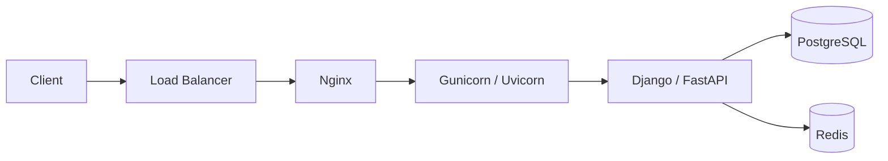
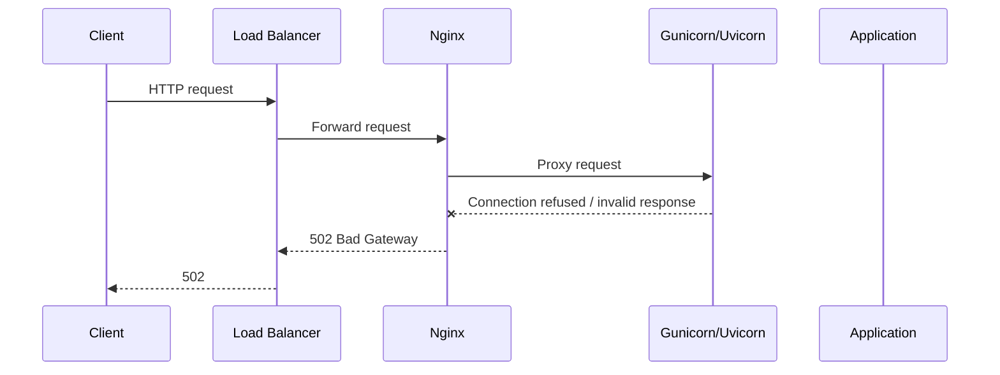
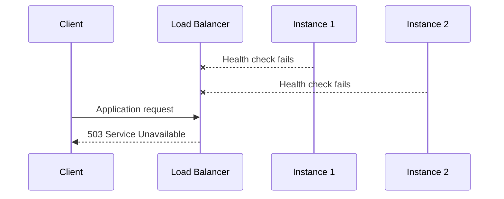
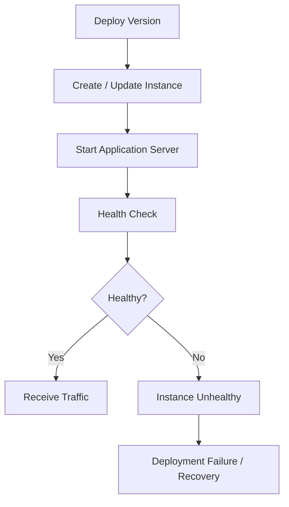
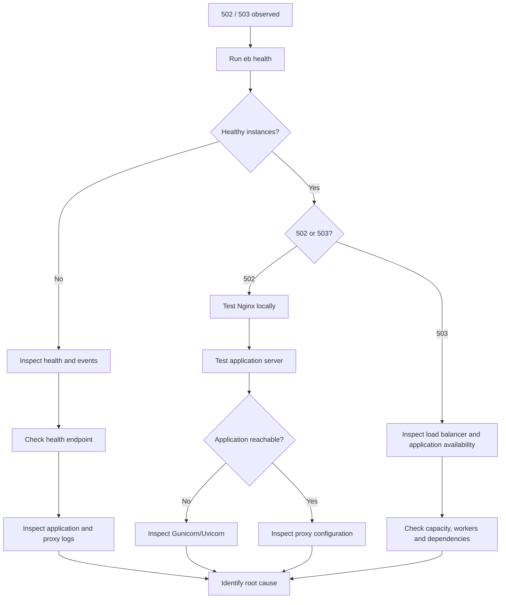

# 05- 502 and 503 Errors

## Overview

HTTP `502 Bad Gateway` and `503 Service Unavailable` errors are common failure modes in Elastic Beanstalk environments that use a load balancer and reverse proxy such as Nginx.

They are especially important because the HTTP status code identifies the **failure boundary**, not necessarily the root cause.

A typical Elastic Beanstalk request path is:



A failure can occur at several layers:

```text
Client
  ↓
Load Balancer
  ↓
Nginx
  ↓
Gunicorn / Uvicorn
  ↓
Django / FastAPI
  ↓
Database / Redis / External Services
```

The important distinction is:

- **502** usually means a gateway or proxy received an invalid or unusable response from an upstream service.
- **503** usually means the requested service is currently unavailable or has no usable capacity.
- Neither status code alone identifies the root cause.

The correct troubleshooting approach is to identify **which layer generated the response** and then trace the request toward the failed component.

## 502 Bad Gateway

### What It Means

A `502 Bad Gateway` generally means that a gateway or proxy received an invalid response from an upstream server.

In an Elastic Beanstalk environment, a common path is:

```text
Load Balancer
     ↓
Nginx
     ↓
Gunicorn / Uvicorn
     ↓
Application
```

If Nginx cannot obtain a valid response from Gunicorn or Uvicorn, it may return:

```http
HTTP/1.1 502 Bad Gateway
```

The important point is that the `502` may be generated by the proxy rather than by Django or FastAPI.

### Common Causes

| Cause | Typical symptom |
|---|---|
| Application server stopped | `502` consistently |
| Wrong upstream port | `502` consistently |
| Gunicorn/Uvicorn crashed | `502` after process failure |
| Application process restarting | Intermittent `502` |
| Connection refused | `502` |
| Upstream connection reset | Intermittent `502` |
| Invalid proxy configuration | `502` |
| Worker exhaustion | Intermittent or increasing `502` |
| Application startup failure | `502` after deployment |
| Resource exhaustion | `502` combined with high CPU/memory |

## 503 Service Unavailable

### What It Means

A `503 Service Unavailable` means the requested service is currently unable to handle the request.

In a load-balanced environment, this can occur when:

```text
Load Balancer
     ↓
No healthy instances
     ↓
503
```

It can also be generated by a proxy or application server.

Therefore:

> A `503` does not automatically mean that Elastic Beanstalk itself is broken.

### Common Causes

| Cause | Typical symptom |
|---|---|
| No healthy instances | Environment unavailable |
| All instances failed health checks | `503` from load-balancing layer |
| Application unavailable | `503` from proxy/application |
| Deployment temporarily removes capacity | Short-lived `503` |
| Application server overloaded | Intermittent `503` |
| Worker exhaustion | Requests rejected or delayed |
| Dependency failure | Application returns `503` |
| Proxy has no usable upstream | `503` |
| Capacity exhaustion | Increasing error rate |

## 502 Versus 503

The distinction is useful but should not be treated as absolute.

| Characteristic | `502 Bad Gateway` | `503 Service Unavailable` |
|---|---|---|
| General meaning | Invalid/unusable upstream response | Service temporarily unavailable |
| Typical boundary | Proxy/gateway | Load balancer, proxy, or application |
| Common cause | Upstream process unavailable or invalid response | No healthy capacity or service unavailable |
| Example | Nginx cannot connect to Gunicorn | Load balancer has no healthy instances |
| Primary investigation | Proxy → upstream | Environment → instance health |
| Automatically identifies root cause? | No | No |

The most reliable approach is to correlate the status code with:

- Elastic Beanstalk health
- Elastic Beanstalk events
- Nginx logs
- Application-server logs
- Application logs
- CloudWatch metrics
- Deployment history
- Instance resource utilization

## Request Failure Flow

A `502` often follows this pattern:



A `503` caused by lack of healthy instances can look like:



## First Troubleshooting Step

Do not immediately restart the environment.

Start by determining whether the problem affects:

- One instance
- Multiple instances
- All instances
- Only new instances
- Only requests to a specific endpoint
- All application requests

Use:

```bash
eb health
```

For continuously refreshed information:

```bash
eb health --refresh
```

Then inspect recent events:

```bash
eb events
```

This establishes whether the error coincides with:

- Deployment
- Instance replacement
- Health-check failure
- Configuration changes
- Application crashes
- Scaling activity

## Inspect Elastic Beanstalk Health

Run:

```bash
eb health
```

Look for:

```text
Healthy instances
Unhealthy instances
Instance status
Application version
Request activity
Latency
HTTP errors
```

The most important question is:

> Are there healthy instances capable of receiving traffic?

Consider these scenarios:

```text
1 healthy / 3 total
```

The environment may still serve traffic but has reduced redundancy.

```text
0 healthy / 3 total
```

A load balancer may have no usable target and return `503`.

```text
3 healthy / 3 total
```

A `502` may be occurring further down the request path.

## Inspect Elastic Beanstalk Events

Run:

```bash
eb events
```

Events help establish the timeline.

For example:

```text
14:00 Deployment started
14:01 New version deployed
14:01 Instance health changed
14:01 Application returned errors
14:02 Instance became unhealthy
14:02 Instance replacement started
```

This strongly suggests a deployment-related failure.

A different timeline:

```text
14:00 Environment healthy
14:15 CPU increased
14:17 Worker processes exhausted
14:18 502 errors increased
```

points toward capacity or application-server exhaustion.

## Retrieve Logs

Start with:

```bash
eb logs
```

For more detailed diagnostics, retrieve or inspect environment logs through the Elastic Beanstalk console and CloudWatch where configured.

Focus on:

- Nginx access logs
- Nginx error logs
- Gunicorn/Uvicorn logs
- Django/FastAPI logs
- Deployment logs
- System logs

Do not inspect application logs alone.

A `502` can occur before the request reaches Django or FastAPI.

## Nginx Error Logs

For Nginx-based environments, the error log is often one of the most valuable sources for `502` diagnosis.

Typical messages may indicate:

```text
connect() failed
connection refused
upstream timed out
upstream prematurely closed connection
upstream sent invalid response
```

These messages help identify the failure boundary.

For example:

```text
connect() failed (111: Connection refused)
```

strongly suggests that Nginx could not establish a connection to the upstream process.

Possible causes include:

- Gunicorn stopped
- Uvicorn stopped
- Wrong port
- Process restarting
- Process never started

## Check the Application Server

SSH into the affected instance:

```bash
eb ssh
```

Then inspect processes:

```bash
ps aux
```

For a more focused search:

```bash
ps aux | grep -E 'gunicorn|uvicorn'
```

Check listening ports:

```bash
ss -lntp
```

You are looking for a process listening on the expected application port.

For example:

```text
0.0.0.0:8000
```

If Nginx expects port `8000` but nothing is listening:

```text
Nginx
  ↓
127.0.0.1:8000
  ↓
Connection refused
  ↓
502
```

## Test the Application Locally

Testing from inside the instance is one of the fastest ways to isolate the failure.

First test the proxy:

```bash
curl -i http://127.0.0.1/healthz
```

Then test the application server directly if it listens on port `8000`:

```bash
curl -i http://127.0.0.1:8000/healthz
```

Interpret the results:

| Nginx | Application server | Likely conclusion |
|---|---|---|
| `200` | `200` | Local application path works |
| `502` | `200` | Proxy configuration/upstream issue |
| `502` | Connection refused | Application server unavailable |
| `502` | Timeout | Application server or dependency slow |
| `500` | `500` | Application-level failure |
| `503` | `503` | Application/server unavailable |

This is more useful than repeatedly testing the public URL.

## Test the Exact Health Endpoint

Identify the configured health-check path and test it directly:

```bash
curl -i http://127.0.0.1/healthz
```

Check:

- HTTP status
- Response time
- Redirects
- Headers
- Response body

For example:

```text
HTTP/1.1 200 OK
```

is different from:

```text
HTTP/1.1 302 Found
```

or:

```text
HTTP/1.1 500 Internal Server Error
```

A health endpoint should be predictable and inexpensive.

## Application Startup Failures Can Produce 502

Consider:

```text
Deployment
    ↓
New instance
    ↓
Gunicorn starts
    ↓
Django import fails
    ↓
Gunicorn exits
    ↓
Nginx has no upstream
    ↓
502
```

The visible error is:

```text
502 Bad Gateway
```

but the actual root cause is:

```text
Python application startup failure
```

Look for:

- `ModuleNotFoundError`
- Import errors
- Invalid environment variables
- Database initialization failures
- Missing dependencies
- Syntax errors
- Invalid settings
- Permission errors

## Gunicorn and Uvicorn Failures

For Django deployments, Gunicorn may be the application server.

For FastAPI, Uvicorn is commonly used directly or through a process manager.

Examples of failure paths:

```text
Nginx → Gunicorn → Django
```

or:

```text
Nginx → Uvicorn → FastAPI
```

If the application server exits, Nginx can produce `502`.

Check:

```bash
ps aux | grep gunicorn
```

or:

```bash
ps aux | grep uvicorn
```

Then inspect the relevant service/application logs.

## Wrong Port Configuration

A common production misconfiguration is:

```text
Nginx expects:
8000

Application listens on:
8080
```

The result:

```text
Nginx → :8000
           ✕
Application → :8080
```

Verify the actual listener:

```bash
ss -lntp
```

Then compare it with the proxy configuration.

Do not randomly change ports until the actual configuration is understood.

## Wrong Bind Address

An application may listen only on:

```text
127.0.0.1
```

or on:

```text
0.0.0.0
```

The correct binding depends on the architecture.

For a process accessed locally through Nginx:

```text
Nginx → 127.0.0.1:8000
```

can be valid.

For a process that must accept traffic from another network interface:

```text
0.0.0.0:8000
```

may be required.

The key is to match the application binding with the proxy/network architecture rather than blindly exposing ports.

## Upstream Timeout

A `502` or related gateway error can occur when the upstream does not respond appropriately within the configured timeout.

Possible causes include:

- Slow database query
- Deadlock
- External API delay
- CPU saturation
- Worker starvation
- Connection pool exhaustion

Trace:

```text
Client
  ↓
Load Balancer
  ↓
Nginx
  ↓
Application
  ↓
Database
```

If the application spends 30 seconds waiting on PostgreSQL, increasing the Nginx timeout may only hide the real performance problem.

Investigate:

- Application latency
- Database latency
- Connection pools
- Worker count
- CPU
- Memory
- External dependencies

## Worker Exhaustion

A process may be running but unable to handle new requests.

For example:

```text
Gunicorn
  ├── Worker 1 → busy
  ├── Worker 2 → busy
  ├── Worker 3 → busy
  └── Worker 4 → busy
```

New requests wait for available workers.

If requests remain blocked long enough, gateway errors and timeouts can increase.

Common causes include:

- Slow database operations
- Long-running HTTP requests
- Blocking external API calls
- CPU-heavy processing
- Synchronous work inside request handlers

The solution is not always "add more workers."

Increasing workers without considering CPU and memory can make the system less stable.

## Database Connection Exhaustion

A backend may be healthy at the process level but unable to establish database connections.

For example:

```text
Request
  ↓
Django
  ↓
PostgreSQL connection
  ↓
Connection pool exhausted
  ↓
Request waits
  ↓
Timeout
```

This can manifest as:

- `502`
- `503`
- `500`
- Increased latency

depending on where the failure is handled.

Investigate:

- PostgreSQL connection count
- Application connection pooling
- Long-running transactions
- Connection leaks
- Worker count
- Database capacity

## Redis Dependency Failures

Redis can also cause application requests to fail.

For example:

```text
Django
  ↓
Redis
  ↓
Connection timeout
  ↓
Application request fails
```

If Redis is only a cache, the application should ideally have an appropriate fallback strategy.

If Redis is a hard dependency for sessions or coordination, the failure may legitimately prevent the application from serving requests.

The architectural role of Redis determines how the failure should be handled.

## Health Check Failures and 503

Consider:

```text
Instance 1 → unhealthy
Instance 2 → unhealthy
Instance 3 → unhealthy
```

The load balancer may have no healthy target.

Then:

```text
Client
  ↓
Load Balancer
  ↓
No healthy targets
  ↓
503
```

In this case, troubleshooting the application endpoint alone is insufficient.

Investigate why the instances failed health checks.

Use:

```bash
eb health
```

and:

```bash
eb events
```

## Deployment-Related 502 and 503 Errors

A deployment can temporarily or permanently cause these errors.

Common causes include:

- Broken application version
- Incorrect environment variables
- Missing dependency
- Wrong startup command
- Wrong application server configuration
- Invalid proxy configuration
- Failed migrations
- Health-check path changed
- Incompatible database schema

A useful deployment timeline is:



If errors begin immediately after a deployment, compare the new version against the last known healthy version.

## Environment Variable Problems

A missing environment variable can cause the application process to start incorrectly or fail during initialization.

Example:

```python
import os

DATABASE_URL = os.environ["DATABASE_URL"]
```

If the variable is missing:

```text
Application startup
      ↓
DATABASE_URL missing
      ↓
Exception
      ↓
Process exits
      ↓
Nginx cannot reach application
      ↓
502
```

Verify environment configuration before changing infrastructure.

Be careful not to print secrets into logs while diagnosing environment variables.

## Failed Database Migrations

A deployment may fail because application code expects a database schema that does not exist.

Example:

```text
New application
      ↓
Queries new column
      ↓
Database schema is old
      ↓
Application errors
      ↓
Health check / requests fail
      ↓
502 / 503 / 500
```

Use backward-compatible migration strategies for production deployments.

Prefer:

```text
Expand
  ↓
Deploy compatible application
  ↓
Migrate
  ↓
Switch application behavior
  ↓
Contract
```

over making a single deployment depend on an immediately incompatible schema change.

## Resource Exhaustion

Check memory:

```bash
free -h
```

Check disk:

```bash
df -h
```

Check CPU:

```bash
top
```

Check processes:

```bash
ps aux --sort=-%cpu | head
```

and:

```bash
ps aux --sort=-%mem | head
```

Resource exhaustion can produce secondary symptoms such as:

```text
High CPU
  ↓
Request latency increases
  ↓
Workers become saturated
  ↓
Health checks fail
  ↓
Instances become unhealthy
  ↓
503
```

## Disk Exhaustion

Disk pressure can break seemingly unrelated components.

For example:

```text
Disk full
  ↓
Application cannot write logs/temp files
  ↓
Application behavior degrades
  ↓
Requests fail
```

Check:

```bash
df -h
```

Also inspect large directories when necessary:

```bash
du -sh /* 2>/dev/null | sort -h
```

Do not delete files blindly in production.

Determine whether the files belong to:

- Application logs
- Nginx logs
- System logs
- Temporary files
- Application data
- Deployment artifacts

## Security Group and Network Problems

A `502` can sometimes originate from network connectivity problems between the proxy and upstream.

Review:

- Security groups
- Subnet routing
- Network ACLs
- Listener configuration
- Instance ports

Avoid broad changes such as:

```text
Allow all traffic from 0.0.0.0/0
```

Use least-privilege network rules.

## Distinguishing Load Balancer Errors from Application Errors

The same status code can be generated by different layers.

Use response headers, logs, and request timing to identify the source.

A useful diagnostic model is:

```text
Public request
      ↓
Load Balancer
      ↓
Nginx
      ↓
Application server
      ↓
Application
```

Test each layer where possible.

For example:

```bash
curl -i https://api.example.com/healthz
```

Then from the instance:

```bash
curl -i http://127.0.0.1/healthz
```

Then directly against the application server:

```bash
curl -i http://127.0.0.1:8000/healthz
```

If the public request fails but both local tests succeed, investigate the load-balancer/network layer.

## Troubleshooting Decision Tree



## Practical Diagnostic Procedure

### Check Health

```bash
eb health
```

Ask:

- Are instances healthy?
- Are only some instances affected?
- Did health change recently?

### Check Events

```bash
eb events
```

Determine whether the problem started after:

- Deployment
- Configuration change
- Scaling
- Instance replacement

### Check Logs

```bash
eb logs
```

Look for correlated timestamps.

### SSH to an Affected Instance

```bash
eb ssh
```

### Check Processes

```bash
ps aux | grep -E 'gunicorn|uvicorn'
```

### Check Listening Ports

```bash
ss -lntp
```

### Test Nginx

```bash
curl -i http://127.0.0.1/healthz
```

### Test the Application Server

```bash
curl -i http://127.0.0.1:8000/healthz
```

### Check Resources

```bash
free -h
df -h
uptime
```

### Correlate With CloudWatch

Review:

- CPU utilization
- Network traffic
- Request count
- HTTP error counts
- Latency
- Instance health
- Application logs

## Common Failure Patterns

### Pattern: 502 Immediately After Deployment

```text
Deployment
    ↓
502
    ↓
Application process not running
```

Likely causes:

- Import error
- Missing dependency
- Invalid environment variable
- Invalid startup command
- Application server configuration error

### Pattern: 502 Only Under Load

```text
Low traffic → healthy
High traffic → 502
```

Likely causes:

- Worker exhaustion
- Connection pool exhaustion
- CPU saturation
- Memory pressure
- Slow downstream services

### Pattern: 503 With Zero Healthy Instances

```text
All instances unhealthy
        ↓
503
```

Investigate:

- Health-check path
- Application startup
- Health endpoint
- Security groups
- Proxy configuration
- Dependencies

### Pattern: One Instance Produces 502

```text
Instance A → healthy
Instance B → healthy
Instance C → 502
```

Likely causes:

- Instance-specific process failure
- Resource exhaustion
- Configuration drift
- Corrupted local state

Compare the affected instance with healthy instances.

### Pattern: 503 During Deployment

Short-lived `503` responses can occur when capacity is temporarily unavailable during certain deployment or scaling transitions.

For production systems, deployment strategy and health-check configuration should be designed to preserve sufficient healthy capacity.

## Common Mistakes

### Restarting Everything Immediately

Restarting the environment may temporarily hide the symptom without identifying the root cause.

Prefer:

```text
Observe
  ↓
Identify failing layer
  ↓
Collect evidence
  ↓
Correct root cause
  ↓
Validate
```

### Assuming 502 Means Load Balancer Failure

A `502` can be generated because Nginx cannot communicate with Gunicorn/Uvicorn.

Always inspect the proxy and upstream.

### Assuming 503 Means Application Code Failure

A `503` can result from having no healthy instances.

Check environment health first.

### Increasing Timeouts Without Diagnosis

Longer timeouts do not fix:

- Slow queries
- Worker exhaustion
- Connection leaks
- Deadlocks
- CPU saturation

### Adding More Workers Blindly

More workers consume more memory and may increase database connections.

Worker configuration must be based on:

- CPU
- Memory
- Request characteristics
- Blocking behavior
- Database capacity

### Ignoring Deployment Correlation

If errors began immediately after deployment, investigate the deployed version before modifying unrelated infrastructure.

### Logging Secrets While Debugging

Avoid commands or application changes that print:

- Database passwords
- API keys
- Access tokens
- Secret environment variables

Production debugging must preserve security boundaries.

### Opening Network Access Broadly

Do not solve a connectivity problem by exposing internal application ports publicly.

Use least-privilege network rules.

## Production Prevention

### Maintain a Lightweight Health Endpoint

Example:

```python
from django.http import JsonResponse


def healthz(request):
    return JsonResponse({"status": "ok"})
```

For FastAPI:

```python
from fastapi import FastAPI

app = FastAPI()


@app.get("/healthz")
async def healthz() -> dict[str, str]:
    return {"status": "ok"}
```

Keep the endpoint inexpensive and deterministic.

### Monitor Error Rates

Track:

- `4xx`
- `5xx`
- `502`
- `503`
- Latency
- Request volume
- Instance health

A sudden increase in `502` or `503` should trigger investigation before users report the outage.

### Monitor Application Resources

Track:

- CPU
- Memory
- Disk
- Network
- Process count
- Worker utilization

### Make Deployments Observable

Record:

- Application version
- Deployment start/end
- Health transitions
- Instance replacement
- Configuration changes

### Preserve Capacity During Deployments

Use deployment strategies that maintain sufficient healthy capacity for production traffic.

### Use Backward-Compatible Changes

Database and API changes should support safe transitions between application versions.

### Design Dependency Failure Behavior

For Redis, PostgreSQL, Kafka, and external APIs, explicitly determine:

```text
Hard dependency
or
Soft dependency
```

Then design application and health-check behavior accordingly.

## Production Incident Example

Suppose users suddenly receive:

```text
502 Bad Gateway
```

Start with:

```bash
eb health
```

Suppose the environment reports:

```text
All instances healthy
```

This makes a total load-balancer capacity failure less likely.

Next:

```bash
eb events
```

No recent deployment is visible.

Retrieve logs:

```bash
eb logs
```

Nginx reports:

```text
connect() failed (111: Connection refused) while connecting to upstream
```

SSH into an affected instance:

```bash
eb ssh
```

Check:

```bash
ps aux | grep gunicorn
```

No Gunicorn process is running.

Then:

```bash
ss -lntp
```

shows that the expected application port is not listening.

The investigation becomes:

```text
502
 ↓
Nginx
 ↓
Upstream connection refused
 ↓
Gunicorn not running
 ↓
Application server failure
 ↓
Inspect Gunicorn/application startup logs
```

The important lesson is that the HTTP status code was only the starting point. The actual root cause was identified by tracing the request path.

## Key Takeaways

- `502 Bad Gateway` generally indicates that a gateway or proxy could not obtain a valid response from its upstream service.
- `503 Service Unavailable` generally indicates that the requested service currently cannot handle the request.
- Neither status code alone identifies the root cause.
- `502` commonly requires investigation of Nginx, Gunicorn/Uvicorn, application startup, ports, and upstream connectivity.
- `503` commonly requires investigation of Elastic Beanstalk health, load-balancer targets, capacity, and service availability.
- Always start with:
  ```bash
  eb health
  eb events
  ```
- Use:
  ```bash
  eb logs
  ```
  to correlate errors with application, proxy, and deployment activity.
- Use `eb ssh` to inspect an affected instance directly.
- `ps aux` and `ss -lntp` are useful for determining whether the application server is actually running and listening.
- Test the request path locally with `curl` to distinguish application, proxy, and external networking problems.
- A running EC2 instance does not guarantee that the application server is available.
- A running Gunicorn/Uvicorn process does not guarantee that the application can successfully serve requests.
- A healthy application process does not guarantee that all downstream dependencies are available.
- Worker exhaustion, database connection exhaustion, CPU saturation, and memory pressure can produce gateway failures under load.
- A wrong upstream port or failed application-server process is a common cause of `502`.
- Zero healthy instances is a common cause of `503`.
- Deployment-related errors should be investigated against the newly deployed application version before changing unrelated infrastructure.
- Health-check failures and user-facing `502`/`503` errors should be correlated with application logs and infrastructure metrics.
- Do not blindly increase timeouts, add workers, restart instances, or open security groups.
- Trace the request from the load balancer through Nginx, the application server, the application, and its dependencies.
- The goal of troubleshooting is not merely to remove the `502` or `503`; it is to identify and correct the failure boundary that produced it.