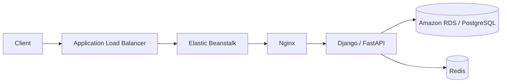
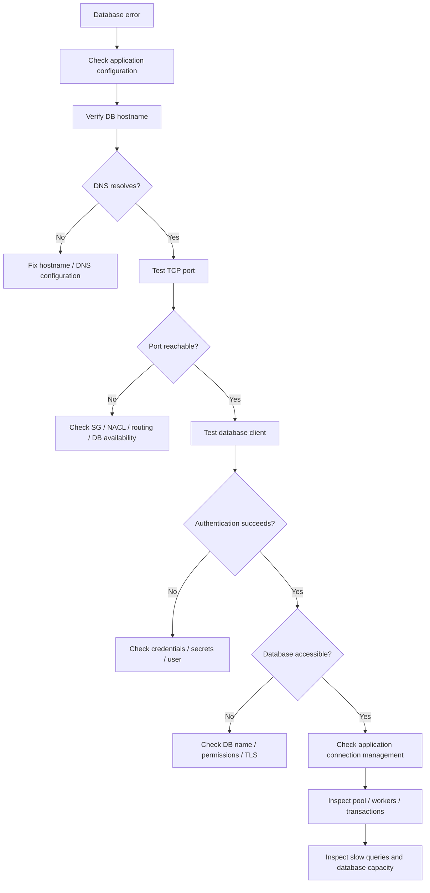
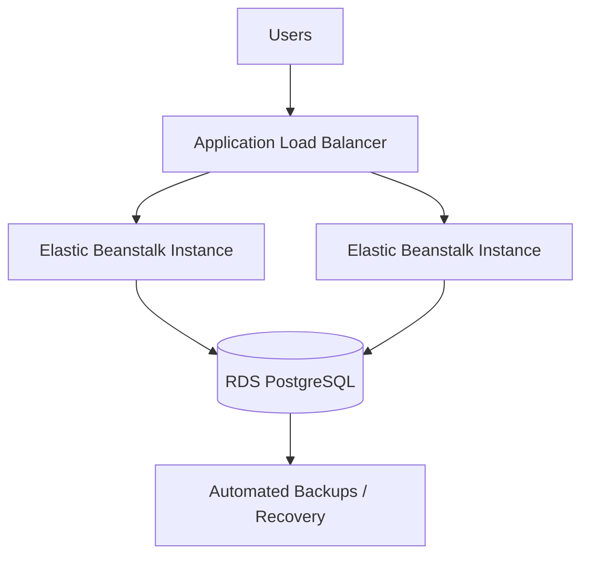

# 06- Database Connectivity Issues

## Overview

Database connectivity failures are a common cause of application startup failures, health-check failures, `500` responses, and downstream `502`/`503` errors in AWS Elastic Beanstalk environments.

For a typical backend application, the request path is:

```text
Client
  ↓
Load Balancer
  ↓
Elastic Beanstalk Instance
  ↓
Nginx
  ↓
Gunicorn / Uvicorn
  ↓
Django / FastAPI
  ↓
Database
```

A database failure can therefore appear as an application or infrastructure failure even though the underlying problem is network connectivity, authentication, DNS, database capacity, or connection management.

A production troubleshooting process should isolate the failure into one of these layers:

```text
Application configuration
        ↓
DNS resolution
        ↓
Network routing
        ↓
Security groups / NACLs
        ↓
TCP connectivity
        ↓
TLS
        ↓
Database authentication
        ↓
Connection pool
        ↓
SQL execution
```

The goal is to identify the **first failing layer**, rather than repeatedly restarting instances or modifying unrelated infrastructure.

## Database Connectivity Architecture

A common production architecture is:



The application instance typically communicates with the database over a private VPC network.

For PostgreSQL:

```text
Application Instance
       |
       | TCP 5432
       ↓
RDS PostgreSQL
```

For MySQL:

```text
Application Instance
       |
       | TCP 3306
       ↓
RDS MySQL
```

The database should generally not be exposed directly to the public internet simply because the application needs access to it.

## Failure Layers

| Layer | Example failure | Typical symptom |
|---|---|---|
| Configuration | Wrong `DATABASE_URL` | Application startup failure |
| DNS | Invalid hostname | Host resolution error |
| Routing | Incorrect subnet route | Connection timeout |
| Security group | Port blocked | Connection timeout |
| NACL | Traffic denied | Connection timeout |
| Database listener | Wrong port | Connection refused/timeout |
| TLS | Certificate/configuration issue | SSL error |
| Authentication | Wrong credentials | Authentication failure |
| Database capacity | Too many connections | Connection rejected |
| Connection pool | Pool exhausted | Request timeout |
| SQL | Invalid query/schema | Application-level error |

## Configuration Problems

Database connectivity begins with the application's configuration.

Typical Django configuration:

```python
import os

DATABASES = {
    "default": {
        "ENGINE": "django.db.backends.postgresql",
        "NAME": os.environ["DB_NAME"],
        "USER": os.environ["DB_USER"],
        "PASSWORD": os.environ["DB_PASSWORD"],
        "HOST": os.environ["DB_HOST"],
        "PORT": os.environ.get("DB_PORT", "5432"),
    }
}
```

FastAPI applications using SQLAlchemy commonly use a database URL:

```python
import os

DATABASE_URL = os.environ["DATABASE_URL"]
```

A production failure may result from:

- Missing environment variable
- Incorrect hostname
- Incorrect port
- Incorrect database name
- Incorrect username
- Incorrect password
- Incorrect connection-string format
- Incorrect SSL configuration

The first step is to verify the configuration **without exposing credentials**.

Never debug by printing:

```python
print(os.environ)
```

because this can leak database passwords, tokens, and other secrets.

## Verify Environment Variables Safely

On an Elastic Beanstalk instance:

```bash
env | grep '^DB_'
```

This is safer than printing the entire environment, but credentials should still not be displayed unnecessarily.

For a non-secret variable:

```bash
echo "$DB_HOST"
```

For example:

```text
mydb.abc123xyz.us-east-1.rds.amazonaws.com
```

Do not run:

```bash
echo "$DB_PASSWORD"
```

in production terminals or shared troubleshooting sessions.

## Verify the Database Host

Check the configured host:

```bash
echo "$DB_HOST"
```

Then test DNS resolution:

```bash
getent hosts "$DB_HOST"
```

If available:

```bash
nslookup "$DB_HOST"
```

or:

```bash
dig "$DB_HOST"
```

A successful DNS lookup establishes that the hostname resolves.

It does **not** prove that the database is reachable.

The diagnostic progression is:

```text
Hostname configured
       ↓
DNS resolves
       ↓
Network route exists
       ↓
TCP port reachable
       ↓
TLS succeeds
       ↓
Authentication succeeds
       ↓
Database accepts queries
```

## DNS Failures

A DNS problem can occur because of:

- Incorrect hostname
- Typographical error
- Wrong AWS region endpoint
- Incorrect environment configuration
- VPC DNS configuration problems

Typical errors include:

```text
could not translate host name
Name or service not known
Temporary failure in name resolution
```

If DNS resolution fails, do not start by changing security groups.

Security groups cannot fix a hostname that does not resolve.

## Test TCP Connectivity

For PostgreSQL:

```bash
nc -vz "$DB_HOST" 5432
```

For MySQL:

```bash
nc -vz "$DB_HOST" 3306
```

Alternatively:

```bash
timeout 5 bash -c "</dev/tcp/$DB_HOST/5432"
```

The purpose is to answer:

> Can this Elastic Beanstalk instance establish a TCP connection to the database endpoint and port?

This test does not verify:

- Database credentials
- Database name
- SQL permissions
- Application configuration
- TLS configuration

It only tests network-level reachability.

## Connection Timeout Versus Connection Refused

The distinction is useful during diagnosis.

### Connection Timeout

Typical meaning:

```text
Application
    ↓
Network path
    ↓
No response
    ↓
Timeout
```

Possible causes:

- Security group blocking traffic
- Network ACL blocking traffic
- Routing problem
- Wrong network
- Incorrect endpoint
- Database unavailable
- Network-level connectivity issue

### Connection Refused

Typical meaning:

```text
Application
    ↓
Host reachable
    ↓
Port actively rejects connection
```

Possible causes:

- Wrong port
- Service not listening
- Database unavailable
- Incorrect endpoint
- Intermediate network behavior

Do not treat timeout and refusal as identical failures.

## Security Group Configuration

The database security group should allow inbound traffic from the application security group on the database port.

A typical architecture is:


For PostgreSQL:

```text
RDS Security Group
Inbound:
TCP 5432
Source:
Elastic Beanstalk Instance Security Group
```

For MySQL:

```text
RDS Security Group
Inbound:
TCP 3306
Source:
Elastic Beanstalk Instance Security Group
```

Prefer referencing the application security group rather than allowing an entire internet CIDR.

Avoid:

```text
0.0.0.0/0 → TCP 5432
```

This exposes the database port broadly and violates normal production security practices.

## Security Group Troubleshooting

When connectivity fails, verify:

- Application instance security group
- Database security group
- Database listener port
- Source security group
- VPC
- Subnet placement
- Network ACLs
- Routing

The most common secure model is:

```text
Internet
   ↓
Load Balancer
   ↓
Application SG
   ↓
Database SG
   ↓
RDS
```

The database should not need to accept traffic directly from arbitrary internet clients.

## Network ACL Considerations

Network ACLs are stateless, unlike security groups.

Therefore, troubleshooting NACL-related connectivity requires considering both:

- Outbound traffic
- Return traffic

A restrictive NACL can break a connection even when security groups appear correct.

If security groups are correct but TCP connections consistently time out, investigate:

- Subnet NACLs
- Route tables
- VPC configuration
- Network paths

Do not modify NACLs blindly in production.

## Route Tables

The Elastic Beanstalk subnet must have an appropriate route to the database subnet.

For private VPC architectures, application and database subnets are commonly connected through the VPC's internal routing.

The important distinction is:

```text
Application subnet
       ↓
VPC routing
       ↓
Database subnet
```

An internet gateway is not required simply because the application needs to communicate with an RDS instance inside the same VPC.

## Verify the Database Endpoint

Use the actual database endpoint rather than hard-coding an instance IP address.

For RDS, the endpoint resembles:

```text
mydb.xxxxx.region.rds.amazonaws.com
```

Do not build application configuration around a database instance's private IP.

Database endpoints provide an abstraction that supports AWS-managed database lifecycle operations.

## Verify the Database Port

PostgreSQL commonly uses:

```text
5432
```

MySQL commonly uses:

```text
3306
```

But the configured database port may differ.

Always verify the actual database configuration rather than assuming the default.

A mismatch such as:

```text
Application → 5432
Database → 5433
```

will produce connectivity failures even when the network configuration is correct.

## Test PostgreSQL Connectivity

If the PostgreSQL client is installed:

```bash
psql \
  --host="$DB_HOST" \
  --port="${DB_PORT:-5432}" \
  --username="$DB_USER" \
  --dbname="$DB_NAME"
```

This provides a much stronger test than `nc`.

It tests:

```text
DNS
 ↓
Network
 ↓
TCP
 ↓
PostgreSQL protocol
 ↓
Authentication
 ↓
Database selection
```

If this succeeds but Django fails, the problem is likely inside the application configuration or connection-management layer.

## Test MySQL Connectivity

For MySQL:

```bash
mysql \
  --host="$DB_HOST" \
  --port="${DB_PORT:-3306}" \
  --user="$DB_USER" \
  --password \
  "$DB_NAME"
```

Enter the password interactively rather than putting it directly into shell history.

Avoid:

```bash
mysql -u user -pSuperSecretPassword ...
```

because the password can be exposed through shell history or process inspection.

## PostgreSQL Connection Errors

Common PostgreSQL errors include:

```text
could not translate host name
```

Usually investigate:

- DNS
- Hostname
- Environment variables

```text
connection timed out
```

Usually investigate:

- Security groups
- NACLs
- Routing
- Database availability
- Network path

```text
connection refused
```

Usually investigate:

- Port
- Database availability
- Endpoint
- Listener

```text
password authentication failed
```

Usually investigate:

- Username
- Password
- Authentication configuration
- Secret rotation

```text
database does not exist
```

Usually investigate:

- Database name
- Environment configuration
- Database provisioning

## Application-Level Database Failures

Not every database problem is a network problem.

For example:

```text
Application → PostgreSQL
                  ↓
             Connection succeeds
                  ↓
             SQL executes
                  ↓
             Query fails
```

Potential causes:

- Missing table
- Missing column
- Permission denied
- Invalid SQL
- Migration not applied
- Constraint violation

These failures should be investigated separately from connectivity.

## Migration Problems

A common Elastic Beanstalk deployment failure is:

```text
Application version N
       ↓
Expected schema N
       ↓
Database schema N-1
       ↓
SQL / ORM failure
```

For Django:

```bash
python manage.py showmigrations
```

Then inspect migration status before applying changes.

A migration failure should not automatically result in repeatedly restarting application instances.

## Database Permissions

A successful TCP connection does not mean the application user has sufficient permissions.

For example:

```text
TCP connection → successful
Authentication → successful
Database access → denied
```

Potential issues include:

- Missing database privileges
- Wrong schema permissions
- Missing table permissions
- Incorrect role configuration

Distinguish:

```text
Authentication
```

from:

```text
Authorization
```

Authentication answers:

> Who are you?

Authorization answers:

> What are you allowed to access?

## Database Connection Pool Exhaustion

A production application may fail even though the database itself is healthy.

Example:

```text
Application
├── Worker 1 → DB connection
├── Worker 2 → DB connection
├── Worker 3 → DB connection
├── Worker 4 → DB connection
└── Worker 5 → waiting
```

If every available database connection is consumed, new requests may block or fail.

Typical symptoms include:

```text
too many connections
connection pool exhausted
timeout acquiring connection
```

The root cause may be:

- Too many application workers
- Too many application instances
- Excessive pool size
- Connection leaks
- Long-running transactions
- Slow queries

## Worker Count and Database Capacity

Suppose:

```text
3 EC2 instances
×
4 Gunicorn workers
=
12 application workers
```

If each worker can maintain several database connections, the aggregate connection count can grow quickly.

Therefore, database connection capacity must be considered across the entire Elastic Beanstalk environment.

Do not calculate database capacity from one instance only.

A useful model is:

```text
Total potential connections
≈
Instances
×
Workers per instance
×
Connections per worker
```

The exact behavior depends on the framework, driver, pooling strategy, and connection lifecycle.

## Django Connection Management

Django manages database connections according to its database configuration and request lifecycle.

A common production setting is:

```python
DATABASES = {
    "default": {
        "ENGINE": "django.db.backends.postgresql",
        "NAME": os.environ["DB_NAME"],
        "USER": os.environ["DB_USER"],
        "PASSWORD": os.environ["DB_PASSWORD"],
        "HOST": os.environ["DB_HOST"],
        "PORT": os.environ.get("DB_PORT", "5432"),
        "CONN_MAX_AGE": 60,
    }
}
```

Persistent connections can reduce connection establishment overhead, but they also affect database connection consumption.

Do not select `CONN_MAX_AGE` without considering:

- Number of instances
- Worker count
- Database connection limits
- Request traffic
- Connection pooling

## SQLAlchemy Connection Pools

FastAPI applications commonly use SQLAlchemy.

A simplified configuration may look like:

```python
from sqlalchemy import create_engine

engine = create_engine(
    database_url,
    pool_size=10,
    max_overflow=5,
    pool_pre_ping=True,
)
```

The important production consideration is that pool settings are **per application process**.

For example:

```text
3 instances
×
4 processes
×
10 pool connections
=
120 potential pooled connections
```

The actual behavior depends on when pools are initialized and how the application is deployed, but the multiplication effect is an important capacity-planning consideration.

## Connection Pool Best Practices

Consider:

- Maximum database connections
- Application instance count
- Worker count
- Pool size
- Connection lifetime
- Idle connections
- Query duration
- Database failover behavior

Avoid setting:

```text
pool_size = extremely large
```

simply to eliminate connection wait time.

The database itself has finite resources.

## RDS Connection Limits

Database capacity is not infinite.

Connection limits depend on the database engine, instance class, configuration, and workload.

Monitor:

- Current connections
- Connection utilization
- CPU
- Memory
- Read/write latency
- Database load
- Connection errors

A backend can overload a database through connection count even when request traffic itself appears reasonable.

## Slow Queries

A connectivity incident can actually be a database performance incident.

For example:

```text
Database connections available
        ↓
Query begins
        ↓
Query takes 30 seconds
        ↓
Connection remains occupied
        ↓
More requests arrive
        ↓
Connection pool fills
        ↓
Requests block
        ↓
Application latency increases
```

Eventually this can result in:

```text
502
503
504
500
```

depending on where the request fails.

Investigate:

- Slow SQL
- Missing indexes
- Lock contention
- Long transactions
- Connection pool exhaustion
- Database CPU
- Database I/O

## Database Locks

A long-running transaction can block other operations.

Example:

```text
Transaction A
    ↓
Locks row/table
    ↓
Transaction B waits
    ↓
Connection remains occupied
    ↓
Application pool fills
```

This is why database troubleshooting should include transaction behavior, not just connectivity tests.

## TLS and SSL Problems

Production databases may require encrypted connections.

A connectivity failure can occur after TCP connectivity has already succeeded:

```text
DNS
 ↓
TCP
 ↓
TLS
 ↓
Authentication
```

Possible symptoms include:

```text
SSL connection error
certificate verification failed
no pg_hba.conf entry requiring SSL
```

The exact error depends on the database engine and client.

Do not disable certificate verification as a generic troubleshooting step.

Instead verify:

- SSL mode
- CA certificate
- Database certificate
- Client configuration
- Server requirements

## Secrets and Credential Rotation

Database passwords should not be hard-coded into:

- Git repositories
- Docker images
- Source files
- Shell scripts
- CI logs

Use an appropriate secret-management strategy and ensure the Elastic Beanstalk environment receives the current configuration.

When rotating credentials, consider:

```text
Old credential
     ↓
Application configuration
     ↓
Credential rotation
     ↓
Application restart / configuration refresh
     ↓
New credential
```

A mismatch between the database credential and the environment configuration can cause immediate authentication failures.

## Database Availability

Before troubleshooting application code, determine whether the database itself is available.

Check:

- RDS status
- Database events
- Availability
- Maintenance activity
- Failover activity
- Storage
- CPU
- Memory
- Connection count

A database outage can produce application-level failures that look like Elastic Beanstalk problems.

## Multi-AZ Considerations

For production workloads requiring high availability, database architecture should account for database failure and failover.

Application configuration should use the database endpoint abstraction provided by the managed database service rather than embedding a specific instance IP.

The application should also tolerate transient connection failures during database failover where appropriate.

For example:

```text
Application
    ↓
RDS endpoint
    ↓
Primary database
    ↓
Failure
    ↓
Failover
    ↓
New primary
```

Applications may need retry and reconnection behavior appropriate to their database driver and workload.

## Retry Strategy

Retries can help with transient database failures but can also amplify an outage.

Bad pattern:

```text
Request
 ↓
DB fails
 ↓
Retry immediately
 ↓
Retry immediately
 ↓
Retry immediately
```

Across thousands of requests, this can create a retry storm.

Prefer bounded retries with backoff for operations where retrying is safe.

Conceptually:

```text
Attempt 1
   ↓
failure
   ↓
short backoff
   ↓
Attempt 2
   ↓
failure
   ↓
longer backoff
```

Do not blindly retry non-idempotent database operations.

## Health Checks and Database Dependencies

A health endpoint can be designed in different ways.

A lightweight liveness check:

```text
/healthz
```

may only verify that the application process is running.

A deeper readiness check:

```text
/ready
```

may verify that critical dependencies are available.

For example:

```text
/healthz
  → process alive

/ready
  → database reachable
  → critical dependencies available
```

Be careful about making every health check perform expensive database queries.

An unhealthy database should not necessarily cause an application process to restart repeatedly.

The correct behavior depends on whether the application can serve useful traffic without the database and how Elastic Beanstalk health is configured.

## Troubleshooting Workflow

Use this progression:



## Practical Troubleshooting Procedure

### Check Application Configuration

Verify:

```bash
echo "$DB_HOST"
echo "$DB_PORT"
echo "$DB_NAME"
echo "$DB_USER"
```

Do not expose:

```bash
echo "$DB_PASSWORD"
```

### Check DNS

```bash
getent hosts "$DB_HOST"
```

### Check TCP Connectivity

PostgreSQL:

```bash
nc -vz "$DB_HOST" "${DB_PORT:-5432}"
```

MySQL:

```bash
nc -vz "$DB_HOST" "${DB_PORT:-3306}"
```

### Test the Database Client

PostgreSQL:

```bash
psql \
  --host="$DB_HOST" \
  --port="${DB_PORT:-5432}" \
  --username="$DB_USER" \
  --dbname="$DB_NAME"
```

MySQL:

```bash
mysql \
  --host="$DB_HOST" \
  --port="${DB_PORT:-3306}" \
  --user="$DB_USER" \
  --password \
  "$DB_NAME"
```

### Check Elastic Beanstalk Health

```bash
eb health
```

### Check Recent Events

```bash
eb events
```

### Retrieve Application Logs

```bash
eb logs
```

### Inspect the Instance

```bash
eb ssh
```

Then:

```bash
free -h
df -h
uptime
```

### Check Application Processes

```bash
ps aux | grep -E 'gunicorn|uvicorn'
```

### Check Database-Related Application Logs

Look for:

```text
connection refused
connection timed out
authentication failed
too many connections
connection pool exhausted
SSL error
database does not exist
permission denied
```

## Failure Classification Table

| Error | Most likely layer |
|---|---|
| `could not translate host name` | DNS/configuration |
| `Name or service not known` | DNS/configuration |
| `connection timed out` | Network/security/routing |
| `connection refused` | Port/service/database |
| `password authentication failed` | Credentials |
| `database does not exist` | Database configuration |
| `too many connections` | Database capacity/pooling |
| `SSL connection error` | TLS configuration |
| `permission denied` | Database authorization |
| `relation does not exist` | Schema/migration |
| `deadlock detected` | Database transaction behavior |
| `lock timeout` | Database contention |

## Common Production Mistakes

### Opening Database Port to the Internet

Bad:

```text
0.0.0.0/0 → TCP 5432
```

Better:

```text
Elastic Beanstalk Instance SG → RDS SG → TCP 5432
```

### Hard-Coding Database IP Addresses

Database endpoints should be used instead of relying on mutable instance IP addresses.

### Assuming Ping Proves Connectivity

`ping` is not an appropriate database connectivity test.

A database may be reachable over TCP while ICMP is blocked.

Use:

```bash
nc -vz "$DB_HOST" 5432
```

or the actual database client.

### Testing Only From a Developer Laptop

A developer machine may have:

```text
Internet access
```

while the Elastic Beanstalk instance has:

```text
different subnet
different security group
different route
different DNS context
```

Always test connectivity from the actual application environment.

### Increasing Connection Pool Size Blindly

Larger pools can increase database connection pressure and make outages worse.

### Ignoring Database Failover

Applications should be designed to tolerate transient connection failures where appropriate.

### Retrying Aggressively

Retries without backoff can turn a partial database outage into a larger incident.

### Storing Credentials in Source Control

Database credentials belong in secure configuration or secret-management systems, not Git.

### Running Expensive Health Checks

A health check that executes heavy database queries can amplify an outage by generating additional database load.

### Treating Every Database Error as a Network Problem

Once TCP connectivity and authentication succeed, investigate:

- SQL
- Permissions
- Schema
- Transactions
- Locks
- Pooling
- Database capacity

## Production Monitoring

Monitor the application and database together.

### Application Metrics

Track:

- Request latency
- Error rate
- `500` responses
- `502` responses
- `503` responses
- Database connection errors
- Connection pool utilization
- Request concurrency

### Database Metrics

Track:

- CPU utilization
- Memory pressure
- Database connections
- Read latency
- Write latency
- I/O
- Storage
- Database load
- Lock activity
- Query latency

### Infrastructure Metrics

Track:

- Instance health
- Instance count
- CPU
- Network traffic
- Deployment events
- Application process health

The important operational principle is:

> Application health and database health must be observed as one dependency chain.

## Production Architecture Recommendations

A robust architecture should generally look like:



Recommended characteristics:

- Private database connectivity
- Security-group-based access
- Multiple application instances where required
- Managed database service
- Database backups
- Monitoring and alerting
- Controlled deployment strategy
- Secure credential management
- Connection capacity planning

## Incident Example

Suppose a Django application begins returning:

```text
500 Internal Server Error
```

Immediately after a deployment.

Application logs contain:

```text
django.db.utils.OperationalError:
could not connect to server: Connection timed out
```

Start with:

```bash
eb ssh
```

Then:

```bash
getent hosts "$DB_HOST"
```

DNS succeeds.

Next:

```bash
nc -vz "$DB_HOST" 5432
```

The connection times out.

The application code is therefore unlikely to be the first failing layer.

Investigate:

```text
Elastic Beanstalk instance
       ↓
VPC routing
       ↓
Security group
       ↓
Network ACL
       ↓
RDS
```

Suppose the RDS security group was recently modified and no longer allows inbound PostgreSQL traffic from the Elastic Beanstalk instance security group.

The root cause is:

```text
Incorrect RDS security-group rule
```

not:

```text
Django failure
```

The troubleshooting process successfully moved from application symptoms to the actual infrastructure failure.

## Key Takeaways

- Database connectivity failures can appear as application, health-check, `500`, `502`, or `503` failures.
- Troubleshoot database connectivity from the application instance, not only from a developer machine.
- Diagnose in layers:
  ```text
  Configuration
  → DNS
  → Routing
  → Security groups/NACLs
  → TCP
  → TLS
  → Authentication
  → Database permissions
  → Connection pool
  → SQL
  ```
- `getent hosts` is useful for validating DNS resolution.
- `nc -vz` is useful for validating TCP connectivity.
- `psql` and `mysql` provide stronger end-to-end database connectivity tests.
- A successful TCP connection does not prove that authentication, authorization, TLS, or SQL execution will succeed.
- A timeout usually points toward network, security, routing, or availability problems.
- An authentication error points toward credentials or database-user configuration.
- `too many connections` usually requires investigation of application workers, connection pools, instance count, and database capacity.
- Database security groups should normally allow access from the application security group rather than from the public internet.
- Do not expose PostgreSQL or MySQL directly to `0.0.0.0/0`.
- Do not hard-code database IP addresses.
- Database connection capacity must be calculated across all Elastic Beanstalk instances and application processes.
- More application workers can increase database connection pressure.
- Larger connection pools do not automatically improve application performance.
- Slow queries and long-running transactions can consume connections and eventually appear as connectivity failures.
- Health checks should be lightweight and should distinguish process liveness from dependency readiness where appropriate.
- Retry transient database failures carefully and use bounded retries with backoff.
- Avoid retry storms during database outages.
- Database credentials should never be committed to source control or exposed through logs.
- RDS endpoint-based connectivity should be used instead of hard-coded database instance IP addresses.
- For production systems, combine application, Elastic Beanstalk, and database monitoring to identify dependency failures quickly.
- The most important troubleshooting principle is to identify the **first failing layer**, rather than treating every database error as an application-code problem.