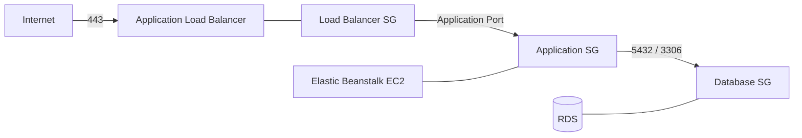
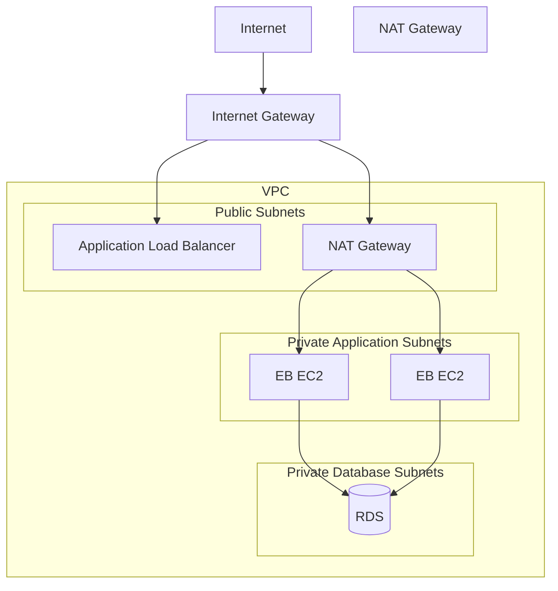
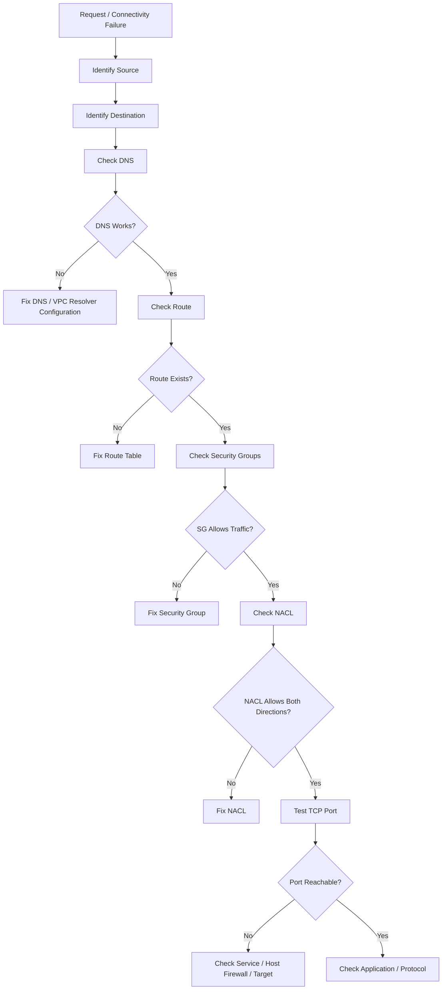

# 07- Security Group and Network Issues

## Overview

Security-group and network failures are among the most common causes of unreachable applications, failed database connections, unhealthy Elastic Beanstalk environments, and `502`/`503` responses.

Elastic Beanstalk does not create an isolated networking model of its own. The application runs on AWS compute resources inside a VPC and therefore depends on standard AWS networking components:

```text
Elastic Beanstalk
      │
      ├── EC2 instances
      │      │
      │      ├── Security Groups
      │      ├── Subnets
      │      └── Network Interfaces
      │
      ├── Load Balancer
      │      └── Security Group
      │
      └── VPC
             ├── Route Tables
             ├── Network ACLs
             ├── Internet/NAT Gateways
             └── RDS / Redis / Other Services
```

A useful troubleshooting principle is to identify the exact network hop that fails rather than changing multiple AWS resources simultaneously.

For an application request:

```text
Client
  ↓
DNS
  ↓
Load Balancer
  ↓
Load Balancer Security Group
  ↓
Elastic Beanstalk Instance Security Group
  ↓
EC2 Instance
  ↓
Application
  ↓
Database / Redis / External Service
```

Every transition can fail independently.

## Network Components Relevant to Elastic Beanstalk

| Component | Responsibility | Typical failure |
|---|---|---|
| VPC | Network boundary | Incorrect architecture |
| Subnet | IP address range and placement | Wrong subnet selection |
| Route table | Determines where traffic goes | Missing route |
| Security group | Stateful traffic filtering | Port blocked |
| Network ACL | Stateless subnet filtering | Traffic or return traffic blocked |
| Internet Gateway | Internet connectivity for public subnets | Missing public route |
| NAT Gateway | Outbound internet access from private subnets | Missing/failed NAT path |
| Load Balancer | Receives and forwards application traffic | Unhealthy targets |
| EC2 instance | Runs application | Incorrect security group or subnet |
| DNS | Resolves endpoints | Resolution failure |
| RDS | Database service | Inaccessible database port |

## Security Groups

A security group is a stateful virtual firewall attached to resources such as EC2 instances and load balancers.

For Elastic Beanstalk, security groups commonly protect two distinct layers:

```text
Internet
   ↓
Application Load Balancer
   │
   │ SG-LB
   ↓
EC2 Instance
   │
   │ SG-APP
   ↓
RDS
   │
   │ SG-DB
```

A production architecture should generally separate these security boundaries rather than allowing unrestricted communication between every component.

## Security Group Rules

A security group rule contains concepts such as:

- Protocol
- Port or port range
- Source for inbound traffic
- Destination for outbound traffic

Example:

```text
Load Balancer SG
Inbound:
TCP 443
Source: 0.0.0.0/0

Application SG
Inbound:
TCP application-port
Source: Load Balancer SG

Database SG
Inbound:
TCP 5432
Source: Application SG
```

This creates a controlled dependency chain:

```text
Internet
   ↓ 443
Load Balancer SG
   ↓ application port
Application SG
   ↓ 5432
Database SG
```

## Stateful Behavior

Security groups are stateful.

If an inbound connection is allowed, the response traffic is automatically allowed for that established flow.

For example:

```text
Client
  │
  │ TCP 443
  ↓
Load Balancer
  │
  │ response
  ↑
Client
```

You do not normally need to create a separate inbound rule for the response traffic.

This differs from network ACLs, which are stateless.

## Security Group Referencing

When AWS resources communicate inside a VPC, referencing another security group is generally preferable to broad CIDR-based rules.

For example:

```text
RDS SG
Inbound:
TCP 5432
Source: Application SG
```

This expresses the architectural relationship:

> Instances belonging to the application security group may access PostgreSQL.

It is more maintainable than:

```text
TCP 5432
Source: 10.0.2.0/24
```

when the subnet structure may change.

## Common Security Group Architecture

A typical Elastic Beanstalk application can use:



The important security property is that each layer trusts only the layer that needs access.

## Load Balancer Security Group Issues

A common production configuration is:

```text
Internet
   ↓
ALB
```

The load balancer security group normally permits:

```text
TCP 80  from Internet
TCP 443 from Internet
```

depending on whether HTTP is required.

If HTTPS is the only intended public protocol, avoid exposing unnecessary ports.

The load balancer then communicates with the Elastic Beanstalk instances using the configured application listener port.

## Load Balancer to Instance Traffic

The load balancer must be able to reach the application instances.

Conceptually:

```text
Client
   ↓ HTTPS
ALB
   ↓ HTTP/application port
EC2
   ↓
Gunicorn / Uvicorn
   ↓
Django / FastAPI
```

If the load balancer cannot connect to the instance, the instance may appear unhealthy even though the application process itself is running.

Typical causes include:

- Instance security group blocks the application port
- Incorrect listener configuration
- Incorrect target port
- Application listening on the wrong interface
- Application listening on the wrong port
- Host-level firewall
- Application process not running

## Binding to the Correct Interface

A backend process must listen on an interface reachable by the load balancer.

For example, binding only to:

```text
127.0.0.1
```

means the process accepts connections only from the local machine.

A production application commonly needs to bind to:

```text
0.0.0.0
```

Example:

```bash
gunicorn \
  --bind 0.0.0.0:8000 \
  config.wsgi:application
```

For Uvicorn:

```bash
uvicorn main:app --host 0.0.0.0 --port 8000
```

The exact port must match the Elastic Beanstalk and load-balancer configuration.

## Public Versus Private Subnets

Subnet placement has significant operational consequences.

A public subnet generally has a route to an Internet Gateway:

```text
Subnet
   ↓
Route Table
   ↓
Internet Gateway
   ↓
Internet
```

A private application subnet typically uses a NAT Gateway for outbound internet access:

```text
Private Application Subnet
        ↓
Route Table
        ↓
NAT Gateway
        ↓
Internet Gateway
        ↓
Internet
```

A private database subnet normally does not require direct internet access.

## Typical Production VPC

A common architecture is:



The exact Elastic Beanstalk architecture depends on environment configuration, but the networking principles remain the same.

## Route Tables

Route tables determine where network traffic is sent.

A simplified public subnet route table may contain:

```text
Destination        Target
10.0.0.0/16       local
0.0.0.0/0         Internet Gateway
```

A private application subnet may contain:

```text
Destination        Target
10.0.0.0/16       local
0.0.0.0/0         NAT Gateway
```

A missing or incorrect route can cause connection timeouts even when security groups are configured correctly.

## Route Troubleshooting

When traffic fails, determine:

1. Source subnet
2. Destination subnet
3. Source security group
4. Destination security group
5. Route table associated with the source subnet
6. Route table associated with the destination subnet
7. Network ACLs
8. Whether an Internet Gateway or NAT Gateway is required

Do not assume that two resources being inside the same VPC automatically means every required network path is correctly configured.

## Network ACLs

Network ACLs operate at the subnet level and are stateless.

Unlike security groups, they evaluate traffic independently in both directions.

For a connection:

```text
Client
  ↓
Outbound traffic
  ↓
Destination
  ↓
Return traffic
  ↓
Client
```

Both directions must be permitted by the relevant NACL rules.

A restrictive NACL can therefore cause confusing timeout behavior even when security groups look correct.

## Security Group Versus NACL

| Characteristic | Security Group | Network ACL |
|---|---|---|
| Scope | Resource/network interface | Subnet |
| Stateful | Yes | No |
| Rules | Allow rules | Allow and deny |
| Return traffic | Automatically handled | Must be explicitly allowed |
| Typical use | Resource-level access control | Subnet-level network control |
| Common troubleshooting | Port/source rule | Port/source/destination/return path |

A useful rule of thumb is:

> Use security groups for normal resource-to-resource access control; use NACLs for deliberate subnet-level traffic controls.

## Database Connectivity

An Elastic Beanstalk application commonly accesses RDS:

```text
EB EC2
  ↓
Application SG
  ↓ TCP 5432
Database SG
  ↓
RDS PostgreSQL
```

The RDS security group should allow the database port from the application security group.

For PostgreSQL:

```text
TCP 5432
Source: Application SG
```

For MySQL:

```text
TCP 3306
Source: Application SG
```

Avoid:

```text
TCP 5432
Source: 0.0.0.0/0
```

unless there is an exceptional, explicitly justified architecture.

## Test Connectivity From the Instance

Troubleshooting should be performed from the actual Elastic Beanstalk instance whenever possible.

SSH into the environment:

```bash
eb ssh
```

Then test DNS:

```bash
getent hosts "$DB_HOST"
```

Test PostgreSQL:

```bash
nc -vz "$DB_HOST" 5432
```

Test MySQL:

```bash
nc -vz "$DB_HOST" 3306
```

If the TCP connection fails, investigate networking before changing application code.

## Testing External Connectivity

A private application may require outbound internet connectivity for:

- Package repositories
- External APIs
- AWS endpoints
- OAuth providers
- Third-party services

If instances are in private subnets, outbound internet traffic commonly requires:

```text
Private EC2
   ↓
Private Route Table
   ↓
NAT Gateway
   ↓
Internet Gateway
   ↓
Internet
```

A missing NAT route can cause:

```text
Connection timeout
```

when the application attempts to contact an external service.

## NAT Gateway Issues

Common NAT-related failures include:

- NAT Gateway unavailable
- Private subnet route missing
- Route points to incorrect NAT Gateway
- NAT Gateway is in an unsuitable subnet
- Internet Gateway configuration is missing
- Network ACL blocks traffic
- DNS resolution fails

Remember:

> NAT Gateway provides outbound internet connectivity; it does not make a private resource directly reachable from the internet.

## DNS Resolution

Network troubleshooting should distinguish DNS failures from TCP failures.

Test:

```bash
getent hosts example.com
```

For an RDS endpoint:

```bash
getent hosts "$DB_HOST"
```

If DNS fails:

```text
Application
   ↓
DNS lookup
   X
No IP address
```

Do not begin by changing security groups.

Security groups operate on network traffic after an endpoint has been resolved.

## DNS and VPC Configuration

VPC DNS support is important for AWS service endpoints and internal name resolution.

If an AWS-managed endpoint cannot be resolved from an instance, investigate:

- VPC DNS settings
- DHCP options
- Resolver configuration
- `/etc/resolv.conf`
- Network configuration

From an instance:

```bash
cat /etc/resolv.conf
```

## Application Port Troubleshooting

If the load balancer reports unhealthy targets, inspect the instance directly.

Check listening sockets:

```bash
ss -lntp
```

For a specific port:

```bash
ss -lntp | grep ':8000'
```

Check the process:

```bash
ps aux | grep -E 'gunicorn|uvicorn'
```

A useful diagnostic chain is:

```text
Process running?
      ↓
Listening on expected port?
      ↓
Listening on reachable interface?
      ↓
Instance SG allows traffic?
      ↓
Load Balancer can reach target?
      ↓
Health check path returns expected response?
```

## Host-Level Firewall

Security groups are not the only firewall-like control.

The EC2 operating system may also have host-level firewall rules.

Depending on the Linux distribution and configuration, investigate:

```bash
sudo iptables -L -n
```

or:

```bash
sudo nft list ruleset
```

Do not modify host firewall rules blindly on managed Elastic Beanstalk instances.

First determine whether the application platform or deployment configuration manages the firewall.

## Health Check Network Failures

A load balancer health check may fail because:

- Health-check port is wrong
- Health-check path is wrong
- Application is not listening
- Instance SG blocks the load balancer
- Application binds to `127.0.0.1`
- Application returns an unexpected status
- Network path is unavailable

For example:

```text
ALB
 ↓ TCP 8000
EC2
 ↓
127.0.0.1:8000 only
```

The process is running, but the ALB cannot reach it.

Correct:

```text
ALB
 ↓ TCP 8000
EC2
 ↓
0.0.0.0:8000
```

## `502` and `503` Network Relationships

A `502` or `503` does not automatically mean the load balancer itself is broken.

The failure may be:

```text
Client
 ↓
ALB
 ↓
Target unavailable
 ↓
502/503
```

Potential causes:

- Application process stopped
- Target unhealthy
- Instance SG blocks ALB
- Wrong target port
- Application binding issue
- Application startup failure
- Network connectivity failure

Always inspect target health and application logs before changing load-balancer configuration.

## VPC Reachability Testing

For more complex environments, use AWS network diagnostics such as VPC Reachability Analyzer where appropriate.

The goal is to answer:

```text
Can resource A reach resource B?
```

For example:

```text
Elastic Beanstalk EC2
        ↓
        ?
        ↓
RDS
```

A reachability analysis can help identify blockers in:

- Security groups
- Network ACLs
- Route tables
- Network interfaces
- Subnets
- Gateways

This is particularly useful when a topology has multiple routing components and manual inspection becomes error-prone.

## Troubleshooting Workflow

Use a bottom-up network diagnostic process.



## Source and Destination Identification

Before modifying anything, explicitly identify:

```text
Source:
Elastic Beanstalk EC2 instance

Destination:
RDS PostgreSQL

Protocol:
TCP

Port:
5432
```

Or:

```text
Source:
Internet client

Destination:
Application Load Balancer

Protocol:
TCP

Port:
443
```

This prevents vague troubleshooting such as:

> "The application cannot connect to AWS."

The actual question should be:

> "Can the Elastic Beanstalk instance establish a TCP connection to the RDS endpoint on port 5432?"

## Practical Diagnostic Matrix

| Symptom | First checks |
|---|---|
| ALB cannot reach application | Target health, instance SG, listener port, process |
| RDS connection timeout | DNS, route, SG, NACL, RDS status |
| External API timeout | DNS, NAT, route table, NACL |
| DNS lookup failure | VPC DNS, resolver, hostname |
| Connection refused | Process, port, listener, endpoint |
| `502` | Target health, application process, target port |
| `503` | Target availability, health checks, environment capacity |
| Application works locally but not on EB | VPC, SG, environment variables, routes |
| Database works from laptop but not EB | EB subnet, SG, NACL, routes |
| HTTPS unavailable | ALB listener, certificate, SG port 443 |

## Security Best Practices

### Follow Least Privilege

Allow only required traffic.

Prefer:

```text
ALB SG → Application SG
Application SG → Database SG
```

over:

```text
Any SG → Any port
```

### Restrict Administrative Access

Do not expose SSH broadly:

```text
TCP 22
0.0.0.0/0
```

Prefer controlled administrative access mechanisms and narrowly scoped access where SSH is actually required.

### Avoid Public Databases

Production databases should generally reside in private subnets and accept traffic only from required application resources.

### Minimize Open Ports

If the application only needs:

```text
443
```

do not expose unnecessary public ports.

### Separate Security Groups by Role

A practical model is:

```text
sg-alb
sg-app
sg-db
```

This makes the trust relationships explicit.

## Production Network Design

A production-oriented Elastic Beanstalk architecture can use:

```text
                    Internet
                       │
                       ▼
              ┌─────────────────┐
              │      ALB        │
              │    sg-alb       │
              └────────┬────────┘
                       │
                       │ application port
                       ▼
              ┌─────────────────┐
              │ Elastic         │
              │ Beanstalk EC2   │
              │    sg-app       │
              └───────┬─────────┘
                      │
              ┌───────┴────────┐
              │                │
              ▼                ▼
         PostgreSQL         Redis
          sg-db            sg-redis
```

The application should communicate only with dependencies it actually requires.

## High Availability Considerations

For production workloads:

- Use multiple Availability Zones where supported by the architecture.
- Place application instances across appropriate subnets.
- Use a load balancer for distributing traffic.
- Use a highly available database configuration when required.
- Avoid single-instance application dependencies.
- Ensure networking exists in every subnet used by the environment.

A common failure is configuring one subnet correctly while another subnet has a different route table, NACL, or NAT configuration.

This can create intermittent failures:

```text
Instance A → works
Instance B → fails
```

Traffic may then appear randomly broken because requests are routed to different instances.

## Intermittent Connectivity Failures

Intermittent network failures should immediately raise the possibility of inconsistent infrastructure.

Compare:

- Instance subnet
- Route table
- Security groups
- NACLs
- Availability Zone
- DNS behavior
- Application process
- Network interface

For example:

```text
ALB
 ├── Instance A → healthy
 └── Instance B → unhealthy
```

If only some targets fail, investigate differences between those targets before changing environment-wide configuration.

## Production Pitfalls

### Allowing `0.0.0.0/0` Everywhere

This often happens during troubleshooting because it appears to prove whether a security group is responsible.

It is dangerous because temporary diagnostic rules are frequently forgotten.

If a broad rule is temporarily required, document it, restrict its lifetime, and remove it immediately after diagnosis.

### Changing Multiple Rules at Once

Changing:

- Security groups
- NACLs
- Routes
- Ports

simultaneously makes it difficult to identify the root cause.

Change one relevant layer at a time.

### Confusing Security Groups With NACLs

A security group is stateful and attached to resources.

A NACL is stateless and associated with subnets.

Their troubleshooting behavior is therefore different.

### Ignoring Return Traffic

With NACLs, allowing the outbound request while blocking the return path can still break the connection.

### Testing From the Wrong Network

A successful test from a laptop does not prove that the Elastic Beanstalk instance can reach the same destination.

### Assuming Same VPC Means Full Connectivity

Being inside the same VPC does not eliminate:

- Security groups
- NACLs
- Route tables
- Port restrictions
- Service availability

### Assuming a Running Process Is Reachable

A process can be:

```text
Running
```

while still being:

```text
Bound to 127.0.0.1
```

or listening on the wrong port.

### Ignoring Subnet Differences

Different Elastic Beanstalk instances can reside in different subnets and therefore encounter different routing or NACL behavior.

## Interview Traps

### Are Security Groups Stateful?

Yes.

Return traffic for an allowed connection is automatically permitted.

### Are Network ACLs Stateful?

No.

Inbound and outbound traffic are evaluated independently.

### Can a Security Group Deny Traffic?

Security groups support allow rules but do not contain explicit deny rules.

A denied connection generally means no applicable allow rule exists.

### Can a Private Subnet Reach the Internet?

Yes, typically through a NAT Gateway or another appropriate egress architecture.

### Can the Internet Directly Initiate a Connection to a Private EC2 Instance?

Not through a NAT Gateway.

A NAT Gateway provides outbound connectivity for private resources; it does not provide inbound internet connectivity to those resources.

### Why Does an Application Work Locally but Fail on Elastic Beanstalk?

Possible differences include:

- VPC
- Subnet
- DNS
- Security groups
- Routes
- NACLs
- Environment variables
- IAM
- NAT access
- Database access
- Application binding
- Runtime configuration

The important interview answer is not a single cause but the network-layer troubleshooting process.

## Security and Network Checklist

Before considering a network incident resolved, verify:

- [ ] Source resource identified
- [ ] Destination resource identified
- [ ] Protocol identified
- [ ] Port identified
- [ ] DNS resolution verified
- [ ] Source subnet identified
- [ ] Destination subnet identified
- [ ] Route table verified
- [ ] Source security group verified
- [ ] Destination security group verified
- [ ] NACL rules verified
- [ ] Application process verified
- [ ] Application listening interface verified
- [ ] Application listening port verified
- [ ] NAT/Internet Gateway requirements verified
- [ ] Database endpoint verified
- [ ] Load-balancer target health verified
- [ ] Host firewall checked where applicable
- [ ] Connectivity tested from the actual application environment
- [ ] Temporary troubleshooting rules removed
- [ ] Final configuration follows least privilege

## Key Takeaways

- Elastic Beanstalk networking relies on standard AWS VPC networking components.
- A network failure should be investigated layer by layer rather than by changing infrastructure randomly.
- The fundamental diagnostic chain is:
  ```text
  DNS
  → Route
  → Security Group
  → NACL
  → TCP
  → Application
  ```
- Security groups are stateful and provide resource-level traffic control.
- Network ACLs are stateless and operate at the subnet level.
- Security groups should generally reference trusted security groups rather than broad CIDR ranges.
- A common production trust model is:
  ```text
  Internet → ALB SG → Application SG → Database SG
  ```
- Do not expose database ports such as `5432` or `3306` to `0.0.0.0/0`.
- Do not expose administrative ports such as SSH broadly unless there is a deliberate and controlled requirement.
- A load balancer can report unhealthy targets even when the application process is running.
- Verify that Gunicorn, Uvicorn, or another application server is listening on the expected port and reachable interface.
- Binding an application to `127.0.0.1` can prevent a load balancer from reaching it.
- Private subnets commonly require NAT Gateway-based egress for internet-bound traffic.
- NAT Gateway provides outbound connectivity; it does not make private instances directly reachable from the internet.
- Being in the same VPC does not automatically guarantee application connectivity.
- DNS failures must be distinguished from TCP connectivity failures.
- Database connectivity should be tested from the Elastic Beanstalk instance itself.
- If only some instances fail, compare their subnets, routes, security groups, NACLs, and runtime state.
- Intermittent connectivity frequently indicates inconsistent infrastructure between instances or Availability Zones.
- Do not use broad temporary security-group rules as a permanent troubleshooting solution.
- Do not change multiple networking layers simultaneously when diagnosing an incident.
- Use tools such as `getent`, `nc`, `ss`, Elastic Beanstalk logs, target-health information, and VPC network diagnostics to identify the first failing layer.
- Production network design should follow least privilege, private-service placement, controlled ingress, explicit egress, and high-availability principles.