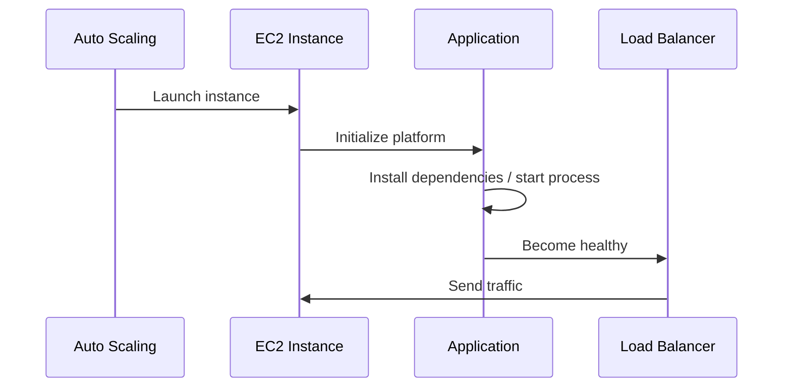
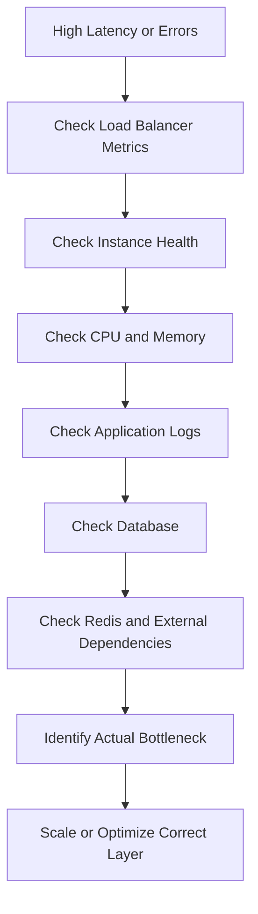

# 09- Auto Scaling and Performance Issues

## Overview

Elastic Beanstalk uses Auto Scaling to adjust the number of EC2 instances in an environment according to configured capacity and scaling policies. This allows a backend application to handle changing request volume without manually adding or removing instances.

For production workloads, however, "Auto Scaling is enabled" does not mean the application will automatically scale correctly. Poorly chosen thresholds, slow startup times, insufficient instance capacity, database bottlenecks, connection-pool exhaustion, or incorrect health checks can cause an environment to scale too late or scale continuously without improving performance.

A useful production model is:

```text
Client
   │
   ▼
Load Balancer
   │
   ├───────────────┐
   ▼               ▼
EC2 Instance 1   EC2 Instance 2
   │               │
   └───────┬───────┘
           ▼
      PostgreSQL / RDS
           │
      Redis / Cache
```

When traffic increases:

```text
Higher traffic
      ↓
Higher resource utilization
      ↓
CloudWatch metric crosses threshold
      ↓
Auto Scaling policy evaluates
      ↓
Additional EC2 instance launched
      ↓
Instance initializes application
      ↓
Health check passes
      ↓
Instance receives traffic
```

The goal is not simply to maximize the number of instances. The goal is to maintain acceptable latency, availability, throughput, and cost while keeping downstream systems within their capacity limits.

## Elastic Beanstalk Auto Scaling

Elastic Beanstalk environments can run with a configurable number of EC2 instances.

The fundamental capacity settings are:

| Setting | Purpose |
|---|---|
| Minimum instances | Lowest number of instances maintained |
| Maximum instances | Upper limit on horizontal scaling |
| Desired capacity | Current target number of instances |
| Scaling trigger | Metric or policy condition that causes scaling |
| Scaling cooldown / policy behavior | Controls how aggressively scaling reacts |
| Instance type | CPU, memory, network, and cost characteristics |

A production environment should generally use more than one instance when availability requirements justify it.

For example:

```text
Minimum: 2
Desired: 2
Maximum: 6
```

This allows the environment to maintain baseline redundancy while scaling up during demand.

## Why Auto Scaling Exists

Auto Scaling solves two related problems:

### Capacity

A single EC2 instance has finite:

- CPU
- Memory
- Network throughput
- Connection capacity
- Application worker capacity

When demand exceeds that capacity, requests can become slow or fail.

### Availability

Multiple instances reduce the impact of:

- Instance failure
- Deployment replacement
- Host maintenance
- Application crashes
- Temporary resource exhaustion

A production architecture should therefore consider both **scaling** and **fault tolerance**.

## Horizontal Versus Vertical Scaling

### Horizontal Scaling

Add more EC2 instances.

```text
Before:

Load Balancer
     │
     ▼
   EC2-1


After:

Load Balancer
   │
   ├── EC2-1
   ├── EC2-2
   └── EC2-3
```

This is the primary scaling model for Elastic Beanstalk environments designed for distributed workloads.

### Vertical Scaling

Move to a larger instance type.

```text
t3.medium
    ↓
t3.large
    ↓
t3.xlarge
```

Vertical scaling can help when an individual process requires more CPU, memory, or network capacity.

However, it has a practical ceiling and does not provide the same redundancy as horizontal scaling.

| Approach | Advantage | Limitation |
|---|---|---|
| Horizontal | Better redundancy and elastic capacity | Requires stateless application design |
| Vertical | Simple application-level change | Limited by instance size |
| Both | Flexible capacity strategy | Requires careful capacity planning |

## Scaling Policies

Scaling policies determine when capacity changes.

A policy may respond to metrics such as:

- CPU utilization
- Request count per target
- Load balancer request metrics
- Network throughput
- Application-specific CloudWatch metrics

CPU utilization is easy to understand:

```text
CPU > threshold
      ↓
Scale out

CPU < threshold
      ↓
Scale in
```

However, CPU is not always a good proxy for application capacity.

For example, a Django application waiting on PostgreSQL may have:

```text
CPU: 25%
Latency: 2.5 seconds
Database connections: exhausted
```

CPU-based scaling may not react appropriately.

## Choosing the Right Scaling Metric

The correct metric represents the actual bottleneck or user-visible workload.

| Metric | Useful when |
|---|---|
| CPU utilization | Application is CPU-bound |
| Memory utilization | Application is memory-bound |
| Request count | Capacity correlates with incoming requests |
| Latency | User-facing response time is the primary concern |
| Queue depth | Workers consume asynchronous jobs |
| Custom business metric | Standard infrastructure metrics do not represent capacity |

For a web API, request count or latency can sometimes be more representative than CPU.

For Celery-style workers, queue depth may be more meaningful.

## CPU-Based Scaling

CPU-based scaling is common because it is simple.

For example:

```text
Average CPU > 70%
        ↓
Scale out
```

This works well for CPU-bound workloads.

It is less effective when the application is primarily blocked on:

- Database queries
- External APIs
- Redis
- Network I/O
- Lock contention
- Connection pools

A senior-level scaling decision should therefore begin with:

> What resource actually limits throughput?

rather than:

> Which metric is easiest to configure?

## Request-Based Scaling

For HTTP applications, request volume can be a useful scaling signal.

Conceptually:

```text
Requests per target increase
          ↓
Instances become busier
          ↓
Scale out
```

This can be more stable than CPU for applications where each instance has relatively predictable request-processing capacity.

For example:

```text
1 instance ≈ 500 requests/sec
```

is much more useful for capacity planning than simply saying:

```text
CPU target = 70%
```

provided that the workload is sufficiently consistent.

## Latency-Based Scaling

Latency can be a stronger user-centric metric.

Example:

```text
p95 latency > target
        ↓
Scale out
```

However, latency-based scaling must be designed carefully.

If the real bottleneck is PostgreSQL, adding EC2 instances may increase database load without reducing latency.

```text
High API latency
      ↓
More EC2 instances
      ↓
More DB connections
      ↓
Database becomes more overloaded
      ↓
Latency increases further
```

This is a classic scaling failure.

## Auto Scaling and Downstream Dependencies

Scaling the application tier does not automatically scale dependencies.

For example:

```text
                ┌── EC2
                ├── EC2
Traffic ────────┼── EC2
                └── EC2
                    │
                    ▼
                PostgreSQL
```

If four instances each create 50 database connections:

```text
4 × 50 = 200 connections
```

Increasing the environment to ten instances could produce:

```text
10 × 50 = 500 connections
```

The database may become the bottleneck.

Auto Scaling must therefore be evaluated across the entire request path.

## Application Startup Time

A newly launched instance does not immediately become useful.

The lifecycle may look like:



If startup takes five minutes, an instance launched during a traffic spike cannot immediately absorb the load.

This creates an important production consideration:

> Scaling must begin before capacity is exhausted.

## Slow Startup Causes

Elastic Beanstalk instances can take significant time to become healthy because of:

- Large application packages
- Dependency installation
- Docker image pulls
- Database migrations
- Static-file collection
- Long initialization tasks
- External service calls during startup
- Large container images
- Inefficient application initialization

A production application should minimize startup work.

Do not perform expensive background initialization synchronously unless it is required for the process to become ready.

## Scaling Lag

Consider:

```text
14:00  Traffic begins increasing
14:01  CPU crosses threshold
14:02  Scaling decision occurs
14:03  EC2 instance starts
14:05  Application becomes healthy
14:06  Traffic is distributed
```

During this period, existing instances must handle the increasing load.

Scaling thresholds should therefore account for:

- Startup time
- Traffic growth rate
- Instance warm-up time
- Health-check duration
- Deployment behavior

## Minimum Instance Count

A production environment should generally avoid a minimum capacity of one instance when availability matters.

With:

```text
Minimum = 1
```

an instance failure can temporarily eliminate application capacity.

With:

```text
Minimum = 2
```

the load balancer can continue serving traffic while one instance is unavailable.

The exact minimum depends on:

- Availability requirements
- Traffic
- Cost constraints
- Deployment strategy
- Failure tolerance

## Maximum Instance Count

The maximum protects against uncontrolled scaling and unexpected cost.

For example:

```text
Minimum = 2
Maximum = 10
```

If demand exceeds ten instances, the environment cannot scale beyond that configured ceiling.

A maximum that is too low can cause availability problems.

A maximum that is too high can:

- Increase cost rapidly
- Overload PostgreSQL
- Exhaust service quotas
- Increase downstream API traffic
- Create connection storms

Maximum capacity should therefore be based on tested system limits.

## Scaling Limits Must Match Dependency Capacity

Suppose:

```text
Maximum EC2 instances = 20
```

and each instance creates:

```text
40 DB connections
```

Potential database connection demand becomes:

```text
20 × 40 = 800 connections
```

If PostgreSQL can safely support only 300 application connections, allowing the web tier to scale to 20 instances creates a predictable failure mode.

Capacity planning should therefore consider:

```text
Web tier
    ↓
Connection pools
    ↓
Database
    ↓
Cache
    ↓
External services
```

## Stateless Applications

Horizontal scaling works best when application instances are stateless.

A stateless application does not require a particular request to return to the same EC2 instance.

Avoid storing important runtime state only on local disk or memory.

Problematic example:

```text
User session
    ↓
EC2-1 local memory
```

A subsequent request may go to:

```text
EC2-2
```

and lose access to that state.

Use shared services when state must survive across instances:

```text
Session state → Redis / database
Files         → S3
Persistent DB → RDS
```

## Django and Auto Scaling

Django applications should be designed so that any instance can handle any request.

Avoid:

- Local session storage for shared production sessions
- Local filesystem persistence for user uploads
- In-memory state shared between requests
- Instance-specific application state

A typical architecture is:

```text
ALB
 │
 ├── Django EC2
 ├── Django EC2
 └── Django EC2
       │
       ├── RDS PostgreSQL
       ├── ElastiCache Redis
       └── S3
```

This allows instances to be created and destroyed without losing important application state.

## FastAPI and Auto Scaling

FastAPI applications follow the same architectural principle.

A typical deployment might use:

```text
ALB
 │
 ├── EC2 + Uvicorn/Gunicorn
 ├── EC2 + Uvicorn/Gunicorn
 └── EC2 + Uvicorn/Gunicorn
```

The application should avoid relying on:

- Process-local state
- Instance-local files
- Static in-memory coordination
- Sticky sessions unless explicitly required

Shared state should be placed in appropriate external services.

## Worker Configuration

Scaling instances is only useful if the application can utilize the available resources.

For example:

```text
EC2 instance
    │
    └── Gunicorn
          ├── Worker 1
          ├── Worker 2
          ├── Worker 3
          └── Worker 4
```

Too few workers may underutilize CPU.

Too many workers can cause:

- Memory exhaustion
- Excessive context switching
- Database connection exhaustion
- Increased garbage collection
- Reduced overall throughput

Worker counts should be derived from workload characteristics and load testing rather than copied blindly from generic recommendations.

## Database Connection Pools

Each application process may maintain database connections.

Consider:

```text
3 EC2 instances
×
4 application workers
×
5 connections per worker
=
60 potential connections
```

Scaling to:

```text
10 EC2 instances
```

could increase the potential connection count to:

```text
10 × 4 × 5 = 200
```

The database must be able to handle the resulting connection pressure.

For high-scale systems, consider connection pooling strategies and appropriate database architecture.

## Performance Bottleneck Classification

Before modifying Auto Scaling, identify the bottleneck.

| Symptom | Possible bottleneck |
|---|---|
| CPU near 100% | CPU-bound application |
| Memory constantly increasing | Memory leak / insufficient memory |
| High DB latency | Database bottleneck |
| High DB connections | Connection-pool sizing |
| High network utilization | Network-bound workload |
| High Redis latency | Cache bottleneck |
| High external API latency | Dependency bottleneck |
| Low CPU but high request latency | I/O, locking, database, or external service |
| Queue continuously growing | Insufficient worker capacity |
| Frequent instance replacement | Health/startup problem |

Do not automatically respond to every performance problem by increasing EC2 capacity.

## Monitoring Auto Scaling

At minimum, monitor:

- Instance count
- CPU utilization
- Request count
- Request latency
- HTTP 4xx responses
- HTTP 5xx responses
- Load balancer health
- Instance health
- Network utilization
- Memory utilization where available
- Database connections
- Database CPU
- Database latency
- Redis metrics
- Application-specific metrics

The goal is to correlate infrastructure metrics with user-visible behavior.

## Performance Investigation Flow



This avoids the common mistake of scaling the wrong component.

## CloudWatch Metrics

CloudWatch provides the foundation for monitoring infrastructure and scaling behavior.

Useful metrics include:

- EC2 CPU utilization
- Load balancer request count
- Load balancer target response time
- HTTP 4xx count
- HTTP 5xx count
- Healthy host count
- Unhealthy host count

For deeper application monitoring, publish custom metrics when standard infrastructure metrics do not adequately describe application capacity.

## High CPU Without Increased Traffic

High CPU is not always caused by traffic.

Potential causes include:

- Infinite loops
- Background tasks
- Excessive logging
- Memory pressure causing system overhead
- Inefficient database processing
- Runaway processes
- Unexpected scheduled jobs

Before increasing the Auto Scaling maximum, inspect the application and process behavior.

## High Memory Utilization

Memory pressure can cause:

- Process termination
- Swap activity
- Increased latency
- Instance health failures
- Out-of-memory errors

For Python applications, investigate:

- Unbounded caches
- Large in-memory objects
- Memory leaks
- Large querysets
- Excessive worker counts
- Large request payloads
- Long-lived background processes

Increasing the instance size may provide temporary relief, but the underlying allocation problem should still be investigated.

## Python-Specific Performance Issues

Python applications may become CPU-bound because of:

- Expensive serialization
- Large JSON responses
- Inefficient loops
- Image processing
- Compression
- CPU-heavy business logic

If CPU utilization is consistently high, consider:

- Profiling
- Query optimization
- Caching
- Moving CPU-heavy work to asynchronous workers
- Increasing worker capacity
- Horizontal scaling

Do not assume that adding more web workers will always improve throughput.

## Database Bottleneck

A common failure pattern is:

```text
Traffic increases
      ↓
More EC2 instances
      ↓
More database queries
      ↓
Database CPU increases
      ↓
Query latency increases
      ↓
API latency increases
      ↓
More instances launched
      ↓
Database becomes even more overloaded
```

This is a positive feedback loop.

The correct response may involve:

- Query optimization
- Indexing
- Caching
- Connection-pool tuning
- Read replicas
- Database scaling
- Reducing unnecessary queries

rather than simply increasing application instances.

## N+1 Query Problems

Django applications can appear to have an infrastructure scaling problem when the actual problem is inefficient database access.

For example:

```python
for order in orders:
    print(order.customer.name)
```

can trigger many database queries if relationships are not loaded efficiently.

Use appropriate query optimization:

```python
orders = Order.objects.select_related("customer")
```

Reducing database work can provide a larger performance improvement than adding EC2 instances.

## Redis and Caching

Caching can reduce pressure on PostgreSQL.

For example:

```text
Request
  ↓
Redis cache
  │
  ├── Hit → Return cached result
  │
  └── Miss
        ↓
     PostgreSQL
        ↓
     Store result
        ↓
     Return response
```

Caching can improve:

- Latency
- Database throughput
- Application scalability

But cache invalidation and consistency must be designed carefully.

## Asynchronous Workloads

Not every workload should run inside the HTTP request lifecycle.

Examples:

- Sending email
- Large report generation
- Image processing
- External API synchronization
- Data processing

Move appropriate workloads to background workers such as Celery.

Architecture:

```text
HTTP Request
    ↓
Django / FastAPI
    ↓
Redis / Queue
    ↓
Celery Workers
    ↓
External Service / Database
```

Web-tier Auto Scaling and worker-tier scaling can then be treated as separate capacity problems.

## Queue-Based Scaling

For asynchronous workloads, queue depth can be a better scaling signal than CPU.

For example:

```text
Queue depth increases
       ↓
Worker capacity insufficient
       ↓
Add workers
       ↓
Queue drains
```

This is particularly useful for workloads where request volume and processing cost are not directly proportional.

## Slow Requests and Timeouts

A slow dependency can consume application workers for extended periods.

For example:

```text
Request
  ↓
External API
  ↓
Timeout after 30 seconds
```

If hundreds of requests are waiting simultaneously, workers can become exhausted even if CPU utilization remains low.

Use explicit timeouts for:

- Database operations where appropriate
- HTTP clients
- Redis
- External APIs
- Internal service calls

Timeouts should be bounded and consistent with the application's latency budget.

## Load Balancer Health Checks

Health checks influence whether newly launched instances can receive traffic.

If the application exposes:

```text
/health
```

the endpoint should be:

- Fast
- Deterministic
- Lightweight
- Available during normal startup
- Appropriate for the selected health-check semantics

Do not make a basic liveness check perform expensive operations.

## Health Check and Scaling Interaction

An instance can be successfully launched but still fail health checks.

```text
Auto Scaling
    ↓
Launch instance
    ↓
Application starts
    ↓
Health check fails
    ↓
Instance removed/replaced
    ↓
New instance launched
```

This can create an instance replacement loop.

Common causes include:

- Wrong application port
- Application startup failure
- Slow startup
- Incorrect health endpoint
- Security group problems
- Incorrect host configuration
- Missing environment variables
- Database connection failure

## Deployment and Auto Scaling

Deployments can temporarily affect capacity.

For example:

```text
Existing:
EC2-1
EC2-2

Deployment:
EC2-1 replaced
EC2-2 serving traffic

Then:
EC2-1 healthy
EC2-2 replaced
```

The exact behavior depends on the Elastic Beanstalk deployment policy.

Production deployments should be evaluated for:

- Capacity during deployment
- Health checks
- Startup time
- Traffic distribution
- Rollback behavior
- Database compatibility

## Database Migrations and Scaling

Running database migrations during every instance startup can be dangerous.

Suppose five new instances launch simultaneously:

```text
EC2-1 → migrate
EC2-2 → migrate
EC2-3 → migrate
EC2-4 → migrate
EC2-5 → migrate
```

Multiple processes may attempt the same migration concurrently.

Prefer a controlled migration process as part of deployment rather than making every application instance independently perform potentially conflicting schema changes.

## Cost Considerations

Auto Scaling improves elasticity but can increase costs.

Costs may increase because of:

- More EC2 instances
- Larger instance types
- Increased database capacity
- Increased Redis capacity
- Increased network traffic
- Additional logging and monitoring

Do not optimize for the lowest instance count.

Optimize for:

```text
Required availability
+
Required performance
+
Acceptable cost
```

## Capacity Planning

Capacity planning should answer:

- How many requests can one instance handle?
- At what concurrency?
- At what latency?
- What happens at 2× traffic?
- What happens at 5× traffic?
- How quickly can a new instance become healthy?
- How many database connections does each instance consume?
- What is the maximum safe database capacity?
- What happens if one instance fails?

For example:

```text
1 instance:
500 req/s at p95 < 200 ms

Expected peak:
1,500 req/s

Required baseline:
3 instances

Failure tolerance:
4 instances preferred
```

These numbers should come from load testing rather than assumptions.

## Load Testing

A production-oriented Auto Scaling configuration should be tested under representative traffic.

Test:

```text
Normal load
    ↓
2× load
    ↓
5× load
    ↓
Sudden spike
    ↓
Sustained high load
    ↓
Traffic reduction
```

Measure:

- p50 latency
- p95 latency
- p99 latency
- Error rate
- Throughput
- CPU
- Memory
- Database CPU
- Database connections
- Redis latency
- Instance launch time
- Scale-out time
- Scale-in behavior

## Sudden Traffic Spikes

Auto Scaling is reactive.

A sudden spike may arrive faster than the system can launch and initialize new instances.

For example:

```text
Baseline:
2 instances

Sudden traffic:
10× increase

Required:
10 instances

Problem:
New instances require several minutes to become healthy
```

Possible mitigations include:

- Higher baseline capacity
- Predictive or scheduled scaling where appropriate
- Efficient application startup
- CDN and caching
- Queue-based load absorption
- Rate limiting
- Load shedding
- Capacity reservations or appropriate instance strategy

## Scale-In Behavior

Scaling down is as important as scaling up.

A scale-in event removes capacity:

```text
6 instances
    ↓
4 instances
    ↓
2 instances
```

Applications must tolerate instance termination.

Avoid storing important state locally.

For long-running background work, implement graceful shutdown behavior so tasks are not silently abandoned.

## Graceful Shutdown

Applications should handle termination signals appropriately.

For web servers, graceful shutdown allows:

- Existing requests to finish
- Connections to close cleanly
- Workers to stop
- Resources to be released

For background workers, tasks may need acknowledgement and retry semantics.

This becomes especially important when Auto Scaling or deployments replace instances.

## Scaling and Kafka

Kafka consumers are not scaled in exactly the same way as stateless HTTP servers.

Increasing consumer instances can increase parallelism only when partitioning allows it.

For example:

```text
Kafka Topic
 ├── Partition 1 → Consumer 1
 ├── Partition 2 → Consumer 2
 ├── Partition 3 → Consumer 3
 └── Partition 4 → Consumer 4
```

If there are only four partitions, adding twenty consumers to the same consumer group does not provide twenty-way partition consumption.

Scaling must therefore respect the architecture of the downstream system.

## Common Auto Scaling Problems

| Symptom | Likely cause |
|---|---|
| Instances never scale out | Threshold, policy, metric, or configuration issue |
| Instances scale too late | Threshold too aggressive or startup too slow |
| Instances continuously scale up | Insufficient capacity or bad metric |
| Instances continuously scale in/out | Metric oscillation or poorly tuned policies |
| CPU low but latency high | I/O or dependency bottleneck |
| More instances make database slower | Database is bottleneck |
| New instances become unhealthy | Startup or configuration problem |
| Instances terminate unexpectedly | Scale-in, health failure, or infrastructure issue |
| Cost increases rapidly | Maximum capacity too high or workload unexpectedly large |
| Application state disappears | Stateful instance-local design |
| Queue continues growing | Worker capacity insufficient |
| Deployment causes errors | Insufficient deployment capacity or startup issues |

## Common Mistakes

### Scaling Based Only on CPU

CPU is not a universal application-capacity metric.

An API waiting on PostgreSQL may have low CPU and high latency.

Use metrics that represent the actual bottleneck.

### Setting Maximum Capacity Too High

An unrestricted-looking scaling configuration can overwhelm downstream systems.

Always evaluate:

```text
Maximum instances
×
Connections per instance
```

against database and dependency capacity.

### Setting Minimum Capacity Too Low

Running one instance may minimize cost but eliminates redundancy.

For production workloads, establish the minimum based on availability requirements.

### Ignoring Startup Time

A five-minute startup time makes reactive scaling slow.

Optimize initialization and account for warm-up time in scaling decisions.

### Scaling the Wrong Layer

If PostgreSQL is saturated, adding EC2 instances may make the problem worse.

Identify the bottleneck first.

### Storing State on EC2

Local filesystem or memory state can disappear when instances are replaced.

Use appropriate shared services.

### Excessive Worker Counts

More workers do not necessarily mean more throughput.

They can exhaust memory and database connections.

### Running Migrations on Every Instance Startup

Multiple instances can attempt schema changes concurrently.

Use controlled database migration execution.

### Ignoring Scale-In

Scaling down removes capacity and can terminate processes.

Applications should tolerate instance termination and support graceful shutdown.

### No Load Testing

Scaling configuration based only on intuition often fails under real traffic.

Measure actual capacity.

## Production Troubleshooting Workflow

When an Elastic Beanstalk environment is slow or overloaded:

### Confirm Environment Health

```bash
eb status
```

Determine whether the environment is:

- Healthy
- Degraded
- Severe
- Experiencing instance replacement

### Inspect Environment Events

```bash
eb events
```

Look for:

- Instance launches
- Instance termination
- Health changes
- Deployment failures
- Configuration changes
- Scaling activity

### Inspect Application Logs

```bash
eb logs
```

Look for:

- Timeout errors
- Worker exhaustion
- Database errors
- Memory errors
- Application exceptions
- Connection failures

### Inspect Instance Count

Determine whether the environment is:

```text
At minimum capacity
At desired capacity
Scaling out
At maximum capacity
Scaling in
```

Being at maximum capacity during high traffic is an important signal.

### Correlate Metrics

Compare:

```text
Request volume
CPU
Memory
Latency
5xx errors
Instance count
Database CPU
Database connections
Redis latency
```

Do not inspect these metrics independently.

### Identify the Bottleneck

Ask:

```text
Is the web tier saturated?
Is the database saturated?
Is Redis saturated?
Is an external service slow?
Are workers blocked?
Is the application starting too slowly?
```

### Apply the Correct Fix

Examples:

```text
CPU bottleneck
→ Optimize code / scale instances

Database bottleneck
→ Optimize queries / indexes / DB capacity

Slow external API
→ Timeouts / retries / caching / async processing

Memory pressure
→ Fix leak / tune workers / larger instance

Slow startup
→ Reduce initialization work
```

## Operational Checklist

Before changing Auto Scaling configuration:

- [ ] Confirm the correct Elastic Beanstalk environment
- [ ] Confirm current instance count
- [ ] Check minimum capacity
- [ ] Check maximum capacity
- [ ] Check scaling policies
- [ ] Check CloudWatch metrics
- [ ] Check request latency
- [ ] Check HTTP 5xx errors
- [ ] Check instance health
- [ ] Check application logs
- [ ] Check application startup time
- [ ] Check database CPU and connections
- [ ] Check Redis metrics
- [ ] Check external dependency latency
- [ ] Check worker and queue utilization
- [ ] Identify the actual bottleneck
- [ ] Verify downstream capacity before increasing instance count
- [ ] Load-test significant scaling changes
- [ ] Monitor after the change
- [ ] Record production configuration changes

## Key Takeaways

- Auto Scaling adjusts EC2 capacity based on configured scaling policies and workload signals.
- Scaling out improves capacity and can improve availability, but only when the application and dependencies are designed for horizontal scaling.
- CPU utilization is not always the correct scaling metric.
- Request count, latency, queue depth, and custom metrics can better represent application capacity depending on the workload.
- Auto Scaling is reactive, so instance startup time directly affects how quickly new capacity becomes useful.
- Slow startup can cause an environment to remain overloaded even when Auto Scaling is functioning correctly.
- Minimum capacity should account for availability requirements and instance failure.
- Maximum capacity should account for both cost and downstream dependency limits.
- Scaling the web tier does not automatically scale PostgreSQL, Redis, Kafka, or external APIs.
- Database connection pools can multiply rapidly as EC2 instance count and application worker count increase.
- Always evaluate `instances × workers × connections` when planning database capacity.
- Low CPU combined with high latency often indicates an I/O or dependency bottleneck rather than insufficient EC2 capacity.
- Adding application instances can make a database bottleneck worse.
- Stateless application design is fundamental to reliable horizontal scaling.
- Store persistent application state in appropriate shared services such as PostgreSQL, Redis, or S3 rather than instance-local memory or disk.
- Django and FastAPI applications should be designed so any healthy instance can serve any request.
- Background workloads should be separated from synchronous HTTP processing when appropriate.
- Celery workers can scale independently from the web tier, often using queue depth as a capacity signal.
- Kafka consumer scaling is constrained by topic partitioning and consumer-group behavior.
- Health-check failures can create instance replacement loops even when Auto Scaling itself is working.
- Database migrations should not be blindly executed concurrently by every newly launched instance.
- Graceful shutdown is important because Auto Scaling and deployments can terminate instances.
- Load testing is essential for determining actual instance capacity and validating scaling behavior.
- Monitor request volume, latency, errors, instance health, resource utilization, and downstream dependencies together.
- The correct production response to a performance problem is to scale or optimize the bottlenecked layer, not automatically add more EC2 instances.
- Effective Auto Scaling balances availability, latency, throughput, dependency capacity, and cost.