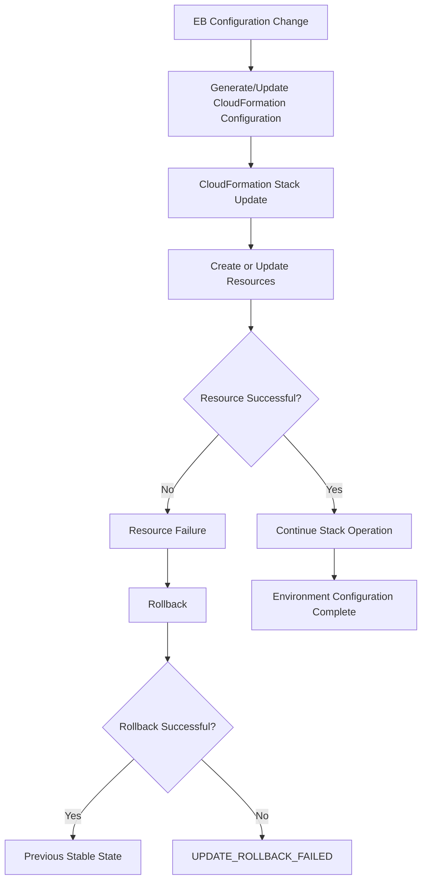
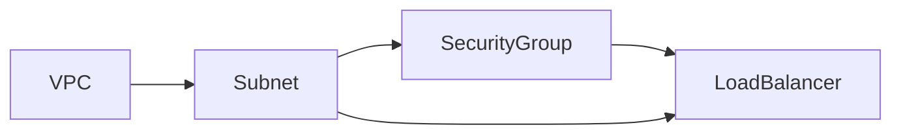
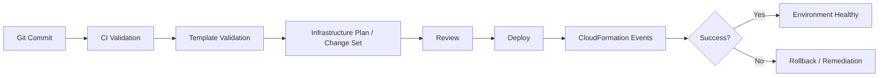

# 11- CloudFormation Failures

## Overview

Elastic Beanstalk uses AWS CloudFormation to provision and manage many of the AWS resources that make up an environment. An Elastic Beanstalk environment can therefore fail for reasons that are not directly related to application code.

Typical resources involved include:

- EC2 instances
- Auto Scaling groups
- Elastic Load Balancing resources
- Security groups
- IAM-related resources
- CloudWatch alarms
- SQS queues
- ElastiCache resources
- RDS-related resources
- Other resources declared through Elastic Beanstalk configuration

Elastic Beanstalk configuration files can also define additional AWS resources through the `Resources` section. Those resources are incorporated into the CloudFormation template used to create the environment. :contentReference[oaicite:0]{index=0}

A useful mental model is:

```text
Elastic Beanstalk
       │
       ▼
Environment Configuration
       │
       ▼
CloudFormation Stack
       │
       ├── EC2 / Auto Scaling
       ├── Load Balancer
       ├── Security Groups
       ├── CloudWatch Resources
       ├── SQS / ElastiCache / RDS
       └── Custom Resources
```

This means an Elastic Beanstalk deployment can fail before the application is even running.

The correct troubleshooting approach is therefore to determine whether the failure belongs to:

```text
Application
    ↓
Elastic Beanstalk platform
    ↓
CloudFormation
    ↓
Underlying AWS resource
```

## Why CloudFormation Failures Matter

CloudFormation manages infrastructure as a declarative stack. When Elastic Beanstalk changes environment configuration, CloudFormation may create, modify, replace, or delete underlying resources.

A configuration change such as:

```yaml
option_settings:
  aws:autoscaling:asg:
    MinSize: 2
    MaxSize: 6
```

can cause changes to resources managed by the environment.

Likewise, a custom `.ebextensions` configuration can add resources:

```yaml
Resources:
  ApplicationQueue:
    Type: AWS::SQS::Queue
    Properties:
      VisibilityTimeout: 60
```

That resource becomes part of the CloudFormation-managed infrastructure associated with the Elastic Beanstalk environment. :contentReference[oaicite:1]{index=1}

Therefore:

> An Elastic Beanstalk configuration change can become a CloudFormation infrastructure operation.

## CloudFormation Stack Lifecycle

A simplified environment update looks like:



The important diagnostic point is that the first visible Elastic Beanstalk error may only be a consequence of a deeper CloudFormation resource failure.

For example:

```text
Elastic Beanstalk:
Environment update failed

CloudFormation:
UPDATE_FAILED

Underlying resource:
AWS::EC2::SecurityGroup

Actual reason:
Security group does not exist in specified VPC
```

The third message is the one that matters.

## Elastic Beanstalk and `.ebextensions`

Elastic Beanstalk supports `.ebextensions` configuration files in the application source bundle.

Example:

```text
my-app/
├── .ebextensions/
│   ├── 01-network.config
│   └── 02-resources.config
├── application/
├── requirements.txt
└── ...
```

These files can:

- Set Elastic Beanstalk configuration options
- Customize environment resources
- Define additional CloudFormation resources
- Configure instance software
- Run initialization commands

AWS recommends YAML for readability, although YAML and JSON configuration files are supported. :contentReference[oaicite:2]{index=2}

For Amazon Linux 2 and Amazon Linux 2023 platforms, AWS recommends Buildfile, Procfile, and platform hooks for many instance-level customization tasks, while `.ebextensions` remains important when a script needs to reference an AWS CloudFormation resource. :contentReference[oaicite:3]{index=3}

## CloudFormation Resource Failures

A CloudFormation failure generally appears against a specific resource.

For example:

```text
AWS::EC2::SecurityGroup
AWS::AutoScaling::AutoScalingGroup
AWS::ElasticLoadBalancingV2::LoadBalancer
AWS::SQS::Queue
AWS::CloudWatch::Alarm
AWS::RDS::DBInstance
```

The resource's:

- Logical ID
- Resource type
- Status
- Status reason
- Dependencies

are usually more useful than the generic Elastic Beanstalk error.

CloudFormation stack events expose resource-level status and failure reasons. :contentReference[oaicite:4]{index=4}

## CloudFormation Stack Events

The most important troubleshooting tool is the stack's event history.

CloudFormation events can show states such as:

```text
CREATE_IN_PROGRESS
CREATE_COMPLETE
CREATE_FAILED

UPDATE_IN_PROGRESS
UPDATE_COMPLETE
UPDATE_FAILED

DELETE_IN_PROGRESS
DELETE_COMPLETE
DELETE_FAILED

UPDATE_ROLLBACK_IN_PROGRESS
UPDATE_ROLLBACK_COMPLETE
UPDATE_ROLLBACK_FAILED
```

For an update failure, CloudFormation emits an `UPDATE_FAILED` event with a status reason describing the resource failure. :contentReference[oaicite:5]{index=5}

A typical sequence is:

```text
UPDATE_IN_PROGRESS
        ↓
Resource A → UPDATE_COMPLETE
        ↓
Resource B → UPDATE_FAILED
        ↓
UPDATE_ROLLBACK_IN_PROGRESS
        ↓
Resource A → rollback
        ↓
UPDATE_ROLLBACK_COMPLETE
```

## Find the First Real Failure

CloudFormation can produce many secondary failures after the first resource fails.

For example:

```text
SecurityGroup       UPDATE_FAILED
LoadBalancer        UPDATE_FAILED
AutoScalingGroup    UPDATE_FAILED
ElasticBeanstalk    UPDATE_FAILED
```

The last error is not necessarily the root cause.

Start with the earliest meaningful resource failure.

A useful investigation pattern is:

```text
Stack events
    ↓
Find first CREATE_FAILED / UPDATE_FAILED
    ↓
Read StatusReason
    ↓
Identify resource type
    ↓
Inspect resource dependencies
    ↓
Verify underlying AWS service
```

## AWS CLI: Inspect Stack Events

For a CloudFormation stack:

```bash
aws cloudformation describe-stack-events \
  --stack-name <stack-name>
```

The output contains event information such as:

- Logical resource ID
- Resource type
- Resource status
- Status reason
- Timestamp
- Stack operation

For a more targeted investigation:

```bash
aws cloudformation describe-stack-events \
  --stack-name <stack-name> \
  --query 'StackEvents[?contains(ResourceStatus, `FAILED`)]'
```

This is useful when a stack has a large number of historical events.

## Inspect Stack Resources

Use:

```bash
aws cloudformation describe-stack-resources \
  --stack-name <stack-name>
```

This helps map CloudFormation logical resources to physical AWS resources.

For example:

```text
LogicalResourceId:
ApplicationLoadBalancer

ResourceType:
AWS::ElasticLoadBalancingV2::LoadBalancer

PhysicalResourceId:
arn:aws:elasticloadbalancing:...
```

This allows you to move from the CloudFormation abstraction to the actual AWS resource.

## Identify the Stack

The Elastic Beanstalk environment is backed by AWS infrastructure, but the exact stack name should be discovered rather than guessed.

Use:

```bash
aws cloudformation list-stacks \
  --stack-status-filter CREATE_COMPLETE UPDATE_COMPLETE UPDATE_ROLLBACK_COMPLETE
```

Then inspect the relevant environment and its resources.

The AWS console is often useful for the same investigation because CloudFormation exposes the stack and its event timeline directly.

## CloudFormation Failure Categories

| Failure category | Typical cause |
|---|---|
| Template/configuration | Invalid resource property or malformed configuration |
| IAM | Missing permission |
| Networking | Invalid subnet, VPC, route, or security group |
| Quota | AWS service limit exceeded |
| Resource conflict | Resource already exists or name collision |
| Dependency | Required resource unavailable |
| Replacement | Resource replacement cannot be completed |
| Stabilization | AWS resource does not reach expected state |
| External modification | Resource changed outside CloudFormation |
| Rollback | Previous state cannot be restored |
| Service availability | Underlying AWS service issue |

## Invalid Configuration

A configuration can be syntactically valid YAML but semantically invalid for the AWS resource.

For example:

```yaml
Resources:
  ApplicationQueue:
    Type: AWS::SQS::Queue
    Properties:
      VisibilityTimeout: invalid-value
```

The YAML may parse successfully, but CloudFormation can reject the resource property.

This is why syntax validation alone is insufficient.

The configuration must also be valid for:

- CloudFormation resource type
- AWS service
- Property type
- Property constraints
- Current region
- Current platform capabilities

## Invalid Resource Properties

A common failure is using a property that does not exist or is not supported for a resource.

Example:

```yaml
Resources:
  MyBucket:
    Type: AWS::S3::Bucket
    Properties:
      InvalidProperty: true
```

CloudFormation can fail the stack because the resource definition does not conform to the resource schema.

When troubleshooting:

```text
Resource type
      ↓
Property name
      ↓
Property value
      ↓
Regional/service constraints
```

Check each level rather than assuming the YAML structure is correct.

## IAM Permission Failures

CloudFormation operations require appropriate permissions.

A resource can fail because the identity or service role performing the operation cannot execute the required AWS API action.

Typical examples include:

```text
AccessDenied
UnauthorizedOperation
User is not authorized
Insufficient permissions
```

For example, creating an alarm may require CloudWatch permissions while creating an EC2 resource requires EC2 permissions.

The deployment identity and the service role used by the environment should be investigated separately.

## Why IAM Failures Can Be Misleading

The Elastic Beanstalk error might say:

```text
Environment update failed
```

while CloudFormation reports:

```text
API: iam:PassRole AccessDenied
```

The application is not the problem.

The infrastructure operation failed because the relevant identity was not authorized.

A good troubleshooting workflow therefore asks:

```text
Which operation failed?
        ↓
Which AWS API action was required?
        ↓
Which identity performed it?
        ↓
Was the action allowed?
```

## Security Group Failures

Security groups are a common source of CloudFormation failures.

A resource may reference:

```yaml
SecurityGroupIds:
  - sg-0123456789abcdef0
```

Potential problems include:

- Security group does not exist
- Security group belongs to another VPC
- Wrong region
- Invalid security group ID
- Dependency ordering issue

AWS specifically documents failures where a security group does not exist in the specified VPC. For VPC security-group references, using the security group ID is important in contexts where the resource expects an ID. :contentReference[oaicite:6]{index=6}

## Subnet and VPC Failures

Resources often require compatible networking configuration.

Typical failures include:

```text
Subnet does not exist
Subnet belongs to another VPC
No available IP addresses
Invalid subnet configuration
Invalid route configuration
```

When troubleshooting, inspect:

```text
VPC
 ├── Subnets
 ├── Route tables
 ├── Internet/NAT connectivity
 ├── Security groups
 └── Network ACLs
```

A CloudFormation resource may be syntactically correct while the referenced networking topology is invalid.

## Resource Already Exists

CloudFormation can fail when a configuration attempts to create a resource that conflicts with an existing resource.

Examples include:

- Globally unique S3 bucket name already exists
- Named IAM resource already exists
- Security group name conflicts
- Explicitly named infrastructure resource already exists

Prefer generated physical names where appropriate instead of hard-coding globally unique names.

For example, avoid unnecessary fixed names such as:

```yaml
BucketName: production-company-data
```

unless stable naming is actually required.

## Explicit Names and Replacement

Explicit physical names can complicate CloudFormation replacements.

Suppose a resource must be replaced:

```text
Old resource
     ↓
Create replacement
     ↓
Name already occupied
     ↓
Replacement fails
```

This can turn a simple configuration change into an infrastructure outage or rollback.

When a resource does not require a stable physical name, letting CloudFormation generate one can make replacement operations safer.

## Dependency Failures

CloudFormation determines dependencies between resources.

Example:



If the VPC fails:

```text
VPC failure
   ↓
Subnet cannot be created
   ↓
Load balancer cannot be created
   ↓
Multiple secondary failures
```

The load balancer error is therefore not necessarily the root cause.

Look upstream in the dependency graph.

## Explicit `DependsOn`

Most CloudFormation dependencies can be inferred from references.

For example:

```yaml
Resources:
  AppSecurityGroup:
    Type: AWS::EC2::SecurityGroup
    Properties:
      GroupDescription: Application security group
      VpcId: !Ref AppVpc

  AppInstance:
    Type: AWS::EC2::Instance
    DependsOn: AppSecurityGroup
    Properties:
      ImageId: ami-xxxxxxxx
```

Use `DependsOn` when there is a real dependency that CloudFormation cannot infer.

Do not add `DependsOn` everywhere.

Excessive explicit dependencies can:

- Reduce parallelism
- Increase deployment time
- Make templates harder to understand
- Hide the actual dependency model

## Resource Stabilization Failures

Some CloudFormation resources are asynchronous.

CloudFormation requests an operation and then waits for the resource to reach the expected state.

For example:

```text
Create Auto Scaling Group
        ↓
Instances launch
        ↓
Instances initialize
        ↓
Health checks
        ↓
Resource stabilizes
```

If the resource does not stabilize within the expected operation window, CloudFormation can report a stabilization failure. AWS documents this as a case where a resource does not respond or the operation exceeds the applicable timeout. :contentReference[oaicite:7]{index=7}

For Elastic Beanstalk, this can be related to:

- EC2 launch problems
- Health-check failures
- Capacity problems
- Networking
- IAM
- Instance bootstrap failures

## Auto Scaling Group Failures

An Auto Scaling group can fail because instances never reach the expected state.

Investigate:

```text
Auto Scaling Group
    ↓
Launch template/configuration
    ↓
EC2 instance
    ↓
User data / platform initialization
    ↓
Instance status checks
    ↓
Elastic Beanstalk health
```

Useful commands include:

```bash
aws autoscaling describe-auto-scaling-groups \
  --auto-scaling-group-names <asg-name>
```

Then inspect the EC2 instances associated with the group.

## EC2 Capacity Failures

An environment can fail because EC2 capacity cannot be provisioned.

Potential causes include:

- Unsupported instance type
- Availability Zone capacity
- Account limits
- Subnet IP exhaustion
- Invalid launch configuration
- IAM instance-profile problems

A CloudFormation failure involving an Auto Scaling group should therefore lead to investigation of the underlying EC2 instances rather than only the CloudFormation template.

## Load Balancer Failures

Elastic Beanstalk environments commonly use load balancing.

A load balancer-related failure can involve:

- Invalid subnets
- Security groups
- Target groups
- Listener configuration
- Certificates
- Availability Zone configuration
- IAM-related integrations

For Application Load Balancers, inspect:

```bash
aws elbv2 describe-load-balancers
```

and:

```bash
aws elbv2 describe-target-groups
```

The CloudFormation event should determine which resource needs deeper investigation.

## RDS and Database Resource Failures

CloudFormation can manage database resources associated with an environment.

Potential failures include:

- Invalid engine/version
- Unsupported instance class
- Subnet-group problems
- Security-group configuration
- Storage constraints
- Quotas
- Replacement requirements
- Deletion-protection interactions

Database resources require additional caution because infrastructure rollback is not equivalent to application rollback.

Never treat an RDS replacement as a routine deployment change.

## CloudFormation Replacement

Some property changes require resource replacement instead of in-place updates.

Conceptually:

```text
Property change
      ↓
Can resource update in place?
      │
   ┌──┴──┐
  Yes    No
   │      │
Update   Replace
          │
          ├── Create new resource
          └── Delete old resource
```

CloudFormation generally creates the replacement before deleting the old resource for updates that require replacement, which can temporarily increase resource consumption. :contentReference[oaicite:8]{index=8}

This matters when:

- Resource quotas are near their limits
- Names are fixed
- Capacity is constrained
- The resource is stateful
- Replacement causes downtime

## Quota Failures

CloudFormation updates can fail because the replacement or creation operation exceeds an AWS quota.

For example:

```text
Existing EC2 instances: 4
Required replacement capacity: 4
Account quota: 6

4 + 4 = 8
8 > 6
```

The deployment can fail even though the final desired state would require fewer resources.

AWS notes that replacement operations can temporarily increase resource consumption and cause quota failures. :contentReference[oaicite:9]{index=9}

When investigating:

```text
CloudFormation failure
        ↓
Resource creation/replacement?
        ↓
Check service quota
        ↓
Check temporary capacity requirement
```

## External Changes to CloudFormation Resources

One of the most dangerous operational patterns is modifying CloudFormation-managed resources manually.

Example:

```text
CloudFormation template
        │
        ▼
Security Group
        │
        └── Manual console modification
```

Now the actual resource can differ from the state expected by CloudFormation.

This can cause rollback failures because CloudFormation attempts to restore a state that no longer exists.

AWS documents external resource changes as one cause of update rollback failures. :contentReference[oaicite:10]{index=10}

The production principle is:

> Treat CloudFormation-managed resources as infrastructure controlled by code.

## Drift and Configuration Consistency

Manual infrastructure changes create state drift.

For example:

```text
Template:
Ingress 443 from ALB SG

Actual resource:
Ingress 443 from 0.0.0.0/0
```

The environment may continue operating while its infrastructure state becomes inconsistent.

When possible, use CloudFormation drift detection and reconcile infrastructure changes through source-controlled configuration.

Do not assume that a manually corrected resource is permanently fixed. A future deployment may attempt to restore the template-defined state.

## Rollback

When a stack update fails, CloudFormation can attempt to restore the previous configuration.

Typical lifecycle:

```text
UPDATE_IN_PROGRESS
        ↓
UPDATE_FAILED
        ↓
UPDATE_ROLLBACK_IN_PROGRESS
        ↓
UPDATE_ROLLBACK_COMPLETE
```

A successful rollback returns the stack to a previous working state. AWS documents `UPDATE_ROLLBACK_COMPLETE` as a successful return to the previous configuration after a failed update. :contentReference[oaicite:11]{index=11}

The important distinction is:

```text
UPDATE_FAILED
    ≠
UPDATE_ROLLBACK_FAILED
```

The second is significantly more operationally serious.

## `UPDATE_ROLLBACK_FAILED`

`UPDATE_ROLLBACK_FAILED` means CloudFormation could not successfully restore the previous state.

Example:

```text
Update
  ↓
Resource A changed
  ↓
Resource B failed
  ↓
Rollback starts
  ↓
Resource A cannot be restored
  ↓
UPDATE_ROLLBACK_FAILED
```

A stack in this state cannot simply be updated normally. The underlying rollback problem must be addressed, and the rollback can then be continued. :contentReference[oaicite:12]{index=12}

## Continue Update Rollback

After correcting the underlying issue, CloudFormation can continue the rollback.

Using the AWS CLI:

```bash
aws cloudformation continue-update-rollback \
  --stack-name <stack-name>
```

The goal is:

```text
UPDATE_ROLLBACK_FAILED
        ↓
Fix underlying issue
        ↓
continue-update-rollback
        ↓
UPDATE_ROLLBACK_IN_PROGRESS
        ↓
UPDATE_ROLLBACK_COMPLETE
```

Do not immediately skip resources simply because rollback is inconvenient.

First understand why the rollback failed.

## Skipping Resources During Rollback

CloudFormation supports `ResourcesToSkip` when a rollback cannot otherwise complete.

Example:

```bash
aws cloudformation continue-update-rollback \
  --stack-name <stack-name> \
  --resources-to-skip LogicalResourceId
```

This is an advanced recovery mechanism.

AWS explicitly warns that skipped resources can become inconsistent with the CloudFormation template. Future stack updates can fail if the resource state is not reconciled. :contentReference[oaicite:13]{index=13}

Use this only when you understand:

- Which resource failed
- Why rollback cannot restore it
- What state the resource is actually in
- How the resource will be reconciled afterward

## Preserve Successfully Provisioned Resources

CloudFormation also supports failure handling that preserves successfully provisioned resources instead of immediately rolling everything back.

This can be useful when troubleshooting complex provisioning failures.

The model becomes:

```text
Resource A → CREATE_COMPLETE
Resource B → CREATE_COMPLETE
Resource C → CREATE_FAILED
Resource D → waiting
```

Instead of immediately destroying all successful resources, the failure-handling mode can preserve successful resources and allow remediation before retrying or updating. AWS documents this behavior as the `Preserve successfully provisioned resources` option. :contentReference[oaicite:14]{index=14}

This can be valuable during infrastructure development and controlled recovery.

## Failed Stack State

A stack's state determines what operations are possible.

| Stack state | Operational meaning |
|---|---|
| `CREATE_COMPLETE` | Creation succeeded |
| `CREATE_FAILED` | Creation failed |
| `UPDATE_COMPLETE` | Update succeeded |
| `UPDATE_FAILED` | Update failed |
| `UPDATE_ROLLBACK_IN_PROGRESS` | Rollback running |
| `UPDATE_ROLLBACK_COMPLETE` | Rollback succeeded |
| `UPDATE_ROLLBACK_FAILED` | Rollback itself failed |
| `DELETE_FAILED` | Resource deletion failed |

Do not blindly retry an operation without first checking the current stack state.

## `DELETE_FAILED`

A stack can also fail during deletion.

Typical causes include:

- Resource dependencies
- Resource deletion protection
- Resource modified outside CloudFormation
- Retained resources
- Permissions
- External dependencies

Investigate the specific `DELETE_FAILED` resource rather than repeatedly attempting deletion.

A deletion failure is particularly important when rebuilding an Elastic Beanstalk environment because leftover resources can cause name collisions and unexpected costs.

## "No Updates to Perform"

CloudFormation can report:

```text
No updates are to be performed.
```

This does not necessarily mean the system is broken.

CloudFormation requires a meaningful template or parameter change for an update. Some changes are not recognized as update-triggering changes by themselves. AWS documents this behavior and notes that certain metadata changes can be used when an update needs to be triggered intentionally. :contentReference[oaicite:15]{index=15}

Do not modify infrastructure randomly just to force a deployment.

First determine whether the desired configuration actually differs from the current stack state.

## Configuration Precedence

Elastic Beanstalk configuration can come from several sources.

A simplified precedence model is:

```text
Direct environment configuration
        ↑
Saved configuration
        ↑
.ebextensions
        ↑
Default values
```

AWS documents that configuration settings supplied directly to Elastic Beanstalk can override settings from other configuration mechanisms, while `.ebextensions` has lower precedence. :contentReference[oaicite:16]{index=16}

This matters when troubleshooting a configuration that appears correct in source control but behaves differently in the environment.

The source-controlled `.ebextensions` file may not be the final effective configuration.

## Alphabetical `.ebextensions` Processing

Elastic Beanstalk processes `.ebextensions` configuration files alphabetically.

For example:

```text
.ebextensions/
├── 01-network.config
├── 02-security.config
└── 03-resources.config
```

The intended ordering can therefore be encoded through numeric prefixes. AWS documents alphabetical processing of configuration files. :contentReference[oaicite:17]{index=17}

This is useful when one configuration operation depends on another.

However, avoid creating unnecessary ordering dependencies because they increase maintenance complexity.

## CloudFormation Template Validation

Before deploying infrastructure changes, validate CloudFormation templates when possible.

For a standalone CloudFormation template:

```bash
aws cloudformation validate-template \
  --template-body file://template.yaml
```

This helps identify structural template problems before submitting the stack operation.

However, validation does not guarantee successful deployment.

It does not prove that:

- IAM permissions exist
- VPC resources exist
- quotas are sufficient
- the requested instance type is available
- the resource will stabilize
- external resources are compatible

Validation is therefore a first filter, not a complete deployment test.

## Change Sets

For complex infrastructure changes, CloudFormation change sets can make the intended infrastructure modifications easier to inspect before execution.

A change set helps answer:

```text
What will change?
    ↓
Create?
Update?
Replace?
Delete?
```

This is particularly valuable for stateful resources.

For example:

```text
RDS DBInstance
    ↓
Property change
    ↓
Replacement?
    ↓
Potentially destructive infrastructure change
```

A senior engineer should inspect replacement behavior before approving high-risk infrastructure changes.

## CloudFormation and CI/CD

A production pipeline should treat infrastructure changes as first-class deployment artifacts.

A typical flow is:



Useful CI checks include:

- YAML syntax validation
- CloudFormation template validation
- Static analysis
- IAM policy review
- Configuration review
- Deployment to a disposable environment

## Clean Environment Testing

AWS recommends testing new `.ebextensions` configuration on a clean environment when developing or testing configuration files because malformed or invalid configuration can cause environment launch failures. :contentReference[oaicite:18]{index=18}

A strong workflow is:

```text
Configuration change
        ↓
CI validation
        ↓
Clean Elastic Beanstalk environment
        ↓
CloudFormation provisioning
        ↓
Application deployment
        ↓
Health validation
        ↓
Production
```

This is especially important for configuration changes that create or modify AWS resources.

## Troubleshooting Workflow

Use the following workflow for an Elastic Beanstalk CloudFormation failure.

### Identify the Elastic Beanstalk Operation

Determine whether the failure happened during:

- Environment creation
- Environment configuration
- Application deployment
- Scaling
- Platform upgrade
- Resource creation
- Resource deletion

### Inspect Elastic Beanstalk Events

```bash
eb events
```

Use the event timeline to determine whether Elastic Beanstalk is reporting a platform-level or infrastructure-level failure.

### Locate the CloudFormation Stack

Identify the environment's CloudFormation stack through the AWS console or CloudFormation APIs.

Do not assume the stack name without verifying it.

### Inspect Stack Events

```bash
aws cloudformation describe-stack-events \
  --stack-name <stack-name>
```

Look for:

```text
CREATE_FAILED
UPDATE_FAILED
DELETE_FAILED
```

Then read the `ResourceStatusReason`.

### Identify the First Failed Resource

Do not focus on the final environment-level failure.

Find the earliest meaningful resource failure.

### Identify the Physical Resource

```bash
aws cloudformation describe-stack-resources \
  --stack-name <stack-name>
```

Map:

```text
LogicalResourceId
        ↓
ResourceType
        ↓
PhysicalResourceId
```

### Inspect the Underlying AWS Service

If the failed resource is:

```text
AWS::EC2::Instance
```

inspect EC2.

If:

```text
AWS::AutoScaling::AutoScalingGroup
```

inspect Auto Scaling.

If:

```text
AWS::ElasticLoadBalancingV2::LoadBalancer
```

inspect ELB.

If:

```text
AWS::RDS::DBInstance
```

inspect RDS.

CloudFormation tells you where the orchestration failed; the underlying service often tells you more about why.

### Check Dependencies

Determine whether the resource failed independently or because an upstream resource failed.

```text
VPC
 ↓
Subnet
 ↓
Security Group
 ↓
Load Balancer
 ↓
Auto Scaling
```

Investigate upstream failures first.

### Check IAM

Verify:

- Deployment identity
- Elastic Beanstalk service role
- EC2 instance profile where relevant
- `iam:PassRole` requirements where relevant
- Resource-specific permissions

### Check Quotas

If the failure involves resource creation or replacement, verify service quotas.

### Check External Changes

Ask:

```text
Was this resource modified manually?
Was it deleted manually?
Was its configuration changed outside the stack?
```

External changes can cause rollback problems.

### Determine Rollback State

Check whether the stack is:

```text
UPDATE_FAILED
```

or:

```text
UPDATE_ROLLBACK_FAILED
```

These require different operational responses.

### Remediate Before Retrying

Do not repeatedly click "Retry" without changing the condition that caused the failure.

Correct the underlying issue first.

## Example: Security Group Failure

Suppose Elastic Beanstalk reports:

```text
Environment update failed
```

CloudFormation reports:

```text
AWS::EC2::SecurityGroupIngress
UPDATE_FAILED
```

Status reason:

```text
Security group does not exist in VPC
```

Troubleshooting:

```bash
aws ec2 describe-security-groups \
  --group-ids sg-0123456789abcdef0
```

Then verify the VPC:

```bash
aws ec2 describe-security-groups \
  --group-ids sg-0123456789abcdef0 \
  --query 'SecurityGroups[0].VpcId'
```

Compare it with the VPC expected by the Elastic Beanstalk environment.

The root cause is infrastructure configuration, not application code.

## Example: IAM Failure

CloudFormation reports:

```text
CREATE_FAILED
API: iam:PassRole
AccessDenied
```

The troubleshooting path is:

```text
CloudFormation resource
        ↓
Required API action
        ↓
Identity performing operation
        ↓
IAM policy
        ↓
Trust policy / role configuration
```

Do not modify the Django or FastAPI application because an IAM authorization failure occurred during infrastructure provisioning.

## Example: Auto Scaling Failure

Suppose:

```text
AWS::AutoScaling::AutoScalingGroup
CREATE_FAILED
```

Investigate:

```bash
aws autoscaling describe-auto-scaling-groups \
  --auto-scaling-group-names <asg-name>
```

Then inspect the instances launched by the group.

Potential root causes:

- Invalid launch configuration
- Instance profile failure
- Capacity failure
- Subnet IP exhaustion
- Security-group configuration
- Health-check failure
- Platform bootstrap failure

The Auto Scaling group may be the resource that reports failure while the actual problem exists in the EC2 instance initialization path.

## Example: Quota Failure

Suppose a resource replacement requires additional EC2 capacity.

CloudFormation:

```text
UPDATE_FAILED
Resource creation failed
```

Underlying service:

```text
LimitExceeded
```

Investigation:

```text
Current capacity
       +
Temporary replacement capacity
       >
Service quota
```

The solution may be:

- Reduce temporary capacity requirements
- Change deployment strategy
- Remove unused resources
- Increase the relevant service quota

AWS specifically identifies resource replacement as a situation that can temporarily exceed quotas. :contentReference[oaicite:19]{index=19}

## Example: Rollback Failure

Suppose:

```text
UPDATE_ROLLBACK_FAILED
```

First inspect the stack events:

```bash
aws cloudformation describe-stack-events \
  --stack-name <stack-name>
```

Find the resource that prevented rollback.

Correct the external condition, then:

```bash
aws cloudformation continue-update-rollback \
  --stack-name <stack-name>
```

Do not use `ResourcesToSkip` as a shortcut.

If a resource is skipped, CloudFormation can consider the resource successfully rolled back even though its real state differs from the template. AWS warns that this inconsistency can cause subsequent updates to fail. :contentReference[oaicite:20]{index=20}

## Production Safety

CloudFormation failures can affect infrastructure beyond the application itself.

Before changing a production stack:

- Capture the current stack state.
- Review recent stack events.
- Identify affected resources.
- Determine whether resources are stateful.
- Check whether replacement is required.
- Check whether rollback is possible.
- Understand dependencies.
- Avoid destructive manual fixes.
- Prefer source-controlled remediation.

For database, storage, and networking resources, be particularly conservative.

## Security Considerations

CloudFormation troubleshooting often requires privileged access.

Use least privilege while ensuring operators can inspect the required resources.

Avoid giving every developer unrestricted:

```text
cloudformation:*
ec2:*
iam:*
rds:*
```

Instead, provide operational roles appropriate for the environment and troubleshooting responsibilities.

Also avoid exposing:

- Stack parameters containing secrets
- Database credentials
- IAM credentials
- Private endpoints
- Sensitive resource identifiers in public logs

## Reliability Considerations

CloudFormation failures should be designed for rather than treated as exceptional surprises.

Production infrastructure should have:

- Version-controlled configuration
- Repeatable deployments
- Tested rollback procedures
- CloudFormation event visibility
- Centralized operational logging
- Clear ownership of infrastructure
- Environment isolation
- Automated validation
- Documented recovery procedures

A deployment process is not production-ready if the only recovery mechanism is manual console experimentation.

## Cost Considerations

CloudFormation failures can still create billable resources.

For example:

```text
Create resource A → success
Create resource B → success
Create resource C → failure
```

Depending on the operation and rollback behavior, resources may remain temporarily or permanently.

Also watch for:

- `DELETE_FAILED`
- Orphaned resources
- Failed replacement operations
- Unused load balancers
- Unused NAT gateways
- Unused databases
- Retained storage
- Failed environment cleanup

After resolving a failure, verify that infrastructure matches the intended architecture.

## Disaster Recovery Considerations

CloudFormation rollback is not a replacement for data backup.

For stateful services:

```text
CloudFormation rollback
        ≠
Database recovery
```

An infrastructure rollback may restore a previous resource configuration but cannot necessarily restore deleted or corrupted application data.

Use appropriate backup and recovery mechanisms for:

- RDS
- S3
- DynamoDB
- ElastiCache where applicable
- Other persistent services

## Common Mistakes

### Looking Only at Elastic Beanstalk Events

Elastic Beanstalk may only report:

```text
Environment update failed
```

The CloudFormation event contains the actual resource failure.

### Looking Only at the Last Failed Resource

The final failure may be a dependency failure.

Find the first meaningful `CREATE_FAILED` or `UPDATE_FAILED`.

### Treating CloudFormation as the Root Cause

CloudFormation is often the orchestrator.

The underlying cause may be:

- EC2
- IAM
- VPC
- ELB
- RDS
- Service quota
- AWS service availability

### Retrying Without Fixing the Cause

Repeated retries do not fix:

```text
AccessDenied
```

or:

```text
InvalidSubnet
```

Correct the condition first.

### Manually Editing CloudFormation-Managed Resources

Manual changes create drift and can make future rollback or updates fail.

### Skipping Rollback Resources Too Quickly

`ResourcesToSkip` can leave infrastructure inconsistent with the template.

Use it only as a controlled recovery mechanism.

### Ignoring Resource Replacement

A seemingly small configuration change can require resource replacement.

Always determine whether a resource update is in-place or replacement-based.

### Hard-Coding Physical Names

Fixed names can make replacement and parallel environments more difficult.

Use stable names only when there is a real operational requirement.

### Ignoring Quotas

Replacement operations can temporarily require more resources than the final state.

### Treating Infrastructure Like Application Code

An application restart is usually reversible.

A database replacement, security-group change, or network change may not be.

Apply a higher level of change control to infrastructure.

## Interview Traps

### "Does Elastic Beanstalk use CloudFormation?"

A strong answer:

> Elastic Beanstalk uses CloudFormation to provision and manage many of the AWS resources that make up an environment. Configuration files can also define additional CloudFormation resources.

### "Where do you look for an Elastic Beanstalk infrastructure failure?"

A strong troubleshooting sequence is:

```text
Elastic Beanstalk events
        ↓
CloudFormation stack events
        ↓
First failed resource
        ↓
Status reason
        ↓
Underlying AWS service
```

### "What does `UPDATE_ROLLBACK_FAILED` mean?"

It means the stack update failed and CloudFormation was also unable to complete the rollback to the previous stable state. The rollback problem must be remediated before the stack can return to a usable rollback-complete state. :contentReference[oaicite:21]{index=21}

### "Why can several resources report failure when only one resource is actually broken?"

Because CloudFormation manages dependencies. A failure in an upstream resource can prevent dependent resources from being created or updated.

### "Why can a CloudFormation update exceed a quota even if the final infrastructure uses fewer resources?"

Because replacement operations can create the new resource before deleting the old resource, temporarily increasing resource consumption. :contentReference[oaicite:22]{index=22}

### "Why are manual changes to CloudFormation resources dangerous?"

Because CloudFormation's expected state can diverge from the actual resource state, which can cause future updates and rollbacks to fail.

## Troubleshooting Checklist

### Elastic Beanstalk

- [ ] Check `eb events`
- [ ] Identify the failed operation
- [ ] Determine whether the failure is infrastructure-related
- [ ] Identify the associated CloudFormation stack

### CloudFormation

- [ ] Check stack status
- [ ] Inspect stack events
- [ ] Find the first meaningful `CREATE_FAILED` or `UPDATE_FAILED`
- [ ] Read the `ResourceStatusReason`
- [ ] Identify the logical resource ID
- [ ] Identify the physical resource
- [ ] Inspect dependencies
- [ ] Check rollback state

### AWS Resource

- [ ] Inspect the underlying service
- [ ] Verify VPC and subnet configuration
- [ ] Verify security groups
- [ ] Verify IAM permissions
- [ ] Check service quotas
- [ ] Check resource naming conflicts
- [ ] Check resource replacement requirements
- [ ] Check resource stabilization
- [ ] Check whether the resource was manually modified

### Recovery

- [ ] Fix the underlying failure
- [ ] Confirm the stack state
- [ ] Continue rollback when appropriate
- [ ] Avoid unnecessary `ResourcesToSkip`
- [ ] Reconcile skipped or manually modified resources
- [ ] Re-run the deployment
- [ ] Verify environment health

### Production

- [ ] Keep infrastructure configuration in Git
- [ ] Validate configuration in CI/CD
- [ ] Test major changes in a clean environment
- [ ] Review change sets for high-risk changes
- [ ] Monitor CloudFormation events
- [ ] Centralize operational logs
- [ ] Protect stateful resources
- [ ] Verify cleanup after failed deployments

## Key Takeaways

- Elastic Beanstalk relies on CloudFormation to provision and manage many of the AWS resources that make up an environment.
- A CloudFormation failure can occur before the application starts, so application logs may contain no useful information.
- `.ebextensions` can configure Elastic Beanstalk and define additional CloudFormation resources through the `Resources` section. :contentReference[oaicite:23]{index=23}
- For many instance-level customization tasks on Amazon Linux 2 and Amazon Linux 2023, AWS recommends Buildfile, Procfile, and platform hooks; `.ebextensions` remains important for configurations that need CloudFormation resource references. :contentReference[oaicite:24]{index=24}
- CloudFormation stack events are one of the most valuable sources of infrastructure failure information.
- The first meaningful `CREATE_FAILED` or `UPDATE_FAILED` event is usually more useful than the final Elastic Beanstalk error.
- Always read the `ResourceStatusReason`.
- Map the CloudFormation logical resource to its physical AWS resource before troubleshooting the underlying service.
- IAM, VPC, subnet, security-group, load-balancer, Auto Scaling, RDS, quota, and resource-replacement issues are common sources of infrastructure failures.
- A dependency failure can generate several secondary resource failures; investigate the earliest upstream failure first.
- Resource replacement can temporarily require more capacity than the final desired infrastructure and can therefore trigger quota failures. :contentReference[oaicite:25]{index=25}
- Manual modifications to CloudFormation-managed resources can create state drift and cause future updates or rollbacks to fail.
- `UPDATE_FAILED` and `UPDATE_ROLLBACK_FAILED` represent different operational conditions.
- `UPDATE_ROLLBACK_FAILED` requires remediation of the rollback problem before normal stack updates can continue. :contentReference[oaicite:26]{index=26}
- `continue-update-rollback` is a recovery mechanism for failed rollbacks, not a substitute for root-cause analysis.
- `ResourcesToSkip` should be used sparingly because skipped resources can become inconsistent with the CloudFormation template. :contentReference[oaicite:27]{index=27}
- CloudFormation validation can catch structural template problems but cannot prove that deployment will succeed against the real AWS environment.
- Change sets are useful for reviewing high-risk infrastructure changes, especially when resource replacement may occur.
- `.ebextensions` files are processed alphabetically, so numeric prefixes can control intended configuration ordering. :contentReference[oaicite:28]{index=28}
- AWS recommends testing new `.ebextensions` configurations in a clean environment because malformed configuration can cause environment launch failures. :contentReference[oaicite:29]{index=29}
- Infrastructure configuration should be version-controlled and validated through CI/CD rather than changed manually in production.
- CloudFormation rollback provides infrastructure recovery behavior, but it is not a substitute for backups and disaster recovery for stateful services.
- The senior-level troubleshooting model is: **Elastic Beanstalk event → CloudFormation event → first failed resource → status reason → underlying AWS service → dependency/state analysis → controlled remediation**.