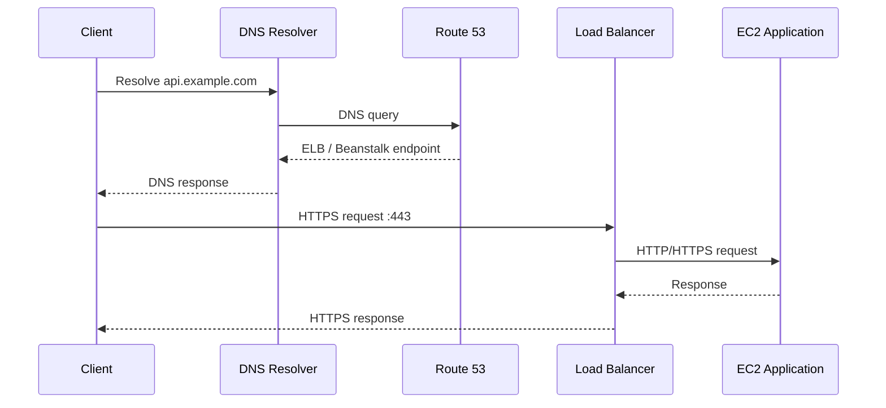
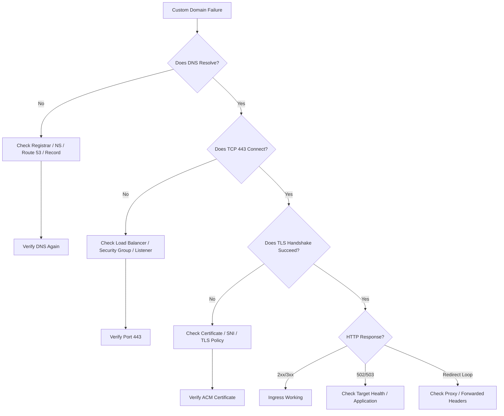
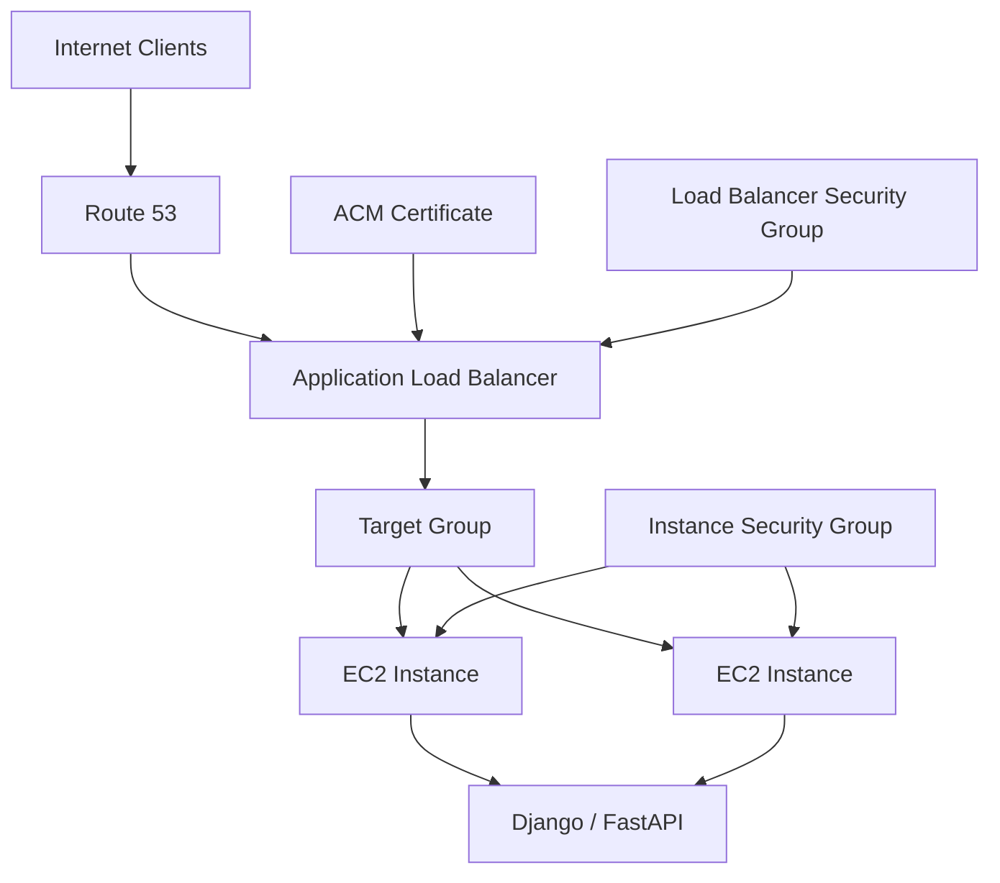

# 12- DNS and SSL Issues

## Overview

DNS and SSL/TLS failures in an AWS Elastic Beanstalk environment usually occur at the boundary between:

- Domain registration
- DNS resolution
- Route 53
- Elastic Beanstalk
- Elastic Load Balancing
- AWS Certificate Manager (ACM)
- Security groups
- Application listeners
- Backend instances

A useful production mental model is:

```text
Client
  │
  │ DNS lookup
  ▼
Route 53 / DNS Provider
  │
  │ Domain → Beanstalk / Load Balancer
  ▼
Elastic Beanstalk Load Balancer
  │
  │ HTTPS :443
  ▼
Target Group / EC2
  │
  │ HTTP or HTTPS
  ▼
Application
```

Elastic Beanstalk environments have an AWS-provided domain name that ultimately routes traffic to the environment's load balancer. A custom domain can be routed to the environment through Route 53 or another DNS provider. :contentReference[oaicite:0]{index=0}

DNS and SSL problems are often confused because both can prevent users from reaching an application. They should be diagnosed separately:

```text
DNS problem
    ↓
Domain does not resolve to the expected endpoint

SSL problem
    ↓
Domain resolves, but TLS negotiation or certificate validation fails
```

The first diagnostic question should therefore be:

> Does the hostname resolve correctly, and if it does, does the TLS handshake succeed?

## Failure Layers

| Layer | Example failure | Primary investigation |
|---|---|---|
| Domain | Domain expired | Registrar |
| Delegation | Wrong nameservers | Registrar / Route 53 |
| DNS record | Wrong target | Route 53 / DNS provider |
| DNS propagation | Old record returned | Resolver / TTL |
| Load balancer | Port 443 unavailable | ELB |
| Certificate | Wrong domain | ACM |
| Certificate validation | CNAME missing | DNS / ACM |
| TLS | Protocol/cipher mismatch | TLS listener |
| Security group | Port 443 blocked | EC2 / ELB security groups |
| HTTP redirect | Redirect loop | Load balancer / application |
| Backend | 502/503 after TLS | Target group / application |

## DNS Request Flow

For a custom domain such as:

```text
api.example.com
```

the request flow is approximately:



DNS resolution happens before the HTTPS connection begins.

Therefore:

```text
DNS failure
    ↓
No connection to load balancer

DNS success
    ↓
TCP connection
    ↓
TLS handshake
    ↓
HTTP request
```

This distinction makes troubleshooting much faster.

## Elastic Beanstalk Default Domain

An Elastic Beanstalk environment automatically receives an environment URL such as:

```text
myapp.us-east-1.elasticbeanstalk.com
```

Elastic Beanstalk maintains a CNAME mapping associated with the environment's load balancer. :contentReference[oaicite:1]{index=1}

Check the environment URL with:

```bash
aws elasticbeanstalk describe-environments \
  --environment-names <environment-name> \
  --query 'Environments[0].CNAME' \
  --output text
```

You can then inspect the hostname:

```bash
nslookup <environment-cname>
```

or:

```bash
dig <environment-cname>
```

The environment's CNAME is useful as a diagnostic baseline.

If:

```text
https://myapp.us-east-1.elasticbeanstalk.com
```

works but:

```text
https://api.example.com
```

does not, the application and environment are likely functional and the problem is probably in the custom DNS or SSL configuration.

## Custom Domain Architecture

A typical production configuration is:

```text
api.example.com
       │
       ▼
Route 53
       │
       │ Alias
       ▼
Elastic Beanstalk Environment
       │
       ▼
Application Load Balancer
       │
       │ HTTPS :443
       ▼
EC2 instances
       │
       ▼
Django / FastAPI
```

Route 53 supports alias records that route traffic to Elastic Beanstalk environments with regionalized domain names, and alias records can be used at the zone apex. :contentReference[oaicite:2]{index=2}

## CNAME vs Alias

A common source of confusion is treating CNAME and Route 53 alias records as interchangeable.

| Property | CNAME | Route 53 Alias |
|---|---|---|
| Standard DNS record | Yes | No, AWS-specific extension |
| Points to hostname | Yes | Yes |
| Zone apex support | No | Yes |
| AWS resource integration | Limited | Native |
| TTL configurable | Yes | AWS resource determines TTL |
| ELB target | Yes, depending on DNS setup | Yes |
| Elastic Beanstalk target | Yes in supported cases | Yes |
| Best for Route 53 + AWS resources | Often unnecessary | Usually preferred |

Route 53 alias records can point directly to supported AWS resources and can be used for both the root domain and subdomains. :contentReference[oaicite:3]{index=3}

## Root Domain vs Subdomain

Consider:

```text
example.com
www.example.com
api.example.com
```

A CNAME cannot be created at the DNS zone apex:

```text
example.com
```

because DNS does not permit a CNAME at the same name as the zone's SOA/NS records.

With Route 53, an alias record can be used for:

```text
example.com
```

and:

```text
api.example.com
```

when targeting supported AWS resources. :contentReference[oaicite:4]{index=4}

## Route 53 Alias to Elastic Beanstalk

For a regionalized Elastic Beanstalk environment, Route 53 can create an alias record directly to the environment.

Conceptually:

```text
example.com
    │
    │ A / Alias
    ▼
Elastic Beanstalk Environment
    │
    ▼
Load Balancer
```

A typical Route 53 configuration is:

| Setting | Value |
|---|---|
| Record name | `api.example.com` |
| Record type | `A` |
| Alias | Enabled |
| Target | Elastic Beanstalk environment |
| Region | Environment region |
| Evaluate target health | Appropriate for the design |

AWS documents alias routing directly to regionalized Elastic Beanstalk environments. :contentReference[oaicite:5]{index=5}

## Route 53 Alias to Load Balancer

An alternative architecture is to point Route 53 directly at the Elastic Load Balancer:

```text
api.example.com
       │
       ▼
Route 53 A / Alias
       │
       ▼
Application Load Balancer
       │
       ▼
Elastic Beanstalk instances
```

This is useful when the load balancer is the explicit stable ingress layer for the application.

For ELB targets, Route 53 supports alias records for Application, Classic, and Network Load Balancers. :contentReference[oaicite:6]{index=6}

## DNS Record Inspection

Start with:

```bash
dig api.example.com
```

For a concise answer:

```bash
dig +short api.example.com
```

For Windows:

```powershell
nslookup api.example.com
```

To inspect the Elastic Beanstalk endpoint:

```bash
aws elasticbeanstalk describe-environments \
  --environment-names <environment-name> \
  --query 'Environments[0].CNAME' \
  --output text
```

Compare:

```text
Expected target
      ↓
Actual DNS answer
```

If the two do not correspond to the intended architecture, investigate DNS.

## DNS Troubleshooting

When DNS is suspected, verify:

```text
Domain
  ↓
Nameservers
  ↓
Hosted zone
  ↓
Record
  ↓
Target
  ↓
Resolver response
```

Check the authoritative nameservers:

```bash
dig NS example.com
```

Then query the record:

```bash
dig api.example.com
```

You can also query a specific DNS server:

```bash
dig @8.8.8.8 api.example.com
```

and:

```bash
dig @1.1.1.1 api.example.com
```

If different recursive resolvers return different values, investigate propagation, caching, delegation, and TTL.

## Wrong Hosted Zone

A particularly common Route 53 mistake is creating the correct record in the wrong hosted zone.

For example:

```text
example.com
├── Hosted Zone A
└── Hosted Zone B
```

The record may exist in one hosted zone while the domain's authoritative nameservers point to another.

Verify the hosted zone:

```bash
aws route53 list-hosted-zones-by-name \
  --dns-name example.com
```

Then inspect records:

```bash
aws route53 list-resource-record-sets \
  --hosted-zone-id <hosted-zone-id>
```

The important question is:

> Is the hosted zone containing my record actually authoritative for the domain?

## Wrong Nameservers

A Route 53 hosted zone does not automatically become authoritative merely because it exists.

The domain's registrar must delegate DNS to the Route 53 nameservers.

The flow is:

```text
Registrar
    │
    │ NS delegation
    ▼
Route 53 Hosted Zone
    │
    ▼
DNS Records
```

Check the authoritative nameservers:

```bash
dig NS example.com
```

If they do not match the Route 53 hosted zone's nameservers, changes made in that hosted zone may have no effect on public DNS resolution.

## DNS Propagation

DNS changes are cached by recursive resolvers according to TTL and other DNS behavior.

Therefore:

```text
Change record
     ↓
Authoritative DNS updated
     ↓
Resolvers refresh
     ↓
Clients observe new value
```

Do not assume every client immediately sees the same answer.

Route 53 states that changes to its records generally propagate to Route 53 servers within about 60 seconds, but recursive DNS caches outside Route 53 can continue returning cached responses according to their TTL. :contentReference[oaicite:7]{index=7}

## DNS Caching During Incident Response

Suppose:

```text
Old ELB
    ↓
api.example.com
```

is replaced with:

```text
New ELB
    ↓
api.example.com
```

Some clients may continue using the previous DNS answer until their resolver cache expires.

During migrations, use an appropriately low TTL ahead of the planned change if rapid DNS convergence is required.

Do not reduce TTL only after the incident begins and expect already-cached records to disappear immediately.

## DNS Failure Symptoms

| Symptom | Likely cause |
|---|---|
| `NXDOMAIN` | Record/name does not exist |
| Domain resolves to old endpoint | DNS cache / old record |
| Domain resolves to wrong AWS resource | Incorrect record |
| Root domain does not resolve | CNAME used at zone apex / delegation issue |
| `SERVFAIL` | DNS configuration/delegation problem |
| Works on one network but not another | Resolver/cache differences |
| DNS resolves but browser fails TLS | SSL/certificate/listener issue |
| DNS resolves to expected LB but returns 502 | Backend/load balancer issue |

## SSL/TLS Architecture

For a normal load-balanced Elastic Beanstalk environment:

```text
Client
  │
  │ HTTPS
  │
  ▼
Application Load Balancer
  │
  │ TLS termination
  ▼
HTTP
  │
  ▼
EC2 / Application
```

The load balancer terminates the client TLS connection and forwards the request to the backend.

Elastic Beanstalk supports HTTPS termination at the load balancer for load-balanced environments. Single-instance environments do not have a load balancer and therefore do not support load-balancer HTTPS termination. :contentReference[oaicite:8]{index=8}

## SSL Certificate Responsibilities

An SSL certificate establishes that:

```text
api.example.com
```

is associated with a certificate issued for that hostname.

The certificate must match the hostname requested by the client.

For example:

```text
Certificate:
*.example.com

Request:
api.example.com

Result:
Match
```

but:

```text
Certificate:
api.example.com

Request:
admin.example.com

Result:
No match
```

Certificate hostname mismatch errors are therefore configuration errors, not application errors.

## AWS Certificate Manager

AWS Certificate Manager (ACM) is the preferred AWS service for provisioning and managing certificates used with Elastic Beanstalk load balancers. :contentReference[oaicite:9]{index=9}

A typical production flow is:

```text
Domain
   ↓
ACM certificate
   ↓
DNS validation
   ↓
Certificate issued
   ↓
HTTPS listener
   ↓
Load balancer
```

ACM certificates can be associated with supported AWS services such as Elastic Load Balancing. :contentReference[oaicite:10]{index=10}

## Certificate Region

One of the most common Elastic Beanstalk SSL mistakes is requesting the certificate in the wrong AWS Region.

If your Elastic Beanstalk environment is in:

```text
ap-south-1
```

the ACM certificate used by that regional load balancer should be available in:

```text
ap-south-1
```

A certificate existing in another Region does not automatically make it selectable for the regional load balancer.

When troubleshooting:

```bash
aws acm list-certificates \
  --region ap-south-1
```

Then inspect the certificate:

```bash
aws acm describe-certificate \
  --certificate-arn <certificate-arn> \
  --region ap-south-1
```

## Certificate Domain Mismatch

Check the certificate's domains:

```bash
aws acm describe-certificate \
  --certificate-arn <certificate-arn> \
  --region <region> \
  --query 'Certificate.{Status:Status,Domain:DomainName,SANs:SubjectAlternativeNames}'
```

For:

```text
https://api.example.com
```

the certificate must cover:

```text
api.example.com
```

or an appropriate wildcard such as:

```text
*.example.com
```

A wildcard certificate for:

```text
*.example.com
```

does not cover the apex:

```text
example.com
```

Therefore, a production certificate may need both:

```text
example.com
*.example.com
```

depending on the domains used.

## Certificate Status

The certificate should normally be:

```text
ISSUED
```

Check:

```bash
aws acm describe-certificate \
  --certificate-arn <certificate-arn> \
  --region <region> \
  --query 'Certificate.Status'
```

Potential problematic states include:

```text
PENDING_VALIDATION
EXPIRED
REVOKED
FAILED
```

The exact certificate lifecycle should be investigated through ACM rather than inferred from the browser error alone.

## DNS Validation

ACM DNS validation uses CNAME records as proof of domain ownership.

The flow is:

```text
Request certificate
       ↓
ACM generates validation CNAME
       ↓
Add CNAME to DNS
       ↓
ACM verifies DNS
       ↓
Certificate issued
```

ACM-provided DNS validation CNAME records can also support automated certificate renewal as long as the required records remain publicly accessible and the certificate is in use. :contentReference[oaicite:11]{index=11}

## ACM Validation CNAME

A validation record resembles:

```text
_acme-token.example.com
        │
        │ CNAME
        ▼
_random-token.acm-validations.aws
```

Do not confuse this CNAME with the application's DNS record.

You typically have separate records:

```text
Application DNS:
api.example.com
        ↓
Elastic Beanstalk / ELB

ACM validation:
_random-token.example.com
        ↓
_acm-validations.aws
```

They solve different problems.

## ACM Validation Failure

If ACM remains:

```text
PENDING_VALIDATION
```

check:

- Validation CNAME exists
- CNAME name is correct
- CNAME value is correct
- DNS zone is authoritative
- Public DNS can resolve the CNAME
- No accidental duplicate domain suffix exists
- DNS provider has not altered the record

Inspect the validation information:

```bash
aws acm describe-certificate \
  --certificate-arn <certificate-arn> \
  --region <region> \
  --query 'Certificate.DomainValidationOptions'
```

Then test the validation CNAME:

```bash
dig <validation-cname>
```

AWS notes that DNS providers differ in how they expect CNAME names to be entered. Accidentally appending the domain twice can cause validation to fail. :contentReference[oaicite:12]{index=12}

## Certificate Renewal Failures

DNS-validated ACM certificates can renew automatically when the certificate remains in use and the required DNS validation CNAME records remain accessible through public DNS. :contentReference[oaicite:13]{index=13}

A production failure can therefore occur months after the original deployment if someone removes the ACM validation record.

Typical failure:

```text
Certificate issued
      ↓
Validation CNAME deleted
      ↓
Certificate approaches expiration
      ↓
ACM cannot validate ownership
      ↓
Renewal fails
      ↓
Certificate expires
      ↓
HTTPS failures
```

Treat ACM validation records as infrastructure dependencies, not temporary setup records.

## Check Certificate Renewal

Use:

```bash
aws acm describe-certificate \
  --certificate-arn <certificate-arn> \
  --region <region> \
  --query 'Certificate.{Status:Status,NotAfter:NotAfter,Renewal:RenewalSummary}'
```

If renewal is failing, verify the DNS validation records.

ACM can emit AWS Health and EventBridge events when automatic renewal cannot validate the domain. :contentReference[oaicite:14]{index=14}

## HTTPS Listener

A certificate alone does not enable HTTPS.

The load balancer must have an HTTPS/TLS listener configured.

For an Application Load Balancer:

```text
Port: 443
Protocol: HTTPS
Certificate: ACM certificate
```

AWS documents that an HTTPS listener requires at least one SSL server certificate and a security policy. :contentReference[oaicite:15]{index=15}

For Elastic Beanstalk, a configuration can define an ALB HTTPS listener:

```yaml
option_settings:
  aws:elbv2:listener:443:
    ListenerEnabled: 'true'
    Protocol: HTTPS
    SSLCertificateArns: arn:aws:acm:ap-south-1:123456789012:certificate/xxxxxxxx-xxxx-xxxx-xxxx-xxxxxxxxxxxx
```

The exact listener configuration depends on the load balancer type and environment configuration. AWS provides Elastic Beanstalk-specific listener configuration examples for ALB, CLB, and NLB environments. :contentReference[oaicite:16]{index=16}

## Verify Load Balancer Listeners

For an Application Load Balancer:

```bash
aws elbv2 describe-listeners \
  --load-balancer-arn <load-balancer-arn>
```

Look for:

```text
Port: 443
Protocol: HTTPS
Certificates:
    ACM certificate ARN
```

If port 443 does not exist, a valid certificate alone will not make:

```text
https://api.example.com
```

work.

## Security Group and HTTPS

A valid DNS record and valid certificate are still insufficient if port 443 is blocked.

Typical production configuration:

```text
Internet
   │
   ▼
Load Balancer SG
   │
   │ TCP 443
   ▼
ALB
   │
   │ Backend port
   ▼
Instance SG
```

The load balancer security group should permit inbound HTTPS from the intended clients.

The instance security group should generally permit application traffic from the load balancer security group rather than from the entire internet.

## Port 443 Failure

Check the load balancer security group:

```bash
aws ec2 describe-security-groups \
  --group-ids <load-balancer-security-group-id>
```

Look for an appropriate ingress rule:

```text
Protocol: TCP
Port: 443
Source: expected client CIDR / security boundary
```

For public applications, this is commonly:

```text
0.0.0.0/0 → TCP 443
```

with IPv6 handled separately when required.

Avoid opening unnecessary backend ports directly to the internet.

## HTTP to HTTPS Redirect

A common production architecture is:

```text
HTTP :80
    │
    │ 301 / 302
    ▼
HTTPS :443
```

The redirect should normally happen at the load balancer rather than inside every application instance.

Conceptually:


This centralizes transport security at the ingress layer.

## Redirect Loops

A common failure occurs when the load balancer terminates HTTPS but the application believes the request is HTTP.

Example:

```text
Client
  │ HTTPS
  ▼
Load Balancer
  │ HTTP
  ▼
Django
  │
  │ thinks request is HTTP
  ▼
Redirect HTTPS
  │
  ▼
Load Balancer
  │
  ▼
Django
```

This can produce:

```text
ERR_TOO_MANY_REDIRECTS
```

Applications behind a TLS-terminating proxy must correctly understand forwarded protocol information.

For Django, proxy-related configuration may include:

```python
SECURE_PROXY_SSL_HEADER = ("HTTP_X_FORWARDED_PROTO", "https")
```

This should only be configured when the application's trusted proxy actually sets and preserves the header correctly.

Do not blindly trust client-supplied `X-Forwarded-Proto` headers.

## FastAPI and Proxy Headers

FastAPI applications commonly run behind:

```text
ALB / Nginx
    ↓
Uvicorn
    ↓
FastAPI
```

When the application needs to reconstruct the external URL scheme, proxy headers must be handled deliberately.

For Uvicorn:

```bash
uvicorn app.main:app \
  --host 0.0.0.0 \
  --port 8000 \
  --proxy-headers
```

Only trust forwarded headers from known trusted proxies.

The exact proxy configuration depends on the ingress architecture.

## `X-Forwarded-Proto`

A typical request may look conceptually like:

```text
Client
  │
  │ HTTPS
  ▼
ALB
  │
  │ HTTP
  │ X-Forwarded-Proto: https
  ▼
Application
```

The application can then determine:

```text
Original client protocol = HTTPS
Backend connection = HTTP
```

This distinction is critical for:

- Redirects
- Secure cookies
- Canonical URLs
- OAuth callbacks
- CSRF protection
- Absolute URL generation

## Secure Cookies

If the application believes requests are HTTP when clients actually use HTTPS, secure-cookie behavior can break.

For Django, production deployments commonly use:

```python
SESSION_COOKIE_SECURE = True
CSRF_COOKIE_SECURE = True
```

when HTTPS is enforced.

But these settings should be introduced together with correct proxy-awareness.

A misconfigured proxy chain can otherwise produce confusing authentication and CSRF failures.

## HSTS

Once HTTPS is correctly deployed and tested, HTTP Strict Transport Security (HSTS) can instruct browsers to use HTTPS.

Example:

```http
Strict-Transport-Security: max-age=31536000; includeSubDomains
```

Do not enable aggressive HSTS settings blindly.

Before using:

```text
includeSubDomains
preload
```

ensure that all relevant subdomains can reliably serve HTTPS.

An incorrect HSTS policy can make recovery from a broken certificate or HTTP-only subdomain significantly harder.

## End-to-End HTTPS

TLS termination at the load balancer does not necessarily mean traffic between the load balancer and instances is encrypted.

Standard architecture:

```text
Client
  │ HTTPS
  ▼
ALB
  │ HTTP
  ▼
EC2
```

End-to-end encryption:

```text
Client
  │ HTTPS
  ▼
ALB
  │ HTTPS
  ▼
EC2
```

AWS documents both load-balancer termination and end-to-end encryption patterns for Elastic Beanstalk. :contentReference[oaicite:17]{index=17}

## When to Use End-to-End Encryption

Use backend HTTPS when:

- Regulatory requirements require encryption in transit
- Internal security policy requires encrypted connections
- Sensitive traffic must remain encrypted through the infrastructure
- Security boundaries require TLS between tiers

Load-balancer termination may be sufficient when the application's security requirements do not require encryption between the load balancer and instances.

Avoid introducing backend TLS merely because HTTPS exists at the frontend. It adds:

- Certificate management
- Backend listener configuration
- Health-check configuration
- Debugging complexity
- Additional operational overhead

## Certificate Mismatch

Typical browser error:

```text
NET::ERR_CERT_COMMON_NAME_INVALID
```

or equivalent hostname mismatch errors.

Troubleshooting:

```text
Requested hostname
       ↓
Certificate SANs
       ↓
Wildcard coverage
       ↓
Listener certificate
```

Use OpenSSL:

```bash
openssl s_client \
  -connect api.example.com:443 \
  -servername api.example.com
```

Inspect:

```text
subject
issuer
notBefore
notAfter
subjectAltName
```

The `-servername` option is important because the server may select a certificate based on SNI.

## SNI and Multiple Certificates

An Application Load Balancer can use multiple certificates on an HTTPS listener through Server Name Indication (SNI).

Conceptually:

```text
api.example.com
      │
      ▼
HTTPS Listener :443
      │
      ├── api.example.com certificate
      ├── admin.example.com certificate
      └── other.example.com certificate
```

The client provides the hostname through SNI during TLS negotiation, allowing the load balancer to select the appropriate certificate.

When troubleshooting certificate selection, verify the hostname used by the client rather than only inspecting the default certificate.

## TLS Handshake Troubleshooting

Use:

```bash
openssl s_client \
  -connect api.example.com:443 \
  -servername api.example.com
```

A successful connection should provide certificate-chain and TLS negotiation information.

For a quick HTTP test:

```bash
curl -Iv https://api.example.com
```

This helps distinguish:

```text
DNS
↓
TCP
↓
TLS
↓
HTTP
```

For example:

```text
Could not resolve host
```

indicates DNS.

Whereas:

```text
SSL certificate problem
```

indicates TLS/certificate validation.

And:

```text
HTTP/1.1 502 Bad Gateway
```

means DNS and TLS likely succeeded far enough for the client to receive an HTTP response.

## `curl` Diagnostic Workflow

Start with:

```bash
curl -I http://api.example.com
```

Then:

```bash
curl -I https://api.example.com
```

For verbose TLS diagnostics:

```bash
curl -v https://api.example.com
```

To test certificate behavior while resolving the hostname to a specific IP:

```bash
curl -v \
  --resolve api.example.com:443:<ip-address> \
  https://api.example.com/
```

This is useful when validating a specific load balancer endpoint without changing public DNS.

## DNS + SSL Diagnostic Matrix

| Test | Result | Likely area |
|---|---|---|
| `dig api.example.com` fails | DNS failure | DNS/delegation |
| DNS resolves to wrong endpoint | DNS configuration | Route 53/provider |
| TCP 443 unavailable | Network/listener | SG/LB |
| TLS handshake fails | SSL/TLS | Certificate/listener/policy |
| Certificate hostname mismatch | Certificate | ACM/SAN/SNI |
| Certificate expired | Certificate lifecycle | ACM |
| HTTPS returns 301 | Redirect | Expected if HTTP→HTTPS |
| HTTPS returns 502 | Backend | Target/app |
| HTTPS returns 503 | Backend health | Target group/EB health |
| Browser loops redirects | Proxy awareness | App/LB |
| HTTPS works by LB hostname but not custom domain | DNS/certificate | DNS + ACM |

## DNS and SSL Troubleshooting Workflow

Use this sequence:



## Practical Troubleshooting Procedure

### Verify the Domain

```bash
dig api.example.com
```

Confirm that the returned DNS information matches the intended architecture.

### Verify Nameservers

```bash
dig NS example.com
```

Confirm that the authoritative nameservers correspond to the DNS provider or Route 53 hosted zone you are modifying.

### Verify the Elastic Beanstalk CNAME

```bash
aws elasticbeanstalk describe-environments \
  --environment-names <environment-name> \
  --query 'Environments[0].CNAME' \
  --output text
```

### Verify the Load Balancer

Identify the load balancer and inspect its DNS name and listeners.

For ELBv2:

```bash
aws elbv2 describe-load-balancers
```

Then:

```bash
aws elbv2 describe-listeners \
  --load-balancer-arn <load-balancer-arn>
```

### Verify the Certificate

```bash
aws acm describe-certificate \
  --certificate-arn <certificate-arn> \
  --region <region>
```

Check:

- Status
- Domain name
- SANs
- Expiration
- Renewal status

### Verify HTTPS

```bash
curl -Iv https://api.example.com
```

### Inspect the TLS Certificate

```bash
openssl s_client \
  -connect api.example.com:443 \
  -servername api.example.com
```

### Verify Backend Health

If DNS and TLS work but the response is:

```text
502
503
```

continue into:

- Elastic Beanstalk health
- Load balancer target health
- Security groups
- Application logs
- Application port
- Health-check configuration

Do not continue changing DNS or certificates once the request has already reached the backend.

## Common DNS Mistakes

### Creating a Record in the Wrong Hosted Zone

The record exists but the public domain does not use that hosted zone.

**Fix:** verify authoritative NS records.

### Using CNAME for the Root Domain

```text
example.com → CNAME → ...
```

is not valid standard DNS usage at the zone apex.

**Fix:** use a Route 53 alias record when targeting a supported AWS resource.

### Pointing DNS at an EC2 Public IP

Elastic Beanstalk environments can scale and infrastructure can change.

Do not make application DNS depend on an individual instance IP.

Prefer:

```text
Domain
  ↓
Load Balancer / Beanstalk
```

### Assuming DNS Changes Are Instant

Resolvers cache records.

**Fix:** account for TTL and resolver caching during changes.

### Leaving DNS Pointing at a Terminated Environment

When an Elastic Beanstalk environment is terminated, DNS records pointing to its hostname should be removed or updated. AWS explicitly warns about dangling DNS entries because they can create security risks. :contentReference[oaicite:18]{index=18}

## Common SSL Mistakes

### Certificate in the Wrong Region

The certificate exists but cannot be attached to the regional load balancer.

**Fix:** request or import the certificate in the appropriate Region.

### Certificate Does Not Cover the Hostname

```text
Certificate:
example.com

Request:
api.example.com
```

**Fix:** include the required SAN or wildcard.

### Certificate Is Not Issued

```text
PENDING_VALIDATION
```

means the DNS validation process is incomplete.

**Fix:** verify the ACM CNAME record.

### Deleting ACM Validation Records

Removing validation CNAMEs can prevent automatic renewal.

**Fix:** retain ACM validation records for certificates using DNS validation. :contentReference[oaicite:19]{index=19}

### Certificate Exists but Listener Does Not Use It

ACM can show:

```text
ISSUED
```

while the load balancer still has no HTTPS listener or uses a different certificate.

**Fix:** inspect the actual listener configuration.

### Opening Port 443 on the Wrong Security Group

Allowing 443 on the EC2 security group does not help if the load balancer security group blocks the connection.

**Fix:** identify which security group protects the ingress listener.

### Redirecting at Multiple Layers

For example:

```text
ALB → HTTPS redirect
Application → HTTPS redirect
Nginx → HTTPS redirect
```

Poorly coordinated proxy configuration can produce redirect loops.

Centralize the redirect where practical and ensure the application correctly understands the original scheme.

## Production Architecture

A common production Elastic Beanstalk architecture is:



The responsibilities are separated:

| Component | Responsibility |
|---|---|
| Route 53 | DNS resolution |
| ACM | Certificate lifecycle |
| ALB | TLS termination and traffic routing |
| Security group | Network access control |
| Elastic Beanstalk | Environment orchestration |
| EC2 | Application runtime |
| Django/FastAPI | Application behavior |

This separation is useful during incident response because it gives each failure a clear ownership boundary.

## Security Considerations

DNS and TLS configuration directly affect application security.

### Use HTTPS

Production applications handling:

- Authentication
- Session cookies
- Personal information
- API credentials
- Payment information
- Internal business data

should use HTTPS.

### Protect DNS Administration

Restrict access to:

- Route 53
- Domain registrar
- ACM
- Elastic Load Balancing
- Elastic Beanstalk

DNS changes can redirect production traffic without changing application code.

### Protect Private Keys

Prefer ACM-managed certificates rather than manually distributing private keys.

Do not commit:

```text
*.key
*.pem
private-key.pem
```

to Git repositories.

### Avoid Direct Instance Exposure

Prefer:

```text
Internet
   ↓
Load Balancer
   ↓
EC2
```

instead of exposing application instances directly.

### Restrict Backend Access

Allow the instance security group to receive application traffic from the load balancer security group.

Avoid:

```text
0.0.0.0/0 → application port
```

unless there is a deliberate architectural requirement.

## Reliability Considerations

For production:

- Use a load-balanced Elastic Beanstalk environment.
- Run instances across multiple Availability Zones where supported by the environment configuration.
- Use ACM-managed certificates.
- Preserve DNS validation records.
- Monitor certificate expiration and renewal events.
- Monitor load balancer target health.
- Keep DNS configuration in infrastructure-as-code where practical.
- Test HTTP-to-HTTPS redirects.
- Test certificate renewal paths before expiration.
- Document DNS ownership and registrar access.
- Avoid manual DNS changes during incidents unless necessary.

## Monitoring

DNS and SSL failures should be observable before users report them.

Monitor:

```text
DNS resolution
      ↓
TLS certificate expiration
      ↓
Load balancer listener
      ↓
Target health
      ↓
HTTP response codes
```

Useful operational signals include:

- ACM certificate status
- ACM renewal events
- Load balancer `HTTPCode_ELB_5XX_Count`
- Load balancer target 5XX metrics
- Target health
- Elastic Beanstalk environment health
- Application logs
- Route 53 health checks where appropriate

ACM can publish EventBridge events when automatic certificate renewal cannot complete. :contentReference[oaicite:20]{index=20}

## Cost Considerations

DNS and SSL themselves are usually not the primary cost drivers of an Elastic Beanstalk application.

The major infrastructure costs are more likely to come from:

- EC2
- Load balancers
- NAT gateways
- RDS
- Data transfer
- CloudWatch
- Route 53 hosted zones and queries

Route 53 does not charge for alias queries to supported AWS resources such as ELB load balancers. :contentReference[oaicite:21]{index=21}

Avoid unnecessary infrastructure changes solely to solve a DNS problem.

## Disaster Recovery Considerations

DNS is part of the production recovery path.

A disaster recovery plan should document:

```text
Domain registrar
      ↓
Authoritative DNS
      ↓
Hosted zone
      ↓
Production records
      ↓
Certificate
      ↓
Load balancer
      ↓
Application
```

Keep track of:

- Registrar ownership
- Route 53 hosted zone
- Nameserver delegation
- DNS records
- ACM certificate ARN
- Certificate validation records
- Load balancer configuration
- Elastic Beanstalk environment
- Recovery environment

A recovery environment is not useful if the production domain cannot be redirected to it.

## Blue/Green Deployments and DNS

Elastic Beanstalk supports blue/green deployment patterns where traffic can be moved between environments.

A simplified model is:

```text
Production DNS
      │
      ▼
Blue Environment
      │
      │ validation
      ▼
Green Environment
      │
      │ cutover
      ▼
Production DNS / Environment CNAME
```

Elastic Beanstalk environment CNAMEs can be swapped between environments as part of blue/green deployments. :contentReference[oaicite:22]{index=22}

For custom DNS, design the routing layer carefully so that deployment changes do not unintentionally create:

- Certificate mismatches
- Stale DNS records
- Traffic to terminated environments
- Unexpected TTL delays

## Advanced Diagnostic Model

A senior engineer should separate the request path into independent stages:

```text
Stage 1: DNS
api.example.com
      ↓
Expected AWS endpoint?

Stage 2: TCP
endpoint:443
      ↓
Connection succeeds?

Stage 3: TLS
certificate
      ↓
Hostname + validity + trust?

Stage 4: HTTP
GET /
      ↓
Expected status?

Stage 5: Backend
Target health
      ↓
Application response?
```

This prevents cross-layer troubleshooting.

For example:

```text
DNS resolves correctly
       ↓
TLS succeeds
       ↓
HTTP 503
```

At this point, changing the ACM certificate is unlikely to solve the problem.

The failure has moved beyond DNS and TLS into the load balancer/backend path.

## Incident Examples

### Domain Does Not Resolve

```text
curl: Could not resolve host
```

Investigate:

```bash
dig api.example.com
dig NS example.com
```

Likely causes:

- Missing record
- Wrong hosted zone
- Wrong nameservers
- Domain expiration
- DNS provider issue

### Domain Resolves but HTTPS Fails

```text
DNS → correct
TCP → connected
TLS → failed
```

Investigate:

```bash
openssl s_client \
  -connect api.example.com:443 \
  -servername api.example.com
```

Likely causes:

- Wrong certificate
- Expired certificate
- Certificate not covering hostname
- Listener configuration
- TLS policy
- SNI selection

### HTTPS Works but Application Redirects Forever

```text
HTTP 301
HTTPS 301
HTTP 301
...
```

Investigate:

- Load balancer redirect
- `X-Forwarded-Proto`
- Django `SECURE_PROXY_SSL_HEADER`
- Application proxy configuration
- Nginx/Uvicorn configuration

### HTTPS Returns 503

```text
DNS → correct
TLS → successful
HTTP → 503
```

Investigate:

- Elastic Beanstalk health
- Target group health
- EC2 instances
- Application port
- Health-check path
- Security groups
- Application startup

This is no longer primarily a DNS or certificate problem.

## Troubleshooting Checklist

### DNS

- [ ] Confirm domain is registered and active
- [ ] Confirm authoritative nameservers
- [ ] Confirm correct Route 53 hosted zone
- [ ] Confirm application DNS record exists
- [ ] Confirm record type
- [ ] Confirm record target
- [ ] Confirm root-domain vs subdomain requirements
- [ ] Check DNS resolution with `dig`
- [ ] Check from multiple recursive resolvers
- [ ] Account for DNS caching and TTL
- [ ] Remove stale records after environment termination

### Elastic Beanstalk

- [ ] Confirm environment is healthy
- [ ] Confirm environment CNAME
- [ ] Confirm load balancer exists
- [ ] Confirm correct load balancer type
- [ ] Confirm listener configuration
- [ ] Confirm backend process/port
- [ ] Confirm target health

### ACM

- [ ] Confirm certificate exists in the correct Region
- [ ] Confirm certificate status is `ISSUED`
- [ ] Confirm hostname is covered
- [ ] Confirm SANs/wildcards
- [ ] Confirm expiration date
- [ ] Confirm renewal status
- [ ] Confirm DNS validation CNAME exists
- [ ] Do not delete validation CNAME records

### HTTPS

- [ ] Confirm port 443 listener exists
- [ ] Confirm correct certificate is attached
- [ ] Confirm TLS/security policy
- [ ] Test with `curl -Iv`
- [ ] Test with `openssl s_client`
- [ ] Verify SNI hostname
- [ ] Verify HTTP-to-HTTPS redirect
- [ ] Check for redirect loops

### Networking

- [ ] Confirm load balancer security group allows HTTPS
- [ ] Confirm instance security group allows backend traffic from the load balancer
- [ ] Confirm network ACLs
- [ ] Confirm backend port
- [ ] Confirm health-check port and protocol

### Application

- [ ] Verify proxy-awareness
- [ ] Verify `X-Forwarded-Proto` handling
- [ ] Verify secure cookies
- [ ] Verify Django/FastAPI HTTPS configuration
- [ ] Check application logs
- [ ] Check for 502/503 responses
- [ ] Check health endpoint

## Key Takeaways

- Diagnose DNS and SSL as separate layers even though both can prevent users from reaching an application.
- The request path is **DNS → TCP → TLS → HTTP → backend**.
- If DNS does not resolve, investigate the domain, nameservers, hosted zone, and DNS record.
- If DNS resolves correctly but TLS fails, investigate ACM, the certificate hostname, listener configuration, SNI, and TLS policy.
- Route 53 alias records are generally preferable when routing Route 53-managed domains to supported AWS resources.
- Route 53 alias records can support the zone apex, unlike standard CNAME records. :contentReference[oaicite:23]{index=23}
- Elastic Beanstalk environments expose an AWS-provided domain name that ultimately routes to the environment's load balancer. :contentReference[oaicite:24]{index=24}
- ACM is the preferred AWS service for managing certificates used with Elastic Beanstalk load balancers. :contentReference[oaicite:25]{index=25}
- The ACM certificate must be available in the Region appropriate for the load balancer.
- The certificate must cover the hostname requested by the client.
- A certificate being `ISSUED` does not prove that the load balancer is actually using it.
- HTTPS requires an appropriate load balancer listener, typically on port `443`. :contentReference[oaicite:26]{index=26}
- Security groups must permit the required ingress path; opening port 443 on the EC2 instance does not fix a blocked load balancer listener.
- DNS validation CNAME records are important not only for initial certificate issuance but also for automatic ACM renewal. :contentReference[oaicite:27]{index=27}
- Do not delete ACM DNS validation records after the certificate is issued.
- `curl -Iv` and `openssl s_client` are valuable tools for separating HTTP, TCP, and TLS failures.
- `openssl s_client` should normally be tested with `-servername` when diagnosing SNI-based certificate selection.
- TLS termination at the load balancer means the client-to-load-balancer connection is encrypted; it does not automatically mean load-balancer-to-instance traffic is encrypted.
- End-to-end HTTPS is appropriate when security or regulatory requirements require encryption between the load balancer and backend instances. :contentReference[oaicite:28]{index=28}
- Redirect loops commonly result from multiple redirect layers or applications incorrectly interpreting forwarded protocol information.
- Django and FastAPI applications behind a TLS-terminating proxy must correctly handle trusted forwarded-protocol information.
- If DNS and TLS succeed but the application returns `502` or `503`, continue troubleshooting through the load balancer target and application layers rather than changing DNS or certificates.
- Terminating an Elastic Beanstalk environment without removing or updating associated DNS records can leave dangling DNS mappings and create security risk. :contentReference[oaicite:29]{index=29}
- Treat DNS delegation, Route 53 records, ACM certificates, validation records, load balancer listeners, and security groups as one production ingress system.
- The senior-level troubleshooting model is: **resolve the hostname → verify the endpoint → establish TCP → validate TLS/SNI → inspect HTTP response → inspect target health → inspect application behavior**.