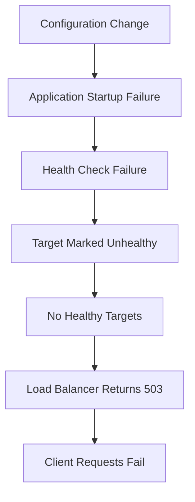

# 13- Root Cause Analysis

## Overview

Root Cause Analysis (RCA) is the process of determining **why an Elastic Beanstalk failure occurred**, not merely identifying what symptom was observed.

A weak diagnosis says:

```text
Application was unhealthy.
```

A useful diagnosis says:

```text
Application became unhealthy because the new deployment
changed the application process port from 8000 to 8080.
Elastic Beanstalk continued health-checking port 8000,
causing target health checks to fail and the load balancer
to return 503 responses.
```

The distinction matters because production systems frequently have multiple symptoms caused by a single underlying failure:

```text
Deployment
    ↓
Application configuration changed
    ↓
Application listens on unexpected port
    ↓
Health checks fail
    ↓
Instances become unhealthy
    ↓
Load balancer has no healthy targets
    ↓
Clients receive 503
```

The `503` is the **observed symptom**. The port mismatch is the **root cause**.

Effective RCA for Elastic Beanstalk requires correlating information from multiple layers:

```text
Deployment
   ↓
Elastic Beanstalk
   ↓
EC2
   ↓
Application Process
   ↓
Load Balancer
   ↓
Health Checks
   ↓
DNS / Network
   ↓
Client
```

The objective is to identify the earliest incorrect condition that caused the downstream failures.

## Why Root Cause Analysis Matters

Elastic Beanstalk abstracts much of the infrastructure management, but that abstraction does not eliminate operational complexity.

A single deployment can affect:

- Application configuration
- Environment variables
- IAM permissions
- Security groups
- Load balancer listeners
- Target groups
- Health checks
- Application processes
- Database connectivity
- Platform hooks
- Auto Scaling
- CloudFormation-managed resources

Without a disciplined RCA process, engineers often fix symptoms temporarily while leaving the underlying failure mechanism unchanged.

For example:

```text
503 error
   ↓
Restart instances
   ↓
Application recovers temporarily
   ↓
Next deployment
   ↓
503 returns
```

The restart was not a root-cause fix. It only reset the affected process.

## Root Cause vs Symptom

| Category | Example |
|---|---|
| Symptom | HTTP 503 |
| Immediate cause | No healthy load balancer targets |
| Contributing cause | Application failed its health check |
| Root cause | Deployment changed the application startup configuration |
| Corrective action | Restore correct startup configuration |
| Preventive action | Add deployment validation for the process configuration |

A useful RCA should distinguish at least these levels.

### Symptom

What users or monitoring systems observed.

Example:

```text
GET /api/orders → HTTP 503
```

### Immediate Cause

The direct condition producing the symptom.

Example:

```text
ALB has zero healthy targets.
```

### Root Cause

The condition that created the immediate cause.

Example:

```text
Application process failed to start after deployment.
```

### Contributing Factors

Conditions that allowed or amplified the incident.

Examples:

- Missing startup validation
- No deployment smoke test
- Incorrect environment variable
- Inadequate alerting
- Insufficient health-check diagnostics

### Corrective Action

What fixes the current failure.

### Preventive Action

What reduces the probability of recurrence.

## RCA Causal Chain

A useful RCA can be represented as a causal chain:



The RCA should normally work backward from the externally visible symptom:

```text
503
 ↓
Why?
 ↓
No healthy targets
 ↓
Why?
 ↓
Health checks failed
 ↓
Why?
 ↓
Application unavailable
 ↓
Why?
 ↓
Application process failed to start
 ↓
Why?
 ↓
Invalid startup configuration
```

The goal is not to keep asking "why" mechanically. The goal is to establish a technically defensible causal chain.

## Elastic Beanstalk Failure Domains

A useful RCA starts by locating the failure domain.

| Domain | Typical failures |
|---|---|
| Deployment | Failed application version, incomplete deployment |
| Platform | Platform update or runtime incompatibility |
| Application startup | Gunicorn/Uvicorn/Django startup failure |
| Configuration | Invalid environment variable or option |
| Networking | Security group, subnet, routing |
| Database | Connection failure, credentials, timeout |
| Load balancer | Listener or target health failure |
| Health checks | Incorrect path, port, protocol |
| Auto Scaling | Insufficient capacity or unhealthy instances |
| Logging | Missing or inaccessible diagnostic data |
| IAM | Missing permissions |
| CloudFormation | Resource creation/update failure |
| DNS | Incorrect hostname or routing |
| SSL/TLS | Certificate or listener configuration |

Do not begin with application code automatically.

First determine which subsystem actually failed.

## Establish the Incident Timeline

The first practical RCA task is reconstructing the timeline.

Example:

```text
10:02  Deployment started
10:04  New application version deployed
10:04  Instances restarted
10:05  Health status changed to Degraded
10:05  Target health checks began failing
10:06  HTTP 503 increased
10:08  Rollback started
10:10  Previous version restored
10:11  Health returned to Green
```

The timeline immediately suggests a relationship between:

```text
Deployment
    ↓
Health degradation
    ↓
503 errors
```

That is stronger evidence than simply observing that the application is currently unhealthy.

## Collect Evidence Before Changing Anything

A common operational mistake is changing infrastructure before collecting evidence.

For example:

```text
Production failure
    ↓
Restart instances
    ↓
Change security group
    ↓
Modify environment variables
    ↓
Redeploy
    ↓
Incident becomes harder to analyze
```

Each change can destroy useful evidence.

Before modifying the environment, capture:

- Deployment ID
- Application version
- Environment status
- Health status
- Recent events
- Instance IDs
- Target health
- Application logs
- Web server logs
- Environment variables relevant to the failure
- Load balancer metrics
- CloudFormation events
- Recent configuration changes

The exact evidence depends on the failure domain.

## First Response Questions

Start with:

```text
What failed?
When did it fail?
What changed immediately before the failure?
Which environments are affected?
Which instances are affected?
Is the failure reproducible?
Can the previous version recover?
```

The most valuable question is often:

> What changed immediately before the system became unhealthy?

A recent deployment, platform update, configuration change, certificate change, security group modification, or database change should be treated as a strong hypothesis, not automatically as proof.

## Deployment Correlation

Deployment correlation is one of the highest-value techniques in Elastic Beanstalk RCA.

Compare:

```text
Last known good version
        vs
First known bad version
```

Then identify differences in:

- Source code
- Dependencies
- Startup command
- Environment variables
- `.ebextensions`
- `.platform`
- Procfile
- Runtime version
- Application configuration
- Database migrations
- Infrastructure configuration

If rollback consistently restores health, the changed deployment becomes a strong candidate for the root cause.

It still does not prove which individual change caused the failure.

## Last Known Good Version

Define:

```text
LKG = Last Known Good
```

The LKG is the most recent version known to have operated correctly under comparable conditions.

A useful comparison is:

| Property | Last Known Good | First Known Bad |
|---|---|---|
| Application version | `v41` | `v42` |
| Python version | 3.12 | 3.12 |
| Dependencies | Previous lockfile | Updated dependency |
| Startup command | Gunicorn | Gunicorn |
| Environment variables | Same | Same |
| Health endpoint | 200 | 500 |
| Target health | Healthy | Unhealthy |

The difference between these states narrows the investigation.

## Rollback as a Diagnostic Tool

Rollback is both an operational recovery mechanism and a diagnostic signal.

Suppose:

```text
v41 → Healthy
v42 → Unhealthy
Rollback to v41 → Healthy
```

This provides strong evidence that something introduced by `v42` is responsible.

However:

```text
v41 → Healthy
v42 → Unhealthy
Rollback to v41 → Still Unhealthy
```

suggests the failure may be external to the application version.

Potential causes include:

- Database outage
- AWS infrastructure issue
- Security group change
- Certificate expiration
- Dependency service failure
- Environment configuration change
- Network issue

Rollback should therefore be treated as evidence, not automatic proof.

## Application Startup RCA

Startup failures are among the most common Elastic Beanstalk deployment failures.

Typical chain:

```text
Deployment
   ↓
Application process starts
   ↓
Import/configuration error
   ↓
Process exits
   ↓
No application listener
   ↓
Health check fails
   ↓
Target becomes unhealthy
   ↓
503
```

Common causes include:

- Missing dependency
- Incorrect Python module path
- Invalid settings
- Missing environment variable
- Database connection during startup
- Incorrect Gunicorn/Uvicorn command
- Incorrect port
- Permission failure
- Syntax error
- Runtime incompatibility

Look at application startup logs before modifying infrastructure.

## Startup Failure Example

Suppose Elastic Beanstalk reports:

```text
Health: Severe
```

The load balancer reports:

```text
Target: unhealthy
```

Application logs contain:

```text
ModuleNotFoundError: No module named 'config'
```

A weak RCA is:

```text
Load balancer health check failed.
```

A stronger RCA is:

```text
The deployment failed to start the application because
the configured WSGI module could not be imported. The
application process exited during initialization, leaving
the load balancer with no healthy targets and causing 503
responses.
```

The load balancer error is downstream.

## Health Check RCA

Health checks should be treated as a separate diagnostic layer.

A health check can fail because:

```text
Health check request
       ↓
Wrong path
Wrong port
Wrong protocol
Application startup failure
Database dependency failure
Slow response
Security group block
Application returns 4xx/5xx
```

The correct question is not:

> Why is the health check failing?

It is:

> Why is the application unable to satisfy the configured health-check contract?

## Health Check Contract

Define the contract explicitly:

| Property | Example |
|---|---|
| Protocol | HTTP |
| Port | 8000 |
| Path | `/health/` |
| Expected response | `200` |
| Timeout | Load balancer configured timeout |
| Healthy threshold | Target-group configuration |
| Unhealthy threshold | Target-group configuration |

A production health endpoint should be intentionally designed.

For example:

```http
GET /health/
```

should have predictable behavior and should not perform unnecessarily expensive operations.

## Liveness vs Readiness

A useful backend distinction is:

```text
Liveness
    ↓
Is the process running?

Readiness
    ↓
Can this instance safely receive production traffic?
```

For example:

```text
GET /health/live
GET /health/ready
```

A readiness check might verify critical dependencies where appropriate.

Avoid making health checks depend on every external dependency unless the business requirement truly demands it.

If Redis experiences a temporary problem and the health endpoint immediately returns failure, Auto Scaling may terminate healthy application processes unnecessarily.

## Database RCA

Database failures often appear as application failures.

Example:

```text
PostgreSQL unavailable
      ↓
Django startup or request fails
      ↓
Health endpoint returns 500
      ↓
Target marked unhealthy
      ↓
ALB returns 503
```

The user sees:

```text
503
```

but the root cause is:

```text
Database connectivity failure
```

Investigate:

- Database endpoint
- Port
- Security groups
- Credentials
- DNS
- TLS
- Connection limits
- Database availability
- Network routing
- Connection timeout
- Application connection pool

## Database Failure Example

Application logs:

```text
psycopg.OperationalError:
connection refused
```

Possible causes include:

```text
Wrong database host
Wrong port
Database unavailable
Security group rejection
Network ACL
Incorrect DNS
Database overloaded
```

Do not conclude:

```text
PostgreSQL is down
```

from a single connection error.

First determine which layer rejected the connection.

## Network RCA

Network failures should be analyzed hop by hop.

```text
EC2
 ↓
Subnet route
 ↓
NAT / Internet Gateway / VPC routing
 ↓
Security Group
 ↓
Network ACL
 ↓
Destination
```

For database connectivity:

```text
Application instance
      ↓
VPC routing
      ↓
Database security group
      ↓
Database listener
```

A security group attached to the application instance does not automatically grant database access.

The database's inbound rules must allow the application traffic.

## Security Group Root Cause

Suppose:

```text
Application
   ↓
PostgreSQL :5432
   ↓
Connection timeout
```

Possible root cause:

```text
RDS security group does not allow inbound TCP 5432
from the Elastic Beanstalk instance security group.
```

A proper RCA identifies:

```text
Source:
Elastic Beanstalk instance SG

Destination:
RDS SG

Protocol:
TCP

Port:
5432
```

This is much more actionable than:

```text
Network issue.
```

## Environment Variable RCA

Configuration failures often appear after deployment.

For example:

```text
DATABASE_URL
AWS_REGION
SECRET_KEY
DJANGO_SETTINGS_MODULE
PORT
```

may be missing or malformed.

The application then fails during initialization.

Investigate configuration differences between:

```text
Last Known Good
vs
Current Environment
```

Do not expose secret values in incident reports.

Record:

```text
Variable exists: Yes
Variable value: Redacted
```

rather than:

```text
DATABASE_PASSWORD=actual-secret
```

## IAM RCA

An application may successfully start but fail when it accesses AWS resources.

Example:

```text
Django/FastAPI
      ↓
boto3
      ↓
S3
      ↓
AccessDenied
```

Potential root cause:

```text
Elastic Beanstalk instance profile does not contain
the required permission.
```

Check:

- Instance profile
- IAM role
- Attached policies
- Resource policy
- Region
- Bucket/resource ARN
- Explicit denies

Avoid granting:

```text
AdministratorAccess
```

just to make an application work.

Identify the exact missing permission.

## CloudFormation RCA

Elastic Beanstalk environments use AWS infrastructure resources managed through AWS services including CloudFormation.

A configuration change can therefore fail before the application is even deployed.

Example:

```text
Elastic Beanstalk configuration change
        ↓
CloudFormation update
        ↓
Resource creation/update fails
        ↓
Environment update fails
```

Investigate CloudFormation events when an environment configuration change fails.

Useful CLI command:

```bash
aws cloudformation describe-stack-events \
  --stack-name <stack-name>
```

Look for:

```text
CREATE_FAILED
UPDATE_FAILED
DELETE_FAILED
```

The first meaningful failure event is often more useful than later cascading failures.

## First Failure vs Cascading Failures

Consider:

```text
IAM policy update fails
       ↓
Application cannot access S3
       ↓
Startup task fails
       ↓
Application unhealthy
       ↓
Target unhealthy
       ↓
503
```

There are many failures, but the first relevant causal failure may be:

```text
IAM policy update
```

Do not treat every error as an independent root cause.

A production system can generate hundreds of downstream errors from one failure.

## Finding the Earliest Failure

Use chronological ordering:

```text
10:00:01  Configuration update
10:00:03  CloudFormation resource update begins
10:00:09  IAM-related update fails
10:00:11  Application deployment starts
10:00:15  Application startup fails
10:00:20  Health checks fail
10:00:30  503 increases
```

The earliest causal event deserves priority.

Later errors may simply be consequences.

## Five Whys

The Five Whys technique can be useful when applied to technical evidence.

Example:

### Why did clients receive 503?

Because the load balancer had no healthy targets.

### Why were targets unhealthy?

Because the application health check returned `500`.

### Why did the health check return `500`?

Because Django could not initialize its database connection.

### Why could Django not connect?

Because the database security group did not allow the new instance security group.

### Why was the security group not updated?

Because the environment configuration was changed without updating the database ingress dependency.

Root cause:

```text
Infrastructure configuration change omitted the required
database security-group dependency.
```

The 503 was only the final symptom.

## Five Whys Limitations

Five Whys should not be used mechanically.

Avoid chains such as:

```text
Why?
Because X.

Why X?
Because Y.

Why Y?
Because Z.
```

without evidence.

Instead, validate each step with:

- Logs
- Metrics
- Configuration
- Deployment history
- AWS events
- Network behavior
- Reproduction
- Rollback results

A good RCA is evidence-driven.

## Hypothesis-Driven Troubleshooting

Instead of randomly changing configuration, form explicit hypotheses.

Example:

```text
Hypothesis:
The application is unhealthy because the new deployment
changed the startup command.

Evidence:
1. Previous version starts successfully.
2. New version exits immediately.
3. Logs show startup command failure.
4. Rollback restores health.

Confidence:
High
```

Compare multiple hypotheses:

| Hypothesis | Evidence | Status |
|---|---|---|
| DNS failure | DNS resolves correctly | Rejected |
| Certificate failure | TLS succeeds | Rejected |
| Application startup failure | Process exits | Supported |
| Database outage | DB reachable from another environment | Weak |
| Security group issue | No relevant SG changes | Unlikely |

This prevents confirmation bias.

## Change Correlation

When investigating an incident, inspect changes immediately preceding it.

Potential changes include:

- Application deployment
- Environment configuration
- Environment variables
- `.ebextensions`
- `.platform`
- Procfile
- Dependency version
- Python runtime
- Platform version
- Security group
- IAM role
- Load balancer listener
- Health-check path
- Route 53 record
- ACM certificate
- Database configuration

A change is suspicious when:

```text
Change
  ↓
Failure begins immediately
  ↓
Rollback removes failure
```

But correlation must still be validated against technical evidence.

## Configuration Drift

A production environment may differ from the expected configuration.

Examples:

```text
Git configuration
      ≠
Elastic Beanstalk environment
```

or:

```text
Infrastructure-as-code
      ≠
Actual AWS resource
```

Drift can cause incidents that cannot be reproduced locally.

Investigate:

- Environment configuration
- AWS resource configuration
- Deployment artifacts
- Platform version
- Environment variables
- Security groups
- IAM
- Load balancer listeners

A strong RCA should identify relevant drift rather than simply recording the application error.

## Reproduction

The strongest RCA often comes from reproducing the failure.

Useful approaches include:

```text
Production configuration
       ↓
Staging environment
       ↓
Same application version
       ↓
Same relevant environment variables
       ↓
Same dependency versions
       ↓
Observe failure
```

Do not reproduce destructive production operations directly unless there is an explicit operational procedure.

For application failures, reproduce with:

- Same application version
- Same Python/runtime version
- Same dependency versions
- Equivalent environment variables
- Equivalent startup command
- Equivalent network dependencies

## Logs as Evidence

A useful RCA correlates logs across layers.

### Elastic Beanstalk

Use environment events and logs to understand deployment and platform behavior.

### Application

Look for:

```text
Tracebacks
Startup failures
Connection errors
Timeouts
Configuration errors
Permission errors
```

### Web Server

Look for:

```text
502
503
Connection refused
Upstream timeout
```

### Load Balancer

Look for:

```text
Target failures
Connection errors
HTTP 5xx
Health-check failures
```

The timestamp is critical.

```text
Application log timestamp
        ↕
Load balancer timestamp
        ↕
Deployment event timestamp
```

Ensure timestamps are interpreted consistently, especially when logs use UTC and engineers use local time.

## Metrics as Evidence

Logs explain individual events.

Metrics show whether the event was isolated or systemic.

Useful metrics include:

- Request count
- HTTP 4xx
- HTTP 5xx
- Target response time
- CPU utilization
- Memory utilization
- Network traffic
- Target health
- Auto Scaling activity

For example:

```text
CPU normal
Memory normal
5xx suddenly increases
Deployment occurred immediately before increase
```

This points more strongly toward a deployment or application configuration problem than capacity exhaustion.

## Correlation Across AWS Services

A production RCA may require correlation across:

```text
Elastic Beanstalk
      ↓
CloudFormation
      ↓
EC2
      ↓
Elastic Load Balancing
      ↓
CloudWatch
      ↓
RDS
      ↓
IAM
      ↓
Route 53
      ↓
ACM
```

Do not assume the service producing the visible error owns the root cause.

For example:

```text
ALB → 503
```

does not necessarily mean:

```text
ALB is broken.
```

The ALB may be correctly reporting that all backend targets are unhealthy.

## Incident Evidence Matrix

Create a matrix during complex incidents:

| Observation | Evidence | Interpretation |
|---|---|---|
| Deployment completed | EB events | Version was applied |
| Instances unhealthy | EB health | Runtime problem likely |
| Target health failed | ALB | Backend unavailable |
| DNS resolves | `dig` | DNS likely healthy |
| TLS succeeds | `curl`/OpenSSL | Certificate path likely healthy |
| Application exits | Logs | Startup failure |
| Rollback succeeds | Health recovers | Strong deployment correlation |

This makes the reasoning auditable.

## Root Cause Confidence

Not every RCA reaches the same level of certainty.

Use explicit confidence:

| Confidence | Meaning |
|---|---|
| Confirmed | Reproduced or directly demonstrated |
| High | Multiple independent signals support the cause |
| Medium | Strong correlation but incomplete proof |
| Low | Plausible hypothesis with limited evidence |

Example:

```text
Root Cause: Invalid Gunicorn module path
Confidence: Confirmed

Evidence:
- Application exits during startup.
- Startup log shows ModuleNotFoundError.
- Same version reproduces failure in staging.
- Correcting the module path restores health.
```

This is much stronger than:

```text
Root Cause: Deployment issue
```

## Corrective vs Preventive Actions

RCA should produce actions at multiple levels.

| Action type | Example |
|---|---|
| Immediate recovery | Roll back application |
| Corrective | Fix startup command |
| Preventive | Validate startup command in CI |
| Detection | Alert on target-health degradation |
| Process | Require deployment verification |
| Architecture | Isolate critical dependencies |

Avoid writing:

```text
Action:
Be more careful during deployment.
```

This is not an engineering control.

Prefer:

```text
Add CI validation that imports the configured WSGI/ASGI
application before producing the deployment artifact.
```

## Action Quality

Good RCA actions are:

- Specific
- Testable
- Assigned
- Prioritized
- Measurable

Example:

```text
Action:
Add a CI startup smoke test.

Validation:
Application process starts successfully using the exact
production startup command.

Owner:
Backend Platform

Priority:
High
```

## Preventing Deployment-Related Incidents

A mature deployment pipeline should validate:

```text
Code
 ↓
Dependency installation
 ↓
Application import
 ↓
Configuration validation
 ↓
Startup command
 ↓
Health endpoint
 ↓
Deployment
 ↓
Smoke test
```

For Python applications, basic CI checks can include:

```bash
python -m compileall .
```

and application-specific validation such as:

```bash
python manage.py check
```

For Django, production deployment checks can be useful:

```bash
python manage.py check --deploy
```

For ASGI applications, verify that the configured module can be imported:

```bash
python -c "from app.main import app; print(app)"
```

The exact command should match the production application's startup configuration.

## Preventing Health Check Incidents

Health-check configuration should be version-controlled where possible.

Validate:

- Path
- Port
- Protocol
- Expected status
- Startup time
- Dependency requirements

Avoid health endpoints that:

- Execute expensive queries
- Perform long-running operations
- Call many external services
- Depend on unnecessary infrastructure
- Return inconsistent status codes

The health endpoint is part of the deployment contract.

## Preventing Configuration Incidents

Configuration should be validated before deployment.

Examples:

```text
Required environment variables
Allowed values
Port format
Database URL format
AWS region
Application module
Secret presence
```

Never log secret values to validate them.

Instead:

```text
DATABASE_URL present: yes
SECRET_KEY present: yes
AWS_REGION: ap-south-1
```

## Preventing IAM Incidents

Use least privilege and validate permissions before deployment.

A production pipeline should know which AWS resources the application requires.

Avoid:

```text
Application failure
   ↓
Add AdministratorAccess
```

Prefer:

```text
AccessDenied
   ↓
Identify API action
   ↓
Identify resource ARN
   ↓
Grant minimum required permission
```

## Preventing Network Incidents

Document dependency paths:

```text
Elastic Beanstalk
   ↓
RDS PostgreSQL :5432

Elastic Beanstalk
   ↓
Redis :6379

Elastic Beanstalk
   ↓
AWS APIs :443
```

For each dependency, define:

- Source
- Destination
- Port
- Protocol
- Security group relationship
- DNS requirement
- Timeout expectations

This makes network failures easier to diagnose.

## Production RCA Example

### Incident

Users receive:

```text
HTTP 503 Service Unavailable
```

### Timeline

```text
14:00 Deployment started
14:03 Deployment completed
14:04 Environment changed from Green to Red
14:04 Target health checks failed
14:05 HTTP 503 increased
14:07 Rollback started
14:09 Environment recovered
```

### Investigation

DNS:

```text
api.example.com → correct load balancer
```

TLS:

```text
Certificate valid
```

Load balancer:

```text
No healthy targets
```

Application logs:

```text
ModuleNotFoundError: No module named 'app.wsgi'
```

Previous version:

```text
Healthy
```

Rollback:

```text
Healthy
```

### Root Cause

```text
The deployment changed the configured application module,
causing the Python application process to fail during startup.
The load balancer therefore had no healthy targets and
returned HTTP 503 responses.
```

### Contributing Factors

```text
- Startup import was not validated in CI.
- Deployment smoke test did not verify the application endpoint.
- Health failure was detected after users experienced errors.
```

### Corrective Actions

```text
- Restore the correct WSGI module.
- Redeploy the corrected version.
- Validate application startup before production deployment.
```

### Preventive Actions

```text
- Add production-equivalent startup validation to CI.
- Add post-deployment smoke tests.
- Alert on rapid target-health degradation.
- Document the production startup command.
```

This is a complete RCA because it connects:

```text
Change
 ↓
Technical failure
 ↓
Infrastructure consequence
 ↓
User impact
 ↓
Recovery
 ↓
Prevention
```

## RCA for a Database Failure

### Symptom

```text
HTTP 503
```

### Investigation

```text
ALB
 ↓
No healthy targets
 ↓
Application health check = 500
 ↓
Application log = database connection timeout
 ↓
Database reachable? No
 ↓
Security group changed 5 minutes earlier
```

### Root Cause

```text
A security-group configuration change removed the required
database ingress path from the Elastic Beanstalk instance
security group to PostgreSQL.
```

### Preventive Action

```text
Represent the security-group dependency in infrastructure-as-code
and validate connectivity during deployment verification.
```

The RCA should not stop at:

```text
Database connection failed.
```

That is the immediate cause, not necessarily the root cause.

## RCA for a Memory Incident

### Symptom

```text
Environment health degraded.
Instances repeatedly become unhealthy.
```

### Investigation

```text
Memory usage rises continuously
       ↓
Application workers restart
       ↓
Health checks intermittently fail
       ↓
Auto Scaling replaces instances
```

### Root Cause Candidate

```text
Application memory usage grows continuously under sustained
request load, eventually exhausting instance memory.
```

Further evidence may include:

- Memory metrics
- Worker count
- Request rate
- Heap/profile data
- Instance replacement events
- Application logs

A proper RCA should distinguish:

```text
High memory
```

from:

```text
Memory leak or intentionally oversized workload
```

The first is an observation; the second requires additional evidence.

## RCA for Auto Scaling Failure

Suppose traffic increases:

```text
Request rate ↑
      ↓
CPU ↑
      ↓
Auto Scaling launches instances
      ↓
New instances fail health checks
      ↓
Capacity does not actually increase
      ↓
Existing instances remain overloaded
```

The root cause may not be insufficient Auto Scaling capacity.

It may be:

```text
New instances cannot successfully initialize.
```

Investigate:

- Startup time
- User data/platform hooks
- Application dependencies
- Health-check configuration
- Security groups
- Database connection limits
- IAM permissions

This distinction is important because increasing the desired capacity will not fix instances that cannot become healthy.

## RCA for DNS Failure

### Symptom

```text
api.example.com cannot be reached
```

### Investigation

```text
dig api.example.com
    ↓
Wrong IP/endpoint
    ↓
Route 53 record points to previous environment
    ↓
Previous environment terminated
```

### Root Cause

```text
Production DNS continued pointing to a terminated Elastic
Beanstalk environment after the environment migration.
```

### Preventive Action

```text
Manage DNS records through infrastructure-as-code and include
DNS validation in environment cutover procedures.
```

## RCA for SSL Failure

### Symptom

```text
Certificate hostname mismatch
```

### Investigation

```text
DNS → correct
TLS → successful
Certificate → wrong SAN
```

### Root Cause

```text
The load balancer HTTPS listener was configured with a certificate
that did not include the production API hostname.
```

### Preventive Action

```text
Validate certificate SAN coverage as part of deployment
and infrastructure verification.
```

## RCA Quality Checklist

Before closing an incident, verify that the RCA answers:

### What Happened?

```text
What did users experience?
```

### When Did It Happen?

```text
When did the first failure occur?
```

### What Changed?

```text
What changed immediately beforehand?
```

### Why Did It Happen?

```text
What technical condition caused the failure?
```

### What Was the Impact?

```text
Which users, endpoints, environments, or services were affected?
```

### How Was It Detected?

```text
Monitoring, alert, customer report, deployment failure?
```

### How Was It Recovered?

```text
Rollback, configuration correction, scaling, failover?
```

### Why Was It Not Prevented?

```text
Missing test, missing monitoring, configuration drift,
architectural dependency, operational process?
```

### How Will Recurrence Be Prevented?

```text
What concrete engineering control will be added?
```

## Common RCA Mistakes

### Blaming the Last Changed Component

A deployment occurred before the incident, so the deployment is automatically blamed.

**Why it fails:** The deployment may only expose an existing infrastructure or dependency problem.

**Better approach:** Correlate the deployment with logs, metrics, rollback behavior, and configuration differences.

### Treating HTTP Status Codes as Root Causes

```text
Root cause: 503
```

is not meaningful.

`503` is an outcome.

Investigate why the service could not serve the request.

### Restarting Too Early

Restarting instances can remove useful evidence.

**Better approach:** Capture logs, events, metrics, and state before recovery actions when operationally safe.

### Changing Multiple Things at Once

For example:

```text
Change security group
Change environment variables
Redeploy
Restart instances
Change health check
```

If the application recovers, you do not know which change fixed it.

Prefer controlled changes whenever the incident permits.

### Assuming AWS Is Broken

Infrastructure services can fail, but application and configuration failures are common.

Do not classify an incident as an AWS failure without evidence.

### Ignoring Downstream Dependencies

An application can be healthy locally but fail in Elastic Beanstalk because it cannot reach:

- PostgreSQL
- Redis
- S3
- Secrets Manager
- External APIs

Investigate the full dependency chain.

### Closing the Incident After Recovery

Recovery does not prove the problem has been prevented.

A complete incident process includes:

```text
Recovery
 ↓
Root cause
 ↓
Corrective action
 ↓
Preventive action
 ↓
Verification
```

## Production RCA Anti-Patterns

| Anti-pattern | Problem |
|---|---|
| "Deployment failed" | Too broad |
| "AWS issue" | Unsupported without evidence |
| "503 caused outage" | Confuses symptom with cause |
| "Restart fixed it" | Does not explain why |
| "Database was down" | May ignore network/authentication layer |
| "Security group issue" | Does not identify source/destination/port |
| "Configuration mistake" | Does not identify the incorrect setting |
| "Developer error" | Blame instead of technical causality |
| "Fixed manually" | Not reproducible or preventive |
| "No recurrence expected" | No engineering evidence |

## Avoiding Blame-Oriented RCA

A production RCA should focus on systems and controls.

Prefer:

```text
The deployment process allowed an invalid startup configuration
to reach production without validation.
```

Instead of:

```text
The developer entered the wrong startup command.
```

The first statement identifies an engineering control failure.

The second focuses on an individual and does not prevent recurrence.

## Senior-Level RCA Model

A mature RCA considers five dimensions:

```text
Technical Cause
      +
Contributing Factors
      +
Detection Gap
      +
Recovery Gap
      +
Prevention
```

For example:

```text
Technical Cause:
Invalid application startup command

Contributing Factors:
No production-equivalent startup validation

Detection Gap:
No alert on rapid target-health degradation

Recovery Gap:
Rollback procedure was manual

Prevention:
CI startup validation + automated smoke test + alerting
```

This provides more operational value than identifying a single faulty line of configuration.

## RCA Template

Use the following structure for production incidents:

```markdown
# Incident: <Short Description>

## Incident Overview

<What happened and what users experienced.>

## Impact

- Affected service:
- Affected environment:
- Affected endpoints:
- Start time:
- End time:
- Duration:
- User impact:

## Timeline

| Time | Event |
|---|---|
| HH:MM | <Event> |
| HH:MM | <Event> |
| HH:MM | <Event> |

## Detection

<How the incident was detected.>

## Root Cause

<Specific technical root cause.>

## Contributing Factors

- <Factor>
- <Factor>

## Evidence

- <Log/event/metric>
- <Configuration difference>
- <Rollback/reproduction result>

## Recovery

<How service was restored.>

## Corrective Actions

- [ ] <Immediate technical fix>

## Preventive Actions

- [ ] <Automated validation>
- [ ] <Monitoring improvement>
- [ ] <Architecture/process improvement>

## Verification

<How the corrective and preventive actions will be validated.>
```

## Operational Best Practices

For Elastic Beanstalk environments:

- Keep deployment versions identifiable.
- Preserve a known-good application version.
- Use immutable or controlled deployment strategies where appropriate.
- Version-control application configuration.
- Minimize manual production changes.
- Validate application startup before deployment.
- Test health endpoints before production rollout.
- Monitor target health after deployment.
- Monitor application and load balancer 5xx metrics.
- Maintain deployment rollback procedures.
- Preserve sufficient application and platform logs.
- Track infrastructure changes.
- Document external dependencies.
- Use least-privilege IAM policies.
- Avoid exposing secrets in logs or RCA documents.
- Automate recurring validation wherever practical.

## Key Takeaways

- Root Cause Analysis determines **why** a failure occurred, not merely what error users observed.
- `503`, unhealthy instances, failed health checks, and deployment failures are often symptoms rather than root causes.
- Start RCA by reconstructing the timeline and identifying the earliest meaningful failure.
- Compare the **Last Known Good** version with the **First Known Bad** version.
- Use rollback as evidence, but do not assume rollback automatically proves the deployment was the root cause.
- Separate **symptom**, **immediate cause**, **root cause**, **contributing factors**, **corrective actions**, and **preventive actions**.
- Investigate Elastic Beanstalk failures across deployment, application, EC2, load balancer, networking, database, IAM, CloudFormation, DNS, and SSL layers.
- Correlate logs, metrics, configuration, deployment history, and AWS events rather than relying on a single error message.
- The first downstream error is not necessarily the root cause.
- A load balancer returning `503` may simply be reporting that all backend targets are unhealthy.
- Health-check failures should be traced back to the reason the application cannot satisfy its health-check contract.
- Database connection failures should be investigated through DNS, routing, security groups, authentication, database availability, and connection limits.
- Security-group RCA should identify the exact **source, destination, protocol, and port**.
- CloudFormation failures should be investigated from the earliest meaningful stack event rather than the final cascading error.
- Configuration drift can cause failures that cannot be reproduced in local development.
- Hypothesis-driven troubleshooting is more reliable than changing infrastructure randomly.
- Every important RCA claim should have supporting evidence.
- Assign an explicit confidence level when the root cause is not directly confirmed.
- Corrective actions restore the current system; preventive actions reduce recurrence.
- "Be more careful" is not a preventive engineering control.
- Prefer automated controls such as CI startup validation, deployment smoke tests, health monitoring, configuration validation, and least-privilege IAM checks.
- Avoid blame-oriented RCA. Focus on technical causes and system controls.
- A mature RCA addresses not only the technical failure but also detection, recovery, and prevention.
- The strongest RCA connects the complete causal chain:

```text
Change
  ↓
Technical Failure
  ↓
Infrastructure Consequence
  ↓
User Impact
  ↓
Recovery
  ↓
Corrective Action
  ↓
Preventive Control
```

- A production incident is not fully resolved when the service recovers; it is resolved when the cause is understood and the recurrence risk has been meaningfully reduced.