# README

## Overview

This folder contains production-oriented troubleshooting guidance for **AWS Elastic Beanstalk** environments.

The focus is diagnosing failures across the complete application delivery path rather than treating individual error messages as isolated problems.

```text
Deployment
    ↓
Elastic Beanstalk
    ↓
EC2 / Application Process
    ↓
Load Balancer
    ↓
Health Checks
    ↓
Network / Database / AWS Dependencies
    ↓
DNS / SSL
    ↓
Client
```

The troubleshooting material progresses from common deployment and runtime failures to deeper infrastructure diagnosis and structured root cause analysis.

## Quick Navigation

| File | Focus |
|---|---|
| [02- Deployment Failures](./02-%20Deployment%20Failures.md) | Diagnosing failed Elastic Beanstalk application deployments |
| [03- Application Startup Failures](./03-%20Application%20Startup%20Failures.md) | Investigating applications that fail to start or terminate during initialization |
| [04- Health Check Failures](./04-%20Health%20Check%20Failures.md) | Troubleshooting unhealthy instances and failed load balancer health checks |
| [05- 502 and 503 Errors](./05-%20502%20and%20503%20Errors.md) | Diagnosing upstream and unavailable-backend HTTP errors |
| [06- Database Connectivity Issues](./06-%20Database%20Connectivity%20Issues.md) | Troubleshooting PostgreSQL/MySQL connectivity, authentication, routing, and timeouts |
| [07- Security Group and Network Issues](./07-%20Security%20Group%20and%20Network%20Issues.md) | Diagnosing VPC routing, security groups, ports, and network access failures |
| [08- Environment Variable Issues](./08-%20Environment%20Variable%20Issues.md) | Troubleshooting missing, incorrect, or inconsistent application configuration |
| [09- Auto Scaling and Performance Issues](./09-%20Auto%20Scaling%20and%20Performance%20Issues.md) | Diagnosing capacity, latency, CPU, memory, scaling, and instance-health problems |
| [10- Logging and Platform Hook Failures](./10-%20Logging%20and%20Platform%20Hook%20Failures.md) | Troubleshooting application/platform logs and `.platform` hook execution |
| [11- CloudFormation Failures](./11-%20CloudFormation%20Failures.md) | Diagnosing infrastructure update and resource provisioning failures |
| [12- DNS and SSL Issues](./12-%20DNS%20and%20SSL%20Issues.md) | Troubleshooting Route 53, DNS resolution, certificates, HTTPS, and listener issues |
| [13- Root Cause Analysis](./13-%20Root%20Cause%20Analysis.md) | Performing evidence-driven production RCA and preventing recurrence |

## Troubleshooting Flow

Use the following decision path when an Elastic Beanstalk environment is unhealthy:

```mermaid
flowchart TD
    A[Incident Detected] --> B{Deployment Related?}

    B -->|Yes| C[Deployment Failures]
    B -->|No| D{Application Starting?}

    C --> D

    D -->|No| E[Application Startup Failures]
    D -->|Yes| F{Health Check Passing?}

    E --> F

    F -->|No| G[Health Check Failures]
    F -->|Yes| H{HTTP 502/503?}

    G --> H

    H -->|Yes| I[502 / 503 Investigation]
    H -->|No| J{Database Access Required?}

    I --> J

    J -->|Yes| K[Database Connectivity]
    J -->|No| L{Network Access Required?}

    K --> L

    L -->|Yes| M[Security Group / Network]
    L -->|No| N{Configuration Issue?}

    M --> N

    N -->|Yes| O[Environment Variables]
    N -->|No| P{Capacity or Latency Issue?}

    O --> P

    P -->|Yes| Q[Auto Scaling / Performance]
    P -->|No| R{Platform / Hook / Logging Issue?}

    Q --> R

    R -->|Yes| S[Logging / Platform Hooks]
    R -->|No| T{Infrastructure Update Failed?}

    S --> T

    T -->|Yes| U[CloudFormation]
    T -->|No| V{DNS / TLS Issue?}

    U --> V

    V -->|Yes| W[DNS / SSL]
    V -->|No| X[Perform Root Cause Analysis]

    W --> X
```



## Recommended Investigation Order

For production incidents, avoid changing multiple components immediately. Establish evidence first.

### Establish the Symptom

Identify exactly what is failing:

- Deployment
- Environment health
- Application startup
- Health check
- HTTP request
- Database connection
- AWS API call
- DNS resolution
- TLS handshake
- Performance or capacity

For example:

```text
Bad:
"Elastic Beanstalk is broken."

Better:
"POST /api/orders returns 503 after deployment v42,
while the environment reports zero healthy targets."
```

### Establish the Timeline

Determine:

```text
Last known good state
        ↓
Change
        ↓
First observed failure
        ↓
Failure propagation
        ↓
Recovery
```

Pay particular attention to:

- Application deployments
- Configuration changes
- Platform updates
- IAM changes
- Security group changes
- Database changes
- DNS changes
- Certificate changes

### Identify the Failure Layer

Determine where the first meaningful failure occurs:

```text
Client
  ↓
DNS
  ↓
TLS
  ↓
Load Balancer
  ↓
Target / EC2
  ↓
Application Process
  ↓
Application Dependency
  ↓
Database / AWS Service
```

Do not automatically blame the layer producing the final error.

A load balancer returning `503` may simply be reporting that all application targets are unhealthy.

### Collect Evidence

Useful evidence includes:

- Elastic Beanstalk events
- Application logs
- Web server logs
- Load balancer target health
- CloudWatch metrics
- EC2 instance state
- CloudFormation events
- Security group configuration
- Environment variables
- Deployment history
- Database connectivity
- DNS resolution
- TLS certificate configuration

### Form a Hypothesis

Example:

```text
Hypothesis:
The deployment caused the application process to fail during startup.

Evidence:
- Previous version is healthy.
- New version exits immediately.
- Startup logs show an import error.
- Rollback restores health.
```

Then validate the hypothesis instead of making unrelated configuration changes.

## Failure Classification

| Failure | First Investigation Area | Typical Evidence |
|---|---|---|
| Deployment failure | Elastic Beanstalk events | Deployment status/events |
| Application won't start | Application logs | Import/configuration/startup errors |
| Unhealthy environment | Health checks | Target health and application response |
| HTTP 502 | Proxy/application path | Upstream connection or response failure |
| HTTP 503 | Target availability | No healthy backend targets |
| Database timeout | Network/database | Connection timeout or refusal |
| Access denied | IAM | `AccessDenied` |
| Connection timeout | Network | Security group/routing |
| Scaling failure | Auto Scaling | Instance launches/replacements |
| Platform hook failure | `.platform` / logs | Hook execution errors |
| Infrastructure update failure | CloudFormation | `CREATE_FAILED` / `UPDATE_FAILED` |
| DNS failure | Route 53 / DNS | Incorrect resolution |
| HTTPS failure | ACM / load balancer | Certificate/listener errors |

## Evidence Hierarchy

Not all evidence has the same diagnostic value.

Prefer:

```text
Direct technical evidence
        ↓
Reproduction
        ↓
Correlated logs and metrics
        ↓
Configuration comparison
        ↓
Deployment correlation
        ↓
Reasonable hypothesis
        ↓
Guess
```

For example:

```text
"Deployment happened before the outage"
```

is correlation.

Whereas:

```text
"Deployment changed the WSGI module, the process exited with
ModuleNotFoundError, and reverting the module restores health"
```

is strong causal evidence.

## Production Troubleshooting Principles

### Preserve Evidence

Before restarting or redeploying, capture relevant:

- Logs
- Events
- Metrics
- Configuration
- Instance state
- Target health

Recovery is important, but premature recovery can destroy diagnostic evidence.

### Change One Important Variable at a Time

Avoid:

```text
Change security group
+ change environment variables
+ modify health check
+ restart instances
+ redeploy
```

If the environment recovers, the actual cause remains unknown.

Prefer controlled changes whenever incident conditions allow.

### Compare Known-Good and Known-Bad States

A powerful diagnostic technique is:

```text
Last Known Good
        ↕
First Known Bad
```

Compare:

- Application version
- Dependencies
- Runtime
- Startup command
- Environment variables
- Platform configuration
- Network configuration
- IAM
- Health checks

### Follow the Causal Chain

A useful production investigation often looks like:

```text
Configuration Change
        ↓
Application Failure
        ↓
Health Check Failure
        ↓
Target Unhealthy
        ↓
No Healthy Targets
        ↓
HTTP 503
        ↓
User Impact
```

Do not stop at the final observable symptom.

## Backend Application Considerations

Elastic Beanstalk frequently hosts Python applications such as Django and FastAPI.

Typical runtime paths include:

```text
Internet
   ↓
Load Balancer
   ↓
Elastic Beanstalk Instance
   ↓
Nginx / Web Server
   ↓
Gunicorn / Uvicorn
   ↓
Django / FastAPI
   ↓
Redis / PostgreSQL / AWS APIs
```

A failure at any layer can surface as an application-level error.

For Python applications, investigate:

- WSGI/ASGI module
- Gunicorn/Uvicorn configuration
- Python runtime
- Dependency installation
- Environment variables
- Database configuration
- Redis connectivity
- Application startup hooks
- Static/media configuration
- File permissions
- Platform hooks

## Security Considerations

Troubleshooting must not weaken production security.

Avoid:

```text
Add 0.0.0.0/0
Grant AdministratorAccess
Log database passwords
Print secret values
Disable TLS verification
```

Prefer:

- Least-privilege IAM
- Security-group references instead of broad CIDRs
- Private database connectivity
- TLS for external connections
- Redacted logs
- Controlled administrative access
- Auditable infrastructure changes

When recording configuration evidence, record presence and metadata rather than secret values:

```text
DATABASE_PASSWORD: configured
SECRET_KEY: configured
AWS_REGION: ap-south-1
```

## Monitoring and Detection

A mature Elastic Beanstalk environment should provide enough telemetry to identify failures quickly.

Monitor at minimum:

- Environment health
- Instance health
- HTTP 4xx/5xx
- Load balancer target health
- Request latency
- CPU utilization
- Memory utilization where available
- Auto Scaling activity
- Application errors
- Deployment status

The goal is to detect both:

```text
User-facing failure
```

and:

```text
Leading indicators of failure
```

For example:

```text
Memory ↑
   ↓
Response latency ↑
   ↓
Health checks become slow
   ↓
Targets become unhealthy
   ↓
503 ↑
```

Detecting memory pressure before target failure provides a larger recovery window.

## Root Cause Analysis

If the immediate troubleshooting process restores service but the underlying cause is uncertain, use the [13- Root Cause Analysis](./13-%20Root%20Cause%20Analysis.md) guide.

A complete RCA should distinguish:

| Layer | Question |
|---|---|
| Symptom | What did users observe? |
| Immediate cause | What directly produced the symptom? |
| Root cause | What created the immediate failure? |
| Contributing factors | What made the incident possible or worse? |
| Recovery | How was service restored? |
| Corrective action | What fixes the current defect? |
| Preventive action | What prevents recurrence? |

Example:

```text
Symptom:
HTTP 503

Immediate Cause:
No healthy load balancer targets

Root Cause:
Application process failed during startup

Contributing Factor:
Startup configuration was not validated in CI

Corrective Action:
Fix application startup configuration

Preventive Action:
Add production-equivalent startup validation
```

## Recommended Troubleshooting Sequence

For a new Elastic Beanstalk incident:

1. Identify the exact user-visible symptom.
2. Establish the incident start time.
3. Identify the last known good state.
4. Review recent deployments and infrastructure changes.
5. Check Elastic Beanstalk environment events and health.
6. Determine whether application processes are running.
7. Inspect application and platform logs.
8. Verify load balancer target health.
9. Validate health-check configuration.
10. Check database and external dependencies.
11. Check security groups and network paths.
12. Check IAM permissions when AWS resources are involved.
13. Check CloudFormation events for infrastructure failures.
14. Check DNS and TLS for endpoint-level failures.
15. Form and test a root-cause hypothesis.
16. Recover using the safest available mechanism.
17. Document corrective and preventive actions.

## Troubleshooting by Symptom

### Deployment Fails

Start with:

```text
02- Deployment Failures.md
```

Then investigate:

- Application artifact
- Dependencies
- Configuration
- Platform compatibility
- Hooks
- CloudFormation
- IAM

### Application Does Not Start

Start with:

```text
03- Application Startup Failures.md
```

Focus on:

- Startup command
- WSGI/ASGI module
- Python dependencies
- Environment variables
- Runtime errors
- Platform hooks

### Environment Is Unhealthy

Start with:

```text
04- Health Check Failures.md
```

Focus on:

- Health-check path
- Port
- Protocol
- Application response
- Instance health
- Target health

### 502 / 503 Responses

Start with:

```text
05- 502 and 503 Errors.md
```

Then trace:

```text
Client
 ↓
Load Balancer
 ↓
Target
 ↓
Web Server
 ↓
Application Process
```

### Database Connection Failure

Start with:

```text
06- Database Connectivity Issues.md
```

Check:

```text
DNS
 ↓
Routing
 ↓
Security Group
 ↓
Port
 ↓
Authentication
 ↓
Database Availability
 ↓
Connection Limits
```

### Network Failure

Start with:

```text
07- Security Group and Network Issues.md
```

Identify:

```text
Source
Destination
Protocol
Port
Route
Security Group
```

### Configuration Failure

Start with:

```text
08- Environment Variable Issues.md
```

Compare the current environment with the last known good configuration.

### Performance or Scaling Failure

Start with:

```text
09- Auto Scaling and Performance Issues.md
```

Investigate:

- CPU
- Memory
- Request rate
- Latency
- Worker count
- Instance capacity
- Scaling policies
- Startup time

### Logs or Platform Hooks Fail

Start with:

```text
10- Logging and Platform Hook Failures.md
```

Investigate:

- Log collection
- `.platform` hooks
- Hook permissions
- Execution order
- Exit codes
- Platform/runtime compatibility

### Infrastructure Update Fails

Start with:

```text
11- CloudFormation Failures.md
```

Focus on the earliest meaningful CloudFormation event.

### DNS or HTTPS Failure

Start with:

```text
12- DNS and SSL Issues.md
```

Trace:

```text
DNS
 ↓
Load Balancer
 ↓
Listener
 ↓
Certificate
 ↓
Target
```

### Unknown or Recurring Failure

Start with:

```text
13- Root Cause Analysis.md
```

Use evidence-driven investigation instead of repeated manual recovery.

## Troubleshooting Command Reference

Useful AWS CLI commands include:

```bash
aws elasticbeanstalk describe-environments
```

```bash
aws elasticbeanstalk describe-environment-health \
  --environment-name <environment-name> \
  --attribute-names All
```

```bash
aws elasticbeanstalk describe-events \
  --environment-name <environment-name>
```

Retrieve environment information:

```bash
aws elasticbeanstalk describe-configuration-settings \
  --application-name <application-name> \
  --environment-name <environment-name>
```

Inspect CloudFormation stack events when an infrastructure update fails:

```bash
aws cloudformation describe-stack-events \
  --stack-name <stack-name>
```

For DNS investigation:

```bash
dig api.example.com
```

For HTTPS verification:

```bash
curl -v https://api.example.com/health
```

For an application endpoint:

```bash
curl -i https://api.example.com/health
```

Use commands appropriate to the environment and avoid exposing credentials or secrets in command output.

## Troubleshooting Checklist

Use this compact checklist during an incident:

```text
[ ] Identify exact symptom
[ ] Record incident timestamp
[ ] Identify last known good state
[ ] Review recent deployments
[ ] Review Elastic Beanstalk events
[ ] Check environment health
[ ] Check instance health
[ ] Check application startup
[ ] Check application logs
[ ] Check web server logs
[ ] Check load balancer target health
[ ] Validate health-check path and port
[ ] Check database connectivity
[ ] Check security groups and routes
[ ] Check IAM permissions
[ ] Check environment variables
[ ] Check CloudFormation events
[ ] Check DNS
[ ] Check TLS/certificate configuration
[ ] Compare known-good vs known-bad configuration
[ ] Form a root-cause hypothesis
[ ] Validate the hypothesis
[ ] Recover safely
[ ] Document corrective action
[ ] Document preventive action
```

## Key Takeaways

- Elastic Beanstalk troubleshooting should be approached as a **multi-layer systems problem**, not just an application debugging exercise.
- Start with the exact symptom and work backward toward the earliest meaningful failure.
- Use the **last known good** and **first known bad** states to narrow the investigation.
- Correlate deployments, configuration changes, logs, metrics, AWS events, and infrastructure state.
- Do not confuse `502`, `503`, unhealthy targets, or failed health checks with the underlying root cause.
- Trace failures across the complete path:

```text
DNS
 ↓
TLS
 ↓
Load Balancer
 ↓
EC2
 ↓
Web Server
 ↓
Application
 ↓
Database / Redis / AWS Dependencies
```

- Preserve evidence before making disruptive changes whenever operationally safe.
- Avoid changing multiple unrelated configuration values at the same time.
- Use hypothesis-driven troubleshooting rather than trial-and-error configuration changes.
- Treat security groups, IAM, CloudFormation, DNS, and certificates as part of the application delivery system.
- Never weaken production security simply to make troubleshooting easier.
- A successful rollback restores service but does not automatically establish the root cause.
- A complete RCA identifies the symptom, immediate cause, root cause, contributing factors, recovery mechanism, corrective action, and preventive control.
- Prefer automation and validation over manual operational discipline.
- Production troubleshooting should ultimately reduce both **time to recovery** and **probability of recurrence**.