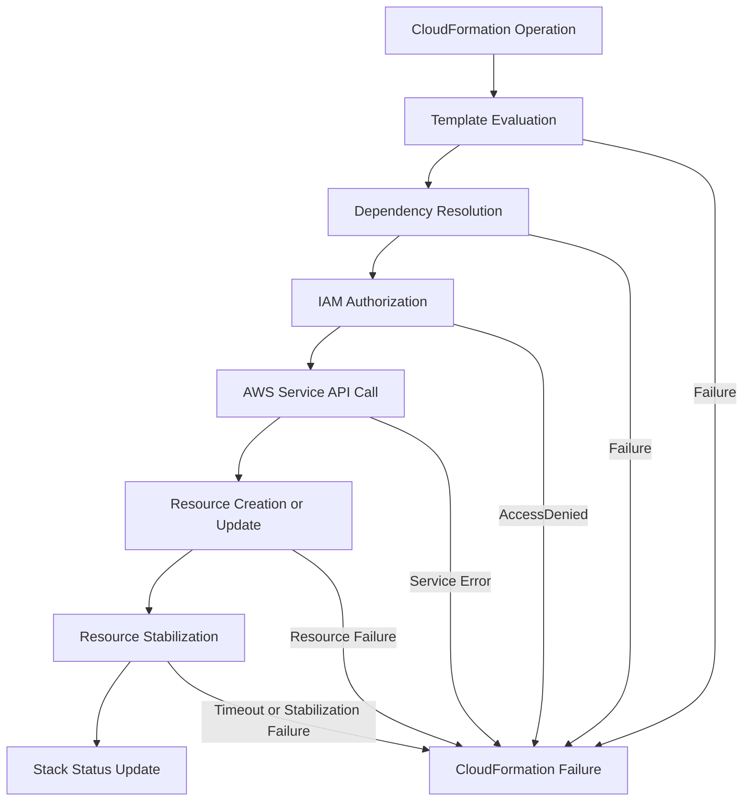
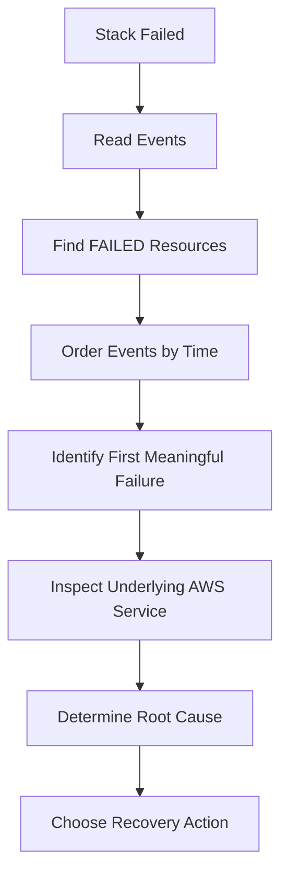
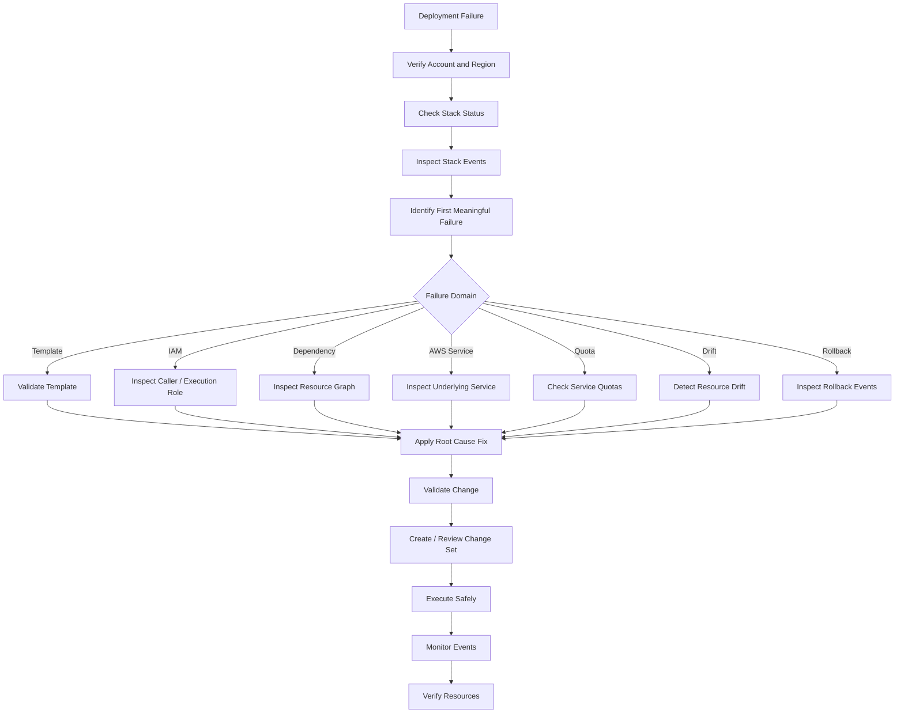

# 01- Troubleshooting Methodology

## Overview

AWS CloudFormation troubleshooting should be approached as a structured failure-isolation process rather than as trial-and-error changes to templates or resources.

A CloudFormation deployment involves multiple layers:

```text
Template
   |
   v
CloudFormation Engine
   |
   +--> IAM / Execution Role
   |
   +--> AWS Service APIs
   |
   +--> Dependencies
   |
   +--> Resource Configuration
   |
   v
Physical AWS Resources
```

A failure at any layer can cause the stack operation to fail, partially complete, enter a rollback state, or become stuck in a recovery state.

The objective of troubleshooting is therefore to determine:

1. What operation was CloudFormation performing?
2. Which resource failed?
3. What was the exact failure reason?
4. Which AWS service actually rejected the operation?
5. Whether the failure is caused by configuration, permissions, dependency ordering, quotas, or an external resource state.
6. What is the safest recovery action?

The most important rule is:

> **Do not fix the template until you know which layer actually failed.**

## CloudFormation Failure Model

A CloudFormation operation generally follows this path:



A useful troubleshooting model is:

| Layer | Typical Failure | Primary Evidence |
|---|---|---|
| Template | Invalid syntax or unsupported property | `validate-template` |
| Parameters | Invalid or unexpected input | Stack events |
| IAM | `AccessDenied`, `Unauthorized` | Stack events, CloudTrail |
| Dependency | Resource cannot reference dependency | Stack events |
| AWS service | Service-specific validation error | Stack events, service console/API |
| Quota | Limit exceeded | Stack events, Service Quotas |
| Resource state | Existing resource conflicts | Stack events, service API |
| Network | Connectivity or dependency failure | Service logs, VPC configuration |
| Rollback | Previous operation cannot be reverted | Stack status and events |
| Drift | Resource differs from template | Drift detection |

## First Response: Identify the Stack State

The first command should usually establish the current stack state.

```bash
aws cloudformation describe-stacks \
  --stack-name backend-production \
  --region ap-south-1
```

Look at:

- `StackStatus`
- `StackStatusReason`
- `DisableRollback`
- `EnableTerminationProtection`
- `Outputs`
- `Parameters`

Typical failure states include:

| Status | Meaning |
|---|---|
| `CREATE_FAILED` | Stack creation failed |
| `ROLLBACK_IN_PROGRESS` | CloudFormation is reverting changes |
| `ROLLBACK_FAILED` | CloudFormation could not complete rollback |
| `UPDATE_FAILED` | Stack update failed |
| `UPDATE_ROLLBACK_IN_PROGRESS` | CloudFormation is reverting an update |
| `UPDATE_ROLLBACK_FAILED` | Update rollback requires intervention |
| `DELETE_FAILED` | One or more resources could not be deleted |
| `UPDATE_COMPLETE_CLEANUP_IN_PROGRESS` | Update completed but old resources are being cleaned up |

Do not immediately issue another update against a stack that is already in a failed transitional state. First determine whether CloudFormation is still performing an operation or requires recovery.

## Inspect Stack Events

Stack events are the primary starting point for CloudFormation diagnostics.

```bash
aws cloudformation describe-stack-events \
  --stack-name backend-production \
  --region ap-south-1
```

The most useful fields are:

| Field | Purpose |
|---|---|
| `Timestamp` | Establishes event order |
| `ResourceStatus` | Shows the resource lifecycle state |
| `ResourceStatusReason` | Usually contains the actionable failure reason |
| `LogicalResourceId` | Identifies the resource in the template |
| `PhysicalResourceId` | Identifies the deployed AWS resource |
| `ResourceType` | Identifies the AWS resource type |
| `StackId` | Identifies the stack |

A practical command for reducing noise is:

```bash
aws cloudformation describe-stack-events \
  --stack-name backend-production \
  --region ap-south-1 \
  --query 'StackEvents[?contains(ResourceStatus, `FAILED`)].{Time:Timestamp,LogicalId:LogicalResourceId,Type:ResourceType,Reason:ResourceStatusReason}' \
  --output table
```

## Find the First Meaningful Failure

CloudFormation often reports several cascading failures after the original problem.

For example:

```text
RDSInstance CREATE_FAILED
        |
        v
ApplicationSecurityGroup CREATE_FAILED
        |
        v
ECSService CREATE_FAILED
        |
        v
Stack CREATE_FAILED
```

The application service may not actually be the root cause.

The correct investigation path is:



Do not assume the last `FAILED` event is the root cause.

A resource that fails because another resource was never created is usually a **secondary failure**.

## Map Logical Resources to Physical Resources

CloudFormation uses logical resource IDs inside the template and physical resource IDs for deployed resources.

Example:

```yaml
Resources:
  BackendBucket:
    Type: AWS::S3::Bucket
```

The logical ID is:

```text
BackendBucket
```

The physical resource might have a generated or explicitly configured name.

Use:

```bash
aws cloudformation list-stack-resources \
  --stack-name backend-production \
  --region ap-south-1
```

This is important when troubleshooting resources such as:

- S3 buckets
- Lambda functions
- IAM roles
- ECS services
- RDS databases
- CloudWatch log groups
- SNS topics
- SQS queues
- Security groups

The logical ID tells you **what CloudFormation intended to manage**. The physical ID tells you **which actual AWS resource to inspect**.

## Inspect the Underlying AWS Service

CloudFormation is often only the orchestration layer.

For example:

```text
CloudFormation
      |
      v
AWS::ECS::Service
      |
      v
Amazon ECS API
      |
      v
Task Placement / Networking / IAM / Container
```

If an ECS service fails, inspecting CloudFormation alone may not be enough.

You may need to inspect:

- ECS service events
- ECS task failures
- IAM permissions
- subnet routing
- security groups
- container image availability
- CloudWatch logs

The same principle applies to other services.

| CloudFormation Resource | Investigate |
|---|---|
| `AWS::Lambda::Function` | Lambda configuration, IAM role, deployment package |
| `AWS::ECS::Service` | ECS events, tasks, networking, IAM |
| `AWS::RDS::DBInstance` | RDS events, subnet group, engine configuration |
| `AWS::EC2::Instance` | EC2 state, AMI, IAM, networking |
| `AWS::ElasticLoadBalancingV2::LoadBalancer` | VPC, subnets, security groups |
| `AWS::IAM::Role` | IAM policies, trust relationship, naming conflicts |
| `AWS::S3::Bucket` | Bucket configuration, naming, existing resources |
| `AWS::ApiGateway::RestApi` | API Gateway configuration and dependencies |

## Validate the Template Before Deployment

Template validation catches structural and syntax-level problems before CloudFormation attempts to create resources.

```bash
aws cloudformation validate-template \
  --template-body file://template.yaml \
  --region ap-south-1
```

For packaged or remote templates, use the appropriate template location.

Validation does **not** guarantee that deployment will succeed.

A template can be syntactically valid while still containing:

- invalid resource properties
- insufficient IAM permissions
- unavailable AMIs
- invalid subnet relationships
- service quotas
- resource conflicts
- unsupported configurations
- incorrect dependencies

Therefore:

```text
Template Validation
        |
        v
Syntax Correct
        |
        X
        |
        v
Deployment Can Still Fail
```

## Understand IAM Failures

A common CloudFormation failure is:

```text
API: iam:CreateRole
User is not authorized to perform iam:CreateRole
```

The important distinction is between:

- The identity running CloudFormation.
- The CloudFormation service role.
- The permissions required by the target AWS service.

For example:

```text
CI/CD Role
    |
    | cloudformation:UpdateStack
    v
CloudFormation
    |
    | iam:PassRole
    v
Execution Role
    |
    v
AWS Services
```

A deployment can therefore fail even when the caller is allowed to update CloudFormation.

Check the caller identity:

```bash
aws sts get-caller-identity
```

Then determine which role CloudFormation is using.

For production environments, avoid granting broad permissions merely because a deployment failed with `AccessDenied`. Identify the exact missing action and resource scope.

## Check `iam:PassRole`

`iam:PassRole` is a frequent source of deployment failures when CloudFormation creates or configures resources that use IAM roles.

For example, an ECS task definition may reference an IAM role.

The deployment can require:

```text
Caller
  |
  +--> cloudformation:CreateStack
  |
  +--> iam:PassRole
          |
          v
      ECS Task Role
```

A common mistake is granting the caller permissions to create CloudFormation stacks while forgetting that the caller must also be allowed to pass the relevant role.

Use least privilege:

```json
{
  "Effect": "Allow",
  "Action": "iam:PassRole",
  "Resource": "arn:aws:iam::123456789012:role/backend-ecs-task-role"
}
```

Avoid:

```json
{
  "Effect": "Allow",
  "Action": "iam:PassRole",
  "Resource": "*"
}
```

unless there is a justified organizational requirement.

## Check Dependencies

CloudFormation normally determines resource dependencies from references.

Example:

```yaml
Resources:
  Database:
    Type: AWS::RDS::DBInstance
    Properties:
      DBSubnetGroupName: !Ref DatabaseSubnetGroup

  DatabaseSubnetGroup:
    Type: AWS::RDS::DBSubnetGroup
```

The `!Ref` creates an implicit dependency.

Use `DependsOn` when CloudFormation cannot infer a required ordering relationship.

```yaml
Resources:
  ApplicationService:
    Type: AWS::ECS::Service
    DependsOn:
      - ApplicationLoadBalancerListener
```

Do not add `DependsOn` everywhere.

Excessive explicit dependencies can:

- serialize resource creation
- increase deployment time
- make the dependency graph harder to understand
- reduce CloudFormation's ability to operate resources in parallel

## Diagnose Parameter Problems

Inspect stack parameters:

```bash
aws cloudformation describe-stacks \
  --stack-name backend-production \
  --query 'Stacks[0].Parameters'
```

Check for:

- wrong environment values
- wrong region-specific values
- incorrect subnet IDs
- invalid AMI IDs
- incorrect security group IDs
- unexpected parameter overrides
- missing required parameters

For repeatable deployments, keep environment-specific values outside the template where practical and manage them through controlled configuration.

## Check Region and Account

A surprisingly common problem is deploying to the wrong environment.

Verify the identity:

```bash
aws sts get-caller-identity
```

Verify the configured region:

```bash
aws configure get region
```

Or explicitly specify it:

```bash
aws cloudformation describe-stacks \
  --stack-name backend-production \
  --region ap-south-1
```

Before production changes, verify:

```text
AWS Account
    +
AWS Region
    +
Stack Name
    +
AWS Profile / Role
    =
Correct Deployment Target
```

For CI/CD, make the account and region explicit rather than relying on developer-machine defaults.

## Check Resource Quotas

A CloudFormation failure may actually be an AWS service quota failure.

Typical examples include:

- VPC limits
- Elastic IP limits
- IAM limits
- Lambda concurrency
- ECS resources
- API Gateway limits
- CloudFormation StackSet limits

The stack event may expose the quota error directly.

Do not solve quota failures by repeatedly retrying the same deployment. Determine whether the correct action is to:

- remove unnecessary resources
- reuse existing infrastructure
- request a quota increase
- redesign the architecture

## Resource Naming Conflicts

Explicit names can create deployment failures.

Example:

```yaml
Resources:
  BackendBucket:
    Type: AWS::S3::Bucket
    Properties:
      BucketName: company-production-backend-data
```

If the resource already exists and is not owned by the expected stack, CloudFormation may not be able to create it.

Explicit names improve predictability but reduce deployment flexibility.

Use generated names where possible unless stable resource names are operationally required.

## Replacement Failures

Some updates require CloudFormation to replace a resource rather than modify it in place.

This is one of the most important production troubleshooting scenarios.

Example:

```text
Existing Resource
      |
      | Property change
      v
CloudFormation determines:
"Update requires replacement"
      |
      v
Create replacement
      |
      v
Delete / detach old resource
```

Before executing important updates, inspect the change set.

Look specifically for:

| Change | Risk |
|---|---|
| `Add` | Usually lower |
| `Modify` | Requires property-level review |
| `Remove` | Potentially destructive |
| `Replacement: True` | High attention required |

A replacement can cause:

- downtime
- new physical resource IDs
- data loss if deletion is destructive
- changed endpoints
- changed security configuration
- unexpected dependencies

## Change Sets as a Troubleshooting Tool

Create a change set before production updates:

```bash
aws cloudformation create-change-set \
  --stack-name backend-production \
  --change-set-name backend-update \
  --template-body file://template.yaml \
  --change-set-type UPDATE \
  --region ap-south-1
```

Inspect it:

```bash
aws cloudformation describe-change-set \
  --stack-name backend-production \
  --change-set-name backend-update \
  --region ap-south-1
```

Change sets help answer:

- Which resources will change?
- Which resources will be replaced?
- Which resources will be deleted?
- Which resources will be added?
- Is the proposed change consistent with expectations?

They do not guarantee deployment success because runtime service errors can still occur.

## Rollback Failures

A deployment can fail while CloudFormation is attempting to restore the previous state.

For example:

```text
UPDATE
  |
  v
Resource Update Fails
  |
  v
UPDATE_ROLLBACK_IN_PROGRESS
  |
  v
Previous Resource State Restored
```

If rollback itself fails:

```text
UPDATE_ROLLBACK_IN_PROGRESS
          |
          v
Rollback Resource Fails
          |
          v
UPDATE_ROLLBACK_FAILED
```

At this point, do not blindly run another update.

Inspect events first:

```bash
aws cloudformation describe-stack-events \
  --stack-name backend-production \
  --region ap-south-1
```

Then determine which resource prevented rollback.

Depending on the situation, recovery may involve:

```bash
aws cloudformation continue-update-rollback \
  --stack-name backend-production \
  --region ap-south-1
```

Resource skipping should be treated as a controlled recovery mechanism, not a normal deployment strategy.

## Drift Detection

Manual changes outside CloudFormation can cause configuration drift.

Example:

```text
CloudFormation Template
        |
        | expected state
        v
    S3 Bucket
        ^
        | actual state
        |
AWS Console / CLI Manual Change
```

Detect stack drift:

```bash
aws cloudformation detect-stack-drift \
  --stack-name backend-production \
  --region ap-south-1
```

Then inspect drift status:

```bash
aws cloudformation describe-stack-drift-detection-status \
  --stack-drift-detection-id <detection-id> \
  --region ap-south-1
```

For resource-level details:

```bash
aws cloudformation describe-stack-resource-drifts \
  --stack-name backend-production \
  --region ap-south-1
```

Drift is particularly important when troubleshooting unexplained behavior because the deployed infrastructure may no longer match the template.

## Troubleshooting Network-Dependent Resources

CloudFormation itself does not necessarily have a networking problem simply because the resource it creates does.

For backend systems, inspect:

```text
VPC
 |
 +--> Subnets
 |
 +--> Route Tables
 |
 +--> Internet / NAT Gateway
 |
 +--> Security Groups
 |
 +--> Network ACLs
 |
 +--> Private Endpoints
 |
 +--> Resource-specific networking
```

Examples:

- ECS tasks cannot pull images.
- Lambda functions cannot reach private services.
- RDS instances cannot be placed in the requested subnets.
- Load balancers cannot be created in invalid subnet configurations.
- Custom resources cannot reach their target endpoints.

Separate the question:

> **Can CloudFormation create the resource?**

from:

> **Can the resulting resource communicate correctly?**

They are different failure domains.

## Custom Resource Failures

Custom resources introduce another troubleshooting layer because CloudFormation may invoke Lambda or another service to perform provisioning logic.

Typical flow:

```text
CloudFormation
      |
      v
Custom Resource
      |
      v
Lambda
      |
      v
External API / AWS API
      |
      v
Response to CloudFormation
```

Failures can involve:

- Lambda execution errors
- missing IAM permissions
- timeout
- incorrect response handling
- network connectivity
- external API failures
- invalid custom resource logic

When troubleshooting a custom resource, inspect both CloudFormation events and the Lambda's CloudWatch logs.

## Stack Deletion Failures

For:

```text
DELETE_FAILED
```

inspect the failed resource:

```bash
aws cloudformation describe-stack-events \
  --stack-name backend-production \
  --region ap-south-1
```

Common causes include:

- non-empty S3 buckets
- resources protected from deletion
- dependencies outside the stack
- service-level deletion restrictions
- retained resources
- manually modified resources

Do not repeatedly retry deletion without understanding the failed resource.

For critical data resources, consider explicit retention policies where appropriate:

```yaml
DeletionPolicy: Retain
UpdateReplacePolicy: Retain
```

These policies protect resources but also mean infrastructure may remain after stack deletion.

## CloudTrail for Deep Investigation

CloudFormation events explain what CloudFormation reported.

CloudTrail can help determine which AWS API operation actually occurred and which principal made the call.

The investigation can look like:

```text
CloudFormation Event
        |
        v
Failed Logical Resource
        |
        v
Underlying AWS API
        |
        v
CloudTrail Event
        |
        v
Principal + API Action + Error
```

CloudTrail is particularly useful for:

- IAM failures
- unexpected API calls
- identifying the acting principal
- investigating manual changes
- security investigations
- audit requirements

## Production Troubleshooting Workflow

A reliable production workflow is:



## Diagnostic Command Reference

| Purpose | Command |
|---|---|
| Verify AWS identity | `aws sts get-caller-identity` |
| Validate template | `aws cloudformation validate-template` |
| Describe stack | `aws cloudformation describe-stacks` |
| List stacks | `aws cloudformation list-stacks` |
| Inspect resources | `aws cloudformation list-stack-resources` |
| Inspect events | `aws cloudformation describe-stack-events` |
| Get template | `aws cloudformation get-template` |
| Get template summary | `aws cloudformation get-template-summary` |
| Create change set | `aws cloudformation create-change-set` |
| Inspect change set | `aws cloudformation describe-change-set` |
| Detect drift | `aws cloudformation detect-stack-drift` |
| Inspect drift | `aws cloudformation describe-stack-resource-drifts` |
| Continue rollback | `aws cloudformation continue-update-rollback` |
| Delete stack | `aws cloudformation delete-stack` |

## Common Mistakes

### Starting With the Template

A developer sees a failed deployment and immediately edits the YAML.

**Why it fails:** the actual problem may be IAM, quotas, an existing resource, or an AWS service configuration.

**Better approach:** inspect the stack status and events first.

### Looking Only at the Last Error

The final error may be a consequence of an earlier failure.

**Better approach:** identify the first meaningful resource failure chronologically.

### Retrying Without Changing Anything

Repeated retries do not fix deterministic failures such as:

- missing permissions
- invalid configuration
- unavailable resources
- quota exhaustion
- naming conflicts

**Better approach:** identify and correct the root cause before retrying.

### Granting Administrator Access

Broad permissions can make a deployment succeed while creating a serious security problem.

**Better approach:** identify the exact missing action and resource and update the deployment role with least privilege.

### Ignoring the AWS Service

CloudFormation is an orchestrator, not the owner of every resource-specific error.

**Better approach:** map the failed logical resource to its physical resource and inspect the underlying AWS service.

### Ignoring Drift

A template can look correct while the actual resource has been manually modified.

**Better approach:** use drift detection when the observed infrastructure does not match CloudFormation expectations.

### Skipping Change Set Review

A small template change can result in resource replacement or deletion.

**Better approach:** review change sets for production updates, especially changes involving databases, networking, IAM, and stateful resources.

## Production Best Practices

### Make Failures Observable

Use:

- CloudFormation stack events
- CloudTrail
- CloudWatch Logs
- AWS service-specific events
- CI/CD deployment logs
- alarms for failed deployments where appropriate

### Keep Infrastructure Version-Controlled

CloudFormation templates should be reviewed and deployed through a controlled workflow.

A practical pipeline is:

```text
Git Push
   |
   v
Template Validation
   |
   v
Static / Policy Checks
   |
   v
Change Set
   |
   v
Review
   |
   v
Production Execution
   |
   v
Stack Event Monitoring
```

### Separate Environments

Use explicit configuration for:

- development
- staging
- production

Avoid accidentally deploying production templates with development parameters or credentials.

### Protect Stateful Resources

Databases, buckets, and other stateful resources require stronger deletion and replacement controls than stateless compute resources.

Review:

- `DeletionPolicy`
- `UpdateReplacePolicy`
- termination protection
- backups
- snapshots
- retention requirements

### Preserve Diagnostic Evidence

During production incidents, capture:

- stack status
- stack events
- change set details
- CloudTrail events
- relevant service logs
- deployment parameters
- commit or release identifier

This makes incident analysis reproducible and reduces repeated investigation.

## Interview Traps

### Does `validate-template` guarantee deployment success?

No.

It validates the template structure but does not prove that:

- IAM permissions are sufficient
- resources exist
- quotas are available
- service configuration is valid
- runtime dependencies will succeed

### Is CloudFormation the service creating every resource?

No.

CloudFormation orchestrates AWS service APIs. The underlying service ultimately creates or modifies the resource.

### Why inspect stack events first?

Because they provide the CloudFormation resource-level lifecycle and failure reason, allowing you to identify the failed logical resource before investigating the underlying service.

### Why can a stack update fail even when the template is valid?

Because runtime conditions can still fail:

- IAM authorization
- service validation
- resource conflicts
- quotas
- dependencies
- network configuration
- resource replacement
- external service failures

### What is the difference between a logical and physical resource ID?

The logical ID identifies the resource in the CloudFormation template. The physical ID identifies the actual AWS resource created or managed by CloudFormation.

### Should you skip resources during rollback recovery?

Only when you understand the consequences and have a controlled recovery plan. Skipping a resource can leave the actual infrastructure state inconsistent with the CloudFormation template.

## Key Takeaways

- Start troubleshooting with **stack status and stack events**, not template edits.
- Identify the **first meaningful failure**, not merely the last failed event.
- Map the **logical resource ID** to the **physical resource** before investigating the underlying AWS service.
- Treat CloudFormation as an **orchestration layer** and investigate the service that actually rejected the operation.
- Verify the **AWS account, region, caller identity, and execution role** before changing permissions or infrastructure.
- Use **least privilege** rather than granting AdministratorAccess to make deployments succeed.
- Use **change sets** to identify potentially destructive updates and replacements.
- Use **drift detection** when actual infrastructure differs from the CloudFormation template.
- Treat rollback failures as a distinct recovery problem rather than simply retrying the original deployment.
- Use **CloudTrail** when CloudFormation events are insufficient to establish the exact AWS API call or acting principal.
- For production incidents, preserve diagnostic evidence and fix the **root cause**, not the symptom.