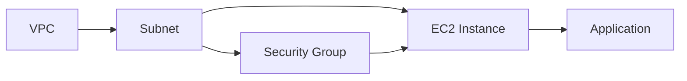
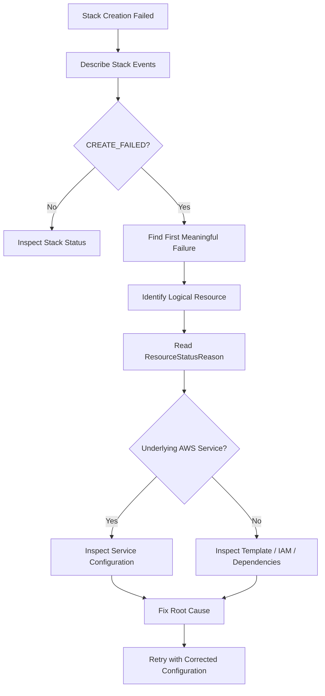

# 03- Stack Creation Failures

## Overview

CloudFormation stack creation failures occur when CloudFormation cannot successfully create one or more resources defined by a template.

A stack can pass template validation and still fail during creation because resource provisioning involves real AWS APIs, IAM authorization, regional configuration, quotas, dependencies, existing infrastructure, and service-specific constraints.

The most important troubleshooting principle is:

> **Find the first meaningful resource failure, understand why AWS rejected the operation, and fix the underlying condition before retrying the stack.**

A typical creation flow is:

```text
Template
   |
   v
CloudFormation Validation
   |
   v
Parameter Resolution
   |
   v
Dependency Resolution
   |
   v
Resource Creation
   |
   v
AWS Service API
   |
   +----> CREATE_COMPLETE
   |
   +----> CREATE_FAILED
             |
             v
        Stack Rollback
```

## Stack Creation Lifecycle

CloudFormation creates resources according to their dependency relationships.

For example:



CloudFormation automatically detects many dependencies through references such as `Ref` and `Fn::GetAtt`.

A failure in an upstream resource can therefore cause downstream resources to fail or never be created.

For example:

```text
VPC
 |
 +--> Subnet CREATE_FAILED
        |
        +--> EC2 Instance not created
```

The EC2 instance may not be the root cause even if it is the resource you expected to see in the final state.

## Common Stack Creation Failure Categories

| Failure Category | Typical Cause | Primary Investigation |
|---|---|---|
| IAM | Missing permissions | IAM policies / CloudTrail |
| Parameter | Invalid parameter value | Stack parameters |
| Networking | Invalid VPC/subnet/security group | AWS resource configuration |
| Resource conflict | Resource already exists | AWS service |
| Quota | Account or regional limit | Service quotas |
| Dependency | Incorrect dependency relationship | Template references |
| Service configuration | Invalid resource property | Stack events / service API |
| Region | Resource unavailable in region | Regional service support |
| Naming | Invalid or duplicate name | Resource configuration |
| Custom resource | Lambda/provider failure | CloudWatch Logs |
| Rollback | One or more resources failed | Stack events |

## The First Diagnostic Command

Start with stack events.

```bash
aws cloudformation describe-stack-events \
  --stack-name backend-production \
  --region ap-south-1
```

The most useful fields are:

- `LogicalResourceId`
- `ResourceType`
- `ResourceStatus`
- `ResourceStatusReason`
- `Timestamp`
- `PhysicalResourceId`

A focused query:

```bash
aws cloudformation describe-stack-events \
  --stack-name backend-production \
  --region ap-south-1 \
  --query 'StackEvents[?contains(ResourceStatus, `FAILED`)].{Time:Timestamp,LogicalId:LogicalResourceId,Type:ResourceType,Status:ResourceStatus,Reason:ResourceStatusReason}' \
  --output table
```

Do not immediately focus on the last failure. Multiple resources can fail because of one upstream problem.

## Finding the Root Cause

A useful diagnostic sequence is:



The key distinction is between:

- **Root-cause failure**
- **Cascading failure**
- **Rollback event**

For example:

```text
Subnet CREATE_FAILED
    |
    +--> Instance CREATE_FAILED
    |
    +--> LoadBalancer CREATE_FAILED
    |
    +--> Stack CREATE_FAILED
```

The subnet failure is likely more important than the downstream failures.

## IAM Permission Failures

CloudFormation operates using the credentials or service role associated with the deployment.

A stack can therefore fail with errors such as:

```text
User is not authorized to perform: ec2:CreateSecurityGroup
```

or:

```text
is not authorized to perform iam:PassRole
```

Commonly required permissions depend on the resources being created.

For example, an EC2-based stack may require permissions for:

```text
ec2:CreateVpc
ec2:CreateSubnet
ec2:CreateSecurityGroup
ec2:RunInstances
```

A stack involving IAM roles may additionally require:

```text
iam:CreateRole
iam:AttachRolePolicy
iam:PassRole
```

Do not solve permission problems by giving the deployment identity `AdministratorAccess`.

Use least-privilege permissions based on the actual infrastructure operations.

## `iam:PassRole` Failures

`iam:PassRole` is a frequent CloudFormation deployment problem.

Suppose CloudFormation creates an ECS task definition that references an IAM role:

```yaml
Resources:
  TaskRole:
    Type: AWS::IAM::Role
    Properties:
      AssumeRolePolicyDocument:
        Version: '2012-10-17'
        Statement:
          - Effect: Allow
            Principal:
              Service:
                - ecs-tasks.amazonaws.com
            Action:
              - sts:AssumeRole
```

The deployment identity may need permission to pass the role to the AWS service.

A typical failure looks like:

```text
User is not authorized to perform: iam:PassRole
```

When troubleshooting:

1. Identify the role being passed.
2. Identify the deployment principal.
3. Check its `iam:PassRole` permission.
4. Verify the role ARN and resource restrictions.
5. Confirm the target service is allowed to assume the role.

## Invalid VPC or Subnet Configuration

Networking resources are common sources of stack creation failures.

Example:

```yaml
Resources:
  BackendInstance:
    Type: AWS::EC2::Instance
    Properties:
      SubnetId: subnet-0123456789abcdef0
```

Potential failures include:

- Subnet does not exist.
- Subnet belongs to another VPC.
- Subnet is in another region.
- Subnet is unavailable.
- Security group belongs to a different VPC.
- The selected Availability Zone is incompatible.

A resource ID is not globally meaningful. It belongs to an AWS account and region.

Always verify the target resource:

```bash
aws ec2 describe-subnets \
  --subnet-ids subnet-0123456789abcdef0 \
  --region ap-south-1
```

## Security Group Failures

A common mistake is mixing security group IDs and names incorrectly.

For VPC-based resources, prefer explicit security group IDs:

```yaml
SecurityGroupIds:
  - !Ref BackendSecurityGroup
```

instead of relying on names where the resource type and context do not support them.

Check the VPC relationship:

```bash
aws ec2 describe-security-groups \
  --group-ids sg-0123456789abcdef0 \
  --region ap-south-1
```

Verify:

- VPC ID
- Group ID
- Group name
- Inbound rules
- Outbound rules

## Resource Already Exists

CloudFormation may fail when a resource requires a globally or account-scoped unique name.

For example:

```yaml
Resources:
  BackendBucket:
    Type: AWS::S3::Bucket
    Properties:
      BucketName: backend-production-data
```

If the name is already unavailable, creation can fail.

The general solution is to avoid hard-coded globally unique names unless the architecture requires them.

For example:

```yaml
Resources:
  BackendBucket:
    Type: AWS::S3::Bucket
    Properties:
      BucketName: !Sub "backend-${AWS::AccountId}-${AWS::Region}-data"
```

However, deterministic naming should still be evaluated carefully because changing a physical name can cause resource replacement.

## Region Mismatch

A resource that exists in one region may not exist in another.

For example:

```text
AMI in ap-south-1
        |
        X
        |
Stack deployed in us-east-1
```

Verify the deployment region:

```bash
aws configure get region
```

or:

```bash
aws cloudformation describe-stacks \
  --stack-name backend-production \
  --region ap-south-1
```

For CLI deployments, explicitly specify the region in automation:

```bash
aws cloudformation create-stack \
  --stack-name backend-production \
  --template-body file://template.yaml \
  --region ap-south-1
```

Production CI/CD should avoid relying on an operator's local AWS CLI configuration.

## AMI and Region-Specific Resource Failures

AMI IDs are regional.

A template containing:

```yaml
ImageId: ami-0123456789abcdef0
```

may work in one region and fail in another.

For multi-region infrastructure, use region-aware configuration.

Example:

```yaml
Mappings:
  RegionMap:
    ap-south-1:
      AmiId: ami-example-1
    us-east-1:
      AmiId: ami-example-2
```

Then:

```yaml
ImageId: !FindInMap
  - RegionMap
  - !Ref AWS::Region
  - AmiId
```

For production systems, consider how AMI lifecycle management will be handled rather than treating AMI IDs as permanent configuration.

## Service Quota Failures

AWS services enforce quotas.

A stack can fail even when the template is completely valid because the account or region cannot accommodate another resource.

Examples include:

- VPC limits
- Elastic IP limits
- NAT Gateway limits
- Load balancer limits
- IAM policy limits
- Lambda concurrency-related constraints
- CloudFormation resource limits
- Service-specific quotas

A typical failure may contain wording such as:

```text
LimitExceeded
```

or:

```text
You have exceeded your service quota
```

Investigate the relevant AWS service quota before modifying the template unnecessarily.

## Resource Dependency Failures

CloudFormation normally infers dependencies from references.

Example:

```yaml
Resources:
  BackendSecurityGroup:
    Type: AWS::EC2::SecurityGroup
    Properties:
      GroupDescription: Backend access

  BackendInstance:
    Type: AWS::EC2::Instance
    Properties:
      SecurityGroupIds:
        - !GetAtt BackendSecurityGroup.GroupId
```

The instance depends on the security group.

Explicit dependencies can be declared when required:

```yaml
BackendInstance:
  Type: AWS::EC2::Instance
  DependsOn:
    - BackendSecurityGroup
```

However, unnecessary `DependsOn` declarations can serialize resource creation and make infrastructure deployment slower.

Use explicit dependencies only when CloudFormation cannot infer the required ordering.

## Custom Resource Failures

Custom resources introduce another failure boundary.

For example:

```text
CloudFormation
      |
      v
Custom Resource
      |
      v
Lambda
      |
      v
AWS API
```

A custom resource can fail because:

- Lambda execution fails.
- Lambda times out.
- Lambda lacks IAM permissions.
- The provider returns an error.
- The provider fails to send a response.
- The external API is unavailable.

Investigate both CloudFormation events and the provider's CloudWatch Logs.

The CloudFormation failure may only expose a high-level error while the actual exception exists in Lambda logs.

## Nested Stack Failures

When a parent stack creates a nested stack, the parent can fail because the child stack failed.

Example:

```text
Parent Stack
    |
    +--> Network Stack
    |
    +--> Database Stack
    |
    +--> Application Stack
```

If the database nested stack fails:

```text
Database Nested Stack
        |
        v
CREATE_FAILED
        |
        v
Parent Stack CREATE_FAILED
```

Always identify whether the failed resource is:

```text
AWS::CloudFormation::Stack
```

If it is, inspect the child stack independently.

```bash
aws cloudformation describe-stack-events \
  --stack-name backend-database \
  --region ap-south-1
```

## Stack Rollback

By default, CloudFormation attempts to roll back resources created during a failed stack operation.

A stack may therefore transition through states such as:

```text
CREATE_IN_PROGRESS
        |
        v
CREATE_FAILED
        |
        v
ROLLBACK_IN_PROGRESS
        |
        v
ROLLBACK_COMPLETE
```

The rollback state is not necessarily the original failure.

The important diagnostic information is usually found in the events that occurred before rollback completed.

## Preserving Failed Resources

For troubleshooting, preserving resources can sometimes be useful.

CloudFormation supports disabling rollback during stack creation:

```bash
aws cloudformation create-stack \
  --stack-name backend-debug \
  --template-body file://template.yaml \
  --disable-rollback \
  --region ap-south-1
```

This can leave successfully created resources available for investigation.

Use this carefully in production because failed infrastructure can remain active and incur costs or create security exposure.

For production deployments, rollback behavior should be deliberate rather than disabled simply because debugging is easier.

## `ROLLBACK_COMPLETE`

A stack in `ROLLBACK_COMPLETE` has failed creation and completed rollback.

It generally cannot be updated as a normal stack.

Typical options are:

1. Investigate the original failure.
2. Delete the failed stack.
3. Correct the template or configuration.
4. Recreate the stack.

Delete:

```bash
aws cloudformation delete-stack \
  --stack-name backend-production \
  --region ap-south-1
```

Then verify:

```bash
aws cloudformation describe-stacks \
  --stack-name backend-production \
  --region ap-south-1
```

If the stack no longer exists, CloudFormation returns a validation error indicating that the stack cannot be found.

## Retaining Resources During Failure

Some resources may be intentionally retained rather than deleted during rollback.

This can happen because of:

- `DeletionPolicy`
- `UpdateReplacePolicy`
- Resource-specific deletion behavior
- Failed deletion
- External dependencies

For example:

```yaml
Resources:
  ProductionDatabase:
    Type: AWS::RDS::DBInstance
    DeletionPolicy: Snapshot
    UpdateReplacePolicy: Snapshot
    Properties:
      ...
```

This protects database data during destructive operations but also means infrastructure can remain after stack deletion.

Always understand the lifecycle policy of stateful resources.

## Stack Events as the Primary Diagnostic Source

CloudFormation events provide the chronological resource lifecycle.

Useful statuses include:

| Status | Meaning |
|---|---|
| `CREATE_IN_PROGRESS` | Resource creation started |
| `CREATE_COMPLETE` | Resource creation completed |
| `CREATE_FAILED` | Resource creation failed |
| `ROLLBACK_IN_PROGRESS` | Stack rollback started |
| `ROLLBACK_COMPLETE` | Rollback completed |
| `DELETE_IN_PROGRESS` | Resource deletion started |
| `DELETE_FAILED` | Resource deletion failed |
| `DELETE_COMPLETE` | Resource deletion completed |

A production troubleshooting workflow should always preserve the event history before repeatedly retrying.

## Comparing Stack Status and Resource Status

The stack-level status tells you the overall operation state:

```bash
aws cloudformation describe-stacks \
  --stack-name backend-production \
  --query 'Stacks[0].StackStatus'
```

Resource-level events identify the actual failure:

```bash
aws cloudformation describe-stack-events \
  --stack-name backend-production \
  --query 'StackEvents[?ResourceStatus==`CREATE_FAILED`].{LogicalId:LogicalResourceId,Reason:ResourceStatusReason}' \
  --output table
```

The second command is usually more useful when diagnosing the root cause.

## Practical Failure Investigation

Assume a stack creation returns:

```text
CREATE_FAILED
```

Use this workflow:

```bash
aws cloudformation describe-stacks \
  --stack-name backend-production \
  --region ap-south-1
```

Then:

```bash
aws cloudformation describe-stack-events \
  --stack-name backend-production \
  --region ap-south-1 \
  --query 'StackEvents[].{Time:Timestamp,Resource:LogicalResourceId,Status:ResourceStatus,Reason:ResourceStatusReason}' \
  --output table
```

Identify the first meaningful `CREATE_FAILED`.

Then determine:

```text
Logical Resource
      |
      v
Resource Type
      |
      v
Failure Reason
      |
      v
Underlying AWS Service
      |
      v
IAM / Configuration / Dependency / Quota / State
      |
      v
Corrective Action
```

## Example: EC2 Creation Failure

Consider:

```yaml
Resources:
  BackendInstance:
    Type: AWS::EC2::Instance
    Properties:
      ImageId: ami-0123456789abcdef0
      InstanceType: t3.micro
      SubnetId: subnet-0123456789abcdef0
```

Suppose the stack reports:

```text
CREATE_FAILED
InvalidAMIID.NotFound
```

Do not immediately modify the EC2 resource type.

Investigate:

```bash
aws ec2 describe-images \
  --image-ids ami-0123456789abcdef0 \
  --region ap-south-1
```

Possible root causes:

- AMI does not exist.
- AMI exists in another region.
- AMI was deregistered.
- AMI belongs to an inaccessible account.
- The ID was copied incorrectly.

The correct fix depends on which condition is true.

## Example: IAM Failure

Suppose:

```text
CREATE_FAILED
User is not authorized to perform: iam:CreateRole
```

The correct investigation is not to change the resource template.

Inspect the deployment identity:

```bash
aws sts get-caller-identity
```

Then review the IAM policy associated with that principal or CloudFormation service role.

The failure is authorization-related, not template-related.

## Example: Resource Conflict

Suppose:

```text
CREATE_FAILED
BucketAlreadyExists
```

The template may be syntactically and semantically valid.

The problem is physical resource naming.

Possible approaches:

- Use a unique deterministic name.
- Import the existing resource when appropriate.
- Remove the resource from the template if it should be externally managed.
- Use a generated physical name when a stable name is unnecessary.

Do not blindly delete an existing production resource to make a stack creation succeed.

## Production Troubleshooting Checklist

When a stack creation fails:

- [ ] Confirm the AWS account.
- [ ] Confirm the AWS region.
- [ ] Check the stack status.
- [ ] Retrieve stack events.
- [ ] Identify the first meaningful `CREATE_FAILED`.
- [ ] Read the complete `ResourceStatusReason`.
- [ ] Identify the resource type.
- [ ] Check resource dependencies.
- [ ] Check IAM permissions.
- [ ] Check `iam:PassRole` where applicable.
- [ ] Verify VPC, subnet, security group, and route configuration.
- [ ] Verify region-specific resource IDs.
- [ ] Check service quotas.
- [ ] Check resource naming conflicts.
- [ ] Inspect nested stacks if applicable.
- [ ] Inspect CloudWatch Logs for custom resources.
- [ ] Check CloudTrail for API authorization or API-level evidence.
- [ ] Determine whether rollback retained or deleted resources.
- [ ] Correct the root cause before retrying.

## Security Considerations

Stack creation failures can expose sensitive information through logs and event messages.

Do not place:

- Passwords
- API keys
- Access tokens
- Database credentials
- Private keys

directly in templates or diagnostic output.

Use appropriate AWS secret-management mechanisms and avoid printing secret values in CI/CD logs.

Deployment identities should also use least privilege.

A production CloudFormation deployment commonly uses a dedicated deployment role rather than personal IAM credentials.

## Reliability and Operational Considerations

Infrastructure deployment should be treated as an operational workflow rather than a single CLI command.

Recommended practices include:

- Use version-controlled templates.
- Validate templates in CI.
- Run security and policy checks before deployment.
- Use change sets for significant changes.
- Deploy through controlled environments.
- Use dedicated deployment roles.
- Monitor stack events.
- Maintain CloudTrail auditing.
- Protect production stacks with appropriate permissions.
- Define lifecycle policies for stateful resources.
- Keep rollback behavior intentional.
- Avoid manually modifying CloudFormation-managed resources.

Manual changes can introduce drift and make subsequent deployments harder to reason about.

## CI/CD Failure Handling

A production pipeline should stop when stack creation fails.

Example:

```bash
set -e

aws cloudformation create-stack \
  --stack-name backend-production \
  --template-body file://template.yaml \
  --capabilities CAPABILITY_IAM \
  --region ap-south-1

aws cloudformation wait stack-create-complete \
  --stack-name backend-production \
  --region ap-south-1
```

If creation fails, the wait operation returns a non-zero exit code and the pipeline should fail.

For diagnostics, retrieve stack events after the failure:

```bash
aws cloudformation describe-stack-events \
  --stack-name backend-production \
  --region ap-south-1 \
  --query 'StackEvents[?ResourceStatus==`CREATE_FAILED`].{Resource:LogicalResourceId,Reason:ResourceStatusReason}' \
  --output table
```

The CI/CD system should preserve these logs as build artifacts where appropriate.

## Common Mistakes

### Looking Only at the Final Stack Status

`CREATE_FAILED` only tells you the operation failed.

**Avoid it by:** inspecting resource-level events and failure reasons.

### Fixing the Last Error Instead of the First Error

Several resources can fail because they depend on one failed resource.

**Avoid it by:** finding the earliest meaningful root-cause event.

### Assuming Validation Passed Means Creation Will Succeed

CloudFormation validation cannot guarantee IAM access, resource availability, quotas, or service-level configuration.

**Avoid it by:** validating and then testing the actual deployment path.

### Retrying Without Changing Anything

Repeatedly creating the same failing stack does not resolve the underlying condition.

**Avoid it by:** classify the failure first and make a targeted correction.

### Disabling Rollback in Production

`--disable-rollback` can leave partially created infrastructure behind.

**Avoid it by:** using it primarily for controlled debugging and understanding the operational consequences.

### Ignoring Existing Resources

A resource can already exist outside CloudFormation.

**Avoid it by:** deciding whether the resource should be imported, renamed, referenced externally, or managed by CloudFormation.

### Granting Excessive IAM Permissions

Giving deployment users administrator access may hide the real permission requirements.

**Avoid it by:** using dedicated deployment roles and least privilege.

### Ignoring Region Configuration

A template may reference resources that are unavailable in the deployment region.

**Avoid it by:** explicitly specifying the deployment region and validating regional dependencies.

## Interview Traps

### What is the first thing you check when a CloudFormation stack creation fails?

Check stack events and identify the first meaningful `CREATE_FAILED` event and its `ResourceStatusReason`.

### Why is the first failure often more important than the last failure?

Later failures can be cascading effects of an upstream resource that was never successfully created.

### Can a valid CloudFormation template fail during stack creation?

Yes. IAM authorization, quotas, resource availability, service validation, resource conflicts, and regional configuration can still cause failure.

### What happens after a stack creation failure?

By default, CloudFormation attempts to roll back resources created during the failed operation.

### What does `ROLLBACK_COMPLETE` mean?

The stack creation failed and CloudFormation completed its rollback. The stack generally needs to be deleted before creating a replacement with the same stack name.

### When would you use `--disable-rollback`?

Primarily when controlled debugging requires failed resources to remain available for inspection. It should not be used casually in production.

### How do you troubleshoot an `iam:PassRole` error?

Identify the role being passed, identify the deployment principal, verify `iam:PassRole` permissions and resource restrictions, and confirm the target service can assume the role.

### How do you troubleshoot a nested stack failure?

Identify the nested `AWS::CloudFormation::Stack` resource and inspect the child stack's events independently.

## Key Takeaways

- Stack creation failures are deployment-time failures, not necessarily template syntax failures.
- Always inspect CloudFormation stack events rather than relying only on the stack-level status.
- Find the **first meaningful `CREATE_FAILED`** because later failures may be cascading effects.
- Read `ResourceStatusReason` carefully; it often identifies the actual AWS service or authorization problem.
- Common causes include IAM permissions, `iam:PassRole`, invalid networking configuration, resource conflicts, regional resource IDs, quotas, and service-specific validation.
- CloudFormation automatically infers many resource dependencies from `Ref` and `Fn::GetAtt`.
- Use `DependsOn` only when an implicit dependency is insufficient.
- Nested stack failures must be investigated at the child-stack level.
- Custom resource failures require investigation of both CloudFormation events and the underlying provider, commonly Lambda and CloudWatch Logs.
- `ROLLBACK_COMPLETE` means the failed creation has completed rollback; investigate the original failure before recreating the stack.
- `--disable-rollback` can preserve failed resources for debugging but should be used carefully because retained infrastructure can incur cost and security risk.
- Production deployments should use dedicated IAM deployment roles, least privilege, CI/CD validation, change sets, controlled rollback behavior, and auditable deployment workflows.