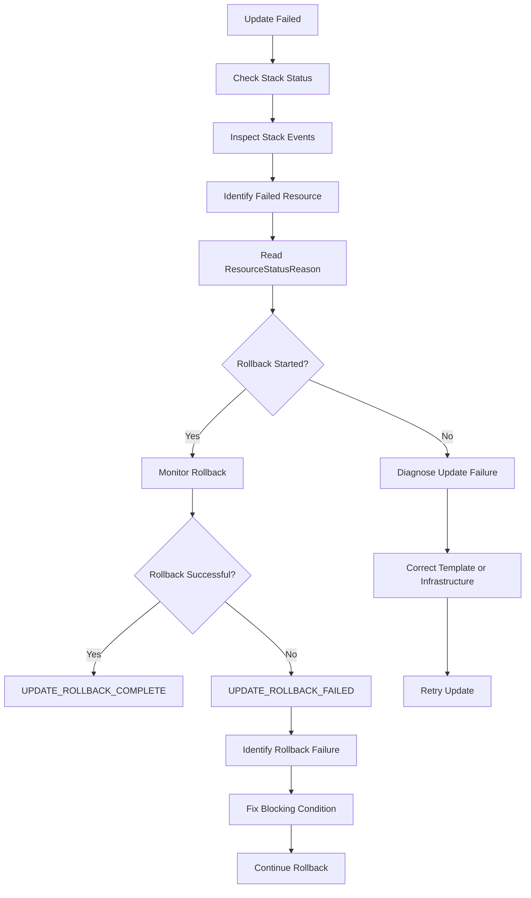
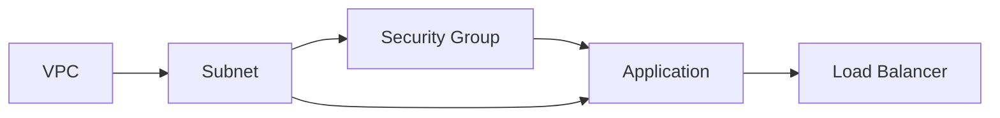

# 04- Stack Update and Rollback Failures

## Overview

CloudFormation stack updates are more operationally sensitive than initial stack creation because an update modifies infrastructure that may already be serving production traffic.

An update can fail because of invalid resource properties, replacement requirements, dependency issues, IAM permissions, service quotas, immutable resource attributes, or failures while rolling back previously applied changes.

The critical distinction is:

- **Update failure** means the requested change could not be completed.
- **Rollback failure** means CloudFormation also failed while attempting to return the stack to its previous state.
- **`UPDATE_ROLLBACK_COMPLETE`** means the rollback completed successfully.
- **`UPDATE_ROLLBACK_FAILED`** means the rollback itself is stuck and requires intervention.

A typical update lifecycle is:

```text
UPDATE_IN_PROGRESS
       |
       v
Resource Changes
       |
       +--------------------+
       |                    |
       v                    v
UPDATE_COMPLETE       UPDATE_FAILED
                            |
                            v
                   UPDATE_ROLLBACK_IN_PROGRESS
                            |
                    +-------+-------+
                    |               |
                    v               v
       UPDATE_ROLLBACK_COMPLETE   UPDATE_ROLLBACK_FAILED
```

## Why Update Failures Are Different

During creation, CloudFormation is generally building a new environment.

During an update, CloudFormation may:

- Modify an existing resource.
- Replace an existing resource.
- Delete an old resource.
- Create a replacement resource.
- Reconfigure dependent resources.
- Temporarily operate with old and new resources simultaneously.
- Roll back changes if the operation fails.

This makes update failures potentially more disruptive.

For example:

```text
Existing RDS Instance
        |
        | Update
        v
CloudFormation determines replacement required
        |
        +--> Create replacement
        |
        +--> Update dependencies
        |
        +--> Remove old resource
```

Whether a resource is updated in place or replaced depends on the resource property's CloudFormation update behavior.

## Update Behavior

CloudFormation resource properties generally fall into different categories:

| Behavior | Meaning | Operational Impact |
|---|---|---|
| Update without interruption | Resource can be modified in place | Lowest risk |
| Some interruption | Resource remains but service may be temporarily disrupted | Moderate risk |
| Replacement | Old resource is replaced by a new resource | Highest risk |

A template change can therefore have a much larger operational impact than its apparent size suggests.

For example, changing an application configuration property may be harmless, while changing an immutable database property can trigger replacement.

## Detecting Whether a Change Causes Replacement

Change sets are useful before executing updates.

```bash
aws cloudformation create-change-set \
  --stack-name backend-production \
  --change-set-name backend-update \
  --template-body file://template.yaml \
  --change-set-type UPDATE \
  --region ap-south-1
```

Inspect it:

```bash
aws cloudformation describe-change-set \
  --stack-name backend-production \
  --change-set-name backend-update \
  --region ap-south-1
```

Look for resource changes that indicate replacement.

A replacement should be treated as a potentially destructive infrastructure operation, particularly for stateful resources.

## Stack Update Failure Workflow

When an update fails, use a structured workflow:



## Inspecting Stack Status

Start with the stack status:

```bash
aws cloudformation describe-stacks \
  --stack-name backend-production \
  --region ap-south-1 \
  --query 'Stacks[0].StackStatus'
```

Then inspect events:

```bash
aws cloudformation describe-stack-events \
  --stack-name backend-production \
  --region ap-south-1 \
  --query 'StackEvents[].{Time:Timestamp,Resource:LogicalResourceId,Status:ResourceStatus,Reason:ResourceStatusReason}' \
  --output table
```

For failed resources:

```bash
aws cloudformation describe-stack-events \
  --stack-name backend-production \
  --region ap-south-1 \
  --query 'StackEvents[?contains(ResourceStatus, `FAILED`)].{Time:Timestamp,Resource:LogicalResourceId,Status:ResourceStatus,Reason:ResourceStatusReason}' \
  --output table
```

The failure reason is often the most valuable diagnostic field.

## Update Failure Versus Rollback Failure

These are different problems.

### Update Failure

The requested update fails:

```text
UPDATE_IN_PROGRESS
        |
        v
Resource UPDATE_FAILED
        |
        v
UPDATE_ROLLBACK_IN_PROGRESS
```

CloudFormation attempts to restore the previous stack state.

### Rollback Failure

CloudFormation cannot restore one or more resources:

```text
UPDATE_ROLLBACK_IN_PROGRESS
        |
        v
Rollback resource fails
        |
        v
UPDATE_ROLLBACK_FAILED
```

This is more serious because the stack is no longer simply reporting a failed deployment. CloudFormation requires intervention before the stack can proceed normally.

## Common Update Failure Causes

| Failure | Typical Cause |
|---|---|
| Invalid property | Unsupported or invalid resource configuration |
| IAM failure | Deployment role lacks required permissions |
| Resource replacement | Immutable property changed |
| Resource conflict | New physical resource cannot be created |
| Dependency failure | Dependent resource cannot be updated |
| Quota | Account or service limit reached |
| State mismatch | Resource was manually modified |
| External dependency | Resource depends on something unavailable |
| Custom resource | Provider or Lambda failure |
| Timeout | Resource operation does not complete |
| Service failure | AWS service rejects or cannot process request |

## IAM Permission Failures During Updates

The deployment identity must have permissions for the **new operation**, not merely the permissions required when the stack was originally created.

For example, an update that changes an ECS service may require permissions that were not needed during initial creation.

A typical error:

```text
is not authorized to perform: ecs:UpdateService
```

Check the deployment identity:

```bash
aws sts get-caller-identity
```

If the stack uses a CloudFormation service role, inspect that role rather than assuming the user's permissions are being used.

For production deployments:

- Use a dedicated deployment role.
- Scope permissions to required services and resources.
- Restrict `iam:PassRole`.
- Avoid administrator access as a troubleshooting shortcut.

## Resource Replacement Failures

Some updates require replacement.

Example:

```text
Existing Resource
       |
       | Property change
       v
Replacement Required
       |
       +--> Create New Resource
       |
       +--> Reconnect Dependencies
       |
       +--> Delete Old Resource
```

Replacement can fail because:

- The new resource cannot be created.
- The physical name is already taken.
- The target quota has been reached.
- IAM permissions are insufficient.
- Dependencies cannot be recreated.
- The old resource cannot be deleted.
- The replacement resource is incompatible with another resource.

For stateful infrastructure, replacement deserves explicit review before deployment.

## Stateful Resource Risk

Databases, persistent storage, and other stateful resources require special handling.

For example:

```yaml
Resources:
  ProductionDatabase:
    Type: AWS::RDS::DBInstance
    DeletionPolicy: Snapshot
    UpdateReplacePolicy: Snapshot
    Properties:
      ...
```

These policies can protect data during deletion or replacement.

However, lifecycle policies are not a substitute for backups and disaster recovery planning.

Before a high-risk update, verify:

- Automated backups.
- Recovery point objectives.
- Recovery time objectives.
- Snapshot availability.
- Replication configuration.
- Application compatibility with the new resource.
- Whether the change triggers replacement.

## Physical Name Conflicts

Explicit physical names can make replacement difficult.

Example:

```yaml
Resources:
  BackendBucket:
    Type: AWS::S3::Bucket
    Properties:
      BucketName: backend-production-data
```

If an update requires replacement, CloudFormation may need to create the new resource while the old resource still exists.

If both resources require the same physical name, creation can fail.

A failure may look like:

```text
AlreadyExists
```

or:

```text
BucketAlreadyOwnedByYou
```

Avoid unnecessary explicit physical names when CloudFormation-generated names are sufficient.

When stable names are required, understand the replacement implications before changing resource properties.

## Dependency Failures

An update to one resource may affect dependent resources.

Example:



If the subnet update fails, dependent resources may also fail to update.

Do not treat every failed resource as an independent problem.

Identify the dependency chain and determine which failure occurred first.

## Explicit `DependsOn`

CloudFormation automatically detects many dependencies.

Example:

```yaml
BackendInstance:
  Type: AWS::EC2::Instance
  Properties:
    SecurityGroupIds:
      - !GetAtt BackendSecurityGroup.GroupId
```

CloudFormation can infer that the instance depends on the security group.

Explicit dependency:

```yaml
BackendInstance:
  Type: AWS::EC2::Instance
  DependsOn:
    - BackendSecurityGroup
```

Use `DependsOn` only when required.

Excessive dependencies can:

- Serialize deployments.
- Increase deployment time.
- Increase the blast radius of failures.
- Make the dependency graph harder to understand.

## Custom Resource Update Failures

Custom resources are particularly important because CloudFormation delegates lifecycle operations to an external provider.

Typical flow:

```text
CloudFormation
      |
      v
Custom Resource
      |
      v
Lambda / Provider
      |
      v
External AWS API
```

An update can fail because:

- Lambda throws an exception.
- Lambda times out.
- The provider lacks IAM permissions.
- The provider cannot reach an external service.
- The provider returns an invalid response.
- The provider fails to signal completion correctly.

Inspect CloudFormation events first, then inspect the provider's CloudWatch Logs.

## Nested Stack Update Failures

Nested stacks introduce another level of dependency.

```text
Parent Stack
    |
    +--> Network Stack
    |
    +--> Database Stack
    |
    +--> Application Stack
```

If a nested stack fails:

```text
Application Nested Stack
          |
          v
UPDATE_FAILED
          |
          v
Parent Stack
          |
          v
UPDATE_ROLLBACK_IN_PROGRESS
```

Identify the nested stack resource:

```bash
aws cloudformation describe-stack-events \
  --stack-name backend-production \
  --region ap-south-1 \
  --query 'StackEvents[?ResourceType==`AWS::CloudFormation::Stack`].{Resource:LogicalResourceId,Status:ResourceStatus,Reason:ResourceStatusReason}' \
  --output table
```

Then inspect the child stack separately.

## Understanding `UPDATE_ROLLBACK_IN_PROGRESS`

This state means CloudFormation is attempting to reverse the failed update.

Do not immediately start another update.

First monitor the rollback:

```bash
aws cloudformation describe-stacks \
  --stack-name backend-production \
  --region ap-south-1 \
  --query 'Stacks[0].StackStatus'
```

Then inspect events:

```bash
aws cloudformation describe-stack-events \
  --stack-name backend-production \
  --region ap-south-1 \
  --query 'StackEvents[?contains(ResourceStatus, `FAILED`)].{Resource:LogicalResourceId,Status:ResourceStatus,Reason:ResourceStatusReason}' \
  --output table
```

The desired result is:

```text
UPDATE_ROLLBACK_COMPLETE
```

At that point, the stack is generally available for another update.

## `UPDATE_ROLLBACK_COMPLETE`

This means:

1. The update failed.
2. CloudFormation initiated rollback.
3. CloudFormation successfully restored the stack to the previous state.

Example:

```text
UPDATE_IN_PROGRESS
       |
       v
UPDATE_FAILED
       |
       v
UPDATE_ROLLBACK_IN_PROGRESS
       |
       v
UPDATE_ROLLBACK_COMPLETE
```

The failed deployment still requires investigation, but the stack itself is not stuck in the rollback process.

Correct the underlying issue before retrying.

## `UPDATE_ROLLBACK_FAILED`

This state requires intervention.

Example:

```text
UPDATE_IN_PROGRESS
       |
       v
UPDATE_FAILED
       |
       v
UPDATE_ROLLBACK_IN_PROGRESS
       |
       v
Resource rollback fails
       |
       v
UPDATE_ROLLBACK_FAILED
```

A common cause is that the resource changed outside CloudFormation while the update was in progress or after the previous deployment.

Examples:

- Resource was manually deleted.
- Security group was manually changed.
- IAM role was modified.
- Database configuration changed.
- Dependent resource was removed.
- Resource is stuck in an external service operation.

The objective is to restore the conditions required for CloudFormation to complete the rollback.

## Inspecting the Rollback Failure

Start with:

```bash
aws cloudformation describe-stack-events \
  --stack-name backend-production \
  --region ap-south-1 \
  --query 'StackEvents[?ResourceStatus==`UPDATE_FAILED` || ResourceStatus==`UPDATE_ROLLBACK_FAILED`].{Time:Timestamp,Resource:LogicalResourceId,Status:ResourceStatus,Reason:ResourceStatusReason}' \
  --output table
```

Identify the resource that prevented rollback.

Then inspect the underlying AWS service.

For example, for an EC2 resource:

```bash
aws ec2 describe-instances \
  --instance-ids i-0123456789abcdef0 \
  --region ap-south-1
```

For an IAM role:

```bash
aws iam get-role \
  --role-name backend-production-role
```

The exact diagnostic command depends on the resource type.

## Continue Rollback

When a stack is in `UPDATE_ROLLBACK_FAILED`, CloudFormation provides a recovery mechanism to continue the rollback after addressing the blocking condition.

```bash
aws cloudformation continue-update-rollback \
  --stack-name backend-production \
  --region ap-south-1
```

Monitor the stack:

```bash
aws cloudformation describe-stacks \
  --stack-name backend-production \
  --region ap-south-1 \
  --query 'Stacks[0].StackStatus'
```

The desired outcome is:

```text
UPDATE_ROLLBACK_COMPLETE
```

Do not use `continue-update-rollback` blindly. First understand which resource prevented rollback and correct the underlying infrastructure condition.

## Skipping Resources During Rollback

CloudFormation also supports skipping resources that cannot currently be rolled back:

```bash
aws cloudformation continue-update-rollback \
  --stack-name backend-production \
  --resources-to-skip BackendInstance \
  --region ap-south-1
```

This is a recovery mechanism, not a normal deployment strategy.

Skipping a resource means CloudFormation may mark the resource as successfully rolled back even though its actual state does not match the template's expected previous state.

That can create drift.

After recovery, investigate and reconcile the resource before treating the stack as healthy.

Use resource skipping only when you understand the consequences.

## Resource Skipping Risks

Consider:

```text
CloudFormation expected state
            |
            v
BackendInstance = configuration A

Actual resource
            |
            v
BackendInstance = configuration B
```

If the rollback skips the instance, CloudFormation may proceed while the actual infrastructure remains inconsistent.

Potential consequences include:

- Configuration drift.
- Future update failures.
- Unexpected replacements.
- Security differences.
- Operational confusion.

A skipped resource should therefore be treated as technical debt requiring explicit reconciliation.

## Manual Changes During an Update

Manual AWS Console or CLI changes are a common source of rollback problems.

Example:

```text
CloudFormation manages Security Group
          |
          v
Engineer manually deletes rule
          |
          v
CloudFormation rollback expects original state
          |
          v
Rollback behavior may differ from expectation
```

The same principle applies to:

- EC2 instances.
- IAM roles.
- Security groups.
- Load balancers.
- RDS resources.
- ECS services.
- S3 configuration.
- Lambda functions.

Prefer infrastructure-as-code changes through CloudFormation rather than manually modifying CloudFormation-managed resources.

## Drift and Rollback Failures

Drift does not automatically mean an update will fail, but it can create conditions that make rollback or subsequent updates harder.

Detect drift when appropriate:

```bash
aws cloudformation detect-stack-drift \
  --stack-name backend-production \
  --region ap-south-1
```

Then retrieve the detection status:

```bash
aws cloudformation describe-stack-drift-detection-status \
  --stack-drift-detection-id <detection-id> \
  --region ap-south-1
```

For a resource-level investigation:

```bash
aws cloudformation describe-stack-resource-drifts \
  --stack-name backend-production \
  --region ap-south-1
```

Drift detection should support troubleshooting; it should not replace disciplined infrastructure ownership.

## Update Rollback and Data Protection

Rollback does not necessarily mean that every resource returns to its exact previous physical identity.

Some changes can involve replacement.

For stateful resources, evaluate:

- `DeletionPolicy`
- `UpdateReplacePolicy`
- Backup configuration
- Snapshot behavior
- Replication
- Retention requirements

Example:

```yaml
Resources:
  ProductionDatabase:
    Type: AWS::RDS::DBInstance
    DeletionPolicy: Snapshot
    UpdateReplacePolicy: Snapshot
    Properties:
      DBInstanceClass: db.t4g.medium
```

The lifecycle policies should align with the application's recovery requirements.

## Production Recovery Procedure

For a production update failure:

### Identify the Current State

```bash
aws cloudformation describe-stacks \
  --stack-name backend-production \
  --region ap-south-1 \
  --query 'Stacks[0].StackStatus'
```

### Inspect Events

```bash
aws cloudformation describe-stack-events \
  --stack-name backend-production \
  --region ap-south-1 \
  --query 'StackEvents[].{Time:Timestamp,Resource:LogicalResourceId,Status:ResourceStatus,Reason:ResourceStatusReason}' \
  --output table
```

### Classify the Failure

Determine whether it is:

- Update failure.
- Rollback in progress.
- Rollback failure.
- Resource replacement failure.
- IAM failure.
- Dependency failure.
- Service quota failure.
- Custom resource failure.
- External/manual state mismatch.

### If Rollback Is Running

Wait for it to complete unless there is a specific operational reason to intervene.

### If Rollback Failed

Identify the blocking resource, correct the underlying condition, and continue rollback:

```bash
aws cloudformation continue-update-rollback \
  --stack-name backend-production \
  --region ap-south-1
```

### If Resources Must Be Skipped

Use `--resources-to-skip` only after determining that the resource can safely remain in its current state.

### After Recovery

Verify:

- Stack status.
- Resource status.
- Application health.
- Infrastructure drift.
- Security configuration.
- Data integrity.
- Monitoring and alarms.

## CI/CD Handling

A deployment pipeline should distinguish between update failure and rollback failure.

Example:

```bash
set -e

aws cloudformation update-stack \
  --stack-name backend-production \
  --template-body file://template.yaml \
  --capabilities CAPABILITY_IAM \
  --region ap-south-1

aws cloudformation wait stack-update-complete \
  --stack-name backend-production \
  --region ap-south-1
```

If the update fails, retrieve events:

```bash
aws cloudformation describe-stack-events \
  --stack-name backend-production \
  --region ap-south-1 \
  --query 'StackEvents[?contains(ResourceStatus, `FAILED`)].{Resource:LogicalResourceId,Status:ResourceStatus,Reason:ResourceStatusReason}' \
  --output table
```

A production pipeline should not automatically execute destructive recovery commands such as:

```bash
aws cloudformation continue-update-rollback ...
```

without understanding the failed resource.

Recovery actions can have infrastructure and data implications and should normally be controlled operational procedures.

## Monitoring Considerations

CloudFormation deployment health should be observable through:

- CloudFormation stack events.
- AWS CloudTrail.
- CloudWatch Logs for custom resources.
- Application health checks.
- Infrastructure monitoring.
- CI/CD deployment logs.

For high-value production stacks, retain deployment logs so operators can correlate:

```text
CI/CD Deployment
       |
       v
CloudFormation Update
       |
       v
Stack Events
       |
       +--> AWS API calls
       |
       +--> CloudWatch Logs
       |
       v
Application Health
```

Infrastructure health and application health should be considered together.

A CloudFormation update can technically succeed while the application remains unhealthy due to a configuration or dependency change.

## Security Considerations

Rollback troubleshooting often requires elevated visibility into infrastructure.

Avoid responding by granting broad administrator permissions to every operator.

Instead:

- Use dedicated deployment roles.
- Restrict `iam:PassRole`.
- Use least-privilege diagnostic permissions.
- Audit administrative actions with CloudTrail.
- Protect production stack operations.
- Avoid exposing credentials in templates.
- Avoid printing secrets in CI/CD logs.
- Restrict who can manually modify CloudFormation-managed resources.

Recovery commands should be treated as privileged operational actions.

## Reliability Considerations

Production update reliability improves when infrastructure changes are predictable and reversible.

Recommended practices:

- Use change sets for significant changes.
- Review replacement operations.
- Protect stateful resources.
- Avoid unnecessary manual changes.
- Use version-controlled templates.
- Test updates in lower environments.
- Keep deployment roles consistent across environments.
- Monitor rollback operations.
- Maintain backups for stateful resources.
- Define explicit recovery procedures.

The goal is not simply to make rollback succeed. The goal is to ensure the resulting infrastructure is safe, consistent, and understood.

## Common Mistakes

### Treating `UPDATE_FAILED` and `UPDATE_ROLLBACK_FAILED` as the Same State

They represent different operational conditions.

**Avoid it by:** checking the exact stack status before taking recovery actions.

### Starting Another Update During Rollback

CloudFormation may reject the operation because the stack is still transitioning.

**Avoid it by:** allowing rollback to complete or explicitly recovering a failed rollback.

### Running `continue-update-rollback` Without Investigation

The command does not automatically fix the underlying problem.

**Avoid it by:** identifying the resource that blocked rollback first.

### Skipping Resources Without Understanding Drift

Skipped resources can become inconsistent with CloudFormation's expected state.

**Avoid it by:** treating skipped resources as exceptions requiring reconciliation.

### Ignoring Replacement Behavior

A small template change can cause a resource replacement.

**Avoid it by:** reviewing change sets and resource update behavior before production deployment.

### Manually Fixing Infrastructure Without Updating the Template

This may make the current incident disappear while introducing future drift.

**Avoid it by:** make the durable fix in infrastructure-as-code whenever possible.

### Assuming Rollback Means No Data Risk

Rollback can involve resource replacement or deletion.

**Avoid it by:** explicitly protecting stateful resources and validating backups.

### Retrying the Same Template

Repeated deployment does not fix a deterministic IAM, quota, naming, or configuration failure.

**Avoid it by:** classify and correct the root cause first.

## Interview Traps

### What is the difference between `UPDATE_ROLLBACK_COMPLETE` and `UPDATE_ROLLBACK_FAILED`?

`UPDATE_ROLLBACK_COMPLETE` means CloudFormation successfully restored the stack after the failed update. `UPDATE_ROLLBACK_FAILED` means CloudFormation could not complete the rollback and requires intervention.

### What command is used to recover an `UPDATE_ROLLBACK_FAILED` stack?

```bash
aws cloudformation continue-update-rollback \
  --stack-name backend-production
```

The underlying blocking condition should be investigated first.

### When would you use `--resources-to-skip`?

When specific resources prevent rollback and you have determined that allowing those resources to remain in their current state is an acceptable recovery action.

### Why is skipping a resource dangerous?

CloudFormation's expected state can become inconsistent with the actual resource state, creating drift and potentially causing future deployment failures.

### Why should change sets be reviewed before high-risk updates?

They reveal the resources CloudFormation plans to modify, replace, or remove before the update executes.

### Can a stack update succeed while the application is unhealthy?

Yes. CloudFormation primarily manages infrastructure resource state. Application-level health must be validated separately.

### Why can a property change cause a resource replacement?

Some resource properties cannot be changed in place. CloudFormation must create a replacement resource and transition dependencies accordingly.

### What is the safest general approach to a rollback failure?

Identify the exact resource preventing rollback, understand the underlying service condition, correct it, continue the rollback, and verify the resulting infrastructure state.

## Key Takeaways

- Stack updates are more operationally sensitive than initial creation because they modify existing infrastructure.
- Always inspect stack events and identify the resource that first entered a failed state.
- Understand whether a template change performs an in-place update, causes interruption, or requires replacement.
- Use change sets to review high-risk changes before execution.
- `UPDATE_ROLLBACK_IN_PROGRESS` means CloudFormation is attempting recovery.
- `UPDATE_ROLLBACK_COMPLETE` means the recovery completed successfully.
- `UPDATE_ROLLBACK_FAILED` means the rollback itself is blocked and requires intervention.
- Use `continue-update-rollback` only after identifying and addressing the resource preventing rollback.
- `--resources-to-skip` is an advanced recovery mechanism and can leave CloudFormation and actual infrastructure state inconsistent.
- Manual modifications to CloudFormation-managed resources are a common source of update and rollback failures.
- Stateful resources require explicit protection through backups and appropriate `DeletionPolicy` and `UpdateReplacePolicy` settings.
- Nested stacks and custom resources introduce additional failure boundaries that must be investigated independently.
- A successful CloudFormation rollback does not guarantee application health or eliminate the need for post-recovery validation.
- Production recovery should be controlled, auditable, and based on the actual infrastructure state rather than repeated blind retries.