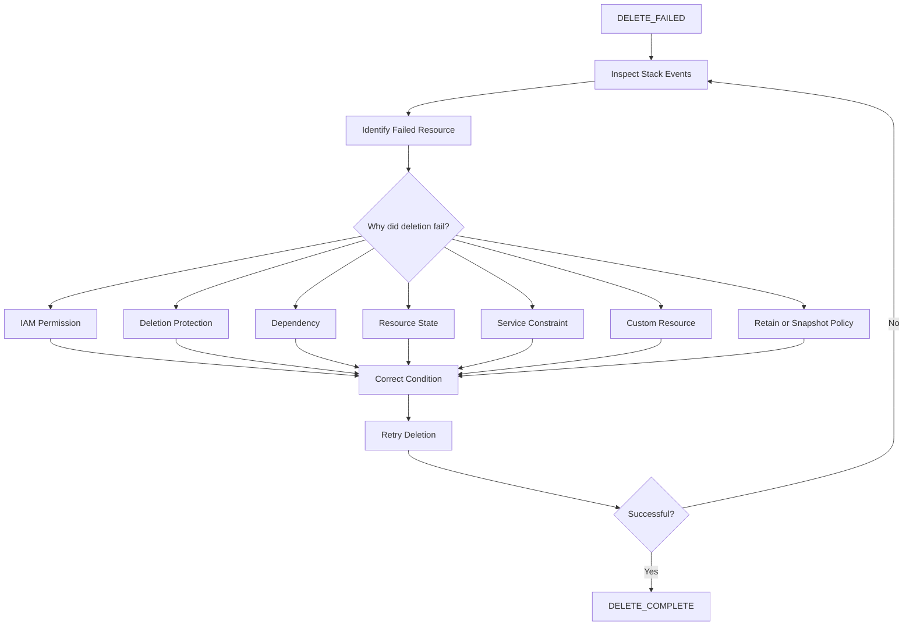
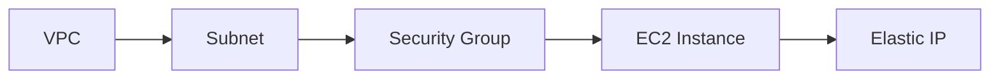

# 05- Stack Deletion Failures

## Overview

CloudFormation stack deletion removes the resources managed by a stack according to each resource's deletion behavior. Deletion failures occur when CloudFormation cannot delete one or more resources or when a resource is configured to be retained.

Deletion is fundamentally different from update rollback because the intended end state is the removal of the stack and its managed resources.

Common causes include:

- Resource deletion protection.
- `DeletionPolicy: Retain`.
- `DeletionPolicy: Snapshot` on supported resources.
- Resources with dependencies that cannot be removed.
- IAM permission failures.
- Non-empty storage resources.
- Resources modified outside CloudFormation.
- Service-level constraints.
- Nested stack deletion failures.
- Custom resource cleanup failures.
- Termination protection.

A failed deletion requires careful investigation because blindly forcing deletion can cause either unintended data loss or orphaned infrastructure.

## Stack Deletion Lifecycle

A normal deletion follows a lifecycle similar to:

```text
DELETE_IN_PROGRESS
       |
       v
Delete dependent resources
       |
       v
Delete remaining resources
       |
       +----------------------+
       |                      |
       v                      v
DELETE_COMPLETE          DELETE_FAILED
                              |
                              v
                     Investigate resources
                              |
                              v
                     Correct blocker
                              |
                              v
                         Retry deletion
```

The primary diagnostic source is the stack event stream.

```bash
aws cloudformation describe-stack-events \
  --stack-name backend-production \
  --region ap-south-1 \
  --query 'StackEvents[].{Time:Timestamp,Resource:LogicalResourceId,Status:ResourceStatus,Reason:ResourceStatusReason}' \
  --output table
```

## Stack Deletion Status

Useful deletion-related statuses include:

| Status | Meaning |
|---|---|
| `DELETE_IN_PROGRESS` | CloudFormation is deleting the stack and its resources |
| `DELETE_FAILED` | One or more resources could not be deleted |
| `DELETE_COMPLETE` | Stack deletion completed |
| `DELETE_COMPLETE` with retained resources | Stack was deleted but resources configured for retention remain |
| `DELETE_SKIPPED` | Resource deletion was skipped in a supported recovery scenario |

A stack can therefore disappear successfully while some resources intentionally remain.

## Checking Stack Status

Before attempting deletion:

```bash
aws cloudformation describe-stacks \
  --stack-name backend-production \
  --region ap-south-1 \
  --query 'Stacks[0].{Status:StackStatus,StatusReason:StackStatusReason,TerminationProtection:EnableTerminationProtection}' \
  --output table
```

This establishes whether deletion is currently allowed and whether termination protection is enabled.

## Termination Protection

Termination protection prevents accidental deletion of a stack.

Check it:

```bash
aws cloudformation describe-stacks \
  --stack-name backend-production \
  --region ap-south-1 \
  --query 'Stacks[0].EnableTerminationProtection'
```

If enabled, deletion must be preceded by disabling termination protection:

```bash
aws cloudformation update-termination-protection \
  --stack-name backend-production \
  --no-enable-termination-protection \
  --region ap-south-1
```

Then deletion can be initiated:

```bash
aws cloudformation delete-stack \
  --stack-name backend-production \
  --region ap-south-1
```

Termination protection is particularly valuable for production stacks containing stateful resources.

## `DeletionPolicy`

`DeletionPolicy` controls what CloudFormation does with a resource when the resource is deleted from the template or when the stack is deleted.

Common values include:

| Policy | Behavior |
|---|---|
| `Delete` | Delete the resource |
| `Retain` | Keep the physical resource |
| `Snapshot` | Create a snapshot before deletion where supported |

Example:

```yaml
Resources:
  ProductionDatabase:
    Type: AWS::RDS::DBInstance
    DeletionPolicy: Snapshot
    Properties:
      DBInstanceClass: db.t4g.medium
```

For a production database, `Snapshot` may be preferable to unconditional deletion, depending on the recovery strategy.

## `Retain`

`Retain` deliberately leaves the physical resource behind.

```yaml
Resources:
  ProductionBucket:
    Type: AWS::S3::Bucket
    DeletionPolicy: Retain
```

When the stack is deleted:

```text
CloudFormation Stack
        |
        v
ProductionBucket
        |
        v
DeletionPolicy: Retain
        |
        v
Bucket remains
```

This prevents accidental data deletion but creates an infrastructure resource that is no longer managed by the deleted stack.

### Operational Consequences

Retained resources can cause:

- Orphaned infrastructure.
- Ongoing AWS charges.
- Duplicate resources during later deployments.
- Ownership ambiguity.
- Manual cleanup requirements.

Retention should therefore be intentional and documented.

## `Snapshot`

`Snapshot` instructs CloudFormation to create a snapshot before deleting supported resources.

Example:

```yaml
Resources:
  ProductionDatabase:
    Type: AWS::RDS::DBInstance
    DeletionPolicy: Snapshot
```

This provides an additional recovery mechanism but does not mean the entire infrastructure configuration is preserved.

A snapshot is not equivalent to:

- Application backups.
- Cross-region disaster recovery.
- Point-in-time recovery.
- Full infrastructure recovery.

Validate the actual recovery requirements separately.

## `UpdateReplacePolicy`

`UpdateReplacePolicy` controls what happens to the existing physical resource when an update requires replacement.

Example:

```yaml
Resources:
  ProductionDatabase:
    Type: AWS::RDS::DBInstance
    DeletionPolicy: Snapshot
    UpdateReplacePolicy: Snapshot
```

The distinction is important:

| Policy | Applies to |
|---|---|
| `DeletionPolicy` | Resource removal and stack deletion |
| `UpdateReplacePolicy` | Old resource when an update causes replacement |

Using both is common for important stateful resources.

## Why Deletion Fails

A useful troubleshooting model is:



## IAM Permission Failures

CloudFormation must have permission to delete the resource.

A failure may look like:

```text
is not authorized to perform: ec2:DeleteSecurityGroup
```

Check the identity:

```bash
aws sts get-caller-identity
```

If the stack uses a CloudFormation service role, investigate that role's permissions.

For production:

- Use a dedicated CloudFormation service role.
- Grant least-privilege permissions.
- Restrict `iam:PassRole`.
- Audit deletion operations.
- Do not temporarily grant administrator access as the default fix.

## Resource Deletion Protection

Some AWS resources have service-level deletion protection.

A common example is an RDS database with deletion protection enabled.

Inspect the database:

```bash
aws rds describe-db-instances \
  --db-instance-identifier production-db \
  --region ap-south-1 \
  --query 'DBInstances[0].DeletionProtection'
```

If deletion protection is enabled, the underlying service must first allow deletion.

For example:

```bash
aws rds modify-db-instance \
  --db-instance-identifier production-db \
  --no-deletion-protection \
  --apply-immediately \
  --region ap-south-1
```

This is a high-impact operation and should be performed only when deletion is explicitly authorized.

## Resource Dependencies

CloudFormation generally determines resource dependencies from references in the template.

Example:



CloudFormation must respect these relationships during deletion.

A dependent resource can prevent deletion of a resource it relies on.

For example:

- An ENI may still be attached.
- A security group may still be referenced.
- A load balancer may still have listeners or target groups.
- A subnet may still contain dependent resources.

When deletion fails, identify the first failed resource rather than assuming the final event represents the root cause.

## Security Group Deletion Failures

A security group may fail to delete because another resource still references it.

Typical examples include:

- EC2 network interfaces.
- Load balancers.
- Other security groups.
- Container workloads.

Inspect the security group:

```bash
aws ec2 describe-security-groups \
  --group-ids sg-0123456789abcdef0 \
  --region ap-south-1
```

Then investigate resources using the group.

Do not simply delete dependent resources manually without understanding whether CloudFormation still manages them.

## Non-Empty S3 Buckets

S3 buckets commonly require special attention.

A bucket containing objects cannot generally be deleted until the objects are removed.

Check the bucket:

```bash
aws s3 ls s3://backend-production-data
```

For an authorized destructive cleanup:

```bash
aws s3 rm s3://backend-production-data \
  --recursive
```

Then retry the stack deletion.

For production data, verify:

- Bucket ownership.
- Backup requirements.
- Versioning.
- Object Lock.
- Retention requirements.
- Replication.
- Regulatory requirements.

Do not automatically empty a production bucket simply because CloudFormation reports a deletion failure.

## S3 Versioning and Object Cleanup

Versioned buckets require additional care because deleting the visible object does not necessarily remove all object versions and delete markers.

Inspect object versions:

```bash
aws s3api list-object-versions \
  --bucket backend-production-data \
  --region ap-south-1
```

Large production buckets should not be treated as disposable deployment artifacts.

If a bucket is intended to survive stack deletion, `DeletionPolicy: Retain` may be more appropriate.

## Custom Resource Deletion Failures

Custom resources execute provider logic during deletion.

```text
CloudFormation
      |
      v
Custom Resource DELETE
      |
      v
Lambda / Provider
      |
      v
External System
```

Deletion can fail if:

- The Lambda function throws an exception.
- The provider times out.
- Required permissions are missing.
- External resources are already unavailable.
- The provider does not correctly signal completion.
- Cleanup logic is not idempotent.

Inspect CloudFormation events first:

```bash
aws cloudformation describe-stack-events \
  --stack-name backend-production \
  --region ap-south-1 \
  --query 'StackEvents[?ResourceType==`Custom::Resource`].{Resource:LogicalResourceId,Status:ResourceStatus,Reason:ResourceStatusReason}' \
  --output table
```

Then inspect the custom resource provider's CloudWatch Logs.

Custom resource cleanup should be designed to be idempotent. A `Delete` request may need to tolerate a resource that has already disappeared.

## Nested Stack Deletion Failures

Nested stacks introduce additional deletion boundaries.

```text
Parent Stack
    |
    +--> Network Nested Stack
    |
    +--> Database Nested Stack
    |
    +--> Application Nested Stack
```

A child stack can fail deletion while the parent stack remains in:

```text
DELETE_IN_PROGRESS
```

or eventually:

```text
DELETE_FAILED
```

Inspect nested stack events:

```bash
aws cloudformation describe-stack-events \
  --stack-name backend-production \
  --region ap-south-1 \
  --query 'StackEvents[?ResourceType==`AWS::CloudFormation::Stack`].{Resource:LogicalResourceId,Status:ResourceStatus,Reason:ResourceStatusReason}' \
  --output table
```

If the child stack is identifiable, investigate it independently.

## Retained Resources During Stack Deletion

A stack can successfully reach `DELETE_COMPLETE` while resources configured with `Retain` remain.

For example:

```yaml
Resources:
  ProductionDatabase:
    Type: AWS::RDS::DBInstance
    DeletionPolicy: Retain
```

After stack deletion:

```text
CloudFormation Stack
        |
        X deleted

ProductionDatabase
        |
        v
Still exists
```

The resource must then be managed independently.

Track retained resources using:

- AWS resource inventory.
- Tags.
- Infrastructure ownership records.
- Cost monitoring.
- Explicit operational documentation.

## Deletion Failure Versus Retention

These conditions are different:

| Situation | Result |
|---|---|
| Resource deletion succeeds | Resource removed |
| `DeletionPolicy: Retain` | Resource intentionally remains |
| `DeletionPolicy: Snapshot` | Snapshot created and resource removed where supported |
| Resource deletion fails | Stack enters deletion failure state |
| Termination protection enabled | Stack deletion is blocked before resource deletion |

Do not interpret every resource that remains after stack deletion as a deletion failure.

## Manual Changes and Drift

Manual changes can complicate deletion.

Examples:

- A resource was replaced manually.
- A security group was modified.
- An IAM role was removed.
- A database configuration changed.
- A resource was imported into another workflow.

Detect drift when appropriate:

```bash
aws cloudformation detect-stack-drift \
  --stack-name backend-production \
  --region ap-south-1
```

Retrieve the detection result:

```bash
aws cloudformation describe-stack-drift-detection-status \
  --stack-drift-detection-id <detection-id> \
  --region ap-south-1
```

Drift detection can help establish whether actual infrastructure differs from the CloudFormation-managed configuration.

## Deletion Failure Diagnostic Workflow

Use a structured process.

### Check Stack Status

```bash
aws cloudformation describe-stacks \
  --stack-name backend-production \
  --region ap-south-1 \
  --query 'Stacks[0].{Status:StackStatus,Reason:StackStatusReason}' \
  --output table
```

### Inspect Failed Events

```bash
aws cloudformation describe-stack-events \
  --stack-name backend-production \
  --region ap-south-1 \
  --query 'StackEvents[?contains(ResourceStatus, `FAILED`)].{Time:Timestamp,Resource:LogicalResourceId,Type:ResourceType,Status:ResourceStatus,Reason:ResourceStatusReason}' \
  --output table
```

### Identify the First Blocking Resource

Do not automatically focus on the last event.

Determine:

1. Which resource failed first?
2. What was the failure reason?
3. Is the failure from CloudFormation or the underlying AWS service?
4. Is the resource protected?
5. Does another resource depend on it?
6. Is the resource still required?
7. Would deleting it cause data loss?

### Correct the Blocking Condition

Examples:

- Remove deletion protection.
- Correct IAM permissions.
- Remove dependencies.
- Clean up an authorized resource.
- Fix a custom resource provider.
- Preserve the resource intentionally.
- Resolve service-level constraints.

### Retry the Deletion

```bash
aws cloudformation delete-stack \
  --stack-name backend-production \
  --region ap-south-1
```

### Monitor the Result

```bash
aws cloudformation wait stack-delete-complete \
  --stack-name backend-production \
  --region ap-south-1
```

If the command returns successfully, verify the stack is gone and inspect any intentionally retained resources separately.

## Using `delete-stack`

Basic deletion:

```bash
aws cloudformation delete-stack \
  --stack-name backend-production \
  --region ap-south-1
```

When the stack uses a service role:

```bash
aws cloudformation delete-stack \
  --stack-name backend-production \
  --role-arn arn:aws:iam::123456789012:role/cloudformation-deployment-role \
  --region ap-south-1
```

The role must have the permissions necessary to perform the deletion.

## Waiting for Deletion

For automation:

```bash
aws cloudformation wait stack-delete-complete \
  --stack-name backend-production \
  --region ap-south-1
```

This is preferable to arbitrary sleep intervals in CI/CD scripts.

Example:

```bash
aws cloudformation delete-stack \
  --stack-name backend-production \
  --region ap-south-1

aws cloudformation wait stack-delete-complete \
  --stack-name backend-production \
  --region ap-south-1
```

If deletion fails, retrieve stack events and report the actual resource failure rather than hiding it behind a generic pipeline error.

## Production Deletion Procedure

Before deleting a production stack:

1. Confirm the stack and AWS account.
2. Confirm the AWS region.
3. Confirm that deletion is authorized.
4. Identify stateful resources.
5. Review `DeletionPolicy`.
6. Review `UpdateReplacePolicy` where relevant.
7. Verify backups and recovery requirements.
8. Check termination protection.
9. Identify retained resources.
10. Review dependencies.
11. Execute the deletion.
12. Monitor CloudFormation events.
13. Validate that expected resources were removed.
14. Inventory any intentionally retained resources.
15. Verify application and operational dependencies are no longer required.

A useful pre-deletion inventory:

```bash
aws cloudformation list-stack-resources \
  --stack-name backend-production \
  --region ap-south-1 \
  --output table
```

This provides a resource-level view before destructive operations.

## Data Protection

Stack deletion is a destructive infrastructure operation.

For stateful services, consider:

- Database snapshots.
- Automated backups.
- Point-in-time recovery.
- S3 versioning.
- Cross-region replication.
- Backup retention.
- Recovery testing.
- Legal or regulatory retention requirements.

Example:

```yaml
Resources:
  ProductionDatabase:
    Type: AWS::RDS::DBInstance
    DeletionPolicy: Snapshot
    UpdateReplacePolicy: Snapshot
```

The correct policy depends on the application's recovery requirements.

Do not use `Retain` or `Snapshot` merely to make a deployment feel safer. Understand who owns the resulting resource and how it will be recovered or cleaned up.

## Reliability Considerations

Reliable stack deletion requires predictable resource ownership.

Recommended practices:

- Keep infrastructure managed through version control.
- Use termination protection for critical production stacks.
- Protect stateful resources.
- Avoid manual changes to managed resources.
- Use explicit ownership tags.
- Document retained resources.
- Test deletion behavior in non-production environments.
- Design custom resource cleanup to be idempotent.
- Monitor deletion operations.
- Verify the final resource state.

Deletion should be treated as a controlled lifecycle operation, not as a routine cleanup command.

## Security Considerations

Stack deletion can remove security controls as well as application infrastructure.

Potentially affected resources include:

- IAM roles.
- Security groups.
- VPC networking.
- KMS keys.
- Logging infrastructure.
- Monitoring resources.
- Secrets.
- Databases.

Use least-privilege deployment roles and tightly control who can delete production stacks.

Audit destructive operations through CloudTrail and maintain clear ownership for production infrastructure.

Never store credentials directly in templates or command history when they can be supplied through secure mechanisms.

## Cost Considerations

Deletion failures can leave resources running and therefore continue generating charges.

Common examples include:

- EC2 instances.
- NAT gateways.
- Load balancers.
- RDS instances.
- Elastic IP addresses.
- OpenSearch domains.
- EBS volumes.
- Retained S3 buckets.

After a failed or completed deletion, check for orphaned resources.

Retained resources should be intentionally tagged and monitored so that they do not become permanent infrastructure by accident.

## Common Mistakes

### Deleting Without Checking `DeletionPolicy`

A database or bucket may be deleted unexpectedly.

**Avoid it by:** reviewing lifecycle policies before destructive operations.

### Assuming `DELETE_COMPLETE` Means Every Resource Is Gone

Resources configured with `Retain` can survive stack deletion.

**Avoid it by:** inventorying retained resources after deletion.

### Ignoring Termination Protection

Deletion can be blocked before CloudFormation begins removing resources.

**Avoid it by:** checking `EnableTerminationProtection`.

### Emptying an S3 Bucket Without Verification

This can permanently destroy application data.

**Avoid it by:** verifying ownership, backup requirements, retention requirements, and authorization before cleanup.

### Manually Deleting Resources First

This can create drift and make CloudFormation's state harder to reason about.

**Avoid it by:** allowing CloudFormation to manage resource lifecycle whenever possible.

### Granting Administrator Access to Fix Deletion

Broad permissions may solve an IAM error while creating a much larger security problem.

**Avoid it by:** identifying the exact missing permission and correcting the deployment role.

### Ignoring Custom Resource Cleanup

Custom resources can fail because their provider logic is not idempotent.

**Avoid it by:** designing and testing `Delete` handling explicitly.

### Assuming Retained Resources Are Automatically Managed

`Retain` removes CloudFormation ownership of the resource after stack deletion.

**Avoid it by:** documenting and assigning ownership of retained resources.

### Retrying Without Reading Events

A repeated deletion attempt may produce the same failure.

**Avoid it by:** identifying the underlying service-level failure first.

## Interview Traps

### What does `DeletionPolicy: Retain` do?

It tells CloudFormation to preserve the physical resource when the resource is removed from the stack or when the stack is deleted.

### Does `Retain` mean CloudFormation continues managing the resource?

No. The physical resource remains, but the deleted stack no longer manages it.

### What is the difference between `DeletionPolicy` and `UpdateReplacePolicy`?

`DeletionPolicy` controls behavior when a resource is deleted from the stack or the stack is deleted. `UpdateReplacePolicy` controls what happens to the existing physical resource when an update requires replacement.

### Why can an S3 bucket cause stack deletion to fail?

A bucket containing objects cannot generally be deleted until its contents are removed, unless the bucket is intentionally retained.

### What is termination protection?

Termination protection prevents accidental deletion of a CloudFormation stack.

### Does `DELETE_COMPLETE` guarantee that every physical resource was deleted?

No. Resources configured with `Retain` can remain, and resources may also exist outside the stack due to previous manual operations or other lifecycle mechanisms.

### Why should deletion events be inspected?

The stack-level failure status is often insufficient. `ResourceStatusReason` identifies the specific resource and underlying failure that prevented deletion.

### How should a production stack deletion failure be handled?

Identify the failed resource, understand the underlying service constraint, determine whether deletion is safe, correct the blocking condition, retry deletion, and verify the resulting infrastructure state.

## Key Takeaways

- CloudFormation stack deletion is a destructive lifecycle operation and should be treated accordingly.
- `DELETE_IN_PROGRESS` means CloudFormation is actively removing resources.
- `DELETE_FAILED` means one or more resources could not be deleted.
- Always inspect stack events and `ResourceStatusReason` before taking recovery action.
- `DeletionPolicy` determines what happens to resources during deletion.
- `Retain` preserves a physical resource but removes CloudFormation management of it after stack deletion.
- `Snapshot` can preserve recoverable state for supported resources before deletion.
- `UpdateReplacePolicy` protects resources when an update requires replacement.
- Termination protection prevents accidental stack deletion.
- S3 buckets, databases, security groups, custom resources, and nested stacks are common deletion-failure points.
- Resource-level deletion protection can prevent CloudFormation from completing a stack deletion.
- IAM permissions must be sufficient for the CloudFormation deployment or service role.
- Never empty or delete production data merely to make a stack deletion succeed.
- Retained and orphaned resources should be inventoried, tagged, and assigned explicit ownership.
- Successful stack deletion does not necessarily mean every physical resource has disappeared.
- Production deletion should be authorized, observable, reversible where possible, and followed by resource-level verification.