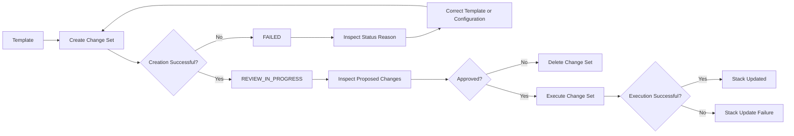
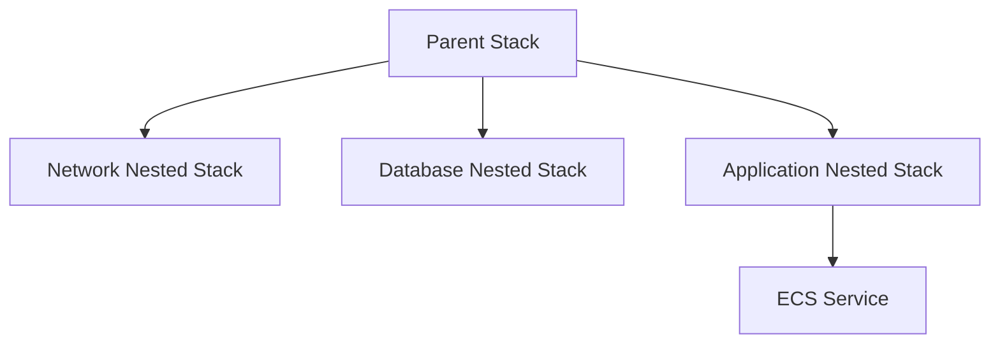
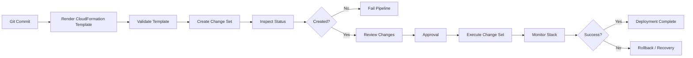

# 06- Change Set Failures

## Overview

A CloudFormation change set is a preview of the resource changes that CloudFormation would apply to an existing stack. It is commonly used to separate **change planning** from **change execution**.

A change set can fail before it is executed. This is different from an execution failure:

| Failure stage | Meaning |
|---|---|
| Change set creation | CloudFormation could not successfully calculate or create the proposed change set |
| Change set review | Change set exists, but the proposed changes are unsafe or incorrect |
| Change set execution | The change set was valid, but one or more resource operations failed during deployment |

The distinction matters operationally. A failed change set generally means the infrastructure has **not yet been changed by that change set**. The correct response is usually to inspect the failure reason, correct the template, parameters, capabilities, or stack state, and create a new change set.

Typical causes include:

- Invalid template or template structure.
- Incorrect parameter values.
- Missing IAM capabilities.
- Invalid resource properties.
- Unsupported resource transitions.
- Incorrect stack name or ARN.
- Incorrect change set type.
- Stack state does not permit the requested operation.
- Missing permissions.
- Invalid or unavailable resources.
- Nested stack or dependency problems.
- No actual changes in the submitted template.

## Change Set Lifecycle

A typical workflow is:



The important diagnostic boundary is between **change set creation** and **change set execution**.

## Creating a Change Set

A typical update change set can be created with:

```bash
aws cloudformation create-change-set \
  --stack-name backend-production \
  --change-set-name backend-production-update-20260813 \
  --change-set-type UPDATE \
  --template-body file://template.yaml \
  --region ap-south-1
```

For a new stack:

```bash
aws cloudformation create-change-set \
  --stack-name backend-production \
  --change-set-name backend-production-create \
  --change-set-type CREATE \
  --template-body file://template.yaml \
  --region ap-south-1
```

The change set type must match the intended operation.

## Inspecting Change Set Status

After creation, inspect the change set:

```bash
aws cloudformation describe-change-set \
  --stack-name backend-production \
  --change-set-name backend-production-update-20260813 \
  --region ap-south-1
```

A concise diagnostic query is:

```bash
aws cloudformation describe-change-set \
  --stack-name backend-production \
  --change-set-name backend-production-update-20260813 \
  --region ap-south-1 \
  --query '{Status:Status,Reason:StatusReason,ExecutionStatus:ExecutionStatus,Changes:Changes}'
```

The two fields that should be checked first are:

- `Status`
- `StatusReason`

`StatusReason` usually provides the most useful explanation for a failed change-set operation.

## Change Set Statuses

Common statuses include:

| Status | Meaning |
|---|---|
| `CREATE_PENDING` | Creation has not started |
| `CREATE_IN_PROGRESS` | CloudFormation is creating the change set |
| `CREATE_COMPLETE` | Change set was created successfully |
| `CREATE_FAILED` | CloudFormation could not create the change set |
| `DELETE_PENDING` | Change set deletion is pending |
| `DELETE_IN_PROGRESS` | Change set deletion is running |
| `DELETE_COMPLETE` | Change set was deleted |
| `DELETE_FAILED` | Change set deletion failed |
| `FAILED` | Change set operation failed |

For troubleshooting, the exact `StatusReason` is more valuable than the status alone.

## Change Set Creation Failure Versus Execution Failure

This distinction is one of the most important CloudFormation troubleshooting concepts.

### Creation Failure

```text
Template
   |
   v
Create Change Set
   |
   X
CREATE_FAILED
```

No execution of that change set has occurred.

Typical causes:

- Invalid parameters.
- Invalid template.
- Missing capabilities.
- No changes.
- Incorrect change set type.
- Invalid stack state.

### Execution Failure

```text
Change Set
    |
    v
Execute
    |
    v
Resource Changes
    |
    X
UPDATE_FAILED
```

CloudFormation has begun applying the infrastructure changes.

Execution failures can therefore trigger:

- Resource rollback.
- Stack rollback.
- Partial resource operations.
- Replacement of resources.
- Application downtime depending on the resource and update strategy.

Do not troubleshoot both failure classes in the same way.

## Checking the Existing Stack

Before creating a change set, inspect the stack state:

```bash
aws cloudformation describe-stacks \
  --stack-name backend-production \
  --region ap-south-1 \
  --query 'Stacks[0].{Status:StackStatus,Reason:StackStatusReason}' \
  --output table
```

Common states that can affect updates include:

- `CREATE_COMPLETE`
- `UPDATE_COMPLETE`
- `UPDATE_ROLLBACK_COMPLETE`
- `UPDATE_IN_PROGRESS`
- `UPDATE_ROLLBACK_IN_PROGRESS`
- `UPDATE_ROLLBACK_FAILED`
- `DELETE_IN_PROGRESS`
- `DELETE_FAILED`

A stack already undergoing an operation should generally not be treated as a normal update target.

## Invalid Template Errors

A change set cannot be successfully generated if CloudFormation cannot process the template.

Validate the template before creating the change set:

```bash
aws cloudformation validate-template \
  --template-body file://template.yaml \
  --region ap-south-1
```

This is useful for catching structural and syntax-level issues, but successful validation does not guarantee that a deployment will succeed.

Validation does not prove that:

- Resource configuration is operationally valid.
- IAM permissions are sufficient.
- Service quotas are available.
- Resource names are available.
- Runtime dependencies exist.
- The requested update is supported.

Treat validation as an early check, not as deployment verification.

## Template Structure Problems

Typical problems include:

- Invalid YAML indentation.
- Incorrect CloudFormation intrinsic function syntax.
- Incorrect resource property names.
- Invalid resource types.
- Invalid parameter references.
- Incorrect dependency declarations.

Example:

```yaml
Resources:
  ApiService:
    Type: AWS::ECS::Service
    Properties:
      Cluster: !Ref Cluster
      DesiredCount: 2
```

If a property is incorrectly named or has an invalid value, change set creation or later resource validation can fail.

When troubleshooting, reduce the problem to the exact resource and property identified by the error rather than changing unrelated parts of the template.

## Parameter Problems

Change sets can fail because required parameters are missing or invalid.

List stack parameters:

```bash
aws cloudformation describe-stacks \
  --stack-name backend-production \
  --region ap-south-1 \
  --query 'Stacks[0].Parameters'
```

Create the change set with explicit parameters when required:

```bash
aws cloudformation create-change-set \
  --stack-name backend-production \
  --change-set-name backend-production-update \
  --change-set-type UPDATE \
  --template-body file://template.yaml \
  --parameters \
    ParameterKey=Environment,ParameterValue=production \
    ParameterKey=ImageTag,ParameterValue=2026.08.13 \
  --region ap-south-1
```

Common mistakes include:

- Using the parameter's logical ID incorrectly.
- Supplying a value that violates `AllowedValues`.
- Supplying a value outside `MinValue` or `MaxValue`.
- Forgetting a required parameter.
- Accidentally replacing an existing parameter value with a default.

## Parameter Value Resolution

For sensitive or dynamic configuration, avoid placing secrets directly in CLI commands or templates.

Prefer mechanisms such as:

- AWS Systems Manager Parameter Store.
- AWS Secrets Manager.
- CloudFormation dynamic references.

For example:

```yaml
Parameters:
  DatabasePassword:
    Type: AWS::SSM::Parameter::Value<String>
    Default: /production/database/password
    NoEcho: true
```

The exact parameter type and reference mechanism should match the application's security requirements.

## Missing Capabilities

One of the most common change set failures involves IAM resources.

If the template contains resources such as:

```yaml
Resources:
  ApplicationRole:
    Type: AWS::IAM::Role
    Properties:
      AssumeRolePolicyDocument:
        Version: "2012-10-17"
        Statement:
          - Effect: Allow
            Principal:
              Service:
                - ecs-tasks.amazonaws.com
            Action:
              - sts:AssumeRole
```

CloudFormation may require the appropriate capability acknowledgement.

For IAM resources, specify:

```bash
aws cloudformation create-change-set \
  --stack-name backend-production \
  --change-set-name backend-production-iam-update \
  --change-set-type UPDATE \
  --template-body file://template.yaml \
  --capabilities CAPABILITY_IAM \
  --region ap-south-1
```

For templates that require named IAM resources:

```bash
aws cloudformation create-change-set \
  --stack-name backend-production \
  --change-set-name backend-production-iam-update \
  --change-set-type UPDATE \
  --template-body file://template.yaml \
  --capabilities CAPABILITY_NAMED_IAM \
  --region ap-south-1
```

For macros or transforms that require acknowledgement, the appropriate capability must also be supplied.

## `CAPABILITY_IAM` Versus `CAPABILITY_NAMED_IAM`

These capabilities are not interchangeable in every situation.

| Capability | Purpose |
|---|---|
| `CAPABILITY_IAM` | Acknowledge that the template may create or modify IAM resources |
| `CAPABILITY_NAMED_IAM` | Acknowledge templates that create or modify named IAM resources |

If the template contains named IAM resources, use `CAPABILITY_NAMED_IAM` when required.

Do not blindly add every capability to every deployment. Capabilities are explicit acknowledgements of potentially privileged infrastructure operations.

## No Changes to Deploy

A change set can fail or become unusable when there are no meaningful changes between the current stack and the submitted configuration.

For example:

```text
Current stack
     |
     v
Compare template
     |
     v
No effective resource changes
```

Check the change set's `StatusReason`.

Before creating a change set, verify that the intended modification is actually present in the template or parameters.

A common CI/CD mistake is generating a change set for every pipeline run even when the rendered template is identical to the deployed configuration.

## Change Set Type Errors

The `--change-set-type` parameter must correspond to the operation.

For an existing stack:

```bash
--change-set-type UPDATE
```

For creating a new stack:

```bash
--change-set-type CREATE
```

Example failure scenario:

```text
Existing stack
     |
     v
CREATE change set
     |
     X
Invalid operation
```

Verify stack existence first:

```bash
aws cloudformation describe-stacks \
  --stack-name backend-production \
  --region ap-south-1
```

## Stack State Problems

A change set can fail because the stack is in an incompatible state.

For example:

```text
UPDATE_ROLLBACK_FAILED
```

indicates that the previous rollback did not complete successfully.

Do not immediately attempt another normal update. First recover the stack to a stable state.

Inspect events:

```bash
aws cloudformation describe-stack-events \
  --stack-name backend-production \
  --region ap-south-1 \
  --query 'StackEvents[0:20].{Time:Timestamp,Resource:LogicalResourceId,Status:ResourceStatus,Reason:ResourceStatusReason}' \
  --output table
```

The stack lifecycle state determines which operations are safe and available.

## Nested Stack Failures

A parent stack may contain nested stacks:



A change set can expose changes to nested stacks without fully resolving every downstream runtime problem.

When a nested stack is involved:

1. Identify the nested stack logical resource.
2. Inspect the nested stack ARN.
3. Inspect its events.
4. Determine whether the failure originates in the parent or child stack.
5. Correct the child configuration if necessary.
6. Recreate the appropriate change set.

## Resource Replacement in Change Sets

A change set can reveal whether a resource will be replaced.

Inspect:

```bash
aws cloudformation describe-change-set \
  --stack-name backend-production \
  --change-set-name backend-production-update \
  --region ap-south-1 \
  --query 'Changes[].ResourceChange.{Action:Action,LogicalId:LogicalResourceId,Type:ResourceType,Replacement:Replacement,Details:Details}'
```

The `Replacement` field is particularly important.

Typical values include:

| Replacement | Meaning |
|---|---|
| `True` | Existing physical resource will be replaced |
| `False` | Resource can be modified in place |
| `Conditional` | Replacement depends on the actual change |

For stateful resources such as databases, an unexpected replacement should be treated as a high-risk change.

## Unexpected Database Replacement

Suppose a template modification changes a property that requires replacement:

```text
Existing RDS instance
        |
        v
Change Set
        |
        v
Replacement = True
        |
        v
New DB instance
        |
        v
Old DB lifecycle depends on update policy
```

Review:

- `Replacement`.
- `DeletionPolicy`.
- `UpdateReplacePolicy`.
- Backup strategy.
- Application connection behavior.
- Downtime implications.
- Data migration requirements.

Never approve a production change set solely because the change set creation succeeded.

## IAM Permission Failures

A user or CloudFormation service role needs sufficient permissions to create and inspect the change set.

Typical permissions include CloudFormation actions such as:

- `cloudformation:CreateChangeSet`
- `cloudformation:DescribeChangeSet`
- `cloudformation:ExecuteChangeSet`
- `cloudformation:DeleteChangeSet`

The identity may also require access to referenced resources and supporting services depending on the operation.

Check the active identity:

```bash
aws sts get-caller-identity
```

In production CI/CD, prefer a dedicated deployment role rather than broad administrator permissions.

## Change Set Name Conflicts

Change set names must be managed carefully in automation.

A CI/CD system that repeatedly creates the same name can encounter conflicts depending on the lifecycle and existing change set.

Use unique names:

```bash
CHANGE_SET_NAME="backend-production-$(date +%Y%m%d%H%M%S)"
```

Then:

```bash
aws cloudformation create-change-set \
  --stack-name backend-production \
  --change-set-name "$CHANGE_SET_NAME" \
  --change-set-type UPDATE \
  --template-body file://template.yaml \
  --region ap-south-1
```

For deterministic deployment systems, the pipeline can instead deliberately delete or reuse change sets according to an explicit lifecycle policy.

## Inspecting Change Details

When a change set succeeds, inspect individual changes:

```bash
aws cloudformation describe-change-set \
  --stack-name backend-production \
  --change-set-name backend-production-update \
  --region ap-south-1 \
  --query 'Changes[].ResourceChange.{Action:Action,LogicalId:LogicalResourceId,Type:ResourceType,Replacement:Replacement,Scope:Scope}'
```

This helps answer:

- Which resources change?
- Which resources are added?
- Which resources are removed?
- Which resources are modified?
- Which resources are replaced?

A change set is therefore both a deployment mechanism and a change-review artifact.

## Deleting a Failed Change Set

If a change set is no longer useful:

```bash
aws cloudformation delete-change-set \
  --stack-name backend-production \
  --change-set-name backend-production-update \
  --region ap-south-1
```

This prevents stale change sets from accumulating and confusing operators.

List existing change sets:

```bash
aws cloudformation list-change-sets \
  --stack-name backend-production \
  --region ap-south-1 \
  --output table
```

## Correcting a Failed Change Set

A failed change set should generally be treated as disposable.

Use this workflow:

```text
Failed Change Set
       |
       v
Read StatusReason
       |
       v
Classify Failure
       |
       +--> Template
       +--> Parameters
       +--> Capabilities
       +--> Permissions
       +--> Stack State
       +--> Change Type
       +--> Resource Configuration
       |
       v
Correct Source
       |
       v
Create New Change Set
       |
       v
Review Changes
       |
       v
Execute
```

Do not attempt to "repair" a failed change set by assuming its contents will automatically update. Correct the source configuration and create a new change set.

## Change Set Execution

Once a change set is valid and approved:

```bash
aws cloudformation execute-change-set \
  --stack-name backend-production \
  --change-set-name backend-production-update \
  --region ap-south-1
```

Then monitor the stack:

```bash
aws cloudformation describe-stacks \
  --stack-name backend-production \
  --region ap-south-1 \
  --query 'Stacks[0].{Status:StackStatus,Reason:StackStatusReason}'
```

Or wait for the update:

```bash
aws cloudformation wait stack-update-complete \
  --stack-name backend-production \
  --region ap-south-1
```

A successfully created change set is not evidence that execution will succeed.

## Production Troubleshooting Workflow

Use the following sequence for a failed change set.

### Verify Account and Region

```bash
aws sts get-caller-identity
```

```bash
aws configure get region
```

Explicitly specify the region in production automation rather than depending on local CLI configuration.

### Verify the Stack

```bash
aws cloudformation describe-stacks \
  --stack-name backend-production \
  --region ap-south-1 \
  --query 'Stacks[0].{StackId:StackId,Status:StackStatus,Reason:StackStatusReason}'
```

### Inspect the Change Set

```bash
aws cloudformation describe-change-set \
  --stack-name backend-production \
  --change-set-name backend-production-update \
  --region ap-south-1 \
  --query '{Status:Status,Reason:StatusReason,ExecutionStatus:ExecutionStatus}'
```

### Validate the Template

```bash
aws cloudformation validate-template \
  --template-body file://template.yaml \
  --region ap-south-1
```

### Verify Parameters and Capabilities

Confirm:

- Required parameters.
- Parameter values.
- IAM capabilities.
- Macro or transform requirements.
- Referenced resource identifiers.
- Deployment role permissions.

### Recreate the Change Set

After correcting the source configuration, create a new change set instead of relying on the failed artifact.

## CI/CD Integration

A production pipeline can separate planning from execution:



This pattern is useful for backend systems where infrastructure changes accompany application deployments.

For example:

```text
Django / FastAPI service
        |
        v
Container image
        |
        v
ECS infrastructure
        |
        v
CloudFormation change set
        |
        v
Production deployment
```

The pipeline should fail early when change-set creation fails rather than executing a partially understood infrastructure change.

## Security Considerations

Change sets can expose sensitive infrastructure changes, including:

- IAM roles.
- Policies.
- Security groups.
- KMS resources.
- Secrets-related resources.
- Network boundaries.

Restrict who can:

- Create change sets.
- Inspect sensitive infrastructure.
- Execute change sets.
- Delete change sets.

Use least-privilege IAM roles and require explicit approval for high-impact production changes.

Do not place plaintext credentials in templates or CLI commands merely to make change-set creation succeed.

## Reliability Considerations

Use change sets as a **risk-reduction mechanism**, not as a guarantee of successful deployment.

Before execution, review:

- Resource additions.
- Resource removals.
- Resource replacements.
- IAM changes.
- Network changes.
- Database changes.
- Changes to security boundaries.
- Changes to application availability.

For stateful services, verify backup and recovery mechanisms before executing replacement or destructive changes.

## Cost Considerations

Change sets themselves are primarily a planning mechanism, but the changes they describe can have significant cost consequences.

Look for:

- New NAT gateways.
- Additional load balancers.
- Larger database instances.
- Additional replicas.
- New storage resources.
- Replacement resources temporarily running alongside existing resources.

A replacement can temporarily increase resource consumption because the old and new resources may coexist during the transition.

## Common Mistakes

### Treating Change Set Creation as Deployment

Creating a change set does not execute it.

**Avoid it by:** explicitly executing the approved change set.

### Treating Successful Creation as Proof of Deployment Success

A change set can be created successfully and still fail during execution.

**Avoid it by:** monitoring the stack after execution.

### Ignoring `StatusReason`

The status alone rarely provides enough diagnostic information.

**Avoid it by:** always inspecting `StatusReason`.

### Using the Wrong Change Set Type

Creating an `UPDATE` change set for a nonexistent stack or a `CREATE` change set for an existing stack can fail.

**Avoid it by:** checking the current stack state first.

### Forgetting IAM Capabilities

Templates containing IAM resources can require capability acknowledgement.

**Avoid it by:** reviewing the template and specifying the appropriate capability.

### Approving Resource Replacement Without Review

A change set can reveal `Replacement: True` for a resource that was expected to update in place.

**Avoid it by:** reviewing replacement behavior, especially for databases and other stateful services.

### Reusing Stale Change Sets

Old change sets can represent outdated templates or parameter values.

**Avoid it by:** deleting stale artifacts and generating a fresh change set for the intended deployment.

### Assuming Template Validation Guarantees Deployment Success

Template validation does not verify every runtime or service-level condition.

**Avoid it by:** treating validation, change-set creation, and execution as separate stages.

### Debugging the Wrong Stack

In multi-account or multi-region environments, it is easy to inspect a stack in the wrong account or region.

**Avoid it by:** verifying `aws sts get-caller-identity`, stack ARN, and region before troubleshooting.

## Interview Traps

### Does creating a change set modify the stack?

No. Creating a change set calculates and records the proposed changes. The changes are applied only when the change set is executed.

### What should you inspect first when a change set fails?

Inspect the change set's `Status` and especially `StatusReason`.

### Is a successful change set guaranteed to execute successfully?

No. Change-set creation and resource execution are separate stages.

### What is the difference between `CREATE_COMPLETE` and execution?

`CREATE_COMPLETE` for the change set means the proposed change set was successfully created. It does not mean the stack has been updated.

### What does `Replacement: True` indicate?

The existing physical resource is expected to be replaced as part of the change.

### Why can a change set fail even when the template is syntactically valid?

CloudFormation may reject the requested operation because of parameters, capabilities, permissions, stack state, resource configuration, change-set type, or other deployment constraints.

### Should a failed change set be executed?

No. A failed change set should be investigated and the underlying configuration corrected. A new change set should generally be created after the correction.

### Why are change sets valuable in production?

They provide a reviewable representation of intended infrastructure changes before execution, helping operators identify unexpected resource deletion, addition, modification, or replacement.

## Key Takeaways

- A change set is a proposed infrastructure change, not the deployment itself.
- Change-set creation failures occur before the proposed changes are executed.
- Always inspect `StatusReason` when a change set fails.
- Check the target stack's current state before creating an update change set.
- Validate templates early, but do not treat validation as deployment verification.
- Ensure required parameters and capabilities are supplied.
- `CAPABILITY_IAM` and `CAPABILITY_NAMED_IAM` should be used when the template requires the corresponding acknowledgement.
- A successful change set can still fail during execution.
- Review `Action`, `Replacement`, `Scope`, and affected resources before production execution.
- Unexpected resource replacement is particularly important for databases and other stateful services.
- Failed change sets should generally be corrected at the source and recreated rather than treated as reusable deployment artifacts.
- Use unique and traceable change set names in CI/CD systems.
- Verify AWS account, region, stack state, permissions, parameters, and capabilities during troubleshooting.
- Separate change-set planning, approval, execution, and post-deployment verification in production pipelines.
- Treat change sets as a risk-reduction and review mechanism, not as a guarantee that the deployment will succeed.