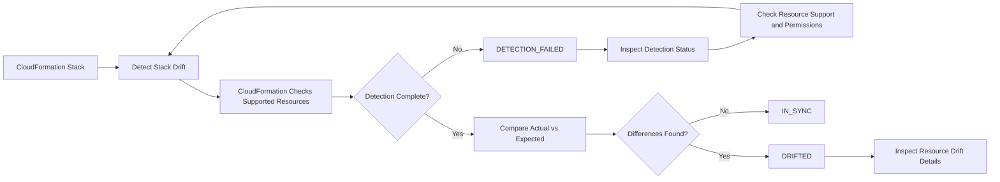
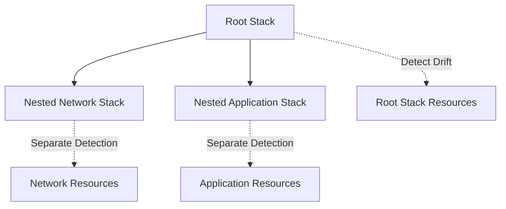
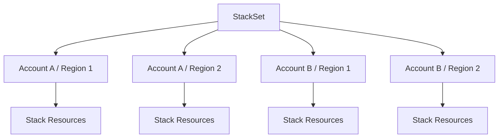
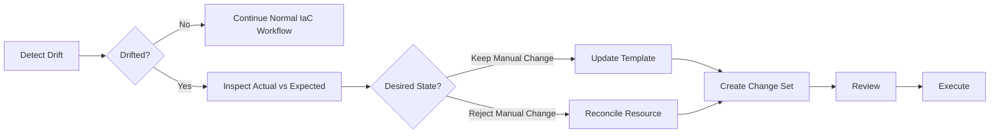
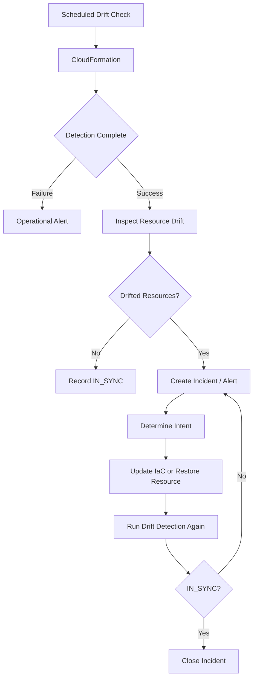

# 07- Drift Detection Failures

## Overview

CloudFormation drift detection determines whether the **actual configuration of supported resources differs from the expected configuration defined by the stack template and its parameter values**. It is primarily used to identify unmanaged or out-of-band changes made directly through AWS service APIs, consoles, scripts, or other automation.

A drift detection failure is different from a normal `DRIFTED` result:

| Result | Meaning |
|---|---|
| `IN_SYNC` | Checked resources match their expected configuration |
| `DRIFTED` | One or more checked resources differ from the expected configuration |
| `UNKNOWN` | CloudFormation could not determine the resource's drift state |
| `UNSUPPORTED` | The resource type does not currently support drift detection |
| Detection failure | CloudFormation could not complete the requested drift detection operation |

CloudFormation only checks resource properties that are explicitly defined in the template. A successful drift check therefore does **not** mean that every aspect of the underlying AWS resource has been verified. :contentReference[oaicite:0]{index=0}

Drift detection is particularly important in production environments where infrastructure is expected to remain controlled through Infrastructure as Code (IaC).

## Drift Detection Lifecycle

A stack-level drift check follows this general lifecycle:



The operational sequence is:

1. Start drift detection.
2. Record the returned detection ID.
3. Poll the detection status.
4. Wait for `DETECTION_COMPLETE`.
5. Inspect stack and resource drift results.
6. Investigate `MODIFIED`, `DELETED`, `UNKNOWN`, or unsupported resources.
7. Reconcile the infrastructure with the intended source of truth.

## Starting Stack Drift Detection

Start drift detection with:

```bash
aws cloudformation detect-stack-drift \
  --stack-name backend-production \
  --region ap-south-1
```

The response includes a `StackDriftDetectionId`.

Example:

```json
{
  "StackDriftDetectionId": "12345678-1234-1234-1234-123456789012"
}
```

The operation can take several minutes depending on the number of resources. CloudFormation allows only one stack drift detection operation at a time for a given stack. :contentReference[oaicite:1]{index=1}

## Monitoring Detection Status

Use the returned detection ID:

```bash
aws cloudformation describe-stack-drift-detection-status \
  --stack-drift-detection-id 12345678-1234-1234-1234-123456789012 \
  --region ap-south-1
```

A useful query is:

```bash
aws cloudformation describe-stack-drift-detection-status \
  --stack-drift-detection-id 12345678-1234-1234-1234-123456789012 \
  --region ap-south-1 \
  --query '{Status:DetectionStatus,Drift:StackDriftStatus,DriftedResources:DriftedStackResourceCount,Reason:StackDriftStatusReason}'
```

Typical detection states include:

| Detection status | Meaning |
|---|---|
| `DETECTION_IN_PROGRESS` | Drift detection is still running |
| `DETECTION_COMPLETE` | Drift detection completed |
| `DETECTION_FAILED` | CloudFormation could not complete the operation |

Do not inspect resource drift results as if they were fresh until the corresponding detection operation has completed. AWS specifically recommends checking the last drift-check timestamp when interpreting results. :contentReference[oaicite:2]{index=2}

## Understanding Drift Status

At the stack level, the most important result is:

```text
IN_SYNC
```

or:

```text
DRIFTED
```

A stack becomes `DRIFTED` when one or more checked resources differ from their expected configuration. :contentReference[oaicite:3]{index=3}

At the resource level, common statuses include:

| Resource status | Meaning |
|---|---|
| `IN_SYNC` | Actual configuration matches expected configuration |
| `MODIFIED` | One or more checked properties differ |
| `DELETED` | The expected resource no longer exists |
| `UNKNOWN` | CloudFormation could not determine the drift state |
| `UNSUPPORTED` | Resource type does not support drift detection |

`UNKNOWN` is especially important during troubleshooting because it means the detection process did not establish a reliable comparison result. :contentReference[oaicite:4]{index=4}

## Inspecting Drifted Resources

After detection completes:

```bash
aws cloudformation describe-stack-resource-drifts \
  --stack-name backend-production \
  --region ap-south-1
```

Filter to modified resources:

```bash
aws cloudformation describe-stack-resource-drifts \
  --stack-name backend-production \
  --region ap-south-1 \
  --stack-resource-drift-status-filters MODIFIED
```

A useful diagnostic query is:

```bash
aws cloudformation describe-stack-resource-drifts \
  --stack-name backend-production \
  --region ap-south-1 \
  --query 'StackResourceDrifts[].{LogicalId:LogicalResourceId,Type:ResourceType,PhysicalId:PhysicalResourceId,Status:StackResourceDriftStatus,Reason:DriftStatusReason}'
```

CloudFormation returns actual and expected property information for resources where drift is detected. Resources that have not been checked, or resources that do not support drift detection, are not necessarily represented in the result. :contentReference[oaicite:5]{index=5}

## Detecting Drift on an Individual Resource

For targeted troubleshooting, detect drift on a specific logical resource:

```bash
aws cloudformation detect-stack-resource-drift \
  --stack-name backend-production \
  --logical-resource-id ApiSecurityGroup \
  --region ap-south-1
```

This is useful when:

- A specific resource is suspected of being modified.
- A full stack scan is unnecessarily expensive or slow.
- An operator has already identified the suspicious resource.
- You are validating that a manually corrected resource is back in sync.

CloudFormation updates the overall stack drift status when individual resource drift detection changes the stack's effective drift state. :contentReference[oaicite:6]{index=6}

## Why Drift Detection Fails

Drift detection failures generally fall into a few categories:

| Category | Typical cause |
|---|---|
| Resource unsupported | Resource type does not support drift detection |
| Resource access | CloudFormation cannot retrieve the required configuration |
| Resource state | Resource no longer exists or cannot be queried |
| Detection concurrency | Another drift detection operation is already running |
| Nested stack handling | Parent stack detection does not automatically inspect nested stacks |
| Service/API limitations | Underlying AWS service cannot provide the required configuration |
| Permissions | The execution context cannot access required resource information |
| Stale results | Operators are inspecting results from an earlier detection |

The correct troubleshooting approach is to identify whether the problem is with **the detection operation**, **the resource**, or **the interpretation of the result**.

## Unsupported Resource Types

Not every CloudFormation resource currently supports drift detection.

AWS maintains a resource-type support matrix, and support varies by resource type. Private resource types can also support drift detection when they are provisionable and appropriately registered. :contentReference[oaicite:7]{index=7}

This creates an important distinction:

```text
Resource exists
     |
     v
CloudFormation manages it
     |
     +------> Drift detection supported
     |              |
     |              v
     |        Actual vs Expected
     |
     +------> Drift detection unsupported
                    |
                    v
             No drift comparison
```

Do not interpret an unsupported resource as `IN_SYNC`.

The correct interpretation is:

> CloudFormation did not perform drift detection for that resource.

## Checking Resource Type Support

When a suspected resource returns `UNSUPPORTED`, verify that its resource type supports drift detection using the current AWS CloudFormation resource support documentation. :contentReference[oaicite:8]{index=8}

This is particularly important when building automated compliance tooling.

A pipeline should distinguish:

```text
IN_SYNC
MODIFIED
DELETED
UNKNOWN
UNSUPPORTED
```

rather than treating every non-`MODIFIED` result as healthy.

## Nested Stack Drift Detection

A common operational mistake is assuming that detecting drift on a parent stack automatically checks all nested stacks.

It does not.

When drift detection is run on a stack, CloudFormation does **not** automatically perform drift detection on nested stacks. The nested stack must be checked separately. :contentReference[oaicite:9]{index=9}

Example:



Run detection directly against the nested stack:

```bash
aws cloudformation detect-stack-drift \
  --stack-name backend-network-nested \
  --region ap-south-1
```

In a large infrastructure hierarchy, automated drift detection should explicitly account for nested stack boundaries.

## StackSet Drift Detection

StackSets introduce another level of complexity because a StackSet can contain many stack instances across accounts and Regions.

CloudFormation performs drift detection on the stacks associated with StackSet instances. A StackSet is considered drifted if one or more of its stack instances are drifted. :contentReference[oaicite:10]{index=10}



When troubleshooting StackSet drift, identify:

- StackSet.
- Stack instance.
- AWS account.
- Region.
- Stack resource.
- Resource drift status.

A stack updated directly through CloudFormation outside the StackSet is not automatically considered drift simply because it differs from another StackSet instance. Drift is evaluated against that stack's expected CloudFormation configuration. :contentReference[oaicite:11]{index=11}

## Permission-Related Failures

Drift detection requires CloudFormation to retrieve the current state of the resource.

In production, verify:

- The correct AWS account.
- The correct Region.
- The correct stack.
- The identity performing the operation.
- Access to the CloudFormation stack.
- Access required to inspect the underlying resource.

Check the active identity:

```bash
aws sts get-caller-identity
```

Then verify the stack:

```bash
aws cloudformation describe-stacks \
  --stack-name backend-production \
  --region ap-south-1 \
  --query 'Stacks[0].{StackId:StackId,Status:StackStatus,DriftStatus:DriftInformation.StackDriftStatus}'
```

Do not assume that a user who can view a CloudFormation stack necessarily has unrestricted access to every underlying AWS service.

## Resource Deleted Outside CloudFormation

A common drift scenario is deleting a resource manually.

For example:

```text
CloudFormation Template
        |
        v
AWS::SQS::Queue
        |
        v
Queue deleted manually
        |
        v
Drift Detection
        |
        v
DELETED
```

The expected configuration still contains the resource, but the physical resource no longer exists.

Inspect the resource:

```bash
aws cloudformation describe-stack-resource \
  --stack-name backend-production \
  --logical-resource-id WorkerQueue \
  --region ap-south-1
```

Then determine whether the resource should be:

- Recreated by CloudFormation.
- Removed from the template.
- Imported again.
- Recovered using an appropriate application-level procedure.

Do not manually recreate the resource and assume the stack is automatically reconciled. The resulting resource must match the configuration CloudFormation expects.

## Manual Configuration Changes

A more common drift scenario is modifying a resource outside CloudFormation.

Example:

```text
CloudFormation
      |
      v
Security Group
      |
      +---- Expected: TCP 443
      |
      v
Manual AWS Console Change
      |
      +---- Actual: TCP 443 + TCP 8080
      |
      v
Drift Detection
      |
      v
MODIFIED
```

Inspect the drift details:

```bash
aws cloudformation describe-stack-resource-drifts \
  --stack-name backend-production \
  --region ap-south-1 \
  --stack-resource-drift-status-filters MODIFIED
```

For security-sensitive resources, treat unexpected drift as an operational and security event rather than simply an infrastructure discrepancy.

## Expected Versus Actual Configuration

For a modified resource, compare:

```text
Expected Configuration
        |
        | defined by
        v
CloudFormation Template
        |
        v
Actual Configuration
        |
        | retrieved from
        v
AWS Resource
```

Only properties explicitly defined in the template are checked. Properties that are not explicitly defined are not necessarily evaluated for drift. :contentReference[oaicite:12]{index=12}

This is a critical limitation.

For example, if a resource has:

```yaml
Properties:
  VisibilityTimeout: 60
```

drift detection focuses on properties that CloudFormation expects from the template. It should not be interpreted as a complete configuration audit of the underlying service.

## Drift Detection and Parameters

CloudFormation evaluates expected resource configuration using the stack template and relevant parameter values.

If a parameter determines a resource property:

```yaml
Parameters:
  InstanceType:
    Type: String
    Default: t3.medium

Resources:
  ApplicationInstance:
    Type: AWS::EC2::Instance
    Properties:
      InstanceType: !Ref InstanceType
```

the expected configuration depends on the parameter value used by the stack.

When investigating drift, inspect stack parameters:

```bash
aws cloudformation describe-stacks \
  --stack-name backend-production \
  --region ap-south-1 \
  --query 'Stacks[0].Parameters'
```

Do not compare the resource only against the current local template. The relevant baseline is the configuration CloudFormation associates with the stack.

## Stale Drift Results

One of the easiest troubleshooting mistakes is using old drift information.

Example:

```text
10:00  Drift detection
      |
      v
10:03  Resource = MODIFIED

10:05  Operator manually fixes resource

10:06  Operator checks old result
      |
      v
Still sees MODIFIED
```

The result may simply be stale.

Run drift detection again:

```bash
aws cloudformation detect-stack-drift \
  --stack-name backend-production \
  --region ap-south-1
```

Then wait for completion and retrieve fresh results.

AWS recommends checking the last drift-check timestamp when interpreting resource drift data. :contentReference[oaicite:13]{index=13}

## `UNKNOWN` Drift Status

`UNKNOWN` means CloudFormation could not determine the resource's drift state.

Inspect:

```bash
aws cloudformation describe-stack-resource-drifts \
  --stack-name backend-production \
  --region ap-south-1 \
  --stack-resource-drift-status-filters UNKNOWN
```

Then inspect `DriftStatusReason`:

```bash
aws cloudformation describe-stack-resource-drifts \
  --stack-name backend-production \
  --region ap-south-1 \
  --query 'StackResourceDrifts[?StackResourceDriftStatus==`UNKNOWN`].{LogicalId:LogicalResourceId,Type:ResourceType,Reason:DriftStatusReason}'
```

The reason should determine the next troubleshooting step.

Do not convert `UNKNOWN` into `IN_SYNC` in compliance automation.

## Resource Provider and Service-Level Problems

CloudFormation relies on resource handlers and underlying AWS services to retrieve resource state.

A resource can therefore be:

```text
CloudFormation resource
        |
        v
Resource provider
        |
        v
AWS service API
        |
        v
Current resource state
```

If the required configuration cannot be retrieved, drift detection can return an unknown or failed result.

This is different from finding an actual configuration difference.

When investigating such failures, determine:

1. Which resource type failed.
2. Whether the resource still exists.
3. Whether the resource type supports drift detection.
4. Whether the required service API is available.
5. Whether the relevant permissions are present.
6. Whether the resource has unusual or unsupported configuration.

## Drift Detection and Change Sets

Drift detection and change sets answer different questions.

| Tool | Question answered |
|---|---|
| Change set | What will CloudFormation change if this template is applied? |
| Drift detection | Does the current resource configuration match what CloudFormation expects? |
| Stack events | What happened during a CloudFormation operation? |

A production reconciliation workflow can combine them:



Do not blindly deploy the current template over a drifted production resource. First determine whether the drift represents an intentional change that should be codified or an unauthorized/unwanted change that should be reverted.

## Reconciling Drift

There are two primary strategies.

### Update the Template

Use this when the out-of-band change is intentional.

```text
Actual Resource
      |
      v
Intentional Configuration
      |
      v
Update CloudFormation Template
      |
      v
Create Change Set
      |
      v
Expected State Matches Actual State
```

This restores IaC as the source of truth.

### Restore the Resource

Use this when the manual change was incorrect.

```text
Expected State
      |
      v
Detect Drift
      |
      v
Actual State Incorrect
      |
      v
Restore Expected Configuration
      |
      v
Detect Drift Again
      |
      v
IN_SYNC
```

After manually restoring a resource, perform drift detection again rather than assuming reconciliation succeeded.

## Production Troubleshooting Workflow

Use this sequence when drift detection reports a problem.

### Verify Account and Region

```bash
aws sts get-caller-identity
```

```bash
aws configure get region
```

Prefer explicit Regions in automation:

```bash
export AWS_REGION=ap-south-1
```

### Verify the Stack

```bash
aws cloudformation describe-stacks \
  --stack-name backend-production \
  --region ap-south-1 \
  --query 'Stacks[0].{StackId:StackId,Status:StackStatus,Drift:DriftInformation.StackDriftStatus}'
```

### Start Fresh Drift Detection

```bash
aws cloudformation detect-stack-drift \
  --stack-name backend-production \
  --region ap-south-1
```

Record the returned detection ID.

### Wait for Completion

```bash
aws cloudformation describe-stack-drift-detection-status \
  --stack-drift-detection-id <detection-id> \
  --region ap-south-1 \
  --query '{DetectionStatus:DetectionStatus,StackDriftStatus:StackDriftStatus,Reason:StackDriftStatusReason,DriftedCount:DriftedStackResourceCount}'
```

Repeat until:

```text
DetectionStatus = DETECTION_COMPLETE
```

### Identify Drifted Resources

```bash
aws cloudformation describe-stack-resource-drifts \
  --stack-name backend-production \
  --region ap-south-1 \
  --stack-resource-drift-status-filters MODIFIED DELETED UNKNOWN
```

### Inspect the Specific Resource

```bash
aws cloudformation describe-stack-resource \
  --stack-name backend-production \
  --logical-resource-id ApiSecurityGroup \
  --region ap-south-1
```

Then inspect the underlying AWS resource directly when necessary.

### Determine the Desired State

Ask:

- Was the manual change intentional?
- Should the template be updated?
- Should the resource be restored?
- Is the resource unsupported?
- Is the result stale?
- Is the resource actually missing?
- Is the drift security-sensitive?

### Reconcile and Recheck

After reconciliation:

```bash
aws cloudformation detect-stack-drift \
  --stack-name backend-production \
  --region ap-south-1
```

Do not close the incident based solely on a manual resource change. Confirm that the new drift state matches the intended configuration.

## Automation and CI/CD

Drift detection is most useful when integrated into an infrastructure governance process.

A production workflow can be:



For a backend platform, this can be integrated with:

- GitHub Actions.
- AWS CodePipeline.
- EventBridge.
- Lambda.
- CloudWatch.
- Incident-management tooling.

The automation should distinguish between:

- Detection failure.
- Unsupported resources.
- Unknown status.
- Actual drift.
- Healthy `IN_SYNC` resources.

Do not implement a rule such as:

```text
if status != IN_SYNC:
    deployment_failed
```

because `UNSUPPORTED` and `UNKNOWN` have different meanings and require different remediation.

## Security Considerations

Drift can indicate unauthorized infrastructure modification.

High-risk drift includes changes to:

- IAM policies.
- IAM roles.
- Security groups.
- Network ACLs.
- KMS configuration.
- S3 bucket policies.
- Public access settings.
- Load balancer listeners.
- Secrets-related resources.

For security-sensitive infrastructure:

1. Detect the drift.
2. Identify the actual property change.
3. Determine who or what made the change.
4. Review CloudTrail where appropriate.
5. Determine whether the change was authorized.
6. Reconcile the resource or codify the intended configuration.

Drift detection identifies the **difference**, but it does not by itself identify the actor who caused the change.

## Reliability Considerations

Do not rely exclusively on drift detection as a disaster-recovery mechanism.

Drift detection is a configuration comparison tool. It does not replace:

- Backups.
- Snapshots.
- Database recovery procedures.
- Application-level disaster recovery.
- Multi-Region architecture.
- Resource health monitoring.
- CloudTrail auditing.

For stateful systems such as PostgreSQL databases running on Amazon RDS, configuration drift and data recovery are separate concerns.

A database can be perfectly `IN_SYNC` while its data is corrupted or unavailable.

## Scalability Considerations

Large CloudFormation stacks can take longer to inspect because drift detection evaluates supported resources individually.

AWS notes that stack drift detection can take several minutes depending on the number of resources. :contentReference[oaicite:14]{index=14}

For large environments:

- Avoid unnecessary repeated full-stack checks.
- Use resource-level drift detection when investigating a known resource.
- Run scheduled checks according to operational risk.
- Process large resource result sets with pagination.
- Account for nested stacks explicitly.
- Avoid treating drift detection as a high-frequency health check.

For example, `DescribeStackResourceDrifts` can return a `NextToken`, so automation must handle pagination when processing large result sets. :contentReference[oaicite:15]{index=15}

## Cost Considerations

Drift detection should be viewed primarily as an operational control rather than a workload to execute continuously.

Avoid aggressive polling such as:

```text
Every few seconds
    |
    v
Detect entire stack drift
    |
    v
Repeat forever
```

Instead:

```text
Scheduled Detection
        |
        v
Detect Drift
        |
        v
Analyze Results
        |
        v
Alert Only When Required
```

The operational cost also includes API usage, automation execution, alerting, and engineering time spent investigating drift.

## Common Mistakes

### Treating `DRIFTED` as a CloudFormation Deployment Failure

A stack can be healthy from CloudFormation's deployment perspective while still being drifted.

**Avoid it by:** treating drift as a configuration reconciliation problem.

### Treating `UNSUPPORTED` as `IN_SYNC`

Unsupported resources were not successfully compared.

**Avoid it by:** explicitly handling `UNSUPPORTED`.

### Ignoring `UNKNOWN`

`UNKNOWN` means CloudFormation could not determine the resource's state.

**Avoid it by:** inspecting `DriftStatusReason`.

### Checking Stale Results

Old drift information may no longer describe the current resource.

**Avoid it by:** checking timestamps and running a new detection operation when necessary.

### Assuming Nested Stacks Are Automatically Checked

Parent stack drift detection does not automatically detect drift in nested stacks.

**Avoid it by:** running drift detection against nested stacks separately. :contentReference[oaicite:16]{index=16}

### Reverting Intentional Changes

Not every drift is bad. A manually changed resource may represent an intentional configuration decision that was never codified.

**Avoid it by:** determining whether the desired state is the template or the current resource configuration before reconciling.

### Updating the Template Without Review

Blindly copying a drifted configuration into the template can codify an unauthorized or insecure change.

**Avoid it by:** reviewing the change, ownership, security implications, and operational intent first.

### Assuming Drift Detection Checks Every Property

Only explicitly defined template properties are checked.

**Avoid it by:** treating drift detection as a CloudFormation configuration comparison, not a complete resource audit. :contentReference[oaicite:17]{index=17}

### Running Full-Stack Detection for Every Investigation

A full stack scan can be unnecessary when a specific resource is already suspected.

**Avoid it by:** using `detect-stack-resource-drift` for targeted investigation.

### Ignoring Pagination

Large resource lists can contain a `NextToken`.

**Avoid it by:** implementing pagination in automation that consumes `describe-stack-resource-drifts`. :contentReference[oaicite:18]{index=18}

## Interview Traps

### What is CloudFormation drift?

Drift occurs when the actual configuration of a supported CloudFormation-managed resource differs from the expected configuration defined by the stack template and its parameter values.

### Does drift detection modify resources?

No. Drift detection compares configuration; it does not automatically reconcile or modify the resource.

### Does drift detection automatically fix drift?

No. Engineers must decide whether to update the template or restore the resource configuration.

### Does drift detection check every property of every resource?

No. Only supported resource types and explicitly defined template properties are checked. :contentReference[oaicite:19]{index=19}

### What is the difference between `MODIFIED` and `DELETED`?

`MODIFIED` means the resource exists but one or more checked properties differ. `DELETED` means the expected resource has been deleted. :contentReference[oaicite:20]{index=20}

### What does `UNKNOWN` mean?

CloudFormation could not determine the resource's drift state. The `DriftStatusReason` should be inspected to determine why.

### Does detecting drift on a parent stack detect nested-stack drift?

No. Nested stacks must be checked separately. :contentReference[oaicite:21]{index=21}

### Can a StackSet be drifted?

Yes. StackSet drift is derived from drift in its stack instances. :contentReference[oaicite:22]{index=22}

### Is `IN_SYNC` proof that the entire AWS resource is correctly configured?

No. Drift detection only evaluates supported resource properties explicitly represented in the CloudFormation configuration.

### How should intentional drift be handled?

If the manual configuration is the desired state, update the CloudFormation template to represent it and then use the normal change-set workflow.

### How should unauthorized drift be handled?

Investigate the change, identify its source where possible, restore the intended configuration, and verify the result with fresh drift detection.

## Key Takeaways

- Drift detection compares actual supported resource configuration with CloudFormation's expected configuration.
- A `DRIFTED` result indicates configuration divergence; it is not necessarily a CloudFormation deployment failure.
- `DETECTION_FAILED` means the detection operation itself did not complete successfully.
- Always inspect `DetectionStatus`, `StackDriftStatus`, and `StackDriftStatusReason`.
- Use `describe-stack-resource-drifts` to identify affected resources and inspect their expected versus actual configuration.
- Use `detect-stack-resource-drift` when investigating a specific resource.
- `MODIFIED`, `DELETED`, `UNKNOWN`, and `UNSUPPORTED` have different operational meanings.
- Do not treat `UNSUPPORTED` or `UNKNOWN` as `IN_SYNC`.
- Only explicitly defined properties of supported resource types are checked.
- Drift detection does not automatically repair infrastructure.
- Decide whether to update the CloudFormation template or restore the resource before reconciling drift.
- Always verify the freshness of drift results before acting on them.
- Parent-stack drift detection does not automatically detect drift in nested stacks.
- StackSet drift must be understood at the stack-instance level.
- Large-scale automation must handle resource result pagination.
- Drift detection should be integrated with IaC governance, security monitoring, and CI/CD rather than treated as a standalone deployment mechanism.
- Configuration drift and application/data recovery are different concerns.
- For security-sensitive drift, investigate the change source and review relevant audit records before reconciliation.
- The goal of drift management is to restore a single, auditable source of truth for infrastructure configuration.