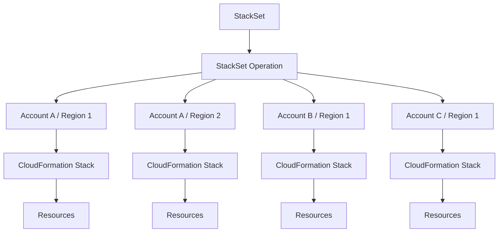
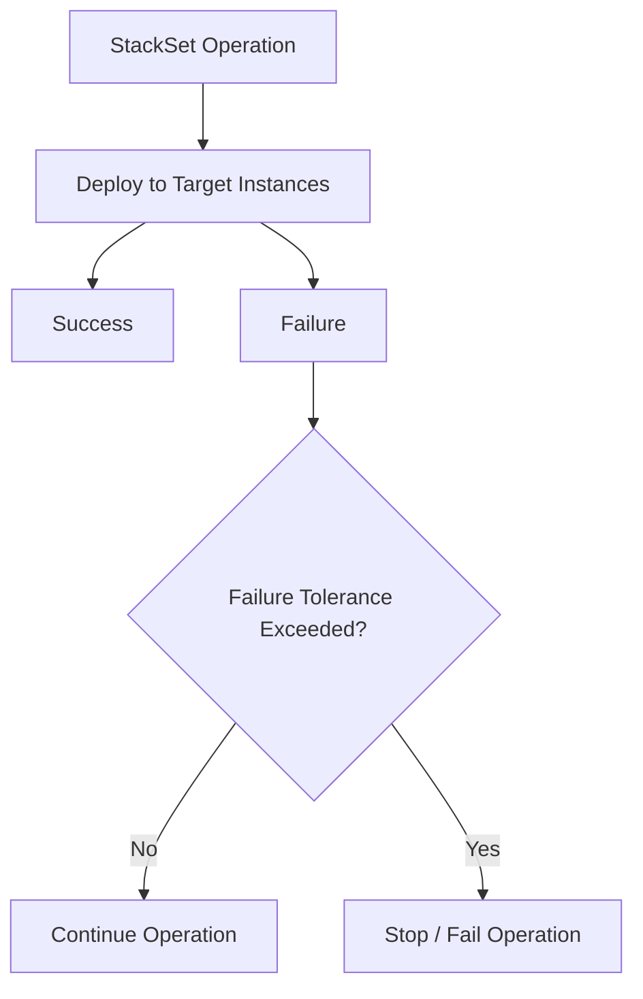

# 08- StackSet Operation Failures

## Overview

AWS CloudFormation StackSets extend CloudFormation so that a single template can be deployed across multiple AWS accounts and Regions. A StackSet operation is the execution unit used to create, update, delete, or detect drift across one or more StackSet instances.

A StackSet operation failure is more complex than a normal CloudFormation stack failure because the operation can succeed in some accounts or Regions while failing in others.

Typical failure scenarios include:

- Template or parameter errors.
- Invalid resource configuration.
- Missing IAM permissions.
- Service quotas.
- Region-specific resource limitations.
- Account-specific configuration differences.
- Dependency failures.
- Concurrent StackSet operations.
- Organizational or account-level restrictions.
- Resource provisioning failures.
- Network or service availability problems.

The key operational principle is:

> Treat a StackSet operation as a distributed infrastructure deployment, not as a single CloudFormation stack operation.

A production troubleshooting process should identify the **StackSet operation**, the **affected stack instance**, the **AWS account**, the **Region**, and the **underlying resource failure**.

## StackSet Operation Architecture

A StackSet operation can target many accounts and Regions:



The StackSet is the desired deployment definition.

The operation determines **what action to perform** and **where to perform it**.

The stack instances represent the actual deployments.

Therefore, an operation failure must be traced through multiple levels:

```text
StackSet
   |
   v
Operation
   |
   v
Stack Instance
   |
   v
CloudFormation Stack
   |
   v
Resource
   |
   v
AWS Service Error
```

## StackSet Operation States

StackSet operations have lifecycle states that indicate whether the operation is still running, succeeded, failed, or was stopped.

Common states include:

| Status | Meaning |
|---|---|
| `RUNNING` | Operation is currently executing |
| `SUCCEEDED` | Operation completed successfully |
| `FAILED` | Operation failed |
| `STOPPING` | Operation is being stopped |
| `STOPPED` | Operation was stopped |
| `QUEUED` | Operation is waiting to execute |

The exact status and available fields should always be inspected through the AWS CLI/API for the operation being investigated.

## Identify the Failed Operation

Start by listing recent operations:

```bash
aws cloudformation list-stack-set-operations \
  --stack-set-name platform-infrastructure \
  --region ap-south-1
```

For a cleaner result:

```bash
aws cloudformation list-stack-set-operations \
  --stack-set-name platform-infrastructure \
  --region ap-south-1 \
  --query 'Summaries[].{OperationId:OperationId,Status:Status,Action:Action,Start:CreationTimestamp,End:EndTimestamp}'
```

For a large number of operations, use pagination rather than assuming the first response contains the complete history.

## Inspect a Specific Operation

Once the operation ID is known:

```bash
aws cloudformation describe-stack-set-operation \
  --stack-set-name platform-infrastructure \
  --operation-id <operation-id> \
  --region ap-south-1
```

Useful fields include:

- `OperationId`
- `Action`
- `Status`
- `StatusReason`
- `CreationTimestamp`
- `EndTimestamp`
- `DeploymentTargets`
- `Regions`
- `FailureToleranceCount`
- `MaxConcurrentCount`
- `MaxConcurrentPercentage`
- `RegionConcurrencyType`

A compact diagnostic command:

```bash
aws cloudformation describe-stack-set-operation \
  --stack-set-name platform-infrastructure \
  --operation-id <operation-id> \
  --region ap-south-1 \
  --query 'StackSetOperation.{Status:Status,Action:Action,Reason:StatusReason,Started:CreationTimestamp,Ended:EndTimestamp}'
```

## The Most Important Troubleshooting Rule

A failed StackSet operation does **not** tell you the complete root cause.

The operation-level status tells you that something went wrong.

The affected stack instance usually provides the next level of detail.

Then the underlying CloudFormation stack events provide the resource-level failure.

Use this hierarchy:

```text
Operation Status
      |
      v
Failed Stack Instance
      |
      v
CloudFormation Stack Status
      |
      v
Stack Events
      |
      v
Failed Resource
      |
      v
AWS Service Error
```

Do not stop troubleshooting at:

```text
StackSet operation FAILED
```

Continue until you identify the actual failing resource and service error.

## Identify Failed Stack Instances

List StackSet instances:

```bash
aws cloudformation list-stack-instances \
  --stack-set-name platform-infrastructure \
  --region ap-south-1
```

Filter failed instances:

```bash
aws cloudformation list-stack-instances \
  --stack-set-name platform-infrastructure \
  --region ap-south-1 \
  --query 'Summaries[?Status!=`CURRENT`].{Account:Account,Region:Region,Status:Status,StackId:StackId,StatusReason:StatusReason}'
```

Depending on the operation and StackSet configuration, useful instance states can include:

- `CURRENT`
- `OUTDATED`
- `INOPERABLE`

The exact state must be interpreted together with the operation and deployment history.

## Identify the Account and Region

A critical StackSet troubleshooting mistake is investigating the correct template in the wrong account or Region.

Always record:

| Dimension | Example |
|---|---|
| StackSet | `platform-infrastructure` |
| Operation | `update-...` |
| Account | `123456789012` |
| Region | `ap-south-1` |
| Stack | `stack-id` |
| Logical resource | `ApplicationSecurityGroup` |
| Resource type | `AWS::EC2::SecurityGroup` |

Confirm the account:

```bash
aws sts get-caller-identity
```

Confirm the Region:

```bash
aws configure get region
```

Prefer explicitly specifying the Region in troubleshooting commands:

```bash
aws cloudformation describe-stacks \
  --stack-name <stack-name> \
  --region ap-south-1
```

## CloudFormation Stack Events

Once a failed stack instance has been identified, inspect its events.

```bash
aws cloudformation describe-stack-events \
  --stack-name <stack-name> \
  --region ap-south-1
```

Find failed resources:

```bash
aws cloudformation describe-stack-events \
  --stack-name <stack-name> \
  --region ap-south-1 \
  --query 'StackEvents[?contains(ResourceStatus, `FAILED`)].{Time:Timestamp,LogicalId:LogicalResourceId,Type:ResourceType,Status:ResourceStatus,Reason:ResourceStatusReason}'
```

The most valuable field is usually:

```text
ResourceStatusReason
```

For example:

```text
Resource handler returned message:
"Resource of type 'AWS::EC2::SecurityGroup' with identifier 'sg-...' already exists"
```

This is much more actionable than the StackSet operation's generic failure status.

## Common StackSet Failure Categories

| Failure | Typical root cause |
|---|---|
| Permission failure | Missing StackSet execution permissions |
| Resource failure | Underlying AWS resource could not be created or updated |
| Parameter failure | Invalid or account-specific parameter |
| Region failure | Resource/service unavailable or unsupported in Region |
| Quota failure | Account or regional service quota exceeded |
| Dependency failure | Required resource or service dependency unavailable |
| Existing resource | Resource already exists outside CloudFormation |
| Concurrent operation | Another StackSet operation is running |
| Organization restriction | Account/OU or organizational policy prevents deployment |
| Service failure | AWS service returned an error |
| Template failure | Invalid CloudFormation configuration |
| Failure tolerance exceeded | Too many target failures caused operation termination |

## IAM Permission Failures

Permissions are one of the most common causes of StackSet failures.

The exact permission model depends on whether the StackSet uses:

- Service-managed permissions.
- Self-managed permissions.

### Service-Managed StackSets

With service-managed StackSets, CloudFormation uses AWS Organizations integration and the relevant service-managed deployment roles.

Typical troubleshooting areas include:

- AWS Organizations configuration.
- Trusted access.
- Target account eligibility.
- Organizational unit targeting.
- Service control policies.
- Account-level restrictions.
- Region availability.

### Self-Managed StackSets

Self-managed StackSets use administrator and execution roles.

A simplified model is:

```text
Management Account
       |
       | StackSet operation
       v
CloudFormation
       |
       | AssumeRole
       v
Target Account
       |
       v
CloudFormation Execution Role
       |
       v
AWS Resource APIs
```

Verify the target account has the expected execution role:

```bash
aws iam get-role \
  --role-name AWSCloudFormationStackSetExecutionRole \
  --region ap-south-1
```

The role itself may exist while still lacking permissions required by the template.

For example, a template creating:

```yaml
Resources:
  ApplicationBucket:
    Type: AWS::S3::Bucket
```

requires permissions to create the relevant S3 resource.

A template creating IAM resources requires significantly more privileged permissions.

## Service Control Policy Failures

In AWS Organizations environments, an IAM role can have an `Allow` permission while an SCP denies the operation.

Conceptually:

```text
IAM Policy
    |
    | Allow
    v
Execution Role
    |
    v
SCP
    |
    | Explicit Deny
    v
AWS Service API
    |
    v
AccessDenied
```

An SCP can therefore cause a StackSet deployment to fail even when the CloudFormation execution role appears correctly configured.

When troubleshooting `AccessDenied`:

1. Identify the target account.
2. Identify the execution role.
3. Determine the API action CloudFormation attempted.
4. Inspect identity policies.
5. Inspect permission boundaries.
6. Inspect SCPs.
7. Inspect resource policies where applicable.
8. Check Region-specific restrictions.

## Region-Specific Failures

A StackSet operation can succeed in one Region and fail in another.

Example:

```text
StackSet Update
      |
      +---- us-east-1  -> SUCCEEDED
      |
      +---- eu-west-1  -> SUCCEEDED
      |
      +---- ap-south-1 -> FAILED
```

Possible causes include:

- Resource type availability.
- Regional service limitations.
- Region-specific quotas.
- Different AMI IDs.
- Different networking configuration.
- Different availability-zone assumptions.
- Region-specific IAM or service policies.
- Missing supporting infrastructure.

Never assume that a template that works in one Region will work identically everywhere.

## Account-Specific Failures

The same StackSet template can behave differently across accounts.

Example:

```text
Same Template
     |
     +---- Account A -> SUCCESS
     |
     +---- Account B -> SUCCESS
     |
     +---- Account C -> FAILED
```

Possible differences include:

- Existing resources.
- Different quotas.
- Different IAM policies.
- Different SCPs.
- Different VPCs.
- Different subnet layouts.
- Different service enablement.
- Different organizational controls.
- Account-specific parameters.

StackSets standardize deployment intent, but they do not eliminate environmental differences between accounts.

## Parameter Failures

A StackSet can use parameters that are different for each target account or Region.

For example:

```yaml
Parameters:
  VpcId:
    Type: AWS::EC2::VPC::Id

  SubnetId:
    Type: AWS::EC2::Subnet::Id
```

A value valid in one account may not exist in another.

Example:

```text
Account A
VpcId = vpc-aaa
     |
     v
VALID

Account B
VpcId = vpc-aaa
     |
     v
NOT FOUND
```

When troubleshooting parameter-related failures, verify the actual values used by the affected StackSet instance.

Do not assume that a parameter value is globally valid simply because the parameter name is identical.

## Existing Resource Conflicts

StackSet deployments can fail when the template expects CloudFormation to create a resource that already exists.

Examples:

- S3 bucket names.
- IAM role names.
- IAM policy names.
- CloudWatch log groups.
- Lambda function names.
- Security group names.
- Other globally or account-scoped identifiers.

Typical error:

```text
Resource already exists
```

The important question is:

> Does the existing resource belong to this CloudFormation stack?

If not, blindly deleting it may cause an outage.

Possible remediation strategies include:

- Import the resource where supported.
- Change the resource naming strategy.
- Reference the existing resource instead of creating it.
- Remove the manually created resource if it is obsolete.
- Update the StackSet template.

## Service Quota Failures

StackSet operations can expose service quotas across multiple accounts and Regions.

For example:

```text
Account A / Region 1 -> 10 resources -> SUCCESS
Account B / Region 1 -> quota exceeded -> FAILED
```

Inspect the underlying CloudFormation event for the actual quota error.

Common quota-related problems include:

- VPC limits.
- Security group rules.
- Elastic IP limits.
- Lambda concurrency.
- IAM object limits.
- CloudWatch log resources.
- Load balancer limits.
- Regional resource quotas.

Do not increase a quota blindly.

First determine:

1. Which quota was exceeded.
2. Whether the deployment design is unnecessarily consuming resources.
3. Whether the quota should be increased.
4. Whether the StackSet should be deployed differently.

## Failure Tolerance

StackSet operations can specify how many failures are tolerated during deployment.

For example:

```text
Target instances = 20
Failure tolerance = 2
```

If enough instances fail, the operation can stop progressing.

This matters because a single underlying resource problem can become an operation-level failure once the configured failure tolerance is exceeded.

Conceptually:



When troubleshooting, distinguish between:

- The first resource failure.
- Subsequent failures caused by the same systemic problem.
- The point at which failure tolerance was exceeded.

The first failure is often more useful than the final operation status.

## Concurrency Failures

StackSet operations support concurrency controls.

Relevant settings include:

- Maximum concurrent accounts.
- Maximum concurrent percentage.
- Region concurrency behavior.
- Failure tolerance.

A deployment configured for high concurrency can expose account-specific or service-level limits much faster.

For example:

```text
20 Accounts
   |
   +---- 20 concurrent deployments
   |
   v
Resource API pressure
   |
   v
Throttling / Quota Errors
```

Production deployments should balance deployment speed against the capacity and reliability of the target AWS services.

## Throttling

A large StackSet operation can generate significant API activity.

Symptoms can include:

```text
Throttling
Rate exceeded
Too many requests
ServiceUnavailable
```

The underlying AWS service may be throttling API requests rather than CloudFormation itself being fundamentally broken.

Recommended responses:

- Reduce concurrency.
- Retry failed operations where appropriate.
- Avoid repeatedly starting identical operations.
- Check service quotas.
- Investigate whether the deployment creates unnecessary API pressure.

Do not respond to throttling by immediately increasing concurrency.

## Operation Queuing

A StackSet can have multiple requested operations.

If another operation is already running, a new operation may remain queued or otherwise be prevented from executing immediately.

Check operations:

```bash
aws cloudformation list-stack-set-operations \
  --stack-set-name platform-infrastructure \
  --region ap-south-1 \
  --query 'Summaries[].{Id:OperationId,Action:Action,Status:Status,Created:CreationTimestamp}'
```

Before launching another emergency update, determine whether an existing operation is still active.

Repeatedly submitting new operations can make the situation harder to reason about.

## Stopping a Failed Operation

When an operation is still running and needs to be stopped:

```bash
aws cloudformation stop-stack-set-operation \
  --stack-set-name platform-infrastructure \
  --operation-id <operation-id> \
  --region ap-south-1
```

Use this carefully.

Stopping an operation does not mean all resources immediately return to the previous state. Some target stacks may already have completed their changes.

Therefore, after stopping an operation:

1. Inspect the operation status.
2. Identify affected stack instances.
3. Inspect stack statuses.
4. Inspect resource events.
5. Determine whether the deployment is partially applied.
6. Decide on the reconciliation strategy.

## Partial Deployment Failures

One of the defining characteristics of StackSets is partial execution.

Example:

```text
Target Accounts
-------------------------
Account A -> SUCCESS
Account B -> SUCCESS
Account C -> FAILED
Account D -> SUCCESS
Account E -> FAILED
```

The StackSet operation may therefore leave the environment in a partially updated state.

This is not equivalent to a transaction rollback across all accounts.

Treat StackSet operations as distributed infrastructure changes where different targets can reach different states.

## Update Failure Example

Suppose a StackSet updates an application IAM role across five accounts.

```text
StackSet
   |
   +---- Account A -> IAM update SUCCESS
   +---- Account B -> IAM update SUCCESS
   +---- Account C -> AccessDenied
   +---- Account D -> IAM update SUCCESS
   +---- Account E -> IAM update SUCCESS
```

Troubleshooting:

```bash
aws cloudformation list-stack-instances \
  --stack-set-name platform-infrastructure \
  --region ap-south-1
```

Identify Account C.

Then inspect the target stack:

```bash
aws cloudformation describe-stack-events \
  --stack-name <stack-id> \
  --region ap-south-1
```

Find:

```text
AccessDenied
```

Then investigate:

```text
IAM role
   |
   v
Permission policy
   |
   v
Permission boundary
   |
   v
SCP
   |
   v
Target AWS API
```

Fix the account-specific permission problem and then determine whether the StackSet operation should be retried or a new operation should be created.

## Delete Operation Failures

StackSet delete operations can fail when resources cannot be removed.

Typical causes include:

- Resource dependencies.
- Retain policies.
- Resource deletion protection.
- Resource already manually deleted.
- Service-level restrictions.
- IAM permissions.
- Resources containing data that cannot be safely deleted.

For the affected stack:

```bash
aws cloudformation describe-stack-events \
  --stack-name <stack-id> \
  --region ap-south-1
```

Look for:

```text
DELETE_FAILED
```

and inspect:

```text
ResourceStatusReason
```

Do not repeatedly retry deletion without understanding why the resource cannot be removed.

## Drift and StackSet Operation Failures

A StackSet operation can encounter resources that have already drifted from their expected configuration.

Example:

```text
StackSet Template
       |
       v
Expected Resource
       |
       v
Manual Change
       |
       v
Stack Instance is DRIFTED
       |
       v
StackSet Update
       |
       v
Potential Update Conflict
```

Before making a high-risk StackSet update, consider whether target stacks have significant drift.

Drift detection can help identify environmental divergence:

```bash
aws cloudformation detect-stack-drift \
  --stack-name <stack-name> \
  --region ap-south-1
```

Remember that StackSet drift and StackSet operation status are different concepts.

## Nested Stack Failures

A StackSet can deploy a stack that itself contains nested stacks.

The failure path may therefore be:

```text
StackSet
   |
   v
Target Stack
   |
   v
Nested Stack
   |
   v
Resource
   |
   v
AWS Service Error
```

When a StackSet operation reports failure, inspect the target stack events rather than assuming the root stack itself is the failing component.

## Organization-Level Failures

Service-managed StackSets can target organizational units.

A failure can therefore result from organizational configuration rather than the template.

Check:

- Target account membership.
- Organizational unit membership.
- AWS Organizations configuration.
- Service-managed StackSet prerequisites.
- Trusted access.
- SCPs.
- Account status.
- Region configuration.

Example:

```text
StackSet
   |
   v
Organizational Unit
   |
   +---- Account A -> SUCCESS
   +---- Account B -> SUCCESS
   +---- Account C -> SCP DENY
   +---- Account D -> SUCCESS
```

The StackSet template may be perfectly valid while one organizational target remains unable to execute it.

## Resource Region Availability

Some AWS resources or resource capabilities are Region-specific.

A StackSet targeting multiple Regions must therefore account for:

- Resource availability.
- Service feature availability.
- Region-specific quotas.
- Region-specific identifiers.
- AMI availability.
- Networking configuration.
- Service endpoints.

For example, an EC2 AMI ID is generally Region-specific:

```yaml
Parameters:
  AmiId:
    Type: AWS::EC2::Image::Id
```

A single hard-coded AMI ID should not normally be assumed to work across multiple Regions.

Use Region-aware configuration where necessary.

## Production Troubleshooting Workflow

Use the following sequence for a failed StackSet operation.

### Verify Identity and Region

```bash
aws sts get-caller-identity
```

```bash
aws configure get region
```

### Identify the StackSet

```bash
aws cloudformation describe-stack-set \
  --stack-set-name platform-infrastructure \
  --region ap-south-1
```

### List Operations

```bash
aws cloudformation list-stack-set-operations \
  --stack-set-name platform-infrastructure \
  --region ap-south-1
```

### Inspect the Failed Operation

```bash
aws cloudformation describe-stack-set-operation \
  --stack-set-name platform-infrastructure \
  --operation-id <operation-id> \
  --region ap-south-1
```

### Identify Affected Instances

```bash
aws cloudformation list-stack-instances \
  --stack-set-name platform-infrastructure \
  --region ap-south-1
```

Filter for problematic instances:

```bash
aws cloudformation list-stack-instances \
  --stack-set-name platform-infrastructure \
  --region ap-south-1 \
  --query 'Summaries[?Status!=`CURRENT`].{Account:Account,Region:Region,Status:Status,StackId:StackId,Reason:StatusReason}'
```

### Inspect Target Stack

```bash
aws cloudformation describe-stacks \
  --stack-name <stack-id> \
  --region <target-region>
```

### Inspect Stack Events

```bash
aws cloudformation describe-stack-events \
  --stack-name <stack-id> \
  --region <target-region>
```

### Find the First Meaningful Failure

```bash
aws cloudformation describe-stack-events \
  --stack-name <stack-id> \
  --region <target-region> \
  --query 'StackEvents[?contains(ResourceStatus, `FAILED`)].{Time:Timestamp,LogicalId:LogicalResourceId,Type:ResourceType,Status:ResourceStatus,Reason:ResourceStatusReason}'
```

### Inspect the Underlying AWS Service

Once the failing resource is known, switch from CloudFormation troubleshooting to the relevant AWS service.

For example:

```text
AWS::EC2::SecurityGroup
        |
        v
EC2 APIs / VPC configuration

AWS::Lambda::Function
        |
        v
Lambda APIs / IAM / package

AWS::RDS::DBInstance
        |
        v
RDS APIs / subnet / security / quotas

AWS::IAM::Role
        |
        v
IAM APIs / policies / SCPs
```

### Reconcile Before Retrying

Before retrying, determine whether:

- The template is wrong.
- The parameter is wrong.
- The target account is misconfigured.
- The Region is unsupported.
- A permission is missing.
- A quota is exhausted.
- A resource already exists.
- The resource has drifted.
- The operation itself needs to be stopped or replaced.

Do not repeatedly retry the same failing operation without changing the underlying condition.

## Retry Strategy

A retry is appropriate when the failure is transient or the underlying condition has been corrected.

Examples:

- Temporary AWS service issue.
- Throttling.
- Temporary dependency failure.
- Corrected IAM configuration.
- Corrected parameter.
- Corrected quota issue.

A retry is not useful when the same deterministic configuration error remains.

```text
Failure
  |
  v
Root Cause Identified
  |
  +---- Deterministic configuration error --> Fix first
  |
  +---- Transient infrastructure error ----> Retry
  |
  +---- Permission issue -------------------> Correct permissions
  |
  +---- Quota issue ------------------------> Resolve quota
```

## Operational Safety

Before retrying a failed StackSet update in production:

- Identify which accounts already succeeded.
- Identify which accounts failed.
- Determine whether resources were partially updated.
- Confirm the desired final state.
- Confirm the target accounts and Regions.
- Verify the template version.
- Verify parameter values.
- Review IAM/SCP changes.
- Check for drift where relevant.
- Determine whether a new operation is safer than continuing an existing one.

Avoid making emergency changes directly in multiple target accounts unless necessary.

Prefer correcting the source configuration and executing a controlled StackSet operation.

## Monitoring and Alerting

StackSet operations should be observable in production.

Useful monitoring signals include:

- Operation status.
- Operation duration.
- Number of failed instances.
- Failed accounts.
- Failed Regions.
- Stack status.
- Resource failure reason.
- Repeated operation failures.
- Drift status.

A useful alert should contain enough context to start investigation:

```text
StackSet: platform-infrastructure
Operation: <operation-id>
Action: UPDATE
Status: FAILED

Failed Accounts:
- 123456789012 / ap-south-1
- 210987654321 / eu-west-1

Primary Failure:
AWS::IAM::Role

Reason:
AccessDenied

Next Step:
Inspect target-account IAM policies and SCPs.
```

Avoid alerts that only say:

```text
StackSet deployment failed.
```

That requires the operator to rediscover the affected accounts and resources.

## Security Considerations

StackSet failures can expose security-control inconsistencies between AWS accounts.

Pay particular attention to failures involving:

- IAM roles.
- IAM policies.
- KMS keys.
- Security groups.
- S3 bucket policies.
- CloudTrail.
- GuardDuty.
- Config.
- VPC networking.
- Secrets Manager.
- SSM.

A StackSet that distributes security controls should be treated as a high-impact infrastructure deployment.

When troubleshooting:

1. Verify the target account.
2. Verify the assumed execution role.
3. Inspect policy evaluation.
4. Check SCPs.
5. Check permission boundaries.
6. Check resource policies.
7. Verify that the requested Region is permitted.
8. Audit unexpected changes.

Do not weaken security controls merely to make a StackSet operation succeed.

## Scalability Considerations

StackSets can deploy infrastructure across hundreds or thousands of accounts and Regions.

At that scale, operational problems become statistical rather than exceptional.

For example:

```text
1 Account
    |
    v
1 Environment

500 Accounts
    |
    v
Many different:
- Quotas
- SCPs
- Regions
- Existing resources
- IAM configurations
- Service states
```

Production StackSet designs should therefore minimize environmental assumptions.

Prefer:

- Parameterized templates.
- Region-aware configuration.
- Account-aware deployment data.
- Idempotent resource naming.
- Controlled concurrency.
- Appropriate failure tolerance.
- Automated validation.
- Centralized operation reporting.

## Reliability Considerations

A StackSet operation should not be treated as an atomic transaction across all target accounts.

A realistic state is:

```text
StackSet Operation
       |
       +---- Account A -> Updated
       +---- Account B -> Updated
       +---- Account C -> Failed
       +---- Account D -> Updated
       +---- Account E -> Failed
```

The recovery process should therefore be reconciliation-oriented.

Track:

- Desired StackSet version.
- Current StackSet version.
- Target accounts.
- Target Regions.
- Successful instances.
- Failed instances.
- Retry attempts.
- Final convergence state.

The objective is not simply:

```text
Operation = SUCCEEDED
```

The objective is:

```text
All required target instances
        |
        v
Converged to intended infrastructure state
```

## Common Mistakes

### Looking Only at the StackSet Operation

The operation status rarely contains the complete resource-level root cause.

**Avoid it by:** tracing the failure down to the affected stack and resource.

### Assuming All Accounts Failed

StackSet operations can partially succeed.

**Avoid it by:** inspecting individual stack instances.

### Retrying Without Fixing the Cause

A deterministic configuration error will usually fail again.

**Avoid it by:** identifying the underlying `ResourceStatusReason` first.

### Ignoring the Target Region

A resource may work in one Region and fail in another.

**Avoid it by:** always recording account and Region with the failure.

### Assuming IAM Is Correct Because the Role Exists

The role may exist while lacking required permissions.

**Avoid it by:** evaluating the complete IAM/SCP/permission-boundary chain.

### Ignoring SCPs

An SCP can deny an operation even when an identity policy allows it.

**Avoid it by:** checking AWS Organizations policies for target accounts.

### Using Global Resource Identifiers

Names such as S3 bucket names can create collisions across accounts or environments.

**Avoid it by:** designing deterministic, environment-aware naming.

### Hard-Coding Region-Specific Values

AMI IDs, subnet IDs, VPC IDs, and similar values are usually environment-specific.

**Avoid it by:** using parameters, mappings, SSM Parameter Store, or other appropriate configuration mechanisms.

### Increasing Concurrency to Fix Failures

Higher concurrency can amplify throttling and quota pressure.

**Avoid it by:** determining whether the problem is actually throughput-related.

### Treating StackSet Operations as Atomic

Successful deployment to some accounts does not imply successful deployment everywhere.

**Avoid it by:** designing for partial failure and eventual convergence.

### Ignoring Existing Resources

A resource with the same expected identifier may already exist outside CloudFormation.

**Avoid it by:** determining ownership before deleting, importing, or renaming resources.

### Ignoring Drift

An already-drifted target stack can complicate updates.

**Avoid it by:** detecting and reconciling significant drift before high-risk StackSet changes.

## Interview Traps

### Is a StackSet operation atomic across all accounts?

No. A StackSet operation can partially succeed and partially fail across accounts and Regions.

### Where should you look after a StackSet operation fails?

Start with the operation, identify failed stack instances, inspect the target CloudFormation stack, then inspect stack events and the underlying AWS resource.

### Why can the same StackSet template succeed in one account and fail in another?

Target accounts can differ in IAM policies, SCPs, quotas, existing resources, networking, service configuration, parameters, and other environmental characteristics.

### What is the difference between an operation failure and a resource failure?

An operation failure describes the StackSet deployment outcome. A resource failure identifies the specific CloudFormation resource that could not be created, updated, or deleted.

### Can a StackSet operation partially succeed?

Yes. Individual stack instances can reach different states during the same operation.

### Why is failure tolerance important?

It determines how much failure the operation can tolerate before the overall operation is stopped or considered unsuccessful.

### Why can increasing concurrency make a StackSet deployment worse?

Higher concurrency increases simultaneous infrastructure activity and can expose API throttling, service quotas, account limits, or other shared-resource constraints.

### Should you always retry a failed StackSet operation?

No. Retry only after determining whether the failure is transient or after correcting the deterministic underlying problem.

### Can an SCP cause StackSet deployment failure?

Yes. An SCP can impose an explicit deny even when the CloudFormation execution role has an identity-policy allow.

### What is the most useful field in a failed CloudFormation resource event?

`ResourceStatusReason` is often the most actionable field because it usually contains the underlying service or resource-provider error.

## Key Takeaways

- A StackSet operation is a distributed infrastructure deployment across accounts and Regions.
- Always troubleshoot from the operation level down to the individual resource.
- Use `list-stack-set-operations` to identify operations and `describe-stack-set-operation` to inspect a specific operation.
- Use `list-stack-instances` to identify exactly which accounts and Regions failed.
- Inspect the target CloudFormation stack and its stack events for the actual resource-level failure.
- `ResourceStatusReason` is often the most useful diagnostic field.
- StackSet operations can partially succeed; they are not atomic transactions across all targets.
- IAM roles, SCPs, permission boundaries, resource policies, and organizational controls can all affect deployment success.
- The same template can legitimately behave differently across accounts and Regions.
- Region-specific resources and configuration must be handled explicitly.
- Account-specific parameters must be validated against the target account and Region.
- Existing resources can cause deterministic creation failures.
- Service quotas and API throttling can become significant during high-concurrency deployments.
- Increasing concurrency is not automatically a solution to deployment failures.
- Failure tolerance controls how much target failure the operation can tolerate.
- Stopping an operation does not guarantee that previously updated target stacks are reverted.
- After a partial failure, inspect successful and failed instances separately.
- Retry only after determining whether the root cause is transient or has been corrected.
- Drift can complicate StackSet updates and should be considered during production troubleshooting.
- Production StackSet deployments should be designed for partial failure, observability, and eventual convergence.
- The goal is not merely a `SUCCEEDED` operation; the goal is for all required target accounts and Regions to converge to the intended infrastructure state.