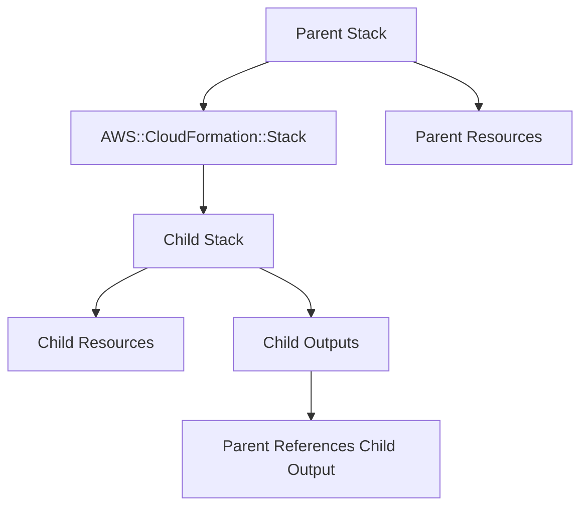
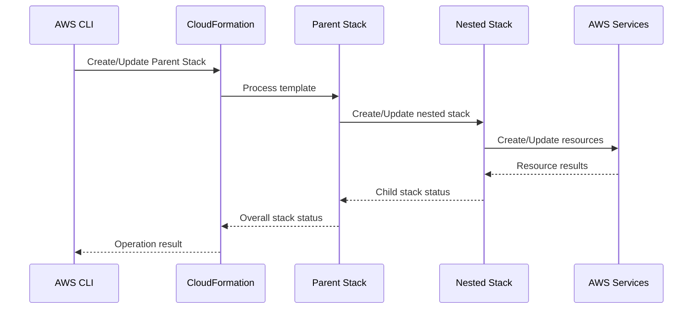

# 09- Nested Stack and Cross Stack Issues

## Overview

Nested stacks and cross-stack references are two common CloudFormation mechanisms for composing infrastructure. Both help split large infrastructure definitions into manageable units, but they introduce dependencies that can make deployments and troubleshooting more complex.

A **nested stack** is a CloudFormation stack created as a resource inside another CloudFormation stack. The parent stack controls the lifecycle of the child stack.

A **cross-stack reference** allows one CloudFormation stack to export a value and another stack in the same AWS account and Region to import that value using `Fn::ImportValue`.

The distinction is important:

| Mechanism | Relationship | Lifecycle | Typical use |
|---|---|---|---|
| Nested stack | Parent → Child | Parent controls child | Modular infrastructure |
| Cross-stack reference | Stack A ↔ Stack B dependency | Stacks are independently managed | Shared infrastructure values |
| StackSet | StackSet → Multiple target stacks | Centralized multi-account/Region deployment | Organization-wide infrastructure |

Most failures fall into one of these categories:

- Nested template cannot be retrieved.
- Nested stack fails during creation.
- Nested stack fails during update.
- Nested stack becomes stuck in a failure state.
- Parent and child parameters do not match.
- Parent cannot consume child outputs as expected.
- Cross-stack export does not exist.
- Export name is duplicated.
- Export is being modified while consumers still depend on it.
- Circular dependencies exist.
- Resources are deployed in the wrong Region or account.
- A dependency stack is deleted or changed unexpectedly.
- Cross-stack coupling prevents independent deployment.

The production troubleshooting principle is:

> Follow the dependency graph from the top-level stack to the exact failing resource, then determine whether the failure is caused by the nested stack itself, its template, its inputs, or an external stack dependency.

## Nested Stack Architecture

A nested stack is represented by `AWS::CloudFormation::Stack` in the parent template.



Example:

```yaml
Resources:
  NetworkStack:
    Type: AWS::CloudFormation::Stack
    Properties:
      TemplateURL: https://example-bucket.s3.amazonaws.com/network.yaml
      Parameters:
        EnvironmentName: production
```

The parent stack is responsible for the nested stack resource, while the nested stack manages its own resources.

## Why Nested Stacks Exist

Large CloudFormation templates can become difficult to maintain when networking, databases, compute, security, and application infrastructure are all defined in one file.

Nested stacks allow infrastructure to be decomposed into logical modules.

For example:

```text
Application Stack
│
├── Network Stack
│   ├── VPC
│   ├── Subnets
│   └── Route Tables
│
├── Security Stack
│   ├── Security Groups
│   └── IAM Policies
│
└── Application Stack
    ├── ECS Service
    ├── Load Balancer
    └── CloudWatch Logs
```

This improves organization while preserving a single parent-level lifecycle.

## Nested Stack Lifecycle

The lifecycle is hierarchical.



A failure in the child stack can therefore propagate upward:

```text
AWS Resource Failure
        |
        v
Nested Stack FAILED
        |
        v
Parent Stack FAILED
```

The parent failure message may be less specific than the child resource event.

## Cross-Stack References

Cross-stack references are implemented using CloudFormation exports and imports.

The producer stack exports a value:

```yaml
Outputs:
  VpcId:
    Description: VPC ID shared with application stacks
    Value: !Ref VPC
    Export:
      Name: !Sub "${AWS::StackName}-VpcId"
```

A consumer stack imports it:

```yaml
Parameters:
  ApplicationName:
    Type: String

Resources:
  ApplicationSecurityGroup:
    Type: AWS::EC2::SecurityGroup
    Properties:
      GroupDescription: Application security group
      VpcId:
        Fn::ImportValue:
          Fn::Sub: "${NetworkStackName}-VpcId"
```

The relationship becomes:

```text
Network Stack
     |
     | Export
     v
  VPC ID
     |
     | Import
     v
Application Stack
```

Cross-stack references are limited to stacks in the **same AWS account and Region**.

## Nested Stacks vs Cross-Stack References

The choice affects deployment coupling.

| Characteristic | Nested Stack | Cross-Stack Reference |
|---|---|---|
| Lifecycle | Parent controls child | Independent stacks |
| Coupling | Strong | Dependency-based |
| Deployment | Parent-driven | Separate |
| Outputs | Child outputs available to parent | Exports available to consumers |
| Account boundary | Same deployment context | Same account |
| Region boundary | Same Region | Same Region |
| Best for | Modular components | Shared infrastructure |
| Failure propagation | Child failure affects parent | Consumer/producer failures are separate |
| Independent deployment | Limited | Better |
| Dependency management | Hierarchical | Explicit import/export dependency |

## Troubleshooting Methodology

When a nested or cross-stack deployment fails, avoid starting with the parent stack's final error message.

Use this order:

```text
Top-Level Stack
      |
      v
Nested Stack / Dependency
      |
      v
Stack Event
      |
      v
Logical Resource
      |
      v
ResourceStatusReason
      |
      v
Underlying AWS Service
```

For cross-stack issues, additionally inspect:

```text
Producer Stack
      |
      v
Export
      |
      v
Consumer Stack
      |
      v
Fn::ImportValue
```

The objective is to identify the first meaningful failure rather than the final propagated failure.

## Inspect Parent Stack Events

Start with:

```bash
aws cloudformation describe-stack-events \
  --stack-name application-stack \
  --region ap-south-1
```

Find failed events:

```bash
aws cloudformation describe-stack-events \
  --stack-name application-stack \
  --region ap-south-1 \
  --query 'StackEvents[?contains(ResourceStatus, `FAILED`)].{Time:Timestamp,LogicalId:LogicalResourceId,Type:ResourceType,Status:ResourceStatus,Reason:ResourceStatusReason}'
```

If the failed resource is:

```text
NetworkStack
AWS::CloudFormation::Stack
```

do not stop there.

The parent only knows that the nested stack failed. Inspect the nested stack itself.

## Identify the Nested Stack

The parent event may contain the nested stack physical resource ID.

For example:

```text
arn:aws:cloudformation:ap-south-1:123456789012:stack/application-stack/...
```

Use the relevant nested stack identifier to inspect its events.

```bash
aws cloudformation describe-stack-events \
  --stack-name <nested-stack-name-or-id> \
  --region ap-south-1
```

Then identify the actual failed resource:

```bash
aws cloudformation describe-stack-events \
  --stack-name <nested-stack-name-or-id> \
  --region ap-south-1 \
  --query 'StackEvents[?contains(ResourceStatus, `FAILED`)].{LogicalId:LogicalResourceId,Type:ResourceType,Status:ResourceStatus,Reason:ResourceStatusReason}'
```

This is often where the real error becomes visible.

## Nested Template Retrieval Failures

A nested stack normally uses `TemplateURL` to reference a template stored in Amazon S3.

Example:

```yaml
Resources:
  NetworkStack:
    Type: AWS::CloudFormation::Stack
    Properties:
      TemplateURL: https://my-cfn-artifacts.s3.ap-south-1.amazonaws.com/network.yaml
```

Potential failures include:

- Incorrect S3 URL.
- Object does not exist.
- Incorrect bucket or key.
- CloudFormation cannot access the object.
- Incorrect Region or endpoint.
- Object was deleted.
- Deployment pipeline uploaded a different template.
- Template artifact was overwritten unexpectedly.

A common production mistake is treating the parent template as the only artifact that needs versioning.

Nested templates are deployment artifacts too.

Prefer immutable or version-controlled artifact strategies where practical.

## Template URL Validation

Check the object independently:

```bash
aws s3api head-object \
  --bucket my-cfn-artifacts \
  --key network.yaml \
  --region ap-south-1
```

If the object does not exist, CloudFormation cannot create the nested stack.

For versioned artifacts, inspect object versions:

```bash
aws s3api list-object-versions \
  --bucket my-cfn-artifacts \
  --prefix network.yaml \
  --region ap-south-1
```

Do not assume that a successful S3 upload means the CloudFormation deployment is using the expected artifact.

## Nested Stack Parameter Failures

Parameters passed from the parent must match the child template.

Parent:

```yaml
Resources:
  ApplicationStack:
    Type: AWS::CloudFormation::Stack
    Properties:
      TemplateURL: https://my-cfn-artifacts.s3.amazonaws.com/application.yaml
      Parameters:
        EnvironmentName: production
        VpcId: !GetAtt NetworkStack.Outputs.VpcId
```

Child:

```yaml
Parameters:
  EnvironmentName:
    Type: String

  VpcId:
    Type: AWS::EC2::VPC::Id
```

Potential problems include:

- Missing parameter.
- Incorrect parameter name.
- Invalid value.
- Wrong VPC ID.
- Wrong Region.
- Child template changed but parent was not updated.
- Output value has the wrong type or format.

When debugging, compare:

```text
Parent Parameters
        |
        v
Child Parameters
        |
        v
Child Resource Properties
```

## Nested Stack Outputs

Child stacks can expose outputs to their parent.

Child:

```yaml
Outputs:
  VpcId:
    Description: VPC identifier
    Value: !Ref VPC

  PublicSubnetId:
    Description: Public subnet identifier
    Value: !Ref PublicSubnet
```

Parent:

```yaml
Resources:
  NetworkStack:
    Type: AWS::CloudFormation::Stack
    Properties:
      TemplateURL: https://my-cfn-artifacts.s3.amazonaws.com/network.yaml

Outputs:
  NetworkVpcId:
    Value: !GetAtt NetworkStack.Outputs.VpcId
```

A common mistake is confusing:

```yaml
!Ref NetworkStack
```

with:

```yaml
!GetAtt NetworkStack.Outputs.VpcId
```

For an `AWS::CloudFormation::Stack` resource, `Ref` returns the nested stack's identifier, while child outputs are accessed through the `Outputs` attribute.

## Nested Stack Output Failures

If the parent expects:

```yaml
!GetAtt NetworkStack.Outputs.VpcId
```

but the child template does not define:

```yaml
Outputs:
  VpcId:
```

the parent cannot retrieve the expected value.

Verify the child template's outputs before debugging the consuming resource.

A useful diagnostic model is:

```text
Child Resource
      |
      v
Child Output
      |
      v
Nested Stack Output Attribute
      |
      v
Parent Resource
```

A failure anywhere in this chain can appear as a parent-level failure.

## Nested Stack Update Failures

Nested stack updates can fail when the parent changes how the child is configured.

Typical causes include:

- Changed child parameters.
- Changed `TemplateURL`.
- Removed child resources.
- Changed resource dependencies.
- Changed output names.
- Changed resource properties requiring replacement.
- Child template syntax or semantic errors.

Inspect both parent and child events.

```bash
aws cloudformation describe-stack-events \
  --stack-name application-stack \
  --region ap-south-1
```

Then:

```bash
aws cloudformation describe-stack-events \
  --stack-name <nested-stack-id> \
  --region ap-south-1
```

The child event usually contains the more specific failure.

## Nested Stack Rollback Failures

A child failure can cause the parent to enter rollback.

Example:

```text
Parent UPDATE
      |
      v
Nested Stack UPDATE
      |
      v
Resource UPDATE_FAILED
      |
      v
Nested Stack UPDATE_ROLLBACK_IN_PROGRESS
      |
      v
Parent UPDATE_ROLLBACK_IN_PROGRESS
```

If rollback itself fails, the environment can become difficult to recover.

Inspect the earliest failure rather than focusing only on:

```text
UPDATE_ROLLBACK_FAILED
```

The rollback failure may be a secondary symptom.

## UPDATE_ROLLBACK_FAILED

A stack in `UPDATE_ROLLBACK_FAILED` requires explicit recovery.

Inspect the events first:

```bash
aws cloudformation describe-stack-events \
  --stack-name application-stack \
  --region ap-south-1
```

Then determine which resources prevented rollback.

CloudFormation provides:

```bash
aws cloudformation continue-update-rollback \
  --stack-name application-stack \
  --region ap-south-1
```

If necessary, specific resources can be skipped:

```bash
aws cloudformation continue-update-rollback \
  --stack-name application-stack \
  --resources-to-skip LogicalResourceId1 LogicalResourceId2 \
  --region ap-south-1
```

Skipping resources is a recovery mechanism, not a normal deployment strategy.

After using it, the stack can become inconsistent with the template. Reconcile the skipped resources before treating the environment as healthy.

## Cross-Stack Export Failures

List exports in a Region:

```bash
aws cloudformation list-exports \
  --region ap-south-1
```

Filter a particular export:

```bash
aws cloudformation list-exports \
  --region ap-south-1 \
  --query 'Exports[?Name==`network-vpc-id`]'
```

If a consumer reports that an import cannot be resolved, verify:

1. The export exists.
2. The export name matches exactly.
3. The producer stack is in the same Region.
4. The consumer is in the same account.
5. The producer stack has successfully created the output.
6. The consumer is importing the correct name.

## Export Name Mismatch

Producer:

```yaml
Outputs:
  VpcId:
    Value: !Ref VPC
    Export:
      Name: platform-network-vpc
```

Consumer:

```yaml
VpcId:
  Fn::ImportValue: platform-network-vpc-id
```

These names are different:

```text
platform-network-vpc
platform-network-vpc-id
```

CloudFormation will not resolve them.

Export names should be treated as API contracts.

A useful naming strategy is:

```text
<system>-<environment>-<component>-<value>
```

For example:

```text
platform-production-network-vpc-id
platform-production-network-public-subnet-id
```

## Export Name Collisions

Export names must be unique within an AWS account and Region.

This can fail:

```yaml
Export:
  Name: network-vpc-id
```

if another stack already exports:

```text
network-vpc-id
```

Check existing exports:

```bash
aws cloudformation list-exports \
  --region ap-south-1 \
  --query 'Exports[].{Name:Name,Stack:ExportingStackId}'
```

Avoid generic export names in environments with multiple teams or applications.

## Cannot Modify Export

A particularly important CloudFormation behavior is that an exported value cannot simply be changed while another stack imports it.

Example:

```text
Network Stack
     |
     | Export: SharedVpcId
     v
Application Stack
     |
     | ImportValue: SharedVpcId
```

The producer cannot freely change or remove the export while the consumer depends on it.

This protects dependency integrity.

A common failure is attempting to:

- Rename an export.
- Delete an export.
- Change an exported value.
- Remove the output.

while consumers still import it.

## Find Export Consumers

The export listing can show the importing stack information where available through CloudFormation APIs.

```bash
aws cloudformation list-imports \
  --export-name platform-production-network-vpc-id \
  --region ap-south-1
```

This is an important command before modifying or deleting an export.

Typical workflow:

```bash
aws cloudformation list-imports \
  --export-name platform-production-network-vpc-id \
  --region ap-south-1
```

Then update or migrate consumers before changing the producer export.

## Safe Export Migration

Suppose an existing export is:

```text
platform-vpc-id
```

and you want:

```text
platform-network-vpc-id
```

Do not simply delete the old export.

A safer migration is:

```text
Existing Producer
      |
      +---- Old Export
      |
      +---- New Export

Existing Consumers
      |
      v
Migrate to New Export

Verify Consumers
      |
      v
Remove Old Export
```

This follows a compatibility-first migration model.

## Cross-Stack Circular Dependencies

CloudFormation dependency cycles can occur when stacks depend on each other.

Example:

```text
Stack A
  |
  v
Stack B
  |
  v
Stack A
```

For example:

```text
Network Stack
    |
    v
Application Stack
    |
    v
Network Stack
```

This creates a circular dependency that CloudFormation cannot resolve safely.

Avoid bidirectional cross-stack references.

Prefer:

```text
Shared Infrastructure
        |
        +----> Application A
        |
        +----> Application B
```

rather than:

```text
Stack A <----> Stack B
```

## Nested Stack Circular Dependencies

Nested stacks can also become structurally problematic when resource dependencies are designed incorrectly.

A child stack should not require a resource that can only be created after the child itself completes.

For example:

```text
Parent
  |
  v
Child
  |
  v
Resource
  |
  v
Parent Resource
  |
  v
Child
```

CloudFormation cannot resolve such a cycle.

When designing dependencies, keep the direction explicit:

```text
Foundation
    |
    v
Networking
    |
    v
Security
    |
    v
Application
```

## Cross-Stack References and Regions

Cross-stack references do not provide a general cross-Region mechanism.

This will not work as a normal `Fn::ImportValue` relationship between stacks in different Regions.

For cross-Region infrastructure sharing, consider alternatives such as:

- SSM Parameter Store.
- AWS RAM where applicable.
- Explicit deployment parameters.
- StackSet-driven configuration.
- Application-specific configuration management.

Choose the mechanism based on ownership, consistency, security, and lifecycle requirements.

## Cross-Stack References and Accounts

Cross-stack exports and imports are account-scoped and Region-scoped.

They should not be treated as a general mechanism for sharing infrastructure values across AWS accounts.

For multi-account architectures, consider:

- AWS RAM.
- StackSets.
- SSM Parameter Store with appropriate access patterns.
- Resource policies.
- Explicit pipeline parameters.
- Service-specific cross-account mechanisms.

The architecture should make ownership and dependency boundaries explicit.

## Dependency Stack Deletion Failures

Deleting a producer stack can fail or be blocked when consumers depend on its exports.

Example:

```text
Network Stack
    |
    | Export
    v
Application Stack
    |
    | ImportValue
    v
Network VPC ID
```

Before deleting the network stack:

```bash
aws cloudformation list-exports \
  --region ap-south-1
```

Then inspect consumers:

```bash
aws cloudformation list-imports \
  --export-name platform-production-network-vpc-id \
  --region ap-south-1
```

Migrate consumers before removing the producer dependency.

## Resource Ownership Problems

Nested and cross-stack architectures become difficult when ownership is unclear.

For every resource, determine:

| Question | Example |
|---|---|
| Which stack owns it? | Network stack |
| Who creates it? | CloudFormation |
| Who consumes it? | Application stack |
| Can it be replaced? | No |
| Is it exported? | Yes |
| Is it manually modified? | No |
| Is deletion safe? | Depends |

Avoid managing the same resource from multiple stacks.

A resource should have one clear CloudFormation owner.

## Nested Stack Template Versioning

Nested templates are external artifacts from the parent stack's perspective.

A deployment pipeline should make the template relationship deterministic.

Example:

```text
Build
  |
  v
Validate Parent Template
  |
  v
Upload Child Templates
  |
  v
Validate Child Templates
  |
  v
Deploy Parent
  |
  v
Parent references known child artifact
```

Avoid pipelines where:

```text
Parent template
      |
      v
"latest" child template
```

can change between deployments.

Prefer immutable artifact identifiers where practical.

## Template Validation

Validate CloudFormation templates before deployment.

For a template file:

```bash
aws cloudformation validate-template \
  --template-body file://network.yaml \
  --region ap-south-1
```

For a template stored in S3:

```bash
aws cloudformation validate-template \
  --template-url https://my-cfn-artifacts.s3.amazonaws.com/network.yaml \
  --region ap-south-1
```

Validation catches structural and syntax problems, but successful validation does not guarantee successful resource provisioning.

For example:

```text
Template Validation
        |
        v
Valid Syntax
        |
        v
Deployment
        |
        v
IAM / Quota / Resource / Dependency Failure
```

## Change Sets for Nested Infrastructure

Change sets help understand the proposed changes before executing an update.

For the parent stack:

```bash
aws cloudformation create-change-set \
  --stack-name application-stack \
  --change-set-name application-update \
  --template-body file://template.yaml \
  --change-set-type UPDATE \
  --region ap-south-1
```

Inspect:

```bash
aws cloudformation describe-change-set \
  --stack-name application-stack \
  --change-set-name application-update \
  --region ap-south-1
```

For nested stacks, carefully inspect whether the parent is changing the nested stack resource, its template URL, parameters, or outputs.

A change set may show a nested stack resource change without exposing every downstream resource change in the same way as inspecting the child stack directly.

## Production Diagnostic Workflow

Use the following workflow for nested and cross-stack failures.

### Identify the Top-Level Stack

```bash
aws cloudformation describe-stacks \
  --stack-name application-stack \
  --region ap-south-1
```

### Inspect Failed Events

```bash
aws cloudformation describe-stack-events \
  --stack-name application-stack \
  --region ap-south-1 \
  --query 'StackEvents[?contains(ResourceStatus, `FAILED`)].{LogicalId:LogicalResourceId,Type:ResourceType,Status:ResourceStatus,Reason:ResourceStatusReason}'
```

### Determine Whether the Failure Is Nested

If the failed resource type is:

```text
AWS::CloudFormation::Stack
```

inspect the child stack.

### Inspect the Child Stack

```bash
aws cloudformation describe-stack-events \
  --stack-name <nested-stack-id> \
  --region ap-south-1
```

### Inspect Cross-Stack Exports

```bash
aws cloudformation list-exports \
  --region ap-south-1
```

### Inspect Consumers

```bash
aws cloudformation list-imports \
  --export-name <export-name> \
  --region ap-south-1
```

### Validate Templates

```bash
aws cloudformation validate-template \
  --template-body file://template.yaml \
  --region ap-south-1
```

### Verify Environment

```bash
aws sts get-caller-identity
```

Confirm:

- Account.
- Region.
- IAM permissions.
- SCPs.
- S3 artifact availability.
- Parameter values.
- Resource ownership.
- Existing resources.
- Stack dependencies.

## Production Design Recommendations

### Keep Dependency Directional

Prefer:

```text
Foundation
    |
    v
Network
    |
    v
Security
    |
    v
Application
```

Avoid:

```text
Network <----> Application
```

### Minimize Cross-Stack Coupling

A stack with dozens of imports becomes difficult to evolve.

Prefer exposing stable infrastructure contracts such as:

```text
VpcId
PrivateSubnetIds
SecurityGroupId
KmsKeyArn
```

rather than exposing implementation details.

### Treat Exports as APIs

An export name is effectively a contract.

Changing it can break consumers.

Use stable naming conventions and migration procedures.

### Establish Clear Ownership

Do not have:

```text
Stack A -> creates resource
Stack B -> modifies same resource
```

Prefer:

```text
Stack A -> owns resource
Stack B -> consumes resource
```

### Keep Nested Stacks Modular

Good nested-stack boundaries generally represent infrastructure responsibilities:

```text
Network
Security
Database
Application
Observability
```

Avoid creating nested stacks merely to reduce file size.

### Version Deployment Artifacts

Child templates should be reproducible.

A production deployment should be able to answer:

```text
Which parent template?
Which child template?
Which artifact version?
Which parameters?
Which account?
Which Region?
```

### Validate Before Deployment

Use template validation, linting, change sets, and CI/CD checks before production execution.

## Common Mistakes

### Debugging Only the Parent Stack

The parent may only report:

```text
Nested stack failed
```

**Avoid it by:** inspecting the child stack events.

### Confusing `Ref` and `GetAtt`

For nested stacks:

```yaml
!Ref NetworkStack
```

is not equivalent to:

```yaml
!GetAtt NetworkStack.Outputs.VpcId
```

**Avoid it by:** explicitly using the appropriate child output attribute.

### Changing an Export While Consumers Exist

CloudFormation protects active import relationships.

**Avoid it by:** using `list-imports` before modifying or deleting an export.

### Using Duplicate Export Names

Export names must be unique within the account and Region.

**Avoid it by:** using deterministic, environment-aware names.

### Assuming Cross-Stack References Work Across Regions

They do not provide a general cross-Region import mechanism.

**Avoid it by:** using an appropriate cross-Region configuration mechanism.

### Assuming Cross-Stack References Work Across Accounts

Exports/imports are not a general cross-account dependency mechanism.

**Avoid it by:** using cross-account AWS services or explicit deployment/configuration mechanisms.

### Hard-Coding Nested Template URLs

A parent can accidentally reference an outdated or overwritten child template.

**Avoid it by:** using controlled, versioned deployment artifacts.

### Deleting a Producer Stack First

Consumers may still depend on its exports.

**Avoid it by:** identifying imports and migrating consumers before deleting the producer.

### Creating Circular Dependencies

Bidirectional stack dependencies cannot be resolved reliably.

**Avoid it by:** maintaining one-directional dependency graphs.

### Sharing Resource Ownership

Two stacks attempting to manage the same resource create operational ambiguity.

**Avoid it by:** assigning one authoritative CloudFormation owner per resource.

### Skipping Rollback Resources Without Reconciliation

`continue-update-rollback --resources-to-skip` can restore stack progress but can leave resources inconsistent with the template.

**Avoid it by:** treating skipped resources as technical debt requiring immediate reconciliation.

## Security Considerations

Nested and cross-stack architectures introduce additional security boundaries.

Review:

- S3 permissions for nested templates.
- CloudFormation execution roles.
- IAM policies.
- KMS permissions.
- S3 bucket policies.
- SCPs.
- Permission boundaries.
- Cross-account access.
- Resource policies.
- Secrets referenced by templates.

Nested template artifacts should not be publicly readable merely to simplify deployment.

Prefer tightly scoped access and controlled artifact buckets.

Do not expose sensitive values through CloudFormation Outputs simply because outputs are convenient for stack integration.

## Reliability Considerations

A reliable CloudFormation dependency architecture should:

- Have clear ownership.
- Minimize circular dependencies.
- Use stable interfaces.
- Avoid unnecessary cross-stack imports.
- Version nested templates.
- Validate child templates independently.
- Use change sets for high-risk updates.
- Monitor stack events.
- Test rollback behavior.
- Document dependency relationships.

A useful architecture principle is:

> Infrastructure modules should depend on stable contracts, not implementation details.

For example:

```text
Network Stack
    |
    | Stable contract
    +---- VpcId
    +---- PrivateSubnetIds
    +---- SecurityGroupId
    |
    v
Application Stack
```

rather than exposing internal resources that application stacks should not need to know about.

## Interview Traps

### What is the difference between a nested stack and a cross-stack reference?

A nested stack is a CloudFormation stack resource managed by a parent stack. A cross-stack reference connects independently managed stacks through exported and imported values.

### Can `Fn::ImportValue` import from another Region?

No. Standard CloudFormation exports/imports are scoped to the same AWS account and Region.

### Can two stacks export the same name?

No. Export names must be unique within an account and Region.

### Can you delete an export while another stack imports it?

Not normally. The dependency must be removed before the export can be deleted or changed in a way that violates the active import relationship.

### Where should you look when a nested stack fails?

Inspect the nested stack's events and identify the first meaningful resource failure.

### Does a nested stack have an independent lifecycle?

It has its own CloudFormation stack lifecycle, but its lifecycle is managed through the parent stack when it is deployed as a nested stack.

### Why are nested stacks useful?

They provide modularity while preserving a hierarchical CloudFormation deployment model.

### Why can cross-stack references become problematic?

They create deployment dependencies. A producer cannot freely change or remove exported contracts while consumers depend on them.

### What happens if a child stack output is missing?

A parent reference such as:

```yaml
!GetAtt NetworkStack.Outputs.VpcId
```

cannot resolve the expected output.

### Why should nested templates be versioned?

Because the parent template references an external child template artifact. Changing that artifact unexpectedly can change deployment behavior without an obvious change to the parent template.

### How do you troubleshoot `UPDATE_ROLLBACK_FAILED`?

Inspect stack events, identify the resource preventing rollback, correct the underlying issue, and use `continue-update-rollback` when appropriate. Skipped resources require subsequent reconciliation.

## Key Takeaways

- Nested stacks provide hierarchical modularity; cross-stack references provide dependencies between independently managed stacks.
- Troubleshoot nested failures by following the chain from the parent stack to the nested stack and finally to the failing resource.
- `AWS::CloudFormation::Stack` events often identify the child stack, not the ultimate root cause.
- Inspect nested stack events directly to find `ResourceStatusReason`.
- Nested templates referenced through `TemplateURL` are deployment artifacts and should be versioned and controlled.
- Parent parameters must match the child stack's parameter contract.
- Child outputs are accessed through `Fn::GetAtt` using the nested stack's `Outputs` attribute.
- Cross-stack exports and imports are scoped to the same AWS account and Region.
- Export names must be unique within an account and Region.
- Use `list-exports` to inspect producer exports and `list-imports` to identify consumers.
- Treat CloudFormation exports as stable APIs between infrastructure stacks.
- Do not change or remove an actively consumed export without first migrating its consumers.
- Avoid circular dependencies between stacks.
- Assign one authoritative CloudFormation owner to each resource.
- Avoid unnecessary cross-stack coupling because it makes independent deployment and refactoring harder.
- Use stable infrastructure contracts such as VPC IDs, subnet IDs, security group IDs, and KMS key ARNs rather than exposing unnecessary implementation details.
- Cross-Region and cross-account infrastructure sharing requires mechanisms other than standard `Fn::ImportValue`.
- Nested stack failures can propagate into parent rollback states such as `UPDATE_ROLLBACK_FAILED`.
- `continue-update-rollback` can recover a failed rollback, but skipped resources must later be reconciled.
- Template validation catches structural problems but cannot guarantee successful resource provisioning.
- Change sets are useful for evaluating parent-level infrastructure changes before execution.
- Production CloudFormation architectures should use clear ownership, directional dependencies, versioned artifacts, validation, observability, and controlled deployment procedures.