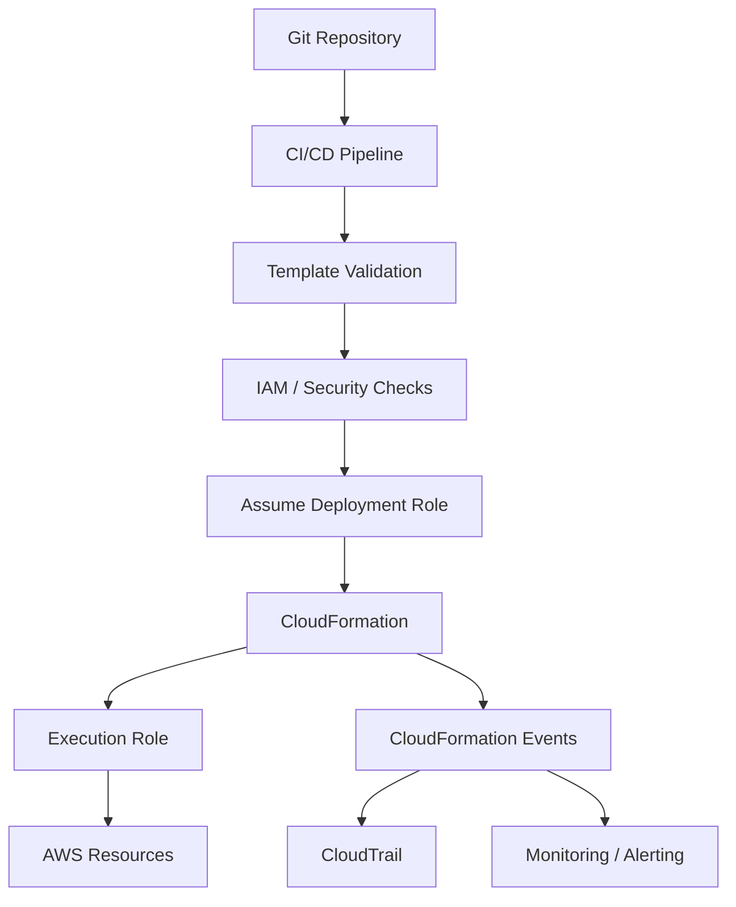
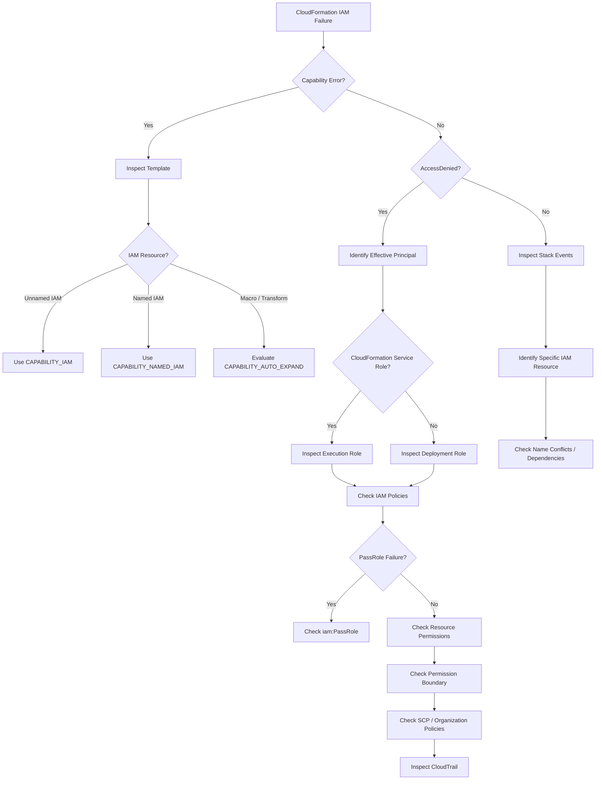

# 10- IAM and Capability Errors

## Overview

AWS CloudFormation deployments can fail even when a template is syntactically valid and the AWS resources themselves are correctly defined. A common class of failures involves **IAM permissions** and **CloudFormation capabilities**.

These failures occur at different authorization layers:

```text
CloudFormation CLI / API Request
            |
            v
Capabilities Accepted?
            |
            v
Caller Authorized?
            |
            v
CloudFormation Execution Role Authorized?
            |
            v
IAM Resource / PassRole / Service Authorization
            |
            v
AWS Resource Creation
```

The distinction matters because a deployment can fail before CloudFormation attempts to create any resource.

Typical errors include:

- `InsufficientCapabilities`
- `Requires capabilities : [CAPABILITY_IAM]`
- `Requires capabilities : [CAPABILITY_NAMED_IAM]`
- `AccessDenied`
- `User is not authorized to perform ...`
- `is not authorized to perform iam:PassRole`
- `API: iam:CreateRole User is not authorized`
- Explicit IAM resource name conflicts
- Service control policy denials
- Permission boundary restrictions
- CloudFormation execution-role permission failures

A production troubleshooting approach should first determine **which identity is being evaluated and which authorization layer rejected the operation**.

## CloudFormation Capabilities

CloudFormation capabilities are explicit acknowledgements that tell CloudFormation the deployment contains certain constructs that may have security or execution implications.

The most relevant capabilities are:

| Capability | Purpose |
|---|---|
| `CAPABILITY_IAM` | Acknowledges that the template may create or modify IAM resources |
| `CAPABILITY_NAMED_IAM` | Acknowledges IAM resources that have custom names |
| `CAPABILITY_AUTO_EXPAND` | Acknowledges templates using macros/transforms that require automatic expansion |

For IAM-related deployments, the important distinction is:

```text
IAM resource without explicit custom name
        |
        v
CAPABILITY_IAM

IAM resource with explicit custom name
        |
        v
CAPABILITY_NAMED_IAM
```

Capabilities are **not IAM permissions**.

Providing:

```text
--capabilities CAPABILITY_IAM
```

does not grant the caller permission to create IAM resources.

It only acknowledges the template's behavior.

## CAPABILITY_IAM

Use `CAPABILITY_IAM` when a template contains IAM resources that require acknowledgement.

Example:

```yaml
Resources:
  ApplicationRole:
    Type: AWS::IAM::Role
    Properties:
      AssumeRolePolicyDocument:
        Version: "2012-10-17"
        Statement:
          - Effect: Allow
            Principal:
              Service:
                - ecs-tasks.amazonaws.com
            Action:
              - sts:AssumeRole
```

A deployment without the required capability can fail with an error similar to:

```text
Requires capabilities : [CAPABILITY_IAM]
```

Deploy with:

```bash
aws cloudformation deploy \
  --template-file template.yaml \
  --stack-name application-stack \
  --capabilities CAPABILITY_IAM \
  --region ap-south-1
```

## CAPABILITY_NAMED_IAM

`CAPABILITY_NAMED_IAM` is required when the template contains IAM resources with custom names.

Example:

```yaml
Resources:
  ApplicationRole:
    Type: AWS::IAM::Role
    Properties:
      RoleName: production-application-role
      AssumeRolePolicyDocument:
        Version: "2012-10-17"
        Statement:
          - Effect: Allow
            Principal:
              Service:
                - ecs-tasks.amazonaws.com
            Action:
              - sts:AssumeRole
```

Deploy with:

```bash
aws cloudformation deploy \
  --template-file template.yaml \
  --stack-name application-stack \
  --capabilities CAPABILITY_NAMED_IAM \
  --region ap-south-1
```

When `CAPABILITY_NAMED_IAM` is specified, it also covers the acknowledgement represented by `CAPABILITY_IAM`.

For production templates, explicitly naming IAM resources should be deliberate because names become part of the resource's external identity and can complicate replacement and multi-environment deployments.

## CAPABILITY_AUTO_EXPAND

`CAPABILITY_AUTO_EXPAND` is relevant when a template uses macros or transforms that require CloudFormation to expand the template automatically.

Examples can include:

- Custom CloudFormation macros.
- Certain transform-based processing.
- `AWS::Include`.
- `AWS::Serverless` transformations in workflows where macro expansion is performed directly.

Example:

```yaml
Transform: AWS::Serverless-2016-10-31
```

The exact capability requirement depends on how the template is deployed and whether a change set is used.

When required, specify:

```bash
aws cloudformation create-stack \
  --stack-name application-stack \
  --template-body file://template.yaml \
  --capabilities CAPABILITY_AUTO_EXPAND \
  --region ap-south-1
```

For production deployments, change sets are often preferable because they provide an explicit review boundary before execution.

## Capabilities vs IAM Permissions

This is one of the most important CloudFormation distinctions.

| Mechanism | Answers |
|---|---|
| CloudFormation capability | "Does the deployment acknowledge this template behavior?" |
| IAM policy | "Is this identity allowed to perform the API operation?" |
| SCP | "Is this operation prohibited at the organization level?" |
| Permission boundary | "What is the maximum permission this principal can receive?" |
| Resource policy | "Does the target resource permit this access?" |
| CloudFormation service role | "What permissions does CloudFormation use to create resources?" |

Therefore:

```text
CAPABILITY_IAM
```

does not mean:

```text
iam:CreateRole = allowed
```

Both conditions may need to be satisfied.

## The Two IAM Identities to Understand

CloudFormation deployments commonly involve two different authorization identities.

### Deployment Caller

The person, CI/CD runner, or IAM role invoking CloudFormation.

For example:

```text
GitHub Actions
      |
      v
AWS IAM Role
      |
      v
cloudformation:CreateStack
```

This identity needs permission to invoke CloudFormation APIs.

### CloudFormation Execution Role

CloudFormation can assume an execution role and use that role when operating on resources.

```text
CI/CD Role
    |
    | cloudformation:CreateStack
    v
CloudFormation
    |
    | AssumeRole
    v
CloudFormation Execution Role
    |
    +----> IAM
    +----> EC2
    +----> S3
    +----> Lambda
    +----> ECS
```

These identities are not necessarily the same.

This distinction is critical when diagnosing `AccessDenied`.

## Identify the Current Caller

Start with:

```bash
aws sts get-caller-identity
```

Example output:

```json
{
  "UserId": "AROAXXXXXXXXXXXXX:deployment",
  "Account": "123456789012",
  "Arn": "arn:aws:sts::123456789012:assumed-role/DeploymentRole/deployment"
}
```

This tells you which identity is executing the AWS CLI command.

Verify the configured Region:

```bash
aws configure get region
```

Or explicitly inspect the environment:

```bash
aws sts get-caller-identity
aws configure get region
```

A surprisingly large number of IAM troubleshooting incidents are actually account or Region mistakes.

## `InsufficientCapabilities`

A typical failure looks like:

```text
An error occurred (InsufficientCapabilitiesException)
when calling the CreateStack operation:
Requires capabilities : [CAPABILITY_IAM]
```

This means CloudFormation detected a template requiring an explicit capability acknowledgement.

It does **not** necessarily mean that the caller lacks IAM permissions.

Use:

```bash
aws cloudformation create-stack \
  --stack-name application-stack \
  --template-body file://template.yaml \
  --capabilities CAPABILITY_IAM \
  --region ap-south-1
```

For named IAM resources:

```bash
aws cloudformation create-stack \
  --stack-name application-stack \
  --template-body file://template.yaml \
  --capabilities CAPABILITY_NAMED_IAM \
  --region ap-south-1
```

## `AccessDenied` During Stack Creation

An IAM capability acknowledgement does not bypass authorization.

For example:

```bash
aws cloudformation deploy \
  --template-file template.yaml \
  --stack-name application-stack \
  --capabilities CAPABILITY_IAM
```

can still fail with:

```text
User is not authorized to perform: iam:CreateRole
```

The correct reasoning is:

```text
Capability acknowledged
        |
        v
CloudFormation proceeds
        |
        v
IAM API request
        |
        v
IAM policy evaluation
        |
        v
AccessDenied
```

Investigate the identity performing the IAM operation rather than repeatedly adding capabilities.

## IAM Policy Requirements

An execution role creating IAM resources may require permissions such as:

```json
{
  "Version": "2012-10-17",
  "Statement": [
    {
      "Effect": "Allow",
      "Action": [
        "iam:CreateRole",
        "iam:DeleteRole",
        "iam:GetRole",
        "iam:PutRolePolicy",
        "iam:DeleteRolePolicy",
        "iam:AttachRolePolicy",
        "iam:DetachRolePolicy",
        "iam:PassRole"
      ],
      "Resource": "*"
    }
  ]
}
```

The exact permissions should be narrowed to the resources and operations required by the workload.

Do not use broad administrator permissions simply to make CloudFormation deployments succeed.

## `iam:PassRole`

`iam:PassRole` is a frequent CloudFormation deployment failure.

Suppose CloudFormation creates an ECS task definition that references:

```yaml
ExecutionRoleArn: !GetAtt TaskExecutionRole.Arn
```

CloudFormation may need permission to pass the role to the AWS service.

A failure can look like:

```text
is not authorized to perform: iam:PassRole
```

The important distinction is:

```text
iam:CreateRole
```

controls creation of the IAM role.

```text
iam:PassRole
```

controls whether an identity can pass an IAM role to an AWS service.

They are separate permissions.

## Restrict `iam:PassRole`

Avoid unrestricted:

```json
{
  "Effect": "Allow",
  "Action": "iam:PassRole",
  "Resource": "*"
}
```

when a narrower policy is possible.

Prefer a controlled role path or explicit role ARN:

```json
{
  "Effect": "Allow",
  "Action": "iam:PassRole",
  "Resource": "arn:aws:iam::123456789012:role/application/*"
}
```

Where supported and appropriate, additional conditions can restrict which service may receive the role.

For example:

```json
{
  "Effect": "Allow",
  "Action": "iam:PassRole",
  "Resource": "arn:aws:iam::123456789012:role/application/*",
  "Condition": {
    "StringEquals": {
      "iam:PassedToService": [
        "ecs-tasks.amazonaws.com"
      ]
    }
  }
}
```

The exact service principal should match the AWS service receiving the role.

## Explicit IAM Resource Names

Consider:

```yaml
RoleName: production-api-role
```

versus:

```yaml
Type: AWS::IAM::Role
```

without a custom `RoleName`.

Explicit names can be useful when:

- External systems require a stable name.
- Operational tooling expects a predictable identifier.
- Existing organizational conventions require it.

However, they introduce additional constraints.

| Approach | Benefit | Risk |
|---|---|---|
| CloudFormation-generated name | Easier replacement and environment isolation | Less predictable |
| Explicit name | Stable human-readable identity | Name collisions and replacement constraints |

For reusable templates, CloudFormation-generated names are often safer unless a stable name is an explicit requirement.

## IAM Role Name Collision

A stack may fail because a role with the desired name already exists.

Example:

```yaml
RoleName: production-api-role
```

If the role already exists outside the stack, CloudFormation cannot simply assume ownership of it.

Typical symptoms include:

```text
EntityAlreadyExists
```

or resource creation failures related to the IAM role.

Investigate:

```bash
aws iam get-role \
  --role-name production-api-role
```

Then determine:

- Who owns the existing role?
- Was it created manually?
- Is another CloudFormation stack managing it?
- Is it from another environment?
- Should it be imported?
- Should the new stack use a different name?

Do not delete an existing production IAM role merely to make a deployment pass.

## IAM Resource Policy Problems

IAM-related failures are not limited to role creation.

CloudFormation may create or modify:

- IAM roles.
- IAM policies.
- Managed policy attachments.
- Instance profiles.
- Service-linked resources.
- User policies.
- Group policies.

For example:

```yaml
Resources:
  ApplicationPolicy:
    Type: AWS::IAM::ManagedPolicy
    Properties:
      PolicyDocument:
        Version: "2012-10-17"
        Statement:
          - Effect: Allow
            Action:
              - s3:GetObject
            Resource:
              - arn:aws:s3:::application-artifacts/*
```

A syntactically valid policy can still fail deployment because the CloudFormation execution identity does not have permission to create or attach the policy.

## Permission Boundaries

A permission boundary can restrict an IAM principal even when its identity-based policy appears to allow the requested operation.

Conceptually:

```text
Identity Policy
      |
      | Allow
      v
Permission Boundary
      |
      | Maximum allowed permissions
      v
Effective Permission
```

For an IAM role:

```bash
aws iam get-role \
  --role-name production-api-role
```

Inspect the returned `PermissionsBoundary` field if present.

A deployment may therefore fail despite an apparently correct CloudFormation execution-role policy.

## Service Control Policies

In AWS Organizations, an SCP can deny an operation even when IAM policies allow it.

The authorization chain can look like:

```text
IAM Policy
   |
   | Allow
   v
Permission Boundary
   |
   v
SCP
   |
   | Explicit Deny
   v
AccessDenied
```

For example, an organization may prohibit:

```text
iam:CreateRole
```

or restrict IAM operations to approved paths.

When a deployment role appears correctly configured but CloudFormation still receives `AccessDenied`, investigate organizational controls.

Useful information to collect:

- AWS account.
- Organizational unit.
- Deployment role.
- SCPs.
- Permission boundaries.
- Session policies.
- Resource policies.

## Session Policies

Temporary credentials can also be constrained by session policies.

This is especially relevant for:

- CI/CD systems.
- Federated identities.
- AWS SSO-based sessions.
- Assumed roles.

The identity policy may allow an operation while the effective session permissions restrict it.

Treat the effective authorization context as the source of truth.

## CloudFormation Service Role

A CloudFormation service role changes which identity CloudFormation uses for resource operations.

Create a stack with a service role:

```bash
aws cloudformation create-stack \
  --stack-name application-stack \
  --template-body file://template.yaml \
  --role-arn arn:aws:iam::123456789012:role/CloudFormationExecutionRole \
  --capabilities CAPABILITY_NAMED_IAM \
  --region ap-south-1
```

The service role should have only the permissions required to manage the infrastructure represented by the stack.

A useful production model is:

```text
CI/CD Deployment Role
        |
        | CloudFormation API access
        v
CloudFormation
        |
        | Assume
        v
CloudFormation Execution Role
        |
        +---- IAM
        +---- VPC
        +---- ECS
        +---- S3
        +---- CloudWatch
```

This separates:

- Who can initiate deployments.
- What CloudFormation can actually create or modify.

## Service Role Troubleshooting

If a service role is configured, do not troubleshoot only the CI/CD role.

Check:

```bash
aws iam get-role \
  --role-name CloudFormationExecutionRole
```

Inspect:

- Trust policy.
- Attached policies.
- Inline policies.
- Permission boundary.
- Role path.
- Resource restrictions.

The trust policy must allow CloudFormation to assume the role.

Example:

```json
{
  "Version": "2012-10-17",
  "Statement": [
    {
      "Effect": "Allow",
      "Principal": {
        "Service": "cloudformation.amazonaws.com"
      },
      "Action": "sts:AssumeRole"
    }
  ]
}
```

## Trust Policy Failures

A CloudFormation execution role requires an appropriate trust relationship.

If CloudFormation cannot assume the role, deployment can fail before resource provisioning.

Inspect:

```bash
aws iam get-role \
  --role-name CloudFormationExecutionRole \
  --query 'Role.AssumeRolePolicyDocument'
```

A typical trusted principal is:

```json
"Principal": {
  "Service": "cloudformation.amazonaws.com"
}
```

Do not confuse:

```text
Trust Policy
```

with:

```text
Permissions Policy
```

The trust policy controls **who can assume the role**.

The permissions policy controls **what the role can do after it is assumed**.

## IAM Troubleshooting Matrix

| Error | Likely cause | First check |
|---|---|---|
| `InsufficientCapabilitiesException` | Required capability missing | `--capabilities` |
| `Requires capabilities: [CAPABILITY_IAM]` | IAM resources detected | Add `CAPABILITY_IAM` |
| `Requires capabilities: [CAPABILITY_NAMED_IAM]` | Named IAM resources detected | Add `CAPABILITY_NAMED_IAM` |
| `AccessDenied` | IAM/SCP/boundary restriction | Effective identity permissions |
| `iam:CreateRole` denied | Role creation not permitted | Execution-role policy |
| `iam:PassRole` denied | Role cannot be passed | `iam:PassRole` policy |
| `EntityAlreadyExists` | IAM name collision | `aws iam get-role` |
| Cannot assume role | Trust policy problem | Role trust relationship |
| Service role operation denied | Execution role lacks permission | CloudFormation service role |
| Works manually but not in CI/CD | Different identity | `aws sts get-caller-identity` |
| Works in one account but not another | Account-level policy difference | IAM/SCP/boundary |
| Works in one Region but not another | Region/resource/configuration difference | Region and resource state |

## Diagnose the Deployment Identity

Always capture:

```bash
aws sts get-caller-identity
```

Then inspect the CloudFormation stack:

```bash
aws cloudformation describe-stack \
  --stack-name application-stack \
  --region ap-south-1
```

Inspect events:

```bash
aws cloudformation describe-stack-events \
  --stack-name application-stack \
  --region ap-south-1 \
  --query 'StackEvents[?contains(ResourceStatus, `FAILED`)].{LogicalId:LogicalResourceId,Type:ResourceType,Status:ResourceStatus,Reason:ResourceStatusReason}'
```

Determine whether the stack uses a service role:

```bash
aws cloudformation describe-stacks \
  --stack-name application-stack \
  --region ap-south-1 \
  --query 'Stacks[0].RoleARN'
```

If a role ARN is returned, investigate that role as well.

## Diagnose IAM Resources

Identify IAM resources in a template:

```bash
grep -nE 'AWS::IAM::|RoleName:|UserName:|PolicyName:' template.yaml
```

For production CI/CD, use a template-aware linter or CloudFormation analysis tool rather than relying solely on text matching.

Inspect IAM role configuration:

```bash
aws iam get-role \
  --role-name CloudFormationExecutionRole
```

List attached managed policies:

```bash
aws iam list-attached-role-policies \
  --role-name CloudFormationExecutionRole
```

List inline policies:

```bash
aws iam list-role-policies \
  --role-name CloudFormationExecutionRole
```

## Verify Required IAM Permissions

For an IAM resource deployment, build the permission chain:

```text
Template
   |
   v
IAM Resource
   |
   v
CloudFormation
   |
   v
Execution Role
   |
   v
IAM API
   |
   v
IAM Policy Evaluation
   |
   +---- Identity Policy
   +---- Permission Boundary
   +---- SCP
   +---- Session Policy
   |
   v
Allow / Deny
```

Do not stop troubleshooting after finding one `Allow`.

An explicit deny in another authorization layer can still override it.

## Policy Simulation

The IAM policy simulator can help determine whether an identity is allowed to perform an operation.

For example:

```bash
aws iam simulate-principal-policy \
  --policy-source-arn arn:aws:iam::123456789012:role/CloudFormationExecutionRole \
  --action-names iam:CreateRole iam:PassRole
```

For production troubleshooting, use the simulator as supporting evidence rather than assuming it perfectly represents every runtime condition.

Resource-specific conditions, SCPs, resource policies, and service behavior may still need investigation.

## CloudTrail Investigation

CloudTrail is useful when CloudFormation reports an authorization failure but the exact API request is unclear.

The useful question is:

> Which principal attempted which AWS API operation, and why was it denied?

For IAM-related failures, investigate events around:

- `CreateRole`
- `PutRolePolicy`
- `AttachRolePolicy`
- `CreatePolicy`
- `PassRole`
- `DeleteRole`
- Service-specific API calls

Example lookup:

```bash
aws cloudtrail lookup-events \
  --lookup-attributes AttributeKey=EventName,AttributeValue=CreateRole \
  --region ap-south-1
```

CloudTrail can help correlate:

```text
CloudFormation Event
       |
       v
Resource Failure
       |
       v
AWS API Call
       |
       v
Principal
       |
       v
Authorization Failure
```

## Capability Errors in `create-stack`

Example:

```bash
aws cloudformation create-stack \
  --stack-name application-stack \
  --template-body file://template.yaml \
  --region ap-south-1
```

If the template requires IAM acknowledgement, the operation can fail.

Use:

```bash
aws cloudformation create-stack \
  --stack-name application-stack \
  --template-body file://template.yaml \
  --capabilities CAPABILITY_IAM \
  --region ap-south-1
```

For named IAM resources:

```bash
aws cloudformation create-stack \
  --stack-name application-stack \
  --template-body file://template.yaml \
  --capabilities CAPABILITY_NAMED_IAM \
  --region ap-south-1
```

Multiple capabilities can be specified:

```bash
aws cloudformation create-stack \
  --stack-name application-stack \
  --template-body file://template.yaml \
  --capabilities CAPABILITY_NAMED_IAM CAPABILITY_AUTO_EXPAND \
  --region ap-south-1
```

Only specify capabilities actually required by the template and deployment mode.

## Capability Errors in `update-stack`

The same capability acknowledgement can be required during updates.

```bash
aws cloudformation update-stack \
  --stack-name application-stack \
  --template-body file://template.yaml \
  --capabilities CAPABILITY_NAMED_IAM \
  --region ap-south-1
```

A common CI/CD mistake is supplying capabilities during initial stack creation but forgetting them during updates.

Ensure the deployment pipeline consistently supplies the required capabilities.

## Capability Errors in `deploy`

`aws cloudformation deploy` commonly simplifies the deployment workflow.

Example:

```bash
aws cloudformation deploy \
  --template-file template.yaml \
  --stack-name application-stack \
  --capabilities CAPABILITY_NAMED_IAM \
  --region ap-south-1
```

A production pipeline should define capabilities explicitly rather than depending on interactive behavior.

Example CI/CD configuration:

```bash
aws cloudformation deploy \
  --template-file infrastructure/template.yaml \
  --stack-name backend-production \
  --capabilities CAPABILITY_NAMED_IAM \
  --no-fail-on-empty-changeset \
  --region ap-south-1
```

The exact capability should match the template.

## Capability Errors in CI/CD

A deployment may work locally but fail in CI/CD.

Example:

```text
Developer Laptop
      |
      v
AWS CLI
      |
      v
Administrator-like identity
      |
      v
SUCCESS
```

while:

```text
CI/CD Runner
      |
      v
Deployment Role
      |
      v
CloudFormation
      |
      v
AccessDenied
```

This is expected when the identities differ.

Always compare:

```bash
aws sts get-caller-identity
```

between the local and CI/CD environments.

Do not solve this by giving the CI/CD role administrator access.

## Least-Privilege CloudFormation Design

A production deployment architecture should separate deployment authority from resource authority.

For example:

```text
Developer
   |
   v
CI/CD
   |
   v
Deployment Role
   |
   | cloudformation:CreateStack
   | cloudformation:UpdateStack
   | cloudformation:Describe*
   v
CloudFormation
   |
   v
Execution Role
   |
   +---- Required IAM APIs
   +---- Required ECS APIs
   +---- Required S3 APIs
   +---- Required CloudWatch APIs
```

The execution role should not automatically receive:

```text
Action: "*"
Resource: "*"
```

unless there is a specific, reviewed requirement.

## Security Considerations

IAM-related CloudFormation failures often expose weaknesses in deployment architecture.

Apply these principles:

- Use dedicated deployment roles.
- Use dedicated CloudFormation execution roles where appropriate.
- Apply least privilege.
- Restrict `iam:PassRole`.
- Avoid wildcard IAM resources when practical.
- Use permission boundaries where organizational policy requires them.
- Account for SCP restrictions.
- Avoid embedding long-lived AWS credentials in CI/CD.
- Use short-lived role credentials.
- Protect CloudFormation templates containing sensitive configuration.
- Do not expose secrets through CloudFormation Outputs.
- Review IAM policy changes through code review and CI/CD controls.

Capability flags should never be treated as a security control.

They are acknowledgements, not authorization mechanisms.

## Production Deployment Pattern

A controlled CloudFormation deployment can follow this model:



Recommended controls include:

- Template validation.
- IAM policy review.
- Capability validation.
- Change sets for high-risk changes.
- Dedicated deployment roles.
- Least-privilege execution roles.
- CloudTrail auditing.
- Stack event monitoring.
- Rollback procedures.

## Common Mistakes

### Treating Capabilities as Permissions

Adding:

```bash
--capabilities CAPABILITY_IAM
```

does not grant:

```text
iam:CreateRole
```

**Avoid it by:** separately validating capabilities and IAM permissions.

### Always Using `CAPABILITY_NAMED_IAM`

Adding the most permissive capability acknowledgement everywhere can hide the actual template requirement.

**Avoid it by:** determining whether the template actually defines named IAM resources.

### Forgetting Capabilities During Updates

A stack may be created successfully but fail during an update because the updated template introduces IAM resources.

**Avoid it by:** defining capabilities consistently in CI/CD.

### Giving Administrator Access

Adding:

```text
AdministratorAccess
```

may make the deployment succeed but creates unnecessary security exposure.

**Avoid it by:** identifying the exact denied action and granting the minimum required permission.

### Ignoring `iam:PassRole`

A deployment can have `iam:CreateRole` and still fail.

**Avoid it by:** checking whether the workflow passes IAM roles to AWS services.

### Checking Only the CI/CD Role

CloudFormation may use a separate execution role.

**Avoid it by:** checking `RoleARN` and inspecting the CloudFormation service role.

### Ignoring Permission Boundaries

An identity policy may contain the required `Allow`, but a permission boundary can still restrict the effective permissions.

**Avoid it by:** inspecting the boundary attached to the role.

### Ignoring SCPs

Organization-level policies can deny operations regardless of identity policy permissions.

**Avoid it by:** checking organizational restrictions when account-level IAM configuration appears correct.

### Confusing Trust and Permissions Policies

A role may have correct permissions but an incorrect trust relationship.

**Avoid it by:** checking both:

```text
AssumeRolePolicyDocument
```

and:

```text
Permissions Policies
```

### Using Explicit IAM Names Without Planning

Hard-coded role names can create collisions and replacement problems.

**Avoid it by:** using generated names unless stable naming is a deliberate requirement.

### Debugging the Wrong AWS Account

A role can exist in one account but not another.

**Avoid it by:** always checking:

```bash
aws sts get-caller-identity
```

### Using Wildcard `iam:PassRole`

Unrestricted role passing can allow privilege escalation.

**Avoid it by:** restricting the resource ARN and, where appropriate, the destination service.

## Troubleshooting Decision Tree



## Production Troubleshooting Workflow

Use this sequence when an IAM or capability error occurs.

### Identify the AWS Identity

```bash
aws sts get-caller-identity
```

### Verify the Target Region

```bash
aws configure get region
```

Or explicitly specify it in every command:

```bash
--region ap-south-1
```

### Inspect the Stack

```bash
aws cloudformation describe-stack \
  --stack-name application-stack \
  --region ap-south-1
```

### Check the CloudFormation Execution Role

```bash
aws cloudformation describe-stacks \
  --stack-name application-stack \
  --region ap-south-1 \
  --query 'Stacks[0].RoleARN'
```

### Inspect Failed Events

```bash
aws cloudformation describe-stack-events \
  --stack-name application-stack \
  --region ap-south-1 \
  --query 'StackEvents[?contains(ResourceStatus, `FAILED`)].{LogicalId:LogicalResourceId,Type:ResourceType,Status:ResourceStatus,Reason:ResourceStatusReason}'
```

### Inspect the Role

```bash
aws iam get-role \
  --role-name CloudFormationExecutionRole
```

### Inspect Attached Policies

```bash
aws iam list-attached-role-policies \
  --role-name CloudFormationExecutionRole
```

### Inspect Inline Policies

```bash
aws iam list-role-policies \
  --role-name CloudFormationExecutionRole
```

### Check Role Passing

Search the policies for:

```text
iam:PassRole
```

and verify that the relevant role ARN is covered.

### Check Organizational Restrictions

If the role policy appears correct, investigate:

- Permission boundaries.
- SCPs.
- Session policies.
- Resource policies.
- Organization-level restrictions.

### Check CloudTrail

Correlate the CloudFormation failure with the underlying AWS API call.

## Interview Traps

### Is `CAPABILITY_IAM` an IAM permission?

No. It is an acknowledgement supplied to CloudFormation.

### Does `CAPABILITY_IAM` allow CloudFormation to create roles?

No. The CloudFormation execution identity still requires appropriate IAM permissions.

### What is the difference between `CAPABILITY_IAM` and `CAPABILITY_NAMED_IAM`?

`CAPABILITY_IAM` acknowledges IAM resource creation or modification. `CAPABILITY_NAMED_IAM` is required when IAM resources use custom names and also covers the IAM capability acknowledgement.

### What does `iam:PassRole` do?

It controls whether an identity can pass an IAM role to an AWS service. It is different from permission to create or modify the role itself.

### Why can CloudFormation fail even when the deployment role has the required permission?

CloudFormation may use a separate execution role. Permission boundaries, SCPs, session policies, or other authorization controls can also affect the effective permission.

### What should you check first for `AccessDenied`?

Identify the actual AWS principal involved, inspect the stack's execution role if one exists, then identify the exact denied API action.

### What is the difference between a role trust policy and a permissions policy?

The trust policy controls who can assume the role. The permissions policy controls what the role can do after assumption.

### Why is `iam:PassRole` security-sensitive?

An overly broad `iam:PassRole` permission can allow a principal to pass a highly privileged role to an AWS service, potentially resulting in privilege escalation.

### Why might an IAM resource fail even with the correct capability?

Capabilities acknowledge the template. They do not bypass IAM authorization, SCPs, permission boundaries, resource policies, or service-specific restrictions.

### Why can an explicit `RoleName` cause deployment problems?

The name can already exist, collide across environments, or prevent CloudFormation from replacing the resource cleanly.

### Why does a deployment work locally but fail in CI/CD?

The local user and CI/CD runner commonly use different AWS identities, roles, policies, accounts, or organizational restrictions.

## Key Takeaways

- CloudFormation capabilities and IAM permissions are separate mechanisms.
- `CAPABILITY_IAM` acknowledges IAM resource creation or modification.
- `CAPABILITY_NAMED_IAM` is required for IAM resources with custom names and also covers the IAM capability acknowledgement.
- `CAPABILITY_AUTO_EXPAND` is relevant to deployments involving applicable macros and transforms.
- Capability flags do not grant permissions.
- `AccessDenied` requires investigation of the effective authorization context.
- Always identify the current AWS identity with `aws sts get-caller-identity`.
- CloudFormation may use a dedicated execution role that is different from the role invoking the CloudFormation API.
- Inspect the stack's `RoleARN` when diagnosing authorization failures.
- `iam:CreateRole` and `iam:PassRole` are separate permissions.
- `iam:PassRole` should be restricted to the minimum required role ARNs and, where appropriate, destination services.
- A correct identity policy does not guarantee access when permission boundaries, SCPs, session policies, or explicit denies are involved.
- A CloudFormation execution role needs an appropriate trust policy allowing CloudFormation to assume it.
- Trust policies determine who can assume a role; permissions policies determine what the role can do.
- Explicit IAM names can introduce collisions and replacement constraints.
- Use CloudTrail to correlate CloudFormation failures with underlying AWS API calls.
- Avoid granting administrator access merely to resolve CloudFormation deployment failures.
- Production deployments should use dedicated deployment and execution roles with least privilege.
- Capability requirements should be explicitly configured in CI/CD pipelines.
- IAM failures should be diagnosed through the complete authorization chain rather than by repeatedly changing the template.