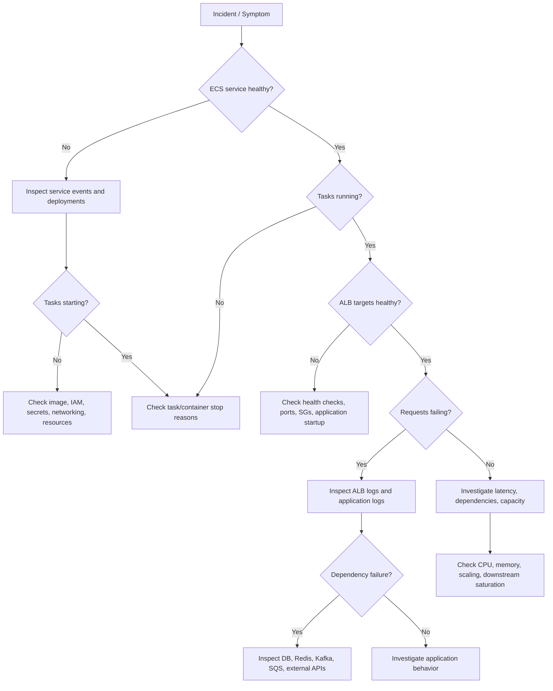

# 01- Troubleshooting Methodology

## Overview

Troubleshooting Amazon ECS in production should be treated as a structured investigation rather than a sequence of random configuration changes.

An ECS workload can fail at multiple layers:

```text
Client
  |
  v
DNS
  |
  v
Load Balancer
  |
  v
Target Group
  |
  v
ECS Service
  |
  v
ECS Task
  |
  +---- Container
  |
  +---- Network
  |
  +---- IAM
  |
  +---- Secrets
  |
  +---- Application
  |
  +---- Dependency
       |
       +---- RDS
       +---- Redis
       +---- SQS
       +---- Kafka
       +---- External API
```

The most important troubleshooting principle is:

> Identify the failing layer before changing anything.

A strong ECS troubleshooting process should establish:

- What is failing?
- When did it start?
- Is the failure isolated or widespread?
- Which ECS service, task, container, or dependency is affected?
- What changed immediately before the failure?
- Is the problem related to deployment, networking, IAM, resources, application behavior, or an external dependency?
- Can the failure be reproduced?
- What evidence proves the root cause?

## Troubleshooting Mindset

Avoid immediately restarting tasks, increasing CPU, changing security groups, or redeploying.

Those actions may temporarily hide symptoms without identifying the underlying problem.

Use an evidence-driven process:

```text
Symptom
   |
   v
Define the Failure
   |
   v
Identify the Layer
   |
   v
Collect Evidence
   |
   v
Form Hypothesis
   |
   v
Test Hypothesis
   |
   v
Confirm Root Cause
   |
   v
Apply Minimal Fix
   |
   v
Verify Recovery
   |
   v
Prevent Recurrence
```

The goal is not simply:

> "The service is working again."

The goal is:

> "The service is working again, and we understand why it failed and how to prevent the same failure."

## Define the Failure Precisely

Start by converting a vague report into a specific technical symptom.

Instead of:

```text
ECS is down.
```

establish:

```text
orders-api in production is returning HTTP 503 responses
from the ALB for approximately 30% of requests.
The issue started at 14:07 UTC immediately after deployment
revision 42.
```

Useful dimensions include:

| Dimension | Question |
|---|---|
| Service | Which ECS service is affected? |
| Cluster | Which ECS cluster? |
| Region | Which AWS region? |
| Environment | Production, staging, development? |
| Time | When did the issue begin? |
| Scope | One task, one AZ, or entire service? |
| Symptom | 4xx, 5xx, timeout, crash, latency? |
| Change | What changed immediately beforehand? |
| Dependency | Are downstream systems healthy? |

This prevents troubleshooting from becoming guesswork.

## Establish the Blast Radius

Before changing anything, determine how widely the problem is occurring.

For example:

```text
Production
   |
   +-- ALB
   |
   +-- ECS Service
          |
          +-- Task A -> Healthy
          +-- Task B -> Healthy
          +-- Task C -> Failing
          +-- Task D -> Healthy
```

This is very different from:

```text
Production
   |
   +-- ECS Service
          |
          +-- Task A -> Failing
          +-- Task B -> Failing
          +-- Task C -> Failing
          +-- Task D -> Failing
```

A single failing task often indicates:

- Task-specific configuration
- Container startup failure
- Resource exhaustion
- Node/runtime issue in some ECS configurations
- Network interface issue
- Application-specific state

An entire service failing suggests a broader issue such as:

- Bad deployment
- Incorrect task definition
- IAM failure
- Secret retrieval failure
- Security group change
- Load balancer configuration
- Dependency outage
- Region/AWS service issue

## First-Level Triage

A practical first pass is:

```text
1. Is the ECS service running?
2. Are desired and running task counts correct?
3. Are tasks starting successfully?
4. Are containers healthy?
5. Are targets healthy?
6. Is traffic reaching the ALB?
7. Are requests reaching the application?
8. Is the application returning errors?
9. Are dependencies reachable?
10. Did anything change recently?
```

These questions quickly narrow the search space.

## ECS Service State

Start with the service itself.

```bash
aws ecs describe-services \
  --cluster production \
  --services orders-api \
  --region ap-south-1
```

Important fields include:

- `desiredCount`
- `runningCount`
- `pendingCount`
- `deployments`
- `events`
- `taskDefinition`
- `healthCheckGracePeriodSeconds`

A basic comparison:

```text
desiredCount = 4
runningCount = 4
pendingCount = 0
```

indicates that ECS currently has the requested number of running tasks.

But this does **not** prove that the application is healthy.

You can have:

```text
ECS runningCount = 4
ALB healthy targets = 0
```

The containers are running, but the application is unavailable.

## ECS Service Events

Service events are often one of the highest-value troubleshooting sources.

Look for messages indicating:

- Tasks repeatedly stopped
- Tasks failed to start
- Insufficient resources
- Health check failures
- Target registration failures
- Deployment failures
- Placement failures
- IAM or permissions problems

The service event timeline can reveal whether the problem started during deployment or independently.

## Task State

After checking the service, inspect individual tasks.

```bash
aws ecs list-tasks \
  --cluster production \
  --service-name orders-api \
  --region ap-south-1
```

Then inspect a task:

```bash
aws ecs describe-tasks \
  --cluster production \
  --tasks <task-arn> \
  --region ap-south-1
```

Important fields include:

- Task status
- Desired status
- Last status
- Stop code
- Stopped reason
- Container exit code
- Container reason
- Health status
- Network interfaces
- Task definition revision

## Task Lifecycle

A useful mental model is:

```text
PROVISIONING
     |
     v
PENDING
     |
     v
RUNNING
     |
     v
STOPPED
```

A task can fail before the application starts.

For example:

```text
Task
 |
 +-- Image Pull
 |
 +-- Secret Retrieval
 |
 +-- Network Setup
 |
 +-- Container Start
 |
 +-- Health Check
 |
 v
RUNNING
```

Failure at any stage can prevent the application from becoming healthy.

## Container Exit Codes

Container exit codes provide evidence about application termination.

Examples include:

| Exit Code | Typical Meaning |
|---|---|
| `0` | Process exited successfully |
| `1` | Generic application error |
| `137` | Process commonly terminated with SIGKILL; often associated with memory pressure |
| `143` | Process received SIGTERM |
| Other codes | Application/runtime-specific behavior |

Do not assume an exit code alone identifies the root cause.

For example, exit code `137` is a clue, not proof. Confirm memory metrics and ECS/container events before concluding that OOM was the cause.

## Stop Reasons

Inspect:

```bash
aws ecs describe-tasks \
  --cluster production \
  --tasks <task-arn> \
  --query 'tasks[].{LastStatus:lastStatus,StopCode:stopCode,StoppedReason:stoppedReason,Containers:containers[].{Name:name,ExitCode:exitCode,Reason:reason}}' \
  --output table
```

This can quickly reveal whether ECS stopped the task because of:

- Health check failure
- Deployment replacement
- Application termination
- Resource failure
- Infrastructure/runtime issue

## Deployment Investigation

Many ECS incidents begin immediately after a deployment.

Check:

```bash
aws ecs describe-services \
  --cluster production \
  --services orders-api \
  --query 'services[0].deployments'
```

Compare:

```text
Previous Revision
        |
        v
Healthy

New Revision
        |
        v
Unhealthy
```

If failures started immediately after a new task-definition revision, deployment should become a primary hypothesis.

## Deployment Diff

Compare the working and failing task definitions.

Important differences include:

- Container image
- CPU
- Memory
- Port mappings
- Environment variables
- Secrets
- IAM roles
- Health checks
- Command
- Entry point
- Logging configuration
- Network configuration

A deployment diff is often more useful than reading the entire task definition.

## Image Problems

A task may fail before the application starts because the image cannot be retrieved.

Potential causes include:

- Incorrect image URI
- Image tag does not exist
- ECR authorization failure
- Network connectivity issue
- Execution role permissions
- Registry issue

Inspect the task stopped reason and ECS service events before changing the image.

A production deployment should prefer immutable image identifiers, such as image digests, over mutable tags when reproducibility is important.

## ECR Troubleshooting

Verify the image exists:

```bash
aws ecr describe-images \
  --repository-name orders-api \
  --image-ids imageTag=8f31c2a \
  --region ap-south-1
```

If the image exists but ECS cannot pull it, investigate:

```text
ECS
 |
 +-- Execution Role
 |
 +-- Network
 |
 +-- ECR
 |
 +-- Image
```

Do not immediately assume the image itself is broken.

## Health Check Troubleshooting

A task can be running while the load balancer considers it unhealthy.

```text
ECS Task
   |
   | RUNNING
   v
Container
   |
   | Health Check
   v
UNHEALTHY
```

Check:

- Health check path
- Health check port
- Protocol
- Expected response code
- Timeout
- Interval
- Healthy threshold
- Unhealthy threshold
- Application startup time

## ALB Target Health

Inspect target health:

```bash
aws elbv2 describe-target-health \
  --target-group-arn <target-group-arn> \
  --region ap-south-1
```

Possible states include:

- `healthy`
- `initial`
- `unhealthy`
- `draining`
- `unused`

The target health reason is often more valuable than the status itself.

## Common Health Check Failures

For an API container:

```text
ALB
 |
 | GET /health
 v
ECS Container :8000
```

Potential problems include:

```text
ALB expects :8000
Container listens on :8080
```

or:

```text
ALB requests /health
Application exposes /healthz
```

or:

```text
Application takes 90 seconds to start
ALB begins checking after 10 seconds
```

The correct fix depends on the actual mismatch.

## Health Checks Should Be Cheap

A health endpoint should generally be lightweight.

Avoid making a basic liveness endpoint depend on multiple slow downstream systems unless that behavior is intentional.

For example:

```text
GET /health
    |
    +-- Process is alive
    +-- HTTP server is responding
```

A deeper readiness check may validate dependencies separately:

```text
GET /ready
    |
    +-- Database reachable
    +-- Required dependency available
```

The exact design depends on the application and deployment strategy.

## Application Logs

Once ECS infrastructure appears healthy, inspect application logs.

For CloudWatch Logs:

```bash
aws logs tail /ecs/orders-api \
  --since 30m \
  --region ap-south-1
```

Look for:

- Exceptions
- Stack traces
- Database connection failures
- Authentication errors
- Timeout errors
- Dependency failures
- Configuration errors
- Unexpected application shutdown

Avoid relying only on the latest log line.

Establish the sequence leading to the failure.

## Correlate Logs With Time

Suppose:

```text
14:07:02 Deployment started
14:07:18 New task started
14:07:23 Application initialized
14:07:25 Database connection failed
14:07:26 Container exited
14:07:31 ECS started replacement task
```

The timeline strongly suggests that application startup failed because of database connectivity.

Time correlation is one of the most effective troubleshooting techniques.

## Application vs Infrastructure Failure

Use symptoms to distinguish the layers.

| Symptom | Likely Investigation |
|---|---|
| Task never starts | ECS, IAM, image, networking, resources |
| Task starts then exits | Application, configuration, dependency |
| Task running but target unhealthy | Health check, port, application |
| Target healthy but requests fail | ALB routing, application, dependency |
| High latency | Application, database, network, dependency |
| 5xx errors | Application or downstream dependency |
| 403 from AWS API | IAM |
| Secret retrieval failure | IAM / Secrets Manager / KMS |
| Connection timeout | Security group / routing / endpoint |
| Connection refused | Service not listening / wrong port |
| DNS failure | DNS / service discovery / resolver |

These are starting hypotheses, not definitive diagnoses.

## Network Troubleshooting

When an ECS application cannot reach a dependency, investigate the full network path.

For example:

```text
ECS Task
   |
   v
Task ENI
   |
   v
Route Table
   |
   v
Security Group
   |
   v
Destination
```

For external services:

```text
ECS
 |
 v
Private Subnet
 |
 v
Route Table
 |
 v
NAT Gateway
 |
 v
Internet
 |
 v
External API
```

For AWS services:

```text
ECS
 |
 v
VPC Endpoint / NAT
 |
 v
AWS Service
```

## Connection Timeout vs Connection Refused

These errors are diagnostically different.

### Connection Timeout

```text
connect(...)
    |
    |--------------------X
    |
    timeout
```

Potential causes:

- Security group
- Network ACL
- Route table
- Missing route
- NAT failure
- VPC endpoint issue
- Destination unavailable

### Connection Refused

```text
connect(...)
    |
    v
Destination
    |
    X
    |
connection refused
```

This often indicates that the destination is reachable but nothing is accepting the connection on that port.

Potential causes:

- Wrong port
- Service not running
- Application not listening
- Listener misconfiguration

## DNS Troubleshooting

A service can fail even when network routing is correct if DNS resolution fails.

Examples:

```text
database.internal
redis.internal
orders.internal
```

Check:

- DNS name
- Route 53 configuration
- Service discovery
- VPC DNS settings
- Resolver behavior
- Application configuration

A DNS failure should not be diagnosed as a security-group problem without evidence.

## Security Group Investigation

When investigating connectivity, verify both sides.

For:

```text
ECS -> RDS
```

check:

```text
ECS outbound
       +
RDS inbound
       +
Routing
       +
Destination port
```

A common production mistake is inspecting only the ECS security group while forgetting that the RDS security group controls inbound access.

## IAM Troubleshooting

When an ECS application receives:

```text
AccessDenied
```

inspect:

```text
Application
    |
    v
Task Role
    |
    v
IAM Policy
    |
    v
Resource Policy
    |
    v
AWS Service
```

Check:

- Which role is actually attached?
- Which action is being denied?
- Which resource is being accessed?
- Does the policy allow that action?
- Is a resource policy involved?
- Is a permissions boundary involved?
- Is an SCP restricting the account?
- Is the correct AWS region being used?

## Task Role vs Execution Role

One of the most common ECS troubleshooting mistakes is checking the wrong role.

```text
ECS Runtime
    |
    v
Execution Role

Application
    |
    v
Task Role
```

If the application calls S3:

```text
Application -> S3
```

investigate the task role.

If ECS needs permissions to retrieve an image or perform required runtime operations:

```text
ECS Runtime -> AWS Service
```

investigate the execution role.

## Secrets Troubleshooting

If a task fails during startup after introducing a secret, investigate:

```text
ECS
 |
 +-- Execution Role
 |
 +-- Secret ARN
 |
 +-- Secrets Manager
 |
 +-- KMS
 |
 +-- Network Connectivity
```

Potential causes include:

- Incorrect secret ARN
- Secret does not exist
- Wrong region
- Missing IAM permission
- KMS authorization failure
- Network connectivity problem
- Incorrect JSON key selection

Do not assume that a secret-management failure is an application bug.

## Resource Exhaustion

A service can fail because of CPU or memory pressure.

Important signals include:

- ECS CPU utilization
- ECS memory utilization
- Container exit codes
- Task restarts
- Request latency
- Garbage collection behavior
- Database connection pool pressure

A simplified relationship:

```text
Traffic Increase
      |
      v
CPU / Memory Increase
      |
      v
Resource Saturation
      |
      +---- Latency
      |
      +---- Timeouts
      |
      +---- Container Restart
      |
      v
Service Degradation
```

## Memory Troubleshooting

For a Python application, memory growth may come from:

- Large request payloads
- Large query results
- In-memory caching
- Unbounded collections
- Worker concurrency
- Memory leaks in dependencies
- Excessive Celery task concurrency

Do not solve every memory problem by simply increasing the ECS memory limit.

First determine why memory usage increased.

## CPU Troubleshooting

High CPU can result from:

- Increased traffic
- Expensive Python code
- Serialization/deserialization
- Large database result processing
- Encryption/compression
- High Celery concurrency
- Excessive logging
- Inefficient algorithms

Compare CPU behavior against traffic and deployment changes.

If CPU increased immediately after a new application release while traffic remained stable, the deployment should become a primary investigation area.

## Database Dependency Failures

When ECS cannot reach PostgreSQL, inspect:

```text
ECS
 |
 +-- Security Group
 |
 +-- Route
 |
 +-- DNS
 |
 +-- TLS
 |
 +-- Credentials
 |
 v
RDS PostgreSQL
```

Possible errors have different meanings:

```text
timeout
connection refused
authentication failed
too many connections
SSL error
```

Each points toward a different layer.

## Database Connection Pool Problems

A service can be healthy from the ECS perspective but fail because the database is overloaded.

For example:

```text
ECS Tasks = 20
Connection Pool = 20 per task
```

Potential maximum connections:

```text
20 × 20 = 400
```

If PostgreSQL can safely support fewer connections, scaling ECS horizontally can actually make the database failure worse.

This is an important senior-level troubleshooting consideration:

> Horizontal scaling of the application can increase pressure on downstream systems.

## Redis Dependency Failures

For Redis issues, distinguish:

```text
DNS failure
Connection timeout
Connection refused
Authentication failure
TLS failure
Command latency
Memory pressure
```

Do not assume every Redis error means Redis itself is unavailable.

The application, network path, or authentication configuration may be the actual failure point.

## Kafka Dependency Failures

Kafka troubleshooting should consider:

- DNS
- Security groups
- Broker reachability
- TLS
- Authentication
- Topic permissions
- Consumer group behavior
- Partition assignment
- Consumer lag

For example:

```text
ECS Consumer
    |
    v
Network
    |
    v
Kafka Broker
    |
    v
Topic
    |
    v
Consumer Group
```

A successful TCP connection does not prove that the application can consume from the required topic.

## Celery Worker Troubleshooting

For Celery workers running on ECS:

```text
Producer
   |
   v
Broker
   |
   v
Celery Worker
   |
   v
Database / External API
```

Investigate each layer independently.

Potential symptoms:

| Symptom | Investigation |
|---|---|
| Tasks never queued | Producer / broker |
| Tasks queued but not consumed | Worker / broker |
| Tasks repeatedly fail | Worker / application |
| Worker repeatedly restarts | Memory / application / ECS |
| Tasks are slow | Worker concurrency / dependency |
| Duplicate processing | Task acknowledgment / retry design |

## Load Balancer Troubleshooting

For HTTP APIs, investigate:

```text
Client
 |
 v
DNS
 |
 v
ALB
 |
 v
Listener
 |
 v
Listener Rule
 |
 v
Target Group
 |
 v
ECS Task
```

A failure anywhere in this chain can appear to the user as:

```text
HTTP 5xx
timeout
connection failure
```

Do not immediately assume the ECS container is the problem.

## ALB Status Codes

Different HTTP responses provide useful clues.

| Status | Typical Investigation |
|---|---|
| `4xx` | Client request, authentication, application routing |
| `500` | Application error |
| `502` | Target connection/application protocol issue |
| `503` | No healthy targets or service unavailable |
| `504` | Target response timeout / upstream latency |

The exact cause depends on the architecture and ALB configuration.

## Deployment-Induced Failures

If the problem started immediately after deployment:

```text
Previous Revision
       |
       v
Healthy

New Revision
       |
       v
Failure
```

Check:

- Image
- Environment variables
- Secrets
- IAM roles
- Port mapping
- Health checks
- Startup command
- Dependencies
- Resource limits

A controlled rollback may be appropriate when customer impact is ongoing and the new revision is clearly responsible.

Rollback is a mitigation, not the final root-cause analysis.

## Safe Rollback Thinking

During an active incident:

```text
Customer Impact
      |
      v
Restore Service
      |
      v
Stabilize
      |
      v
Investigate Root Cause
      |
      v
Permanent Fix
```

Do not spend excessive time proving the root cause while the service remains unavailable if a safe rollback can restore service.

However, record evidence before destructive changes where possible.

## Compare Healthy and Unhealthy Tasks

A powerful troubleshooting technique is comparing:

```text
Healthy Task
    vs
Failing Task
```

Compare:

- Task definition revision
- Container image
- Environment variables
- Secrets
- Network interface
- Security groups
- Availability Zone
- CPU/memory
- Container health
- Application logs
- Start time

Differences often expose the problem quickly.

## Use a Timeline

For production incidents, build a timeline.

Example:

```text
13:55  Normal traffic
14:02  Deployment started
14:03  New ECS tasks launched
14:04  ALB health checks begin failing
14:05  503 responses increase
14:06  Tasks restart
14:08  Rollback begins
14:09  Previous revision healthy
14:10  Error rate returns to baseline
```

This immediately establishes a strong relationship between the deployment and incident.

## Change Correlation

When troubleshooting, always ask:

> What changed?

Possible changes include:

- ECS task definition
- Docker image
- IAM policy
- Security group
- Route table
- VPC endpoint
- Secret
- Database configuration
- Redis configuration
- Kafka configuration
- DNS
- Load balancer listener
- WAF rule
- Application configuration
- Dependency version

Many production incidents are caused by configuration drift rather than code defects.

## Useful AWS CLI Commands

### List ECS Services

```bash
aws ecs list-services \
  --cluster production \
  --region ap-south-1
```

### Describe Service

```bash
aws ecs describe-services \
  --cluster production \
  --services orders-api \
  --region ap-south-1
```

### List Tasks

```bash
aws ecs list-tasks \
  --cluster production \
  --service-name orders-api \
  --region ap-south-1
```

### Describe Tasks

```bash
aws ecs describe-tasks \
  --cluster production \
  --tasks <task-arn> \
  --region ap-south-1
```

### Inspect Stopped Tasks

```bash
aws ecs list-tasks \
  --cluster production \
  --desired-status STOPPED \
  --region ap-south-1
```

### Inspect Target Health

```bash
aws elbv2 describe-target-health \
  --target-group-arn <target-group-arn> \
  --region ap-south-1
```

### Inspect CloudWatch Logs

```bash
aws logs tail /ecs/orders-api \
  --since 30m \
  --follow \
  --region ap-south-1
```

## Troubleshooting Decision Tree



## Evidence Collection

During an incident, collect evidence before modifying infrastructure whenever possible.

Useful evidence includes:

- ECS service events
- Task stop reasons
- Task definition revision
- Container exit codes
- Container logs
- ALB target health
- ALB access logs
- CloudWatch metrics
- VPC Flow Logs
- IAM errors
- Application traces
- Database metrics
- Redis metrics
- Kafka consumer lag
- Recent deployment information
- Recent infrastructure changes

The objective is to preserve enough information to reconstruct what happened.

## Metrics Before Logs

Metrics can establish the scope and timing of an incident before logs explain the details.

Useful ECS metrics include:

- CPU utilization
- Memory utilization
- Running task count
- Desired task count
- Service scaling activity

Useful ALB metrics include:

- Request count
- Target response time
- HTTP 4xx
- HTTP 5xx
- Target connection errors
- Healthy target count

A useful investigation pattern is:

```text
Metrics
   |
   v
When did behavior change?
   |
   v
Logs
   |
   v
Why did behavior change?
```

## Observability Correlation

A mature ECS troubleshooting setup correlates:

```text
Metrics
   +
Logs
   +
Traces
   +
Events
   +
Infrastructure Changes
```

For example:

```text
High latency
    |
    v
Trace shows DB wait
    |
    v
Database metrics show saturation
    |
    v
ECS deployment increased task count
    |
    v
Connection count exceeded DB capacity
```

This provides a much stronger diagnosis than looking at ECS CPU alone.

## Production Troubleshooting Rules

### Do Not Change Multiple Variables at Once

If you simultaneously change:

- Security groups
- CPU
- Memory
- Task definition
- Environment variables

you lose the ability to identify which change fixed the issue.

Prefer:

```text
Hypothesis
    |
    v
One Controlled Change
    |
    v
Observe
```

### Do Not Delete Evidence

Avoid immediately deleting:

- Failed tasks
- CloudWatch logs
- Deployment history
- Infrastructure state
- Error records

These may contain the evidence required for root-cause analysis.

### Do Not Assume Recent Changes Are Always the Cause

Correlation is useful but not proof.

A deployment may coincide with an outage while the actual cause is:

- Database saturation
- AWS service degradation
- Traffic spike
- External API failure

Use evidence to establish causality.

### Do Not Restart Everything

Restarting every ECS task can:

- Destroy useful diagnostic state
- Increase downstream connection pressure
- Cause additional traffic spikes
- Hide the failure mechanism

Restart only when it is an intentional mitigation.

## Common Troubleshooting Mistakes

### Checking Only ECS Task Status

A task can be `RUNNING` while the service is unavailable.

Check:

```text
Task
+
Container
+
Health Check
+
Target Group
+
Application
```

### Checking Only Application Logs

Infrastructure problems may prevent the application from starting, meaning there may be no useful application logs.

Check ECS events and task stop reasons first.

### Assuming 503 Means the Application Returned 503

An ALB-generated `503` can indicate that there are no healthy targets.

Always distinguish:

```text
ALB-generated response
```

from:

```text
Application-generated response
```

### Increasing Resources Without Evidence

Increasing CPU or memory can mask an application problem.

First verify:

```text
Metric
+
Application behavior
+
Resource usage
```

### Changing Security Groups Randomly

Temporarily allowing:

```text
0.0.0.0/0
```

may appear to fix connectivity but creates a security regression.

Identify the required traffic path and implement the narrow rule.

### Ignoring Downstream Dependencies

The ECS service can be healthy while PostgreSQL, Redis, Kafka, SQS, or an external API is failing.

Always trace the complete request/dependency path.

### Ignoring Scaling Effects

Increasing ECS task count can increase:

- Database connections
- Redis connections
- Kafka consumers
- External API requests

Scaling the application can therefore overload its dependencies.

## Incident Response Checklist

### Immediate Triage

- [ ] Identify affected service.
- [ ] Establish customer impact.
- [ ] Record incident start time.
- [ ] Check ECS service events.
- [ ] Check running and desired task counts.
- [ ] Check recent deployments.
- [ ] Check target health.
- [ ] Check application error rate.
- [ ] Check CPU and memory.

### Infrastructure Investigation

- [ ] Inspect task stop reasons.
- [ ] Inspect container exit codes.
- [ ] Verify image availability.
- [ ] Verify task execution role.
- [ ] Verify task role.
- [ ] Verify secrets.
- [ ] Verify security groups.
- [ ] Verify route tables.
- [ ] Verify DNS.
- [ ] Verify VPC endpoints/NAT where applicable.

### Application Investigation

- [ ] Inspect application logs.
- [ ] Check startup errors.
- [ ] Check dependency errors.
- [ ] Check database connections.
- [ ] Check Redis connectivity.
- [ ] Check Kafka/SQS behavior.
- [ ] Check application latency.
- [ ] Check recent code/configuration changes.

### Recovery

- [ ] Apply the safest mitigation.
- [ ] Verify healthy task count.
- [ ] Verify target health.
- [ ] Verify request success rate.
- [ ] Monitor latency and resource usage.
- [ ] Confirm downstream systems recovered.
- [ ] Preserve incident evidence.

### Root Cause

- [ ] Identify the triggering change or condition.
- [ ] Confirm the failure mechanism.
- [ ] Document contributing factors.
- [ ] Implement a permanent fix.
- [ ] Add monitoring or alerting if required.
- [ ] Update operational documentation.
- [ ] Test the fix.

## Incident Example

Consider a FastAPI service running on ECS.

Symptoms:

```text
HTTP 503
Healthy targets = 0
ECS running tasks = 4
```

Start with the evidence:

```text
ECS Tasks
    |
    +-- RUNNING
    |
    v
ALB Target Group
    |
    +-- UNHEALTHY
```

Inspect the target health reason.

Suppose the health check expects:

```text
GET /health
Port 8000
```

but the new FastAPI revision listens on:

```text
Port 8080
```

The application may be completely functional when accessed on port `8080`, but the ALB cannot reach it on port `8000`.

The failure chain is:

```text
FastAPI
  |
  | listens on 8080
  v
ECS Task

ALB
  |
  | checks 8000
  v
Connection Failure
  |
  v
Unhealthy Target
  |
  v
No Healthy Targets
  |
  v
ALB 503
```

The correct fix is to align the container/listener/target-group configuration rather than increasing ECS capacity or changing database permissions.

## Senior-Level Troubleshooting Model

At a senior engineering level, troubleshooting should consider system interactions rather than isolated components.

For example:

```text
Traffic Increase
      |
      v
ECS Auto Scaling
      |
      v
More Tasks
      |
      v
More DB Connections
      |
      v
PostgreSQL Saturation
      |
      v
Request Latency
      |
      v
ALB Timeouts
      |
      v
5xx Responses
```

The visible symptom is:

```text
HTTP 5xx
```

The root cause may actually be:

```text
Database connection capacity
```

This is why production troubleshooting requires understanding the entire system.

## Root Cause Analysis

A useful root-cause document should explain:

```text
What happened?
        |
        v
Why did it happen?
        |
        v
Why was it not detected earlier?
        |
        v
Why did existing safeguards not prevent it?
        |
        v
What will prevent recurrence?
```

Avoid vague conclusions such as:

```text
ECS task failed.
```

Prefer:

```text
Deployment revision 42 increased worker concurrency from 8 to 32.
Each worker maintained a database connection, causing the service
to exceed the PostgreSQL connection limit. Requests began timing
out, causing ALB 504 responses. The deployment was rolled back,
and the worker concurrency was reduced.
```

The second explanation identifies the actual failure mechanism.

## Key Takeaways

- Troubleshoot ECS **layer by layer**: service, task, container, load balancer, network, IAM, application, and downstream dependencies.
- Establish the **blast radius, timeline, and recent changes** before making configuration changes; evidence should drive the investigation.
- Distinguish similar symptoms carefully, such as **connection timeout vs connection refused, task running vs target healthy, and ALB-generated vs application-generated errors**.
- At production scale, investigate **system interactions and downstream capacity**, because scaling ECS can increase pressure on databases, Redis, Kafka, and external services.
- A successful mitigation is not the same as root-cause analysis; **restore service first when necessary, then confirm the failure mechanism and prevent recurrence**.