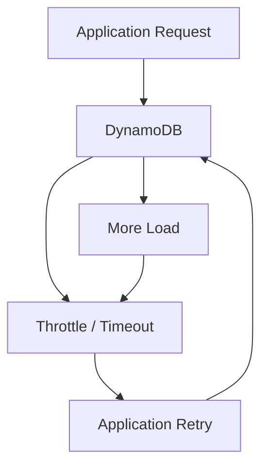
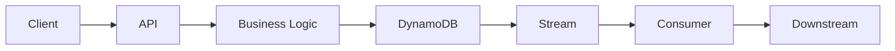
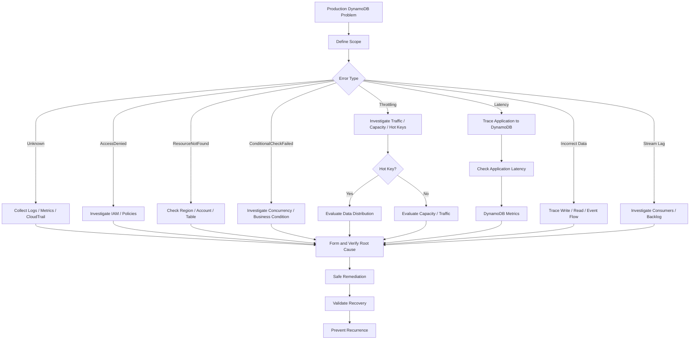

# 01- Troubleshooting Methodology

## Overview

Troubleshooting DynamoDB should be approached as a structured investigation rather than as a sequence of configuration changes.

A production DynamoDB failure can originate from several layers:

```text
Client
  ↓
DNS / Network
  ↓
API Gateway / Load Balancer
  ↓
Application
  ↓
AWS SDK
  ↓
IAM / Authorization
  ↓
DynamoDB
  ↓
DynamoDB Streams
  ↓
Queue / Worker
  ↓
Downstream Services
```

The first objective is to identify **where the failure occurs**. The second is to determine **why it occurs**. Only then should a configuration or code change be introduced.

A reliable troubleshooting process follows:

```text
Symptom
  ↓
Scope
  ↓
Evidence
  ↓
Hypothesis
  ↓
Verification
  ↓
Root Cause
  ↓
Remediation
  ↓
Validation
  ↓
Prevention
```

---

## Troubleshooting Principles

### Start With the Symptom

Record the exact failure before changing anything.

Useful information includes:

- Error message
- Exception type
- HTTP status
- AWS SDK operation
- Table name
- Region
- Timestamp
- Request ID
- Application version
- Deployment version
- Affected endpoint
- Affected tenant or workload
- Read or write operation
- Approximate request volume

For example:

```text
Time:
2026-08-26 14:32:10 UTC

Operation:
DynamoDB Query

Table:
Orders

Region:
ap-south-1

Error:
ProvisionedThroughputExceededException

Endpoint:
GET /customers/{id}/orders

Application:
orders-service v42
```

Do not begin by immediately increasing capacity.

The error may be caused by a hot partition, an inefficient access pattern, a traffic spike, an incorrect retry strategy, or another architectural problem.

---

## Define the Scope

Determine whether the issue is:

| Scope | Example |
|---|---|
| Single request | One malformed query |
| Single user | One authorization or data issue |
| Single tenant | One tenant generating abnormal traffic |
| Single endpoint | `/orders` failing |
| Single application | One service affected |
| Single table | Orders table affected |
| Multiple tables | Shared application or IAM issue |
| Single Region | Regional dependency problem |
| Multiple Regions | Global architecture problem |
| All workloads | AWS-wide or account-level issue |

Scope dramatically reduces the search space.

For example:

```text
Only one tenant affected
        ↓
Investigate tenant-specific workload
```

is very different from:

```text
All DynamoDB tables affected
        ↓
Investigate shared infrastructure, IAM, networking,
application configuration, or AWS service health
```

---

## Establish a Timeline

Create a timeline before forming a root-cause hypothesis.

Example:

```text
14:20  Deployment started
14:23  Deployment completed
14:25  Request rate increased
14:27  DynamoDB latency increased
14:28  Throttling began
14:29  API error rate increased
14:35  Rollback started
14:37  Error rate decreased
```

This strongly suggests that the deployment may be relevant.

A useful rule is:

> Correlation does not prove causation, but temporal correlation is valuable evidence.

Compare the incident timeline with:

- Deployments
- Configuration changes
- IAM changes
- Traffic changes
- Schema/data migrations
- Backfills
- Scheduled jobs
- Capacity changes
- Infrastructure changes
- Dependency incidents

---

## Identify the Exact DynamoDB Operation

DynamoDB failures are easier to troubleshoot when the exact API operation is known.

Common operations include:

```text
GetItem
PutItem
UpdateItem
DeleteItem
Query
Scan
BatchGetItem
BatchWriteItem
TransactGetItems
TransactWriteItems
```

For example:

```text
Query is throttled
```

requires a different investigation from:

```text
PutItem returns ConditionalCheckFailedException
```

Do not classify all DynamoDB errors as generic "database issues."

---

## Request Classification

Classify the operation by workload type.

| Workload | Examples | Main concerns |
|---|---|---|
| Point read | `GetItem` | Key correctness, latency, permissions |
| Point write | `PutItem` | Conditions, throttling, item size |
| Update | `UpdateItem` | Conditions, contention, expressions |
| Query | `Query` | Key design, result size, hot keys |
| Scan | `Scan` | Capacity, duration, table size |
| Batch read | `BatchGetItem` | Unprocessed items, fan-out |
| Batch write | `BatchWriteItem` | Unprocessed items, retries |
| Transaction | `TransactWriteItems` | Contention, transaction limits |
| Stream processing | DynamoDB Streams | Consumer lag, failures, retries |

This classification helps determine which evidence matters most.

---

## Build an Evidence Map

Before changing production configuration, collect evidence.

A useful evidence map is:

```text
Application Logs
       +
AWS SDK Errors
       +
CloudWatch Metrics
       +
CloudTrail
       +
Deployment History
       +
Traffic Metrics
       +
DynamoDB Configuration
       +
AWS Service Health
       ↓
Root Cause Analysis
```

Avoid relying on a single signal.

For example:

```text
Throttling metric increased
```

does not by itself explain:

```text
Why did throttling increase?
```

You still need workload, capacity, partition, and traffic information.

---

## Check the Application First

A significant percentage of DynamoDB incidents originate in application behavior.

Inspect:

- Request volume
- Request patterns
- Query parameters
- Retry behavior
- Timeouts
- Batch sizes
- Pagination
- Concurrency
- SDK configuration
- Deployment changes
- Connection/client creation
- Error handling

For example, a deployment may accidentally change:

```text
1 DynamoDB Query
```

into:

```text
100 DynamoDB Queries
```

per API request.

The DynamoDB service may appear unhealthy even though the root cause is an application-level N+1 access pattern.

---

## Verify AWS Region

A surprisingly common troubleshooting error is investigating the wrong Region.

Confirm:

```text
Application Region
AWS SDK Region
DynamoDB Table Region
CloudWatch Region
CloudTrail Region
```

For example:

```python
import boto3

dynamodb = boto3.resource("dynamodb", region_name="ap-south-1")
table = dynamodb.Table("Orders")

print(table.table_arn)
```

Do not assume that the developer's default AWS CLI Region is the same Region used by the production application.

---

## Verify the Table Exists

Confirm the table and Region:

```bash
aws dynamodb describe-table \
  --table-name Orders \
  --region ap-south-1
```

Inspect:

- Table status
- ARN
- Billing mode
- Item count
- Table size
- Key schema
- Provisioned capacity
- Table class
- Stream configuration
- Global Table configuration

A successful `describe-table` confirms that the table is discoverable but does not prove that application access is correctly authorized.

---

## Check Table Status

A table may temporarily be in a state other than `ACTIVE` during certain administrative operations.

Check:

```bash
aws dynamodb describe-table \
  --table-name Orders \
  --region ap-south-1 \
  --query 'Table.TableStatus'
```

Expected production state:

```text
ACTIVE
```

If the table is not active, determine which operation caused the state transition.

---

## Verify Key Schema

Many DynamoDB application errors are caused by incorrect key construction.

Inspect the table schema:

```bash
aws dynamodb describe-table \
  --table-name Orders \
  --region ap-south-1 \
  --query 'Table.KeySchema'
```

For example:

```text
PK
SK
```

The application must use the exact attribute names and expected data types.

Typical problems include:

- Incorrect partition-key name
- Incorrect sort-key name
- Incorrect data type
- Missing sort key
- Incorrect composite-key format
- Wrong tenant prefix
- Wrong identifier encoding

---

## ResourceNotFoundException

A common failure is:

```text
ResourceNotFoundException
```

Possible causes include:

- Table does not exist
- Wrong Region
- Wrong AWS account
- Wrong table name
- Deployment configuration points to another environment
- Table was deleted
- Resource is not available yet

A useful diagnostic sequence is:

```text
Check table name
      ↓
Check Region
      ↓
Check AWS account
      ↓
Describe table
      ↓
Check application configuration
```

Do not immediately recreate the table.

First determine why the application referenced a nonexistent resource.

---

## AccessDeniedException

When DynamoDB returns:

```text
AccessDeniedException
```

investigate authorization.

Check:

```text
Application IAM Role
       ↓
IAM Policy
       ↓
DynamoDB Resource
       ↓
VPC Endpoint Policy
       ↓
Resource-Based Policy
       ↓
KMS Permissions, if applicable
```

Typical causes include:

- Missing IAM action
- Wrong table ARN
- Wrong Region in ARN
- Incorrect role attached to workload
- Explicit deny
- SCP restriction
- VPC endpoint policy restriction
- KMS permission issue

---

## Verify the IAM Identity

Confirm which identity the application actually uses.

For AWS CLI testing:

```bash
aws sts get-caller-identity
```

Example output:

```json
{
  "Account": "123456789012",
  "Arn": "arn:aws:iam::123456789012:role/orders-service-role"
}
```

Do not assume that the IAM role you inspected is the role actually used by the running workload.

This is particularly important with:

- ECS
- EKS
- Lambda
- EC2
- CI/CD pipelines

---

## ConditionalCheckFailedException

This error usually indicates application-level concurrency or business-rule behavior rather than DynamoDB infrastructure failure.

For example:

```text
Expected version = 10
Actual version   = 11
```

A conditional update fails because another process changed the item.

Common causes:

- Optimistic concurrency conflict
- Duplicate request
- Idempotency logic
- State transition rule
- Concurrent workers

Do not automatically retry the same request indefinitely.

Determine whether the condition failure is:

```text
Expected business behavior
```

or:

```text
Unexpected application behavior
```

---

## Throttling

Common throttling-related errors include:

```text
ProvisionedThroughputExceededException
ThrottlingException
```

The first question should be:

> Is the workload exceeding available capacity, or is traffic concentrated around a problematic key?

Investigate:

```text
Request rate
+
Consumed capacity
+
Throttled requests
+
Partition-key distribution
+
GSI workload
+
Item size
+
Retry volume
```

Increasing capacity may reduce symptoms but does not necessarily resolve the root cause.

---

## Throttling Investigation

Use CloudWatch metrics to establish whether throttling is occurring.

Look at:

- Read throttles
- Write throttles
- Consumed read capacity
- Consumed write capacity
- Successful request count
- Request latency

Then correlate with application metrics:

```text
Requests/sec
Queries/request
Retries/request
Average item size
Top access patterns
```

A useful comparison is:

```text
Traffic increase
        vs
Consumed capacity increase
        vs
Throttle increase
```

---

## Hot Partition Investigation

If throttling occurs despite apparently sufficient overall capacity, investigate partition distribution.

Potential causes include:

- High-traffic partition key
- Low-cardinality partition key
- Sequential key pattern
- Popular tenant
- Popular product
- Hot GSI partition
- Time-bucket concentration

Example:

```text
PK = TENANT#123
```

If tenant `123` generates most traffic, the logical partition key can become disproportionately hot.

---

## Hot Item Investigation

A single item can also become a hotspot.

Example:

```text
PK = PRODUCT#123
```

If every request reads or updates the same item, the workload may concentrate on one logical entity.

Possible mitigations include:

- Redis caching for high-read workloads
- Write sharding
- Counter sharding
- Asynchronous aggregation
- Workload partitioning

Do not apply sharding before confirming that key concentration is the actual problem.

---

## Query Troubleshooting

For a slow or expensive query, inspect:

- Partition key
- Sort-key condition
- Result count
- Item size
- Filter expressions
- Projection
- Pagination
- Consistency mode
- GSI usage

A query should generally narrow the data using key conditions.

For example:

```text
Good:

PK = CUSTOMER#123
SK begins_with ORDER#

Problematic:

Scan entire table
Filter customer_id = 123
```

---

## FilterExpression Misunderstanding

A `FilterExpression` does not turn a broad read into an efficient key lookup.

For example:

```text
Query
  ↓
Read matching key range
  ↓
Apply filter
  ↓
Return remaining items
```

The filtered-out items still participate in the read operation.

If a query reads thousands of items and returns five, investigate whether the key design can make the five items directly addressable.

---

## Scan Troubleshooting

A scan can become expensive as a table grows.

When a production scan is slow or expensive, determine:

- Why the scan exists
- How frequently it runs
- Table size
- Number of items examined
- Pagination behavior
- Parallel scan usage
- Whether an index can support the access pattern
- Whether the workload should be asynchronous

Do not solve an accidental scan problem simply by increasing capacity.

---

## Pagination Problems

Large queries and scans should use pagination.

DynamoDB may return:

```text
LastEvaluatedKey
```

The application uses it to continue the operation.

A common production problem is:

```text
API returns entire dataset
        ↓
Large DynamoDB query
        ↓
Large response
        ↓
High memory usage
        ↓
High latency
```

Use bounded page sizes and application-level cursors.

---

## Batch Operation Failures

Batch operations may return unprocessed items.

For example:

```text
BatchWriteItem
      ↓
80 items processed
20 items unprocessed
```

The application must handle the remaining items.

A robust retry pattern uses:

```text
Unprocessed Items
       ↓
Exponential Backoff
       +
Jitter
       ↓
Retry
```

Do not assume that a successful batch API response means every requested item was successfully processed.

---

## Transaction Failures

Transactions can fail because of:

- Conditional failures
- Conflicting writes
- Validation errors
- Capacity constraints
- Application logic
- Transaction limitations

For transaction errors, inspect the specific cancellation reasons and identify whether the problem is:

```text
Business condition
```

or:

```text
Infrastructure/capacity problem
```

Do not blindly retry all transaction failures.

---

## Retry Storms

Poor retry behavior can turn a small DynamoDB problem into a larger outage.

Example:



A production retry strategy should include:

- Exponential backoff
- Jitter
- Maximum retry attempts
- Request deadlines
- Appropriate SDK retry configuration
- Idempotency where required

Retries should reduce pressure during an incident, not multiply it.

---

## Latency Troubleshooting

DynamoDB latency should be investigated across the complete request path.

```text
Client
  ↓
Load Balancer
  ↓
Application
  ↓
SDK
  ↓
Network
  ↓
DynamoDB
```

Measure each component separately.

For example:

```text
API latency       = 450 ms
Application time  = 30 ms
DynamoDB time     = 20 ms
External API      = 390 ms
```

The API is slow, but DynamoDB is not the bottleneck.

Avoid attributing total endpoint latency to DynamoDB without tracing the request path.

---

## SDK and Client Troubleshooting

For Python applications using `boto3`, verify:

- SDK version
- Region
- Retry configuration
- Timeout configuration
- Credential provider
- Client/resource reuse
- Endpoint configuration

Reuse clients rather than constructing them for every request.

```python
import boto3

dynamodb = boto3.resource("dynamodb")
table = dynamodb.Table("Orders")
```

Repeated client construction can create unnecessary overhead and complicate connection behavior.

---

## Network Troubleshooting

For applications using private VPC connectivity, investigate:

```text
Application
    ↓
VPC
    ↓
Route / Endpoint
    ↓
DynamoDB
```

Check:

- VPC endpoint configuration
- Route configuration
- Endpoint policy
- Security architecture
- DNS resolution
- AWS Region
- Network ACLs where applicable

DynamoDB connectivity problems should not automatically be diagnosed as DynamoDB service failures.

---

## VPC Endpoint Problems

If the application uses a DynamoDB VPC endpoint, verify that:

```text
Endpoint exists
        +
Correct VPC
        +
Correct route configuration
        +
Correct endpoint policy
        +
Correct IAM permissions
```

A valid IAM policy does not guarantee access if another authorization layer explicitly denies the request.

---

## DNS and Endpoint Verification

When troubleshooting connectivity, verify the endpoint being used by the application.

For AWS SDK workloads, inspect the application's effective Region and endpoint configuration.

Avoid manually overriding AWS service endpoints unless there is a specific architectural requirement.

Custom endpoint configuration can introduce:

- DNS errors
- TLS errors
- Routing problems
- Environment-specific behavior

---

## Stream Troubleshooting

DynamoDB Streams introduce another failure boundary.

A typical flow is:

```text
DynamoDB
   ↓
DynamoDB Streams
   ↓
Consumer
   ↓
Downstream Service
```

If the API is healthy but downstream processing is delayed, investigate:

- Stream consumer errors
- Iterator age
- Consumer concurrency
- Processing latency
- Lambda failures
- Queue depth
- Downstream failures

Do not assume that successful DynamoDB writes mean event processing has completed.

---

## Stream Consumer Lag

For event-driven systems, increasing iterator age indicates that consumers are falling behind.

Example:

```text
Incoming events:
20,000/sec

Consumer:
10,000/sec

Backlog:
Increasing
```

Investigate:

- Consumer capacity
- Processing time
- Downstream dependencies
- Concurrency limits
- Error retries
- Poison messages

Scaling the DynamoDB table will not automatically solve a slow stream consumer.

---

## Queue and Worker Troubleshooting

If Streams feed SQS and workers, inspect:

```text
DynamoDB
   ↓
Streams
   ↓
Consumer
   ↓
SQS
   ↓
Workers
```

Measure:

| Component | Signal |
|---|---|
| DynamoDB | Write throughput |
| Streams | Iterator age |
| Consumer | Processing latency |
| SQS | Queue depth |
| SQS | Oldest message age |
| Workers | Processing throughput |
| Workers | Error rate |
| Downstream | Response latency |

This identifies where the backlog originates.

---

## Data Consistency Troubleshooting

When an application reports stale data, identify the consistency model being used.

DynamoDB supports:

- Eventually consistent reads
- Strongly consistent reads for supported operations

A stale read may therefore be expected behavior rather than data corruption.

Investigate:

```text
Write completed
     ↓
Read immediately
     ↓
Consistency requirement
     ↓
Expected result?
```

If the business operation requires immediate visibility, verify that the chosen read consistency model matches the requirement.

---

## Global Tables Troubleshooting

For Global Tables, expand the investigation to:

```text
Region A
   ↓
Regional Replica
   ↓
Replication
   ↓
Regional Replica
   ↓
Region B
```

Investigate:

- Replica status
- Replication behavior
- Regional traffic
- Conflict scenarios
- Application routing
- Regional failures
- Consistency expectations

A problem in one Region does not necessarily imply that every Regional replica is unhealthy.

---

## IAM Troubleshooting Workflow

A practical IAM investigation is:

```text
1. Identify caller
        ↓
2. Identify requested action
        ↓
3. Identify resource ARN
        ↓
4. Inspect identity policy
        ↓
5. Inspect resource policy
        ↓
6. Check explicit denies
        ↓
7. Check SCPs
        ↓
8. Check endpoint policy
        ↓
9. Check KMS permissions if relevant
```

This prevents random permission changes.

---

## CloudTrail Investigation

CloudTrail can help establish:

```text
Who
What
When
Where
```

For example:

```text
Principal:
orders-service-role

Action:
dynamodb:UpdateTable

Time:
14:25 UTC

Region:
ap-south-1
```

This can correlate infrastructure or configuration changes with an incident timeline.

---

## CloudWatch Investigation

CloudWatch should be examined at multiple levels.

### Table-level

Inspect:

- Read throttles
- Write throttles
- Consumed capacity
- Request count
- Latency
- System errors

### Application-level

Inspect:

- Requests/sec
- Error rate
- Retry count
- Timeout rate
- Endpoint latency
- DynamoDB calls/request

### Stream-level

Inspect:

- Iterator age
- Processing errors
- Consumer throughput

Metrics should be correlated rather than interpreted individually.

---

## Application Logging

Structured logs should include enough information to correlate an application request with its DynamoDB operations.

Example:

```json
{
  "request_id": "req-123",
  "operation": "QueryOrders",
  "table": "Orders",
  "duration_ms": 14,
  "items_returned": 25,
  "status": "success"
}
```

Avoid logging:

- Secrets
- Tokens
- Full sensitive records
- Personal data
- Unnecessary item contents

Use request IDs and trace IDs for correlation.

---

## Deployment Correlation

If an incident starts immediately after deployment:

```text
Deployment
    ↓
Configuration/code change
    ↓
New DynamoDB workload
    ↓
Performance/error change
```

Compare:

- Previous application version
- Current application version
- DynamoDB operation counts
- Query patterns
- Retry behavior
- Configuration values

A rollback can be an effective mitigation, but the root cause still needs to be identified.

---

## Configuration Drift

DynamoDB incidents can result from infrastructure drift.

Compare expected configuration with actual configuration.

Inspect:

- Billing mode
- Key schema
- Indexes
- Streams
- Encryption
- Point-in-Time Recovery
- Global Table replicas
- Resource policies
- Tags
- Alarms

Infrastructure as Code should be the source of truth wherever possible.

---

## Data Integrity Troubleshooting

When incorrect data is reported, determine whether the problem is:

```text
Bad write
   ↓
Bad update condition
   ↓
Race condition
   ↓
Duplicate processing
   ↓
Eventual consistency
   ↓
Incorrect read key
   ↓
Application transformation
```

Do not immediately assume DynamoDB lost or corrupted data.

The database may contain exactly what the application wrote.

---

## Incorrect Item Troubleshooting

Trace the complete data lifecycle:



Determine where the incorrect value was introduced.

Useful evidence includes:

- Request payload
- Application logs
- DynamoDB item
- Update expression
- Conditional expression
- Stream record
- Downstream event
- Deployment version

---

## Security Troubleshooting

For unexpected access or authorization failures, investigate:

```text
Authentication
    ↓
Application Authorization
    ↓
IAM
    ↓
Resource Policy
    ↓
VPC Endpoint Policy
    ↓
KMS
```

For suspicious activity, correlate:

- CloudTrail
- Application logs
- IAM changes
- Deployment history
- Access patterns
- Data access timestamps

Avoid weakening IAM policies simply to restore service without understanding the denial.

---

## Cost Troubleshooting

Unexpected DynamoDB cost should be investigated through workload behavior.

Look for:

- Increased request volume
- Increased item size
- Scan operations
- Large query result sets
- GSI write amplification
- Batch workloads
- Backfills
- Global Table replication
- Inefficient application retries

A useful investigation is:

```text
Cost increase
    ↓
Request increase?
    ↓
Item size increase?
    ↓
New access pattern?
    ↓
New index?
    ↓
Retry increase?
    ↓
Backfill or batch workload?
```

---

## A Systematic Troubleshooting Workflow

Use the following workflow for most production incidents.

### Establish the Incident

Record:

```text
What failed?
When did it fail?
Who is affected?
Which service?
Which Region?
Which table?
Which operation?
```

### Collect Evidence

Gather:

```text
Application logs
CloudWatch metrics
CloudTrail events
AWS configuration
Deployment history
Traffic metrics
Error details
```

### Form Hypotheses

Example:

```text
Hypothesis A:
Traffic spike caused capacity pressure.

Hypothesis B:
A new deployment introduced excessive queries.

Hypothesis C:
A hot partition caused throttling.

Hypothesis D:
IAM configuration changed.
```

Do not investigate every possible theory equally.

Rank hypotheses by evidence.

### Verify the Highest-Probability Hypothesis

For example:

```text
Deployment occurred
        +
DynamoDB request count increased 10x
        +
Same endpoint affected
```

This provides stronger evidence for an application regression than a generic DynamoDB capacity issue.

### Apply the Smallest Safe Remediation

Possible mitigations include:

- Rollback
- Rate limiting
- Capacity adjustment
- Retry tuning
- Traffic reduction
- Consumer scaling
- Disabling a problematic batch job
- Correcting IAM
- Fixing application configuration

Avoid unrelated production changes during an incident.

### Validate

After remediation, verify:

```text
Error rate
Latency
Throttling
Request volume
Consumer lag
Queue depth
Application health
```

A successful deployment does not prove that the incident is resolved.

### Identify Root Cause

A root cause should explain:

```text
Why did the failure occur?
Why was it possible?
Why was it not detected earlier?
Why did existing controls not prevent it?
```

### Prevent Recurrence

Add appropriate controls:

- Tests
- Alerts
- Dashboards
- Validation
- Rate limits
- Capacity policies
- Runbooks
- IaC checks
- Load tests
- Code changes

---

## Troubleshooting Decision Tree



---

## Troubleshooting Commands

### Identify AWS Account

```bash
aws sts get-caller-identity
```

### Describe Table

```bash
aws dynamodb describe-table \
  --table-name Orders \
  --region ap-south-1
```

### Inspect Key Schema

```bash
aws dynamodb describe-table \
  --table-name Orders \
  --region ap-south-1 \
  --query 'Table.KeySchema'
```

### Inspect Billing Mode

```bash
aws dynamodb describe-table \
  --table-name Orders \
  --region ap-south-1 \
  --query 'Table.BillingModeSummary'
```

### Inspect Global Secondary Indexes

```bash
aws dynamodb describe-table \
  --table-name Orders \
  --region ap-south-1 \
  --query 'Table.GlobalSecondaryIndexes'
```

### Check Stream Configuration

```bash
aws dynamodb describe-table \
  --table-name Orders \
  --region ap-south-1 \
  --query 'Table.StreamSpecification'
```

### Check Point-in-Time Recovery

```bash
aws dynamodb describe-continuous-backups \
  --table-name Orders \
  --region ap-south-1
```

---

## Common Troubleshooting Mistakes

### Changing Configuration Before Collecting Evidence

This makes root-cause analysis harder because the system state has already changed.

### Increasing Capacity for Every Throttle

Capacity increases can hide hot-key or application regressions.

### Blaming DynamoDB for API Latency

The application may spend most of its time processing data or calling another service.

### Ignoring Retries

A retry storm can create the traffic that causes the incident.

### Treating `ConditionalCheckFailedException` as Infrastructure Failure

Conditional failures often indicate expected application-level concurrency behavior.

### Ignoring GSIs

The base table may be healthy while a GSI has a problematic access pattern.

### Assuming Successful Writes Mean Complete Processing

DynamoDB Streams and asynchronous consumers may still be processing downstream work.

### Debugging the Wrong Region

Always verify the application's effective AWS Region.

### Logging Entire Items

This can create security and compliance problems while making logs harder to analyze.

### Making Broad IAM Changes

Granting `dynamodb:*` may restore access temporarily but creates excessive privilege and hides the actual authorization problem.

---

## Production Incident Checklist

### Initial Assessment

- [ ] Record incident start time.
- [ ] Identify affected service.
- [ ] Identify affected table.
- [ ] Identify affected Region.
- [ ] Identify affected DynamoDB operation.
- [ ] Record exact error messages.
- [ ] Determine scope.

### Application

- [ ] Check recent deployments.
- [ ] Check configuration changes.
- [ ] Check request volume.
- [ ] Check retry volume.
- [ ] Check timeout behavior.
- [ ] Check DynamoDB calls per API request.
- [ ] Check SDK configuration.

### DynamoDB

- [ ] Verify table status.
- [ ] Verify key schema.
- [ ] Check throttling metrics.
- [ ] Check consumed capacity.
- [ ] Check request volume.
- [ ] Check GSI behavior.
- [ ] Investigate hot keys.
- [ ] Check item size where relevant.

### Authorization

- [ ] Verify caller identity.
- [ ] Check IAM policy.
- [ ] Check resource policy.
- [ ] Check SCPs.
- [ ] Check VPC endpoint policy.
- [ ] Check KMS permissions where applicable.

### Networking

- [ ] Verify Region.
- [ ] Verify VPC endpoint configuration.
- [ ] Verify routing.
- [ ] Verify endpoint policy.
- [ ] Verify DNS behavior.

### Event Processing

- [ ] Check Stream health.
- [ ] Check iterator age.
- [ ] Check consumer errors.
- [ ] Check queue depth.
- [ ] Check worker throughput.
- [ ] Check downstream dependencies.

### Recovery

- [ ] Apply the smallest safe mitigation.
- [ ] Monitor error rate.
- [ ] Monitor latency.
- [ ] Monitor throttling.
- [ ] Verify data correctness.
- [ ] Confirm downstream processing recovered.
- [ ] Document root cause.
- [ ] Create preventive actions.

---

## Key Takeaways

- DynamoDB troubleshooting should begin with scope, timeline, exact operation, and evidence rather than immediate configuration changes.
- Separate application, IAM, networking, DynamoDB, Streams, queues, and downstream failures before deciding where the root cause exists.
- Throttling and latency require workload analysis, including traffic distribution, hot keys, GSIs, retries, item size, and application behavior.
- Production incidents should be resolved with the smallest safe remediation, followed by validation and a root-cause analysis that explains why existing controls did not prevent the failure.
- Effective DynamoDB troubleshooting combines CloudWatch, CloudTrail, application logs, AWS configuration, deployment history, and realistic workload evidence.