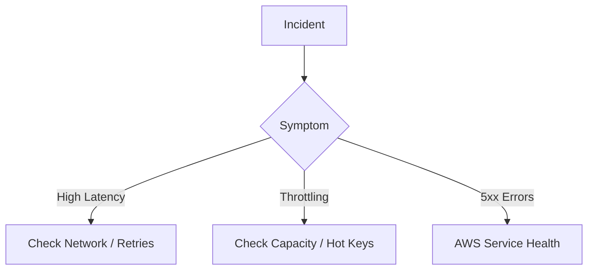

# 08- AWS DynamoDB

## Overview

This section provides diagnostic strategies and runbooks for resolving common DynamoDB production issues.

## 08- AWS DynamoDB Files

| File | Topic | Primary Focus |
|---|---|---|
| [01- Troubleshooting Methodology](./01-%20Troubleshooting%20Methodology.md) | Troubleshooting Methodology | Troubleshooting DynamoDB should be approached as a struct... |
| [02- Common DynamoDB Errors](./02-%20Common%20DynamoDB%20Errors.md) | Common DynamoDB Errors | No matter how well a DynamoDB application is designed, pr... |
| [03- Throttling & Hot Partitions](./03-%20Throttling%20%26%20Hot%20Partitions.md) | Throttling & Hot Partitions | One of the most common production issues in Amazon Dynamo... |
| [04- Slow Queries & Poor Performance](./04-%20Slow%20Queries%20%26%20Poor%20Performance.md) | Slow Queries & Poor Performance | One of the biggest misconceptions about DynamoDB is that ... |
| [05- Conditional Write Failures](./05-%20Conditional%20Write%20Failures.md) | Conditional Write Failures | Conditional writes are one of DynamoDB's most powerful fe... |
| [06- Transaction Issues](./06-%20Transaction%20Issues.md) | Transaction Issues | Amazon DynamoDB supports ACID-compliant transactions thro... |
| [07- AccessDenied & IAM Issues](./07-%20AccessDenied%20%26%20IAM%20Issues.md) | AccessDenied & IAM Issues | One of the most common production issues when working wit... |
| [08- DynamoDB Streams Troubleshooting](./08-%20DynamoDB%20Streams%20Troubleshooting.md) | DynamoDB Streams Troubleshooting | Amazon DynamoDB Streams capture item-level changes in a D... |
| [09- TTL Troubleshooting](./09-%20TTL%20Troubleshooting.md) | TTL Troubleshooting | Amazon DynamoDB Time To Live (TTL) automatically deletes ... |
| [10- Global Secondary Index (GSI) Issues](./10-%20Global%20Secondary%20Index%20%28GSI%29%20Issues.md) | Global Secondary Index (GSI) Issues | Global Secondary Indexes (GSIs) are one of the most power... |
| [11- Backup & Restore Problems](./11-%20Backup%20%26%20Restore%20Problems.md) | Backup & Restore Problems | Amazon DynamoDB provides multiple mechanisms for protecti... |
| [12- SDK & CLI Troubleshooting](./12-%20SDK%20%26%20CLI%20Troubleshooting.md) | SDK & CLI Troubleshooting | Most production DynamoDB issues are not caused by the ser... |
| [13- Production Incident Playbook](./13-%20Production%20Incident%20Playbook.md) | Production Incident Playbook | Production incidents involving Amazon DynamoDB rarely ste... |

## Progression

The documentation in this section builds conceptually according to the following flow:



## Core Concepts

### Hot Partitions
A scenario where access patterns disproportionately hit a single physical partition, causing localized throttling.

### Throttling
Requests being rejected (`HTTP 400`) because they exceed provisioned throughput.

## Engineering Patterns

- **Contributor Insights:** Using CloudWatch to identify the exact partition keys causing heat.
- **Jittered Backoff:** Adding randomness to exponential backoff to prevent thundering herds.

## Practical Considerations

DynamoDB SDKs automatically retry throttled requests, which can mask underlying capacity issues until latency spikes dramatically.

## Common Mistakes

- Assuming increasing table capacity will immediately fix a hot partition (it won't).
- Treating all latencies as database issues rather than network/SDK issues.

## Recommended Reading Order

To maximize comprehension, study the files in this sequence:

1. [01- Troubleshooting Methodology](./01-%20Troubleshooting%20Methodology.md)
2. [02- Common DynamoDB Errors](./02-%20Common%20DynamoDB%20Errors.md)
3. [03- Throttling & Hot Partitions](./03-%20Throttling%20%26%20Hot%20Partitions.md)
4. [04- Slow Queries & Poor Performance](./04-%20Slow%20Queries%20%26%20Poor%20Performance.md)
5. [05- Conditional Write Failures](./05-%20Conditional%20Write%20Failures.md)
6. [06- Transaction Issues](./06-%20Transaction%20Issues.md)
7. [07- AccessDenied & IAM Issues](./07-%20AccessDenied%20%26%20IAM%20Issues.md)
8. [08- DynamoDB Streams Troubleshooting](./08-%20DynamoDB%20Streams%20Troubleshooting.md)
9. [09- TTL Troubleshooting](./09-%20TTL%20Troubleshooting.md)
10. [10- Global Secondary Index (GSI) Issues](./10-%20Global%20Secondary%20Index%20%28GSI%29%20Issues.md)
11. [11- Backup & Restore Problems](./11-%20Backup%20%26%20Restore%20Problems.md)
12. [12- SDK & CLI Troubleshooting](./12-%20SDK%20%26%20CLI%20Troubleshooting.md)
13. [13- Production Incident Playbook](./13-%20Production%20Incident%20Playbook.md)

## Decision Checklist

- [ ] Are Contributor Insights enabled for high-traffic tables?
- [ ] Are SDK retry counts properly configured?
- [ ] Are we monitoring both account-level and table-level limits?

## Mental Model

When DynamoDB breaks, it is almost always a physics problem: too much data moving through too small a partition pipe.

## Key Takeaways

- Master the concepts before writing code.
- Understand the capacity implications of your designs.
- Continuously monitor production metrics.

## Folder Structure

```text
08- AWS DynamoDB/
    01- Troubleshooting Methodology.md
    02- Common DynamoDB Errors.md
    03- Throttling & Hot Partitions.md
    04- Slow Queries & Poor Performance.md
    05- Conditional Write Failures.md
    06- Transaction Issues.md
    07- AccessDenied & IAM Issues.md
    08- DynamoDB Streams Troubleshooting.md
    09- TTL Troubleshooting.md
    10- Global Secondary Index (GSI) Issues.md
    11- Backup & Restore Problems.md
    12- SDK & CLI Troubleshooting.md
    13- Production Incident Playbook.md
    README.md
```

---

## Repository Navigation

- [AWS Concepts](../../01-%20Concepts/README.md)
- [AWS Architecture](../../02-%20Architecture/README.md)
- [AWS Operations](../../04-%20Operations/README.md)
- [AWS Security](../../05-%20Security/README.md)
- [AWS Troubleshooting](../../07-%20Troubleshooting/README.md)
- [AWS Interview Questions](../../08-%20Interview%20Questions/README.md)
- [AWS Integrations](../../09-%20Integrations/README.md)
