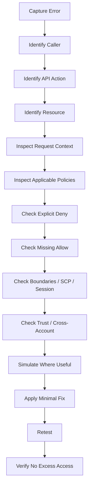
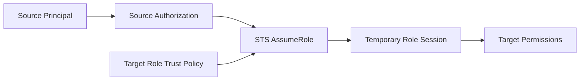
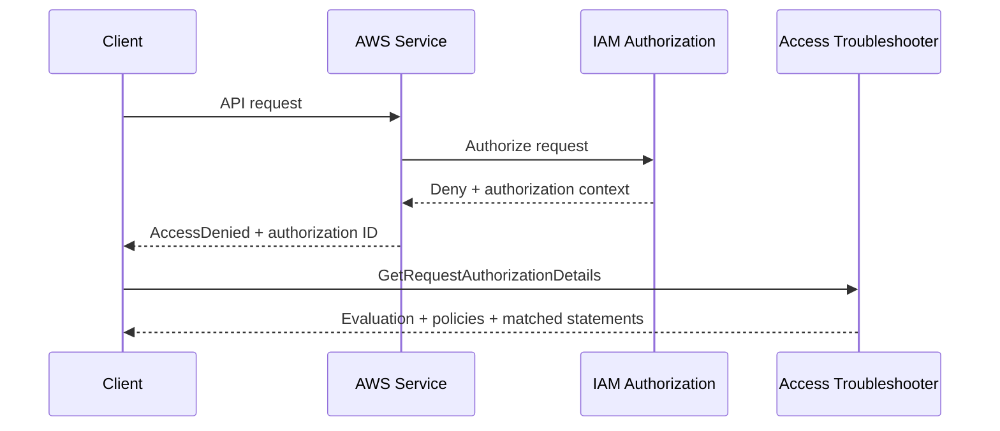

# 01- IAM Troubleshooting Methodology

## Overview

AWS IAM troubleshooting is primarily an **authorization-analysis problem**.

An `AccessDenied` error rarely means that a single IAM policy is simply missing one permission. A request can be affected by:

```text
Identity-based policies
Resource-based policies
Permissions boundaries
Service Control Policies (SCPs)
Resource Control Policies (RCPs)
Session policies
Trust policies
Policy conditions
Resource ownership
Cross-account relationships
Credential source
Request context
```

AWS evaluates the applicable policies in the request context. Requests are implicitly denied unless an applicable policy provides an allow, while an explicit deny overrides an allow. ([AWS IAM policy evaluation logic](https://docs.aws.amazon.com/IAM/latest/UserGuide/reference_policies_evaluation-logic_policy-eval-denyallow.html))

A reliable troubleshooting methodology therefore follows:

```text
Authentication
    ↓
Caller Identity
    ↓
Request
    ↓
Applicable Policies
    ↓
Policy Evaluation
    ↓
Condition / Context
    ↓
Allow or Deny
```

The objective is not to "add permissions until the command works."

The objective is:

```text
Identify the exact authorization failure
    ↓
Understand why the policy evaluation produced it
    ↓
Change the smallest necessary control
    ↓
Verify the intended authorization
```

---

## The Core Troubleshooting Mental Model

Every IAM troubleshooting investigation should establish five things:

```text
WHO
    Who is making the request?

WHAT
    Which AWS API action is being requested?

WHERE
    Which resource is being accessed?

CONTEXT
    Which request-context conditions apply?

WHY
    Which authorization rule causes the result?
```

For example:

```text
WHO:
arn:aws:sts::123456789012:assumed-role/OrdersRole/session

WHAT:
s3:GetObject

WHERE:
arn:aws:s3:::company-orders-prod/orders/123.json

CONTEXT:
Source VPC
Region
Principal ARN
Session tags
Encryption context

WHY:
Identity policy allows
BUT
Bucket policy condition denies
```

This model prevents the common mistake of looking only at the principal's attached IAM policy.

---

## Authentication vs Authorization

The first diagnostic split is:

```text
Authentication
    ↓
Can AWS identify the caller?

Authorization
    ↓
Is that caller allowed to perform the requested action?
```

### Authentication Problems

Typical examples:

```text
Unable to locate credentials
ExpiredToken
InvalidClientTokenId
SignatureDoesNotMatch
```

Investigate:

```text
Credential source
Profile
Access key
Session token
Credential expiration
Role assumption
Clock synchronization
```

### Authorization Problems

Typical example:

```text
AccessDenied
```

Investigate:

```text
Action
Resource
Identity policies
Resource policies
SCP
RCP
Permissions boundary
Session policy
Conditions
Trust relationships
```

AWS specifically distinguishes explicit denies from implicit denies and recommends reviewing all applicable policies rather than only the policy named in an error. ([AWS troubleshooting access denied errors](https://docs.aws.amazon.com/IAM/latest/UserGuide/troubleshoot_access-denied.html))

---

## Standard Troubleshooting Workflow

A production IAM investigation should follow a repeatable sequence:



The ordering matters.

For example, do not start by rewriting policies before confirming which identity is actually making the request.

---

## Step One: Capture the Complete Error

Start with the complete error message.

Example:

```text
An error occurred (AccessDenied) when calling the GetObject operation:
User: arn:aws:sts::123456789012:assumed-role/OrdersRole/session
is not authorized to perform: s3:GetObject
on resource: arn:aws:s3:::company-orders-prod/orders/123.json
```

Extract:

```text
Principal:
arn:aws:sts::123456789012:assumed-role/OrdersRole/session

Action:
s3:GetObject

Resource:
arn:aws:s3:::company-orders-prod/orders/123.json
```

The error may also identify whether the request was blocked by:

```text
Explicit deny
```

or:

```text
No applicable policy allows the action
```

AWS documents that access-denied errors can contain context describing the relevant policy type and, in some cases, the policy ARN. ([AWS access denied troubleshooting](https://docs.aws.amazon.com/IAM/latest/UserGuide/troubleshoot_access-denied.html))

---

## Step Two: Verify the Caller Identity

Never assume the credential source is correct.

Run:

```bash
aws sts get-caller-identity
```

For a named profile:

```bash
aws sts get-caller-identity \
    --profile production
```

Typical output:

```json
{
    "UserId": "AROAXXXXXXXXXXXXX:session",
    "Account": "123456789012",
    "Arn": "arn:aws:sts::123456789012:assumed-role/OrdersRole/session"
}
```

This establishes:

```text
AWS account
IAM user / role
Role session
```

`GetCallerIdentity` is designed for identifying the principal making the request and does not require IAM permission for the operation. ([AWS CLI `get-caller-identity`](https://docs.aws.amazon.com/cli/latest/reference/sts/get-caller-identity.html))

---

## Step Three: Verify Credential Resolution

If the identity is unexpected, inspect how the CLI obtained its credentials:

```bash
aws configure list
```

For a profile:

```bash
aws configure list \
    --profile production
```

Also inspect AWS environment variables.

Linux/macOS:

```bash
env | grep '^AWS_'
```

PowerShell:

```powershell
Get-ChildItem Env:AWS*
```

Common causes of unexpected identities include:

```text
AWS_ACCESS_KEY_ID overriding a profile
AWS_PROFILE pointing to another profile
Expired SSO session
Different source profile
Unexpected role assumption
Container credential provider
EC2 instance profile
ECS task credentials
```

AWS CLI authentication sources have a defined precedence, with command-line settings taking precedence over environment/configuration settings. ([AWS CLI authentication and credential precedence](https://docs.aws.amazon.com/cli/latest/userguide/cli-chap-authentication.html))

---

## Step Four: Identify the Exact API Action

Do not troubleshoot "S3 access" or "IAM access" as a generic concept.

Identify the exact action:

```text
s3:GetObject
s3:PutObject
s3:ListBucket
secretsmanager:GetSecretValue
kms:Decrypt
sqs:SendMessage
sts:AssumeRole
iam:PassRole
```

This matters because permissions are action-specific.

For example:

```text
s3:GetObject
```

does not grant:

```text
s3:ListBucket
```

and:

```text
s3:ListBucket
```

does not grant:

```text
s3:GetObject
```

---

## Step Five: Identify the Exact Resource

Determine the resource ARN involved.

For example:

```text
s3:GetObject
    arn:aws:s3:::company-orders-prod/orders/123.json
```

versus:

```text
s3:ListBucket
    arn:aws:s3:::company-orders-prod
```

The difference is significant.

A policy that allows:

```json
{
    "Effect": "Allow",
    "Action": "s3:GetObject",
    "Resource": "arn:aws:s3:::company-orders-prod/*"
}
```

does not necessarily authorize:

```text
s3:ListBucket
```

because the action operates against a different resource scope.

---

## Step Six: Determine the Resource Owner

For cross-account or resource-based authorization, identify:

```text
Caller account
Target resource account
Resource owner
```

Example:

```text
Account A
    OrdersRole
        |
        | Assume / API call
        v
Account B
    S3 bucket
```

Cross-account troubleshooting must analyze both sides of the trust and authorization relationship.

A local identity policy in Account A is not enough to explain access to a resource owned by Account B.

---

## Step Seven: Inspect Identity-Based Policies

For an IAM role:

```bash
aws iam list-attached-role-policies \
    --role-name OrdersRole
```

Inline policies:

```bash
aws iam list-role-policies \
    --role-name OrdersRole
```

Inspect a managed policy:

```bash
aws iam get-policy \
    --policy-arn arn:aws:iam::123456789012:policy/OrdersAccess
```

Get its active version:

```bash
aws iam get-policy \
    --policy-arn arn:aws:iam::123456789012:policy/OrdersAccess \
    --query 'Policy.DefaultVersionId'
```

Then:

```bash
aws iam get-policy-version \
    --policy-arn arn:aws:iam::123456789012:policy/OrdersAccess \
    --version-id v3
```

Look for:

```text
Action
Resource
Effect
Condition
```

Do not stop at "the role has the policy."

Verify the actual statement.

---

## Step Eight: Inspect Resource-Based Policies

Many AWS services support resource-based policies.

Examples include:

```text
S3 bucket policies
SQS queue policies
SNS topic policies
KMS key policies
Secrets Manager resource policies
```

For S3:

```bash
aws s3api get-bucket-policy \
    --bucket company-orders-prod
```

For SQS:

```bash
aws sqs get-queue-attributes \
    --queue-url <queue-url> \
    --attribute-names Policy
```

For SNS:

```bash
aws sns get-topic-attributes \
    --topic-arn <topic-arn>
```

Resource-based policies are part of IAM authorization and can materially change the result of a request. ([AWS access management for resources](https://docs.aws.amazon.com/IAM/latest/UserGuide/access.html))

---

## Step Nine: Check for Explicit Deny

An explicit deny is a high-priority diagnostic signal.

Search all relevant policy layers for:

```json
{
    "Effect": "Deny"
}
```

Potential sources include:

```text
Identity policy
Resource policy
Permissions boundary
SCP
RCP
Session policy
```

AWS states that an explicit deny overrides an allow. ([AWS IAM policy evaluation logic](https://docs.aws.amazon.com/IAM/latest/UserGuide/reference_policies_evaluation-logic_policy-eval-denyallow.html))

The troubleshooting question becomes:

```text
Which policy contains the Deny?
Why does its Resource / Action / Condition match this request?
```

---

## Explicit Deny Example

Suppose the role has:

```json
{
    "Effect": "Allow",
    "Action": "s3:GetObject",
    "Resource": "arn:aws:s3:::company-orders-prod/*"
}
```

but an SCP contains:

```json
{
    "Effect": "Deny",
    "Action": "s3:GetObject",
    "Resource": "*",
    "Condition": {
        "StringNotEquals": {
            "aws:RequestedRegion": "ap-south-1"
        }
    }
}
```

The role policy allows the request.

The SCP denies it outside the permitted Region.

Result:

```text
Allow
+
Explicit Deny
=
Deny
```

---

## Step Ten: Check for Implicit Deny

If no explicit deny exists, check whether any applicable policy actually allows the request.

A common pattern:

```text
Role:
    s3:GetObject
        ✅

Resource:
    bucket/prefix is different
        ❌
```

or:

```text
Action:
    s3:GetObject
        ✅

Requested action:
    s3:ListBucket
        ❌
```

or:

```text
Action:
    kms:Decrypt
        ✅

Condition:
    kms:EncryptionContext required
        ❌
```

The absence of an explicit deny does not mean access should succeed.

---

## Step Eleven: Check Permissions Boundaries

A permissions boundary limits the maximum permissions an IAM user or role can have.

Inspect the role:

```bash
aws iam get-role \
    --role-name OrdersRole \
    --query 'Role.PermissionsBoundary'
```

The effective authorization can depend on:

```text
Identity-based policy
+
Permissions boundary
```

and potentially:

```text
SCP
+
Session policy
+
Resource policy
```

AWS documents that a permissions boundary can restrict the effective permissions of a user or role and that explicit denies override allows. ([AWS permissions boundaries](https://docs.aws.amazon.com/IAM/latest/UserGuide/access_policies_boundaries.html))

---

## Boundary Failure Example

Suppose:

```text
Identity policy:
    secretsmanager:GetSecretValue
        ✅
```

but the permissions boundary allows only:

```text
s3:GetObject
s3:ListBucket
```

Then:

```text
Identity policy
    ✅

Boundary
    ❌

Effective result
    ❌
```

Adding another allow to the identity policy does not solve the problem.

The boundary must be reviewed.

---

## Step Twelve: Check SCPs

In AWS Organizations, the account may be subject to SCPs.

The effective permission can be constrained by:

```text
Identity policy
+
Permissions boundary
+
SCP
```

A useful diagnostic pattern is:

```text
Works in development account
    ✅

Fails in production account
    ❌
```

This often suggests an account-level difference such as:

```text
SCP
RCP
Resource policy
Region restriction
Tag guardrail
Security-control policy
```

SCPs do not grant permissions; they constrain the maximum permissions available to principals in member accounts. ([AWS IAM policy evaluation logic](https://docs.aws.amazon.com/IAM/latest/UserGuide/reference_policies_evaluation-logic.html))

---

## Step Thirteen: Check Session Policies

Temporary role or federated sessions can have session policies.

Conceptually:

```text
Role permission policy
        +
Session policy
        ↓
Effective session permissions
```

A session policy can further restrict what the role session can do.

This is particularly important when troubleshooting:

```text
STS AssumeRole
Federation
CI/CD
Third-party integrations
Delegated automation
```

If a normal role works but a specific session fails, inspect how the session was created.

AWS documents session policies as an additional policy layer that can limit permissions of temporary sessions. ([AWS permissions boundaries and policy evaluation](https://docs.aws.amazon.com/IAM/latest/UserGuide/access_policies_boundaries.html))

---

## Step Fourteen: Check Trust Policies

Trust policies are relevant whenever the failure occurs during role assumption.

Inspect:

```bash
aws iam get-role \
    --role-name ProductionDeploymentRole \
    --query 'Role.AssumeRolePolicyDocument'
```

Ask:

```text
Does the trust policy trust the source principal?

Is the source account correct?

Is the principal ARN correct?

Does an Organization condition match?

Does an ExternalId condition match?

Is MFA required?

Does the OIDC subject match?

Is the service principal correct?
```

---

## AssumeRole Troubleshooting Model

For:

```text
sts:AssumeRole
```

analyze both:



The source identity generally needs authorization to perform `sts:AssumeRole`, while the target role's trust policy must allow the source principal.

For cross-account role assumption, both account boundaries must be considered.

---

## Step Fifteen: Check Conditions

Conditions are one of the most common sources of confusing denies.

Examples:

```text
aws:RequestedRegion
aws:SourceIp
aws:PrincipalArn
aws:PrincipalOrgID
aws:MultiFactorAuthPresent
aws:SourceArn
aws:SourceAccount
aws:RequestTag/*
aws:ResourceTag/*
```

A statement can look correct while a condition silently makes it inapplicable.

Example:

```json
{
    "Effect": "Allow",
    "Action": "s3:GetObject",
    "Resource": "arn:aws:s3:::company-orders-prod/*",
    "Condition": {
        "StringEquals": {
            "aws:PrincipalOrgID": "o-example"
        }
    }
}
```

If the principal is outside that Organization:

```text
Statement does not apply
    ↓
No matching allow
    ↓
Implicit deny
```

AWS specifically recommends checking condition key values when troubleshooting access denials. ([AWS troubleshooting access denied](https://docs.aws.amazon.com/IAM/latest/UserGuide/troubleshoot_access-denied.html))

---

## Condition Troubleshooting Checklist

For every condition, ask:

```text
What key is being evaluated?

What value does the request actually contain?

Is the operator correct?

Is the key present?

Is the key global or service-specific?

Is case sensitivity relevant?

Does the condition apply to this API?

Does a missing key cause the condition to fail?
```

Never fix a condition by simply deleting it without understanding why it was added.

---

## Step Sixteen: Check Resource and ARN Scope

Many IAM failures are caused by incorrect resource ARNs.

Common mistakes:

```text
Wrong account ID
Wrong Region
Wrong resource type
Wrong path
Wrong object prefix
Missing wildcard
Bucket ARN used where object ARN is required
Role ARN used where policy ARN is required
```

For example:

```text
S3 bucket:
arn:aws:s3:::company-orders-prod

S3 objects:
arn:aws:s3:::company-orders-prod/*
```

These are different authorization resources.

---

## Step Seventeen: Check Service-Specific Authorization

Some AWS services use multiple authorization layers.

For example:

```text
Application
    ↓
KMS Decrypt
    ↓
KMS key policy
    +
IAM policy
    +
Encryption context
```

Or:

```text
Lambda
    ↓
Secrets Manager
    ↓
IAM role
    +
Secret resource policy
    +
KMS permissions if applicable
```

Or:

```text
ECS
    ↓
ECR
    ↓
Execution role
    +
Repository policy where applicable
```

Do not assume that "the service role has the permission" fully explains access.

---

## Step Eighteen: Check Credential Type

The same human operator may use:

```text
IAM user
IAM Identity Center
Assumed role
Federated session
```

and the same server may use:

```text
Environment credentials
EC2 instance role
ECS task role
EKS workload identity
OIDC role
```

Determine the actual credential type with:

```bash
aws sts get-caller-identity
```

This is particularly important when:

```text
CLI works
Application fails
```

or:

```text
Developer CLI works
CI/CD fails
```

The two contexts may use different identities.

---

## CLI Works but Application Fails

Suppose:

```text
Developer CLI
    → S3
    ✅

FastAPI application
    → S3
    ❌
```

Do not assume S3 is broken.

Compare identities:

```bash
aws sts get-caller-identity
```

Application:

```python
import boto3

sts = boto3.client("sts")
print(sts.get_caller_identity()["Arn"])
```

You may discover:

```text
CLI:
DeveloperRole

Application:
OrdersTaskRole
```

The real problem is then the application role's authorization rather than AWS connectivity.

---

## Application Works Locally but Fails in ECS

Typical identity difference:

```text
Local:
DeveloperRole

ECS:
OrdersTaskRole
```

Troubleshooting:

```text
1. Identify ECS task role.
2. Inspect task-role policies.
3. Compare local and task-role permissions.
4. Check task role trust.
5. Check secrets / KMS / S3 resource policies.
6. Verify task is using the expected role.
```

Do not copy developer access keys into the container to "fix" the issue.

That hides the authorization problem and increases credential risk.

---

## Kubernetes / EKS Troubleshooting

For EKS:

```text
Pod
    ↓
Workload identity
    ↓
IAM role
```

If AWS API access fails:

```text
Verify Kubernetes service account
    ↓
Verify workload identity association
    ↓
Verify IAM role
    ↓
Verify role trust policy
    ↓
Verify role permissions
```

The troubleshooting question is:

```text
Which AWS identity does this pod actually become?
```

Do not troubleshoot only from the IAM side.

---

## CI/CD Troubleshooting

For OIDC-based CI/CD:

```text
CI job
    ↓
OIDC token
    ↓
STS AssumeRoleWithWebIdentity
    ↓
DeploymentRole
```

Check:

```text
OIDC provider
Role trust policy
Audience
Subject / repository condition
Branch / environment condition
Role ARN
Role permission policy
SCP / boundary
```

A common failure is:

```text
OIDC authentication succeeds
```

but:

```text
DeploymentRole
    lacks required service permission
```

These are separate failures.

---

## Step Nineteen: Use CloudTrail

CloudTrail answers:

```text
What API call actually occurred?

Which principal made it?

When did it happen?

Which Region?

Which source IP?

Which user agent?

Was it successful?
```

For example:

```text
AssumeRole
CreateRole
PutRolePolicy
PassRole
GetSecretValue
Decrypt
PutObject
```

CloudTrail is especially useful when:

```text
The error is intermittent
The identity is unclear
A service acts on behalf of a role
A policy was recently changed
A production incident occurred
```

Use CloudTrail to compare:

```text
What you expected
vs
What actually happened
```

---

## Step Twenty: Inspect Recent IAM Changes

When troubleshooting a sudden failure:

```text
Working yesterday
    ↓
Failing today
```

immediately ask:

```text
What changed?
```

Potential changes:

```text
Policy version
Role trust policy
SCP
Permissions boundary
Resource policy
Deployment
Secret KMS key
Network path
VPC endpoint policy
Credential rotation
Identity Center assignment
```

Use CloudTrail or infrastructure-as-code history to identify the change.

Avoid making multiple unrelated policy changes before determining the regression.

---

## Step Twenty-One: Check VPC Endpoint Policies

A private workload may reach AWS through a VPC endpoint.

For example:

```text
ECS
    ↓
VPC Endpoint
    ↓
S3
```

Authorization can involve:

```text
IAM role
+
VPC endpoint policy
+
S3 bucket policy
```

AWS notes that VPC endpoint policies can be a source of access-denied errors and may not always appear in CloudTrail from the perspective expected by the caller. ([AWS access denied troubleshooting](https://docs.aws.amazon.com/IAM/latest/UserGuide/troubleshoot_access-denied.html))

When:

```text
Works outside VPC
    ✅

Fails inside private subnet
    ❌
```

inspect endpoint configuration.

---

## Step Twenty-Two: Check Request Context

IAM authorization can depend on request context.

Relevant values may include:

```text
Principal
Principal account
Principal organization
Source IP
Requested Region
MFA state
Tags
Source ARN
Source account
Encryption context
VPC endpoint
Session tags
```

Therefore:

```text
Same action
+
Same role
+
Different request context
=
Different authorization result
```

This is particularly important for ABAC and condition-heavy policies.

---

## Step Twenty-Three: Use the IAM Policy Simulator

The IAM Policy Simulator can test authorization decisions without sending the actual request to the AWS service.

For an existing IAM principal:

```bash
aws iam simulate-principal-policy \
    --policy-source-arn arn:aws:iam::123456789012:role/OrdersRole \
    --action-names s3:GetObject \
    --resource-arns arn:aws:s3:::company-orders-prod/orders/123.json
```

The simulator can evaluate applicable policy information supplied to the simulation and provides decision details useful for understanding allow/deny results. ([AWS CLI `simulate-principal-policy`](https://docs.aws.amazon.com/cli/latest/reference/iam/simulate-principal-policy.html))

---

## Simulate Multiple Actions

```bash
aws iam simulate-principal-policy \
    --policy-source-arn arn:aws:iam::123456789012:role/OrdersRole \
    --action-names \
        s3:GetObject \
        s3:PutObject \
        s3:DeleteObject \
    --resource-arns \
        arn:aws:s3:::company-orders-prod/orders/*
```

This is useful when checking whether a role has:

```text
Read
Write
Delete
```

permissions for a specific resource scope.

---

## Simulating Conditions

If a policy depends on context keys, provide them as simulation input where supported.

For example, a policy may depend on:

```text
aws:RequestedRegion
aws:MultiFactorAuthPresent
aws:SourceIp
```

AWS documents that the policy simulator can evaluate supplied context values, but simulation results can differ from live behavior in some advanced configurations. ([IAM policy simulator](https://docs.aws.amazon.com/IAM/latest/UserGuide/access_policies_testing-policies.html))

Therefore:

```text
Simulator result
    +
Live request verification
```

is the safest approach.

---

## Policy Simulator Limitations

The simulator is not a perfect replacement for live authorization.

AWS notes that results can differ from live AWS behavior in certain configurations, including some:

```text
VPC endpoint policies
Role chaining
Multiple resource-based policies
Other advanced request contexts
```

The simulator also requires you to supply resource-based policies when they are not automatically retrieved by the mode being used. ([IAM policy simulator](https://docs.aws.amazon.com/IAM/latest/UserGuide/access_policies_testing-policies.html))

Use it as:

```text
Authorization analysis
```

not:

```text
Proof that production will definitely behave identically
```

---

## Simulating Custom Policies

For policies that are not yet attached to an IAM entity:

```bash
aws iam simulate-custom-policy \
    --policy-input-list file://policy.json \
    --action-names s3:GetObject \
    --resource-arns arn:aws:s3:::company-orders-prod/orders/123.json
```

This is useful for:

```text
CI/CD
Policy design
Pull requests
Pre-deployment testing
Least-privilege refinement
```

The custom-policy simulator evaluates supplied policies and does not perform the underlying AWS API request. ([AWS CLI `simulate-custom-policy`](https://docs.aws.amazon.com/cli/latest/reference/iam/simulate-custom-policy.html))

---

## Authorization Troubleshooter

AWS has introduced an **Access Troubleshooter** capability in public preview for supported access-denied responses.

Some denied requests can include an **authorization ID**. That identifier can be used with `GetRequestAuthorizationDetails` to inspect:

```text
Request context
Evaluation result
Policies evaluated
Matching statements
Policy types
```

AWS notes that authorization IDs are not guaranteed for every denied request, and authorization details are retained for 24 hours when available. ([AWS Access Troubleshooter preview](https://docs.aws.amazon.com/IAM/latest/UserGuide/troubleshoot_access-denied-authorization-id.html))

When available, this can substantially reduce troubleshooting time.

---

## Authorization ID Workflow



The workflow can provide:

```text
Action/resource evaluation
ALLOW
EXPLICIT_DENY
IMPLICIT_DENY
```

along with references to policies that were considered. ([AWS authorization troubleshooting](https://docs.aws.amazon.com/IAM/latest/UserGuide/troubleshoot_access-denied-authorization-id.html))

---

## Step Twenty-Four: Compare Environments

When one environment works and another fails:

```text
Development
    ✅

Staging
    ✅

Production
    ❌
```

compare:

```text
Caller role
Policy versions
Permissions boundary
SCP
Resource policy
KMS policy
Trust policy
Region
VPC endpoint
Secrets
Environment variables
Deployment version
```

A useful approach is to construct a comparison table:

| Dimension | Development | Production |
|---|---|---|
| Role | `OrdersDevRole` | `OrdersProdRole` |
| Policy version | `v8` | `v7` |
| SCP | Standard | Production restricted |
| Boundary | AppBoundary | ProdBoundary |
| Resource policy | Internal | Cross-account restricted |
| VPC endpoint | None | S3 endpoint |
| Region | `ap-south-1` | `ap-south-1` |

The difference is often more valuable than inspecting the failing environment in isolation.

---

## Step Twenty-Five: Check Recent Policy Changes

For a newly introduced failure:

```text
Current policy
    vs
Last-known-good policy
```

Compare:

```text
Action
Resource
Effect
Condition
Principal
Version
```

For customer-managed policies:

```bash
aws iam list-policy-versions \
    --policy-arn arn:aws:iam::123456789012:policy/OrdersAccess
```

Then inspect relevant versions:

```bash
aws iam get-policy-version \
    --policy-arn arn:aws:iam::123456789012:policy/OrdersAccess \
    --version-id v2
```

This is especially useful for:

```text
Privilege regression
Deployment regressions
Emergency changes
Security hardening changes
```

---

## Step Twenty-Six: Check for Eventual Consistency

IAM changes are not a reason to blindly retry everything forever.

After a policy or role change:

```text
Policy updated
    ↓
Immediately retry
    ↓
Still denied
```

a short propagation delay may be involved.

The operational response should be:

```text
Verify the intended change was actually committed
    ↓
Allow reasonable propagation time
    ↓
Retry
    ↓
Investigate if the problem persists
```

Do not add large retry loops around IAM control-plane changes as a substitute for diagnosing incorrect authorization.

---

## Step Twenty-Seven: Retest With the Smallest Possible Request

After a fix, use a minimal verification.

Instead of:

```text
Run entire production deployment
```

test:

```bash
aws sts get-caller-identity \
    --profile production
```

Then test the specific operation:

```bash
aws s3api head-object \
    --bucket company-orders-prod \
    --key orders/123.json \
    --profile production
```

or:

```bash
aws secretsmanager get-secret-value \
    --secret-id production/orders \
    --profile production
```

The goal is to validate exactly the authorization capability that failed.

---

## Step Twenty-Eight: Verify Negative Access

A successful fix should not automatically mean:

```text
Grant broad permissions
```

After restoring required access, test an operation that should remain denied.

Example:

```text
Required:
    s3:GetObject
        ✅

Should remain denied:
    s3:DeleteObject
        ❌
```

This validates least privilege.

---

## IAM Troubleshooting by Failure Type

| Failure | First diagnostic |
|---|---|
| `Unable to locate credentials` | Credential provider / `aws configure list` |
| `ExpiredToken` | Credential expiration / SSO / role session |
| `InvalidClientTokenId` | Active credentials / caller identity |
| `SignatureDoesNotMatch` | Credentials, clock, request signing |
| `AccessDenied` | Action + resource + policy evaluation |
| `AssumeRole AccessDenied` | Source permission + target trust |
| S3 access denied | IAM + bucket policy + KMS + endpoint |
| KMS decrypt denied | IAM + key policy + encryption context |
| Secrets Manager denied | IAM + secret resource policy + KMS if relevant |
| CI/CD role assumption failure | OIDC trust conditions |
| ECS access failure | Task role |
| EKS access failure | Workload identity + role |
| Production-only failure | SCP / boundary / resource policy / environment differences |

---

## Troubleshooting S3

S3 access often involves several distinct operations:

```text
List bucket
    ↓
s3:ListBucket

Read object
    ↓
s3:GetObject

Write object
    ↓
s3:PutObject

Delete object
    ↓
s3:DeleteObject
```

Then potentially:

```text
S3
    +
Bucket policy
    +
IAM role
    +
KMS key policy
    +
KMS IAM permission
    +
VPC endpoint policy
```

For encrypted objects:

```text
s3:GetObject
    +
kms:Decrypt
```

may both be required.

---

## Troubleshooting KMS

A role can have:

```text
kms:Decrypt
```

in an IAM policy and still receive `AccessDenied`.

Check:

```text
KMS key policy
IAM permission
Encryption context
Key state
Region
Grant configuration
Cross-account ownership
```

For KMS, the key policy is a particularly important part of authorization.

Do not troubleshoot `kms:Decrypt` using only the caller's IAM policy.

---

## Troubleshooting Secrets Manager

Typical architecture:

```text
Application
    ↓
IAM Role
    ↓
secretsmanager:GetSecretValue
    ↓
Secret
    ↓
KMS key if applicable
```

Check:

```text
Secret ARN
Secret resource policy
IAM role policy
KMS key policy
KMS decrypt permission
Region
```

A common mistake is granting access to:

```text
secret name
```

but using an incorrect ARN or missing an ARN suffix where the policy requires the exact resource form.

---

## Troubleshooting SQS

For an application producing messages:

```text
sqs:SendMessage
```

For a consumer:

```text
sqs:ReceiveMessage
sqs:DeleteMessage
sqs:GetQueueAttributes
```

If the application receives `AccessDenied`, inspect:

```text
Task / execution role
Queue ARN
Queue policy
Cross-account ownership
SCP
VPC endpoint policy if applicable
```

Do not grant:

```text
sqs:*
```

just because one SQS action failed.

---

## Troubleshooting Lambda

For Lambda-related IAM failures distinguish:

```text
Caller
    ↓
Lambda control-plane API
```

from:

```text
Lambda execution role
    ↓
AWS service API
```

These are different authorization contexts.

For example:

```text
DeveloperRole
    → lambda:UpdateFunctionCode
        ✅

LambdaExecutionRole
    → s3:GetObject
        ❌
```

The deployment can succeed while the function fails at runtime.

---

## Troubleshooting ECS

Distinguish:

```text
ECS execution role
```

from:

```text
ECS task role
```

The execution role is associated with ECS-managed startup operations, while the task role is intended for application calls to AWS APIs.

If:

```text
Task starts successfully
```

but:

```text
Application receives AccessDenied
```

inspect the **task role**, not only the execution role.

---

## Troubleshooting CloudFormation

CloudFormation can execute operations using a service role.

If:

```text
CloudFormation stack update
    fails with AccessDenied
```

inspect:

```text
CloudFormation caller
+
CloudFormation service role
+
iam:PassRole
+
Service role policy
+
SCP
+
Resource-specific policies
```

Do not assume the permissions of the human or CI/CD role explain every resource-level denial.

---

## Privilege Escalation During Troubleshooting

Be careful not to "fix" IAM by granting excessive privileges.

Avoid:

```text
AccessDenied
    ↓
Attach AdministratorAccess
    ↓
Works
```

This is technically a workaround but operationally a security failure.

Instead:

```text
AccessDenied
    ↓
Identify exact action
    ↓
Identify exact resource
    ↓
Find denial mechanism
    ↓
Grant minimal permission
    ↓
Retest
```

If `iam:PassRole` is involved, analyze the target role and service delegation path before granting it.

---

## Troubleshooting and Least Privilege

A useful engineering rule is:

```text
Do not troubleshoot by increasing privilege.

Troubleshoot by increasing observability.
```

Use:

```text
Caller identity
Policy inspection
CloudTrail
Policy simulator
Access Analyzer
Authorization details
Request context
```

before broadening permissions.

This creates a safer operational habit.

---

## Troubleshooting Method by Layer

| Layer | Diagnostic question |
|---|---|
| Credentials | Are the credentials valid and current? |
| Identity | Which principal made the request? |
| Request | What exact action was requested? |
| Resource | What exact ARN was targeted? |
| Identity policy | Is there an applicable allow? |
| Resource policy | Does the resource permit or deny access? |
| Conditions | Does request context satisfy the statement? |
| Boundary | Does the permissions boundary allow it? |
| SCP/RCP | Does the organization allow it? |
| Session | Is the temporary session further restricted? |
| Trust | Can the principal assume the role? |
| Network | Is a VPC endpoint policy involved? |
| Service | Does the service have another authorization layer? |
| Audit | What does CloudTrail show? |

---

## Production Incident Workflow

For a production incident:

```text
1. Capture the exact error.

2. Identify the calling workload.

3. Verify caller identity.

4. Identify action and resource.

5. Determine whether authentication succeeded.

6. Check explicit denies.

7. Check missing allows.

8. Check conditions.

9. Check boundary / SCP / RCP / session policy.

10. Check resource and trust policies.

11. Check CloudTrail.

12. Compare with last-known-good configuration.

13. Apply the smallest safe fix.

14. Retest the failed operation.

15. Test a permission that should remain denied.

16. Document the root cause.
```

Do not perform unrelated IAM cleanup during an active production incident.

---

## Root Cause Classification

After remediation, classify the failure.

Common root causes:

```text
Wrong credential source
Missing IAM permission
Incorrect resource ARN
Incorrect condition
Explicit deny
Permissions boundary
SCP / RCP
Trust policy
Cross-account policy
Resource policy
KMS key policy
VPC endpoint policy
Application using wrong role
Deployment changed IAM state
Expired temporary credentials
```

A useful incident record should identify:

```text
Principal
Action
Resource
Failed policy layer
Root cause
Remediation
Preventive control
```

---

## Example Root Cause Record

```text
Incident:
Orders API could not read production S3 objects.

Principal:
arn:aws:iam::123456789012:role/OrdersTaskRole

Action:
s3:GetObject

Resource:
arn:aws:s3:::company-orders-prod/orders/*

Root cause:
Permissions boundary did not contain s3:GetObject.

Identity policy:
Allowed

Boundary:
Denied

Remediation:
Updated approved application boundary.

Preventive control:
Added boundary validation to CI/CD.
```

This is substantially more useful than:

```text
"Added S3 permission."
```

---

## Automation and CI/CD

IAM troubleshooting should eventually become partially automated.

A CI pipeline can validate:

```text
Policy syntax
Policy best practices
Expected actions
Forbidden actions
Resource scope
Trust relationships
Permissions boundary
SCP compatibility
```

Use:

```text
IAM Access Analyzer
IAM Policy Simulator
Infrastructure-as-code validation
Automated negative tests
```

The AWS IAM Policy Simulator can test policies without making real service calls, while Access Analyzer provides additional policy validation and analysis capabilities. ([AWS IAM policy simulator](https://docs.aws.amazon.com/IAM/latest/UserGuide/access_policies_testing-policies.html))

---

## Automated IAM Regression Tests

A production IAM test suite can contain:

```text
OrdersRole

Expected:
    s3:GetObject       → Allow
    sqs:ReceiveMessage → Allow

Must remain denied:
    s3:DeleteObject   → Deny
    iam:PassRole      → Deny
    kms:ScheduleKeyDeletion → Deny
```

This treats IAM permissions as testable infrastructure rather than static JSON.

---

## Troubleshooting With Infrastructure as Code

When IAM changes are managed through Terraform, CloudFormation, or CDK:

```text
AccessDenied
    ↓
Inspect live state
    ↓
Compare with IaC
    ↓
Check recent commit
    ↓
Check deployment
    ↓
Identify drift
```

A common production failure is:

```text
IaC says:
    Permission exists

AWS says:
    Permission does not exist
```

Possible causes:

```text
Deployment failed
Wrong account
Wrong Region
Wrong workspace
Wrong stack
Policy version not active
Drift
Wrong role attached
```

Always verify live AWS identity before concluding that IaC is wrong.

---

## Drift Detection

IAM troubleshooting should distinguish:

```text
Declared state
```

from:

```text
Actual AWS state
```

Example:

```text
Terraform
    ↓
OrdersRole policy:
    v5

AWS
    ↓
OrdersRole policy:
    v4
```

This can indicate:

```text
Manual console change
Failed deployment
Out-of-band automation
Incorrect account
Policy replacement
```

IAM incidents often become easier to solve once configuration drift is considered.

---

## Observability for IAM

A production IAM observability model should monitor:

```text
AssumeRole
CreateRole
UpdateAssumeRolePolicy
PutRolePolicy
CreatePolicyVersion
SetDefaultPolicyVersion
AttachRolePolicy
PassRole
CreateAccessKey
DeleteAccessKey
```

Also monitor high-value service operations such as:

```text
KMS
Secrets Manager
S3
SQS
SNS
CloudFormation
Lambda
ECS
EKS
```

Use CloudTrail and the organization's centralized security monitoring platform where appropriate.

---

## Security Considerations

Do not expose:

```text
Secret access keys
Session tokens
Credential caches
Full production IAM dumps
Sensitive policy documents
Internal account topology
```

When sharing an error:

```text
Redact credentials
Redact sensitive resource names where necessary
Retain action/resource/policy context
```

Useful diagnostic information is:

```text
Action
Resource
Caller identity
Policy type
Error context
```

not credential material.

---

## Common Mistakes

| Mistake | Why it happens | Better approach |
|---|---|---|
| Immediately adding `AdministratorAccess` | Fastest way to make failure disappear | Identify exact missing authorization |
| Checking only the identity policy | IAM appears principal-centric | Inspect all applicable policy layers |
| Ignoring resource policies | Resource authorization is separate | Inspect bucket/queue/topic/key/secret policy |
| Ignoring SCPs | They are not visible in the role policy | Compare account-level governance |
| Ignoring permissions boundaries | Boundary is easy to overlook | Inspect `Role.PermissionsBoundary` / user boundary |
| Checking only the role name | Actual caller may be a session or different role | Run `get-caller-identity` |
| Assuming `AccessDenied` means bad credentials | Authentication and authorization are conflated | Verify identity first |
| Ignoring conditions | Policy statement looks correct | Evaluate request context |
| Using only Policy Simulator | Simulation can differ from live behavior | Verify against live AWS state |
| Disabling SSL verification | TLS problem needs immediate workaround | Fix CA / trust configuration |
| Changing several policies simultaneously | Incident pressure encourages broad changes | Make one minimal, traceable change |
| Ignoring negative testing | Fix may grant too much access | Verify expected denies after the fix |

---

## Interview Traps

### "I added the permission but still get AccessDenied. Why?"

Possible reasons include:

```text
Explicit deny
Permissions boundary
SCP
RCP
Session policy
Resource policy
Condition mismatch
Wrong resource ARN
Wrong caller identity
VPC endpoint policy
Wrong account
```

The correct answer is not:

```text
"IAM is eventually consistent."
```

without first diagnosing the authorization path.

### "The role policy allows the action. Why is it still denied?"

Because the role policy is only one part of the authorization model.

### "The user has permission, but the application does not."

The application may be using a different identity.

### "The CLI works but ECS fails."

Compare:

```text
Developer identity
vs
ECS task role
```

### "AssumeRole fails even though the source role has `sts:AssumeRole`."

Inspect the target role's trust policy and its conditions.

---

## Senior-Level Reasoning Pattern

When an IAM issue reaches senior engineering level, avoid asking:

```text
"What permission do I need to add?"
```

Instead ask:

```text
"What is the complete authorization evaluation?"
```

Then decompose:

```text
Principal
    ↓
Action
    ↓
Resource
    ↓
Identity policies
    ↓
Resource policies
    ↓
Boundary
    ↓
SCP / RCP
    ↓
Session policy
    ↓
Conditions
    ↓
Network / endpoint controls
    ↓
Service-specific authorization
    ↓
Decision
```

This approach scales from:

```text
Local CLI debugging
```

to:

```text
EKS production incident
```

to:

```text
Multi-account IAM architecture
```

---

## Compact Troubleshooting Checklist

```text
Identity
    □ Run aws sts get-caller-identity
    □ Confirm account
    □ Confirm role/user
    □ Confirm session

Request
    □ Exact API action
    □ Exact resource ARN
    □ Region
    □ Request context

Policies
    □ Identity policy
    □ Resource policy
    □ Trust policy
    □ Permissions boundary
    □ SCP
    □ RCP
    □ Session policy

Conditions
    □ Principal context
    □ Organization
    □ Region
    □ Source IP
    □ MFA
    □ Tags
    □ SourceArn / SourceAccount
    □ Encryption context

Environment
    □ Profile
    □ Environment variables
    □ Credential expiration
    □ Workload identity
    □ VPC endpoint
    □ KMS

Diagnostics
    □ CloudTrail
    □ IAM Policy Simulator
    □ Access Analyzer where appropriate
    □ Authorization ID / Access Troubleshooter when available
    □ IaC diff
    □ Last-known-good state

Resolution
    □ Minimal permission change
    □ Retest failed action
    □ Test expected denies
    □ Document root cause
    □ Add preventive control
```

## AWS Documentation Links

- [Troubleshoot Access Denied Errors](https://docs.aws.amazon.com/IAM/latest/UserGuide/troubleshoot_access-denied.html)
- [Access Troubleshooter — Authorization ID Preview](https://docs.aws.amazon.com/IAM/latest/UserGuide/troubleshoot_access-denied-authorization-id.html)
- [IAM Policy Evaluation Logic](https://docs.aws.amazon.com/IAM/latest/UserGuide/reference_policies_evaluation-logic.html)
- [How AWS Enforcement Code Evaluates Requests](https://docs.aws.amazon.com/IAM/latest/UserGuide/reference_policies_evaluation-logic_policy-eval-denyallow.html)
- [Access Management for AWS Resources](https://docs.aws.amazon.com/IAM/latest/UserGuide/access.html)
- [Permissions Boundaries](https://docs.aws.amazon.com/IAM/latest/UserGuide/access_policies_boundaries.html)
- [IAM Policy Simulator](https://docs.aws.amazon.com/IAM/latest/UserGuide/access_policies_testing-policies.html)
- [AWS CLI `simulate-principal-policy`](https://docs.aws.amazon.com/cli/latest/reference/iam/simulate-principal-policy.html)
- [AWS CLI `simulate-custom-policy`](https://docs.aws.amazon.com/cli/latest/reference/iam/simulate-custom-policy.html)
- [AWS CLI `get-caller-identity`](https://docs.aws.amazon.com/cli/latest/reference/sts/get-caller-identity.html)
- [AWS CLI Authentication and Credential Precedence](https://docs.aws.amazon.com/cli/latest/userguide/cli-chap-authentication.html)
- [AWS CLI Global Options](https://docs.aws.amazon.com/cli/latest/userguide/cli-configure-options.html)
- [AWS CloudTrail User Guide](https://docs.aws.amazon.com/awscloudtrail/latest/userguide/)
- [IAM Access Analyzer](https://docs.aws.amazon.com/IAM/latest/UserGuide/what-is-access-analyzer.html)

## Key Takeaways

- **Start with identity, not policy changes:** verify the actual AWS principal with `sts get-caller-identity`, then identify the exact action and resource involved in the failure.
- **Treat IAM authorization as a multi-layer evaluation:** inspect identity policies, resource policies, trust policies, permissions boundaries, SCPs/RCPs, session policies, and request conditions rather than assuming the role policy is the entire answer.
- **Separate authentication failures from authorization failures:** credential problems, role-assumption failures, and `AccessDenied` decisions require different diagnostic paths.
- **Use evidence before changing permissions:** CloudTrail, IAM Policy Simulator, IAM Access Analyzer, live policy inspection, and available authorization details provide stronger evidence than repeatedly adding permissions.
- **Fix the smallest authorization gap and verify least privilege:** retest the failed operation, confirm expected access succeeds, and verify that sensitive actions that should remain denied are still denied.