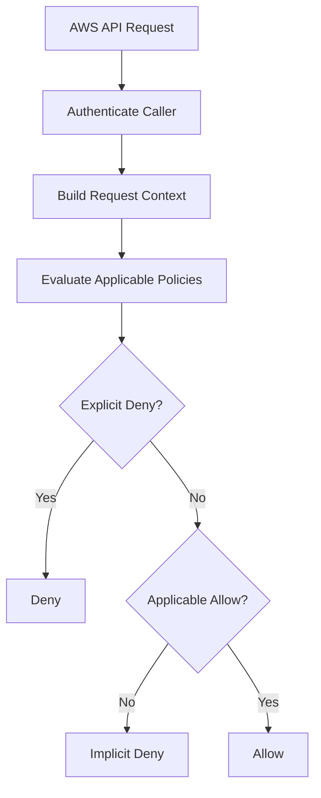
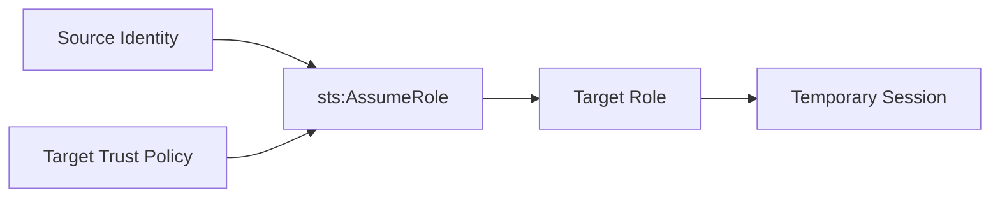
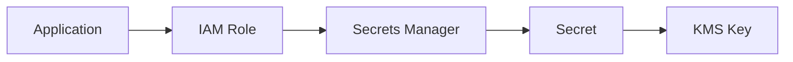
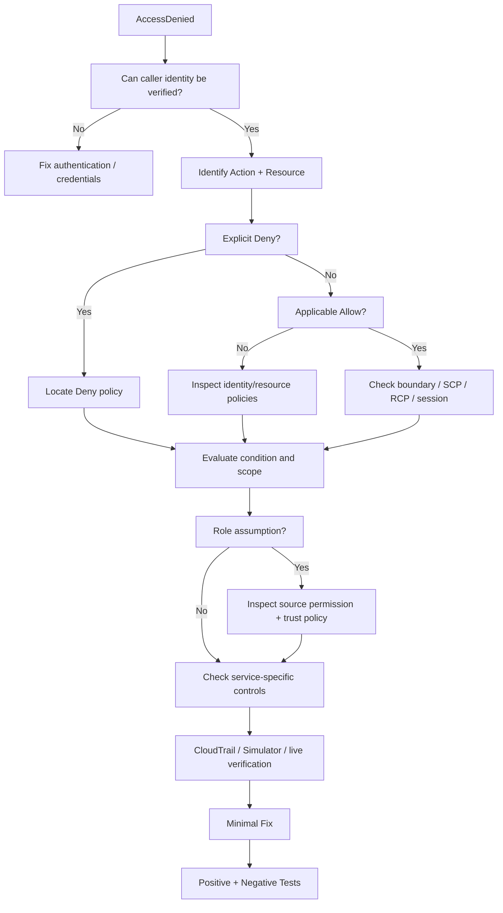

# 02- AccessDenied and Policy Evaluation Issues

## Overview

`AccessDenied` is one of the most common AWS IAM errors, but the error itself does not identify the entire authorization problem.

An AWS request can be denied because:

```text
No applicable Allow exists
        ↓
Implicit deny

An applicable Deny exists
        ↓
Explicit deny

A different policy layer limits the request
        ↓
SCP / RCP / permissions boundary / session policy

The caller cannot assume the required role
        ↓
Trust-policy or sts:AssumeRole failure

The request context does not satisfy a Condition
        ↓
Policy statement does not apply
```

AWS authorization evaluates the applicable request context against identity-based policies, resource-based policies, permissions boundaries, AWS Organizations SCPs and RCPs, session policies, and other applicable controls. An explicit deny overrides an allow. ([AWS policy evaluation logic](https://docs.aws.amazon.com/IAM/latest/UserGuide/reference_policies_evaluation-logic_policy-eval-denyallow.html))

The production objective is therefore not:

```text
"Make AccessDenied disappear."
```

It is:

```text
Determine why authorization failed
    ↓
Change only the required authorization control
    ↓
Verify the intended permission
    ↓
Verify unnecessary permissions remain denied
```

---

## AccessDenied Mental Model

Treat authorization as a decision over:

```text
Principal
    +
Action
    +
Resource
    +
Request Context
    +
Applicable Policies
    ↓
Allow / Deny
```

Example:

```text
Principal:
arn:aws:iam::123456789012:role/OrdersTaskRole

Action:
s3:GetObject

Resource:
arn:aws:s3:::company-orders-prod/orders/123.json

Context:
ap-south-1
VPC endpoint
Organization ID
Session tags

Policies:
Identity policy
Bucket policy
SCP
Permissions boundary
```

The final result is determined from the complete evaluation context, not just one attached policy.

---

## Authentication vs Authorization

Before analyzing `AccessDenied`, establish whether the caller is authenticated successfully.

### Authentication

```text
Can AWS identify the caller?
```

Examples of authentication failures:

```text
Unable to locate credentials
ExpiredToken
InvalidClientTokenId
SignatureDoesNotMatch
```

### Authorization

```text
The caller is identified.
Is this caller permitted to perform this action?
```

Typical result:

```text
AccessDenied
```

A valid role can therefore receive:

```text
Authentication:
    ✅

Authorization:
    ❌
```

The first diagnostic command should normally be:

```bash
aws sts get-caller-identity
```

For a specific profile:

```bash
aws sts get-caller-identity \
    --profile production
```

AWS documents `GetCallerIdentity` as the operation for determining the identity making the request. ([AWS CLI `get-caller-identity`](https://docs.aws.amazon.com/cli/latest/reference/sts/get-caller-identity.html))

---

## Capture the Exact Denial

Start with the complete error.

Example:

```text
An error occurred (AccessDenied) when calling the GetObject operation:
User: arn:aws:sts::123456789012:assumed-role/OrdersTaskRole/session
is not authorized to perform: s3:GetObject
on resource: arn:aws:s3:::company-orders-prod/orders/123.json
```

Extract:

```text
Principal
    arn:aws:sts::123456789012:assumed-role/OrdersTaskRole/session

Action
    s3:GetObject

Resource
    arn:aws:s3:::company-orders-prod/orders/123.json
```

Recent AWS error messages can sometimes identify the policy type responsible for the denial and, in supported cases, the policy ARN. The exact error format varies by service. ([AWS troubleshooting access denied](https://docs.aws.amazon.com/IAM/latest/UserGuide/troubleshoot_access-denied.html))

Do not discard the complete error message.

---

## Explicit Deny vs Implicit Deny

This distinction is fundamental.

### Implicit Deny

A request is implicitly denied when no applicable policy provides an allow.

Example:

```text
Request:
s3:DeleteObject

Policies:
s3:GetObject
s3:PutObject

No DeleteObject allow
    ↓
Implicit Deny
```

### Explicit Deny

A request is explicitly denied when an applicable policy contains:

```json
{
    "Effect": "Deny"
}
```

Example:

```text
Identity policy:
    Allow s3:GetObject

SCP:
    Deny s3:GetObject

Result:
    Explicit Deny
```

Explicit deny wins over allow. ([AWS policy evaluation logic](https://docs.aws.amazon.com/IAM/latest/UserGuide/reference_policies_evaluation-logic_policy-eval-denyallow.html))

---

## Authorization Decision Model



This is a useful operational mental model, although the exact evaluation behavior depends on the policy types and authorization context involved. ([AWS request context](https://docs.aws.amazon.com/IAM/latest/UserGuide/reference_policies_evaluation-logic_policy-eval-reqcontext.html))

---

## Policy Layers

A request may be affected by several policy types.

| Policy layer | Primary purpose |
|---|---|
| Identity-based policy | Grants permissions to users, groups, or roles |
| Resource-based policy | Grants access directly on supported resources |
| Permissions boundary | Limits maximum permissions of a user or role |
| SCP | Limits maximum permissions in an AWS Organization account/OU |
| RCP | Limits maximum permissions available to resources in an Organization account/OU |
| Session policy | Restricts permissions of a temporary session |
| Trust policy | Controls who can assume or federate into a role |

AWS documents these policy types as part of the request evaluation context. ([AWS request context](https://docs.aws.amazon.com/IAM/latest/UserGuide/reference_policies_evaluation-logic_policy-eval-reqcontext.html))

---

## The Most Common Evaluation Pattern

For a typical same-account role:

```text
Identity Policy
        +
Permissions Boundary
        +
SCP / RCP where applicable
        +
Resource Policy
        +
Session Policy
        +
Conditions
        ↓
Effective Authorization
```

An identity policy can contain the required allow and the request can still fail because another policy layer denies or limits it.

For example:

```text
Role policy:
    s3:GetObject
        ✅

Permissions boundary:
    s3:GetObject
        ❌

Result:
    AccessDenied
```

AWS documents permissions boundaries as maximum-permission controls rather than permission grants. ([AWS permissions boundaries](https://docs.aws.amazon.com/IAM/latest/UserGuide/access_policies_boundaries.html))

---

## Step-by-Step Troubleshooting Method

Use this sequence for most production `AccessDenied` investigations:

```text
1. Identify the caller.
2. Identify the action.
3. Identify the resource.
4. Determine whether authentication succeeded.
5. Inspect identity-based policies.
6. Inspect resource-based policies.
7. Look for explicit denies.
8. Check permissions boundaries.
9. Check SCPs and RCPs.
10. Check session policies.
11. Check trust policy if role assumption is involved.
12. Check policy conditions.
13. Check network / endpoint policy where applicable.
14. Check service-specific authorization.
15. Check CloudTrail and recent changes.
16. Simulate the policy where useful.
17. Apply the smallest safe fix.
18. Retest positive and negative access.
```

This prevents the common mistake of jumping directly to:

```text
Add a broader policy.
```

---

## Step One: Verify the Caller

Run:

```bash
aws sts get-caller-identity
```

For an application, inspect the identity from the runtime itself where possible.

Python:

```python
import boto3

sts = boto3.client("sts")
identity = sts.get_caller_identity()

print(identity["Arn"])
```

Compare:

```text
Expected role
vs
Actual role
```

This is especially important for:

```text
Local CLI
ECS
EKS
Lambda
EC2
CI/CD
Cross-account automation
```

---

## Common Wrong-Identity Scenario

Expected:

```text
OrdersTaskRole
```

Actual:

```text
DeveloperRole
```

or:

```text
arn:aws:sts::123456789012:assumed-role/OldDeploymentRole/session
```

The policy might be completely correct for the expected role and still irrelevant to the actual request.

The fix is:

```text
Correct credential source
```

not:

```text
Give the unexpected role more permissions.
```

---

## Step Two: Verify the Credential Source

For the AWS CLI:

```bash
aws configure list
```

Check:

```text
Profile
Access key source
Region
```

Also inspect environment variables:

```bash
env | grep '^AWS_'
```

PowerShell:

```powershell
Get-ChildItem Env:AWS*
```

Typical causes of unexpected credentials include:

```text
AWS_PROFILE
AWS_ACCESS_KEY_ID
AWS_SECRET_ACCESS_KEY
AWS_SESSION_TOKEN
IAM Identity Center session
AssumeRole profile
ECS credentials
EC2 instance profile
Web identity credentials
```

---

## Step Three: Identify the Exact Action

Do not troubleshoot a generic service.

Determine:

```text
s3:GetObject
```

rather than:

```text
S3 access
```

Determine:

```text
kms:Decrypt
```

rather than:

```text
KMS access
```

Determine:

```text
sts:AssumeRole
```

rather than:

```text
Role access
```

An IAM statement must match the requested action.

---

## Step Four: Identify the Exact Resource

Determine the actual resource ARN.

Example:

```text
s3:GetObject
    arn:aws:s3:::company-orders-prod/orders/123.json
```

Compare that with the policy:

```json
{
    "Effect": "Allow",
    "Action": "s3:GetObject",
    "Resource": "arn:aws:s3:::company-orders-prod/orders/*"
}
```

Questions:

```text
Does the ARN match?

Is the account correct?

Is the Region correct?

Is the resource type correct?

Is the prefix correct?

Is a wildcard required?

Does this action use a different resource ARN?
```

Incorrect resource scope is one of the most common IAM problems.

---

## S3 Resource Scope Example

These are different resources:

```text
arn:aws:s3:::company-orders-prod
```

and:

```text
arn:aws:s3:::company-orders-prod/*
```

For example:

```text
s3:ListBucket
    → bucket ARN

s3:GetObject
    → object ARN
```

A policy that grants object access does not automatically grant bucket listing.

This distinction is a frequent source of `AccessDenied`.

---

## Step Five: Inspect Identity-Based Policies

For a role:

```bash
aws iam list-attached-role-policies \
    --role-name OrdersTaskRole
```

Inline policies:

```bash
aws iam list-role-policies \
    --role-name OrdersTaskRole
```

For a user:

```bash
aws iam list-attached-user-policies \
    --user-name application-user
```

For a group:

```bash
aws iam list-attached-group-policies \
    --group-name ApplicationUsers
```

Then inspect the policy document.

For a customer-managed policy:

```bash
aws iam get-policy \
    --policy-arn arn:aws:iam::123456789012:policy/OrdersAccess
```

Get the default version:

```bash
aws iam get-policy \
    --policy-arn arn:aws:iam::123456789012:policy/OrdersAccess \
    --query 'Policy.DefaultVersionId'
```

Then:

```bash
aws iam get-policy-version \
    --policy-arn arn:aws:iam::123456789012:policy/OrdersAccess \
    --version-id v3
```

---

## What to Check in the Policy

Inspect:

```text
Effect
Action
Resource
Condition
```

Example:

```json
{
    "Effect": "Allow",
    "Action": "s3:GetObject",
    "Resource": "arn:aws:s3:::company-orders-prod/orders/*",
    "Condition": {
        "StringEquals": {
            "aws:PrincipalOrgID": "o-example"
        }
    }
}
```

The statement may appear correct until the condition is evaluated.

---

## Step Six: Inspect Resource-Based Policies

Resource policies can be just as important as identity policies.

Typical examples:

```text
S3 bucket policy
SQS queue policy
SNS topic policy
KMS key policy
Secrets Manager resource policy
```

S3:

```bash
aws s3api get-bucket-policy \
    --bucket company-orders-prod
```

SQS:

```bash
aws sqs get-queue-attributes \
    --queue-url <queue-url> \
    --attribute-names Policy
```

SNS:

```bash
aws sns get-topic-attributes \
    --topic-arn <topic-arn>
```

For a resource-based policy, inspect:

```text
Principal
Action
Resource
Condition
Effect
```

---

## Step Seven: Search for Explicit Denies

An explicit deny can exist outside the policy you were initially inspecting.

Search:

```text
Identity policies
Resource policies
Permissions boundary
SCP
RCP
Session policy
```

Example:

```json
{
    "Effect": "Deny",
    "Action": "s3:*",
    "Resource": "*",
    "Condition": {
        "StringNotEquals": {
            "aws:RequestedRegion": "ap-south-1"
        }
    }
}
```

If the request is made outside the permitted Region:

```text
Identity policy:
    Allow
        ↓
SCP / boundary:
    Explicit Deny
        ↓
Final:
    Deny
```

AWS explicitly states that a single applicable explicit deny produces a final deny. ([AWS enforcement logic](https://docs.aws.amazon.com/IAM/latest/UserGuide/reference_policies_evaluation-logic_policy-eval-denyallow.html))

---

## Step Eight: Check Permissions Boundaries

Inspect:

```bash
aws iam get-role \
    --role-name OrdersTaskRole \
    --query 'Role.PermissionsBoundary'
```

For users:

```bash
aws iam get-user \
    --user-name application-user \
    --query 'User.PermissionsBoundary'
```

If a boundary is attached, compare:

```text
Identity policy
vs
Boundary
```

The boundary does not grant permissions.

It defines the maximum permissions the principal can receive from identity-based policies. ([AWS permissions boundaries](https://docs.aws.amazon.com/IAM/latest/UserGuide/access_policies_boundaries.html))

---

## Permissions Boundary Failure

Example:

```text
Identity policy:
    secretsmanager:GetSecretValue
        ✅

Boundary:
    secretsmanager:GetSecretValue
        ❌

Result:
    AccessDenied
```

Adding:

```text
secretsmanager:GetSecretValue
```

again to the role policy does nothing.

The boundary must be changed, or the architecture must use a different principal.

AWS's AccessDenied documentation includes specific examples for both implicit and explicit permissions-boundary denials. ([AWS access denied troubleshooting](https://docs.aws.amazon.com/IAM/latest/UserGuide/troubleshoot_access-denied.html))

---

## Step Nine: Check SCPs

Production accounts are often governed by SCPs.

A typical hierarchy:

```text
AWS Organization
    ↓
OU
    ↓
AWS Account
    ↓
IAM Principal
```

An SCP can restrict actions such as:

```text
iam:CreateUser
iam:CreateAccessKey
ec2:TerminateInstances
s3:PutBucketPolicy
kms:ScheduleKeyDeletion
```

An SCP does not grant permissions. It limits the maximum permissions available to principals in affected accounts. ([AWS policy evaluation logic](https://docs.aws.amazon.com/IAM/latest/UserGuide/reference_policies_evaluation-logic.html))

---

## SCP Troubleshooting Pattern

If:

```text
Development
    ✅

Production
    ❌
```

compare:

```text
Account OU
SCP attachments
SCP conditions
Resource
Region
Tags
Principal
```

A production-only `AccessDenied` is often a reason to inspect Organizations controls early.

AWS access-denied errors may identify an SCP denial and can sometimes include the relevant policy ARN. ([AWS troubleshooting access denied](https://docs.aws.amazon.com/IAM/latest/UserGuide/troubleshoot_access-denied.html))

---

## Step Ten: Check Resource Control Policies

AWS Organizations **Resource Control Policies (RCPs)** are another authorization boundary for supported resources.

RCPs define maximum available permissions for resources in organizational accounts or OUs. ([AWS request context](https://docs.aws.amazon.com/IAM/latest/UserGuide/reference_policies_evaluation-logic_policy-eval-reqcontext.html))

This creates an additional troubleshooting dimension:

```text
Caller permissions
    +
Resource permissions
    +
RCP
```

When an error explicitly references an RCP, inspect the policy and its conditions rather than changing the caller's identity policy blindly.

AWS's current troubleshooting guidance includes explicit RCP denial examples. ([AWS access denied troubleshooting](https://docs.aws.amazon.com/IAM/latest/UserGuide/troubleshoot_access-denied.html))

---

## Step Eleven: Check Session Policies

Temporary credentials can have session policies.

Typical sources include:

```text
AssumeRole
Federation
STS-based integrations
Delegated automation
```

The role may contain:

```text
s3:GetObject
```

while the session is restricted by:

```text
Session policy:
    Allow only bucket A
```

Result:

```text
Role:
    ✅

Session:
    ❌

Effective:
    ❌
```

AWS documents session policies as restrictions applied to temporary sessions in addition to the permissions of the underlying IAM identity. ([AWS permissions boundaries](https://docs.aws.amazon.com/IAM/latest/UserGuide/access_policies_boundaries.html))

---

## Step Twelve: Check Trust Policy for AssumeRole Failures

If the denied operation is:

```text
sts:AssumeRole
```

inspect the target role's trust policy:

```bash
aws iam get-role \
    --role-name ProductionDeploymentRole \
    --query 'Role.AssumeRolePolicyDocument'
```

Check:

```text
Principal
Action
Condition
ExternalId
MFA
Organization constraints
OIDC claims
```

For cross-account assumptions, also inspect the source identity's permissions.

---

## Source Permission vs Trust Policy

For a role assumption:



Two different authorization questions exist:

```text
Can the source identity perform AssumeRole?

Does the target role trust the source principal?
```

A failure in either layer can produce `AccessDenied`.

---

## Step Thirteen: Check Conditions

Conditions frequently turn seemingly correct policies into implicit denies.

Common keys include:

```text
aws:PrincipalArn
aws:PrincipalOrgID
aws:RequestedRegion
aws:SourceIp
aws:MultiFactorAuthPresent
aws:SourceArn
aws:SourceAccount
aws:RequestTag/*
aws:ResourceTag/*
```

Example:

```json
{
    "Effect": "Allow",
    "Action": "secretsmanager:GetSecretValue",
    "Resource": "arn:aws:secretsmanager:ap-south-1:123456789012:secret:prod/*",
    "Condition": {
        "StringEquals": {
            "aws:PrincipalOrgID": "o-example"
        }
    }
}
```

If the principal does not satisfy the condition:

```text
Statement does not apply
    ↓
No matching allow
    ↓
Implicit deny
```

---

## Condition Operators Matter

Compare:

```json
"StringEquals"
```

with:

```json
"StringLike"
```

and:

```json
"ArnEquals"
```

with:

```json
"ArnLike"
```

A condition can fail because:

```text
Wrong key
Wrong value
Wrong operator
Wrong data type
Wrong case
Missing request key
Wrong ARN format
```

Do not remove conditions just to restore access.

Determine the intended security boundary first.

---

## Step Fourteen: Check Resource ARN Semantics

IAM resources can have different ARN formats.

Examples:

```text
S3 bucket:
arn:aws:s3:::company-orders-prod

S3 object:
arn:aws:s3:::company-orders-prod/orders/*

IAM role:
arn:aws:iam::123456789012:role/OrdersRole

Secrets Manager secret:
arn:aws:secretsmanager:ap-south-1:123456789012:secret:orders/*
```

A malformed or incorrectly scoped ARN can turn an apparently valid `Allow` into an implicit deny.

---

## Step Fifteen: Check Service-Specific Authorization

Some services add another policy or control layer.

Examples:

```text
S3
    IAM + bucket policy + endpoint policy where applicable

KMS
    IAM + key policy + grants + encryption context

Secrets Manager
    IAM + resource policy + KMS when applicable

SQS
    IAM + queue policy + endpoint policy where applicable
```

The troubleshooting workflow must follow the actual service architecture.

---

## KMS `AccessDenied`

A common scenario:

```text
Role policy:
    kms:Decrypt
        ✅

KMS key policy:
    Does not allow caller
        ❌

Result:
    AccessDenied
```

Also check:

```text
Key state
Key Region
Encryption context
Grants
Cross-account ownership
```

Do not conclude that KMS is authorized solely because an IAM role policy contains `kms:Decrypt`.

---

## Secrets Manager `AccessDenied`

Typical flow:



Potential authorization failures include:

```text
secretsmanager:GetSecretValue missing
Secret resource policy denies
KMS decrypt missing
KMS key policy denies
Wrong secret ARN
Wrong Region
SCP / RCP denies
```

Trace the entire chain.

---

## S3 `AccessDenied`

For:

```text
aws s3 cp
```

first identify whether the operation is:

```text
List
Get
Put
Delete
Head
```

Then check:

```text
IAM policy
Bucket policy
Object ownership / access model
KMS permissions if encrypted
VPC endpoint policy if applicable
SCP / RCP
Requested resource ARN
```

Do not automatically add:

```json
"s3:*"
```

to solve a single `GetObject` failure.

---

## ECS `AccessDenied`

Distinguish:

```text
ECS execution role
```

from:

```text
ECS task role
```

If the container starts successfully but application code receives:

```text
AccessDenied
```

inspect the task role first.

Example:

```text
FastAPI
    ↓
boto3
    ↓
ECS task role
    ↓
s3:GetObject
```

The developer's local profile is not relevant to the production task unless the container is explicitly configured to use it.

---

## EKS `AccessDenied`

For EKS:

```text
Pod
    ↓
Workload identity
    ↓
IAM role
    ↓
AWS API
```

Check:

```text
Kubernetes service account
Workload identity configuration
IAM role ARN
Trust policy
Role permissions
SCP / boundary
```

The most useful identity question is:

```text
Which IAM principal does the pod actually become?
```

---

## Lambda `AccessDenied`

Distinguish:

```text
Lambda control-plane caller
```

from:

```text
Lambda execution role
```

Example:

```text
DeploymentRole
    ↓
lambda:UpdateFunctionCode
        ✅

OrdersLambdaExecutionRole
    ↓
secretsmanager:GetSecretValue
        ❌
```

A successful deployment does not guarantee that the Lambda execution role has the runtime permissions it needs.

---

## CloudFormation `AccessDenied`

CloudFormation can perform operations using a service role.

Inspect:

```text
Caller
CloudFormation service role
Service role trust policy
Service role permissions
iam:PassRole
SCP / RCP
Resource-specific authorization
```

A deployment failure may therefore be caused by:

```text
CI role
```

or:

```text
CloudFormation service role
```

or:

```text
Target resource policy
```

---

## Step Sixteen: Check VPC Endpoint Policies

A private workload may access AWS services through VPC endpoints.

Example:

```text
ECS
    ↓
VPC Endpoint
    ↓
S3
```

An endpoint policy can restrict the available access.

If:

```text
Public / NAT path
    ✅

Private subnet path
    ❌
```

inspect:

```text
VPC endpoint policy
IAM policy
Resource policy
Route configuration
```

AWS's IAM troubleshooting guidance identifies VPC endpoint policies as a possible cause of access-denied errors. ([AWS access denied troubleshooting](https://docs.aws.amazon.com/IAM/latest/UserGuide/troubleshoot_access-denied.html))

---

## Step Seventeen: Inspect CloudTrail

CloudTrail helps determine what actually happened.

Useful events include:

```text
AssumeRole
AssumeRoleWithWebIdentity
PassRole
GetObject
PutObject
GetSecretValue
Decrypt
CreateRole
PutRolePolicy
CreatePolicyVersion
SetDefaultPolicyVersion
```

Inspect:

```text
Event name
Principal
Account
Region
Source IP
User agent
Request parameters
Response
Error code
```

The important distinction is:

```text
IAM policy
    tells you what can be allowed

CloudTrail
    tells you what was actually requested
```

---

## Step Eighteen: Check Recent Changes

When an operation worked previously:

```text
Yesterday:
    ✅

Today:
    ❌
```

look for:

```text
Policy version change
Role trust change
SCP change
RCP change
Boundary change
Resource policy change
Deployment
OIDC trust change
Permission-set change
Credential rotation
KMS key-policy change
VPC endpoint change
```

Use:

```text
CloudTrail
+
IaC history
+
Git history
```

to identify the regression.

---

## Step Nineteen: Compare Working and Failing Environments

A strong debugging technique is differential analysis.

```text
Working environment
        vs
Failing environment
```

Compare:

| Dimension | Working | Failing |
|---|---|---|
| Principal | `OrdersDevRole` | `OrdersProdRole` |
| Policy version | `v8` | `v7` |
| Boundary | `AppBoundary` | `ProdBoundary` |
| SCP | Standard | Restricted |
| Resource policy | Internal | Cross-account |
| Endpoint | NAT | VPC endpoint |
| Region | `ap-south-1` | `ap-south-1` |
| KMS key | Key A | Key B |

The difference often exposes the failure faster than reviewing the failing environment independently.

---

## Step Twenty: Use the IAM Policy Simulator

For an existing role:

```bash
aws iam simulate-principal-policy \
    --policy-source-arn arn:aws:iam::123456789012:role/OrdersTaskRole \
    --action-names s3:GetObject \
    --resource-arns arn:aws:s3:::company-orders-prod/orders/123.json
```

The simulator evaluates the supplied principal's policies and reports decisions such as:

```text
allowed
implicitDeny
explicitDeny
```

It can also show matched statements and missing context values. ([AWS CLI `simulate-principal-policy`](https://docs.aws.amazon.com/cli/latest/reference/iam/simulate-principal-policy.html))

---

## Simulate Multiple Actions

```bash
aws iam simulate-principal-policy \
    --policy-source-arn arn:aws:iam::123456789012:role/OrdersTaskRole \
    --action-names \
        s3:GetObject \
        s3:PutObject \
        s3:DeleteObject \
    --resource-arns \
        arn:aws:s3:::company-orders-prod/orders/*
```

This is useful for regression testing:

```text
Required:
    GetObject → Allow

Required:
    PutObject → Allow

Unwanted:
    DeleteObject → Deny
```

The goal is not just to confirm an allow.

It is also to preserve intended denies.

---

## Simulating Policy Conditions

If a policy uses conditions, provide the relevant context during simulation where supported.

Example:

```bash
aws iam simulate-principal-policy \
    --policy-source-arn arn:aws:iam::123456789012:role/OrdersRole \
    --action-names s3:GetObject \
    --resource-arns arn:aws:s3:::company-orders-prod/orders/123.json \
    --context-entries \
        ContextKeyName=aws:RequestedRegion,ContextKeyValues=ap-south-1,ContextKeyType=string
```

Context keys may be:

```text
string
stringList
numeric
boolean
date
ip
binary
```

AWS documents context entries as inputs to policy simulation for evaluating `Condition` elements. ([AWS CLI `simulate-principal-policy`](https://docs.aws.amazon.com/cli/latest/reference/iam/simulate-principal-policy.html))

---

## Policy Simulator Limitations

The policy simulator is valuable but not a perfect reproduction of every live AWS authorization path.

AWS explicitly notes that simulation results can differ from the live environment and recommends validating the final result against the actual AWS environment. ([AWS CLI `simulate-principal-policy`](https://docs.aws.amazon.com/cli/latest/reference/iam/simulate-principal-policy.html))

Be especially careful with:

```text
Complex resource-based policies
Cross-account behavior
Role sessions
VPC endpoint policies
Missing request context
Service-specific authorization
```

Use:

```text
Simulation
+
Live verification
```

rather than simulation alone.

---

## Simulate Custom Policies

For a policy under development:

```bash
aws iam simulate-custom-policy \
    --policy-input-list file://orders-policy.json \
    --action-names s3:GetObject \
    --resource-arns arn:aws:s3:::company-orders-prod/orders/123.json
```

This is useful for:

```text
Pull requests
CI/CD
Policy design
Infrastructure-as-code
Least-privilege reviews
```

The simulator checks authorization decisions without executing the underlying AWS API operation. ([AWS CLI `simulate-custom-policy`](https://docs.aws.amazon.com/cli/latest/reference/iam/simulate-custom-policy.html))

---

## Access Troubleshooter With Authorization IDs

AWS provides an authorization-ID based troubleshooting capability in public preview for supported access-denied errors.

When an AccessDenied response includes an authorization ID, it can be used to retrieve details about:

```text
Request context
Evaluation
Policies evaluated
Matched statements
Policy types
```

Evaluation results can include:

```text
ALLOW
EXPLICIT_DENY
IMPLICIT_DENY
```

AWS states that authorization IDs are not guaranteed for every denied request and that the related authorization details are retained for 24 hours. ([AWS Access Troubleshooter](https://docs.aws.amazon.com/IAM/latest/UserGuide/troubleshoot_access-denied-authorization-id.html))

---

## Authorization Details Workflow

```text
AccessDenied
    ↓
Authorization ID available?
    ↓
Yes
    ↓
GetRequestAuthorizationDetails
    ↓
Inspect:
    - Request context
    - Policies evaluated
    - Evaluation results
    - Matched statements
```

This can be particularly useful when the reason is not obvious from the client-side error alone.

---

## AccessDenied Decision Matrix

| Symptom | Likely area |
|---|---|
| No credentials found | Credential provider |
| Token expired | Temporary credentials |
| Invalid client token | Access key / credential source |
| `AssumeRole` denied | Source policy + trust policy |
| Action explicitly denied | Deny statement |
| "No identity policy allows" | Missing identity allow |
| "No permissions boundary allows" | Permissions boundary |
| SCP explicitly denied | SCP |
| RCP explicitly denied | RCP |
| Same role, different account result | SCP / RCP / resource policy / environment |
| CLI works, application fails | Different runtime identity |
| ECS starts, application fails | Task role |
| Lambda deploys, function fails | Execution role |
| EKS pod fails AWS call | Workload identity / role |
| Private subnet only fails | VPC endpoint / network path |
| KMS only fails | Key policy / grants / encryption context |
| S3 object fails but listing works | Object permission / ARN scope |
| S3 listing fails but object read works | `s3:ListBucket` / bucket ARN |
| Works until policy change | Policy version / deployment / guardrail |

---

## Common Policy Evaluation Problems

### Missing Allow

```text
Role:
    s3:GetObject

Request:
    s3:PutObject

Result:
    Implicit Deny
```

### Explicit Deny

```text
Role:
    Allow s3:GetObject

SCP:
    Deny s3:GetObject

Result:
    Explicit Deny
```

### Boundary Restriction

```text
Role:
    Allow secretsmanager:GetSecretValue

Boundary:
    Does not allow secretsmanager:GetSecretValue

Result:
    Deny
```

### Condition Mismatch

```text
Action:
    secretsmanager:GetSecretValue

Condition:
    aws:PrincipalOrgID = o-example

Actual:
    Different organization

Result:
    Statement does not apply
```

### Wrong Resource

```text
Policy:
    bucket-A/*

Request:
    bucket-B/object.txt

Result:
    Implicit Deny
```

---

## IAM Role vs Resource Policy Cases

The policy evaluation behavior can differ based on whether the caller is:

```text
IAM user
IAM role
Federated user
Assumed role session
```

and whether the target access is:

```text
Same account
Cross-account
Resource-based
Identity-based
```

Do not apply a simple rule like:

```text
"Both policies must always allow."
```

AWS's evaluation logic has important differences depending on the principal and policy type. ([AWS policy evaluation logic](https://docs.aws.amazon.com/IAM/latest/UserGuide/reference_policies_evaluation-logic_policy-eval-denyallow.html))

Senior-level troubleshooting should use the actual request context and policy types rather than memorized simplifications.

---

## Cross-Account AccessDenied

Consider:

```text
Account A
    OrdersRole
        |
        | AssumeRole
        v
Account B
    ProductionRole
```

For the role assumption step, inspect:

```text
Account A source permissions
Account B target trust policy
```

For resource access after assuming:

```text
Account B role permissions
Target resource policy
SCP / RCP
Permissions boundary
Session policy
```

The two phases should be troubleshot separately:

```text
Phase 1:
AssumeRole

Phase 2:
Access target resource
```

---

## Cross-Account Resource Access

A common mistake is:

```text
Account A role policy:
    s3:GetObject
        ✅

Therefore:
    Access must work
```

Not necessarily.

The target resource may also have:

```text
Bucket policy
RCP
KMS key policy
SCP
Condition
```

The resource owner controls important parts of the authorization boundary.

---

## `iam:PassRole` AccessDenied

For:

```text
iam:PassRole
```

inspect:

```text
Source role policy
Target role ARN
Condition
iam:PassedToService
SCP
Permissions boundary
```

Example restrictive policy:

```json
{
    "Version": "2012-10-17",
    "Statement": [
        {
            "Sid": "PassOrdersTaskRole",
            "Effect": "Allow",
            "Action": "iam:PassRole",
            "Resource": "arn:aws:iam::123456789012:role/OrdersTaskRole",
            "Condition": {
                "StringEquals": {
                    "iam:PassedToService": "ecs-tasks.amazonaws.com"
                }
            }
        }
    ]
}
```

If the caller receives `AccessDenied`, verify both the role ARN and service condition.

---

## `sts:AssumeRole` AccessDenied

For role assumption:

```bash
aws sts assume-role \
    --role-arn arn:aws:iam::210987654321:role/ProductionReadOnly \
    --role-session-name troubleshooting
```

If denied, inspect:

```text
Caller identity
Source permission
Target trust policy
ExternalId if required
MFA if required
Organization conditions
SCP
```

Do not add the target role's permissions to the source identity as a troubleshooting shortcut.

The failure is often in the trust relationship.

---

## AccessDenied From IAM APIs

IAM administration can fail for the same reasons.

Example:

```bash
aws iam attach-role-policy \
    --role-name OrdersRole \
    --policy-arn arn:aws:iam::aws:policy/ReadOnlyAccess
```

Possible causes:

```text
Caller lacks iam:AttachRolePolicy
Explicit SCP deny
Permissions boundary
Session restriction
Resource scope restriction
```

For IAM administration, also consider privilege-escalation risk.

A failed IAM operation should not automatically result in broad IAM permissions.

---

## Troubleshooting Production IAM Changes

When a policy change is intended:

```text
1. Identify the exact requested permission.
2. Identify the exact resource.
3. Validate the policy syntax.
4. Validate resource scope.
5. Check organization guardrails.
6. Deploy through IaC.
7. Verify live policy state.
8. Run a targeted authorization test.
9. Run negative authorization tests.
10. Monitor CloudTrail.
```

This converts IAM troubleshooting into a repeatable deployment discipline.

---

## Avoid the "Add `*`" Fix

Bad troubleshooting:

```json
{
    "Effect": "Allow",
    "Action": "*",
    "Resource": "*"
}
```

or:

```json
{
    "Effect": "Allow",
    "Action": "s3:*",
    "Resource": "*"
}
```

just because:

```text
s3:GetObject
```

failed.

This masks the actual problem.

Prefer:

```text
Correct action
+
Correct resource
+
Correct condition
```

with the smallest required authorization scope.

---

## Troubleshooting and Privilege Escalation

IAM troubleshooting can accidentally introduce privilege escalation.

For example:

```text
DeveloperRole
    ↓
AccessDenied
    ↓
Grant iam:AttachRolePolicy
    ↓
Developer can modify privileged roles
```

The "fix" creates a larger security problem.

Before adding IAM administration permissions, ask:

```text
Does this permission modify authorization objects?

Can it modify a privileged role?

Can it change a trust policy?

Can it pass a privileged role?

Can it modify a customer-managed policy?
```

See:

[06- IAM Privilege Escalation Paths](../../05- Security/09- IAM/06-%20IAM%20Privilege%20Escalation%20Paths.md)

---

## Backend Engineering Example

Consider an ECS-hosted FastAPI service:

```text
FastAPI
    ↓
ECS Task
    ↓
OrdersTaskRole
    ↓
S3 GetObject
```

The application reports:

```text
AccessDenied on GetObject
```

A poor response:

```text
Attach AmazonS3FullAccess
```

A better investigation:

```text
1. Identify task role.

2. Verify:
   aws sts get-caller-identity

3. Inspect OrdersTaskRole.

4. Verify s3:GetObject exists.

5. Verify object ARN matches.

6. Check bucket policy.

7. Check KMS if object uses SSE-KMS.

8. Check SCP / boundary / RCP.

9. Check VPC endpoint policy if applicable.

10. Simulate the role policy.

11. Test the exact object.

12. Verify DeleteObject remains denied.
```

The result should be a minimal fix, not a broad role expansion.

---

## Python / Boto3 Runtime Identity Test

A useful diagnostic endpoint should generally **not** expose IAM identity information to arbitrary clients.

For internal diagnostics, prefer logging the caller identity securely:

```python
import boto3
import logging

logger = logging.getLogger(__name__)

sts = boto3.client("sts")

identity = sts.get_caller_identity()

logger.info(
    "AWS runtime identity: account=%s arn=%s",
    identity["Account"],
    identity["Arn"],
)
```

Avoid returning the ARN, account information, or credential details through public REST or gRPC endpoints.

---

## Docker Runtime Identity

For containers:

```text
Container
    ↓
AWS credential provider
    ↓
Task / workload role
```

When the container fails:

```text
AccessDenied
```

verify the runtime identity from inside the container rather than from the engineer's workstation.

For example:

```bash
aws sts get-caller-identity
```

or using the application's SDK.

This prevents troubleshooting the wrong identity.

---

## CI/CD Runtime Identity

A CI job should expose:

```text
Expected:
DeploymentRole
```

Verify:

```bash
aws sts get-caller-identity
```

Then inspect:

```text
Role trust policy
Role permissions
OIDC conditions
SCP
Permissions boundary
Session policy
```

The CI identity should not be "fixed" by storing a more privileged static access key.

---

## Monitoring and Alerting

IAM-related operational monitoring should focus on:

```text
Repeated AccessDenied
Unexpected role assumption failures
Unexpected IAM policy changes
Unexpected trust-policy changes
PassRole usage
Changes to SCPs
Changes to permissions boundaries
Changes to resource policies
Changes to KMS key policies
```

CloudTrail should be used to investigate:

```text
Who changed authorization?
When?
From where?
Which resource?
What policy changed?
```

---

## Reliability Considerations

Avoid coupling application availability to ad hoc IAM changes.

For production systems:

```text
Policy changes
    ↓
IaC
    ↓
Review
    ↓
Validation
    ↓
Deployment
```

rather than:

```text
Production AccessDenied
    ↓
Manual console edits
    ↓
Multiple unknown changes
```

Emergency changes should still be:

```text
Minimal
Auditable
Reversible
Documented
```

---

## Disaster Recovery Considerations

IAM failures can affect disaster-recovery workflows when:

```text
DR roles
Backup roles
Replication roles
KMS keys
Cross-account backup accounts
S3 replication
```

are involved.

A role that appears unused during normal operations may be essential to disaster recovery.

Therefore, when diagnosing unused or denied access for DR identities, consider:

```text
Normal operation
+
Scheduled operation
+
Emergency operation
```

before removing permissions.

---

## IAM Troubleshooting Checklist

```text
Caller
    □ What principal is actually making the request?
    □ What AWS account is involved?
    □ Is the credential source expected?

Request
    □ What exact API action failed?
    □ What exact resource ARN was targeted?
    □ What Region is involved?

Identity Policy
    □ Is an Allow present?
    □ Does Action match?
    □ Does Resource match?
    □ Do Conditions match?

Resource Policy
    □ Is there a resource policy?
    □ Does its Principal match?
    □ Does its Action match?
    □ Does its Condition match?

Explicit Deny
    □ Identity policy?
    □ Resource policy?
    □ Boundary?
    □ SCP?
    □ RCP?
    □ Session policy?

Trust
    □ Is AssumeRole involved?
    □ Does the target role trust the caller?
    □ Are trust conditions satisfied?

Runtime
    □ EC2 instance role?
    □ ECS task role?
    □ EKS workload identity?
    □ Lambda execution role?
    □ CI/CD OIDC role?

Network
    □ VPC endpoint policy?
    □ Correct AWS endpoint?
    □ Correct Region?

Diagnostics
    □ CloudTrail?
    □ Policy Simulator?
    □ Access Analyzer?
    □ Authorization ID available?

Resolution
    □ Smallest required permission?
    □ No unnecessary privilege added?
    □ Positive test passes?
    □ Negative test still fails?
    □ Change documented?
```

---

## Senior-Level Decision Tree



---

## Common Mistakes

| Mistake | Why it happens | Better approach |
|---|---|---|
| Adding `AdministratorAccess` | Fastest apparent fix | Diagnose exact authorization path |
| Checking only one policy | IAM has many policy layers | Inspect complete request context |
| Ignoring `Deny` | Focus remains on missing `Allow` | Search all applicable explicit denies |
| Forgetting SCPs | Account policy is not visible in role | Check Organizations controls |
| Forgetting RCPs | Newer resource-level guardrail is overlooked | Check RCP when relevant |
| Ignoring permissions boundaries | Boundary is not a normal attached policy | Inspect entity boundary explicitly |
| Ignoring session policies | Temporary credentials hide additional restrictions | Inspect how the session was created |
| Troubleshooting wrong role | CLI and workload use different identities | Verify caller identity from the failing runtime |
| Assuming trust policy grants permissions | Trust controls role entry, not role actions | Separate trust and permission policies |
| Assuming identity policy is enough for resource access | Resource policies and service controls matter | Inspect the full authorization graph |
| Ignoring conditions | Policy statement appears correct | Evaluate request context |
| Using only policy simulation | Simulator may differ from live behavior | Validate against live AWS state |
| Fixing production through repeated manual edits | Faster during incidents | Use controlled, auditable changes |
| Forgetting negative tests | Fix may grant too much | Test required allows and required denies |

---

## Interview Traps

### "If there is an Allow, why can AWS still return AccessDenied?"

Because an applicable explicit deny or another restrictive authorization layer can override or limit the allow.

Potential layers include:

```text
Resource policy
Permissions boundary
SCP
RCP
Session policy
Condition
```

### "Does every policy need an Allow?"

No.

The important question is whether the applicable policy evaluation produces an authorization allow after all relevant policy types and explicit denies are considered.

### "Can an SCP grant access?"

No.

SCPs constrain the maximum permissions available to principals in affected accounts; they do not grant permissions. ([AWS IAM policy evaluation logic](https://docs.aws.amazon.com/IAM/latest/UserGuide/reference_policies_evaluation-logic.html))

### "Does an IAM role trust policy determine what the role can do?"

No.

The trust policy determines who or what can assume the role. The permission policies attached to the role determine what the role can do once assumed.

### "The IAM Policy Simulator says Allow. Why does production still fail?"

Because the simulator may not reproduce every live authorization condition or policy context. AWS explicitly recommends verifying simulated results against the live environment. ([AWS CLI `simulate-principal-policy`](https://docs.aws.amazon.com/cli/latest/reference/iam/simulate-principal-policy.html))

### "The CLI works but my application gets AccessDenied."

The application may be using:

```text
A different role
A different account
A different credential source
A different Region
A different session policy
```

Always compare runtime identities first.

---

## Production AccessDenied Runbook

```text
Incident detected
    ↓
Capture complete error
    ↓
Identify caller
    ↓
Identify action/resource
    ↓
Check authentication
    ↓
Search explicit denies
    ↓
Check applicable allows
    ↓
Check conditions
    ↓
Check boundary / SCP / RCP / session
    ↓
Check trust / cross-account
    ↓
Check service-specific authorization
    ↓
Check CloudTrail
    ↓
Compare last-known-good state
    ↓
Apply minimum safe change
    ↓
Retest exact operation
    ↓
Verify negative access
    ↓
Document root cause
```

This runbook should be standardized for:

```text
Platform Engineering
Cloud Engineering
SRE
Security Engineering
Backend Engineering
CI/CD teams
```

---

## AWS Documentation Links

- [Troubleshoot Access Denied Errors](https://docs.aws.amazon.com/IAM/latest/UserGuide/troubleshoot_access-denied.html)
- [Access Troubleshooter With Authorization ID](https://docs.aws.amazon.com/IAM/latest/UserGuide/troubleshoot_access-denied-authorization-id.html)
- [IAM Policy Evaluation Logic](https://docs.aws.amazon.com/IAM/latest/UserGuide/reference_policies_evaluation-logic.html)
- [How AWS Enforcement Code Evaluates Requests](https://docs.aws.amazon.com/IAM/latest/UserGuide/reference_policies_evaluation-logic_policy-eval-denyallow.html)
- [Processing the Request Context](https://docs.aws.amazon.com/IAM/latest/UserGuide/reference_policies_evaluation-logic_policy-eval-reqcontext.html)
- [Permissions Boundaries](https://docs.aws.amazon.com/IAM/latest/UserGuide/access_policies_boundaries.html)
- [IAM Policy Simulator](https://docs.aws.amazon.com/IAM/latest/UserGuide/access_policies_testing-policies.html)
- [AWS CLI `simulate-principal-policy`](https://docs.aws.amazon.com/cli/latest/reference/iam/simulate-principal-policy.html)
- [AWS CLI `simulate-custom-policy`](https://docs.aws.amazon.com/cli/latest/reference/iam/simulate-custom-policy.html)
- [AWS CLI `get-caller-identity`](https://docs.aws.amazon.com/cli/latest/reference/sts/get-caller-identity.html)
- [AWS CLI Global Options](https://docs.aws.amazon.com/cli/latest/userguide/cli-configure-options.html)
- [AWS CloudTrail User Guide](https://docs.aws.amazon.com/awscloudtrail/latest/userguide/)
- [IAM Access Analyzer](https://docs.aws.amazon.com/IAM/latest/UserGuide/what-is-access-analyzer.html)
- [AWS Organizations Service Control Policies](https://docs.aws.amazon.com/organizations/latest/userguide/orgs_manage_policies_scps.html)
- [AWS Organizations Resource Control Policies](https://docs.aws.amazon.com/organizations/latest/userguide/orgs_manage_policies_rcps.html)

## Key Takeaways

- **Treat `AccessDenied` as an authorization-evaluation problem:** identify the actual principal, exact action, exact resource, and request context before changing permissions.
- **Explicit deny and implicit deny are different:** an explicit deny overrides allows, while an implicit deny means no applicable policy provided the required allow.
- **Inspect the complete policy stack:** identity policies, resource policies, permissions boundaries, SCPs, RCPs, session policies, trust policies, and conditions can all materially affect the result.
- **Use evidence instead of privilege expansion:** CloudTrail, IAM Policy Simulator, Access Analyzer, authorization details, and live policy inspection are more reliable than adding broad permissions until the request succeeds.
- **A production fix must preserve least privilege:** grant only the required action and resource, verify the original operation succeeds, and confirm unrelated sensitive actions remain denied.