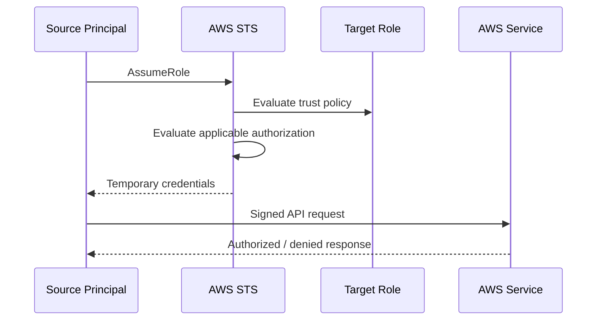
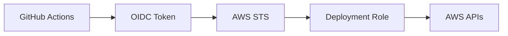
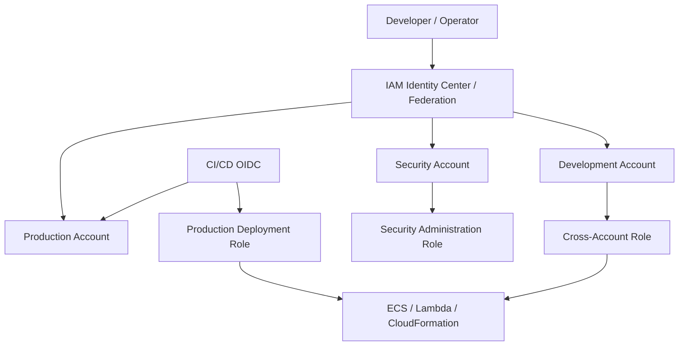

# 03- AssumeRole and Trust Policy Errors

## Overview

`sts:AssumeRole` is the standard AWS mechanism for obtaining temporary credentials for an IAM role.

A role-assumption request crosses an authorization boundary:

```text
Source Principal
    |
    | sts:AssumeRole
    v
Target IAM Role
    |
    | temporary credentials
    v
AWS APIs
```

The source principal does not automatically receive the target role's permissions. AWS first determines whether the principal is allowed to establish the role session. The target role's **trust policy** controls who or what is trusted to assume it, while the role's **permissions policies** determine what the resulting session can do.

For cross-account role assumption, both sides of the relationship matter:

```text
Trusted Account
    |
    | identity authorization
    v
sts:AssumeRole
    |
    | target trust relationship
    v
Trusting Account
    |
    v
Target Role
```

AWS documents that role assumption can fail because the caller is not authorized to call `AssumeRole`, because the target trust policy does not allow the caller, or because trust-policy conditions such as MFA, external ID, IP restrictions, or other contextual requirements are not satisfied. ([AWS Troubleshoot IAM roles](https://docs.aws.amazon.com/IAM/latest/UserGuide/troubleshoot_roles.html))

---

## What AssumeRole Does

`AssumeRole` asks AWS STS to issue temporary security credentials for an IAM role.

The response contains:

```text
AccessKeyId
SecretAccessKey
SessionToken
Expiration
```

The resulting identity is a role session:

```text
arn:aws:sts::123456789012:assumed-role/OrdersRole/backend-session
```

The process is:



The credentials are temporary and are intended to be used for the duration of the role session.

AWS documents `AssumeRole` as returning temporary security credentials for access to AWS resources. ([AWS STS `AssumeRole`](https://docs.aws.amazon.com/STS/latest/APIReference/API_AssumeRole.html))

---

## Trust Policy vs Permission Policy

This distinction should be automatic when troubleshooting IAM roles.

| Policy | Answers |
|---|---|
| Trust policy | Who can assume the role? |
| Permission policy | What can the role do? |

Example trust policy:

```json
{
    "Version": "2012-10-17",
    "Statement": [
        {
            "Sid": "TrustOrdersDeploymentRole",
            "Effect": "Allow",
            "Principal": {
                "AWS": "arn:aws:iam::123456789012:role/OrdersDeploymentRole"
            },
            "Action": "sts:AssumeRole"
        }
    ]
}
```

Example permission policy:

```json
{
    "Version": "2012-10-17",
    "Statement": [
        {
            "Sid": "ReadOrders",
            "Effect": "Allow",
            "Action": [
                "s3:GetObject"
            ],
            "Resource": "arn:aws:s3:::company-orders-prod/orders/*"
        }
    ]
}
```

The first controls entry into the role.

The second controls what happens after entry.

---

## A Role Has Two Security Boundaries

Think of a role as having:

```text
                 IAM Role
                    |
        +-----------+-----------+
        |                       |
        v                       v
   Trust Policy           Permission Policies
        |                       |
   Who may enter?          What can they do?
```

A secure role needs both sides to be correct.

A role can have:

```text
Perfect permissions
+
Broken trust
=
Cannot be assumed
```

Or:

```text
Perfect trust
+
Missing permissions
=
Can be assumed, but cannot perform required actions
```

This distinction eliminates a large class of troubleshooting errors.

---

## Trust Policy Is a Resource-Based Policy

An IAM role's trust policy is the resource-based policy associated with the role.

AWS documents that the role trust policy specifies the principals allowed to assume the role. ([AWS role trust policies](https://docs.aws.amazon.com/IAM/latest/UserGuide/id_roles_create_for-user.html))

This matters because role assumption is not modeled as:

```text
Caller permission only
```

It is a relationship involving:

```text
Source principal
+
Target role trust policy
```

For cross-account access, the target trust relationship and the source authorization must both be considered. ([AWS cross-account policy evaluation](https://docs.aws.amazon.com/IAM/latest/UserGuide/reference_policies_evaluation-logic-cross-account.html))

---

## Basic Role-Assumption Flow

For a same-account role:

```text
IAM User / Role
    |
    +-- sts:AssumeRole authorization
    |
    v
Target Role Trust Policy
    |
    +-- trusts caller
    |
    v
Temporary Role Session
```

For cross-account access:

```text
Account A
    Source Principal
        |
        | AssumeRole
        v
Account B
    Target Role
        |
        | Trust Policy
        v
Temporary Credentials
```

The cross-account relationship creates an explicit security boundary between the two accounts.

---

## Direct CLI AssumeRole

Example:

```bash
aws sts assume-role \
    --role-arn arn:aws:iam::210987654321:role/ProductionReadOnly \
    --role-session-name production-readonly
```

A successful response contains credentials similar to:

```json
{
    "Credentials": {
        "AccessKeyId": "ASIA...",
        "SecretAccessKey": "...",
        "SessionToken": "...",
        "Expiration": "2026-09-18T15:00:00Z"
    },
    "AssumedRoleUser": {
        "AssumedRoleId": "AROA...:production-readonly",
        "Arn": "arn:aws:sts::210987654321:assumed-role/ProductionReadOnly/production-readonly"
    }
}
```

Do not place the returned credentials in source control, shell history, tickets, or shared logs.

For normal CLI workflows, a profile-based role configuration is generally preferable because the CLI manages the temporary session for you.

---

## CLI Role Profile

A role profile can be defined in `~/.aws/config`:

```ini
[profile production]
role_arn = arn:aws:iam::210987654321:role/ProductionReadOnly
source_profile = development
region = ap-south-1
```

Then:

```bash
aws sts get-caller-identity \
    --profile production
```

The CLI performs the role assumption and uses temporary credentials for subsequent commands.

This avoids manually exporting:

```text
AWS_ACCESS_KEY_ID
AWS_SECRET_ACCESS_KEY
AWS_SESSION_TOKEN
```

AWS documents `source_profile` and `role_arn` as the standard profile configuration for role assumption. ([AWS CLI role configuration](https://docs.aws.amazon.com/cli/latest/userguide/cli-configure-role.html))

---

## Verify the Assumed Identity

After assuming a role:

```bash
aws sts get-caller-identity \
    --profile production
```

Expected result:

```json
{
    "Account": "210987654321",
    "Arn": "arn:aws:sts::210987654321:assumed-role/ProductionReadOnly/..."
}
```

Always verify the resulting account and role before high-impact operations.

This is particularly important in:

```text
Production administration
Cross-account deployments
Security operations
Infrastructure changes
IAM changes
Data deletion
```

---

## The Four Main AssumeRole Failure Domains

Most errors fall into one or more of these categories:

| Failure domain | Typical cause |
|---|---|
| Source authorization | Caller is not permitted to call `sts:AssumeRole` |
| Trust policy | Target role does not trust the caller |
| Trust conditions | MFA, ExternalId, principal tags, source IP, or other conditions fail |
| Runtime/session | Credential source, role chaining, session policy, or expiration problem |

A fifth category is operational:

```text
Wrong account
Wrong role ARN
Wrong Region
Wrong profile
```

These often make a correct configuration appear broken.

---

## Error: `not authorized to perform: sts:AssumeRole`

Example:

```text
User: arn:aws:iam::123456789012:user/developer
is not authorized to perform: sts:AssumeRole
on resource:
arn:aws:iam::210987654321:role/ProductionReadOnly
```

Start with:

```text
Caller identity
    ↓
Does caller have appropriate authorization?

Target trust policy
    ↓
Does role trust caller?
```

For cross-account assumptions, both account sides must be analyzed. ([AWS cross-account policy evaluation](https://docs.aws.amazon.com/IAM/latest/UserGuide/reference_policies_evaluation-logic-cross-account.html))

---

## Source Authorization

A caller may need an identity-based policy allowing:

```json
{
    "Version": "2012-10-17",
    "Statement": [
        {
            "Sid": "AssumeProductionReadOnly",
            "Effect": "Allow",
            "Action": "sts:AssumeRole",
            "Resource": "arn:aws:iam::210987654321:role/ProductionReadOnly"
        }
    ]
}
```

Check:

```bash
aws iam list-attached-role-policies \
    --role-name DeveloperRole
```

or:

```bash
aws iam list-role-policies \
    --role-name DeveloperRole
```

Then inspect the effective policy.

Do not simply add:

```text
sts:AssumeRole
Resource: *
```

when only one target role is required.

---

## Target Trust Policy

Inspect the target:

```bash
aws iam get-role \
    --role-name ProductionReadOnly \
    --query 'Role.AssumeRolePolicyDocument'
```

Example:

```json
{
    "Version": "2012-10-17",
    "Statement": [
        {
            "Sid": "TrustEngineeringAccount",
            "Effect": "Allow",
            "Principal": {
                "AWS": "arn:aws:iam::123456789012:role/DeveloperRole"
            },
            "Action": "sts:AssumeRole"
        }
    ]
}
```

Check:

```text
Principal
Effect
Action
Condition
Account ID
Role ARN
```

AWS's troubleshooting guidance explicitly identifies a missing allow or an explicit deny in the role trust policy as a common reason an `AssumeRole` call fails. ([AWS access denied troubleshooting](https://docs.aws.amazon.com/IAM/latest/UserGuide/troubleshoot_access-denied.html))

---

## Trust Policy Principal Types

A role trust policy can trust different types of principals.

Common examples:

```text
AWS account
IAM role
IAM user
AWS service
Federated identity provider
OIDC identity provider
```

Examples:

### AWS Account

```json
"Principal": {
    "AWS": "arn:aws:iam::123456789012:root"
}
```

### Specific Role

```json
"Principal": {
    "AWS": "arn:aws:iam::123456789012:role/DeveloperRole"
}
```

### AWS Service

```json
"Principal": {
    "Service": "ecs-tasks.amazonaws.com"
}
```

### Federated Provider

```json
"Principal": {
    "Federated": "arn:aws:iam::123456789012:oidc-provider/token.actions.githubusercontent.com"
}
```

The correct principal type depends on the authentication architecture.

---

## Account Principal vs Specific Role

These are materially different:

```json
"Principal": {
    "AWS": "arn:aws:iam::123456789012:root"
}
```

versus:

```json
"Principal": {
    "AWS": "arn:aws:iam::123456789012:role/DeveloperRole"
}
```

The first establishes trust at the account level and can permit delegation within that trusted account according to the authorization model.

The second directly identifies a role principal.

Use the narrowest trust relationship that matches the architecture.

AWS recommends granting access only to entities that need it and using minimum necessary permissions. ([AWS IAM best practices](https://docs.aws.amazon.com/IAM/latest/UserGuide/best-practices.html))

---

## Trust Policy Conditions

Trust policies can restrict role assumption using conditions.

Common examples include:

```text
ExternalId
MFA
Source identity
Principal tags
Organization
Source IP
OIDC claims
Session tags
```

Example:

```json
{
    "Version": "2012-10-17",
    "Statement": [
        {
            "Sid": "AllowTrustedDeploymentRole",
            "Effect": "Allow",
            "Principal": {
                "AWS": "arn:aws:iam::123456789012:role/DeploymentRole"
            },
            "Action": "sts:AssumeRole",
            "Condition": {
                "StringEquals": {
                    "aws:PrincipalOrgID": "o-example"
                }
            }
        }
    ]
}
```

If the caller does not satisfy the condition:

```text
Principal matches
    +
Condition fails
    ↓
Statement does not allow AssumeRole
```

---

## External ID Errors

`sts:ExternalId` is commonly used for third-party cross-account access.

Example trust policy:

```json
{
    "Version": "2012-10-17",
    "Statement": [
        {
            "Sid": "ThirdPartyAccess",
            "Effect": "Allow",
            "Principal": {
                "AWS": "arn:aws:iam::999988887777:role/ThirdPartyRole"
            },
            "Action": "sts:AssumeRole",
            "Condition": {
                "StringEquals": {
                    "sts:ExternalId": "customer-123456"
                }
            }
        }
    ]
}
```

CLI:

```bash
aws sts assume-role \
    --role-arn arn:aws:iam::123456789012:role/ThirdPartyAccess \
    --role-session-name partner-session \
    --external-id customer-123456
```

If the trust policy requires an ExternalId and the caller omits or sends the wrong value:

```text
AssumeRole
    ↓
AccessDenied
```

AWS documents ExternalId as a mechanism commonly used for third-party access and confused-deputy protection. ([AWS `AssumeRole`](https://docs.aws.amazon.com/STS/latest/APIReference/API_AssumeRole.html))

---

## External ID Troubleshooting

Check:

```text
Does the trust policy require ExternalId?

Is the expected value correct?

Is the caller sending the value?

Is the integration using the correct role?

Did the third-party configuration change?
```

Do not solve an ExternalId failure by removing the condition unless the security architecture has intentionally changed.

---

## MFA-Protected AssumeRole

A role can require MFA:

```json
{
    "Version": "2012-10-17",
    "Statement": [
        {
            "Sid": "RequireMFA",
            "Effect": "Allow",
            "Principal": {
                "AWS": "arn:aws:iam::123456789012:role/DeveloperRole"
            },
            "Action": "sts:AssumeRole",
            "Condition": {
                "Bool": {
                    "aws:MultiFactorAuthPresent": "true"
                }
            }
        }
    ]
}
```

The CLI profile can specify:

```ini
[profile production-admin]
role_arn = arn:aws:iam::210987654321:role/ProductionAdmin
source_profile = developer
mfa_serial = arn:aws:iam::123456789012:mfa/developer
```

The CLI will request the MFA token when it needs to establish the role session.

AWS documents MFA-protected `AssumeRole` and the corresponding `SerialNumber` and `TokenCode` parameters. ([AWS STS `AssumeRole`](https://docs.aws.amazon.com/STS/latest/APIReference/API_AssumeRole.html))

---

## MFA Error Pattern

If the role requires MFA and the caller does not provide valid MFA context:

```text
AssumeRole
    ↓
Trust condition:
    aws:MultiFactorAuthPresent = true
    ↓
Request has no valid MFA context
    ↓
AccessDenied
```

Check:

```text
mfa_serial
TokenCode
MFA device association
Source identity
Trust condition
```

A frequently missed problem is that the user has MFA configured but the role assumption flow is not passing the MFA context required by the trust policy.

---

## Source Identity

`SourceIdentity` provides an attributable identifier for an assumed-role session.

Example:

```bash
aws sts assume-role \
    --role-arn arn:aws:iam::210987654321:role/ProductionReadOnly \
    --role-session-name production-readonly \
    --source-identity engineer-123
```

AWS documents that source identity persists across role chaining and can appear in CloudTrail. A trust policy can require `sts:SourceIdentity`. ([AWS monitor and control actions with assumed roles](https://docs.aws.amazon.com/IAM/latest/UserGuide/id_credentials_temp_control-access_monitor.html))

A trust policy can require a source identity:

```json
{
    "Version": "2012-10-17",
    "Statement": [
        {
            "Sid": "RequireSourceIdentity",
            "Effect": "Allow",
            "Principal": {
                "AWS": "arn:aws:iam::123456789012:role/DeveloperRole"
            },
            "Action": "sts:AssumeRole",
            "Condition": {
                "StringLike": {
                    "sts:SourceIdentity": "engineer-*"
                }
            }
        }
    ]
}
```

---

## `sts:SetSourceIdentity` Permission

When source identity is used, additional authorization is required.

AWS documents that principals need:

```text
sts:SetSourceIdentity
```

in the relevant permissions and trust relationship. During role chaining, the required permission must be satisfied across the chain as specified by AWS. ([AWS source identity](https://docs.aws.amazon.com/IAM/latest/UserGuide/id_credentials_temp_control-access_monitor.html))

Therefore, a source-identity failure can look like an ordinary `AssumeRole` denial.

Check:

```text
sts:SetSourceIdentity
+
sts:AssumeRole
+
Trust policy
```

---

## Session Tags

Role sessions can carry session tags.

Example:

```bash
aws sts assume-role \
    --role-arn arn:aws:iam::210987654321:role/ProductionSupport \
    --role-session-name support-session \
    --tags Key=team,Value=payments
```

Session tags can be used for ABAC and can be made transitive for role chaining.

AWS documents that session tags require appropriate permissions and may be controlled by the target role's trust policy. ([AWS STS `AssumeRole`](https://docs.aws.amazon.com/STS/latest/APIReference/API_AssumeRole.html))

If an assumption fails after introducing session tags, inspect:

```text
sts:TagSession
Trust policy
Tag keys
Tag values
Transitive tag configuration
```

---

## `sts:TagSession` Troubleshooting

A trust policy may require a specific session-tag configuration.

Example:

```json
{
    "Effect": "Allow",
    "Principal": {
        "AWS": "arn:aws:iam::123456789012:role/DeploymentRole"
    },
    "Action": [
        "sts:AssumeRole",
        "sts:TagSession"
    ]
}
```

If the caller attempts to pass tags without the required authorization:

```text
AssumeRole
    ↓
Session tag validation
    ↓
Missing sts:TagSession permission
    ↓
Failure
```

This is common when ABAC is introduced into an existing role-assumption workflow.

---

## Role Chaining

Role chaining means:

```text
Role A
    ↓
AssumeRole
    ↓
Role B
    ↓
AssumeRole
    ↓
Role C
```

This can be useful for:

```text
Multi-account operations
Delegated administration
Platform workflows
Centralized security roles
```

However, role chaining introduces session-duration constraints.

AWS documents that role sessions created by chaining roles are limited to a maximum duration of **one hour**, even if the target role has a longer maximum session duration. ([AWS IAM role chaining](https://docs.aws.amazon.com/IAM/latest/UserGuide/id_roles_terms-and-concepts.html))

---

## Role Chaining Failure

A typical problem:

```text
Role A
    ↓
Assume Role B
    ↓
Request:
12-hour session
    ↓
Failure
```

If Role A is itself an assumed role, the chained session is subject to the one-hour maximum.

Check:

```text
Is the source identity itself an assumed role?

What duration is requested?

Is this role chaining?
```

AWS also documents the specific troubleshooting scenario of requesting a 12-hour session through role chaining. ([AWS troubleshoot IAM roles](https://docs.aws.amazon.com/IAM/latest/UserGuide/troubleshoot_roles.html))

---

## Role Session Duration

For ordinary role assumptions, the target role's configured maximum session duration constrains the requested duration.

CLI:

```bash
aws sts assume-role \
    --role-arn arn:aws:iam::210987654321:role/ProductionReadOnly \
    --role-session-name production \
    --duration-seconds 3600
```

The permitted range depends on the role and the source context.

For chained role assumptions:

```text
Maximum:
1 hour
```

Do not troubleshoot a duration failure by simply increasing the role's maximum duration when the operation is actually role chaining.

---

## CLI Role Profile Duration

A profile can request a duration:

```ini
[profile production]
role_arn = arn:aws:iam::210987654321:role/ProductionReadOnly
source_profile = development
duration_seconds = 3600
```

For role chaining:

```text
duration_seconds > 3600
```

can fail even if the target role is configured for a longer maximum session.

---

## `SourceProfile` vs `CredentialSource`

Two common role-profile configurations are:

```ini
source_profile = development
```

and:

```ini
credential_source = Ec2InstanceMetadata
```

Use `source_profile` when:

```text
A named profile provides the source credentials.
```

Use `credential_source` when:

```text
The environment already provides credentials.
```

Example:

```ini
[profile deployment]
role_arn = arn:aws:iam::210987654321:role/DeploymentRole
credential_source = Ec2InstanceMetadata
```

AWS documents `Environment`, `Ec2InstanceMetadata`, and `EcsContainer` as supported credential-source values. ([AWS CLI role configuration](https://docs.aws.amazon.com/cli/latest/userguide/cli-configure-role.html))

---

## Wrong Role ARN

A surprising number of AssumeRole failures are simply configuration errors.

Check:

```text
Account ID
Role name
Path
Partition
Case
```

Example:

```text
arn:aws:iam::210987654321:role/Platform/ProductionReadOnly
```

is different from:

```text
arn:aws:iam::210987654321:role/ProductionReadOnly
```

Role names and paths must match the actual IAM resource.

---

## IAM Role Paths

A role can contain a path.

Example:

```text
/engineering/deployment/ProductionRole
```

The full role ARN includes the path:

```text
arn:aws:iam::210987654321:role/engineering/deployment/ProductionRole
```

A CLI configuration that omits the path can attempt to assume a role that does not exist.

Inspect:

```bash
aws iam get-role \
    --role-name engineering/deployment/ProductionRole
```

---

## Same-Account AssumeRole Nuances

Same-account role assumption can have different authorization behavior depending on how the trust policy specifies the principal.

For example, the trust policy can directly trust a user or role.

AWS documents that in some same-account cases, the role's trust policy itself can grant the required access because the trust policy is a resource-based policy. ([AWS STS `AssumeRole`](https://docs.aws.amazon.com/STS/latest/APIReference/API_AssumeRole.html))

Therefore, avoid an oversimplified rule such as:

```text
"Every AssumeRole always requires sts:AssumeRole in an identity policy."
```

The actual trust-policy principal and account relationship matter.

---

## Cross-Account AssumeRole

For a typical cross-account role:

```text
Account A
    SourceRole
        |
        | sts:AssumeRole
        v
Account B
    ProductionRole
```

the source principal generally needs authorization to make the cross-account request and Account B's role trust policy must trust the source principal.

AWS explicitly describes cross-account role access as requiring the trusting and trusted account policies to authorize the relationship. ([AWS cross-account policy evaluation](https://docs.aws.amazon.com/IAM/latest/UserGuide/reference_policies_evaluation-logic-cross-account.html))

---

## Cross-Account Troubleshooting

Check in Account A:

```bash
aws sts get-caller-identity \
    --profile source
```

Inspect source permissions:

```bash
aws iam get-role \
    --role-name SourceRole
```

Check in Account B:

```bash
aws iam get-role \
    --role-name ProductionRole \
    --query 'Role.AssumeRolePolicyDocument'
```

Verify:

```text
Source principal ARN
Target role ARN
Trust relationship
ExternalId
MFA
Organization conditions
Session tags
SCPs
```

---

## Third-Party Cross-Account Access

A common production pattern is:

```text
Customer Account
    |
    | trusts
    v
Vendor Role
```

The vendor should not receive permanent credentials for the customer account.

Instead:

```text
Vendor Identity
    ↓
AssumeRole
    ↓
Customer Role
    ↓
Temporary Credentials
```

Use:

```text
ExternalId
+
Least-privilege role
+
Narrow trust policy
+
Auditable session identity
```

AWS specifically recommends ExternalId for appropriate third-party role-access scenarios to reduce confused-deputy risk. ([AWS IAM role creation](https://docs.aws.amazon.com/IAM/latest/UserGuide/id_roles_create_for-user.html))

---

## OIDC AssumeRoleWithWebIdentity

Modern CI/CD and workload identity often use:

```text
OIDC token
    ↓
STS AssumeRoleWithWebIdentity
    ↓
IAM role
    ↓
Temporary credentials
```

This is different from:

```text
sts:AssumeRole
```

because the source is a web identity token rather than conventional AWS credentials.

For example:

```text
GitHub Actions
    ↓
OIDC
    ↓
AWS STS
    ↓
DeploymentRole
```

---

## OIDC Trust Policy Errors

Typical causes:

```text
Wrong OIDC provider ARN
Wrong audience
Wrong subject
Wrong repository
Wrong branch
Wrong environment
Wrong account
Incorrect condition operator
Missing trust action
```

Example:

```json
{
    "Effect": "Allow",
    "Principal": {
        "Federated": "arn:aws:iam::123456789012:oidc-provider/token.actions.githubusercontent.com"
    },
    "Action": "sts:AssumeRoleWithWebIdentity",
    "Condition": {
        "StringEquals": {
            "token.actions.githubusercontent.com:aud": "sts.amazonaws.com"
        }
    }
}
```

If the token claims do not satisfy the trust conditions:

```text
AssumeRoleWithWebIdentity
    ↓
AccessDenied
```

---

## EKS Workload Identity

EKS workload identity can also use web identity or EKS-managed mechanisms.

The troubleshooting model remains:

```text
Pod
    ↓
Workload identity association
    ↓
IAM role
    ↓
Trust relationship
    ↓
Temporary credentials
```

Check:

```text
Kubernetes service account
IAM role
Trust policy
OIDC provider where applicable
Pod configuration
AWS SDK / CLI credential provider
```

Do not troubleshoot only from the IAM role.

---

## Trust Policy Condition Reference

| Condition | Typical use |
|---|---|
| `sts:ExternalId` | Third-party cross-account access |
| `aws:MultiFactorAuthPresent` | MFA-protected assumptions |
| `sts:SourceIdentity` | Attribution / session identity |
| `aws:PrincipalOrgID` | Trust principals from an AWS Organization |
| `aws:PrincipalTag/*` | ABAC based on principal tags |
| `aws:SourceIp` | Network-source restrictions |
| OIDC provider claim keys | CI/CD / workload federation |
| Session-tag-related conditions | ABAC session controls |

Verify that the condition key is supported for the specific STS operation and trust-policy design.

---

## Explicit Deny in Trust Policy

A trust policy can explicitly deny role assumption:

```json
{
    "Version": "2012-10-17",
    "Statement": [
        {
            "Sid": "DenyOutsideNetwork",
            "Effect": "Deny",
            "Principal": "*",
            "Action": "sts:AssumeRole",
            "Condition": {
                "NotIpAddress": {
                    "aws:SourceIp": [
                        "203.0.113.0/24"
                    ]
                }
            }
        }
    ]
}
```

Even if another statement says:

```text
Allow sts:AssumeRole
```

the explicit deny wins.

AWS specifically documents explicit trust-policy denies as a common role-assumption failure. ([AWS access denied troubleshooting](https://docs.aws.amazon.com/IAM/latest/UserGuide/troubleshoot_access-denied.html))

---

## Trust Policy Condition Debugging

For a failing assumption, construct a request-context checklist:

```text
Caller ARN
Caller account
Caller organization
Caller tags
Source IP
MFA state
ExternalId
SourceIdentity
Session tags
OIDC claims
Current time
```

Then compare each value with:

```text
Trust policy conditions
```

This is often faster than modifying the policy experimentally.

---

## Inspecting Trust Policies With CLI

Compact output:

```bash
aws iam get-role \
    --role-name ProductionRole \
    --query 'Role.AssumeRolePolicyDocument' \
    --output json
```

Check the trust policy's statements manually.

For an automated review:

```bash
aws iam get-role \
    --role-name ProductionRole \
    --query 'Role.AssumeRolePolicyDocument.Statement[].{Effect:Effect,Principal:Principal,Action:Action,Condition:Condition}' \
    --output json
```

This is especially useful when a role has multiple trust statements.

---

## CloudTrail for AssumeRole

CloudTrail can help establish:

```text
Who attempted AssumeRole?
When?
From which source?
Which target role?
What was the result?
```

Search for:

```text
eventName = AssumeRole
```

or:

```text
eventName = AssumeRoleWithWebIdentity
```

Relevant fields include:

```text
userIdentity
eventSource
eventName
requestParameters
sourceIPAddress
userAgent
errorCode
errorMessage
```

For production incident analysis, combine CloudTrail with:

```text
Trust policy
Source permissions
Role session details
```

---

## Source Identity and CloudTrail

When source identity is used:

```text
Source principal
    ↓
AssumeRole
    ↓
SourceIdentity
    ↓
CloudTrail
```

the attribution remains associated with the resulting role session.

This is useful for:

```text
Privileged administration
Break-glass access
Cross-account operations
CI/CD
Security operations
```

AWS documents source identity specifically as a mechanism for monitoring and controlling actions taken with assumed roles. ([AWS source identity](https://docs.aws.amazon.com/IAM/latest/UserGuide/id_credentials_temp_control-access_monitor.html))

---

## Role Session Names

Use meaningful session names:

```text
production-deploy
security-review
terraform-run
github-actions
backend-debug
```

Example:

```bash
aws sts assume-role \
    --role-arn arn:aws:iam::210987654321:role/ProductionAdmin \
    --role-session-name security-review
```

The assumed-role ARN includes the session name:

```text
arn:aws:sts::210987654321:assumed-role/ProductionAdmin/security-review
```

Meaningful session names improve auditability.

---

## Session Policy Restrictions

A session policy can further restrict the permissions of the assumed role.

Example:

```bash
aws sts assume-role \
    --role-arn arn:aws:iam::210987654321:role/ProductionSupport \
    --role-session-name support \
    --policy file://session-policy.json
```

Suppose the role normally allows:

```text
s3:GetObject
s3:PutObject
s3:DeleteObject
```

but the session policy permits only:

```text
s3:GetObject
```

The session effectively has only the intersection.

AWS documents that session permissions are the intersection of the role's identity-based permissions and session policies. ([AWS Troubleshoot IAM roles](https://docs.aws.amazon.com/IAM/latest/UserGuide/troubleshoot_roles.html))

---

## AssumeRole and Permissions Boundaries

A permissions boundary on the target role controls what permissions that role can receive through identity-based policies.

If:

```text
Trust policy:
    Allows caller

Permission policy:
    Allows s3:GetObject

Boundary:
    Does not permit s3:GetObject
```

the role can still be assumed, but its session may not be able to perform the action.

This distinction is important:

```text
AssumeRole succeeds
    ≠
All target-role actions succeed
```

Troubleshoot role assumption and post-assumption authorization separately.

---

## AssumeRole Succeeds but API Calls Fail

Example:

```text
AssumeRole
    ✅

s3:GetObject
    ❌
```

Do not modify the trust policy.

The trust relationship already worked.

Now inspect:

```text
Target role permission policy
Permissions boundary
SCP
Session policy
Resource policy
Condition
KMS
VPC endpoint
```

This is one of the most important IAM troubleshooting distinctions.

---

## API Calls Work After AssumeRole but One Resource Fails

Example:

```text
AssumeRole
    ✅

s3:GetObject bucket-A
    ✅

s3:GetObject bucket-B
    ❌
```

The role itself is probably valid.

Investigate the resource-specific controls:

```text
Bucket B policy
Resource ARN
KMS key
SCP/RCP
Endpoint policy
Object-level conditions
```

Do not broaden the role globally.

---

## AssumeRole Works From CLI but Not From CI/CD

Compare:

```text
CLI
    ↓
DeveloperRole
```

with:

```text
CI/CD
    ↓
OIDC / DeploymentRole
```

Common differences:

```text
Principal
Trust policy
OIDC claims
Session tags
Source identity
ExternalId
Environment
Role ARN
Account
```

The target role may trust:

```text
DeveloperRole
```

but not:

```text
GitHubActionsRole
```

The target permission policy may be correct while the trust relationship is wrong.

---

## AssumeRole Works Locally but Fails in ECS

Check whether the local flow is:

```text
Developer profile
    ↓
AssumeRole
```

while ECS is:

```text
ECS task role
    ↓
AssumeRole
```

The task role must itself be authorized and trusted appropriately.

Inspect:

```bash
aws sts get-caller-identity
```

from the ECS runtime.

Then compare the actual caller with the role principal expected by the trust policy.

---

## AssumeRole Works Locally but Fails in EKS

Typical difference:

```text
Local:
DeveloperRole

EKS:
OrdersServiceRole
```

Check:

```text
Workload identity
OIDC / Pod Identity configuration
Role trust policy
Role ARN
Session tags
SCP
```

Do not copy local access keys into the pod.

---

## AssumeRole Errors in Terraform

Terraform commonly uses role assumption through provider configuration.

Example:

```hcl
provider "aws" {
  region = "ap-south-1"

  assume_role {
    role_arn     = "arn:aws:iam::210987654321:role/TerraformDeploymentRole"
    session_name = "terraform"
  }
}
```

Troubleshoot:

```text
Credential source
Provider account
Source identity
Target role
Trust policy
sts:AssumeRole
ExternalId
MFA if applicable
Session duration
SCP
```

Then verify:

```bash
aws sts get-caller-identity
```

from the same execution environment.

---

## AssumeRole Errors in GitHub Actions

A typical architecture:



Troubleshoot in this order:

```text
1. OIDC token is available.
2. AWS account is correct.
3. OIDC provider exists.
4. Trust policy Principal is correct.
5. Audience condition matches.
6. Subject / repository condition matches.
7. sts:AssumeRoleWithWebIdentity is allowed.
8. Target role permissions are sufficient.
```

The failure usually occurs before the deployment APIs are ever called.

---

## Common Trust Policy Errors

| Error | Likely cause |
|---|---|
| No role trust policy allows `sts:AssumeRole` | Missing trust statement |
| Explicit deny in trust policy | Matching `Deny` |
| ExternalId mismatch | Third-party condition fails |
| MFA required | Missing/invalid MFA context |
| Invalid principal | Wrong account/role/provider |
| Role not found | Wrong ARN/path/account |
| OIDC AccessDenied | Trust condition mismatch |
| Source identity failure | `sts:SetSourceIdentity` missing |
| Session tags failure | `sts:TagSession` or trust issue |
| 12-hour session failure | Role chaining / max duration |
| Same role works in one account only | Trust / SCP / account configuration differs |

---

## Common Mistakes

| Mistake | Why it happens | Better approach |
|---|---|---|
| Treating trust and permission policies as the same thing | Both are JSON IAM policies | Separate "who can enter" from "what role can do" |
| Adding target permissions to fix AssumeRole | The caller cannot enter the role | Fix source authorization or trust relationship |
| Making trust `Principal: "*"` | Quick troubleshooting shortcut | Narrow the trusted principal |
| Removing ExternalId | Integration fails | Correct the third-party configuration |
| Removing MFA condition | CLI assumption fails | Configure MFA correctly |
| Forgetting role path | ARN looks almost correct | Inspect the exact role ARN |
| Using the wrong account ID | Multi-account environments are complex | Verify with `get-caller-identity` |
| Ignoring conditions | Principal looks correct | Verify every condition value |
| Ignoring OIDC claims | Web identity is unfamiliar | Inspect provider, audience, subject |
| Forgetting `sts:TagSession` | Session tags were recently added | Check trust and caller permissions |
| Assuming long sessions always work | Role chaining has stricter limits | Check whether the source is already a role |
| Changing trust when post-assumption access fails | Two failures are conflated | Separate AssumeRole from target-role authorization |
| Using static credentials in CI/CD | Easier initial setup | Prefer OIDC + temporary role sessions |

---

## Production Security Considerations

Trust policies are high-value security controls.

A privileged role with a broad trust relationship is potentially more dangerous than a role with broad permissions but a tightly constrained trust boundary.

For production roles:

```text
Use specific principals
Use account / organization restrictions where appropriate
Use ExternalId for appropriate third-party access
Require MFA where appropriate
Use source identity for privileged workflows
Control session tags
Avoid broad wildcards
Monitor role assumptions
Review trust policies regularly
```

A typical privileged role should be:

```text
Hard to enter accidentally
Narrowly trusted
Strongly monitored
Short-lived when practical
```

---

## Least-Privilege Trust

Least privilege applies to trust relationships as well as permission policies.

Avoid:

```json
"Principal": {
    "AWS": "*"
}
```

Prefer:

```json
"Principal": {
    "AWS": "arn:aws:iam::123456789012:role/DeploymentRole"
}
```

and where appropriate add conditions such as:

```text
aws:PrincipalOrgID
aws:PrincipalTag/*
sts:ExternalId
sts:SourceIdentity
aws:MultiFactorAuthPresent
```

Do not add every available condition by default.

Each condition should represent a deliberate security requirement.

---

## Privilege Escalation Through Trust Policies

A principal that can modify the trust policy of a privileged role may be able to change who can assume it.

The escalation chain can be:

```text
Limited Principal
    ↓
iam:UpdateAssumeRolePolicy
    ↓
Modify privileged role trust
    ↓
Trust controlled principal
    ↓
sts:AssumeRole
    ↓
Higher privilege
```

Therefore, protect:

```text
iam:UpdateAssumeRolePolicy
```

and avoid granting broad role-administration permissions to untrusted principals.

AWS exposes `UpdateAssumeRolePolicy` specifically for changing the policy that grants permission to assume a role. ([AWS `UpdateAssumeRolePolicy`](https://docs.aws.amazon.com/IAM/latest/APIReference/API_UpdateAssumeRolePolicy.html))

---

## Monitoring AssumeRole

Use CloudTrail to monitor:

```text
AssumeRole
AssumeRoleWithWebIdentity
AssumeRoleWithSAML
AssumeRoleWithCertificate
```

Depending on the architecture, monitor:

```text
Unexpected source account
Unexpected source principal
Unexpected target role
Unexpected session name
Unexpected source identity
Unexpected ExternalId patterns
Unexpected role chaining
```

For privileged roles, alerting on anomalous assumption attempts can provide an early signal of:

```text
Misconfiguration
Credential compromise
Privilege escalation
CI/CD trust failure
Third-party integration changes
```

---

## Operational Review Checklist

### Source Principal

```text
□ Correct AWS account?
□ Correct IAM user/role?
□ Correct profile?
□ Correct workload identity?
□ Correct credential source?
```

### Target Role

```text
□ Correct account?
□ Correct role ARN?
□ Correct path?
□ Role exists?
□ Trust policy current?
```

### Trust Policy

```text
□ Principal correct?
□ Action = sts:AssumeRole or appropriate STS action?
□ Conditions correct?
□ ExternalId correct?
□ MFA requirement satisfied?
□ Source identity requirement satisfied?
□ OIDC claims correct?
□ Session-tag permissions correct?
```

### Source Authorization

```text
□ sts:AssumeRole allowed where required?
□ Target role ARN correctly scoped?
□ Boundary permits the operation?
□ SCP/RCP permits the operation?
□ Session policy does not restrict it?
```

### Session

```text
□ Session duration valid?
□ Role chaining involved?
□ Session tags required?
□ Source identity required?
□ Temporary credentials current?
```

### Post-Assumption Authorization

```text
□ Target role permissions correct?
□ Boundary correct?
□ SCP/RCP correct?
□ Session policy correct?
□ Resource policy correct?
□ KMS policy correct where applicable?
```

---

## Troubleshooting Runbook

```text
AssumeRole failed
    ↓
Capture complete error
    ↓
Run get-caller-identity
    ↓
Confirm source account / principal
    ↓
Confirm target role ARN
    ↓
Inspect target trust policy
    ↓
Check Principal
    ↓
Check Effect
    ↓
Check sts:AssumeRole
    ↓
Check conditions
    ↓
Check ExternalId / MFA / SourceIdentity / Tags
    ↓
Check source authorization
    ↓
Check SCP / boundary / session restrictions
    ↓
Check role chaining and duration
    ↓
Check CloudTrail
    ↓
Make minimum change
    ↓
Retry AssumeRole
    ↓
Verify assumed identity
    ↓
Test target API separately
```

---

## Example: End-to-End Cross-Account Failure

Assume:

```text
Account A:
    arn:aws:iam::111111111111:role/DeveloperRole

Account B:
    arn:aws:iam::222222222222:role/ProductionReadOnly
```

Developer runs:

```bash
aws sts assume-role \
    --role-arn arn:aws:iam::222222222222:role/ProductionReadOnly \
    --role-session-name production-readonly
```

Error:

```text
AccessDenied
```

Troubleshooting:

### Verify Source

```bash
aws sts get-caller-identity \
    --profile development
```

Expected:

```text
arn:aws:sts::111111111111:assumed-role/DeveloperRole/...
```

### Check Source Permission

Expected:

```json
{
    "Effect": "Allow",
    "Action": "sts:AssumeRole",
    "Resource": "arn:aws:iam::222222222222:role/ProductionReadOnly"
}
```

### Check Target Trust

Account B should trust the intended source principal or trusted account:

```json
{
    "Effect": "Allow",
    "Principal": {
        "AWS": "arn:aws:iam::111111111111:role/DeveloperRole"
    },
    "Action": "sts:AssumeRole"
}
```

### Check Conditions

If present:

```text
ExternalId
MFA
Organization
Source identity
Source IP
Principal tags
```

must match.

### Retest

```bash
aws sts assume-role \
    --role-arn arn:aws:iam::222222222222:role/ProductionReadOnly \
    --role-session-name production-readonly
```

Then:

```bash
aws sts get-caller-identity \
    --profile production
```

---

## Example: AssumeRole Succeeds, S3 Fails

Suppose:

```text
AssumeRole
    ✅
```

but:

```text
s3:GetObject
    ❌
```

Do not change the trust policy.

The role session already exists.

Inspect:

```text
ProductionReadOnly permission policy
Permissions boundary
SCP/RCP
Bucket policy
KMS
Resource ARN
Conditions
```

This is a **post-assumption authorization problem**, not an AssumeRole problem.

---

## Example: MFA Failure

Trust policy:

```json
{
    "Effect": "Allow",
    "Principal": {
        "AWS": "arn:aws:iam::111111111111:role/PrivilegedDeveloper"
    },
    "Action": "sts:AssumeRole",
    "Condition": {
        "Bool": {
            "aws:MultiFactorAuthPresent": "true"
        }
    }
}
```

CLI:

```bash
aws sts assume-role \
    --role-arn arn:aws:iam::222222222222:role/ProductionAdmin \
    --role-session-name admin
```

Failure:

```text
AccessDenied
```

The trust policy requires MFA context, but the request does not provide valid MFA information.

CLI:

```bash
aws sts assume-role \
    --role-arn arn:aws:iam::222222222222:role/ProductionAdmin \
    --role-session-name admin \
    --serial-number arn:aws:iam::111111111111:mfa/privileged-developer \
    --token-code 123456
```

AWS documents these parameters for MFA-protected `AssumeRole`. ([AWS CLI `assume-role`](https://docs.aws.amazon.com/cli/latest/reference/sts/assume-role.html))

---

## Example: Third-Party ExternalId Failure

Trust policy:

```json
{
    "Effect": "Allow",
    "Principal": {
        "AWS": "arn:aws:iam::999988887777:role/VendorRole"
    },
    "Action": "sts:AssumeRole",
    "Condition": {
        "StringEquals": {
            "sts:ExternalId": "customer-abc"
        }
    }
}
```

Vendor sends:

```text
customer-xyz
```

Result:

```text
Principal:
    ✅

Action:
    ✅

ExternalId:
    ❌

Trust statement:
    does not match
```

Result:

```text
AccessDenied
```

The correct fix is to correct the integration configuration, not remove the ExternalId protection.

---

## Example: Role Chaining Failure

```text
Developer
    ↓
AssumeRole → IntermediateRole
    ↓
AssumeRole → ProductionAdmin
```

The second request is role chaining.

If it requests:

```text
Duration = 43200 seconds
```

the request can fail because chained sessions are limited to one hour.

Use:

```text
Duration <= 3600
```

for the chained session.

AWS documents the one-hour maximum for role chaining. ([AWS IAM role chaining](https://docs.aws.amazon.com/IAM/latest/UserGuide/id_roles_terms-and-concepts.html))

---

## Backend Engineering Application

For a microservice deployment:

```text
GitHub Actions
    ↓
OIDC
    ↓
DeploymentRole
    ↓
AssumeRole
    ↓
ProductionDeploymentRole
    ↓
CloudFormation / ECS / Lambda
```

Every arrow is an authorization boundary.

A failure can occur at:

```text
OIDC
Trust policy
AssumeRole
PassRole
Target role permissions
CloudFormation role
Resource policy
KMS
```

This is why role-based architectures should document:

```text
Source identity
Target role
Trust relationship
Permissions
Expected session duration
Expected services
```

---

## Production Architecture Pattern

A controlled multi-account environment can look like:



Each privileged target role should have:

```text
Narrow trust
Narrow permissions
Strong monitoring
Short-lived sessions
Explicit ownership
```

---

## Common Troubleshooting Mistakes

| Mistake | Why it fails | Better approach |
|---|---|---|
| Add `AdministratorAccess` to source | Does not repair trust | Fix trust relationship |
| Add target permissions to source | Role assumption still denied | Check `sts:AssumeRole` and trust |
| Trust `*` temporarily and forget it | Creates major security exposure | Use explicit principals and conditions |
| Remove ExternalId | Breaks third-party security design | Correct ExternalId |
| Remove MFA condition | Weakens privileged access | Pass valid MFA context |
| Ignore source identity | Attribution becomes weak | Require meaningful source identity where useful |
| Ignore session tags | ABAC assumptions fail | Check `sts:TagSession` and trust |
| Assume all failures happen before role assumption | Target permissions can also fail | Separate AssumeRole and post-assumption tests |
| Ignore role chaining | Long sessions unexpectedly fail | Check source role and one-hour limit |
| Use wrong role ARN | Trust is never evaluated against intended resource | Verify exact ARN/path |
| Debug from the wrong account | Configuration appears correct locally | Verify caller identity first |

---

## Senior-Level Mental Model

For a senior engineer, role-assumption troubleshooting should reduce to:

```text
Who is calling?
        ↓
What role is being requested?
        ↓
Does the role trust the caller?
        ↓
Are trust conditions satisfied?
        ↓
Is the caller authorized to assume it?
        ↓
Are organization / boundary restrictions compatible?
        ↓
Can the requested session be created?
        ↓
What permissions does the resulting session have?
```

Then distinguish:

```text
AssumeRole failure
```

from:

```text
Role-session authorization failure
```

That distinction dramatically narrows the debugging search space.

---

## AWS Documentation Links

- [AWS STS `AssumeRole` API Reference](https://docs.aws.amazon.com/STS/latest/APIReference/API_AssumeRole.html)
- [AWS CLI `assume-role`](https://docs.aws.amazon.com/cli/latest/reference/sts/assume-role.html)
- [Troubleshoot IAM Roles](https://docs.aws.amazon.com/IAM/latest/UserGuide/troubleshoot_roles.html)
- [Troubleshoot Access Denied Errors](https://docs.aws.amazon.com/IAM/latest/UserGuide/troubleshoot_access-denied.html)
- [Creating a Role to Delegate Permissions](https://docs.aws.amazon.com/IAM/latest/UserGuide/id_roles_create_for-user.html)
- [Using IAM Roles](https://docs.aws.amazon.com/IAM/latest/UserGuide/id_roles_use.html)
- [Cross-Account Policy Evaluation Logic](https://docs.aws.amazon.com/IAM/latest/UserGuide/reference_policies_evaluation-logic-cross-account.html)
- [Cross-Account Resource Access](https://docs.aws.amazon.com/IAM/latest/UserGuide/access_policies-cross-account-resource-access.html)
- [IAM Role Chaining](https://docs.aws.amazon.com/IAM/latest/UserGuide/id_roles_terms-and-concepts.html)
- [Role Session Permissions](https://docs.aws.amazon.com/IAM/latest/UserGuide/id_credentials_temp_control-access.html)
- [Monitor and Control Actions Taken With Assumed Roles](https://docs.aws.amazon.com/IAM/latest/UserGuide/id_credentials_temp_control-access_monitor.html)
- [IAM CLI Role Configuration](https://docs.aws.amazon.com/cli/latest/userguide/cli-configure-role.html)
- [IAM Role Trust Policies](https://docs.aws.amazon.com/IAM/latest/UserGuide/id_roles_terms-and-concepts.html)
- [UpdateAssumeRolePolicy API](https://docs.aws.amazon.com/IAM/latest/APIReference/API_UpdateAssumeRolePolicy.html)
- [IAM Security Best Practices](https://docs.aws.amazon.com/IAM/latest/UserGuide/best-practices.html)

## Key Takeaways

- **An IAM role has two distinct authorization boundaries:** the trust policy controls who or what can assume the role, while permission policies control what the resulting role session can do.
- **Most `AssumeRole` failures reduce to a small set of causes:** incorrect source authorization, incorrect trust policy, failed trust conditions such as MFA or ExternalId, wrong role/account configuration, or session-related constraints.
- **Cross-account role assumption requires analysis of both accounts:** verify the source principal and its authorization, then verify the target role's trust relationship and conditions. ([AWS cross-account policy evaluation](https://docs.aws.amazon.com/IAM/latest/UserGuide/reference_policies_evaluation-logic-cross-account.html))
- **Separate role-assumption failures from post-assumption failures:** once `AssumeRole` succeeds, troubleshoot the target role's permissions, boundaries, SCPs/RCPs, session policies, resource policies, KMS, and service-specific controls independently.
- **Production trust policies should be deliberately narrow and auditable:** use specific principals, appropriate conditions, temporary credentials, MFA or ExternalId where required, meaningful session attribution, and CloudTrail monitoring.