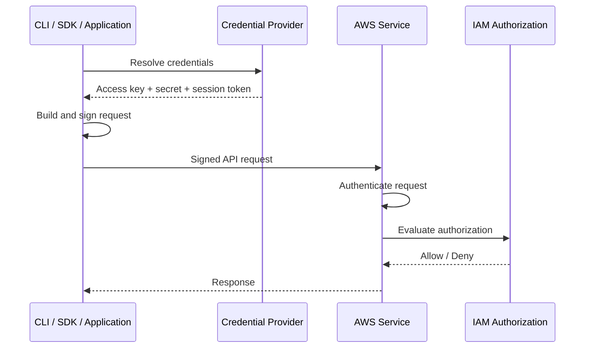
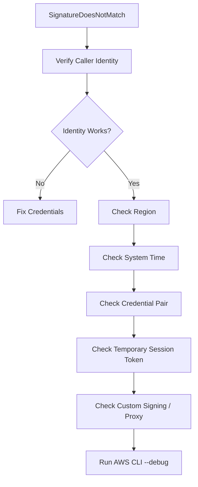
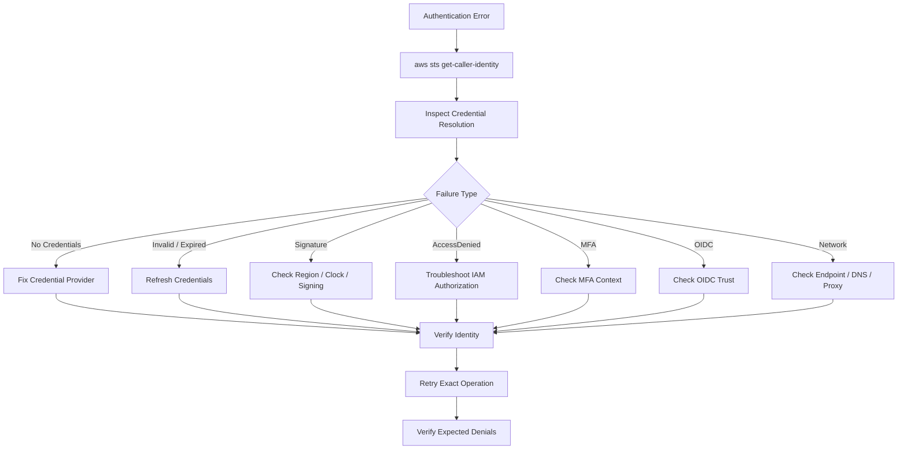

# 04- Authentication, Token and Signature Errors

## Overview

AWS authentication errors occur before or during request authentication and signing, before IAM authorization can produce a normal allow or deny decision.

Typical failures include:

```text
Unable to locate credentials
NoCredentials
InvalidClientTokenId
UnrecognizedClientException
ExpiredToken
ExpiredTokenException
SignatureDoesNotMatch
InvalidSignatureException
RequestTimeTooSkewed
AccessDenied
```

These errors are not interchangeable.

A useful diagnostic model is:

```text
Credential discovery
    ↓
Credential validity
    ↓
Temporary-token validity
    ↓
Request signing
    ↓
AWS service authentication
    ↓
IAM authorization
```

For example:

```text
Credentials missing
    ↓
Authentication never starts

Credentials expired
    ↓
Authentication fails

Credentials valid
    ↓
Signature invalid
    ↓
Authentication fails

Authentication succeeds
    ↓
IAM policy denies request
    ↓
AccessDenied
```

The AWS CLI and SDK credential providers can obtain credentials from multiple sources, including environment variables, IAM Identity Center, assumed roles, container credentials, EC2 instance metadata, login credentials, and external processes. ([AWS SDKs and Tools credential provider guide](https://docs.aws.amazon.com/sdkref/latest/guide/access.html))

---

## Authentication vs Authorization

This distinction is the foundation of troubleshooting.

| Layer | Question | Typical failure |
|---|---|---|
| Credential discovery | Can the client find credentials? | `Unable to locate credentials` |
| Credential validity | Are the credentials valid? | `InvalidClientTokenId` |
| Temporary session | Is the session still valid? | `ExpiredToken` |
| Request signing | Does the signature match? | `SignatureDoesNotMatch` |
| Request timestamp | Is the signed request time acceptable? | `RequestTimeTooSkewed` |
| Authorization | Does IAM permit the action? | `AccessDenied` |

A request with:

```text
Valid credentials
+
Valid signature
+
Valid identity
```

can still receive:

```text
AccessDenied
```

because authentication and authorization are separate stages.

---

## Authentication Request Lifecycle

A simplified request flow is:



Failure location matters:

```text
Credential provider failure
    ≠
Signature failure
    ≠
IAM authorization failure
```

This prevents wasting time inspecting IAM policies when the AWS CLI is not authenticated correctly.

---

## First Diagnostic Commands

Start every investigation with:

```bash
aws --version
aws configure list
aws sts get-caller-identity
```

For a specific profile:

```bash
aws configure list \
    --profile production

aws sts get-caller-identity \
    --profile production
```

These establish:

```text
CLI version
Credential source
Profile
Caller account
Caller ARN
```

AWS recommends using `GetCallerIdentity` to determine which identity is actually making the request. ([AWS CLI `get-caller-identity`](https://docs.aws.amazon.com/cli/latest/reference/sts/get-caller-identity.html))

---

## Error: Unable to Locate Credentials

Typical error:

```text
Unable to locate credentials
```

or:

```text
Unable to locate credentials. You can configure credentials by running "aws configure".
```

This means the CLI or SDK did not find a usable credential provider.

Common causes:

```text
No profile configured
Wrong AWS_PROFILE
Missing environment variables
Expired SSO session
Missing role configuration
No ECS credentials
No EC2 instance role
Broken OIDC configuration
Credential process failure
```

The first diagnostic command is:

```bash
aws configure list
```

Then:

```bash
aws sts get-caller-identity
```

---

## Credential Provider Chain

AWS SDKs and tools use a credential provider chain.

Common sources include:

```text
Environment credentials
Shared config / credentials files
IAM Identity Center
AssumeRole
Login provider
Process provider
Container credentials
EC2 IMDS credentials
Web identity
```

The exact order varies by tool and provider implementation, but the important principle is:

```text
Multiple sources may exist
    ↓
One source wins
    ↓
Unexpected source can produce unexpected identity
```

AWS documents this standardized credential-provider model for SDKs and tools. ([AWS credential provider chain](https://docs.aws.amazon.com/sdkref/latest/guide/standardized-credentials.html))

---

## Wrong Credential Source

A frequent production problem is:

```text
Expected:
production profile

Actual:
AWS_ACCESS_KEY_ID from environment
```

Run:

```bash
aws configure list
```

Look at the `TYPE` and `LOCATION` columns.

Also inspect:

Linux/macOS:

```bash
env | grep '^AWS_'
```

PowerShell:

```powershell
Get-ChildItem Env:AWS*
```

A profile can be correctly configured and still not be the active credential source.

---

## Error: InvalidClientTokenId

Typical error:

```text
An error occurred (...InvalidClientTokenId...)
The security token included in the request is invalid.
```

or:

```text
The security token included in the request is invalid
```

Common causes:

```text
Deleted access key
Inactive access key
Typo in access key
Wrong access key paired with secret key
Corrupted credential configuration
Wrong profile
Expired or invalid temporary credentials
```

First check:

```bash
aws configure list
```

Then:

```bash
aws sts get-caller-identity
```

If `get-caller-identity` fails with the same credential error, the issue is probably authentication rather than service-specific authorization.

---

## Error: UnrecognizedClientException

Typical form:

```text
The security token included in the request is invalid.
```

or:

```text
The security token included in the request is invalid
```

with:

```text
UnrecognizedClientException
```

This commonly indicates that AWS cannot authenticate the credential material presented by the client.

Investigate:

```text
Access key ID
Secret access key
Session token
Credential source
Credential expiration
```

Common mistake:

```text
Temporary credentials
    +
Missing AWS_SESSION_TOKEN
```

The session token is part of temporary credentials and must accompany the access key and secret when credentials are manually supplied. ([AWS temporary credentials](https://docs.aws.amazon.com/sdkref/latest/guide/feature-static-credentials.html))

---

## Temporary Credentials Have Three Components

Temporary credentials contain:

```text
AccessKeyId
SecretAccessKey
SessionToken
Expiration
```

AWS STS documents this credential structure for operations such as `AssumeRole` and `GetSessionToken`. ([AWS STS `AssumeRole`](https://docs.aws.amazon.com/STS/latest/APIReference/API_AssumeRole.html), [AWS `GetSessionToken`](https://docs.aws.amazon.com/cli/latest/reference/sts/get-session-token.html))

For example:

```bash
export AWS_ACCESS_KEY_ID="ASIA..."
export AWS_SECRET_ACCESS_KEY="..."
export AWS_SESSION_TOKEN="..."
```

Missing the session token can cause authentication failure.

This is one of the most common mistakes when manually copying temporary credentials into:

```text
Environment variables
~/.aws/credentials
CI/CD variables
Container configuration
```

---

## Error: ExpiredToken

Typical error:

```text
ExpiredToken
```

or:

```text
The security token included in the request is expired
```

The credential set has passed its expiration time.

Common sources:

```text
AssumeRole credentials
IAM Identity Center session
aws login
GetSessionToken
Federated session
OIDC credential exchange
Manually copied temporary credentials
```

Check:

```bash
aws configure list
```

and:

```bash
aws sts get-caller-identity
```

If the profile uses temporary credentials, refresh the authentication source rather than continuing to reuse expired credentials.

---

## Refresh IAM Identity Center Credentials

For an SSO profile:

```bash
aws sso login \
    --profile development
```

Then:

```bash
aws sts get-caller-identity \
    --profile development
```

IAM Identity Center returns short-term credentials for the assigned AWS role. ([AWS IAM Identity Center credential provider](https://docs.aws.amazon.com/sdkref/latest/guide/feature-sso-credentials.html))

Do not replace an expired SSO session with a permanent IAM access key as a troubleshooting shortcut.

---

## Refresh `aws login` Credentials

For the AWS CLI login provider:

```bash
aws login \
    --profile development
```

The login provider obtains temporary credentials and a refresh token. AWS documents that the CLI can automatically refresh the temporary credentials while the refresh token remains valid. ([AWS CLI `login`](https://docs.aws.amazon.com/cli/latest/reference/login/))

If commands still return `ExpiredToken`, inspect:

```bash
aws configure list \
    --profile development
```

AWS specifically documents a scenario where stale credentials in the profile take precedence over the newer login credentials. ([AWS troubleshooting console sign-in](https://docs.aws.amazon.com/cli/latest/userguide/cli-configure-sign-in-troubleshoot.html))

---

## `aws login` Mixed-Credential Problem

A particularly confusing case is:

```text
aws login
    ✅

aws s3 ls
    ❌ ExpiredToken
```

The profile may contain multiple credential sources.

Run:

```bash
aws configure list \
    --profile development
```

If the credential type is not `login`, another source may be taking precedence.

For example:

```text
Shared credentials file
    ↓
wins

Login provider
    ↓
never used
```

Fix the credential-source conflict rather than repeatedly running `aws login`.

---

## Refresh Assumed Role Credentials

For a role profile:

```ini
[profile production]
role_arn = arn:aws:iam::210987654321:role/ProductionReadOnly
source_profile = development
```

refresh the source authentication:

```bash
aws sso login \
    --profile development
```

Then retry:

```bash
aws sts get-caller-identity \
    --profile production
```

The AWS CLI can automatically cache and refresh role credentials for configured role profiles. ([AWS CLI role configuration](https://docs.aws.amazon.com/cli/latest/userguide/cli-configure-role.html))

---

## Role Chaining and Expiration

When role A assumes role B:

```text
Role A
    ↓
AssumeRole
    ↓
Role B
```

the resulting credentials are temporary.

When the source is itself an assumed role, role chaining can affect maximum session duration.

AWS documents a maximum one-hour session for role chaining. ([AWS IAM role chaining](https://docs.aws.amazon.com/IAM/latest/UserGuide/id_roles_terms-and-concepts.html))

This can produce confusing situations such as:

```text
Requested:
12 hours

Actual:
Role chaining
    ↓
Maximum:
1 hour
```

Treat this as a role-session configuration problem rather than a generic token problem.

---

## Error: SignatureDoesNotMatch

Typical error:

```text
SignatureDoesNotMatch
```

Example:

```text
The request signature we calculated does not match
the signature you provided.
```

This means AWS could not validate the signature created by the client.

Common causes include:

```text
Wrong secret access key
Wrong access key / secret pair
Malformed request
Incorrect Region
Incorrect service signing target
Modified request
Proxy / middleware rewriting requests
Clock skew
Incorrect custom signer
```

AWS CLI troubleshooting specifically identifies credentials and system clock synchronization as common causes of signature failures. ([AWS CLI troubleshooting](https://docs.aws.amazon.com/cli/latest/userguide/cli-chap-troubleshooting.html))

---

## Signature Version 4

Most AWS service API requests use AWS Signature Version 4.

Conceptually:

```text
Request
    ↓
Canonical request
    ↓
String to sign
    ↓
Derived signing key
    ↓
Signature
    ↓
Authorization header
```

The signing process incorporates values such as:

```text
HTTP method
URI
Headers
Request body hash
Timestamp
Region
Service
Secret key
```

This binds the signature to the request being sent.

The signature process is therefore sensitive to:

```text
Credentials
Request contents
Region
Service
Time
Signed headers
```

AWS documents Signature Version 4 request construction in the General Reference. ([AWS Signature Version 4](https://docs.aws.amazon.com/general/latest/gr/signature-version-4.html))

---

## Signature Failure Decision Tree



The exact order can vary by environment, but this sequence quickly separates credential problems from signing problems.

---

## Check the AWS Region

The signing process incorporates the target Region.

A request signed for:

```text
ap-south-1
```

can fail when the actual endpoint is:

```text
us-east-1
```

or when an application signs against the wrong Region.

Check:

```bash
aws configure list
```

Override explicitly:

```bash
aws sts get-caller-identity \
    --region ap-south-1
```

For service-specific troubleshooting:

```bash
aws s3api list-buckets \
    --region ap-south-1
```

Do not assume the configured default Region is always the Region actually used by application code.

---

## Region Configuration in Python

Boto3 may obtain Region configuration from:

```text
Environment variables
Shared config
Explicit session configuration
Application configuration
```

For diagnostics:

```python
import boto3

session = boto3.Session()

print("Region:", session.region_name)
print("Profile:", session.profile_name)
```

For explicit configuration:

```python
import boto3

session = boto3.Session(
    region_name="ap-south-1",
)

s3 = session.client("s3")
```

In production, prefer deliberate region configuration rather than depending on a developer machine's default.

---

## Error: RequestTimeTooSkewed

Typical error:

```text
RequestTimeTooSkewed
```

or a related signature expiration / clock-skew error.

AWS request signing depends on timestamps.

If the local machine clock is significantly incorrect:

```text
Client time
    ≠
AWS service time
```

the signature can be rejected.

AWS CLI documentation specifically identifies an out-of-sync system clock as a cause of authentication/signature problems. ([AWS CLI troubleshooting](https://docs.aws.amazon.com/cli/latest/userguide/cli-chap-troubleshooting.html))

---

## Check System Time

Linux:

```bash
date
```

Modern Linux systems:

```bash
timedatectl status
```

Windows PowerShell:

```powershell
Get-Date
```

Check the machine's time synchronization configuration rather than manually changing the clock repeatedly.

For production hosts, use the operating system's normal NTP/time-synchronization mechanism.

---

## Docker Clock Problems

Containers normally share the host's kernel clock.

Therefore:

```text
Host clock
    ↓
Container clock
```

If the host time is wrong:

```text
Application container
    ↓
Wrong timestamp
    ↓
Invalid AWS signature
```

Check inside the container:

```bash
date
```

and compare with the host.

Do not try to solve a host time-sync problem by changing application timestamps manually.

---

## CI Runner Clock Problems

Hosted and self-managed CI runners can produce signature errors when:

```text
Runner clock is incorrect
```

or:

```text
Virtual machine time synchronization is broken
```

If:

```text
Developer workstation
    ✅

CI runner
    ❌ SignatureDoesNotMatch
```

compare:

```text
Credential source
Region
System time
CLI / SDK version
Proxy
Environment variables
```

---

## Error: AccessDenied During Authentication Workflows

`AccessDenied` can appear in both authentication and authorization contexts.

Example:

```text
sts:AssumeRole
    ↓
AccessDenied
```

This is a role-assumption authorization problem.

Another example:

```text
s3:GetObject
    ↓
AccessDenied
```

This is typically resource authorization.

Do not interpret every `AccessDenied` as a credential failure.

---

## MFA Token Errors

When MFA is part of the authentication flow, failures can include:

```text
AccessDenied
Invalid MFA token
Expired MFA code
Missing MFA context
```

For STS `GetSessionToken`, AWS documents that MFA-enabled IAM users can supply the MFA device serial and token code to obtain temporary credentials. ([AWS CLI `get-session-token`](https://docs.aws.amazon.com/cli/latest/reference/sts/get-session-token.html))

Example:

```bash
aws sts get-session-token \
    --serial-number arn:aws:iam::123456789012:mfa/developer \
    --token-code 123456 \
    --duration-seconds 3600
```

If the token is rejected:

```text
Verify device
Verify current code
Verify serial number
Verify source credentials
Verify system time
```

---

## `mfa-login`

Current AWS CLI v2 also provides:

```bash
aws configure mfa-login
```

This obtains temporary credentials using an IAM user's long-lived access key plus an MFA code and stores the temporary credentials in an AWS CLI profile. AWS documents that this command supports hardware or software OTP authenticators and not passkeys or U2F devices. ([AWS CLI `mfa-login`](https://docs.aws.amazon.com/cli/latest/reference/configure/mfa-login.html))

Example:

```bash
aws configure mfa-login \
    --profile developer
```

Use this only where an IAM-user + MFA workflow is deliberately required. Modern workforce and workload designs generally favor federated or role-based temporary credentials.

---

## MFA and Clock Problems

TOTP-based MFA is time-dependent.

A badly synchronized client can create problems in MFA workflows as well as request signing.

For an MFA-related authentication failure:

```text
Check system time
    ↓
Check MFA device
    ↓
Generate fresh code
    ↓
Retry
```

Do not reuse an already expired code.

---

## Error: Expired Session Token in Environment

A frequent local-development pattern is:

```bash
export AWS_ACCESS_KEY_ID="ASIA..."
export AWS_SECRET_ACCESS_KEY="..."
export AWS_SESSION_TOKEN="..."
```

The credentials expire, but the shell still contains them.

Result:

```text
ExpiredToken
```

Fix:

```text
Refresh the source session
or
remove stale environment variables
```

Linux/macOS:

```bash
unset AWS_ACCESS_KEY_ID
unset AWS_SECRET_ACCESS_KEY
unset AWS_SESSION_TOKEN
```

PowerShell:

```powershell
Remove-Item Env:AWS_ACCESS_KEY_ID
Remove-Item Env:AWS_SECRET_ACCESS_KEY
Remove-Item Env:AWS_SESSION_TOKEN
```

Then retry using the intended profile or login mechanism.

---

## Error: Wrong Access Key / Secret Pair

A signature error can be caused by mismatched long-lived credentials:

```text
Access Key A
+
Secret Key B
```

AWS cannot reproduce the expected signature.

This can happen when:

```text
Manual copy/paste
CI variables updated partially
Secrets manager values out of sync
Old access key remains in environment
Application caches credentials
```

Use:

```bash
aws configure list
```

and:

```bash
aws sts get-caller-identity
```

to establish the actual credential source.

Do not print secret values to troubleshoot the mismatch.

---

## Credential Rotation Failure

Consider:

```text
Application
    ↓
Access Key A
```

Rotation occurs:

```text
Access Key B created
Access Key A deactivated
```

but the application still uses:

```text
Access Key A
```

Result:

```text
InvalidClientTokenId
```

or another authentication failure.

A safe rotation flow is:

```text
Create new key
    ↓
Deploy new credential
    ↓
Verify runtime identity
    ↓
Observe
    ↓
Deactivate old key
    ↓
Delete old key
```

For production workloads, migrate to IAM roles or other temporary-credential mechanisms instead of building a permanent key-rotation dependency.

---

## ECS Credential Failures

ECS task credentials are temporary.

Typical flow:

```text
ECS task
    ↓
Task role
    ↓
Container credential endpoint
    ↓
AWS SDK / CLI
```

If the application receives:

```text
ExpiredToken
```

investigate:

```text
Task role
Credential endpoint
SDK version
Credential refresh behavior
Task lifecycle
Environment variables
```

A common mistake is setting:

```text
AWS_ACCESS_KEY_ID
AWS_SECRET_ACCESS_KEY
AWS_SESSION_TOKEN
```

inside the container and unintentionally overriding the ECS task-role credentials.

---

## EC2 Credential Failures

EC2 instance-profile credentials are temporary.

Typical flow:

```text
Application
    ↓
AWS SDK
    ↓
Instance Metadata Service
    ↓
Temporary role credentials
```

If requests fail:

```text
Check role attachment
Check IMDS availability
Check IMDSv2 configuration
Check network access to metadata
Check credential refresh
Check environment variables
```

Do not replace the instance role with permanent access keys just because metadata access is failing.

---

## EKS Credential Failures

For EKS workload identity:

```text
Pod
    ↓
Workload identity provider
    ↓
IAM role
    ↓
Temporary credentials
```

Authentication errors can arise from:

```text
Missing role association
Wrong service account
Broken OIDC configuration
Wrong role ARN
Trust-policy mismatch
Expired web identity token
Environment override
SDK configuration
```

Verify the identity from the workload when possible.

---

## CI/CD OIDC Credential Failures

Typical flow:

```text
CI job
    ↓
OIDC token
    ↓
STS
    ↓
AssumeRoleWithWebIdentity
    ↓
Temporary credentials
```

Authentication failure can occur before the deployment role is established.

Check:

```text
OIDC token availability
OIDC provider
audience
subject
repository
branch / environment
trust conditions
role ARN
AWS account
```

The preferred architecture is:

```text
OIDC
    ↓
Temporary role credentials
```

rather than storing long-lived AWS access keys in CI/CD.

---

## Error: SignatureDoesNotMatch in Custom Applications

When a custom Python or JavaScript implementation signs requests manually, inspect:

```text
Canonical URI
Canonical query string
Canonical headers
Signed headers
Payload hash
Date header
Credential scope
Region
Service
Signing key
```

If using AWS SDKs:

```text
Prefer the SDK's signing implementation
```

instead of implementing Signature Version 4 yourself.

For example, with Boto3:

```python
import boto3

s3 = boto3.client("s3", region_name="ap-south-1")

response = s3.get_object(
    Bucket="company-orders-prod",
    Key="orders/123.json",
)

body = response["Body"].read()
```

The SDK handles request construction and signing.

---

## When Manual Signing Is Justified

Manual Signature Version 4 implementation can be appropriate for:

```text
Specialized protocol integrations
Low-level AWS-compatible clients
Custom HTTP tooling
Learning / diagnostics
```

But it increases the failure surface:

```text
Canonicalization
Signing key derivation
Header selection
Encoding
Timestamp
Region
Service
Payload hashing
```

Production backend services should generally use AWS SDKs unless there is a clear requirement to sign requests manually.

---

## AWS CLI `--debug`

When authentication or signing is unclear:

```bash
aws sts get-caller-identity \
    --debug
```

or:

```bash
aws s3api head-bucket \
    --bucket company-orders-prod \
    --debug
```

Debug output can expose:

```text
Credential provider selection
Endpoint
Region
Request construction
Signing information
Retries
HTTP response
```

Use it carefully.

Do not publish raw debug logs containing sensitive request context or authentication material.

AWS CLI documents `--debug` as the global option for detailed CLI diagnostics. ([AWS CLI command reference](https://docs.aws.amazon.com/cli/latest/reference/))

---

## Debugging Order for Signature Errors

A useful order is:

```text
1. Confirm caller identity.
2. Confirm credential source.
3. Confirm credentials are current.
4. Confirm session token exists for temporary credentials.
5. Confirm Region.
6. Confirm system time.
7. Remove stale environment variables.
8. Test with AWS CLI / official SDK.
9. Check proxy or middleware.
10. Inspect --debug output.
11. Only then inspect custom signing code.
```

This avoids wasting time debugging a custom signer when the real issue is an expired environment credential.

---

## Proxy and Middleware Problems

Reverse proxies, API gateways, service meshes, or HTTP middleware can cause signature failures if they modify signed request components.

Potentially dangerous changes include:

```text
Host header
Path
Query string
Content encoding
Payload
Signed headers
```

For example:

```text
Client signs:
    /bucket/object

Proxy rewrites:
    /bucket/object/

AWS verifies:
    Different canonical request
```

Result:

```text
SignatureDoesNotMatch
```

For SigV4-signed requests, avoid modifying signed portions of the request after signing.

---

## Nginx and Signed AWS Requests

If a backend uses Nginx as an intermediary:

```text
Application
    ↓
Nginx
    ↓
AWS endpoint
```

be cautious about:

```text
Host rewrite
Path normalization
Query-string rewriting
Header modification
```

AWS SDK calls should generally go directly to AWS endpoints rather than through an intermediary that changes signed request data.

If a proxy is required, validate that it preserves the request components required by the signer.

---

## Clock Skew in Python / FastAPI

A common architecture:

```text
FastAPI
    ↓
Boto3
    ↓
AWS service
```

If the host or container time is incorrect:

```text
Boto3 signs request
    ↓
Timestamp invalid
    ↓
AWS rejects request
```

Check the underlying node rather than changing application code to compensate.

---

## DNS and Endpoint Problems

Some errors that appear to be authentication problems are actually endpoint problems.

Check:

```text
DNS resolution
AWS Region
Endpoint hostname
VPC DNS
Proxy
PrivateLink
Service endpoint
```

For example:

```bash
aws sts get-caller-identity \
    --region ap-south-1 \
    --debug
```

can help distinguish:

```text
Credential problem
```

from:

```text
Endpoint / network problem
```

---

## Regional STS Endpoints

AWS recommends using Regional STS endpoints to reduce latency, improve redundancy, and increase session-token compatibility. AWS notes that tokens issued by the legacy global STS endpoint can have Region availability differences depending on token version. ([AWS STS endpoints](https://docs.aws.amazon.com/IAM/latest/UserGuide/id_credentials_temp.html), [AWS CLI STS preferences](https://docs.aws.amazon.com/cli/latest/reference/iam/set-security-token-service-preferences.html))

For Region-sensitive architectures:

```text
Workload in ap-south-1
    ↓
Regional STS endpoint
    ↓
Temporary credentials
```

can be preferable to depending on the global endpoint.

---

## STS Endpoint Troubleshooting

If an STS operation behaves differently across Regions:

```text
Check STS endpoint configuration
Check AWS Region
Check account STS settings
Check credential token type
```

This is especially relevant for:

```text
Older integrations
Manually enabled Regions
Cross-Region workloads
Global STS endpoint usage
```

Use current AWS STS endpoint guidance when designing new architectures.

---

## Credential Expiration Monitoring

Applications using temporary credentials should not wait for authentication failures to discover expiration.

The standard AWS credential providers can automatically refresh credentials when the provider supports refreshable credentials. AWS documents automatic renewal behavior in the standardized credential-provider model. ([AWS standardized credential providers](https://docs.aws.amazon.com/sdkref/latest/guide/standardized-credentials.html))

Operational monitoring should still track:

```text
Credential source
Refresh failures
Authentication failure rate
STS failures
Unexpected expiration
```

---

## Application Credential Refresh

With Boto3 and supported credential providers:

```python
import boto3

session = boto3.Session()
client = session.client("s3")

response = client.list_buckets()
```

The application should not manually implement:

```text
AccessKey rotation
Session-token refresh
Role re-assumption loops
```

when the SDK/provider already supports it.

Manual credential lifecycle management increases operational risk.

---

## Long-Lived Credentials

Permanent access keys create a different troubleshooting model:

```text
Access key
Secret key
```

There is no built-in expiration timestamp comparable to temporary STS credentials.

A production architecture should prefer:

```text
IAM Identity Center
AssumeRole
OIDC
ECS task role
EC2 role
EKS workload identity
Lambda execution role
```

over long-lived keys whenever practical.

AWS recommends short-term credentials for SDKs and tools and treats long-term credentials as a limited-use option, particularly outside sandbox environments. ([AWS SDK authentication](https://docs.aws.amazon.com/sdkref/latest/guide/access.html))

---

## Error: Credentials Work in CLI but Not in Boto3

Possible causes:

```text
Different profile
Different credential chain
Different environment variables
Different Region
Different SDK version
Explicit credentials in application code
Container environment
Credential process difference
```

Inspect the Boto3 session:

```python
import boto3

session = boto3.Session()

print("Profile:", session.profile_name)
print("Region:", session.region_name)

credentials = session.get_credentials()

if credentials:
    print("Credential method resolved successfully")
else:
    print("No credentials resolved")
```

Do not print:

```text
Access key
Secret key
Session token
```

to application logs.

---

## Error: CLI Works but Docker Fails

Compare:

```text
Host
    ↓
Credential provider

Container
    ↓
Credential provider
```

Typical difference:

```text
Host:
AWS_PROFILE=development

Container:
No credentials
```

or:

```text
Host:
IAM Identity Center

Container:
No access to host credential cache
```

For production:

```text
ECS
    → task role

EKS
    → workload identity
```

rather than copying local AWS credentials into the image.

---

## Error: AWS CLI Works but GitHub Actions Fails

Compare:

```text
Developer:
IAM Identity Center / aws login

CI:
OIDC
```

The identities are different.

Check:

```text
AWS account
Role ARN
OIDC provider
Subject
Audience
Trust policy
```

Verify inside CI:

```bash
aws sts get-caller-identity
```

Once the role is established, authorization debugging becomes a separate problem.

---

## Authentication Error Decision Matrix

| Error | Primary suspicion | First command / check |
|---|---|---|
| `Unable to locate credentials` | No provider resolved | `aws configure list` |
| `InvalidClientTokenId` | Invalid credentials | `aws configure list` |
| `UnrecognizedClientException` | Invalid security token | Check access key + session token |
| `ExpiredToken` | Temporary credentials expired | Refresh profile/session |
| `SignatureDoesNotMatch` | Signing or credential mismatch | Check identity, region, clock, `--debug` |
| `InvalidSignatureException` | Invalid signed request | Check signer / credentials / request |
| `RequestTimeTooSkewed` | Clock skew | Check system time |
| `AccessDenied` on AssumeRole | Trust / source permission | Inspect trust + source policy |
| `AccessDenied` on service API | Authorization | Inspect IAM evaluation |
| MFA-related denial | MFA context missing/invalid | Check MFA device/token |
| CI OIDC failure | Trust claims / provider | Inspect OIDC trust |
| EKS identity failure | Workload identity | Inspect pod-role mapping |
| ECS token failure | Task-role credential source | Check task role / environment |
| CLI login still expired | Conflicting credential source | `aws configure list` |

---

## Production Troubleshooting Workflow



The final step is not simply:

```text
Command returned successfully
```

It is:

```text
Expected operation succeeds
+
Unexpected privileged operation remains denied
```

---

## Security Considerations

Authentication troubleshooting can expose sensitive credential information.

Never include in logs or tickets:

```text
AWS_SECRET_ACCESS_KEY
AWS_SESSION_TOKEN
Private credential files
Temporary credential JSON
Refresh tokens
OIDC tokens
Full signed Authorization headers
```

Safe diagnostic information includes:

```text
Caller ARN
Account ID
Profile name
Credential provider type
Region
Error code
Action
Resource ARN
Timestamp
CloudTrail event ID
```

Redact sensitive fields before sharing debug output.

---

## Operational Practices

Use:

```text
Short-lived credentials
IAM roles
IAM Identity Center
OIDC
Automatic credential refresh
Regional STS where appropriate
Synchronized clocks
Official AWS SDKs
Explicit profiles for production
```

Avoid:

```text
Hard-coded credentials
Long-lived production keys
Copying temporary credentials into source code
Manual SigV4 implementations without necessity
Disabling SSL verification
Ignoring credential-provider precedence
Keeping stale environment credentials
```

AWS's current SDK guidance strongly favors temporary credentials delivered through managed providers such as IAM Identity Center, AWS compute roles, and credential processes. ([AWS SDK authentication](https://docs.aws.amazon.com/sdkref/latest/guide/access.html))

---

## Reliability and High Availability

Authentication failures can become application-wide outages when credentials are managed poorly.

A resilient design should avoid:

```text
Single static access key
    ↓
Every application dependency
```

Prefer:

```text
Application
    ↓
Managed credential provider
    ↓
Temporary credentials
    ↓
Automatic refresh
```

For multi-account systems:

```text
Workload
    ↓
IAM role
    ↓
Regional STS
    ↓
AWS service
```

Use AWS-supported credential providers and avoid implementing your own credential refresh system unless required by the architecture.

---

## Disaster Recovery Considerations

Authentication dependencies should be considered in DR planning.

Review:

```text
IAM Identity Center
OIDC providers
IAM roles
Trust policies
STS endpoints
Credential providers
Secrets / credential stores
Break-glass identities
MFA recovery
CI/CD authentication
```

A DR workload can fail even when the application infrastructure is healthy if:

```text
IAM role missing
Trust policy missing
OIDC provider unavailable
Credential provider broken
KMS access unavailable
```

IAM configuration should therefore be managed as recoverable infrastructure.

---

## Backend Application Checklist

For Django / FastAPI / Celery / workers:

```text
□ Use IAM roles rather than permanent keys
□ Avoid credentials in source code
□ Verify runtime identity
□ Let SDKs refresh temporary credentials
□ Do not log credential material
□ Configure explicit Region
□ Monitor AWS API authentication failures
□ Handle transient AWS errors separately from AccessDenied
□ Use application startup diagnostics without exposing secrets
```

A safe runtime diagnostic is:

```python
import boto3

sts = boto3.client("sts")
identity = sts.get_caller_identity()

print({
    "account": identity["Account"],
    "arn": identity["Arn"],
})
```

Log this only to trusted operational channels.

---

## Common Mistakes

| Mistake | Why it happens | Better approach |
|---|---|---|
| Treating `AccessDenied` as invalid credentials | Authentication and authorization are confused | Verify caller identity first |
| Forgetting `AWS_SESSION_TOKEN` | Temporary credentials look like normal keys | Supply all three temporary credential components |
| Leaving stale environment variables | Environment variables override intended profiles | Inspect and remove `AWS_*` variables |
| Re-running SSO login repeatedly | The profile is still resolving another credential source | Use `aws configure list` |
| Ignoring clock synchronization | Signature failure looks like credential failure | Check system/NTP time |
| Hard-coding access keys in containers | Quick deployment workaround | Use ECS/EKS/EC2 workload identity |
| Copying temporary credentials into CI permanently | Convenient manual setup | Prefer OIDC |
| Debugging custom signing before checking credentials | Signature code is complex | Verify credentials and Region first |
| Disabling TLS verification | Fast workaround for certificate errors | Configure the correct CA bundle |
| Printing `--debug` output publicly | Useful local diagnostics become credential exposure | Redact and restrict logs |
| Assuming SDK and CLI use identical profiles | Credential chains differ by runtime | Inspect the actual runtime |
| Ignoring Region | SigV4 depends on Region/service scope | Verify effective Region |
| Ignoring proxy rewriting | Signed request can be modified in transit | Preserve signed request components |
| Using long-lived keys because temporary tokens expired | Expiration is treated as an architecture problem | Fix credential refresh |

---

## Interview Traps

### "What is the difference between `ExpiredToken` and `AccessDenied`?"

```text
ExpiredToken
    → Authentication/session credential problem

AccessDenied
    → Usually authorization problem after identity is established
```

### "Why does a temporary credential need a session token?"

Because STS temporary credentials consist of:

```text
Access key
Secret access key
Session token
```

The session token is required when manually supplying temporary credentials. ([AWS temporary credentials](https://docs.aws.amazon.com/sdkref/latest/guide/feature-static-credentials.html))

### "Why can valid credentials produce `SignatureDoesNotMatch`?"

Because the credentials can be valid while the client constructs an incorrect signature due to:

```text
Wrong Region
Clock skew
Modified request
Wrong credential pair
Incorrect signing implementation
Proxy changes
```

### "Why can `aws login` succeed but the next command return `ExpiredToken`?"

The profile may still be resolving stale credentials from another provider, such as the shared credentials file. AWS specifically recommends `aws configure list` to identify the active credential source. ([AWS CLI sign-in troubleshooting](https://docs.aws.amazon.com/cli/latest/userguide/cli-configure-sign-in-troubleshoot.html))

### "Should I implement SigV4 manually in a FastAPI service?"

Usually no.

Prefer:

```text
Boto3 / AWS SDK
```

unless the application has a specific requirement that justifies manual signing.

---

## Senior-Level Troubleshooting Pattern

When authentication fails, reason in this order:

```text
1. What AWS identity should be active?

2. What AWS identity is actually active?

3. Where did that credential come from?

4. Is the credential long-lived or temporary?

5. If temporary, is it expired?

6. Does it include a session token?

7. Is the system clock correct?

8. Is the effective Region correct?

9. Is the request being signed correctly?

10. Is a proxy changing signed request data?

11. Has authentication succeeded?

12. If yes, move to IAM authorization.
```

This sequence prevents jumping between unrelated IAM and networking hypotheses.

---

## Authentication Failure Example

Suppose a FastAPI application reports:

```text
SignatureDoesNotMatch
```

The initial temptation is:

```text
Check IAM role policy.
```

The better sequence is:

```text
1. Check container identity.
2. Check credential source.
3. Check credential expiration.
4. Check AWS Region.
5. Check system time.
6. Check SDK version.
7. Check proxy behavior.
8. Enable SDK/CLI debug logging locally if required.
9. Compare with an official AWS CLI call from the same environment.
```

If:

```text
aws sts get-caller-identity
    ✅
```

but:

```text
Application request
    ❌
```

focus on:

```text
Application signing
Region
Endpoint
Request mutation
SDK configuration
```

rather than IAM permissions.

---

## Authentication Failure Example With Temporary Credentials

Suppose:

```text
AWS_ACCESS_KEY_ID
AWS_SECRET_ACCESS_KEY
AWS_SESSION_TOKEN
```

were copied from an AWS access portal.

The application worked for several hours and then returned:

```text
ExpiredToken
```

The correct conclusion is:

```text
Credential lifetime ended.
```

The wrong response is:

```text
Create an unrestricted permanent access key.
```

Instead:

```text
Use IAM Identity Center / role credentials
+
automatic refresh
```

or refresh the temporary credential set according to the chosen authentication workflow. AWS recommends managed temporary credential providers for applications and tools. ([AWS SDK authentication](https://docs.aws.amazon.com/sdkref/latest/guide/access.html))

---

## Authentication Failure Example in ECS

```text
FastAPI
    ↓
boto3
    ↓
ECS task role
```

Error:

```text
ExpiredToken
```

Investigate:

```text
Task role
Credential endpoint
SDK credential refresh
AWS_* environment variables
Task replacement / lifecycle
```

The critical question is:

```text
Is the SDK receiving fresh task-role credentials,
or has an environment/static credential source overridden them?
```

---

## Authentication Failure Example in GitHub Actions

```text
GitHub Actions
    ↓
OIDC
    ↓
AWS STS
```

Error:

```text
InvalidIdentityToken
```

or:

```text
AccessDenied
```

Check:

```text
OIDC token issued
OIDC provider configured
Audience
Subject
Repository
Branch/environment
Trust policy
Role ARN
AWS account
```

Once the role session is established:

```text
aws sts get-caller-identity
```

should confirm the expected deployment identity.

---

## Authentication Failure Example in EKS

```text
Pod
    ↓
Workload identity
    ↓
IAM role
```

Error:

```text
UnrecognizedClientException
```

or:

```text
ExpiredToken
```

Check:

```text
Pod identity association
Service account
Role ARN
Credential provider
Temporary token
SDK version
Environment-variable overrides
```

Do not assume that the IAM role is the only variable.

The actual identity delivered to the application is what matters.

---

## Production Verification Checklist

```text
Authentication
    □ AWS CLI / SDK version known
    □ Caller identity verified
    □ Credential source verified
    □ Correct AWS account
    □ Correct profile
    □ Correct Region

Credentials
    □ Credentials exist
    □ Access key is active
    □ Secret matches access key
    □ Session token exists for temporary credentials
    □ Temporary credentials have not expired
    □ Credential refresh works

Signing
    □ System clock synchronized
    □ Region correct
    □ Service endpoint correct
    □ Signed request not modified
    □ Official SDK used where practical

MFA / Federation
    □ MFA device correct
    □ MFA token current
    □ Identity Center session valid
    □ OIDC token valid
    □ Trust conditions match

Runtime
    □ ECS task role correct
    □ EC2 instance profile correct
    □ EKS workload identity correct
    □ Lambda execution role correct
    □ CI/CD role correct

Security
    □ No credentials in source code
    □ No credentials in container images
    □ No secret values in debug logs
    □ No permanent production keys unless required
    □ TLS verification enabled

Validation
    □ get-caller-identity succeeds
    □ Exact AWS API succeeds
    □ Authorization tested separately if needed
    □ Negative access remains denied
```

## AWS Documentation Links

- [AWS SDKs and Tools Authentication](https://docs.aws.amazon.com/sdkref/latest/guide/access.html)
- [Standardized Credential Providers](https://docs.aws.amazon.com/sdkref/latest/guide/standardized-credentials.html)
- [AWS CLI Authentication](https://docs.aws.amazon.com/cli/latest/userguide/cli-chap-authentication.html)
- [AWS CLI Troubleshooting](https://docs.aws.amazon.com/cli/latest/userguide/cli-chap-troubleshooting.html)
- [AWS CLI Sign-In Troubleshooting](https://docs.aws.amazon.com/cli/latest/userguide/cli-configure-sign-in-troubleshoot.html)
- [AWS CLI `get-caller-identity`](https://docs.aws.amazon.com/cli/latest/reference/sts/get-caller-identity.html)
- [AWS CLI `login`](https://docs.aws.amazon.com/cli/latest/reference/login/)
- [AWS CLI `mfa-login`](https://docs.aws.amazon.com/cli/latest/reference/configure/mfa-login.html)
- [AWS CLI `get-session-token`](https://docs.aws.amazon.com/cli/latest/reference/sts/get-session-token.html)
- [AWS CLI `assume-role`](https://docs.aws.amazon.com/cli/latest/reference/sts/assume-role.html)
- [AWS STS API Reference](https://docs.aws.amazon.com/STS/latest/APIReference/)
- [STS `AssumeRole`](https://docs.aws.amazon.com/STS/latest/APIReference/API_AssumeRole.html)
- [AWS Temporary Security Credentials](https://docs.aws.amazon.com/IAM/latest/UserGuide/id_credentials_temp.html)
- [AWS Signature Version 4](https://docs.aws.amazon.com/general/latest/gr/signature-version-4.html)
- [AWS SDK Login Credential Provider](https://docs.aws.amazon.com/sdkref/latest/guide/feature-login-credentials.html)
- [AWS SDK Assume Role Credential Provider](https://docs.aws.amazon.com/sdkref/latest/guide/feature-assume-role-credentials.html)
- [AWS SDK IAM Identity Center Credential Provider](https://docs.aws.amazon.com/sdkref/latest/guide/feature-sso-credentials.html)
- [AWS SDK Process Credential Provider](https://docs.aws.amazon.com/sdkref/latest/guide/feature-process-credentials.html)
- [AWS CLI STS Endpoint Preferences](https://docs.aws.amazon.com/cli/latest/reference/iam/set-security-token-service-preferences.html)

## Key Takeaways

- **Separate credential discovery, credential validity, request signing, and IAM authorization:** errors such as `Unable to locate credentials`, `ExpiredToken`, `SignatureDoesNotMatch`, and `AccessDenied` belong to different troubleshooting layers.
- **Temporary credentials are a three-part credential set:** access key ID, secret access key, and session token; when manually configuring temporary credentials, omitting `AWS_SESSION_TOKEN` can invalidate the request. ([AWS temporary credentials](https://docs.aws.amazon.com/sdkref/latest/guide/feature-static-credentials.html))
- **Signature failures are commonly caused by credential mismatch, Region errors, clock skew, request mutation, or custom signing problems:** verify the credential source and caller identity before debugging Signature Version 4 internals.
- **Prefer managed temporary-credential providers for production systems:** IAM Identity Center, assumed roles, ECS/EC2/EKS workload identities, Lambda roles, OIDC, and supported credential processes reduce manual refresh and long-lived-secret risk. ([AWS SDK authentication](https://docs.aws.amazon.com/sdkref/latest/guide/access.html))
- **Use `aws configure list` and `aws sts get-caller-identity` as standard diagnostics:** they reveal where credentials are coming from and which AWS identity is actually making the request before deeper investigation begins.