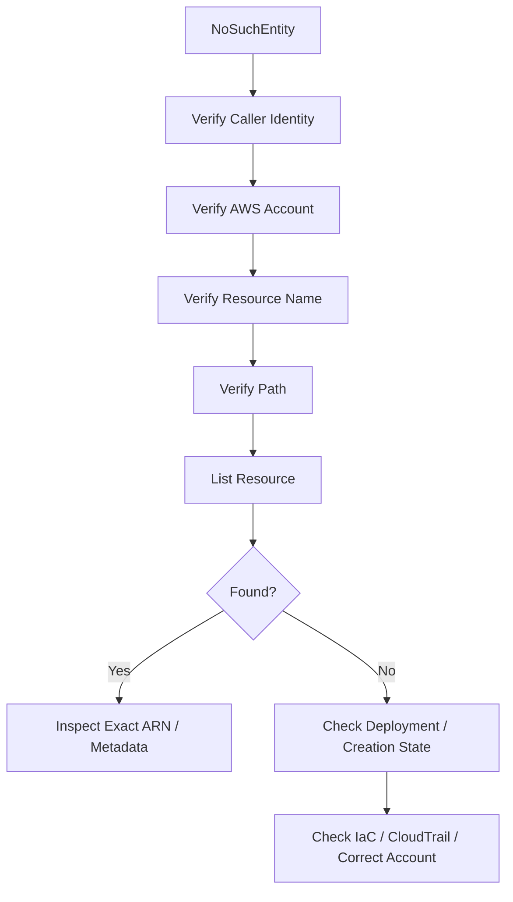
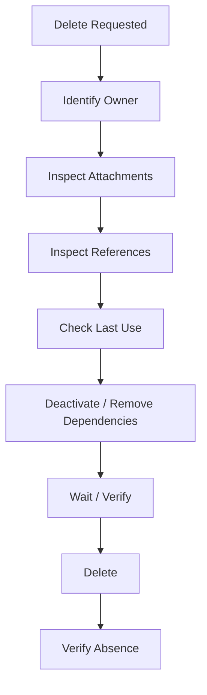
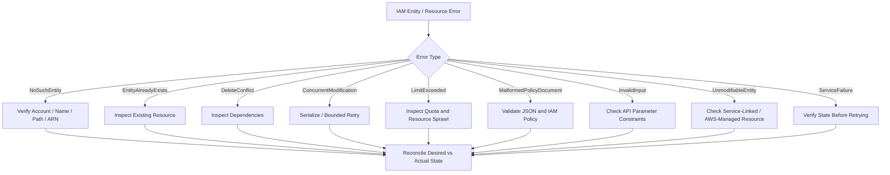

# 05- IAM Entity and Resource Errors

## Overview

AWS IAM errors involving entities and resources usually indicate that the request references an object that:

```text
Does not exist
Already exists
Is in the wrong account
Uses the wrong path
Cannot currently be modified
Has dependent resources
Has exceeded an account or service limit
Contains invalid policy data
Is being changed concurrently
```

Typical IAM errors include:

```text
NoSuchEntity
EntityAlreadyExists
DeleteConflict
ConcurrentModification
LimitExceeded
MalformedPolicyDocument
InvalidInput
UnmodifiableEntity
ServiceFailure
```

These errors are different from authorization errors such as `AccessDenied`.

A useful distinction is:

```text
Authentication
    ↓
Who is calling?

Authorization
    ↓
Is the caller allowed?

Entity / Resource validation
    ↓
Does the referenced IAM object exist and can this operation be performed?
```

For example:

```text
aws iam get-role
    ↓
NoSuchEntity
```

does not normally mean:

```text
The role exists but access is denied
```

It means the IAM API could not find the referenced entity in the relevant account and context.

AWS IAM APIs document these errors explicitly for operations such as `GetRole`, `CreateRole`, `CreatePolicy`, and deletion APIs. ([IAM API Reference](https://docs.aws.amazon.com/IAM/latest/APIReference/))

---

## Entity vs Resource

In IAM, the terms are closely related but useful to distinguish operationally.

### IAM Entity

An IAM entity is an identity object such as:

```text
User
Role
Group
```

These objects can be principals or participate in authorization relationships.

### IAM Resource

IAM also manages objects such as:

```text
Managed policies
Policy versions
Instance profiles
Virtual MFA devices
Server certificates
Access keys
```

In troubleshooting, "resource error" generally means that the API cannot find, create, modify, or delete the requested IAM object.

---

## Common Error Classification

| Error | Meaning | Typical HTTP status |
|---|---|---:|
| `NoSuchEntity` | Referenced IAM entity/resource does not exist | 404 |
| `EntityAlreadyExists` | Creation conflicts with an existing resource | 409 |
| `DeleteConflict` | Resource has dependent/attached entities | 409 |
| `ConcurrentModification` | Multiple changes are being made simultaneously | 409 |
| `LimitExceeded` | An account/service limit was reached | 409 |
| `MalformedPolicyDocument` | IAM policy/trust policy is invalid | 400 |
| `InvalidInput` | Request parameter is invalid or out of range | 400 |
| `UnmodifiableEntity` | AWS-managed entity such as a service-linked role cannot be modified by the caller | 400 |
| `ServiceFailure` | AWS service-side failure | 500 |

The exact errors available depend on the IAM API operation. For example, `GetRole` documents `NoSuchEntity`, while `CreateRole` can return `EntityAlreadyExists`, `ConcurrentModification`, `LimitExceeded`, `MalformedPolicyDocument`, and other errors. ([GetRole](https://docs.aws.amazon.com/IAM/latest/APIReference/API_GetRole.html), [CreateRole](https://docs.aws.amazon.com/IAM/latest/APIReference/API_CreateRole.html))

---

## First Diagnostic Step: Verify Account and Identity

Before investigating an entity error, verify which AWS account and principal the CLI is using:

```bash
aws sts get-caller-identity
```

For a named profile:

```bash
aws sts get-caller-identity \
    --profile production
```

Then inspect credential resolution:

```bash
aws configure list \
    --profile production
```

This prevents a common failure:

```text
Expected:
    Account A

Actual:
    Account B

Result:
    NoSuchEntity
```

The role or policy may exist perfectly in Account A while the CLI is querying Account B.

---

## Error: `NoSuchEntity`

`NoSuchEntity` means the request references an IAM resource entity that AWS cannot find.

For example:

```bash
aws iam get-role \
    --role-name OrdersServiceRole
```

can return:

```text
NoSuchEntity
```

AWS defines this as a request that referenced a resource entity that does not exist. ([GetRole](https://docs.aws.amazon.com/IAM/latest/APIReference/API_GetRole.html))

The immediate questions are:

```text
Does the resource exist?

Is the name correct?

Is the path correct?

Am I in the correct account?

Am I using the expected credentials?

Am I querying the correct resource type?
```

---

## `NoSuchEntity` Troubleshooting Flow



The key is to prove non-existence rather than assuming it.

---

## Role Does Not Exist

Start with:

```bash
aws iam list-roles \
    --query 'Roles[].{Name:RoleName,Arn:Arn}' \
    --output table
```

Then search by path if applicable:

```bash
aws iam list-roles \
    --path-prefix /service/orders/
```

AWS documents that `list-roles` supports `--path-prefix` and returns roles whose paths start with the specified prefix. ([AWS CLI `list-roles`](https://docs.aws.amazon.com/cli/latest/reference/iam/list-roles.html))

If the role exists:

```text
OrdersServiceRole
```

but you query:

```text
OrdersTaskRole
```

the API correctly returns `NoSuchEntity`.

---

## IAM Paths Cause Frequent Confusion

An IAM role has:

```text
Path
RoleName
ARN
```

Example:

```text
Path:
    /service/orders/

RoleName:
    OrdersServiceRole

ARN:
    arn:aws:iam::123456789012:role/service/orders/OrdersServiceRole
```

The path is part of the ARN.

A role with:

```text
/service/orders/OrdersServiceRole
```

is not the same resource ARN as:

```text
/platform/orders/OrdersServiceRole
```

When troubleshooting:

```bash
aws iam get-role \
    --role-name OrdersServiceRole
```

remember that `get-role` takes the role's name, while the returned ARN contains the full path. ([AWS `GetRole`](https://docs.aws.amazon.com/IAM/latest/APIReference/API_GetRole.html))

---

## IAM Policy Does Not Exist

Inspect a managed policy:

```bash
aws iam get-policy \
    --policy-arn arn:aws:iam::123456789012:policy/OrdersAccess
```

If the policy does not exist, the operation can return:

```text
NoSuchEntity
```

First list customer-managed policies:

```bash
aws iam list-policies \
    --scope Local \
    --query 'Policies[].{Name:PolicyName,Arn:Arn}' \
    --output table
```

Then compare the exact ARN.

Common problems:

```text
Wrong account
Wrong policy path
Wrong policy name
AWS-managed policy vs customer-managed policy confusion
Deleted policy
Incorrect ARN
```

---

## Policy ARN vs Role ARN

Do not confuse:

```text
Role ARN:
arn:aws:iam::123456789012:role/OrdersRole
```

with:

```text
Policy ARN:
arn:aws:iam::123456789012:policy/OrdersPolicy
```

For AWS-managed policies:

```text
arn:aws:iam::aws:policy/ReadOnlyAccess
```

A common automation bug is passing a role ARN where an API expects a policy ARN.

---

## Instance Profile Entity Errors

EC2 roles and instance profiles are related but different IAM resources.

Architecture:

```text
EC2
    ↓
Instance Profile
    ↓
IAM Role
```

Inspect instance profiles:

```bash
aws iam list-instance-profiles \
    --query 'InstanceProfiles[].{Name:InstanceProfileName,Arn:Arn}' \
    --output table
```

Inspect one:

```bash
aws iam get-instance-profile \
    --instance-profile-name OrdersInstanceProfile
```

A role can exist while its instance profile does not.

Therefore:

```text
Role exists
    ✅

Instance profile exists
    ❌
```

can produce an entity error during EC2 configuration.

---

## User Does Not Exist

Inspect:

```bash
aws iam get-user \
    --user-name application-user
```

If the user was deleted or the wrong account is being queried:

```text
NoSuchEntity
```

may result.

For inventory:

```bash
aws iam list-users \
    --query 'Users[].{Name:UserName,Arn:Arn}' \
    --output table
```

Do not create a replacement IAM user automatically just because a user lookup fails.

First determine whether:

```text
The identity was intentionally removed
```

or:

```text
The automation is referencing stale configuration
```

---

## Group Does Not Exist

Inspect:

```bash
aws iam get-group \
    --group-name PlatformDevelopers
```

Inventory:

```bash
aws iam list-groups \
    --query 'Groups[].{Name:GroupName,Arn:Arn}' \
    --output table
```

Common causes:

```text
Group renamed
Group deleted
Wrong account
Wrong name
Stale Terraform state
Stale deployment configuration
```

Remember that IAM group names are account-scoped.

---

## MFA Device Errors

For an IAM user:

```bash
aws iam list-mfa-devices \
    --user-name developer
```

A missing or incorrect MFA device can lead to errors in workflows that expect a specific MFA association.

Troubleshoot:

```text
User exists?
Correct MFA device?
Correct serial number?
Device still enabled?
Correct account?
```

Do not confuse:

```text
IAM user MFA
```

with:

```text
IAM Identity Center authentication
```

or:

```text
Role trust policy MFA requirements
```

They are different mechanisms.

---

## `NoSuchEntity` in Automation

A common deployment pattern is:

```text
Terraform / CloudFormation
    ↓
Create role
    ↓
Attach policy
    ↓
Configure service
```

A later operation can fail with:

```text
NoSuchEntity
```

when it references a resource that was:

```text
Never created
Created in another account
Renamed
Destroyed
Failed during deployment
Created with a different path
```

The right response is to inspect the actual AWS state instead of retrying blindly.

---

## `NoSuchEntity` and Account Context

Multi-account environments are especially vulnerable to context mistakes.

Example:

```text
AWS_PROFILE=development
```

while the role exists in:

```text
production
```

The command:

```bash
aws iam get-role \
    --role-name ProductionDeploymentRole
```

may return:

```text
NoSuchEntity
```

because IAM resources are being queried in the development account.

Verify:

```bash
aws sts get-caller-identity
```

and:

```bash
aws configure list
```

before changing the role.

---

## `NoSuchEntity` and CI/CD

CI/CD can fail because the workflow uses:

```text
Wrong AWS account
Wrong role profile
Wrong assumed role
Wrong environment variables
Wrong Terraform workspace
Wrong AWS provider alias
```

A good first CI diagnostic is:

```bash
aws sts get-caller-identity
```

then:

```bash
aws iam get-role \
    --role-name OrdersDeploymentRole
```

This proves:

```text
Caller account
+
Target role existence
```

within the same execution environment.

---

## Error: `EntityAlreadyExists`

`EntityAlreadyExists` means a create operation attempted to create a resource that already exists.

AWS documents this as an HTTP 409 conflict for IAM operations such as `CreateUser`, `CreateRole`, `CreateGroup`, and `CreatePolicy`. ([CreateUser](https://docs.aws.amazon.com/IAM/latest/APIReference/API_CreateUser.html), [CreateRole](https://docs.aws.amazon.com/IAM/latest/APIReference/API_CreateRole.html), [CreatePolicy](https://docs.aws.amazon.com/IAM/latest/APIReference/API_CreatePolicy.html))

Example:

```bash
aws iam create-role \
    --role-name OrdersServiceRole \
    --assume-role-policy-document file://trust.json
```

Response:

```text
EntityAlreadyExists
```

This means:

```text
A role with that name/path combination already exists.
```

It does not mean:

```text
The existing role matches your desired configuration.
```

---

## Idempotency vs `EntityAlreadyExists`

Infrastructure automation should distinguish:

```text
Resource exists and is correct
```

from:

```text
Resource exists but is wrong
```

and:

```text
Resource does not exist
```

For example:

```text
Desired:
OrdersServiceRole
    Trust = ECS

Actual:
OrdersServiceRole
    Trust = EC2
```

`EntityAlreadyExists` tells you only that creation conflicts with an existing entity.

You still need to inspect it:

```bash
aws iam get-role \
    --role-name OrdersServiceRole
```

---

## Import Existing Resources

Infrastructure-as-code tools may need to import an existing IAM resource rather than recreating it.

Conceptually:

```text
AWS resource already exists
    ↓
IaC does not know it
    ↓
Create attempt
    ↓
EntityAlreadyExists
```

Correct approach:

```text
Discover
    ↓
Compare desired state
    ↓
Import into state
    ↓
Reconcile differences
```

Do not delete a production IAM role simply to make an IaC deployment succeed.

---

## Name Collisions

IAM names are account-scoped.

This means:

```text
OrdersRole
```

cannot be created twice in the same account under the same applicable namespace.

Use:

```text
Unique naming conventions
```

such as:

```text
orders-prod-task
orders-staging-task
orders-dev-task
```

or use IAM paths to organize identities:

```text
/service/orders/prod
/service/orders/staging
/service/orders/dev
```

Names and paths should be designed deliberately because they affect operational filtering and ARN references.

---

## Error: `DeleteConflict`

`DeleteConflict` occurs when an IAM resource has dependent or attached entities that prevent deletion.

AWS documents this behavior for resources such as roles and groups. ([DeleteRole](https://docs.aws.amazon.com/IAM/latest/APIReference/API_DeleteRole.html), [DeleteGroup](https://docs.aws.amazon.com/IAM/latest/APIReference/API_DeleteGroup.html))

For a role, common dependencies include:

```text
Attached managed policies
Inline policies
Instance profiles
Service integrations
Other infrastructure references
```

The remediation is:

```text
Inspect dependencies
    ↓
Remove dependencies deliberately
    ↓
Delete resource
```

Not:

```text
Retry delete repeatedly
```

---

## Delete Role Safely

Inspect managed policies:

```bash
aws iam list-attached-role-policies \
    --role-name OrdersServiceRole
```

Inspect inline policies:

```bash
aws iam list-role-policies \
    --role-name OrdersServiceRole
```

Inspect instance profiles:

```bash
aws iam list-instance-profiles-for-role \
    --role-name OrdersServiceRole
```

Then remove dependencies in the appropriate order before deleting the role.

AWS's IAM API model explicitly treats attached subordinate resources as a reason for `DeleteConflict`. ([AWS DeleteRole](https://docs.aws.amazon.com/IAM/latest/APIReference/API_DeleteRole.html))

---

## Removing Role Policy Dependencies

Managed policy:

```bash
aws iam detach-role-policy \
    --role-name OrdersServiceRole \
    --policy-arn arn:aws:iam::123456789012:policy/OrdersAccess
```

Inline policy:

```bash
aws iam delete-role-policy \
    --role-name OrdersServiceRole \
    --policy-name OrdersInlinePolicy
```

Then:

```bash
aws iam delete-role \
    --role-name OrdersServiceRole
```

Do not run these commands against production identities without validating that the role is no longer required.

---

## Delete User Conflicts

A user can have multiple dependent resources:

```text
Groups
Policies
Access keys
Login profile
MFA devices
Signing certificates
SSH keys
Service-specific credentials
```

A direct:

```bash
aws iam delete-user \
    --user-name application-user
```

may fail with `DeleteConflict`.

The cleanup process should inventory the identity before deletion.

A common workflow is:

```text
Deactivate credentials
    ↓
Remove group membership
    ↓
Remove policy attachments
    ↓
Delete inline policies
    ↓
Remove MFA / credentials where required
    ↓
Delete user
```

The exact cleanup operations depend on which resources exist.

---

## Safe User Cleanup Commands

Inspect groups:

```bash
aws iam get-groups-for-user \
    --user-name application-user
```

Inspect attached policies:

```bash
aws iam list-attached-user-policies \
    --user-name application-user
```

Inspect inline policies:

```bash
aws iam list-user-policies \
    --user-name application-user
```

Inspect access keys:

```bash
aws iam list-access-keys \
    --user-name application-user
```

Only after reviewing all dependencies should the identity be deleted.

---

## Error: `ConcurrentModification`

`ConcurrentModification` occurs when multiple requests attempt to change the same IAM object simultaneously.

AWS documents this error for operations such as role and policy modifications. ([CreateRole](https://docs.aws.amazon.com/IAM/latest/APIReference/API_CreateRole.html), [CreatePolicy](https://docs.aws.amazon.com/IAM/latest/APIReference/API_CreatePolicy.html))

Typical scenario:

```text
Terraform
    |
    +-- Modify role policy
    |
Manual script
    |
    +-- Modify role policy
```

Both operate on the same resource.

Result:

```text
ConcurrentModification
```

---

## ConcurrentModification in CI/CD

A common pipeline failure:

```text
Pipeline A
    ↓
updates OrdersRole

Pipeline B
    ↓
updates OrdersRole
```

The correct fix is architectural:

```text
One authoritative deployment
+
Serialized changes
+
State locking
+
Controlled retries
```

Do not simply increase concurrency.

---

## Retry Strategy for Concurrent Modification

A safe retry should be:

```text
Bounded
Exponential
Jittered
Idempotent
```

Conceptually:

```text
attempt 1
    ↓
short delay

attempt 2
    ↓
longer delay

attempt 3
    ↓
longer delay

failure
    ↓
surface error
```

Do not retry destructive or non-idempotent IAM operations indefinitely.

The purpose of a retry is to handle a transient control-plane conflict, not mask a broken deployment architecture.

---

## Python Retry Pattern

For automation using Boto3:

```python
import random
import time

import boto3
from botocore.exceptions import ClientError


iam = boto3.client("iam")


def get_role_with_retry(role_name: str, attempts: int = 5) -> dict:
    for attempt in range(attempts):
        try:
            return iam.get_role(RoleName=role_name)["Role"]

        except ClientError as exc:
            code = exc.response["Error"]["Code"]

            if code != "ConcurrentModification" or attempt == attempts - 1:
                raise

            delay = min(2 ** attempt, 16) + random.uniform(0, 0.5)
            time.sleep(delay)

    raise RuntimeError("Unreachable")
```

In production, prefer the SDK's built-in retry behavior where applicable and add application-level retry only when the operation and failure semantics justify it.

---

## Error: `LimitExceeded`

`LimitExceeded` indicates that an IAM operation would exceed an applicable account or service limit.

AWS documents this as an HTTP 409 error for operations such as creating roles, policies, and other IAM resources. ([CreateRole](https://docs.aws.amazon.com/IAM/latest/APIReference/API_CreateRole.html), [CreatePolicy](https://docs.aws.amazon.com/IAM/latest/APIReference/API_CreatePolicy.html))

Typical causes include:

```text
Too many IAM users
Too many roles
Too many policies
Too many policy versions
Too many attached resources
Too many instance-profile relationships
```

The exact quota depends on the IAM resource and API operation.

---

## Investigating Limits

Start by checking the affected resource count.

For roles:

```bash
aws iam list-roles \
    --query 'length(Roles)'
```

For users:

```bash
aws iam list-users \
    --query 'length(Users)'
```

For policies:

```bash
aws iam list-policies \
    --scope Local \
    --query 'length(Policies)'
```

For account-level IAM metrics:

```bash
aws iam get-account-summary
```

AWS documents `GetAccountSummary` for retrieving aggregate IAM account information. ([AWS IAM `GetAccountSummary`](https://docs.aws.amazon.com/IAM/latest/APIReference/API_GetAccountSummary.html))

---

## Limits Are an Architecture Signal

Repeated `LimitExceeded` errors often indicate one of:

```text
Resource sprawl
Poor lifecycle management
Too many temporary IAM resources
Incorrect IaC design
Missing cleanup
Account architecture not aligned with scale
```

Do not solve every limit error by requesting a quota increase.

First ask:

```text
Why are we creating so many IAM objects?
Can resources be reused?
Can policies be shared?
Can roles be consolidated safely?
Are obsolete identities being removed?
```

Quota increases are useful when the architecture legitimately requires them, but they should not replace lifecycle management.

---

## Managed Policy Version Limits

Customer-managed policies support multiple versions with a finite number of versions.

If automation repeatedly calls:

```text
CreatePolicyVersion
```

without deleting obsolete versions, the operation can eventually fail with:

```text
LimitExceeded
```

A safe lifecycle is:

```text
Create new policy version
    ↓
Set as default
    ↓
Validate
    ↓
Retain required versions
    ↓
Delete obsolete non-default versions
```

AWS documents policy-version limits and management through the IAM managed policy version APIs. ([CreatePolicyVersion](https://docs.aws.amazon.com/IAM/latest/APIReference/API_CreatePolicyVersion.html))

---

## Error: `MalformedPolicyDocument`

`MalformedPolicyDocument` indicates that a supplied IAM policy or trust policy cannot be parsed or validated as a valid policy document.

AWS documents this error for operations such as `CreateRole`, `CreatePolicy`, `CreatePolicyVersion`, and `UpdateAssumeRolePolicy`. ([CreateRole](https://docs.aws.amazon.com/IAM/latest/APIReference/API_CreateRole.html), [CreatePolicy](https://docs.aws.amazon.com/IAM/latest/APIReference/API_CreatePolicy.html))

Common causes:

```text
Invalid JSON
Missing Version
Missing Statement
Incorrect data type
Invalid Action structure
Invalid Principal structure
Malformed Resource
Incorrect Condition structure
Unescaped characters
Shell quoting problems
URL encoding problems
Unsupported policy element
```

---

## Validate JSON Before Sending

Use a local JSON parser:

```bash
jq . trust-policy.json
```

or:

```python
import json

with open("trust-policy.json", encoding="utf-8") as file:
    policy = json.load(file)

print("Valid JSON")
```

Valid JSON does not guarantee a valid IAM policy, but it removes an entire class of syntax problems.

---

## IAM Policy vs JSON Syntax

This is valid JSON:

```json
{
    "foo": "bar"
}
```

but it is not a valid IAM policy.

A valid IAM policy normally contains:

```json
{
    "Version": "2012-10-17",
    "Statement": [
        {
            "Effect": "Allow",
            "Action": "s3:GetObject",
            "Resource": "arn:aws:s3:::company-orders-prod/*"
        }
    ]
}
```

The validation layers are:

```text
JSON syntax
    ↓
IAM policy grammar
    ↓
IAM semantic validation
    ↓
Authorization behavior
```

Passing one layer does not guarantee the next.

---

## Trust Policy Syntax Errors

A common malformed trust policy is:

```json
{
    "Version": "2012-10-17",
    "Statement": [
        {
            "Effect": "Allow",
            "Principal": "arn:aws:iam::123456789012:role/OrdersRole",
            "Action": "sts:AssumeRole"
        }
    ]
}
```

The `Principal` structure is invalid for this form.

A valid version is:

```json
{
    "Version": "2012-10-17",
    "Statement": [
        {
            "Effect": "Allow",
            "Principal": {
                "AWS": "arn:aws:iam::123456789012:role/OrdersRole"
            },
            "Action": "sts:AssumeRole"
        }
    ]
}
```

The distinction is between:

```text
JSON syntax
```

and:

```text
IAM policy element structure
```

---

## Error: `InvalidInput`

`InvalidInput` generally means the request contains an invalid or out-of-range parameter.

AWS documents this error for many IAM APIs. ([CreateRole](https://docs.aws.amazon.com/IAM/latest/APIReference/API_CreateRole.html), [CreatePolicyVersion](https://docs.aws.amazon.com/IAM/latest/APIReference/API_CreatePolicyVersion.html))

Examples:

```text
Invalid role name
Invalid path
Invalid duration
Invalid policy input
Invalid ARN
Invalid tag
Invalid parameter combination
```

When troubleshooting:

```text
Read the exact error message
    ↓
Identify the specific request parameter
    ↓
Compare against API constraints
```

Do not immediately assume the IAM service is malfunctioning.

---

## Role Name vs Role Path

A common mistake is confusing:

```text
Role name:
OrdersServiceRole
```

with:

```text
Role path:
 /service/orders/
```

CLI:

```bash
aws iam get-role \
    --role-name OrdersServiceRole
```

The role ARN may be:

```text
arn:aws:iam::123456789012:role/service/orders/OrdersServiceRole
```

Use the actual ARN when APIs require an ARN.

---

## Error: `UnmodifiableEntity`

Some IAM entities are protected from direct modification.

A key example is a **service-linked role**.

AWS documents `UnmodifiableEntity` for operations attempting to modify or delete service-linked roles, because the AWS service that owns the role manages it. ([AWS `UpdateAssumeRolePolicy`](https://docs.aws.amazon.com/IAM/latest/APIReference/API_UpdateAssumeRolePolicy.html))

For example:

```text
AWSServiceRoleForSomeService
```

may be managed by the corresponding AWS service.

Do not treat service-linked roles like ordinary application roles.

---

## Service-Linked Role Troubleshooting

When an IAM role cannot be modified:

```bash
aws iam get-role \
    --role-name AWSServiceRoleForExample
```

Inspect:

```text
Role path
Role name
Trust policy
Service-linked role metadata
```

If AWS identifies it as service-linked:

```text
Do not manually change it
```

Instead:

```text
Use the owning AWS service's documented configuration
```

or remove the service-linked role only through the supported service lifecycle.

---

## Error: `ServiceFailure`

A `ServiceFailure` indicates an AWS-side processing failure.

AWS documents this as a service-side error with HTTP status 500 for relevant IAM APIs. ([GetRole](https://docs.aws.amazon.com/IAM/latest/APIReference/API_GetRole.html), [CreateRole](https://docs.aws.amazon.com/IAM/latest/APIReference/API_CreateRole.html))

Before retrying:

```text
Confirm request parameters
Check AWS service health
Capture request ID
Check whether the operation partially succeeded
```

For create operations, do not blindly retry if the operation may have succeeded but the response was lost.

---

## Safe Recovery From ServiceFailure

For a create operation:

```text
Create request
    ↓
ServiceFailure
```

do not immediately repeat:

```text
Create request
```

First inspect:

```bash
aws iam get-role \
    --role-name OrdersServiceRole
```

If the role exists:

```text
Create may have succeeded
```

If it does not:

```text
Retry may be appropriate
```

This prevents duplicate-resource conflicts and ambiguous state.

---

## Error: `EntityAlreadyExists` After a Failure

A particularly important sequence is:

```text
CreateRole
    ↓
ServiceFailure / timeout
    ↓
Retry CreateRole
    ↓
EntityAlreadyExists
```

The first request may have actually created the resource before the client received the failure.

The correct response:

```text
Inspect actual AWS state
```

rather than assuming the first request definitely failed.

---

## Read-After-Write Verification

For critical IAM automation:

```text
Create
    ↓
Verify
    ↓
Configure
    ↓
Verify
```

Example:

```bash
aws iam create-role \
    --role-name OrdersServiceRole \
    --assume-role-policy-document file://trust.json
```

Then:

```bash
aws iam get-role \
    --role-name OrdersServiceRole
```

Then:

```bash
aws iam list-attached-role-policies \
    --role-name OrdersServiceRole
```

This is especially useful after ambiguous network or service failures.

---

## Eventual Consistency

IAM is a distributed service, and some changes can take time to become visible everywhere.

This can produce situations such as:

```text
Create role
    ↓
Create succeeds

Immediate dependent operation
    ↓
Temporary failure / resource not yet observable
```

AWS IAM documentation recommends designing applications to account for eventual consistency and avoiding workflows that assume every IAM change is immediately visible everywhere. ([IAM eventual consistency](https://docs.aws.amazon.com/IAM/latest/UserGuide/troubleshoot_general.html))

For production automation:

```text
Write
    ↓
Verify
    ↓
Bounded retry where appropriate
```

is safer than assuming instantaneous propagation.

---

## Eventual Consistency vs Wrong State

Do not blame every `NoSuchEntity` on eventual consistency.

Compare:

```text
Create succeeded
+
Correct account
+
Correct resource
+
Immediate follow-up
```

with:

```text
Wrong account
Wrong role name
Wrong path
Failed creation
```

A strong troubleshooting process verifies state before deciding that propagation delay is involved.

---

## Resource Not Found in Other AWS Services

Not all "resource not found" errors are IAM entity errors.

For example:

```text
Secrets Manager
    ResourceNotFoundException

Lambda
    ResourceNotFoundException

SSM
    ParameterNotFound

KMS
    NotFoundException
```

The troubleshooting principle is similar:

```text
Verify account
Verify Region
Verify resource identifier
Verify resource type
Verify runtime identity
Verify deployment state
```

But use the service's own API semantics.

Do not automatically search for an IAM role when the actual missing resource is a Secrets Manager secret.

---

## IAM Resource ARN Troubleshooting

A common problem is using an ARN from the wrong environment:

```text
Development:
arn:aws:iam::111111111111:role/OrdersRole

Production:
arn:aws:iam::222222222222:role/OrdersRole
```

If automation hard-codes the development ARN:

```text
Production deployment
    ↓
Wrong role ARN
    ↓
NoSuchEntity / AccessDenied
```

Prefer environment-aware configuration generated from deployment context.

---

## Partition Differences

AWS resources can exist in different partitions:

```text
aws
aws-us-gov
aws-cn
```

The ARN prefix differs:

```text
arn:aws:iam::...
arn:aws-us-gov:iam::...
arn:aws-cn:iam::...
```

An ARN copied from one partition may be invalid in another environment.

For multi-partition architectures, never hard-code:

```text
arn:aws:
```

unless the deployment is intentionally restricted to the standard AWS partition.

---

## Region Confusion

IAM itself has important global characteristics, but surrounding AWS resources may be regional.

Example:

```text
IAM Role
    Global account-level identity

KMS Key
    Regional

Secrets Manager Secret
    Regional

Lambda Function
    Regional
```

A correct role ARN can still be used against the wrong Region-specific resource.

When troubleshooting:

```text
IAM object context
+
target service Region
```

must be analyzed separately.

---

## API Resource Naming

Different IAM APIs accept different identifiers.

Examples:

```text
RoleName
PolicyArn
PolicyVersionId
GroupName
UserName
InstanceProfileName
```

Do not assume every command accepts the ARN.

Example:

```bash
aws iam get-role \
    --role-name OrdersRole
```

while:

```bash
aws iam get-policy \
    --policy-arn arn:aws:iam::123456789012:policy/OrdersPolicy
```

Using the wrong identifier type can produce validation or entity errors.

---

## CLI Quoting Problems

IAM policies are JSON documents, so shell quoting is a frequent source of errors.

Prefer:

```bash
aws iam create-role \
    --role-name OrdersServiceRole \
    --assume-role-policy-document file://trust-policy.json
```

instead of embedding complex JSON directly in a shell command.

This reduces failures from:

```text
Shell quoting
Escaping
Nested quotes
Environment substitution
Line breaks
```

It also makes policy files easier to review and version-control.

---

## Validate Policy Files

Use:

```bash
jq . trust-policy.json
```

Then:

```bash
aws iam create-role \
    --role-name OrdersServiceRole \
    --assume-role-policy-document file://trust-policy.json
```

For a managed policy:

```bash
aws iam create-policy \
    --policy-name OrdersAccess \
    --policy-document file://orders-policy.json
```

AWS IAM APIs validate the policy after parsing the document. ([CreatePolicy](https://docs.aws.amazon.com/IAM/latest/APIReference/API_CreatePolicy.html))

---

## Entity Errors in Terraform

Terraform IAM resources commonly fail when:

```text
Resource already exists
Wrong account
Wrong provider alias
State drift
Resource created manually
Resource deleted outside Terraform
Dependency ordering
```

Example:

```text
Error:
EntityAlreadyExists
```

A safe workflow is:

```text
Inspect AWS resource
    ↓
Inspect Terraform state
    ↓
Determine owner
    ↓
Import or reconcile
```

Avoid:

```text
Delete resource manually
    ↓
Run terraform apply
```

for production IAM resources unless deletion is explicitly part of the change plan.

---

## Terraform Multi-Account Provider Errors

A common configuration:

```hcl
provider "aws" {
  alias  = "production"
  region = "ap-south-1"
}

resource "aws_iam_role" "orders" {
  provider = aws.production

  name = "OrdersServiceRole"
}
```

If the provider alias is wrong or omitted:

```text
Terraform
    ↓
Creates / queries resource in wrong account
```

Result:

```text
NoSuchEntity
or
EntityAlreadyExists
```

Always verify:

```bash
terraform plan
aws sts get-caller-identity
```

for the target execution context.

---

## CloudFormation Entity Errors

CloudFormation can encounter:

```text
EntityAlreadyExists
NoSuchEntity
DeleteConflict
MalformedPolicyDocument
```

Typical causes:

```text
Existing IAM role created outside the stack
Incorrect role name
Stack imported incorrectly
Deletion dependency
Malformed trust policy
Wrong account
```

CloudFormation service roles should also be considered separately from application roles.

---

## CI/CD Entity Error Pattern

A deployment pipeline reports:

```text
NoSuchEntity:
role OrdersDeploymentRole not found
```

Possible causes:

```text
Role is in another account
OIDC assumed wrong role
Environment variable points to wrong account
Role path differs
Bootstrap stack not deployed
Terraform state is wrong
```

Before changing IAM:

```bash
aws sts get-caller-identity
aws iam list-roles --query 'Roles[].Arn'
```

This often reveals the problem immediately.

---

## Security Implications of Entity Errors

Entity errors can indicate more than configuration bugs.

Unexpected:

```text
NoSuchEntity
```

may indicate:

```text
Identity was deleted
Resource was renamed
Security cleanup occurred
Compromise response removed a credential
Deployment drift exists
Wrong account is being accessed
```

Unexpected:

```text
EntityAlreadyExists
```

can indicate:

```text
Shadow infrastructure
Manually created identities
Resource hijacking risk
Conflicting automation
Incorrect ownership
```

Do not assume that every IAM entity error is harmless.

---

## `EntityAlreadyExists` as a Security Signal

Consider:

```text
Deployment expects:
    orders-deployer

AWS contains:
    orders-deployer
```

If the role was not provisioned by the expected IaC system, inspect:

```text
Creation time
Tags
Trust policy
Attached policies
CloudTrail creator
Path
Ownership
```

before accepting it.

The resource may be legitimate, but ownership should be established.

---

## IAM Entity Ownership

For production IAM resources, maintain:

```text
Owner
Purpose
Environment
Application
Creation mechanism
Repository
Lifecycle
```

Tags can help:

```text
Environment=production
Application=orders
Owner=platform
ManagedBy=terraform
```

This reduces ambiguity when `EntityAlreadyExists` appears during deployments.

---

## `DeleteConflict` as a Dependency Signal

A deletion conflict often means:

```text
The resource is still part of an active authorization or infrastructure relationship.
```

Treat it as an opportunity to inspect dependencies.

Example:

```text
Delete Role
    ↓
DeleteConflict
    ↓
Instance profile
    ↓
EC2 infrastructure
```

The error protected you from deleting a still-referenced identity.

---

## Safe Deletion Workflow



Before deleting a production role:

```text
Check workload references
Check IaC
Check CloudTrail usage
Check role last-used data
Check instance profiles
Check policies
Check scheduled workloads
Check DR usage
```

---

## Resource Lifecycle State

For automation, think of IAM resources as moving through states:

```text
ABSENT
   ↓
CREATE_REQUESTED
   ↓
PRESENT
   ↓
CONFIGURED
   ↓
IN_USE
   ↓
DECOMMISSIONING
   ↓
ABSENT
```

Errors often represent invalid state transitions:

```text
Create when already PRESENT
    → EntityAlreadyExists

Read when ABSENT
    → NoSuchEntity

Delete while dependencies remain
    → DeleteConflict

Modify while another change is active
    → ConcurrentModification
```

This model is useful for both Terraform and custom Python automation.

---

## Idempotent IAM Automation

Good automation should be safe to run repeatedly.

Instead of:

```text
Create role
```

with no state check:

```text
Check
    ↓
Does role exist?
    ↓
No → Create
Yes → Inspect and reconcile
```

Example:

```python
import boto3
from botocore.exceptions import ClientError


iam = boto3.client("iam")


def ensure_role(role_name: str, trust_policy: str) -> None:
    try:
        iam.get_role(RoleName=role_name)
    except iam.exceptions.NoSuchEntityException:
        iam.create_role(
            RoleName=role_name,
            AssumeRolePolicyDocument=trust_policy,
        )
        return

    # Existing resource: reconcile intentionally rather than recreating it.
    iam.update_assume_role_policy(
        RoleName=role_name,
        PolicyDocument=trust_policy,
    )
```

The important design decision is:

```text
Existing resource
    ≠
Error condition to ignore
```

It must be reconciled against desired state.

---

## Do Not Catch Every Entity Error

Avoid:

```python
try:
    create_role()
except Exception:
    pass
```

This hides:

```text
AccessDenied
MalformedPolicyDocument
LimitExceeded
ServiceFailure
InvalidInput
```

A safe automation pattern catches specific errors:

```python
from botocore.exceptions import ClientError


try:
    iam.get_role(RoleName=role_name)
except ClientError as exc:
    if exc.response["Error"]["Code"] == "NoSuchEntity":
        # Create intentionally.
        ...
    else:
        raise
```

This preserves meaningful failures.

---

## Entity Error Decision Tree



---

## Production Troubleshooting Workflow

Use this sequence for IAM entity/resource problems:

```text
1. Capture the complete error.

2. Verify the AWS account:
   aws sts get-caller-identity

3. Verify credential/profile source:
   aws configure list

4. Identify the exact API operation.

5. Identify the exact entity/resource identifier.

6. Check name and path.

7. Check account and partition.

8. List or get the resource directly.

9. Inspect actual ARN and metadata.

10. Check IaC state and deployment history.

11. Check CloudTrail for creation/deletion/change events.

12. Determine ownership.

13. Apply the smallest reconciliation.

14. Verify resulting state.

15. Record the root cause.
```

---

## CLI Diagnostic Commands

Verify identity:

```bash
aws sts get-caller-identity
```

Inspect configuration:

```bash
aws configure list
```

List roles:

```bash
aws iam list-roles \
    --output table
```

List users:

```bash
aws iam list-users \
    --output table
```

List policies:

```bash
aws iam list-policies \
    --scope Local \
    --output table
```

Inspect role:

```bash
aws iam get-role \
    --role-name OrdersServiceRole
```

Inspect policy:

```bash
aws iam get-policy \
    --policy-arn arn:aws:iam::123456789012:policy/OrdersAccess
```

Inspect instance profile:

```bash
aws iam get-instance-profile \
    --instance-profile-name OrdersInstanceProfile
```

Inspect account summary:

```bash
aws iam get-account-summary
```

---

## Resource Inspection With Queries

Roles:

```bash
aws iam list-roles \
    --query 'Roles[].{Name:RoleName,Path:Path,Arn:Arn}' \
    --output table
```

Find a specific role:

```bash
aws iam list-roles \
    --query 'Roles[?RoleName==`OrdersServiceRole`].{Path:Path,Arn:Arn}' \
    --output table
```

Policies:

```bash
aws iam list-policies \
    --scope Local \
    --query 'Policies[].{Name:PolicyName,Arn:Arn,Default:DefaultVersionId}' \
    --output table
```

This reduces the chance of making decisions from incomplete CLI output.

---

## CloudTrail Investigation

For:

```text
EntityAlreadyExists
```

look for:

```text
CreateRole
CreateUser
CreateGroup
CreatePolicy
```

For:

```text
NoSuchEntity
```

look for:

```text
DeleteRole
DeleteUser
DeleteGroup
DeletePolicy
```

For:

```text
ConcurrentModification
```

look for:

```text
Multiple overlapping IAM change events
```

For unexpected changes, inspect:

```text
eventTime
eventName
userIdentity
sourceIPAddress
userAgent
requestParameters
responseElements
```

CloudTrail can help distinguish intended changes from out-of-band modifications.

---

## Backend Engineering Example

Consider an ECS deployment:

```text
CI/CD
    ↓
Create / update OrdersTaskRole
    ↓
ECS service deployment
```

Deployment fails:

```text
EntityAlreadyExists
```

A poor fix:

```text
Delete the role manually.
```

A better investigation:

```text
1. Verify CI account.
2. Check role ARN.
3. Inspect role.
4. Determine creator / owner.
5. Compare trust policy.
6. Compare attached policies.
7. Check Terraform / CloudFormation ownership.
8. Import or reconcile if the role is legitimate.
```

The presence of an existing resource is not automatically a failure.

---

## Python / Boto3 Error Handling

A production service should classify IAM API errors explicitly.

```python
from botocore.exceptions import ClientError


def get_role(iam, role_name: str) -> dict | None:
    try:
        response = iam.get_role(RoleName=role_name)
        return response["Role"]

    except iam.exceptions.NoSuchEntityException:
        return None

    except ClientError:
        raise
```

This allows callers to distinguish:

```text
Not found
```

from:

```text
AccessDenied
ServiceFailure
Throttling
```

Do not convert every IAM failure into:

```text
resource not found
```

because the operational response is different for every category.

---

## Retry Classification

A useful automation classification is:

| Error | Retry automatically? | Typical strategy |
|---|---|---|
| `NoSuchEntity` | Usually no | Verify desired state |
| `EntityAlreadyExists` | No | Inspect/reconcile |
| `DeleteConflict` | No | Remove dependencies intentionally |
| `ConcurrentModification` | Sometimes | Bounded exponential retry |
| `LimitExceeded` | No | Reduce usage or request quota |
| `MalformedPolicyDocument` | No | Fix policy |
| `InvalidInput` | No | Fix parameters |
| `UnmodifiableEntity` | No | Use owning service mechanism |
| `ServiceFailure` | Sometimes | Verify state, then bounded retry |

Retry policy should always consider whether the operation is idempotent and whether the first request may actually have succeeded.

---

## High Availability and Reliability

IAM control-plane operations should not be embedded unnecessarily into latency-sensitive application request paths.

Avoid architectures such as:

```text
Every API request
    ↓
Create / modify IAM role
    ↓
Call AWS service
```

IAM configuration should normally be handled by:

```text
IaC
Deployment automation
Platform workflows
Administrative tooling
```

while runtime workloads use already-established IAM identities.

This reduces:

```text
Control-plane dependency
Latency
Failure surface
Operational complexity
```

---

## Performance Considerations

IAM entity operations are control-plane operations.

Do not use repeated broad inventory calls as application-level authorization checks.

Bad:

```text
FastAPI request
    ↓
List IAM users
    ↓
Inspect role
    ↓
Determine access
```

Use:

```text
IAM policy
    +
Application authorization
```

instead.

Resource inspection is for:

```text
Administration
Deployment
Diagnostics
Security analysis
Auditing
```

not high-frequency application authorization.

---

## Disaster Recovery Considerations

IAM entities can be critical to DR:

```text
DR roles
Backup roles
Replication roles
Cross-account access roles
KMS-related roles
Recovery automation
```

A `DeleteConflict` or `NoSuchEntity` during DR testing can expose missing recovery dependencies.

Include IAM resource validation in DR exercises:

```text
Role exists
Trust policy correct
Permission policies correct
KMS access available
Cross-account trust works
Automation can authenticate
```

Do not remove an apparently unused DR role without checking the DR architecture.

---

## Security Considerations

Entity errors can reveal or hide important security events.

Monitor:

```text
CreateRole
DeleteRole
UpdateAssumeRolePolicy
CreateUser
DeleteUser
CreatePolicy
DeletePolicy
CreatePolicyVersion
SetDefaultPolicyVersion
AttachRolePolicy
PutRolePolicy
```

Unexpected changes should be investigated through:

```text
CloudTrail
IaC history
Resource tags
Ownership records
Access Analyzer
```

An IAM resource should have a clear lifecycle owner.

---

## Common Mistakes

| Mistake | Why it happens | Better approach |
|---|---|---|
| Assuming `NoSuchEntity` means IAM is broken | Account/path context is overlooked | Verify account, name, path, and caller |
| Recreating a resource after `EntityAlreadyExists` | Existing resource is treated as an error | Inspect and reconcile it |
| Deleting a role after `DeleteConflict` | Dependencies are inconvenient | Inspect attachments and consumers |
| Retrying `ConcurrentModification` indefinitely | Error appears temporary | Use bounded retries and serialization |
| Increasing quotas immediately | Limit looks like the problem | Check for resource sprawl first |
| Copying JSON into shell commands | Quoting is fragile | Use `file://policy.json` |
| Catching every `ClientError` as NotFound | Simplifies code too aggressively | Handle specific error codes |
| Ignoring IAM paths | Role name appears sufficient | Inspect full ARN/path |
| Assuming same name means same resource | Multiple accounts/environments exist | Verify account and ARN |
| Treating service-linked roles as normal roles | Role appears in IAM console | Let the owning AWS service manage it |
| Ignoring partial success after `ServiceFailure` | Client assumes operation failed | Inspect resource state before retry |
| Deleting manually managed IAM resources during IaC deployment | Fastest way to remove conflict | Establish ownership and import/reconcile |

---

## Interview Traps

### "What does `NoSuchEntity` mean?"

The API could not find the referenced IAM entity/resource in the request context. Investigate:

```text
Account
Name
Path
ARN
Credential source
Actual AWS state
```

### "What is the difference between `EntityAlreadyExists` and `NoSuchEntity`?"

```text
EntityAlreadyExists
    → Create operation conflicts with an existing object.

NoSuchEntity
    → Request references an object that cannot be found.
```

### "Why does deleting an IAM role return `DeleteConflict`?"

Because the role has dependent or attached entities that must be removed or detached first. ([AWS `DeleteRole`](https://docs.aws.amazon.com/IAM/latest/APIReference/API_DeleteRole.html))

### "Should `ConcurrentModification` always be retried?"

Not blindly.

It can be retried when the operation is safe and transient, but the underlying architecture should avoid multiple writers modifying the same IAM object concurrently.

### "Why can a role exist but a deployment still fail with `NoSuchEntity`?"

Possible causes:

```text
Wrong account
Wrong path
Wrong role name
Wrong provider alias
Wrong profile
Wrong ARN
```

### "Why should you inspect state after a `ServiceFailure`?"

Because the request may have succeeded before the client received the failure. A blind retry can then produce `EntityAlreadyExists`.

---

## Production Entity-Error Runbook

```text
Entity / Resource Error
    ↓
Capture full error
    ↓
Verify caller:
    aws sts get-caller-identity
    ↓
Verify configuration:
    aws configure list
    ↓
Verify AWS account
    ↓
Verify resource identifier
    ↓
Check path / ARN
    ↓
List / Get resource
    ↓
Inspect actual state
    ↓
Check IaC ownership
    ↓
Check CloudTrail
    ↓
Classify:
    NoSuchEntity
    EntityAlreadyExists
    DeleteConflict
    ConcurrentModification
    LimitExceeded
    MalformedPolicyDocument
    InvalidInput
    UnmodifiableEntity
    ServiceFailure
    ↓
Apply error-specific remediation
    ↓
Verify final state
```

---

## Production Checklist

```text
Context
    □ Caller identity verified
    □ AWS account verified
    □ Profile / provider verified
    □ Region verified where relevant
    □ Partition verified where relevant

Resource
    □ Correct resource type
    □ Correct name
    □ Correct path
    □ Correct ARN
    □ Correct environment
    □ Resource actually exists

Lifecycle
    □ Resource ownership known
    □ IaC ownership known
    □ Dependencies identified
    □ Recent create/delete history checked

Error Handling
    □ Error code classified
    □ Retries are bounded
    □ Idempotency considered
    □ Partial success considered
    □ Quotas checked where relevant

Security
    □ No accidental privileged role deletion
    □ No IAM resource recreated under wrong ownership
    □ Service-linked role restrictions understood
    □ CloudTrail changes reviewed

Validation
    □ Desired state compared with actual state
    □ Final resource verified
    □ Trust policy verified
    □ Permission policies verified
    □ Downstream workload tested
```

---

## AWS Documentation Links

- [AWS IAM API Reference](https://docs.aws.amazon.com/IAM/latest/APIReference/)
- [IAM Troubleshooting](https://docs.aws.amazon.com/IAM/latest/UserGuide/troubleshoot_general.html)
- [IAM Eventual Consistency](https://docs.aws.amazon.com/IAM/latest/UserGuide/troubleshoot.html)
- [AWS CLI IAM Reference](https://docs.aws.amazon.com/cli/latest/reference/iam/)
- [GetRole](https://docs.aws.amazon.com/IAM/latest/APIReference/API_GetRole.html)
- [ListRoles](https://docs.aws.amazon.com/IAM/latest/APIReference/API_ListRoles.html)
- [CreateRole](https://docs.aws.amazon.com/IAM/latest/APIReference/API_CreateRole.html)
- [DeleteRole](https://docs.aws.amazon.com/IAM/latest/APIReference/API_DeleteRole.html)
- [CreateUser](https://docs.aws.amazon.com/IAM/latest/APIReference/API_CreateUser.html)
- [DeleteUser](https://docs.aws.amazon.com/IAM/latest/APIReference/API_DeleteUser.html)
- [CreateGroup](https://docs.aws.amazon.com/IAM/latest/APIReference/API_CreateGroup.html)
- [DeleteGroup](https://docs.aws.amazon.com/IAM/latest/APIReference/API_DeleteGroup.html)
- [CreatePolicy](https://docs.aws.amazon.com/IAM/latest/APIReference/API_CreatePolicy.html)
- [CreatePolicyVersion](https://docs.aws.amazon.com/IAM/latest/APIReference/API_CreatePolicyVersion.html)
- [UpdateAssumeRolePolicy](https://docs.aws.amazon.com/IAM/latest/APIReference/API_UpdateAssumeRolePolicy.html)
- [IAM Role Creation](https://docs.aws.amazon.com/IAM/latest/UserGuide/id_roles_create.html)
- [IAM Identifiers](https://docs.aws.amazon.com/IAM/latest/UserGuide/reference_identifiers.html)
- [IAM Quotas](https://docs.aws.amazon.com/IAM/latest/UserGuide/reference_iam-quotas.html)
- [AWS CLI `list-roles`](https://docs.aws.amazon.com/cli/latest/reference/iam/list-roles.html)
- [AWS CLI `get-role`](https://docs.aws.amazon.com/cli/latest/reference/iam/get-role.html)
- [AWS CloudTrail User Guide](https://docs.aws.amazon.com/awscloudtrail/latest/userguide/)

## Key Takeaways

- **`NoSuchEntity` and `EntityAlreadyExists` are state and identity-context problems, not generic IAM authorization failures:** verify the AWS account, credential source, resource name, path, ARN, and actual live state before changing permissions.
- **IAM resources have dependencies and lifecycle relationships:** `DeleteConflict` requires dependency inspection, while `EntityAlreadyExists` usually requires reconciliation or IaC import rather than deletion and recreation.
- **Treat `ConcurrentModification`, `LimitExceeded`, and `ServiceFailure` as operational-state problems:** use bounded retries only where appropriate, control concurrent writers, inspect quotas, and verify actual state before retrying after ambiguous failures.
- **Policy and trust documents have separate validation layers:** valid JSON is not necessarily a valid IAM policy, and `MalformedPolicyDocument` should be diagnosed through JSON syntax, IAM policy structure, and API-specific constraints.
- **Production IAM automation must be idempotent and state-aware:** distinguish absent, existing, conflicting, dependent, and partially created resources, then reconcile actual AWS state with the intended IaC or deployment state rather than using destructive workarounds.