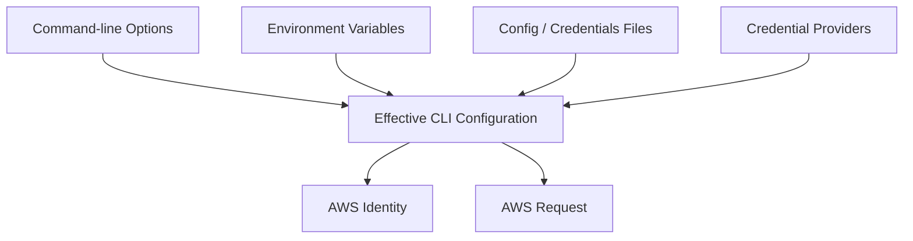

# 06- CLI Configuration and Profile Issues

## Overview

AWS CLI configuration problems are frequently caused by **multiple credential and configuration sources competing with each other**.

A command can appear to use:

```text
Profile A
```

while actually receiving credentials from:

```text
Environment variables
Shared credentials file
AWS Identity Center
AssumeRole
Container credentials
EC2 instance metadata
External credential process
```

The AWS CLI uses a defined precedence model. Command-line options and environment variables can override profile settings, while credential and configuration files provide the persistent baseline. ([AWS CLI configuration and precedence](https://docs.aws.amazon.com/cli/latest/userguide/cli-chap-configure.html))

The most important diagnostic principle is:

```text
Do not inspect only ~/.aws/config.

Determine what the CLI is actually using.
```

The standard diagnostic commands are:

```bash
aws configure list
aws configure list-profiles
aws sts get-caller-identity
```

These establish:

```text
What profile is selected?
Where did the credentials come from?
Which Region is active?
Which AWS identity is actually making the request?
```

---

## AWS CLI Configuration Model

Think of AWS CLI configuration as four related layers:



The important distinction is:

```text
Configuration
    → Region, output, pager, endpoints, profiles

Credentials
    → Access key, secret key, session token

Authentication provider
    → SSO, role, login, container, EC2, process, etc.
```

A profile can contain configuration without containing long-lived credentials.

For example, an IAM Identity Center profile is normally configured in `~/.aws/config`, while the `credentials` file is not used for that authentication method. ([AWS CLI configuration and credential files](https://docs.aws.amazon.com/cli/latest/userguide/cli-configure-files.html))

---

## Configuration File vs Credentials File

On Linux/macOS:

```text
~/.aws/config
~/.aws/credentials
```

On Windows:

```text
%UserProfile%\.aws\config
%UserProfile%\.aws\credentials
```

The files have different typical responsibilities:

| File | Typical contents |
|---|---|
| `config` | Region, output, SSO, role profiles, session configuration, CLI behavior |
| `credentials` | Access key, secret key, session token |
| `config` | Can also contain some credential settings |
| `credentials` | Used by CLI and many AWS SDKs for shared credentials |

AWS recommends keeping credential values in the `credentials` file when using file-based credentials. If the same profile contains credentials in both files, the `credentials` file takes precedence for the credential values. ([AWS CLI configuration and credential files](https://docs.aws.amazon.com/cli/latest/userguide/cli-configure-files.html))

---

## Profile Syntax Differences

This is a frequent source of configuration errors.

In `~/.aws/config`:

```ini
[profile development]
region = ap-south-1
output = json
```

In `~/.aws/credentials`:

```ini
[development]
aws_access_key_id = AKIA...
aws_secret_access_key = ...
```

Do **not** write:

```ini
[profile development]
```

inside the `credentials` file.

AWS explicitly documents this difference in section naming. ([AWS CLI configuration and credential files](https://docs.aws.amazon.com/cli/latest/userguide/cli-configure-files.html))

---

## The Default Profile

If no profile is explicitly selected:

```text
default
```

is used.

Example:

```ini
[default]
region = ap-south-1
output = json
```

Then:

```bash
aws sts get-caller-identity
```

uses the default profile unless another higher-precedence authentication/configuration mechanism changes the effective source.

A common mistake is assuming:

```text
No --profile
    =
Use ~/.aws/credentials [default]
```

That is only true when no other higher-precedence credential source is active.

---

## Named Profiles

Named profiles isolate environments and identities.

Example:

```ini
[profile development]
region = ap-south-1
output = json

[profile staging]
region = ap-south-1
output = json

[profile production-readonly]
region = ap-south-1
output = json
```

Use:

```bash
aws sts get-caller-identity \
    --profile production-readonly
```

or:

```bash
aws s3 ls \
    --profile development
```

AWS supports named profiles specifically for maintaining independent credential and configuration contexts. ([AWS named profiles](https://docs.aws.amazon.com/cli/latest/userguide/cli-configure-files.html))

---

## Profile Selection

A profile can be selected using:

```bash
aws s3 ls --profile production
```

or through:

```bash
AWS_PROFILE=production
```

For PowerShell:

```powershell
$env:AWS_PROFILE = "production"
```

On Windows `cmd.exe`:

```cmd
set AWS_PROFILE=production
```

The `--profile` command-line option overrides `AWS_PROFILE` for that command. ([AWS CLI environment variables](https://docs.aws.amazon.com/cli/latest/userguide/cli-configure-envvars.html))

---

## The `AWS_PROFILE` Trap

A common problem is:

```text
Engineer expects:
development

Environment contains:
AWS_PROFILE=production

Command:
aws s3 ls
```

The command uses:

```text
production
```

not the intended default profile.

Diagnose with:

```bash
echo "$AWS_PROFILE"
```

PowerShell:

```powershell
$env:AWS_PROFILE
```

Then:

```bash
aws configure list
```

For a sensitive command, use an explicit profile:

```bash
aws iam list-roles \
    --profile production-readonly
```

This reduces ambiguity.

---

## Credential Precedence

AWS CLI documents a precedence hierarchy in which command-line options are highest, followed by environment variables and then other credential/configuration sources. The exact chain includes role providers, web identity, IAM Identity Center, shared credentials/configuration, process credentials, container credentials, and EC2 instance-profile credentials. ([AWS CLI authentication](https://docs.aws.amazon.com/cli/latest/userguide/cli-chap-authentication.html))

A practical mental model is:

```text
Explicit command settings
        ↓
Environment
        ↓
Profile / credential provider
        ↓
Default / fallback providers
```

This is why a correctly configured profile can appear to be ignored.

---

## `aws configure list`

This is one of the most useful commands for profile troubleshooting:

```bash
aws configure list
```

For a specific profile:

```bash
aws configure list \
    --profile production
```

Example:

```text
      Name                    Value             Type    Location
      ----                    -----             ----    --------
   profile               production             env    AWS_PROFILE
access_key     ****************ABCD       shared-credentials-file
secret_key     ****************WXYZ       shared-credentials-file
    region                ap-south-1      config-file
```

The important columns are:

```text
NAME
VALUE
TYPE
LOCATION
```

`configure list` is specifically designed to show the resolved configuration and where each value came from. ([AWS CLI `configure list`](https://docs.aws.amazon.com/cli/latest/reference/configure/list.html))

---

## The Most Important Debugging Pattern

Use:

```bash
aws configure list
aws sts get-caller-identity
```

Together they answer:

```text
Where are credentials coming from?
        +
Who does AWS say I am?
```

For production:

```bash
aws configure list \
    --profile production-readonly

aws sts get-caller-identity \
    --profile production-readonly
```

Never assume the local configuration file is the source of truth.

---

## List Profiles

Use:

```bash
aws configure list-profiles
```

This prints configured profile names.

Example:

```text
default
development
staging
production-readonly
security
```

For a large workstation configuration, this is useful for confirming whether a profile exists at all. ([AWS CLI `list-profiles`](https://docs.aws.amazon.com/cli/latest/reference/configure/list-profiles.html))

---

## Profile Not Found

If:

```bash
aws sts get-caller-identity \
    --profile production
```

returns a profile/configuration error, check:

```bash
aws configure list-profiles
```

Then inspect:

```text
~/.aws/config
~/.aws/credentials
```

Look for:

```text
Spelling
Case
Section syntax
Malformed INI
Duplicate sections
Wrong file
Wrong home directory
```

On Windows, confirm the expected location:

```text
%UserProfile%\.aws\
```

---

## Incorrect Profile Section Syntax

Correct:

```ini
# ~/.aws/config

[profile production]
region = ap-south-1
output = json
```

Incorrect:

```ini
[production]
region = ap-south-1
```

for a standard named profile in the `config` file.

And the reverse is true for the `credentials` file:

```ini
# ~/.aws/credentials

[production]
aws_access_key_id = ...
aws_secret_access_key = ...
```

not:

```ini
[profile production]
```

This distinction is one of the most common profile configuration mistakes. ([AWS CLI configuration and credential files](https://docs.aws.amazon.com/cli/latest/userguide/cli-configure-files.html))

---

## Duplicate or Conflicting Profile Definitions

Avoid confusing configurations such as:

```ini
# config
[profile production]
region = ap-south-1
```

and:

```ini
# credentials
[production]
aws_access_key_id = OLDKEY
aws_secret_access_key = OLDSECRET
```

while expecting:

```text
aws login
```

or:

```text
SSO
```

to provide credentials for the same profile.

Different authentication mechanisms can conflict when the same profile contains multiple credential sources.

---

## `aws login` Profile Conflicts

A particularly important current CLI behavior is that `aws login` can coexist with older credentials in the same profile.

Example:

```text
aws login
    ↓
New login credentials

But profile already contains:
shared credentials
    ↓
Old credentials win
```

The result may be:

```text
ExpiredToken
Invalid credentials
Unexpected identity
```

AWS recommends:

```bash
aws configure list
```

and specifically notes that a profile resolving credentials from the shared credentials file may continue using those credentials instead of the login provider. ([AWS CLI sign-in troubleshooting](https://docs.aws.amazon.com/cli/latest/userguide/cli-configure-sign-in-troubleshoot.html))

---

## Fixing a `aws login` Conflict

Inspect:

```bash
aws configure list \
    --profile development
```

If you expect:

```text
TYPE = login
```

but see:

```text
shared-credentials-file
```

remove the conflicting static credentials from the profile.

Then:

```bash
aws login \
    --profile development
```

and verify:

```bash
aws configure list \
    --profile development
```

This is safer than repeatedly refreshing the wrong credential source.

---

## IAM Identity Center Profiles

Modern workforce access commonly uses:

```text
IAM Identity Center
    ↓
Named CLI profile
    ↓
Temporary AWS role credentials
```

Configure:

```bash
aws configure sso
```

AWS currently recommends the SSO session-based configuration for IAM Identity Center and supports browser-based PKCE authorization by default in recent CLI v2 releases. Device authorization can be explicitly selected with `--use-device-code`. ([AWS CLI IAM Identity Center configuration](https://docs.aws.amazon.com/cli/latest/userguide/cli-configure-sso.html))

---

## Typical IAM Identity Center Configuration

```ini
[sso-session company]
sso_start_url = https://company.awsapps.com/start
sso_region = ap-south-1
sso_registration_scopes = sso:account:access

[profile production-readonly]
sso_session = company
sso_account_id = 123456789012
sso_role_name = ReadOnly
region = ap-south-1
output = json
```

Then:

```bash
aws sso login \
    --profile production-readonly
```

Verify:

```bash
aws sts get-caller-identity \
    --profile production-readonly
```

AWS stores IAM Identity Center configuration in the `config` file and caches the associated authentication/session information separately. ([AWS CLI IAM Identity Center configuration](https://docs.aws.amazon.com/cli/latest/userguide/cli-configure-sso.html))

---

## IAM Identity Center Profile Failure

If:

```bash
aws sso login --profile production-readonly
```

works but:

```bash
aws sts get-caller-identity --profile production-readonly
```

fails, inspect:

```bash
aws configure list \
    --profile production-readonly
```

Then check:

```text
SSO session
SSO Region
Account ID
Role name
Profile name
Session expiration
```

Also confirm that the IAM Identity Center permission set still grants access to the specified account and role.

---

## IAM Identity Center Session Expiration

The CLI caches IAM Identity Center session credentials.

AWS documents that the CLI can automatically renew AWS credentials while the underlying IAM Identity Center session remains valid; once the refresh session expires, the user must sign in again. ([AWS IAM Identity Center concepts](https://docs.aws.amazon.com/cli/latest/userguide/cli-configure-sso-concepts.html))

Refresh with:

```bash
aws sso login \
    --profile production-readonly
```

Logout:

```bash
aws sso logout
```

Then log in again if necessary.

---

## Role Profiles

A role profile usually looks like:

```ini
[profile production]
role_arn = arn:aws:iam::123456789012:role/ProductionReadOnly
source_profile = development
region = ap-south-1
```

The CLI:

```text
Reads source credentials
    ↓
Calls STS AssumeRole
    ↓
Receives temporary credentials
    ↓
Caches them
    ↓
Uses them for AWS commands
```

AWS documents this role-profile behavior and the associated credential caching. ([AWS CLI role configuration](https://docs.aws.amazon.com/cli/latest/userguide/cli-configure-role.html))

---

## `source_profile`

Use `source_profile` when a named profile supplies the source credentials.

Example:

```ini
[profile development]
region = ap-south-1

[profile production]
role_arn = arn:aws:iam::123456789012:role/ProductionReadOnly
source_profile = development
region = ap-south-1
```

Then:

```bash
aws sts get-caller-identity \
    --profile production
```

The source profile can itself use:

```text
Access keys
IAM Identity Center
Another compatible credential provider
```

depending on the configuration.

---

## `credential_source`

Use `credential_source` when the environment itself supplies the source identity.

Example:

```ini
[profile production]
role_arn = arn:aws:iam::123456789012:role/ProductionReadOnly
credential_source = Ec2InstanceMetadata
region = ap-south-1
```

Supported values include:

```text
Environment
Ec2InstanceMetadata
EcsContainer
```

AWS documents that `source_profile` and `credential_source` are mutually exclusive. ([AWS CLI configuration and credential files](https://docs.aws.amazon.com/cli/latest/userguide/cli-configure-files.html))

---

## `source_profile` vs `credential_source`

| Setting | Source of credentials | Typical use |
|---|---|---|
| `source_profile` | Named CLI profile | Developer workstation |
| `credential_source = Environment` | Environment variables | Automation |
| `credential_source = Ec2InstanceMetadata` | EC2 instance role | EC2 |
| `credential_source = EcsContainer` | ECS task credentials | ECS |

Choose based on where the source identity actually lives.

---

## Role Chaining in Profiles

Profiles can form chains:

```text
development
    ↓
staging-role
    ↓
production-role
```

Example:

```ini
[profile development]

[profile staging]
role_arn = arn:aws:iam::222222222222:role/StagingRole
source_profile = development

[profile production]
role_arn = arn:aws:iam::333333333333:role/ProductionRole
source_profile = staging
```

This can be useful, but it creates:

```text
Additional trust relationships
Additional credential resolution
Additional session limits
More complicated troubleshooting
```

AWS documents that role chaining is subject to a one-hour maximum session duration. ([AWS IAM role chaining](https://docs.aws.amazon.com/IAM/latest/UserGuide/id_roles_terms-and-concepts.html))

Avoid unnecessary profile chains.

---

## External ID in a Role Profile

For third-party cross-account use:

```ini
[profile vendor-production]
role_arn = arn:aws:iam::123456789012:role/VendorAccess
source_profile = vendor-base
external_id = vendor-customer-123
```

The target trust policy must require the corresponding `sts:ExternalId`.

AWS documents `external_id` as a role-profile setting for cross-account scenarios, especially third-party access. ([AWS CLI role configuration](https://docs.aws.amazon.com/cli/latest/userguide/cli-configure-role.html))

---

## MFA in a Role Profile

Example:

```ini
[profile production-admin]
role_arn = arn:aws:iam::123456789012:role/ProductionAdmin
source_profile = development
mfa_serial = arn:aws:iam::111111111111:mfa/developer
region = ap-south-1
```

Then:

```bash
aws sts get-caller-identity \
    --profile production-admin
```

The CLI prompts for the MFA code when it needs to establish the role session. ([AWS CLI role configuration](https://docs.aws.amazon.com/cli/latest/userguide/cli-configure-role.html))

---

## Common MFA Profile Problems

Typical causes:

```text
Wrong MFA ARN
Wrong source profile
Missing MFA device
Trust policy does not require the expected condition
Expired / invalid MFA code
Credential source is different from expected
```

Check:

```bash
aws configure list \
    --profile production-admin
```

Then inspect the target role trust policy.

---

## Role Session Name

For privileged roles, use a meaningful session name:

```ini
[profile production]
role_arn = arn:aws:iam::123456789012:role/ProductionReadOnly
source_profile = development
role_session_name = backend-operator
```

This improves CloudTrail attribution.

The resulting assumed-role identity contains:

```text
assumed-role/ProductionReadOnly/backend-operator
```

AWS documents `role_session_name` as a mechanism for making assumed-role sessions easier to identify in logs and audit trails. ([AWS CLI role configuration](https://docs.aws.amazon.com/cli/latest/userguide/cli-configure-role.html))

---

## `AWS_CONFIG_FILE`

The CLI supports changing the location of the configuration file with:

```text
AWS_CONFIG_FILE
```

Example:

```bash
export AWS_CONFIG_FILE="$HOME/.aws/config-work"
```

Windows PowerShell:

```powershell
$env:AWS_CONFIG_FILE = "$HOME\.aws\config-work"
```

The default remains:

```text
~/.aws/config
```

on Linux/macOS and the corresponding `.aws\config` path under the Windows user profile. ([AWS CLI environment variables](https://docs.aws.amazon.com/cli/latest/userguide/cli-configure-envvars.html))

---

## `AWS_SHARED_CREDENTIALS_FILE`

The shared credentials file can also be relocated:

```bash
export AWS_SHARED_CREDENTIALS_FILE="$HOME/.aws/credentials-work"
```

Windows PowerShell:

```powershell
$env:AWS_SHARED_CREDENTIALS_FILE = "$HOME\.aws\credentials-work"
```

Default:

```text
~/.aws/credentials
```

Use this deliberately; an unexpected value can make it appear that profiles disappeared.

([AWS CLI environment variables](https://docs.aws.amazon.com/cli/latest/userguide/cli-configure-envvars.html))

---

## Wrong Config File

A common enterprise or CI problem is:

```text
Engineer edits:
~/.aws/config

CLI reads:
$CUSTOM_CONFIG
```

Diagnose:

```bash
echo "$AWS_CONFIG_FILE"
echo "$AWS_SHARED_CREDENTIALS_FILE"
```

PowerShell:

```powershell
$env:AWS_CONFIG_FILE
$env:AWS_SHARED_CREDENTIALS_FILE
```

Then:

```bash
aws configure list
```

Do not troubleshoot the default files until you verify they are actually being used.

---

## Profile Names With Environment Variables

A profile name can be passed through:

```bash
AWS_PROFILE=production-readonly
```

For automation:

```bash
AWS_PROFILE=production-readonly \
aws sts get-caller-identity
```

This is useful for scripts, but be careful with long-lived shell sessions.

After switching environments:

```bash
unset AWS_PROFILE
```

or PowerShell:

```powershell
Remove-Item Env:AWS_PROFILE
```

A stale profile environment variable is a common cause of "wrong account" incidents.

---

## Explicit `--profile` for High-Risk Commands

For production IAM operations, prefer explicit profile selection:

```bash
aws iam get-role \
    --role-name ProductionRole \
    --profile production-readonly
```

For high-impact operations:

```bash
aws iam update-assume-role-policy \
    --role-name ProductionRole \
    --policy-document file://trust.json \
    --profile production-security
```

This makes the intended security context visible in:

```text
Shell history
Runbooks
Pull requests
Operational procedures
Incident documentation
```

---

## Region Configuration Problems

A profile can define:

```ini
[profile production]
region = ap-south-1
```

while the shell contains:

```text
AWS_REGION=us-east-1
```

or a command explicitly specifies:

```bash
--region eu-west-1
```

The command-line option takes precedence over lower-level configuration. ([AWS CLI configuration precedence](https://docs.aws.amazon.com/cli/latest/userguide/cli-chap-configure.html))

Inspect:

```bash
aws configure list \
    --profile production
```

Then explicitly test:

```bash
aws sts get-caller-identity \
    --profile production \
    --region ap-south-1
```

---

## `AWS_REGION` and `AWS_DEFAULT_REGION`

Common environment variables include:

```text
AWS_REGION
AWS_DEFAULT_REGION
```

For SDK-compatible applications, `AWS_REGION` is commonly used.

For AWS CLI workflows, both may appear in existing environments.

The safest approach during troubleshooting is:

```bash
aws configure list
```

rather than assuming which setting is winning.

AWS documents `AWS_REGION` and related Region settings in the CLI environment-variable reference. ([AWS CLI environment variables](https://docs.aws.amazon.com/cli/latest/userguide/cli-configure-envvars.html))

---

## Output and Pager Problems

Profile issues are not limited to credentials.

A profile can also contain:

```ini
output = json
```

and CLI behavior can be affected by:

```text
AWS_PAGER
cli_pager
--no-cli-pager
```

For CI:

```bash
aws iam list-roles \
    --profile production-readonly \
    --output json \
    --no-cli-pager
```

This prevents interactive pager behavior from blocking automation.

AWS documents `AWS_PAGER` and CLI pager configuration in the environment-variable reference. ([AWS CLI environment variables](https://docs.aws.amazon.com/cli/latest/userguide/cli-configure-envvars.html))

---

## Proxy and Endpoint Configuration

Profile issues can also appear as network or endpoint problems.

Inspect configuration that may affect:

```text
endpoint_url
proxy
CA bundle
FIPS endpoint
dual-stack endpoint
```

For a suspicious endpoint:

```bash
aws sts get-caller-identity \
    --profile production \
    --debug
```

Avoid:

```bash
--no-verify-ssl
```

as a normal workaround.

If an enterprise CA is required, configure an appropriate CA bundle instead.

---

## File Permissions and Credential Security

The AWS CLI stores sensitive credentials in local files when file-based credentials are used.

Protect:

```text
~/.aws/credentials
~/.aws/config
```

on Unix-like systems.

Example:

```bash
chmod 600 ~/.aws/credentials
chmod 600 ~/.aws/config
```

On Windows, use appropriate filesystem ACLs and ensure the files are not readable by other users.

Do not place these files in:

```text
Git repositories
Docker images
Public shared directories
CI artifacts
Application source trees
```

---

## Credential File Is Not a Secret Vault

The file:

```text
~/.aws/credentials
```

is plaintext storage.

Treat it as:

```text
Sensitive local credential material
```

not:

```text
Encrypted enterprise secret manager
```

For production workloads, prefer:

```text
IAM roles
IAM Identity Center
OIDC
Managed workload credentials
```

AWS currently describes IAM-user long-term credentials as a non-recommended option for normal CLI authentication. ([AWS CLI authentication](https://docs.aws.amazon.com/cli/latest/userguide/cli-chap-authentication.html))

---

## AWS CLI and Boto3 Profiles

The shared profile model is useful because Boto3 can also consume AWS shared configuration.

Example:

```ini
[profile development]
region = ap-south-1
output = json
```

and credentials:

```ini
[development]
aws_access_key_id = ...
aws_secret_access_key = ...
```

Python:

```python
import boto3

session = boto3.Session(
    profile_name="development",
)

print(session.region_name)
```

This can create consistency between:

```text
CLI
Django management commands
FastAPI workers
Celery tasks
Local scripts
```

However, always verify the actual credential-provider behavior of the SDK/runtime being used. AWS documents standardized credential providers but also notes that provider chains can vary by SDK or tool. ([AWS standardized credential providers](https://docs.aws.amazon.com/sdkref/latest/guide/standardized-credentials.html))

---

## Boto3 Profile Confusion

A developer may run:

```bash
AWS_PROFILE=development python script.py
```

while the script explicitly uses:

```python
boto3.Session(profile_name="production")
```

The explicit profile in application code can change the identity.

Therefore, when debugging CLI vs Python differences, compare:

```text
CLI profile
Application profile
Environment variables
Explicit SDK configuration
Runtime credential provider
```

Do not assume both tools use the same profile simply because they run on the same machine.

---

## Docker Profile Problems

A container may not have access to the host's:

```text
~/.aws/config
~/.aws/credentials
```

unless they are deliberately mounted or otherwise provided.

This creates:

```text
Host:
aws sts get-caller-identity
    ✅

Container:
aws sts get-caller-identity
    ❌
```

For local development, explicitly configure how the container receives credentials.

For production:

```text
ECS
    → Task role

EKS
    → Workload identity
```

are preferable to copying local credential files into containers.

---

## CI/CD Profile Problems

CI runners often have:

```text
AWS_PROFILE
AWS_ACCESS_KEY_ID
AWS_SECRET_ACCESS_KEY
AWS_SESSION_TOKEN
AWS_REGION
AWS_CONFIG_FILE
AWS_SHARED_CREDENTIALS_FILE
```

set by the runner, organization, or pipeline.

A profile that works locally can therefore behave differently in CI.

Always start a diagnostic job with:

```bash
aws configure list
aws sts get-caller-identity
```

and verify:

```text
Account
Role
Credential source
Region
```

Avoid printing secret values.

---

## `AWS_PROFILE` in CI/CD

A common anti-pattern is:

```text
AWS_PROFILE=production
```

combined with:

```text
OIDC deployment role
```

where the intended role should be selected through role assumption or web identity instead.

The result can be:

```text
CI environment
    ↓
Stale local-style profile
    ↓
Wrong credential source
```

For modern CI/CD:

```text
OIDC
    ↓
Assume role with web identity
    ↓
Temporary credentials
```

should normally be the intended authentication path.

---

## Diagnosing With `--debug`

When normal commands do not explain profile behavior:

```bash
aws sts get-caller-identity \
    --profile production \
    --debug
```

Use debug output to inspect:

```text
Credential provider resolution
Configuration source
Endpoint
Region
Request signing
Retries
```

AWS recommends debug logging as an additional way to identify where the CLI is resolving credentials when multiple providers are configured. ([AWS CLI sign-in troubleshooting](https://docs.aws.amazon.com/cli/latest/userguide/cli-configure-sign-in-troubleshoot.html))

Never publish raw debug output without reviewing it for sensitive information.

---

## Profile Inspection Workflow

For an unknown profile:

```bash
aws configure list-profiles
```

Then:

```bash
aws configure list \
    --profile production
```

Then:

```bash
aws sts get-caller-identity \
    --profile production
```

Then inspect:

```text
~/.aws/config
~/.aws/credentials
AWS_PROFILE
AWS_CONFIG_FILE
AWS_SHARED_CREDENTIALS_FILE
```

Finally, if still unclear:

```bash
aws sts get-caller-identity \
    --profile production \
    --debug
```

This progression minimizes unnecessary investigation.

---

## Wrong Account Troubleshooting

If a destructive operation is about to run:

```bash
aws sts get-caller-identity \
    --profile production
```

Verify:

```text
Account = expected production account
Arn     = expected role
```

Then:

```bash
aws configure list \
    --profile production
```

For high-risk changes, keep the profile explicit:

```bash
aws iam update-role-description \
    --role-name ProductionRole \
    --description "Production role" \
    --profile production-security
```

Do not depend on:

```text
Whatever profile happens to be active
```

---

## Profile Comparison

When one profile works and another fails:

```bash
aws configure list \
    --profile development

aws configure list \
    --profile production
```

Compare:

```text
Credential source
Region
Role ARN
SSO session
Account
Role name
External ID
MFA
Output
Endpoint
```

Then:

```bash
aws sts get-caller-identity \
    --profile development

aws sts get-caller-identity \
    --profile production
```

A comparison often exposes the difference immediately.

---

## Profile Configuration Matrix

| Scenario | Recommended profile approach |
|---|---|
| Local development | IAM Identity Center or `aws login` |
| Multi-account workforce | IAM Identity Center named profiles |
| Cross-account operations | `role_arn` + controlled source profile |
| EC2 | `credential_source = Ec2InstanceMetadata` |
| ECS | `credential_source = EcsContainer` |
| CI/CD OIDC | Web identity role configuration |
| Legacy local integration | Dedicated named profile with limited credentials |
| Production admin | Dedicated named profile with explicit use |
| Read-only production | Separate read-only profile |

AWS recommends short-term credentials and role-based approaches over long-lived IAM-user access keys for normal CLI authentication. ([AWS CLI authentication](https://docs.aws.amazon.com/cli/latest/userguide/cli-chap-authentication.html))

---

## Recommended Multi-Account Layout

A practical workstation might use:

```text
company SSO session
    |
    +-- development
    +-- staging
    +-- production-readonly
    +-- security-readonly
```

Example:

```ini
[sso-session company]
sso_start_url = https://company.awsapps.com/start
sso_region = ap-south-1
sso_registration_scopes = sso:account:access

[profile development]
sso_session = company
sso_account_id = 111111111111
sso_role_name = Developer
region = ap-south-1

[profile staging]
sso_session = company
sso_account_id = 222222222222
sso_role_name = Developer
region = ap-south-1

[profile production-readonly]
sso_session = company
sso_account_id = 333333333333
sso_role_name = ReadOnly
region = ap-south-1
```

The goal is:

```text
One identity system
+
Named account contexts
+
Least privilege
+
Explicit production access
```

---

## Recommended Production Profile Strategy

Avoid:

```text
default = production-admin
```

Prefer:

```text
default = development
```

or no default profile at all.

Then use:

```bash
--profile production-readonly
```

or:

```bash
--profile production-security
```

for privileged contexts.

This reduces accidental production operations from:

```bash
aws ...
```

where the operator forgot which identity was active.

---

## Authentication Profile vs Authorization

A profile selects or constructs an AWS identity.

It does not itself define the complete authorization model.

For example:

```ini
[profile production]
role_arn = arn:aws:iam::123456789012:role/ProductionReadOnly
```

This profile determines:

```text
Which role session to obtain
```

The target role's permission policies determine:

```text
What that role session can do
```

And further restrictions may come from:

```text
Permissions boundary
SCP
RCP
Session policy
Resource policy
Conditions
```

Profile troubleshooting therefore stops at:

```text
Correct identity established
```

and then authorization troubleshooting begins.

---

## Troubleshooting Matrix

| Symptom | Likely cause | First diagnostic |
|---|---|---|
| Profile not found | Wrong file/path/name | `aws configure list-profiles` |
| Unexpected account | Wrong credential source | `aws sts get-caller-identity` |
| `aws login` still uses old credentials | Shared credentials conflict | `aws configure list` |
| SSO profile fails | Expired SSO session / wrong config | `aws sso login --profile ...` |
| Role profile fails | Source profile / trust / role ARN | `aws configure list` + role inspection |
| Role chain fails | Chaining or trust issue | Inspect each profile |
| `NoCredentialsError` in Python | Different credential chain | Inspect `boto3.Session()` |
| Works locally, fails in CI | Environment/provider mismatch | `aws configure list` |
| Works on host, fails in Docker | Credentials not available in container | Inspect runtime provider |
| Wrong Region | Env/profile/CLI conflict | `aws configure list` |
| Config changes ignored | `AWS_CONFIG_FILE` points elsewhere | Inspect env variable |
| Credentials changes ignored | `AWS_SHARED_CREDENTIALS_FILE` points elsewhere | Inspect env variable |
| Pager blocks CI | `AWS_PAGER` / pager config | `--no-cli-pager` |
| Signature errors | Wrong credentials, Region, or clock | Identity + Region + system time |
| `EntityAlreadyExists` | Existing resource | `get-*` / `list-*` |
| AccessDenied after profile works | IAM policy evaluation | Separate IAM troubleshooting |

---

## Common Mistakes

| Mistake | Why it happens | Better approach |
|---|---|---|
| Assuming `--profile` is the only source | Environment variables can override credentials | Use `configure list` |
| Putting `[profile name]` in credentials file | Config and credentials syntax differ | Use `[name]` in credentials file |
| Leaving stale access keys in an SSO profile | Old credentials continue to win | Remove conflicting credentials |
| Setting `AWS_PROFILE` permanently | Shell retains old account context | Use explicit profiles for sensitive commands |
| Editing the wrong `.aws` directory | Custom environment paths are active | Check `AWS_CONFIG_FILE` and `AWS_SHARED_CREDENTIALS_FILE` |
| Running `aws login` repeatedly | Another provider is taking precedence | Inspect credential source |
| Copying local profiles into containers | Runtime identity is different | Use workload identity |
| Using a production admin profile as `default` | Convenience | Use low-privilege default or none |
| Ignoring role paths | ARN is incomplete or incorrect | Inspect exact ARN |
| Mixing role chains unnecessarily | Configuration becomes opaque | Minimize assumption layers |
| Hard-coding long-lived credentials | Quick local setup | Use SSO, roles, OIDC, or managed credentials |
| Assuming CLI and SDK always resolve identically | Providers differ by runtime/tool | Verify the actual runtime credential chain |

---

## Security Considerations

AWS CLI profiles are part of the security boundary on developer machines and automation runners.

Protect:

```text
~/.aws/credentials
~/.aws/config
SSO caches
Credential-process configuration
Environment variables
CI/CD runner configuration
```

Avoid:

```text
Credentials in Git
Credentials in `.env` committed to Git
Access keys in Dockerfiles
Access keys in CI logs
Copying production credentials between machines
Shared administrator profiles
```

Prefer:

```text
IAM Identity Center
AssumeRole
OIDC
ECS task roles
EKS workload identity
EC2 instance profiles
Temporary credentials
```

---

## Reliability Considerations

Profile configuration should be deterministic.

For production automation:

```text
Explicit profile
+
Explicit Region where useful
+
Explicit identity verification
+
Non-interactive output
```

Example:

```bash
aws sts get-caller-identity \
    --profile production-readonly \
    --region ap-south-1 \
    --output json \
    --no-cli-pager
```

For CI/CD, avoid relying on a developer's local configuration layout.

Use:

```text
OIDC
Role assumption
Environment-specific deployment identity
```

rather than copying:

```text
~/.aws/
```

into the runner.

---

## High Availability Considerations

Credential configuration should not become a hidden single point of failure.

For workloads:

```text
Application
    ↓
Managed credential provider
    ↓
Temporary credentials
    ↓
Automatic refresh
```

is generally more resilient than:

```text
Application
    ↓
One permanent access key
```

For workforce CLI usage:

```text
IAM Identity Center
    ↓
Named profiles
    ↓
Temporary role credentials
```

reduces reliance on manually maintained access keys.

AWS SDKs and tools provide standardized credential providers that can automatically renew supported temporary credentials. ([AWS standardized credential providers](https://docs.aws.amazon.com/sdkref/latest/guide/standardized-credentials.html))

---

## Disaster Recovery Considerations

For disaster recovery, document:

```text
AWS account IDs
Profile names
SSO configuration
Role ARNs
Trust relationships
OIDC providers
Break-glass roles
MFA recovery
CLI configuration conventions
```

Do not treat:

```text
~/.aws/credentials
```

as the enterprise source of truth.

Recoverable IAM access should be defined by:

```text
Infrastructure as code
Identity Center configuration
IAM roles
Trust policies
OIDC configuration
Operational runbooks
```

---

## Production Troubleshooting Runbook

```text
CLI configuration issue
    ↓
1. Run:
   aws --version

2. Run:
   aws configure list-profiles

3. Run:
   aws configure list --profile <profile>

4. Run:
   aws sts get-caller-identity --profile <profile>

5. Check:
   AWS_PROFILE

6. Check:
   AWS_CONFIG_FILE

7. Check:
   AWS_SHARED_CREDENTIALS_FILE

8. Inspect:
   ~/.aws/config
   ~/.aws/credentials

9. Determine credential provider:
   SSO / login / role / env / process / container / EC2

10. Check Region:
    --region

11. Check profile role configuration:
    role_arn
    source_profile
    credential_source

12. If SSO:
    aws sso login --profile <profile>

13. If login:
    aws login --profile <profile>

14. If role:
    verify source credentials and trust policy

15. If still unclear:
    aws ... --debug

16. Retest:
    aws sts get-caller-identity
```

---

## Interview Traps

### "Where does AWS CLI store profiles?"

Normally:

```text
~/.aws/config
~/.aws/credentials
```

on Linux/macOS and the corresponding `.aws` directory under the Windows user profile. The exact files used depend on the authentication method. ([AWS CLI configuration and credential files](https://docs.aws.amazon.com/cli/latest/userguide/cli-configure-files.html))

### "Why is `[profile production]` used in one file but `[production]` in another?"

Because:

```text
config:
    [profile production]

credentials:
    [production]
```

This is part of the AWS CLI file format. ([AWS CLI configuration and credential files](https://docs.aws.amazon.com/cli/latest/userguide/cli-configure-files.html))

### "Why does `AWS_PROFILE=dev` not seem to work?"

Possible causes:

```text
--profile overrides it
Different environment variables provide credentials
Profile itself uses a different provider
Config file location was overridden
```

### "Why does `aws login` succeed but the command still uses an old identity?"

The target profile may still contain another credential source, such as shared credentials, that takes precedence. Check:

```bash
aws configure list
```

([AWS CLI sign-in troubleshooting](https://docs.aws.amazon.com/cli/latest/userguide/cli-configure-sign-in-troubleshoot.html))

### "What is the difference between a profile and a role?"

A profile is a CLI configuration context.

A role is an AWS IAM identity that can be assumed to obtain temporary permissions.

A profile may point to:

```text
Direct credentials
SSO
AssumeRole
Web identity
Container / EC2 credential source
```

---

## Senior-Level Mental Model

Treat the AWS CLI configuration as a resolution graph:

```text
Command
    ↓
Global options
    ↓
Environment
    ↓
Selected profile
    ↓
Credential provider
    ↓
Source identity
    ↓
Optional AssumeRole / federation
    ↓
Temporary credentials
    ↓
Caller identity
    ↓
AWS authorization
```

When something fails, identify which layer is actually wrong.

For example:

```text
Wrong profile
    ≠
Wrong role trust policy

Expired credential
    ≠
Missing IAM permission

Wrong AWS account
    ≠
Missing resource

SSO session expired
    ≠
Role policy denied access
```

This separation dramatically reduces troubleshooting time.

---

## Recommended Developer Workflow

For day-to-day development:

```text
1. Use IAM Identity Center or another approved federated method.

2. Maintain named profiles for environments.

3. Avoid a production-admin default profile.

4. Verify identity with get-caller-identity.

5. Use --profile explicitly for production.

6. Keep profile configuration outside repositories.

7. Use roles rather than long-lived keys.

8. Keep CI/CD authentication separate from developer profiles.

9. Use workload identity inside AWS compute.

10. Remove stale credentials after migrating authentication methods.
```

A safe pre-production habit is:

```bash
aws sts get-caller-identity \
    --profile production-readonly
```

before executing any high-impact command.

---

## AWS Documentation Links

- [AWS CLI Configuration and Credential Files](https://docs.aws.amazon.com/cli/latest/userguide/cli-configure-files.html)
- [Configuring Settings for the AWS CLI](https://docs.aws.amazon.com/cli/latest/userguide/cli-chap-configure.html)
- [AWS CLI Authentication and Credential Precedence](https://docs.aws.amazon.com/cli/latest/userguide/cli-chap-authentication.html)
- [AWS CLI Environment Variables](https://docs.aws.amazon.com/cli/latest/userguide/cli-configure-envvars.html)
- [AWS CLI IAM Identity Center Configuration](https://docs.aws.amazon.com/cli/latest/userguide/cli-configure-sso.html)
- [AWS CLI IAM Identity Center Concepts](https://docs.aws.amazon.com/cli/latest/userguide/cli-configure-sso-concepts.html)
- [Using an IAM Role in the AWS CLI](https://docs.aws.amazon.com/cli/latest/userguide/cli-configure-role.html)
- [AWS CLI `configure list`](https://docs.aws.amazon.com/cli/latest/reference/configure/list.html)
- [AWS CLI `configure list-profiles`](https://docs.aws.amazon.com/cli/latest/reference/configure/list-profiles.html)
- [AWS CLI `login`](https://docs.aws.amazon.com/cli/latest/reference/login/)
- [AWS CLI Sign-In Troubleshooting](https://docs.aws.amazon.com/cli/latest/userguide/cli-configure-sign-in-troubleshoot.html)
- [AWS SDKs and Tools Standardized Credential Providers](https://docs.aws.amazon.com/sdkref/latest/guide/standardized-credentials.html)
- [AWS SDK Authentication](https://docs.aws.amazon.com/sdkref/latest/guide/access.html)
- [AWS IAM Role Chaining](https://docs.aws.amazon.com/IAM/latest/UserGuide/id_roles_terms-and-concepts.html)
- [AWS CLI Troubleshooting](https://docs.aws.amazon.com/cli/latest/userguide/cli-chap-troubleshooting.html)

## Key Takeaways

- **Profile problems are usually credential-resolution problems:** use `aws configure list` and `aws sts get-caller-identity` to determine where credentials come from and which AWS identity is actually active.
- **Know the difference between `config` and `credentials`:** named profiles use `[profile name]` in `config` and `[name]` in `credentials`; mixing the formats can make profiles appear broken. ([AWS CLI configuration and credential files](https://docs.aws.amazon.com/cli/latest/userguide/cli-configure-files.html))
- **Environment variables can silently override expectations:** `AWS_PROFILE`, `AWS_CONFIG_FILE`, `AWS_SHARED_CREDENTIALS_FILE`, credential variables, and Region variables can make a correctly configured profile behave differently.
- **Prefer federated and role-based profiles:** IAM Identity Center, `aws login`, AssumeRole, OIDC, ECS task credentials, EC2 instance profiles, and EKS workload identity reduce long-lived credential management. ([AWS CLI authentication](https://docs.aws.amazon.com/cli/latest/userguide/cli-chap-authentication.html))
- **Keep production context explicit:** use named profiles, verify the caller identity before high-impact operations, avoid a production-admin default profile, and keep developer CLI configuration separate from CI/CD and workload credentials.