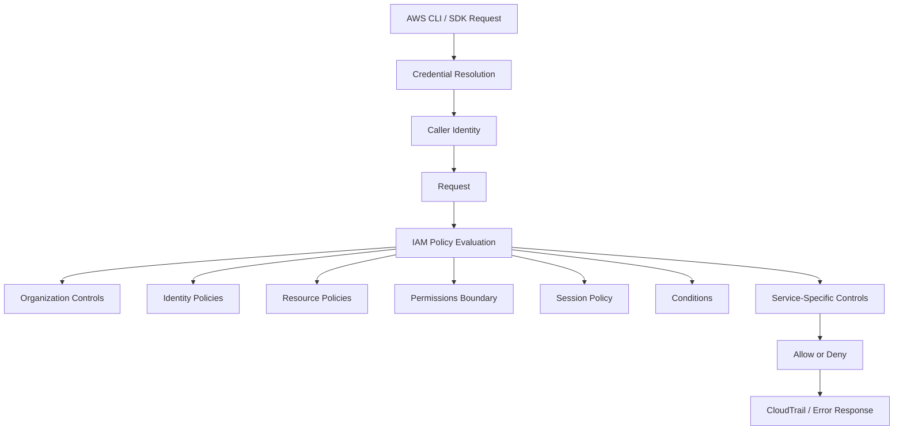
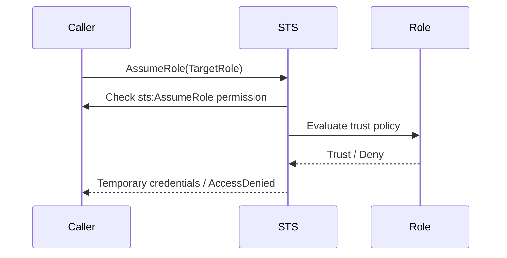
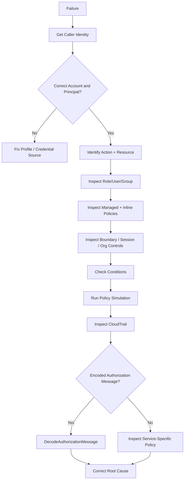
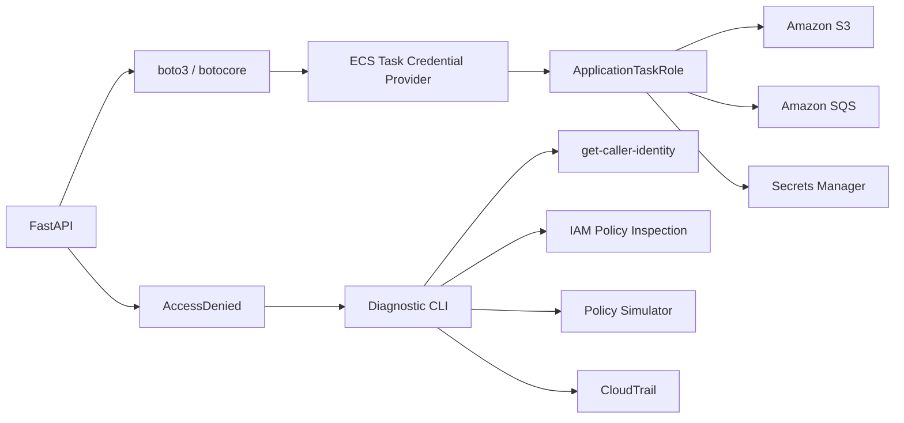

# 07- Diagnostic Tools and Debugging Commands

## Overview

IAM failures are rarely solved efficiently by adding permissions at random. The faster approach is to identify the exact **principal, action, resource, request context, and policy layer** involved in the authorization decision.

AWS provides several diagnostic tools for this purpose:

```text
AWS CLI configuration inspection
        ↓
Caller identity verification
        ↓
IAM entity and policy inspection
        ↓
Policy simulation / validation
        ↓
CloudTrail request inspection
        ↓
Authorization message decoding
        ↓
Service-specific troubleshooting
```

The core diagnostic principle is:

```text
First establish who the caller is.
Then establish what AWS was asked to authorize.
Then determine which policy layer produced the decision.
```

This is especially important in production systems where the caller may be:

```text
IAM Identity Center session
Assumed IAM role
EC2 instance role
ECS task role
Lambda execution role
EKS workload identity
CI/CD OIDC session
Cross-account role session
```

The most useful diagnostic commands are:

```bash
aws configure list
aws sts get-caller-identity
aws iam get-role
aws iam list-attached-role-policies
aws iam list-role-policies
aws iam get-policy-version
aws iam simulate-principal-policy
aws accessanalyzer validate-policy
aws cloudtrail lookup-events
aws sts decode-authorization-message
```

---

## IAM Diagnostic Model

A useful debugging model is to separate IAM problems into distinct layers:



When troubleshooting, do not mix failures from different layers.

For example:

| Symptom | Likely layer |
|---|---|
| `Unable to locate credentials` | Credential resolution |
| `InvalidClientTokenId` | Authentication |
| Wrong account | Caller identity / profile |
| `AccessDenied` | Authorization |
| `UnauthorizedOperation` | Authorization |
| `MalformedPolicyDocument` | Policy syntax/structure |
| `AccessDenied` during `AssumeRole` | Trust policy / source authorization |
| Works in IAM simulator but fails in production | Runtime context / resource policy / service-specific control |
| Works locally but fails in ECS | Workload credential source |
| Works in one account but not another | Cross-account policy/trust/org controls |

---

## First Diagnostic Rule: Verify the Caller

The most important command in IAM troubleshooting is:

```bash
aws sts get-caller-identity
```

With a named profile:

```bash
aws sts get-caller-identity \
    --profile production-readonly
```

Typical response:

```json
{
  "UserId": "AROAEXAMPLE:session-name",
  "Account": "123456789012",
  "Arn": "arn:aws:sts::123456789012:assumed-role/ProductionReadOnly/session-name"
}
```

`GetCallerIdentity` returns information about the IAM user or role whose credentials are being used. AWS documents that no permissions are required for the operation, and even an explicit deny on `sts:GetCallerIdentity` does not prevent the identity information from being returned. ([AWS CLI `get-caller-identity`](https://docs.aws.amazon.com/cli/latest/reference/sts/get-caller-identity.html))

Always verify:

```text
Account
Arn
UserId
```

before investigating permissions.

---

## Why `get-caller-identity` Is So Valuable

Consider:

```text
Engineer expects:
arn:aws:iam::123456789012:role/ProductionRole

Actual:
arn:aws:sts::999999999999:assumed-role/DevelopmentRole/session
```

No amount of production IAM policy editing will fix the actual problem.

The problem is:

```text
Wrong identity
```

not:

```text
Insufficient authorization
```

This is why the recommended first pair is:

```bash
aws configure list
aws sts get-caller-identity
```

---

## Inspect Effective CLI Configuration

Run:

```bash
aws configure list
```

For a specific profile:

```bash
aws configure list \
    --profile production
```

This exposes the resolved values and their sources.

Typical output:

```text
      Name                    Value             Type    Location
      ----                    -----             ----    --------
   profile               production             env    AWS_PROFILE
access_key     ****************ABCD       shared-credentials-file
secret_key     ****************WXYZ       shared-credentials-file
    region                ap-south-1      config-file
```

The important diagnostic question is not merely:

```text
"What value is configured?"
```

but:

```text
"Where did this value come from?"
```

AWS provides `aws configure list` specifically for inspecting resolved configuration and credential sources. ([AWS CLI `configure list`](https://docs.aws.amazon.com/cli/latest/reference/configure/list.html))

---

## List Available Profiles

Use:

```bash
aws configure list-profiles
```

Example:

```text
default
development
staging
production-readonly
security
```

This quickly distinguishes:

```text
Profile does not exist
```

from:

```text
Profile exists but resolves incorrectly
```

([AWS CLI `configure list-profiles`](https://docs.aws.amazon.com/cli/latest/reference/configure/list-profiles.html))

---

## Profile Verification Procedure

For a profile-related problem:

```bash
aws configure list-profiles
```

Then:

```bash
aws configure list \
    --profile production
```

Then:

```bash
aws sts get-caller-identity \
    --profile production
```

Then inspect relevant profile sources:

```text
AWS_PROFILE
AWS_CONFIG_FILE
AWS_SHARED_CREDENTIALS_FILE
~/.aws/config
~/.aws/credentials
```

Only after identity is confirmed should you investigate IAM authorization.

---

## Use `--debug` for Credential and Request Diagnostics

When normal output is insufficient:

```bash
aws sts get-caller-identity \
    --profile production \
    --debug
```

The debug stream can expose:

```text
Credential provider resolution
Configuration resolution
Endpoint selection
Region
Request construction
Signing
Retries
HTTP responses
```

Use it selectively because debug output can contain sensitive operational information. Review and redact logs before storing or sharing them.

A good progression is:

```text
Normal command
    ↓
configure list
    ↓
get-caller-identity
    ↓
--debug
```

Do not start every investigation with `--debug`; it creates a large amount of noise.

---

## AWS CLI Error Output

For automation and troubleshooting, structured errors are easier to process than terminal-oriented output.

Useful commands include:

```bash
aws iam get-role \
    --role-name ProductionRole \
    --output json \
    --no-cli-pager
```

For CI/CD:

```bash
aws sts get-caller-identity \
    --output json \
    --no-cli-pager
```

The current AWS CLI also supports configurable error formatting through `--cli-error-format`, which is useful when standardizing diagnostics in automation. ([AWS CLI global options](https://docs.aws.amazon.com/cli/latest/userguide/cli-configure-options.html))

---

## Inspect an IAM Role

Use:

```bash
aws iam get-role \
    --role-name ProductionRole
```

The response includes:

```text
RoleName
RoleId
Arn
Path
AssumeRolePolicyDocument
MaxSessionDuration
PermissionsBoundary
Tags
```

Most importantly, `get-role` exposes the **trust policy**.

AWS documents that `get-role` returns the role's trust policy, while role permission policies are inspected separately. ([AWS CLI `get-role`](https://docs.aws.amazon.com/cli/latest/reference/iam/get-role.html))

This distinction is critical:

```text
Trust policy
    → Who can assume the role?

Permission policy
    → What can the assumed role do?
```

---

## Inspect Attached Role Policies

Managed policies:

```bash
aws iam list-attached-role-policies \
    --role-name ProductionRole
```

Inline policies:

```bash
aws iam list-role-policies \
    --role-name ProductionRole
```

AWS documents these as separate operations because managed and inline policies are represented differently. ([AWS CLI `list-attached-role-policies`](https://docs.aws.amazon.com/cli/latest/reference/iam/list-attached-role-policies.html), [AWS CLI `list-role-policies`](https://docs.aws.amazon.com/cli/latest/reference/iam/list-role-policies.html))

A role investigation should therefore inspect both:

```text
Trust policy
Managed policies
Inline policies
Permissions boundary
```

---

## Retrieve an Inline Role Policy

After finding an inline policy:

```bash
aws iam get-role-policy \
    --role-name ProductionRole \
    --policy-name AccessS3
```

This is useful when an authorization decision depends on a policy embedded directly in the role.

For a role with:

```text
Managed policies
+
Inline policies
```

inspect both before concluding that the role lacks permissions.

---

## Inspect Managed Policy Metadata

Use:

```bash
aws iam get-policy \
    --policy-arn arn:aws:iam::123456789012:policy/BackendProductionAccess
```

This provides metadata such as:

```text
Policy ARN
Policy ID
DefaultVersionId
Attachment count
Create time
Update time
```

The important field for troubleshooting is:

```text
DefaultVersionId
```

A common mistake is inspecting an older policy version and assuming it is active.

---

## Inspect Policy Versions

Use:

```bash
aws iam list-policy-versions \
    --policy-arn arn:aws:iam::123456789012:policy/BackendProductionAccess
```

Example:

```json
{
  "Versions": [
    {
      "VersionId": "v3",
      "IsDefaultVersion": true
    },
    {
      "VersionId": "v2",
      "IsDefaultVersion": false
    },
    {
      "VersionId": "v1",
      "IsDefaultVersion": false
    }
  ]
}
```

The default version is the version currently used for policy evaluation.

([AWS CLI `list-policy-versions`](https://docs.aws.amazon.com/cli/latest/reference/iam/list-policy-versions.html))

---

## Retrieve the Active Policy Document

Once the default version is known:

```bash
aws iam get-policy-version \
    --policy-arn arn:aws:iam::123456789012:policy/BackendProductionAccess \
    --version-id v3
```

Managed policy documents returned by AWS are URL-encoded, so the output may need decoding before inspection. ([AWS `GetPolicyVersion`](https://docs.aws.amazon.com/IAM/latest/APIReference/API_GetPolicyVersion.html))

For automation, extract the document carefully rather than assuming the returned value is already formatted JSON.

---

## Inspect User and Group Policies

For an IAM user:

```bash
aws iam get-user \
    --user-name developer
```

Managed policies:

```bash
aws iam list-attached-user-policies \
    --user-name developer
```

Inline policies:

```bash
aws iam list-user-policies \
    --user-name developer
```

For groups:

```bash
aws iam list-groups-for-user \
    --user-name developer
```

Then:

```bash
aws iam list-attached-group-policies \
    --group-name BackendDevelopers
```

and:

```bash
aws iam list-group-policies \
    --group-name BackendDevelopers
```

This is important because a user's effective permissions may come indirectly through groups.

---

## Inspect an Account-Wide IAM Snapshot

For deeper investigations:

```bash
aws iam get-account-authorization-details
```

You can restrict the result:

```bash
aws iam get-account-authorization-details \
    --filter Role Group
```

The operation returns information about IAM users, groups, roles, policies, and their relationships in the account. AWS describes it as a snapshot of IAM permission configuration. ([AWS CLI `get-account-authorization-details`](https://docs.aws.amazon.com/cli/latest/reference/iam/get-account-authorization-details.html))

This is useful for:

```text
Large-scale IAM audits
Incident reconstruction
Permission inventory
Role-to-policy mapping
Detecting unexpected attachments
```

Because the result can contain a large amount of security-sensitive configuration, restrict access to this command and output appropriately.

---

## Inspect Permission Boundaries

A role or user can have an attached permissions boundary.

Inspect the entity:

```bash
aws iam get-role \
    --role-name ApplicationRole \
    --query 'Role.PermissionsBoundary'
```

For a user:

```bash
aws iam get-user \
    --user-name developer \
    --query 'User.PermissionsBoundary'
```

A permissions boundary does not grant permissions. It limits the maximum permissions an identity-based policy can grant.

This produces an important debugging pattern:

```text
Role policy:
Allow s3:GetObject

Boundary:
Does not allow s3:GetObject

Result:
Denied
```

When an expected allow appears correct but access is still denied, inspect the boundary before changing the role policy.

---

## Inspect the Caller Efficiently With JMESPath

The AWS CLI supports `--query`.

Example:

```bash
aws sts get-caller-identity \
    --query '{Account:Account,Arn:Arn,UserId:UserId}' \
    --output table
```

Inspect only a role ARN:

```bash
aws sts get-caller-identity \
    --query Arn \
    --output text
```

Inspect a role's trust policy:

```bash
aws iam get-role \
    --role-name ApplicationRole \
    --query 'Role.AssumeRolePolicyDocument'
```

JMESPath is useful for:

```text
CI validation
Runbooks
Shell scripts
Audit reports
Reducing noisy output
```

---

## Verify the AWS Account Before a High-Risk Command

A simple shell check can prevent an operational mistake:

```bash
ACCOUNT_ID=$(aws sts get-caller-identity \
    --profile production \
    --query Account \
    --output text)

if [ "$ACCOUNT_ID" != "123456789012" ]; then
    echo "Unexpected AWS account: $ACCOUNT_ID" >&2
    exit 1
fi

echo "Confirmed production account: $ACCOUNT_ID"
```

This is particularly useful in:

```text
Production deployment scripts
IAM administration
Terraform wrappers
CI/CD jobs
Break-glass procedures
```

---

## IAM Policy Simulator

The IAM policy simulator answers:

```text
Given these policies,
this principal,
this action,
this resource,
and this context,
would the action be allowed?
```

For a principal:

```bash
aws iam simulate-principal-policy \
    --policy-source-arn arn:aws:iam::123456789012:role/ApplicationRole \
    --action-names s3:GetObject \
    --resource-arns arn:aws:s3:::backend-artifacts/config.json
```

The simulator reports decisions such as:

```text
allowed
explicitDeny
implicitDeny
```

It can also identify matched policy statements and missing context values.

([AWS CLI `simulate-principal-policy`](https://docs.aws.amazon.com/cli/latest/reference/iam/simulate-principal-policy.html))

---

## Simulate Multiple Actions

```bash
aws iam simulate-principal-policy \
    --policy-source-arn arn:aws:iam::123456789012:role/ApplicationRole \
    --action-names \
        s3:GetObject \
        s3:PutObject \
        s3:DeleteObject \
    --resource-arns \
        arn:aws:s3:::backend-artifacts/app.zip
```

This is useful when debugging a backend service that requires a sequence of operations.

For example:

```text
GetObject     → allowed
PutObject     → allowed
DeleteObject  → implicitDeny
```

The result immediately narrows the problem.

---

## Simulate Conditions

Policies often depend on context keys.

Example policy condition:

```json
{
  "Effect": "Allow",
  "Action": "s3:GetObject",
  "Resource": "arn:aws:s3:::backend-artifacts/*",
  "Condition": {
    "IpAddress": {
      "aws:SourceIp": "203.0.113.10/32"
    }
  }
}
```

A simulation must provide the relevant context.

Example:

```bash
aws iam simulate-principal-policy \
    --policy-source-arn arn:aws:iam::123456789012:user/developer \
    --action-names s3:GetObject \
    --resource-arns arn:aws:s3:::backend-artifacts/config.json \
    --context-entries \
        ContextKeyName=aws:SourceIp,ContextKeyValues=203.0.113.10,ContextKeyType=ip
```

AWS documents `ContextEntries` for supplying policy condition context during simulation. ([AWS CLI `simulate-principal-policy`](https://docs.aws.amazon.com/cli/latest/reference/iam/simulate-principal-policy.html))

---

## Discover Required Context Keys

Before simulation, discover context keys referenced by the principal's policies:

```bash
aws iam get-context-keys-for-principal-policy \
    --policy-source-arn arn:aws:iam::123456789012:role/ApplicationRole
```

Example:

```json
{
  "ContextKeyNames": [
    "aws:SourceIp",
    "aws:CurrentTime"
  ]
}
```

This is useful when a policy contains complex `Condition` blocks.

([AWS CLI `get-context-keys-for-principal-policy`](https://docs.aws.amazon.com/cli/latest/reference/iam/get-context-keys-for-principal-policy.html))

---

## Custom Policy Simulation

When the policy is not attached yet:

```bash
aws iam simulate-custom-policy \
    --policy-input-list file://policy.json \
    --action-names s3:GetObject \
    --resource-arns arn:aws:s3:::backend-artifacts/config.json
```

The simulator evaluates the supplied policies without performing the real API operation. ([AWS CLI `simulate-custom-policy`](https://docs.aws.amazon.com/cli/latest/reference/iam/simulate-custom-policy.html))

This is useful in:

```text
CI policy testing
Infrastructure-as-code validation
Pull requests
Security reviews
Policy redesign
```

---

## Important Policy Simulator Limitation

The policy simulator is a **diagnostic tool, not a complete replica of live authorization**.

AWS explicitly notes that simulation results can differ from live AWS behavior. In particular, advanced runtime conditions such as certain resource policies, VPC endpoint policies, role chaining, and service-specific authorization behavior may not be fully represented by the simulation. ([IAM policy simulator](https://docs.aws.amazon.com/IAM/latest/UserGuide/access_policies_testing-policies.html))

Therefore:

```text
Simulator says Allow
    ≠
Production request is guaranteed to succeed
```

Use simulation to narrow the policy problem, then verify against the live environment.

---

## IAM Access Analyzer Policy Validation

IAM Access Analyzer can validate IAM policy syntax and identify findings related to:

```text
Errors
Security warnings
General warnings
Recommendations
```

CLI:

```bash
aws accessanalyzer validate-policy \
    --policy-document file://policy.json \
    --policy-type IDENTITY_POLICY
```

For a resource policy:

```bash
aws accessanalyzer validate-policy \
    --policy-document file://bucket-policy.json \
    --policy-type RESOURCE_POLICY
```

AWS documents policy validation through Access Analyzer for identifying policy grammar issues and security-best-practice findings. ([IAM Access Analyzer policy validation](https://docs.aws.amazon.com/IAM/latest/UserGuide/access-analyzer-policy-validation.html))

---

## Validate a Trust Policy

Trust policies are particularly easy to misconfigure.

Example:

```bash
aws accessanalyzer validate-policy \
    --policy-document file://trust-policy.json \
    --policy-type RESOURCE_POLICY
```

This can catch issues before deployment.

However, syntax validation does not prove that the complete trust relationship is correct.

You still need to verify:

```text
Principal
Action
Condition
ExternalId
MFA requirements
Organization restrictions
OIDC claims
Source account
Source ARN
```

---

## Access Analyzer Custom Policy Checks

For stronger CI controls, Access Analyzer also provides custom policy checks.

Examples include:

```text
check-no-new-access
check-access-not-granted
check-no-public-access
```

Example:

```bash
aws accessanalyzer check-access-not-granted \
    --policy-document file://policy.json \
    --access actions="s3:DeleteBucket","s3:GetBucketLocation" \
    --policy-type IDENTITY_POLICY
```

AWS documents these checks as mechanisms for proving that certain access is not introduced by a policy. ([IAM Access Analyzer custom policy checks](https://docs.aws.amazon.com/IAM/latest/UserGuide/access-analyzer-custom-policy-checks.html))

---

## Decode Authorization Messages

Some AWS APIs can return an encoded authorization message in an authorization failure.

If the response includes an encoded message:

```bash
aws sts decode-authorization-message \
    --encoded-message '<ENCODED_MESSAGE>'
```

The decoded response can contain:

```text
Explicit deny vs missing allow
Principal
Action
Resource
Condition-key values
```

AWS requires the `sts:DecodeAuthorizationMessage` permission to decode such messages. Only certain operations return these encoded messages. ([AWS CLI `decode-authorization-message`](https://docs.aws.amazon.com/cli/latest/reference/sts/decode-authorization-message.html))

---

## Why Authorization Decoding Matters

An ordinary error might say:

```text
User is not authorized to perform this operation
```

while the encoded authorization information may reveal:

```text
ExplicitDeny
    ↓
Organization SCP
    ↓
Action: s3:PutObject
    ↓
Resource: arn:aws:s3:::production-bucket/*
```

This can eliminate hours of inspecting unrelated role policies.

---

## CloudTrail as the Runtime Source of Truth

When an IAM decision happens during a real API call, CloudTrail is one of the most important diagnostic sources.

CLI:

```bash
aws cloudtrail lookup-events \
    --lookup-attributes \
        AttributeKey=EventName,AttributeValue=PutObject
```

You can search by:

```text
EventName
EventSource
Username
AccessKeyId
ResourceName
EventId
ResourceType
ReadOnly
```

AWS documents `lookup-events` for recent CloudTrail management events and notes that the lookup operation is limited to events available through the supported CloudTrail event history window. ([AWS CLI `lookup-events`](https://docs.aws.amazon.com/cli/latest/reference/cloudtrail/lookup-events.html))

---

## CloudTrail Diagnostic Workflow

When a production request fails:

```text
Application error
    ↓
Identify API operation
    ↓
Identify approximate timestamp
    ↓
Identify caller
    ↓
Search CloudTrail
    ↓
Inspect eventName
    ↓
Inspect userIdentity
    ↓
Inspect requestParameters
    ↓
Inspect errorCode
    ↓
Inspect errorMessage
```

Example:

```bash
aws cloudtrail lookup-events \
    --lookup-attributes \
        AttributeKey=EventName,AttributeValue=AssumeRole \
    --max-results 10
```

---

## Inspect CloudTrail Identity Data

For assumed-role requests, inspect:

```text
userIdentity.type
userIdentity.arn
userIdentity.principalId
sessionContext
```

This helps answer:

```text
Which role actually made the call?
Which session made it?
Which source identity was involved?
```

This is especially useful for:

```text
ECS
Lambda
EKS
CI/CD
Cross-account access
AssumeRole
```

---

## CloudTrail and IAM Debugging

Use the tools for different questions:

| Tool | Question answered |
|---|---|
| `get-caller-identity` | Who am I? |
| `configure list` | Where did my credentials/config come from? |
| `get-role` | Who can assume this role? |
| `list-attached-role-policies` | Which managed policies are attached? |
| `list-role-policies` | Which inline policies exist? |
| `get-policy-version` | What does this policy version actually say? |
| Policy Simulator | Would this policy set allow the request under supplied context? |
| Access Analyzer | Is this policy malformed or risky? |
| `decode-authorization-message` | Why was an encoded authorization request denied? |
| CloudTrail | What actually happened during the real API request? |
| Credential report | What is the account's IAM credential state? |
| Last-accessed reports | Which AWS services has an IAM entity/policy accessed? |

No individual tool replaces the others.

---

## Credential Report

The IAM credential report provides account-level information about IAM user credentials.

Generate:

```bash
aws iam generate-credential-report
```

Retrieve:

```bash
aws iam get-credential-report
```

The report is useful for identifying:

```text
Console password state
MFA status
Access key age
Access key activity
Credential rotation state
User credential usage
```

([AWS CLI `get-credential-report`](https://docs.aws.amazon.com/cli/latest/reference/iam/get-credential-report.html))

This is particularly useful during:

```text
Security reviews
Incident response
Access cleanup
Credential rotation projects
IAM audits
```

---

## Credential Report Is Not a Role Audit

The credential report primarily concerns IAM user credential state.

It does not replace analysis of:

```text
Assumed roles
ECS task roles
EC2 instance profiles
Lambda roles
EKS workload identity
IAM Identity Center sessions
```

For modern AWS environments, workload identity and temporary credentials require additional inspection.

---

## Service Last Accessed Information

IAM can generate service last-accessed reports.

Start a report:

```bash
aws iam generate-service-last-accessed-details \
    --arn arn:aws:iam::123456789012:role/ApplicationRole
```

Then retrieve it:

```bash
aws iam get-service-last-accessed-details \
    --job-id <JOB_ID>
```

AWS documents this feature for users, groups, roles, and managed policies. ([AWS service last accessed information](https://docs.aws.amazon.com/IAM/latest/UserGuide/access_policies_last-accessed-view-data.html))

This is useful for identifying candidates for least-privilege cleanup.

---

## Important Last-Accessed Limitation

Service last-accessed information does not incorporate every policy layer involved in AWS authorization.

AWS specifically notes that it does not account for:

```text
Resource-based policies
ACLs
Organizations policies
Permissions boundaries
STS assume-role policies
```

when determining whether the resource could access a service. ([AWS `GetServiceLastAccessedDetails`](https://docs.aws.amazon.com/IAM/latest/APIReference/API_GetServiceLastAccessedDetails.html))

Therefore:

```text
No observed last access
    ≠
Permission can definitely be removed
```

Treat it as evidence for access review, not an automated deletion decision.

---

## Diagnose `AccessDenied`

Start with:

```bash
aws sts get-caller-identity
```

Then identify:

```text
Action
Resource
Region
Account
Service
```

Then inspect the principal's policies.

For a role:

```bash
aws iam get-role \
    --role-name ApplicationRole

aws iam list-attached-role-policies \
    --role-name ApplicationRole

aws iam list-role-policies \
    --role-name ApplicationRole
```

Then inspect policy versions.

Finally use:

```bash
aws iam simulate-principal-policy ...
```

and CloudTrail to compare the simulated and actual request.

---

## Distinguish Explicit Deny From Implicit Deny

A simulator result may indicate:

```text
allowed
implicitDeny
explicitDeny
```

Conceptually:

```text
Implicit deny:
No applicable Allow

Explicit deny:
A matching Deny exists
```

This distinction matters because adding another Allow does not override an explicit Deny.

Potential explicit deny sources include:

```text
Identity policy
Resource policy
Permissions boundary
SCP
RCP
Session policy
Condition
Service-specific authorization
```

---

## Diagnose `AssumeRole` Failures

For:

```bash
aws sts assume-role ...
```

separate two questions.

### Source-side authorization

Can the caller perform:

```text
sts:AssumeRole
```

against the target role?

### Target-side trust

Does the target role's trust policy trust the caller?

Inspect the target:

```bash
aws iam get-role \
    --role-name TargetRole
```

Then inspect the trust relationship.

The mental model is:



A correct target trust policy does not automatically grant the source identity permission to call `AssumeRole`.

---

## Diagnose Cross-Account Requests

For cross-account access:

```text
Source account
    ↓
Caller authorization
    ↓
sts:AssumeRole
    ↓
Target trust policy
    ↓
Temporary role session
    ↓
Target permission policies
    ↓
Target resource policy if applicable
    ↓
Organization controls
```

Inspect both accounts.

Source side:

```bash
aws sts get-caller-identity
```

Target role:

```bash
aws iam get-role \
    --role-name CrossAccountRole
```

Then inspect:

```text
Trust policy
Permission policy
Permissions boundary
SCP/RCP
Resource policy
Conditions
```

---

## Diagnose Condition-Based Policies

A policy can appear correct while a condition silently causes denial.

Common context keys include:

```text
aws:SourceIp
aws:RequestedRegion
aws:PrincipalArn
aws:PrincipalOrgID
aws:SourceAccount
aws:SourceArn
aws:MultiFactorAuthPresent
aws:CurrentTime
```

Debugging should therefore ask:

```text
What exact request context did AWS receive?
```

Use:

```bash
aws iam get-context-keys-for-principal-policy ...
```

and:

```bash
aws iam simulate-principal-policy ...
```

with the appropriate context entries.

---

## Diagnose Region Restrictions

If an SCP or IAM policy uses:

```json
"Condition": {
  "StringEquals": {
    "aws:RequestedRegion": "ap-south-1"
  }
}
```

then:

```bash
aws s3api ...
```

using another region may fail even when the identity otherwise has permission.

Verify:

```bash
aws configure list
```

and explicitly test:

```bash
aws ... \
    --region ap-south-1
```

Also distinguish:

```text
AWS CLI region
```

from:

```text
Service resource region
```

because not all AWS services and IAM APIs behave as regional services.

---

## Diagnose S3 Authorization

S3 commonly involves multiple policy layers:

```text
IAM identity policy
+
S3 bucket policy
+
KMS key policy if SSE-KMS
+
SCP/RCP
+
VPC endpoint policy
+
Object ownership / service-specific behavior
```

For an S3 failure, first establish:

```bash
aws sts get-caller-identity
```

Then inspect:

```text
s3:GetObject
s3:PutObject
s3:ListBucket
```

and distinguish:

```text
Bucket ARN:
arn:aws:s3:::backend-bucket

Object ARN:
arn:aws:s3:::backend-bucket/path/file.json
```

A common mistake is granting:

```text
s3:GetObject
```

on the bucket ARN instead of the object ARN.

---

## Diagnose KMS-Related IAM Failures

Applications using SSE-KMS may have:

```text
S3 permission
```

but still fail because of:

```text
KMS key authorization
```

Check:

```text
IAM policy
KMS key policy
KMS grants
SCP
Encryption context
```

The important lesson is:

```text
Application can access S3
    ≠
Application can use the KMS key
```

For service integration failures, identify the full authorization chain rather than looking at only the first AWS service.

---

## Diagnose Secrets Manager Failures

For:

```bash
aws secretsmanager get-secret-value ...
```

inspect:

```text
secretsmanager:GetSecretValue
```

and, where applicable:

```text
kms:Decrypt
```

Then verify:

```bash
aws sts get-caller-identity
```

and policy attachments.

For a backend application:

```text
Django/FastAPI
    ↓
AWS credential provider
    ↓
IAM role
    ↓
Secrets Manager
    ↓
KMS if applicable
```

A failure at any layer can surface as a single application exception.

---

## Diagnose ECS Task Identity

When debugging an ECS application:

```text
Task execution role
    ≠
Task role
```

The **task execution role** is used by ECS for operations such as pulling images and sending logs.

The **task role** supplies AWS permissions to the application running inside the container.

Therefore, when a Python service receives:

```text
AccessDeniedException
```

identify whether the application is using the:

```text
Task role
```

rather than assuming the execution role is responsible.

---

## Diagnose Lambda Identity

For Lambda:

```text
Lambda function
    ↓
Execution role
    ↓
Temporary credentials
    ↓
AWS API
```

Inspect the function configuration:

```bash
aws lambda get-function-configuration \
    --function-name backend-api \
    --query 'Role'
```

Then inspect that role:

```bash
aws iam get-role \
    --role-name BackendLambdaRole
```

Follow with:

```bash
aws iam list-attached-role-policies \
    --role-name BackendLambdaRole

aws iam list-role-policies \
    --role-name BackendLambdaRole
```

---

## Diagnose EC2 Identity

For EC2:

```text
EC2 instance
    ↓
Instance profile
    ↓
IAM role
    ↓
Temporary credentials
```

The application should not require:

```text
AWS_ACCESS_KEY_ID
AWS_SECRET_ACCESS_KEY
```

hard-coded into configuration.

When debugging:

```bash
aws sts get-caller-identity
```

from the EC2 environment is usually the fastest way to determine which identity the workload is actually using.

---

## Diagnose EKS Workload Identity

An EKS workload can receive AWS credentials through mechanisms such as:

```text
EKS Pod Identity
IAM Roles for Service Accounts
```

The debugging principle remains:

```text
Verify actual caller identity from the workload
```

For a Python or FastAPI service:

```python
import boto3

sts = boto3.client("sts")

print(sts.get_caller_identity())
```

Do not assume that:

```text
Node IAM role
```

is the application's effective identity.

---

## Python Diagnostic Helper

For local or controlled diagnostic environments:

```python
import boto3


def get_caller_identity(profile_name: str | None = None) -> dict:
    session = boto3.Session(profile_name=profile_name)
    sts = session.client("sts")
    return sts.get_caller_identity()


if __name__ == "__main__":
    identity = get_caller_identity()
    print({
        "account": identity["Account"],
        "arn": identity["Arn"],
        "user_id": identity["UserId"],
    })
```

This is useful when:

```text
AWS CLI works
Python fails
```

or:

```text
CLI and application appear to use different identities
```

The important comparison is:

```text
CLI caller identity
vs
Application caller identity
```

---

## Diagnostic Shell Function

A small shell helper can standardize local investigations:

```bash
aws_identity() {
    local profile="${1:-default}"

    echo "Profile: ${profile}"
    echo

    aws configure list --profile "$profile"
    echo

    aws sts get-caller-identity \
        --profile "$profile" \
        --query '{Account:Account,Arn:Arn,UserId:UserId}' \
        --output table
}
```

Usage:

```bash
aws_identity production-readonly
```

This creates a repeatable first diagnostic step.

---

## Capture Diagnostic Output Safely

For incident investigation:

```bash
aws sts get-caller-identity \
    --profile production \
    --output json > caller-identity.json

aws configure list \
    --profile production > cli-config.txt
```

Avoid blindly storing:

```bash
aws --debug ...
```

logs in shared locations.

Review for:

```text
Access keys
Session credentials
Authorization data
Internal endpoints
Request identifiers
Sensitive resource names
```

before sharing.

---

## CLI Pagination and Large IAM Responses

Many IAM CLI commands are paginated.

Examples:

```bash
aws iam list-roles
aws iam list-attached-role-policies
aws iam list-policy-versions
aws iam get-account-authorization-details
```

When investigating incomplete output, do not assume the first response contains everything.

AWS CLI handles pagination automatically by default, but options such as:

```text
--no-paginate
--page-size
--max-items
--starting-token
```

control how results are retrieved.

For automation, use the CLI's paginator behavior rather than writing fragile loops around truncated API responses.

---

## Querying Large Outputs

Example:

```bash
aws iam list-roles \
    --query 'Roles[?contains(RoleName, `Backend`)].{Name:RoleName,Arn:Arn}' \
    --output table
```

Find policies attached to a role:

```bash
aws iam list-attached-role-policies \
    --role-name BackendApiRole \
    --query 'AttachedPolicies[].{Name:PolicyName,Arn:PolicyArn}' \
    --output table
```

Extract role ARN:

```bash
aws iam get-role \
    --role-name BackendApiRole \
    --query 'Role.Arn' \
    --output text
```

This makes troubleshooting scripts easier to automate.

---

## A Repeatable IAM Diagnostic Workflow



This sequence prevents a common mistake:

```text
Editing policies before proving the caller identity.
```

---

## Production Incident Procedure

A practical IAM incident runbook should collect:

```text
Timestamp
AWS account
Region
Service
API operation
Resource ARN
Principal ARN
Error code
Error message
Request ID
CloudTrail event
Profile / credential source
Relevant policy ARNs
Role trust policy if applicable
Boundary
SCP/RCP
Resource policy
Condition keys
```

Start with:

```bash
aws sts get-caller-identity
```

Then inspect the failed operation in CloudTrail.

Then compare the actual request against:

```text
Identity policy
Resource policy
Boundary
SCP/RCP
Session policy
Condition
Service-specific authorization
```

---

## Diagnostic Decision Tree

| Question | Command/tool |
|---|---|
| Which profile is available? | `aws configure list-profiles` |
| What credential source is active? | `aws configure list` |
| Who am I? | `aws sts get-caller-identity` |
| Can I see the role trust policy? | `aws iam get-role` |
| What managed policies are attached? | `aws iam list-attached-role-policies` |
| What inline policies exist? | `aws iam list-role-policies` |
| Which policy version is active? | `aws iam list-policy-versions` |
| What does the active policy say? | `aws iam get-policy-version` |
| Would this policy allow the action? | `aws iam simulate-principal-policy` |
| What context keys are required? | `aws iam get-context-keys-for-principal-policy` |
| Is a new policy malformed or risky? | `aws accessanalyzer validate-policy` |
| What happened in production? | `aws cloudtrail lookup-events` |
| Why was an encoded request denied? | `aws sts decode-authorization-message` |
| What is the account's user credential state? | `aws iam get-credential-report` |
| Which AWS services have been accessed? | IAM service last-accessed reports |
| Need an account-wide IAM snapshot? | `aws iam get-account-authorization-details` |

---

## Common Diagnostic Mistakes

| Mistake | Why it fails | Better approach |
|---|---|---|
| Immediately adding `AdministratorAccess` | Hides the real authorization problem | Identify exact denied action |
| Checking only the role policy | Deny may come from another layer | Check boundary, SCP/RCP, resource policy, conditions |
| Assuming the CLI profile is correct | Environment or provider may override it | `aws configure list` |
| Skipping `get-caller-identity` | Troubleshooting may target the wrong principal | Verify identity first |
| Inspecting only managed policies | Inline policies may change the decision | Inspect both |
| Looking at an old policy version | Non-default versions are not active | Check `IsDefaultVersion` |
| Treating simulator output as authoritative | Live context may differ | Validate against runtime behavior |
| Searching CloudTrail only by username | Assumed-role sessions may differ | Use event name, access key, resource, and identity |
| Ignoring condition keys | Policy statements can match but conditions fail | Inspect simulation context |
| Ignoring resource policies | S3/SQS/SNS and other services may use them | Inspect both identity and resource policies |
| Debugging application code first | AWS request may already be rejected by IAM | Verify IAM identity and authorization first |
| Sharing raw `--debug` output | May expose sensitive information | Redact before sharing |

---

## Security Considerations

IAM diagnostics can expose highly sensitive information.

Protect:

```text
Credential reports
Policy documents
Trust relationships
Authorization messages
CloudTrail events
Debug logs
Account-wide authorization snapshots
```

Do not place raw diagnostics in:

```text
Public issue trackers
Git repositories
Unrestricted Slack channels
Build artifacts
Public support tickets
```

Use least privilege for diagnostic operators.

For example, a team that only needs policy validation may not require access to the complete account authorization graph.

AWS provides separate permissions for IAM policy simulation modes, allowing organizations to limit who can simulate attached principals and who can only test supplied policies. ([IAM permissions for policy simulator](https://docs.aws.amazon.com/IAM/latest/UserGuide/permissions-required_policy-simulator.html))

---

## Performance and Operational Considerations

IAM debugging is primarily a control-plane operation, so excessive repeated queries can add operational noise.

Prefer:

```text
Focused inspection
+
CLI query filtering
+
CloudTrail correlation
+
Policy simulation
```

over:

```text
Repeatedly retrieving every IAM object
```

For large environments:

```text
Account-wide authorization snapshots
```

should be treated as audit operations rather than routine application diagnostics.

For CloudTrail lookup, AWS currently limits `LookupEvents` requests to two per second per account per Region. ([AWS CLI `lookup-events`](https://docs.aws.amazon.com/cli/latest/reference/cloudtrail/lookup-events.html))

---

## CI/CD Integration

IAM diagnostic commands are useful in deployment pipelines.

Before deployment:

```bash
aws sts get-caller-identity \
    --query '{Account:Account,Arn:Arn}' \
    --output json
```

Validate a policy:

```bash
aws accessanalyzer validate-policy \
    --policy-document file://iam-policy.json \
    --policy-type IDENTITY_POLICY
```

Test a known authorization path:

```bash
aws iam simulate-principal-policy \
    --policy-source-arn "$ROLE_ARN" \
    --action-names \
        s3:GetObject \
        s3:PutObject \
    --resource-arns \
        "arn:aws:s3:::backend-artifacts/*"
```

For production deployment pipelines, combine:

```text
OIDC
+
short-lived role credentials
+
policy validation
+
identity verification
+
CloudTrail auditability
```

rather than embedding long-lived IAM user credentials.

---

## Backend Engineering Example

Consider a FastAPI service running in ECS:



A production incident could be investigated with:

```bash
aws sts get-caller-identity

aws iam get-role \
    --role-name ApplicationTaskRole

aws iam list-attached-role-policies \
    --role-name ApplicationTaskRole

aws iam list-role-policies \
    --role-name ApplicationTaskRole

aws iam simulate-principal-policy \
    --policy-source-arn arn:aws:iam::123456789012:role/ApplicationTaskRole \
    --action-names s3:GetObject \
    --resource-arns arn:aws:s3:::backend-artifacts/config.json
```

Then inspect CloudTrail for the actual S3 event.

This separates:

```text
Application problem
```

from:

```text
Credential problem
```

from:

```text
IAM authorization problem
```

from:

```text
S3/KMS/service-specific problem
```

---

## Recommended Diagnostic Command Set

Keep this small set memorized:

```bash
# Configuration
aws configure list
aws configure list-profiles

# Identity
aws sts get-caller-identity

# Role
aws iam get-role \
    --role-name <ROLE>

# Attached policies
aws iam list-attached-role-policies \
    --role-name <ROLE>

# Inline policies
aws iam list-role-policies \
    --role-name <ROLE>

# Managed policy versions
aws iam list-policy-versions \
    --policy-arn <POLICY_ARN>

# Active policy document
aws iam get-policy-version \
    --policy-arn <POLICY_ARN> \
    --version-id <VERSION>

# Policy simulation
aws iam simulate-principal-policy \
    --policy-source-arn <PRINCIPAL_ARN> \
    --action-names <ACTION> \
    --resource-arns <RESOURCE_ARN>

# Required condition keys
aws iam get-context-keys-for-principal-policy \
    --policy-source-arn <PRINCIPAL_ARN>

# Policy validation
aws accessanalyzer validate-policy \
    --policy-document file://policy.json \
    --policy-type IDENTITY_POLICY

# CloudTrail
aws cloudtrail lookup-events \
    --lookup-attributes \
        AttributeKey=EventName,AttributeValue=<EVENT>

# Encoded authorization error
aws sts decode-authorization-message \
    --encoded-message '<MESSAGE>'
```

---

## Senior-Level Debugging Mental Model

The senior-level skill is not memorizing hundreds of commands. It is mapping a failure to the correct layer.

```text
1. Credential resolution
        ↓
2. Caller identity
        ↓
3. API action
        ↓
4. Resource
        ↓
5. Identity policy
        ↓
6. Resource policy
        ↓
7. Permissions boundary
        ↓
8. Session policy
        ↓
9. SCP / RCP
        ↓
10. Conditions
        ↓
11. Service-specific authorization
        ↓
12. Runtime evidence from CloudTrail
```

For every `AccessDenied`, answer:

```text
Who called?
What action?
Against which resource?
In which account?
In which Region?
With what request context?
Which policy layers apply?
Was there an explicit deny?
Was an allow missing?
What does CloudTrail show?
```

That reasoning pattern is more important than any individual CLI command.

---

## AWS Documentation Links

- [AWS CLI Configuration and Global Options](https://docs.aws.amazon.com/cli/latest/userguide/cli-configure-options.html)
- [AWS CLI `configure list`](https://docs.aws.amazon.com/cli/latest/reference/configure/list.html)
- [AWS CLI `configure list-profiles`](https://docs.aws.amazon.com/cli/latest/reference/configure/list-profiles.html)
- [AWS CLI `get-caller-identity`](https://docs.aws.amazon.com/cli/latest/reference/sts/get-caller-identity.html)
- [AWS CLI `get-role`](https://docs.aws.amazon.com/cli/latest/reference/iam/get-role.html)
- [AWS CLI `list-attached-role-policies`](https://docs.aws.amazon.com/cli/latest/reference/iam/list-attached-role-policies.html)
- [AWS CLI `list-role-policies`](https://docs.aws.amazon.com/cli/latest/reference/iam/list-role-policies.html)
- [AWS CLI `list-policy-versions`](https://docs.aws.amazon.com/cli/latest/reference/iam/list-policy-versions.html)
- [AWS IAM `GetPolicyVersion`](https://docs.aws.amazon.com/IAM/latest/APIReference/API_GetPolicyVersion.html)
- [AWS CLI `get-account-authorization-details`](https://docs.aws.amazon.com/cli/latest/reference/iam/get-account-authorization-details.html)
- [AWS CLI `simulate-principal-policy`](https://docs.aws.amazon.com/cli/latest/reference/iam/simulate-principal-policy.html)
- [AWS CLI `simulate-custom-policy`](https://docs.aws.amazon.com/cli/latest/reference/iam/simulate-custom-policy.html)
- [AWS CLI `get-context-keys-for-principal-policy`](https://docs.aws.amazon.com/cli/latest/reference/iam/get-context-keys-for-principal-policy.html)
- [IAM Policy Simulator](https://docs.aws.amazon.com/IAM/latest/UserGuide/access_policies_testing-policies.html)
- [IAM Access Analyzer Policy Validation](https://docs.aws.amazon.com/IAM/latest/UserGuide/access-analyzer-policy-validation.html)
- [IAM Access Analyzer Custom Policy Checks](https://docs.aws.amazon.com/IAM/latest/UserGuide/access-analyzer-custom-policy-checks.html)
- [IAM Policy Simulator Permissions](https://docs.aws.amazon.com/IAM/latest/UserGuide/permissions-required_policy-simulator.html)
- [AWS CLI `decode-authorization-message`](https://docs.aws.amazon.com/cli/latest/reference/sts/decode-authorization-message.html)
- [CloudTrail `lookup-events`](https://docs.aws.amazon.com/cli/latest/reference/cloudtrail/lookup-events.html)
- [Viewing CloudTrail Events with the AWS CLI](https://docs.aws.amazon.com/awscloudtrail/latest/userguide/view-cloudtrail-events-cli.html)
- [AWS CLI `get-credential-report`](https://docs.aws.amazon.com/cli/latest/reference/iam/get-credential-report.html)
- [IAM Last Accessed Information](https://docs.aws.amazon.com/IAM/latest/UserGuide/access_policies_last-accessed-view-data.html)
- [AWS IAM `GetServiceLastAccessedDetails`](https://docs.aws.amazon.com/IAM/latest/APIReference/API_GetServiceLastAccessedDetails.html)

## Key Takeaways

- **Start with identity, not permissions:** `aws configure list` shows credential/configuration sources, while `aws sts get-caller-identity` proves which AWS principal is actually making the request.
- **Inspect the complete authorization chain:** role trust, managed and inline policies, policy versions, permissions boundaries, session policies, SCP/RCPs, resource policies, and conditions can all affect the result.
- **Use simulation and validation strategically:** the IAM policy simulator is excellent for narrowing policy decisions, while Access Analyzer validates policy structure and security findings; neither should be treated as a perfect replica of live authorization.
- **Use runtime evidence for production incidents:** CloudTrail shows what actually happened, and `decode-authorization-message` can expose additional authorization details when AWS returns an encoded failure message.
- **Diagnose by layer:** separate credential resolution, caller identity, authorization policy evaluation, and service-specific controls before changing permissions or application code.