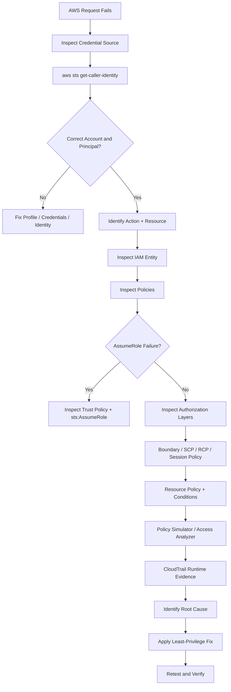
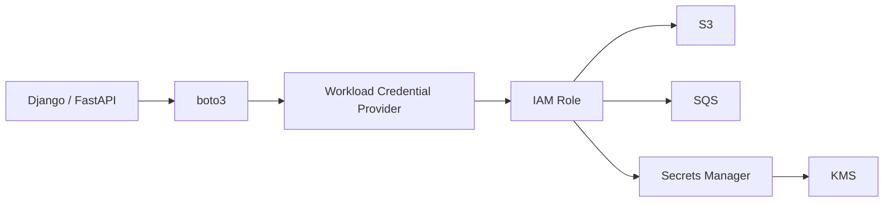

# README

## Overview

This directory contains the troubleshooting and diagnostic playbook for AWS IAM.

The documents are organized around a practical production workflow:

```text
Authentication
    ↓
Credential / Profile Resolution
    ↓
Caller Identity
    ↓
Authorization Request
    ↓
Policy Evaluation
    ↓
Trust / Cross-Account Controls
    ↓
Resource / Service Policies
    ↓
Runtime Evidence
```

The goal is to troubleshoot IAM failures systematically instead of responding to `AccessDenied`, authentication failures, or `AssumeRole` errors by blindly adding permissions.

---

## Navigation

| # | File | Description |
|---|---|---|
| 01 | [01- IAM Troubleshooting Methodology](./01-%20IAM%20Troubleshooting%20Methodology.md) | End-to-end IAM troubleshooting methodology and decision process |
| 02 | [02- AccessDenied and Policy Evaluation Issues](./02-%20AccessDenied%20and%20Policy%20Evaluation%20Issues.md) | AccessDenied, explicit/implicit denies, policy evaluation, boundaries, SCPs, resource policies, and conditions |
| 03 | [03- AssumeRole and Trust Policy Errors](./03-%20AssumeRole%20and%20Trust%20Policy%20Errors.md) | AssumeRole, trust policies, source permissions, cross-account role assumption, MFA, ExternalId, and role chaining |
| 04 | [04- Authentication, Token and Signature Errors](./04-%20Authentication%2C%20Token%20and%20Signature%20Errors.md) | Credential failures, expired tokens, invalid credentials, SigV4, clock skew, MFA, and runtime credential providers |
| 05 | [05- IAM Entity and Resource Errors](./05-%20IAM%20Entity%20and%20Resource%20Errors.md) | NoSuchEntity, EntityAlreadyExists, DeleteConflict, malformed policies, entity lifecycle failures, and IAM resource errors |
| 06 | [06- CLI Configuration and Profile Issues](./06-%20CLI%20Configuration%20and%20Profile%20Issues.md) | AWS CLI profiles, credential sources, SSO, AWS_PROFILE, role profiles, configuration precedence, and local/CI issues |
| 07 | [07- Diagnostic Tools and Debugging Commands](./07-%20Diagnostic%20Tools%20and%20Debugging%20Commands.md) | CLI diagnostics, policy simulation, Access Analyzer, CloudTrail, authorization decoding, and production debugging commands |

---

## Recommended Reading Order

Use the documents in this order when learning IAM troubleshooting:

```text
01
 ↓
02
 ↓
03
 ↓
04
 ↓
05
 ↓
06
 ↓
07
```

For production incidents, start with the failure category rather than reading sequentially.

| Failure | Start Here |
|---|---|
| `AccessDenied` | [02- AccessDenied and Policy Evaluation Issues.md](./02-%20AccessDenied%20and%20Policy%20Evaluation%20Issues.md) |
| `AccessDenied` during `AssumeRole` | [03- AssumeRole and Trust Policy Errors.md](./03-%20AssumeRole%20and%20Trust%20Policy%20Errors.md) |
| `ExpiredToken` / `InvalidClientTokenId` | [04- Authentication, Token and Signature Errors.md](./04-%20Authentication%2C%20Token%20and%20Signature%20Errors.md) |
| `NoSuchEntity` / `EntityAlreadyExists` | [05- IAM Entity and Resource Errors.md](./05-%20IAM%20Entity%20and%20Resource%20Errors.md) |
| Wrong AWS account / profile | [06- CLI Configuration and Profile Issues.md](./06-%20CLI%20Configuration%20and%20Profile%20Issues.md) |
| Need deeper runtime evidence | [07- Diagnostic Tools and Debugging Commands.md](./07-%20Diagnostic%20Tools%20and%20Debugging%20Commands.md) |
| Unsure where to start | [01- IAM Troubleshooting Methodology.md](./01-%20IAM%20Troubleshooting%20Methodology.md) |

---

## Core Troubleshooting Workflow

The preferred diagnostic sequence is:



The important ordering is:

```text
Identity first
Authorization second
Policy changes last
```

---

## First Commands to Run

For most IAM-related incidents, begin with:

```bash
aws configure list
```

Then:

```bash
aws sts get-caller-identity
```

For a named profile:

```bash
aws configure list \
    --profile production

aws sts get-caller-identity \
    --profile production
```

These commands establish:

```text
Credential/configuration source
Account
Caller ARN
Caller type
```

AWS documents `get-caller-identity` as the standard CLI operation for determining the IAM user or role associated with the active credentials. ([AWS CLI `get-caller-identity`](https://docs.aws.amazon.com/cli/latest/reference/sts/get-caller-identity.html))

---

## Diagnostic Tool Map

| Tool | Primary question |
|---|---|
| `aws configure list` | Where did the CLI configuration and credentials come from? |
| `aws configure list-profiles` | Which local profiles exist? |
| `aws sts get-caller-identity` | Which AWS principal is actually calling the API? |
| `aws iam get-role` | Who can assume this role and what role metadata exists? |
| `aws iam list-attached-role-policies` | Which managed policies are attached? |
| `aws iam list-role-policies` | Which inline policies exist? |
| `aws iam get-policy-version` | What does the active managed policy version contain? |
| `aws iam simulate-principal-policy` | Would the principal be allowed to perform the requested action under the supplied context? |
| `aws iam simulate-custom-policy` | Would a draft policy allow or deny the requested action? |
| `aws accessanalyzer validate-policy` | Is the policy syntactically valid and are there analyzer findings? |
| `aws cloudtrail lookup-events` | What happened during the actual runtime API request? |
| `aws sts decode-authorization-message` | What additional authorization details are present in an encoded failure? |
| IAM credential report | What is the credential state of IAM users? |
| IAM service last accessed | Which AWS services have been used by an IAM entity or policy? |

The IAM policy simulator is useful for narrowing authorization behavior, but AWS notes that simulation results can differ from the live environment, so runtime verification remains necessary. ([IAM policy simulator](https://docs.aws.amazon.com/IAM/latest/UserGuide/access_policies_testing-policies.html))

---

## Troubleshooting by Failure Layer

IAM troubleshooting becomes much faster when the failure is classified before changing anything.

| Layer | Typical symptom |
|---|---|
| Credential discovery | `Unable to locate credentials` |
| Authentication | `InvalidClientTokenId`, expired token |
| Profile resolution | Wrong account or unexpected identity |
| Role assumption | `AccessDenied` from `AssumeRole` |
| Policy evaluation | `AccessDenied`, `UnauthorizedOperation` |
| Condition evaluation | Access works only from certain contexts |
| Resource policy | Principal policy looks correct but service still denies |
| Organization control | SCP/RCP blocks an otherwise allowed request |
| Service-specific authorization | KMS/S3/SQS/SNS/etc. adds another policy layer |
| Runtime/configuration | Works locally but fails in Docker, ECS, EKS, Lambda, or CI |

---

## IAM Troubleshooting Principles

### Verify Identity Before Permissions

Never begin with:

```text
"Which permission should I add?"
```

Begin with:

```text
"Which principal is actually making the request?"
```

Use:

```bash
aws sts get-caller-identity
```

An unexpected role, account, or session can make an apparently correct policy investigation completely irrelevant.

### Separate Trust From Permissions

For an IAM role:

```text
Trust policy
    → Who can assume the role?

Permission policy
    → What can the role do?
```

A valid trust relationship does not automatically grant application permissions, and a correct permission policy does not make an untrusted principal able to assume the role.

### Treat Explicit Deny as a Different Problem

An additional `Allow` does not override an applicable explicit `Deny`.

Always consider:

```text
Identity policy
Resource policy
Permissions boundary
SCP
RCP
Session policy
Condition
Service-specific controls
```

### Use Runtime Evidence

Policy inspection tells you what configuration exists.

CloudTrail helps determine what actually happened during a real request.

Use both:

```text
Configuration evidence
+
Runtime evidence
```

---

## Backend Engineering Context

IAM troubleshooting becomes particularly important in distributed backend systems where a single request can cross multiple AWS services.

Example:



The application may report only:

```text
AccessDeniedException
```

while the actual root cause is:

```text
Wrong workload identity
Missing role permission
Resource policy
KMS key policy
SCP
Condition mismatch
Expired credentials
```

The troubleshooting documents in this directory are designed to help trace the entire authorization path.

---

## Workload-Specific Identity Checks

### EC2

```text
Application
    ↓
EC2 instance profile
    ↓
IAM role
    ↓
Temporary credentials
```

Verify from the instance:

```bash
aws sts get-caller-identity
```

### ECS

Distinguish:

```text
Task execution role
```

from:

```text
Task role
```

The application's AWS calls normally use the task role.

### Lambda

Inspect the execution role:

```bash
aws lambda get-function-configuration \
    --function-name <FUNCTION_NAME> \
    --query 'Role' \
    --output text
```

### EKS

Do not assume the node role is the application's effective identity.

Investigate the configured workload identity mechanism and verify the caller from the workload when possible.

### CI/CD

Prefer:

```text
OIDC
    ↓
Temporary AWS role
```

over long-lived IAM user access keys.

---

## Production Incident Checklist

Capture the following before modifying IAM:

```text
Timestamp
AWS account ID
Region
AWS service
API operation
Resource ARN
Caller ARN
Profile / credential source
Error code
Error message
Request ID
CloudTrail event
Role ARN
Relevant policy ARNs
Permissions boundary
SCP / RCP
Resource policy
Condition context
```

Then answer:

```text
Who called?
What action was requested?
Against which resource?
In which account?
In which Region?
What policies apply?
Was there an explicit deny?
What runtime evidence exists?
```

---

## Common Anti-Patterns

Avoid these troubleshooting behaviors:

| Anti-pattern | Better practice |
|---|---|
| Add `AdministratorAccess` to "see if it works" | Identify the exact denied action |
| Edit the role before checking caller identity | Verify `get-caller-identity` first |
| Inspect only identity policies | Inspect all relevant policy layers |
| Ignore the trust policy | Separate role assumption from role permissions |
| Assume the CLI profile is correct | Run `aws configure list` |
| Trust policy simulation blindly | Verify against the live environment |
| Debug only application code | Inspect AWS identity and authorization first |
| Copy long-lived credentials into containers | Use workload identity |
| Ignore CloudTrail | Correlate the actual API request |
| Remove permissions based only on last-accessed data | Treat access reports as evidence, not proof |

---

## Learning Path

To build senior-level IAM troubleshooting skills, focus on these capabilities in order:

```text
IAM identity model
        ↓
Policy structure
        ↓
Policy evaluation
        ↓
Roles and trust policies
        ↓
STS and temporary credentials
        ↓
Cross-account authorization
        ↓
Workload identity
        ↓
Advanced policy controls
        ↓
CLI diagnostics
        ↓
Runtime investigation
        ↓
Production incident analysis
```

The most valuable senior-level skill is being able to explain an authorization decision step by step:

```text
Caller
  ↓
Credential source
  ↓
Principal
  ↓
Action
  ↓
Resource
  ↓
Request context
  ↓
Policy layers
  ↓
Allow / Deny
```

---

## Related IAM Sections

This troubleshooting directory works together with the broader IAM documentation:

```text
01- Concepts/10- IAM/
    ↓
03- CLI/03- IAM CLI/
    ↓
05- Security/09- IAM/
    ↓
07- Troubleshooting/09- IAM/
```

Use the Concepts section to understand IAM behavior, the CLI section to perform operations, the Security section to design secure controls, and this Troubleshooting section to diagnose failures in production.

---

## AWS Documentation

- [AWS Identity and Access Management](https://docs.aws.amazon.com/iam/)
- [AWS CLI Command Reference](https://docs.aws.amazon.com/cli/latest/reference/)
- [AWS CLI Authentication and Credential Configuration](https://docs.aws.amazon.com/cli/latest/userguide/cli-chap-authentication.html)
- [AWS CLI `get-caller-identity`](https://docs.aws.amazon.com/cli/latest/reference/sts/get-caller-identity.html)
- [IAM Policy Simulator](https://docs.aws.amazon.com/IAM/latest/UserGuide/access_policies_testing-policies.html)
- [AWS CLI `simulate-principal-policy`](https://docs.aws.amazon.com/cli/latest/reference/iam/simulate-principal-policy.html)
- [IAM Access Analyzer](https://docs.aws.amazon.com/IAM/latest/UserGuide/what-is-access-analyzer.html)
- [AWS CloudTrail Troubleshooting](https://docs.aws.amazon.com/awscloudtrail/latest/userguide/security_iam_troubleshoot.html)

## Key Takeaways

- **Start with the caller:** `aws configure list` and `aws sts get-caller-identity` should be the default first diagnostic step.
- **Troubleshoot by authorization layer:** distinguish credentials, trust policies, identity policies, resource policies, boundaries, SCP/RCPs, session policies, and conditions.
- **Use the right tool for the question:** CLI inspection explains configuration, policy simulation tests authorization logic, Access Analyzer validates policies, and CloudTrail provides runtime evidence.
- **Verify workload identity explicitly:** EC2, ECS, Lambda, EKS, and CI/CD workloads can use different credential providers and roles.
- **Fix the root cause, not the symptom:** avoid broad permission grants and use least-privilege changes supported by evidence from the actual authorization path.