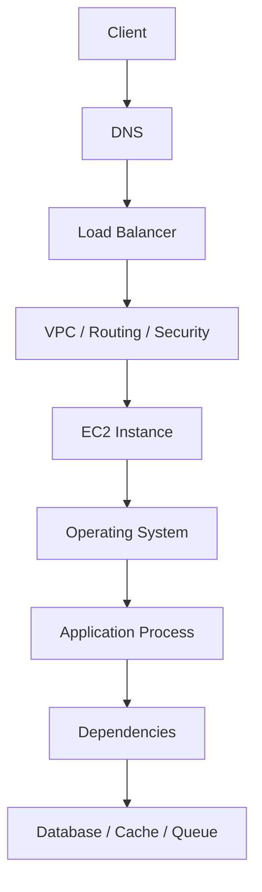
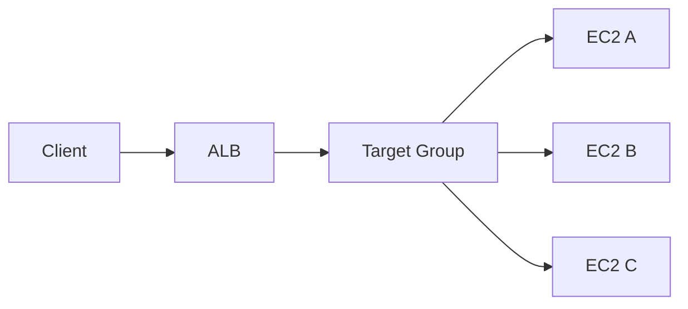
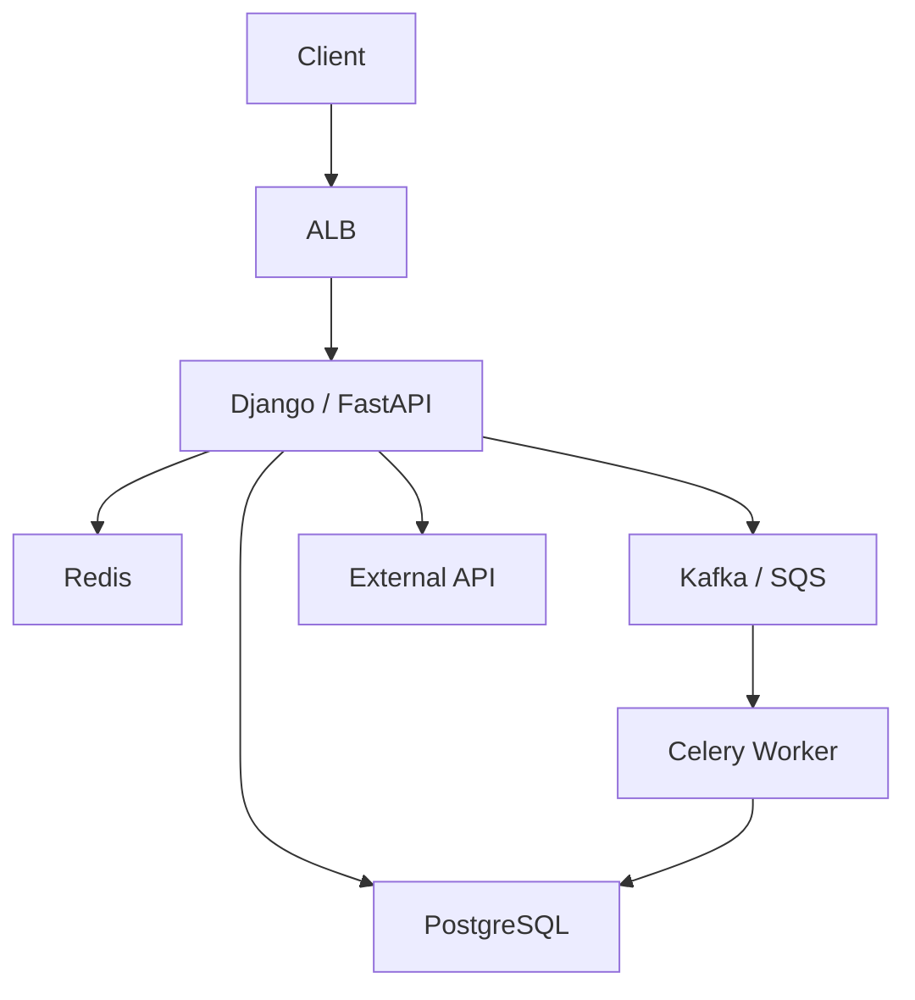
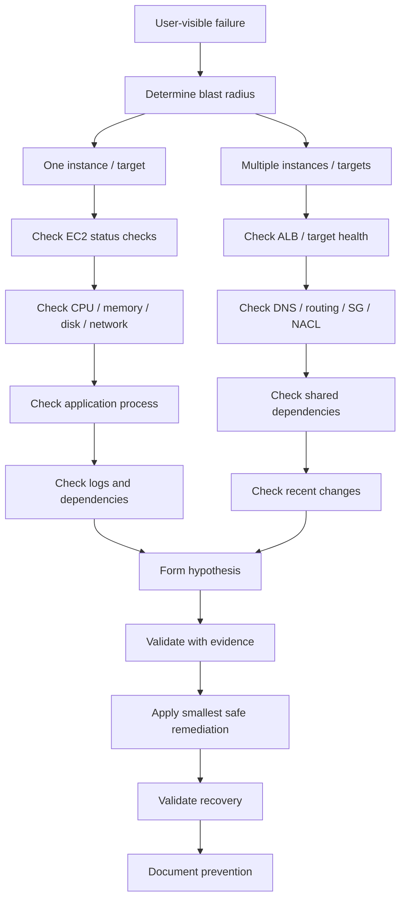
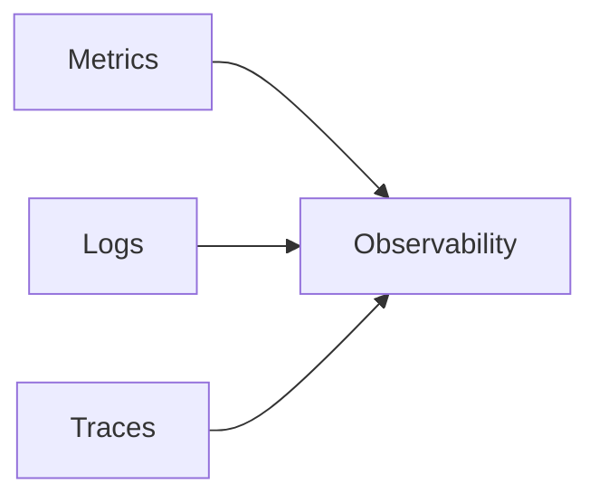

# 01- Troubleshooting Methodology

## Overview

EC2 troubleshooting should be approached as a structured investigation rather than a sequence of random configuration changes.

A production incident usually involves multiple layers:

```text
Client
  |
  v
DNS
  |
  v
Load Balancer
  |
  v
Security Groups / NACLs
  |
  v
Network / Routing
  |
  v
EC2
  |
  +--> OS
  +--> Process
  +--> CPU / Memory
  +--> Disk / EBS
  +--> Application
  |
  +--> PostgreSQL
  +--> Redis
  +--> Kafka / Queue
```

The objective is not merely to make the symptom disappear. A good troubleshooting process should establish:

- What is actually failing?
- When did it start?
- Which component owns the failure?
- What changed?
- What evidence confirms the hypothesis?
- What is the smallest safe remediation?
- How can recurrence be prevented?

The fundamental workflow is:

```text
Observe
   |
   v
Scope
   |
   v
Hypothesize
   |
   v
Measure
   |
   v
Isolate
   |
   v
Remediate
   |
   v
Validate
   |
   v
Prevent
```

---

## Troubleshooting Principles

### Start With Symptoms, Not Assumptions

A statement such as:

```text
"The API is down."
```

is not a diagnosis.

Translate it into measurable symptoms:

```text
HTTP 5xx increased from 0.2% to 18%
API latency increased from 150 ms to 8 seconds
Target health checks are failing
EC2 CPU is 95%
PostgreSQL connections are exhausted
```

Each observation narrows the search space.

---

### Change One Variable at a Time

Avoid making several unrelated changes simultaneously.

Bad:

```text
Restart EC2
Change Security Group
Restart Nginx
Increase instance size
Change application configuration
```

If the system recovers, you no longer know which change fixed it.

Prefer:

```text
Hypothesis
    |
    v
One controlled change
    |
    v
Observe result
    |
    v
Confirm / reject hypothesis
```

This is especially important in production because unnecessary changes can introduce additional failures.

---

### Prefer Evidence Over Intuition

Senior troubleshooting is not about knowing every possible failure from memory.

It is about reducing uncertainty quickly.

Prefer:

```text
CloudWatch metric
AWS CLI output
Application log
System log
Network test
Process inspection
Database metric
```

over:

```text
"I think the server is overloaded."
```

A useful mental model is:

```text
Hypothesis + Evidence = Diagnosis
```

---

## Establish the Blast Radius

Before investigating a specific instance, determine how broadly the problem affects the system.

Ask:

- Is one instance affected?
- One Availability Zone?
- One service?
- One endpoint?
- All users?
- A specific customer segment?
- All traffic?
- Only write operations?
- Only asynchronous workloads?

Example:

```text
10 EC2 instances
 |
 +-- 9 healthy
 |
 +-- 1 unhealthy
```

This suggests a different investigation from:

```text
10 EC2 instances
 |
 +-- 10 unhealthy
```

The first may indicate an instance-specific problem.

The second may indicate a shared dependency or infrastructure problem.

---

## Incident Scope Matrix

| Scope | Possible Causes |
|---|---|
| One request | Application/data issue |
| One endpoint | Application/service-specific issue |
| One EC2 | Instance/OS/process/storage issue |
| Multiple EC2 in one AZ | AZ/network/capacity issue |
| All EC2 | Shared dependency/configuration issue |
| All services | VPC, DNS, IAM, regional or external dependency |
| Only external clients | DNS, TLS, routing, WAF, load balancer |
| Only internal clients | Security Group, routing, service discovery |

The scope is one of the fastest ways to reduce the search space.

---

## Establish the Timeline

Determine:

```text
When did the problem begin?
When was it first detected?
What changed immediately before it?
Was there a deployment?
Was there an infrastructure change?
Was there a traffic spike?
Was there a scheduled event?
Was a certificate rotated?
Was a database migration executed?
```

A simple timeline is often more useful than hundreds of log lines.

Example:

```text
10:00  Normal traffic
10:12  Deployment started
10:15  Error rate increased
10:17  EC2 CPU increased
10:20  Alert triggered
10:24  Rollback started
10:27  Error rate returned to normal
```

The deployment becomes a strong investigation candidate because its timing correlates with the incident.

Correlation is evidence, not proof. Validate it against logs and metrics.

---

## Separate Symptoms From Causes

Consider:

```text
API requests are timing out.
```

Possible underlying causes include:

```text
ALB
 |
 +-- Target health failure
 |
 +-- Connection exhaustion
 |
 +-- EC2 CPU saturation
 |
 +-- Memory pressure
 |
 +-- Disk I/O saturation
 |
 +-- Application deadlock
 |
 +-- PostgreSQL latency
 |
 +-- Redis unavailable
 |
 +-- DNS failure
```

The timeout is the symptom.

The goal is to identify the underlying failure mechanism.

---

## EC2 Troubleshooting Layers

A useful troubleshooting stack is:



Investigate from the outside inward when the failure is request-oriented.

For instance-specific failures, start at the instance and move outward when appropriate.

---

## Layered Troubleshooting Model

| Layer | Primary Questions |
|---|---|
| Client | What exactly is failing? |
| DNS | Does the hostname resolve correctly? |
| Load Balancer | Are targets healthy? |
| Network | Can components communicate? |
| Security | Are SG/NACL rules permitting traffic? |
| EC2 | Is the instance healthy? |
| OS | Are CPU, memory, disk, and processes healthy? |
| Application | Is the service running and responding? |
| Dependency | Is PostgreSQL/Redis/Kafka/etc. healthy? |
| Data | Is the underlying data or query causing the problem? |

Do not skip layers merely because the application appears to be the obvious suspect.

---

## Define the Expected State

Troubleshooting requires knowing what "healthy" means.

For a FastAPI service:

```text
Expected:
HTTP 200
Latency < 300 ms
CPU < 70%
Memory stable
No worker crashes
Target health = healthy
```

For a Celery worker:

```text
Expected:
Worker connected
Queue depth stable
Task execution latency normal
No repeated task failures
CPU/memory within capacity
```

For an EC2 instance:

```text
Expected:
Instance status = running
System status = passed
Instance status = passed
CPU within expected range
Disk capacity available
Application process healthy
```

Without a baseline, anomalies are difficult to identify.

---

## First Response Checklist

When an EC2-backed service reports an outage:

1. Confirm the incident is real.
2. Identify affected services and users.
3. Establish when it started.
4. Check recent deployments and infrastructure changes.
5. Determine the blast radius.
6. Check load balancer target health.
7. Check EC2 status checks.
8. Check CloudWatch metrics.
9. Check application and system logs.
10. Check critical dependencies.
11. Form a hypothesis.
12. Validate it with evidence.
13. Apply the smallest safe remediation.
14. Verify recovery.
15. Preserve evidence for root-cause analysis.

---

## Confirm the Instance Exists and Is Reachable

Start with basic EC2 state.

```bash
aws ec2 describe-instances \
  --instance-ids i-0123456789abcdef0 \
  --query 'Reservations[].Instances[].{ID:InstanceId,State:State.Name,AZ:Placement.AvailabilityZone,PrivateIP:PrivateIpAddress,PublicIP:PublicIpAddress}' \
  --output table
```

Confirm:

- Instance ID
- State
- Availability Zone
- Private IP
- Public IP if applicable
- Instance type
- Security Groups
- Tags

A surprisingly large number of operational mistakes come from troubleshooting the wrong instance.

---

## Check EC2 Status Checks

EC2 exposes instance and system status checks.

A useful first check is:

```bash
aws ec2 describe-instance-status \
  --instance-ids i-0123456789abcdef0 \
  --include-all-instances \
  --query 'InstanceStatuses[].{Instance:InstanceId,State:InstanceState.Name,System:SystemStatus.Status,Instance:InstanceStatus.Status}' \
  --output table
```

Conceptually:

```text
System Status Check
    |
    +-- AWS infrastructure / underlying system

Instance Status Check
    |
    +-- Instance / operating-system related health
```

A failed status check can change the investigation direction significantly.

---

## Check Scheduled Events

AWS may report events affecting EC2 instances.

Inspect instance information:

```bash
aws ec2 describe-instance-status \
  --instance-ids i-0123456789abcdef0 \
  --include-all-instances
```

Look for:

- Scheduled maintenance
- Retirement-related events
- Reboot requirements
- Impaired infrastructure
- Other instance events

Do not assume application failure is caused by application code when AWS infrastructure has reported an event affecting the instance.

---

## Check CloudWatch Metrics

Start with the basic resource signals:

```text
CPU
Network
Disk
Status Checks
```

Depending on the instance and monitoring configuration, additional OS-level metrics may require the CloudWatch agent.

Useful questions:

```text
Did CPU suddenly increase?
Did network traffic change?
Did disk activity increase?
Did the metric change exactly when the incident began?
Is the metric abnormal compared with the normal baseline?
```

---

## CPU Saturation

High CPU can cause:

- Increased request latency
- Worker starvation
- Queue growth
- Health-check failures
- Database connection delays
- Timeouts

Inspect CloudWatch:

```bash
aws cloudwatch get-metric-statistics \
  --namespace AWS/EC2 \
  --metric-name CPUUtilization \
  --dimensions Name=InstanceId,Value=i-0123456789abcdef0 \
  --statistics Average Maximum \
  --period 300 \
  --start-time 2026-09-19T10:00:00Z \
  --end-time 2026-09-19T11:00:00Z
```

The exact time range should correspond to the incident window.

Do not immediately resize the instance.

First determine what is consuming CPU.

---

## Memory Pressure

EC2 does not provide standard guest-memory utilization through the basic EC2 metrics in the same way it provides CPU utilization.

Memory investigation commonly requires the CloudWatch agent or direct OS inspection.

On Linux:

```bash
free -h
```

Inspect processes:

```bash
ps aux --sort=-%mem | head
```

Check memory pressure:

```bash
vmstat 1 5
```

Look for:

- High memory usage
- Swap activity
- OOM kills
- Memory leaks
- Too many worker processes
- Large caches
- Excessive application concurrency

For Python services, process count and worker configuration can have a substantial impact on memory consumption.

---

## Python Backend Example

Suppose a FastAPI deployment uses multiple Uvicorn workers:

```text
EC2
 |
 +-- Worker 1 -> 500 MB
 +-- Worker 2 -> 500 MB
 +-- Worker 3 -> 500 MB
 +-- Worker 4 -> 500 MB
```

The application may appear healthy at low traffic but exhaust memory as concurrency and per-worker memory increase.

A troubleshooting hypothesis should therefore be:

```text
Memory growth
    |
    v
Number of workers?
    |
    v
Per-worker memory?
    |
    v
Traffic increase?
    |
    v
Memory leak?
```

Do not solve every memory problem by increasing instance size.

---

## Disk Space

A full filesystem can cause seemingly unrelated failures:

- Application writes fail
- Logs stop being written
- PostgreSQL operations fail
- Temporary files cannot be created
- Nginx fails to write logs
- Package installation fails

Check:

```bash
df -h
```

Find large directories:

```bash
sudo du -xhd1 / | sort -h
```

Check inode exhaustion:

```bash
df -i
```

A filesystem can have available bytes but still fail because all inodes are consumed.

---

## EBS Investigation

If disk performance is suspected, inspect:

```text
Volume Type
IOPS
Throughput
Queue Depth
Latency
Burst / Credit Behavior where applicable
EC2 EBS bandwidth limits
```

The investigation should distinguish:

```text
Disk Capacity Problem
        vs
Disk Performance Problem
```

Example:

```text
df -h
    |
    +--> 98% full
```

is different from:

```text
Disk space = 40%
IOPS saturated
Queue depth increasing
Latency increasing
```

The remediation is different.

---

## Network Troubleshooting

When an application cannot reach another service, determine whether the problem is:

```text
DNS
  |
  v
Routing
  |
  v
Security Group
  |
  v
NACL
  |
  v
Host Firewall
  |
  v
Service Listener
```

Do not start by changing Security Groups without evidence.

---

## DNS Resolution

From the EC2 instance:

```bash
getent hosts api.example.com
```

Or:

```bash
dig api.example.com
```

For a service hostname:

```bash
dig postgres.internal.example
```

Check:

- Does DNS resolve?
- Does it return the expected address?
- Is the response delayed?
- Does the problem affect only one resolver path?
- Did DNS change recently?

If DNS fails, testing TCP connectivity to the resolved IP is not the first step because the application may never obtain the correct destination.

---

## TCP Connectivity

Test whether the destination port is reachable:

```bash
nc -vz postgres.internal.example 5432
```

For HTTPS:

```bash
nc -vz api.example.com 443
```

This helps distinguish:

```text
DNS resolution failure
```

from:

```text
TCP connectivity failure
```

from:

```text
Application protocol failure
```

A successful TCP connection does not prove that the application protocol is healthy.

---

## HTTP-Level Testing

For HTTP services:

```bash
curl -v https://api.example.com/health
```

For a private service:

```bash
curl -v http://10.0.20.15:8000/health
```

The layers become:

```text
DNS
  |
  v
TCP
  |
  v
TLS
  |
  v
HTTP
  |
  v
Application
```

Test the lowest failing layer first.

---

## Security Group Investigation

Inspect Security Groups:

```bash
aws ec2 describe-security-groups \
  --group-ids sg-0123456789abcdef0
```

Ask:

- Was the rule changed recently?
- Is the correct source allowed?
- Is the correct destination port allowed?
- Is the instance using the expected Security Group?
- Is traffic coming through an ALB or directly?
- Is the return path valid?

For an ALB-backed API:

```text
Internet
   |
   | 443
   v
ALB SG
   |
   | 8000
   v
EC2 SG
```

The EC2 Security Group should generally trust the ALB Security Group rather than the public internet.

---

## Network ACL Investigation

If Security Groups appear correct, inspect the subnet's Network ACL.

Remember:

```text
Security Group
    = Stateful

Network ACL
    = Stateless
```

A restrictive NACL can block return traffic even when the Security Group is correct.

When investigating NACL-related issues, inspect both:

```text
Inbound
Outbound
```

and consider ephemeral response ports.

---

## Load Balancer Investigation

For an EC2-backed API, the load balancer is often the first infrastructure component to inspect.

Check:

- Listener configuration
- Listener rules
- Target Group
- Target health
- Health-check path
- Health-check port
- Health-check protocol
- Target registration
- Security Groups

Conceptually:



If all targets are unhealthy, investigate shared dependencies.

If only one target is unhealthy, investigate that instance first.

---

## Target Health

Inspect target health:

```bash
aws elbv2 describe-target-health \
  --target-group-arn "$TARGET_GROUP_ARN"
```

Common states include:

```text
healthy
unhealthy
initial
draining
unused
```

An unhealthy target does not necessarily mean the EC2 instance itself is unhealthy.

The health check may be failing because:

- Wrong port
- Wrong path
- Security Group
- Nginx configuration
- Application process
- Dependency failure
- Timeout
- Incorrect host-header behavior

---

## Health Endpoint Design

For Django or FastAPI applications, keep health endpoints intentionally designed.

Example:

```text
GET /health/live
GET /health/ready
```

A liveness check might answer:

```text
Is the process alive?
```

A readiness check might answer:

```text
Can this instance safely receive application traffic?
```

Avoid making health checks unnecessarily dependent on every external dependency.

For example, if a temporary analytics service is unavailable, the entire API fleet should not necessarily become unhealthy.

---

## Application Process Investigation

On the EC2 host:

```bash
ps aux | grep uvicorn
```

Or:

```bash
ps aux | grep gunicorn
```

Check systemd:

```bash
sudo systemctl status my-api
```

Inspect recent logs:

```bash
sudo journalctl -u my-api --since "30 minutes ago"
```

Look for:

- Process crashes
- Restart loops
- Configuration errors
- Import errors
- Database connection failures
- Memory errors
- Permission errors
- File descriptor exhaustion

---

## Nginx Investigation

For Nginx:

```bash
sudo nginx -t
```

Check status:

```bash
sudo systemctl status nginx
```

Inspect logs:

```bash
sudo tail -n 200 /var/log/nginx/error.log
```

Check listeners:

```bash
sudo ss -lntp
```

A common request path is:

```text
ALB
 |
 v
Nginx :80
 |
 v
Gunicorn / Uvicorn :8000
 |
 v
Django / FastAPI
```

Troubleshoot each hop independently.

---

## Database Investigation

An API can appear unhealthy because PostgreSQL is slow or unavailable.

Check:

```text
Application
    |
    v
Connection Pool
    |
    v
PostgreSQL
```

Useful signals include:

- Connection count
- Connection wait time
- Query latency
- Locks
- CPU
- Memory
- Disk I/O
- Storage capacity

For Django, connection exhaustion can present as:

```text
API latency increase
       |
       v
Database connections exhausted
       |
       v
Requests waiting
       |
       v
Timeouts
```

Do not increase EC2 capacity if the real bottleneck is the database.

---

## Redis Investigation

Redis failures can appear as:

- Cache misses
- Increased database load
- Session failures
- Celery failures
- Increased API latency

Test connectivity:

```bash
redis-cli -h redis.internal.example ping
```

Expected:

```text
PONG
```

Check application behavior:

```text
Redis unavailable
      |
      +--> Is Redis mandatory?
      |
      +--> Can application degrade gracefully?
      |
      +--> Is PostgreSQL now overloaded?
```

A cache failure can become a database capacity incident if the application suddenly sends every request to PostgreSQL.

---

## Celery and Queue Troubleshooting

For asynchronous workloads:

```text
API
 |
 v
Redis / Kafka / SQS
 |
 v
Celery Worker
```

Investigate:

- Queue depth
- Worker count
- Worker CPU
- Worker memory
- Task execution time
- Task failure rate
- Retry rate
- Dead-letter behavior where applicable

A common failure pattern is:

```text
Traffic increases
      |
      v
Queue grows
      |
      v
Workers saturate
      |
      v
Task latency increases
      |
      v
Retries increase
      |
      v
Queue grows faster
```

This is a feedback loop rather than a simple CPU problem.

---

## Application Logs

Logs should answer:

```text
What request?
What user/request ID?
What operation?
What dependency?
What error?
What duration?
What instance?
What timestamp?
```

A production request should ideally have a correlation identifier:

```text
Request ID
   |
   +--> ALB
   +--> Nginx
   +--> FastAPI / Django
   +--> PostgreSQL logs
   +--> Celery
```

This makes distributed troubleshooting significantly faster.

---

## Log Correlation

Suppose a request fails:

```text
request_id=abc123
```

Search the application logs:

```bash
grep 'abc123' /var/log/my-api/application.log
```

Then correlate:

```text
ALB access log
      |
      v
Nginx log
      |
      v
Application log
      |
      v
Database / Redis / Worker
```

Correlation is much more effective than searching timestamps alone.

---

## Distinguish Resource Saturation From Application Bugs

A slow API can have very different causes.

| Symptom | Possible Cause |
|---|---|
| High CPU | CPU-bound code, traffic spike, inefficient query processing |
| High memory | Leak, too many workers, large payloads |
| High disk latency | EBS saturation, database I/O |
| High network | Traffic spike, large payloads |
| Low CPU + high latency | I/O wait, dependency latency, locks |
| High DB connections | Connection pooling or query latency |
| High queue depth | Insufficient workers or slow tasks |

Metrics should be interpreted together rather than independently.

---

## CPU vs I/O Diagnosis

Consider:

```text
CPU = 30%
Latency = 8 seconds
```

It is incorrect to conclude that the instance has plenty of capacity.

The application may be waiting on:

- PostgreSQL
- Redis
- Network
- EBS
- External APIs
- Locks

A better question is:

```text
Where is the request spending its time?
```

For backend systems, latency is often a dependency problem rather than a CPU problem.

---

## Process-Level Investigation

Useful commands include:

```bash
top
```

```bash
htop
```

```bash
ps aux --sort=-%cpu | head
```

```bash
ps aux --sort=-%mem | head
```

Inspect open files:

```bash
sudo lsof -p <PID>
```

Inspect process limits:

```bash
cat /proc/<PID>/limits
```

Inspect file descriptor usage:

```bash
cat /proc/sys/fs/file-nr
```

These checks are useful for identifying:

- Runaway processes
- Memory-heavy workers
- File descriptor exhaustion
- Process leaks
- Unexpected processes

---

## File Descriptor Exhaustion

A service may fail even when CPU and memory appear normal.

Symptoms include:

```text
Too many open files
```

Check:

```bash
ulimit -n
```

For a process:

```bash
cat /proc/<PID>/limits | grep -i 'open files'
```

Investigate:

- Connection leaks
- File leaks
- Excessive sockets
- Application worker count
- OS limits

Do not blindly increase the limit without finding why descriptors are being consumed.

---

## Ephemeral Port Exhaustion

High outbound connection rates can exhaust available ephemeral ports.

Symptoms can include connection failures despite healthy CPU and memory.

Investigate:

```bash
ss -s
```

Inspect TCP connections:

```bash
ss -tan
```

For high-traffic Python applications, use connection pooling rather than creating a new connection for every request when the client/library supports pooling.

This applies to:

- PostgreSQL
- Redis
- HTTP clients
- Internal microservices

---

## Check Recent Changes

A strong troubleshooting process always asks:

```text
What changed?
```

Potential changes include:

- Application deployment
- AMI update
- Launch Template version
- Security Group
- NACL
- Route table
- DNS
- Certificate
- Environment variable
- Database migration
- Dependency version
- Scaling policy
- Instance type
- Kernel update
- OS patch

Useful evidence sources include:

- Git history
- CI/CD deployment history
- CloudTrail
- Infrastructure-as-Code changes
- AWS Console activity
- Application release logs

---

## Change Correlation

A useful incident timeline might look like:

```text
14:00  Deployment v42
14:03  CPU begins increasing
14:05  Latency increases
14:07  5xx increases
14:10  Alert fires
```

This does not prove v42 caused the incident.

Validate:

```text
v42 changed?
     |
     v
Affected instances running v42?
     |
     v
Error occurs only on v42?
     |
     v
Rollback removes error?
```

The evidence becomes progressively stronger.

---

## AWS CloudTrail

CloudTrail is useful when the question is:

```text
Who changed the infrastructure?
```

Examples:

- Security Group modification
- Instance termination
- Instance launch
- IAM change
- Load balancer change
- Route modification
- EBS operation

A useful investigation pattern is:

```text
Incident time
     |
     v
CloudTrail events
     |
     v
Infrastructure change
     |
     v
Responsible identity
     |
     v
Change correlation
```

CloudTrail is particularly useful for distinguishing infrastructure changes from application failures.

---

## Use AWS CLI for Repeatable Investigation

The CLI is valuable because troubleshooting commands can be:

- Repeated
- Scripted
- Audited
- Compared
- Included in runbooks

Example:

```bash
aws ec2 describe-instances \
  --filters Name=tag:Environment,Values=production \
  --query 'Reservations[].Instances[].{ID:InstanceId,State:State.Name,AZ:Placement.AvailabilityZone,Type:InstanceType,PrivateIP:PrivateIpAddress}' \
  --output table
```

The goal is not to memorize every AWS command.

The goal is to develop repeatable investigation workflows.

---

## Build a Dependency Map

For a backend service, document dependencies before an incident occurs.

Example:



When the API is slow, the dependency map tells you what to inspect.

Without it, troubleshooting becomes guesswork.

---

## Troubleshooting by Dependency

For every dependency ask:

```text
Is it reachable?
Is it healthy?
Is it responding within expected latency?
Are connections available?
Are errors increasing?
Did its behavior change?
```

For PostgreSQL:

```text
Reachable
   |
Connections
   |
Locks
   |
Query latency
   |
Storage
```

For Redis:

```text
Reachable
   |
Connection count
   |
Latency
   |
Memory
   |
Evictions
```

For Kafka:

```text
Reachable
   |
Broker health
   |
Partition health
   |
Consumer lag
   |
Producer errors
```

---

## Failure Domain Isolation

Try to determine the smallest failing domain.

```text
Region
  |
  +-- AZ
       |
       +-- Subnet
            |
            +-- Instance
                 |
                 +-- Process
                      |
                      +-- Request
```

For example:

```text
Only one instance fails
```

is more likely to be instance-specific than:

```text
Every instance in every AZ fails
```

The latter points toward a shared dependency or configuration.

---

## One Instance vs Entire Fleet

### One Instance

Investigate:

- Status checks
- CPU
- Memory
- Disk
- Network
- Processes
- Application logs
- Instance-specific configuration

### Entire Fleet

Investigate:

- ALB
- Security Groups
- DNS
- Shared configuration
- Database
- Redis
- Kafka
- IAM
- Recent deployments
- Shared infrastructure

This distinction can prevent hours of unnecessary instance-level debugging.

---

## AZ-Level Failures

If failures correlate with one Availability Zone:

```text
AZ-A
 +-- EC2 healthy

AZ-B
 +-- EC2 unhealthy
 +-- EC2 unhealthy
 +-- EC2 unhealthy

AZ-C
 +-- EC2 healthy
```

Investigate:

- AZ-specific infrastructure events
- Subnet configuration
- Route tables
- NAT Gateway
- Load balancer behavior
- Capacity
- Network dependencies

Multi-AZ architecture helps maintain service availability, but it also gives you a valuable failure-domain signal during incidents.

---

## Instance Replacement as a Remediation

For immutable infrastructure, replacing an unhealthy instance may be safer than manually repairing it.

Example:

```text
Unhealthy Instance
       |
       v
ASG detects failure
       |
       v
Terminate / replace
       |
       v
New EC2
       |
       v
Health Check
       |
       v
Traffic restored
```

However, replacement should not be used to hide recurring defects.

If the ASG repeatedly replaces instances:

```text
Instance A -> failed
Instance B -> failed
Instance C -> failed
```

investigate the underlying cause.

Possible causes:

- Bad AMI
- Broken user data
- Application memory leak
- Invalid configuration
- Dependency failure
- Incorrect health check

---

## Safe Remediation

Choose the least disruptive action that addresses the confirmed failure.

Possible actions:

```text
No action
   |
Configuration correction
   |
Traffic removal
   |
Process restart
   |
Instance replacement
   |
Rollback
   |
Scaling
```

Do not restart an entire fleet when one instance is unhealthy.

Do not scale indefinitely when the dependency causing the bottleneck cannot scale with it.

---

## Traffic Draining

Before performing disruptive maintenance on an instance behind an ALB:

```text
Remove from service
       |
       v
Connection draining
       |
       v
Active requests finish
       |
       v
Maintenance
       |
       v
Return to service
```

This reduces user-visible disruption.

For Auto Scaling environments, use controlled lifecycle and deployment mechanisms rather than manually terminating active instances without considering traffic behavior.

---

## Rollback vs Fix Forward

Use rollback when:

- A recent deployment clearly correlates with the incident.
- The previous version is known to work.
- Rollback is low risk.

Use fix-forward when:

- The issue is understood.
- Rollback is unsafe.
- Data migrations make rollback difficult.
- The correction is small and well understood.

Do not make the decision based solely on urgency.

Consider:

```text
Blast radius
+
Confidence in root cause
+
Rollback safety
+
Data compatibility
+
Recovery time
```

---

## Production Incident Communication

Technical troubleshooting should be accompanied by concise operational communication.

A useful update format is:

```text
Impact:
API requests returning elevated 5xx responses.

Scope:
Approximately 30% of production traffic.

Started:
10:15 UTC.

Current hypothesis:
Database connection exhaustion following deployment.

Evidence:
Connection count reached configured maximum at 10:17 UTC.

Action:
Traffic is being reduced while database connections are investigated.

Next validation:
Confirm connection count and request latency after remediation.
```

Avoid unsupported statements such as:

```text
"The database definitely caused it."
```

unless the evidence actually establishes that conclusion.

---

## Preserve Evidence

Do not destroy useful evidence before understanding the incident.

Avoid immediately:

```text
Reboot
Delete instance
Delete logs
Terminate everything
Reset configuration
```

when the root cause is still unknown.

Capture:

- CloudWatch metrics
- Logs
- Instance status
- Target health
- Security Group state
- Recent changes
- Process state
- Disk state
- Network state
- Relevant AWS events

For volatile failures, collect evidence before restarting the process or instance when practical.

---

## Troubleshooting Decision Tree



---

## Troubleshooting Command Reference

| Problem | Useful Command |
|---|---|
| Instance state | `aws ec2 describe-instances` |
| Instance status checks | `aws ec2 describe-instance-status` |
| Target health | `aws elbv2 describe-target-health` |
| Security Groups | `aws ec2 describe-security-groups` |
| DNS | `dig`, `getent hosts` |
| TCP connectivity | `nc -vz` |
| HTTP | `curl -v` |
| Listening ports | `ss -lntp` |
| Processes | `ps`, `top`, `htop` |
| Memory | `free -h`, `vmstat` |
| Disk | `df -h`, `du` |
| Inodes | `df -i` |
| System logs | `journalctl` |
| Nginx logs | `/var/log/nginx/` |
| SSH logs | `journalctl -u sshd` |
| Open files | `lsof` |
| TCP connections | `ss -tan` |
| CloudWatch metrics | `aws cloudwatch get-metric-statistics` |
| AWS API activity | CloudTrail |

---

## Common Troubleshooting Mistakes

### Restarting Before Investigating

A restart can temporarily restore service while destroying useful evidence.

First collect enough evidence to establish the likely failure domain.

---

### Changing Multiple Things at Once

This makes causality difficult to establish.

Use controlled changes.

---

### Scaling Before Finding the Bottleneck

Increasing EC2 capacity does not fix:

- Database connection exhaustion
- DNS failure
- Security Group errors
- Application bugs
- External dependency failures

Scaling is a remediation only when insufficient capacity is actually part of the problem.

---

### Blaming CPU for Every Performance Problem

Low CPU does not mean the system is healthy.

The application may be blocked on:

- Database
- Network
- Redis
- Disk
- Locks
- External APIs

---

### Checking Only the Application Logs

Infrastructure failures may never reach the application.

Always consider:

```text
DNS
Network
ALB
Security
EC2
OS
Application
Dependencies
```

---

### Troubleshooting the Wrong Instance

In Auto Scaling environments, instances can be replaced quickly.

Always verify:

```text
Instance ID
Private IP
Availability Zone
Launch Template version
Application version
```

before making changes.

---

### Ignoring Recent Changes

A recent deployment or infrastructure change is valuable evidence.

It is not automatically the root cause, but it should be investigated.

---

### Making Emergency Changes Permanent

A manual fix may restore service but create configuration drift.

After recovery:

```text
Manual fix
   |
   v
Root cause
   |
   v
IaC / automation update
   |
   v
Repeatable configuration
```

---

### Treating Recovery as Root Cause Analysis

Service recovery and root-cause identification are separate tasks.

```text
Incident
   |
   +--> Restore service
   |
   +--> Investigate cause
   |
   +--> Prevent recurrence
```

A successful restart does not explain why the process crashed.

---

## Production Troubleshooting Best Practices

### Maintain Runbooks

Document common procedures for:

- Unhealthy ALB target
- High CPU
- High memory
- Full disk
- Failed status checks
- SSH failure
- Database connectivity
- Redis failure
- Celery queue growth
- Instance replacement

### Maintain Baselines

Know normal:

- CPU
- Memory
- Network
- Disk
- Latency
- Error rate
- Database connections
- Queue depth

### Centralize Logs

Avoid requiring engineers to SSH into every instance to find logs.

Use centralized logging where practical.

### Use Correlation IDs

Trace requests across:

```text
ALB
Nginx
Django / FastAPI
Database
Redis
Celery
External services
```

### Automate Diagnostics

Common health information should be accessible through:

- AWS CLI
- CloudWatch dashboards
- Runbooks
- Automation
- Monitoring systems

### Prefer Immutable Infrastructure

If instances are disposable:

```text
Bad Instance
    |
    v
Replace
    |
    v
Known-good AMI
```

This is often safer than repeatedly modifying a damaged server.

---

## Observability Requirements

Effective troubleshooting requires three complementary signals.



### Metrics

Tell you:

```text
What changed?
How much?
When?
```

### Logs

Tell you:

```text
What happened?
Why might it have happened?
```

### Traces

Tell you:

```text
Where did the request spend its time?
Which dependency was slow?
```

For distributed backend systems, all three become increasingly valuable as architecture complexity increases.

---

## Troubleshooting by Signal

| Signal | Primary Question |
|---|---|
| 5xx rate | Is the application or upstream dependency failing? |
| Latency | Where is time being spent? |
| CPU | Is computation saturated? |
| Memory | Is the process exhausting memory? |
| Disk latency | Is storage becoming a bottleneck? |
| Disk capacity | Is the filesystem full? |
| Network | Is traffic or connectivity abnormal? |
| Target health | Can the load balancer reach the application? |
| Queue depth | Are workers keeping up? |
| DB connections | Is the database connection pool exhausted? |
| Logs | What specific operation failed? |
| Traces | Which dependency consumed latency? |

---

## Root Cause Analysis

After recovery, perform a deeper investigation.

A useful structure is:

```text
Incident
  |
  +-- Impact
  |
  +-- Timeline
  |
  +-- Detection
  |
  +-- Technical root cause
  |
  +-- Contributing factors
  |
  +-- Recovery
  |
  +-- Preventive actions
```

Avoid stopping at:

```text
"EC2 became unhealthy."
```

Ask:

```text
Why?
```

Then:

```text
Why did that happen?
```

Continue until reaching a controllable engineering cause.

---

## Example Root Cause Chain

Suppose an API becomes unavailable.

```text
API unavailable
      |
      v
EC2 processes restarted
      |
      v
OOM killer terminated workers
      |
      v
Memory exceeded
      |
      v
Too many application workers
      |
      v
Worker count increased during deployment
      |
      v
Deployment configuration was incorrect
```

The final remediation should address the configuration problem, not simply increase instance memory.

---

## Post-Incident Improvements

After an incident, consider improvements to:

- Monitoring
- Alert thresholds
- Dashboards
- Health checks
- Logging
- Tracing
- Capacity planning
- Deployment validation
- Auto Scaling
- Infrastructure as Code
- Runbooks
- Access controls
- Backup and recovery

A mature engineering organization turns incidents into improvements to the system and its operational process.

---

## Security During Troubleshooting

Troubleshooting commands can expose sensitive information.

Avoid sharing:

- Private keys
- Database passwords
- Access tokens
- Session cookies
- Secret environment variables
- Full request bodies containing sensitive data
- Personally identifiable information

Be careful with:

```bash
env
```

because it can expose application secrets.

Similarly, commands such as:

```bash
cat .env
```

should not be used casually in shared troubleshooting sessions.

Use targeted inspection instead:

```bash
printenv APP_ENV
```

when only one non-sensitive value is required.

---

## Cost Considerations

Troubleshooting can itself generate cost.

Be careful with:

- Temporary oversized instances
- Excessive CloudWatch retention
- High-volume debug logging
- Repeated instance replacement
- Large temporary EBS volumes
- Unnecessary NAT traffic
- Long-running diagnostic resources

A temporary diagnostic change should have an explicit cleanup path.

---

## Disaster Recovery Troubleshooting

When an outage cannot be resolved quickly in the primary environment, the troubleshooting strategy may change from:

```text
Repair
```

to:

```text
Recover
```

For example:

```text
Primary Region
      |
      | Failure
      v
DR Environment
      |
      v
Restore Infrastructure
      |
      v
Validate Dependencies
      |
      v
Route Traffic
```

Recovery procedures should be tested before an incident.

A DR environment that exists only on paper is not a reliable recovery strategy.

---

## Senior-Level Troubleshooting Mindset

Senior troubleshooting is primarily about reducing uncertainty.

Instead of asking:

```text
"What should I restart?"
```

ask:

```text
"What evidence can distinguish the likely failure modes?"
```

Instead of:

```text
"CPU is high, so increase the instance size."
```

ask:

```text
"What is consuming CPU, and why did consumption change?"
```

Instead of:

```text
"The application is down."
```

ask:

```text
"Which layer is failing, for which traffic, since when, and what changed?"
```

The quality of the questions determines the quality of the investigation.

---

## Interview Considerations

### How would you troubleshoot an EC2-hosted API returning 5xx errors?

A structured approach is:

```text
Confirm scope
   |
   v
Check ALB target health
   |
   v
Check EC2 status
   |
   v
Check CPU / memory / disk / network
   |
   v
Check application process
   |
   v
Check application logs
   |
   v
Check PostgreSQL / Redis / queues
   |
   v
Check recent deployments and infrastructure changes
   |
   v
Form and validate hypothesis
```

### How would you troubleshoot an SSH timeout?

Check:

```text
Instance state
   |
Security Group
   |
NACL
   |
Route
   |
Network path
   |
Host firewall
   |
sshd
```

A timeout generally indicates a connectivity/path problem before authentication.

### What if SSH connects but the application is unavailable?

SSH only proves administrative connectivity.

Continue with:

```text
Process
   |
Port
   |
Nginx
   |
Application
   |
Dependencies
```

### Why should you not immediately restart an unhealthy EC2 instance?

A restart may restore service temporarily but can destroy volatile evidence needed to identify the root cause.

### How do you distinguish an application problem from an infrastructure problem?

Use layered evidence:

```text
ALB
 |
EC2 status
 |
OS metrics
 |
Process state
 |
Application logs
 |
Dependency health
```

The first layer showing abnormal behavior helps narrow the failure domain.

### Why is blast-radius analysis important?

It distinguishes local failures from shared failures.

```text
1 instance
    -> instance-specific investigation

Entire fleet
    -> shared infrastructure/dependency investigation
```

### What is the difference between remediation and root-cause analysis?

Remediation restores service.

Root-cause analysis explains why the incident occurred and identifies changes that prevent recurrence.

### Why are metrics, logs, and traces complementary?

Metrics identify abnormal behavior, logs provide detailed events and context, and traces show request execution across distributed components.

## Key Takeaways

- **Troubleshoot systematically: establish scope and timeline, identify the failure layer, form a hypothesis, validate it with evidence, then apply the smallest safe remediation.**
- **Use layered investigation across DNS, load balancing, networking, EC2, OS, application processes, and dependencies instead of assuming the application is the failing component.**
- **Interpret metrics together: high CPU, memory, disk, network, database connections, and queue depth are signals that require correlation with logs, traces, and application behavior.**
- **Preserve evidence before disruptive actions, and separate service recovery from root-cause analysis so temporary fixes do not hide recurring defects.**
- **Turn incidents into operational improvements through better observability, automation, runbooks, capacity planning, deployment controls, and reproducible infrastructure.**