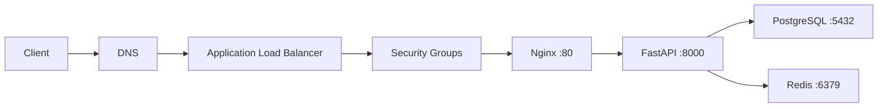
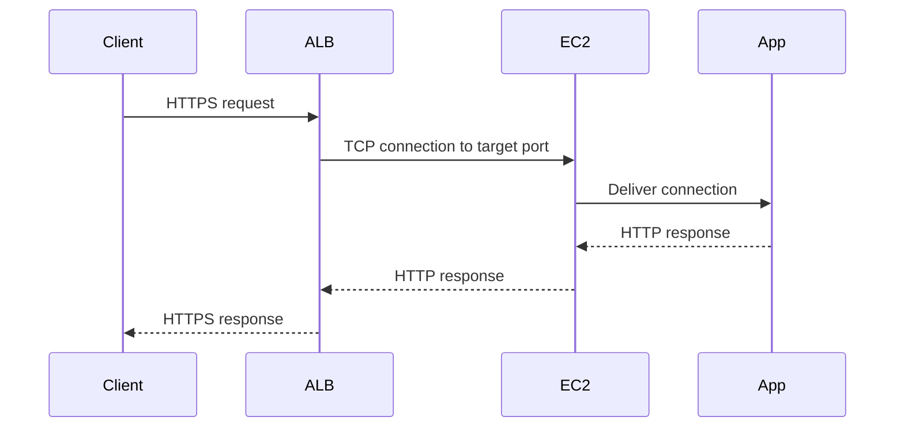
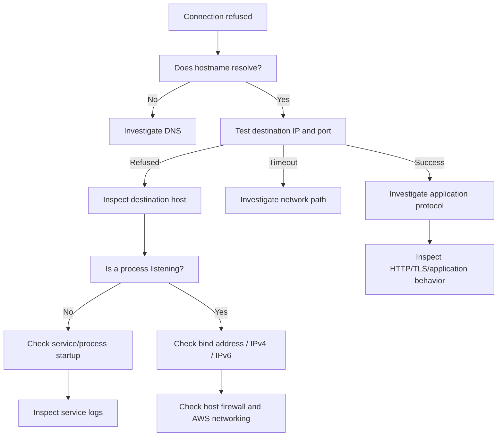
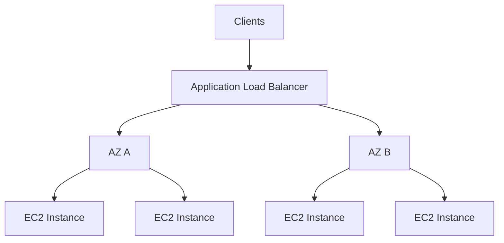

# 02- Connection Refused

## Overview

`Connection refused` is a TCP-level failure indicating that the destination host was reachable enough to respond, but no process accepted the connection on the requested IP address and port, or an active network component explicitly rejected it.

A typical error looks like:

```text
ConnectionRefusedError: [Errno 111] Connection refused
```

or:

```text
curl: (7) Failed to connect to api.example.com port 8000: Connection refused
```

The important distinction is that `connection refused` is not the same as:

```text
Connection timed out
```

or:

```text
DNS resolution failed
```

or:

```text
Connection reset by peer
```

These errors occur at different stages of the connection lifecycle and therefore require different troubleshooting strategies.

For an EC2-hosted backend, the investigation should usually follow:

```text
Client
  |
  v
DNS
  |
  v
Destination IP
  |
  v
Network path
  |
  v
Security controls
  |
  v
TCP connection
  |
  v
Listening socket
  |
  v
Application process
  |
  v
Application protocol
```

The central question is:

> **Why is nothing accepting the TCP connection on this IP address and port?**

---

## What "Connection Refused" Means

A TCP connection begins with a three-way handshake:

```text
Client                         Server

  SYN ------------------------>

      <------------------------ SYN + ACK

  ACK ------------------------>
```

If the destination host actively refuses the connection, the client commonly receives:

```text
RST
```

Conceptually:

```text
Client                         Server

  SYN ------------------------>

      <------------------------ RST
```

The client then reports:

```text
Connection refused
```

This usually means the request reached the destination network stack, but the requested TCP endpoint was not accepting connections.

---

## Connection Refused vs Other Failures

| Error | Typical Meaning | Primary Investigation |
|---|---|---|
| DNS failure | Hostname cannot be resolved | DNS |
| Connection refused | Destination reachable, port not accepting | Listener/process |
| Connection timeout | No response within timeout | Routing, SG/NACL, firewall, network path |
| Connection reset | Existing connection was forcibly closed | Server, proxy, application, network |
| TLS handshake failure | TCP succeeded but TLS negotiation failed | Certificate/TLS configuration |
| HTTP 4xx/5xx | TCP and HTTP connection succeeded | Application/proxy |
| Authentication failure | Application protocol reached server | Credentials/authentication |

This distinction prevents troubleshooting the wrong layer.

---

## Typical EC2 Architecture

Consider a FastAPI service:



If a client receives:

```text
Connection refused
```

the failing endpoint could be:

```text
ALB :443
EC2 :80
FastAPI :8000
PostgreSQL :5432
Redis :6379
```

The troubleshooting process must identify the exact connection that is being refused.

---

## First Question: Which Host and Port?

Do not troubleshoot `connection refused` without identifying the destination.

Capture:

```text
Source
Destination hostname
Resolved IP
Destination port
Protocol
Timestamp
Application component
```

For example:

```text
Source: FastAPI EC2 instance
Destination: postgres.internal.example
Port: 5432
Protocol: TCP
```

This is much more actionable than:

```text
Database connection refused
```

---

## Identify the Connection Layer

A useful decomposition is:

```text
Application
    |
    v
Hostname
    |
    v
DNS
    |
    v
IP address
    |
    v
Route
    |
    v
Security controls
    |
    v
TCP port
    |
    v
Listening process
    |
    v
Application protocol
```

Find the first layer that fails.

---

## Confirm DNS Resolution

Start with the hostname.

```bash
getent hosts api.internal.example.com
```

Or:

```bash
dig api.internal.example.com
```

Example:

```text
api.internal.example.com. 60 IN A 10.0.20.15
```

Confirm that:

- The hostname resolves.
- The IP is expected.
- The IP belongs to the intended environment.
- The DNS record has not recently changed.

If DNS fails completely, the problem is not yet a TCP `connection refused` problem.

---

## Test the Destination IP Directly

Once the IP is known:

```bash
nc -vz 10.0.20.15 8000
```

Possible results:

```text
Connection to 10.0.20.15 8000 port [tcp/*] succeeded!
```

or:

```text
nc: connect to 10.0.20.15 port 8000 (tcp) failed: Connection refused
```

This isolates hostname resolution from TCP connectivity.

---

## Test the Expected Port

If the application is expected to listen on port `8000`:

```bash
nc -vz 10.0.20.15 8000
```

Test the port specified by the actual architecture.

For example:

```text
ALB -> EC2 :8000
```

is different from:

```text
ALB -> Nginx :80 -> FastAPI :8000
```

In the second architecture, the ALB should normally connect to Nginx rather than directly to FastAPI.

---

## Check Listening Sockets on EC2

If you have access to the instance, this is one of the highest-value checks.

```bash
sudo ss -lntp
```

Example:

```text
LISTEN 0 128 0.0.0.0:8000 0.0.0.0:* users:(("uvicorn",pid=1234,fd=6))
```

This indicates that a process is listening on TCP port `8000`.

You can inspect a specific port:

```bash
sudo ss -lntp | grep ':8000'
```

If nothing is returned:

```text
No listener on port 8000
```

the application or service is the primary investigation target.

---

## `127.0.0.1` vs `0.0.0.0`

One of the most common causes of connection refusal in EC2 deployments is binding the application only to localhost.

For example:

```bash
uvicorn app.main:app
```

may bind to a loopback address depending on the server configuration.

A service listening only on:

```text
127.0.0.1:8000
```

can be reached locally:

```bash
curl http://127.0.0.1:8000/health
```

but not through the instance's private IP:

```bash
curl http://10.0.20.15:8000/health
```

For a service that must accept connections from another host, bind it to the appropriate interface.

Example:

```bash
uvicorn app.main:app --host 0.0.0.0 --port 8000
```

Then verify:

```bash
sudo ss -lntp | grep ':8000'
```

Expected:

```text
0.0.0.0:8000
```

---

## IPv4 vs IPv6 Binding

A service may listen on IPv4 while the client attempts IPv6, or vice versa.

Inspect both:

```bash
sudo ss -lntp
```

Look for:

```text
0.0.0.0:8000
```

and:

```text
[::]:8000
```

A DNS record may return both:

```text
A
AAAA
```

while the application only listens on one address family.

When debugging, test explicitly:

```bash
curl -4 http://api.example.com:8000/health
```

and:

```bash
curl -6 http://api.example.com:8000/health
```

where IPv6 is configured and supported.

---

## Check Whether the Process Is Running

A listener may be absent because the process is not running.

For systemd:

```bash
sudo systemctl status my-api
```

For Gunicorn:

```bash
ps aux | grep gunicorn
```

For Uvicorn:

```bash
ps aux | grep uvicorn
```

For Docker:

```bash
docker ps
```

The key distinction is:

```text
Process running + listener exists
```

versus:

```text
Process not running + no listener
```

---

## Inspect Service Logs

For systemd-managed services:

```bash
sudo journalctl -u my-api --since "30 minutes ago"
```

Look for:

- Import errors
- Configuration errors
- Port binding failures
- Missing environment variables
- Database connection failures
- Permission errors
- Crashes
- Out-of-memory termination
- Invalid application startup configuration

Example:

```text
ERROR: [Errno 98] Address already in use
```

This indicates that another process already owns the port.

Another common startup failure:

```text
ModuleNotFoundError: No module named 'app'
```

The process never reaches the listening state, so clients can receive connection refused.

---

## Check Application Startup

A common failure pattern is:

```text
EC2 starts
   |
   v
systemd starts application
   |
   v
Application crashes
   |
   v
Port is no longer listening
   |
   v
ALB / client
   |
   v
Connection refused
```

This is especially important after:

- AMI replacement
- Instance launch
- Auto Scaling
- Deployment
- Dependency upgrade
- Environment-variable changes
- Configuration changes

A service that worked before reboot may fail because its startup configuration is incomplete.

---

## Check Nginx

If Nginx is part of the request path:

```bash
sudo systemctl status nginx
```

Check configuration:

```bash
sudo nginx -t
```

Check listeners:

```bash
sudo ss -lntp | grep nginx
```

Inspect errors:

```bash
sudo tail -n 200 /var/log/nginx/error.log
```

Example architecture:

```text
ALB
 |
 | :80
 v
Nginx
 |
 | :8000
 v
FastAPI
```

If Nginx listens on port `80` but FastAPI is not listening on `8000`, Nginx may return an upstream connection error.

The client might therefore see an HTTP `502 Bad Gateway` rather than a raw TCP `connection refused`.

---

## Distinguish Direct Refusal From Proxy Errors

This distinction matters.

### Direct Connection

```text
Client
  |
  | TCP :8000
  v
FastAPI
```

If FastAPI is not listening:

```text
Connection refused
```

### Through Nginx

```text
Client
  |
  | TCP :80
  v
Nginx
  |
  | TCP :8000
  v
FastAPI
```

If FastAPI is down:

```text
Client
  |
  v
Nginx
  |
  X
FastAPI
```

The client may receive:

```text
HTTP 502
```

because the TCP failure occurs between Nginx and FastAPI rather than between the client and Nginx.

---

## Check ALB Target Health

For an EC2-backed service, inspect the target group.

```bash
aws elbv2 describe-target-health \
  --target-group-arn "$TARGET_GROUP_ARN"
```

If targets are unhealthy, inspect the reason.

Common causes include:

- Wrong target port
- Application not listening
- Security Group rules
- Health-check path failure
- Health-check timeout
- Nginx failure
- Application startup failure

---

## ALB to EC2 Connection Flow



If the application is not listening:

```text
ALB
 |
 | TCP :8000
 v
EC2
 |
 X
No listener
```

The target can become unhealthy.

---

## Verify Target Group Port

A frequent misconfiguration is:

```text
Application listens on 8000
Target Group sends traffic to 8080
```

Inspect the target group:

```bash
aws elbv2 describe-target-groups \
  --target-group-arns "$TARGET_GROUP_ARN" \
  --query 'TargetGroups[].{Port:Port,Protocol:Protocol,HealthPath:HealthCheckPath,HealthPort:HealthCheckPort}' \
  --output table
```

Compare:

```text
Target Group Port
        |
        v
EC2 Listening Port
```

They must align with the intended architecture.

---

## Security Groups and Connection Refused

Security Groups are often blamed immediately for connection failures.

However, a Security Group misconfiguration commonly manifests as a timeout rather than a direct TCP refusal because packets may be silently dropped.

Therefore:

```text
Connection refused
```

should generally cause you to inspect the listener and process early.

That does not mean Security Groups should be ignored.

Verify them when the connection path crosses EC2 networking boundaries.

---

## Verify Security Group Rules

Inspect the instance's Security Group:

```bash
aws ec2 describe-security-groups \
  --group-ids sg-0123456789abcdef0
```

For an ALB-to-EC2 architecture:

```text
Internet
   |
   v
ALB
   |
   | TCP 8000
   v
EC2
```

The EC2 Security Group should permit the intended source on the application port.

A common production design is:

```text
ALB-SG
   |
   | allows 8000
   v
API-SG
```

rather than:

```text
0.0.0.0/0 -> EC2 :8000
```

---

## Check Network ACLs and Routing

If the application is listening but remote clients cannot connect, investigate:

```text
Route table
Security Group
Network ACL
Subnet
NAT / Internet Gateway where applicable
```

For private service-to-service communication:

```text
Source subnet
     |
     v
Route table
     |
     v
Destination subnet
     |
     v
Security Group / NACL
     |
     v
EC2
```

Do not modify routing or NACLs without evidence that the network path is involved.

---

## Check Host-Level Firewall

Linux may also have local firewall rules.

Depending on the distribution:

```bash
sudo nft list ruleset
```

or:

```bash
sudo iptables -L -n -v
```

Check whether the expected port is allowed.

A host firewall can create behavior that looks different from AWS Security Group behavior.

---

## Check the Port From the EC2 Instance Itself

Local testing is extremely useful.

```bash
curl -v http://127.0.0.1:8000/health
```

Then:

```bash
curl -v http://$(hostname -I | awk '{print $1}'):8000/health
```

Interpretation:

| Localhost | Private IP | Likely Direction |
|---|---|---|
| Fails | Fails | Application/listener |
| Works | Fails | Binding/firewall/network |
| Works | Works | Investigate remote path |
| Works | Works, ALB fails | ALB/SG/NACL/target configuration |

The exact interpretation depends on the network configuration, but this test rapidly narrows the search.

---

## Connection Refused Decision Tree



---

## Docker-Specific Causes

When the EC2 application runs inside Docker, there are additional layers.

```text
Client
  |
  v
EC2
  |
  v
Docker Port Mapping
  |
  v
Container
  |
  v
Application
```

Inspect running containers:

```bash
docker ps
```

Inspect published ports:

```bash
docker port <container>
```

Example:

```text
0.0.0.0:8000 -> 8000/tcp
```

This means:

```text
EC2 :8000
    |
    v
Container :8000
```

---

## Docker Port Mapping Mistake

Suppose the application listens on:

```text
Container :8000
```

but Docker is started with:

```bash
docker run -p 9000:8000 my-api
```

The correct external port is:

```text
EC2 :9000
```

not:

```text
EC2 :8000
```

A target group configured for port `8000` would therefore not reach the application through the published port.

---

## Docker Bind Address

Inside the container, the application should normally listen on:

```text
0.0.0.0:8000
```

not only:

```text
127.0.0.1:8000
```

Example:

```dockerfile
CMD ["uvicorn", "app.main:app", "--host", "0.0.0.0", "--port", "8000"]
```

Verify inside the container:

```bash
docker exec -it <container> ss -lntp
```

---

## Kubernetes Consideration

If EC2 hosts Kubernetes workloads, `connection refused` can occur at multiple layers:

```text
Client
  |
  v
Load Balancer
  |
  v
Service
  |
  v
Pod
  |
  v
Container
  |
  v
Application
```

Check:

```bash
kubectl get pods
```

```bash
kubectl get svc
```

```bash
kubectl get endpoints
```

```bash
kubectl describe pod <pod-name>
```

A Service with no healthy endpoints can result in connection failures even when the EC2 instances themselves are healthy.

---

## PostgreSQL Connection Refused

A common backend error is:

```text
connection to server at "db.internal" (10.0.30.15), port 5432 failed:
Connection refused
```

The investigation should be:

```text
DNS
  |
  v
10.0.30.15
  |
  v
TCP :5432
  |
  v
PostgreSQL listener
  |
  v
PostgreSQL process
```

On the database host:

```bash
sudo ss -lntp | grep ':5432'
```

Check PostgreSQL:

```bash
sudo systemctl status postgresql
```

Check configuration:

```text
listen_addresses
port
```

A PostgreSQL server listening only on:

```text
127.0.0.1:5432
```

will not accept remote connections through its private IP.

---

## Redis Connection Refused

For Redis:

```bash
redis-cli -h redis.internal.example ping
```

If it returns:

```text
Could not connect to Redis
```

check:

```bash
sudo ss -lntp | grep ':6379'
```

and:

```bash
sudo systemctl status redis
```

Also verify Redis's bind configuration.

A common secure configuration is to bind Redis only to intended private interfaces rather than exposing it publicly.

---

## Kafka Connection Refused

Kafka introduces another layer because clients connect to advertised broker addresses.

Investigate:

```text
Client
  |
  v
Bootstrap server
  |
  v
Broker listener
  |
  v
advertised.listeners
```

A broker can be reachable initially but return an advertised address that clients cannot reach.

Therefore, verify both:

```text
Bootstrap connectivity
```

and:

```text
Broker advertised endpoint connectivity
```

---

## gRPC Connection Refused

For gRPC:

```text
Client
  |
  | HTTP/2 over TCP
  v
gRPC server
```

A typical Python server:

```python
server.add_insecure_port("0.0.0.0:50051")
```

If the server binds only to localhost:

```python
server.add_insecure_port("127.0.0.1:50051")
```

remote clients cannot establish the TCP connection.

Test the port first:

```bash
nc -vz grpc.internal.example 50051
```

Then investigate HTTP/2 and gRPC behavior only after TCP connectivity succeeds.

---

## Django and FastAPI Considerations

### FastAPI

Typical production path:

```text
ALB
 |
 v
Nginx
 |
 v
Gunicorn/Uvicorn
 |
 v
FastAPI
```

Check each listener:

```bash
sudo ss -lntp
```

### Django

A common deployment:

```text
ALB
 |
 v
Nginx
 |
 v
Gunicorn
 |
 v
Django
```

If Gunicorn fails to start, Nginx may report upstream connection failures.

Check:

```bash
sudo systemctl status gunicorn
```

and:

```bash
sudo journalctl -u gunicorn --since "30 minutes ago"
```

---

## Systemd Restart Loops

A service may appear to be configured correctly but repeatedly crash.

Check:

```bash
sudo systemctl status my-api
```

and:

```bash
sudo journalctl -u my-api -n 200 --no-pager
```

Look for:

```text
failed
exit-code
restart
```

The service may briefly open the port and then disappear.

This can produce intermittent connection refused errors.

---

## Intermittent Connection Refused

If the error occurs only occasionally, investigate:

- Auto Scaling replacement
- Application crashes
- Process restarts
- Deployment windows
- Health-check failures
- Resource exhaustion
- Connection bursts
- Port exhaustion
- Load balancer target rotation

Example:

```text
EC2-A -> healthy
EC2-B -> healthy
EC2-C -> application restarting

Traffic
  |
  +--> A -> success
  +--> B -> success
  +--> C -> connection failure
```

The service may therefore appear intermittently broken.

---

## Auto Scaling and Connection Refused

During scaling:

```text
New EC2 launched
      |
      v
Application startup
      |
      v
Health check
      |
      v
Target registered
      |
      v
Traffic
```

Do not send traffic before the application is ready.

Use appropriate:

- Health checks
- Health check grace periods
- Instance warm-up
- Readiness behavior
- Application startup validation

Otherwise, a new instance can receive traffic while its service is still starting.

---

## Deployment-Related Refusals

A deployment can temporarily create:

```text
Old process stopped
       |
       v
New process starting
       |
       v
Port unavailable
```

If the deployment mechanism does not coordinate traffic and process replacement correctly, clients can observe connection failures.

Safer approaches include:

```text
Rolling deployment
Blue/green deployment
Connection draining
Health-gated deployment
Immutable instance replacement
```

The exact approach depends on the architecture.

---

## Connection Refused During Startup

Startup dependencies can create a cascading failure.

Example:

```text
FastAPI starts
   |
   v
Connect PostgreSQL
   |
   X
PostgreSQL unavailable
   |
   v
Application exits
   |
   v
Port 8000 disappears
   |
   v
ALB health check fails
```

This can be appropriate if the database is mandatory.

For non-critical dependencies, consider whether startup should fail completely or whether the application can degrade gracefully.

---

## Distinguish Refused From Timeout

This is one of the most important troubleshooting distinctions.

### Refused

```text
SYN
 |
 v
Host
 |
 v
RST
```

Likely candidates:

- No listener
- Service stopped
- Wrong port
- Wrong bind address
- Local firewall rejection
- Destination service unavailable

### Timeout

```text
SYN
 |
 v
No response
```

Likely candidates:

- Security Group
- NACL
- Routing
- Network path
- Host firewall
- Incorrect destination IP
- Infrastructure failure

Do not apply the same troubleshooting procedure to both.

---

## Common Causes

| Cause | Typical Evidence | Investigation |
|---|---|---|
| Process stopped | No listener | `systemctl`, process inspection |
| Wrong port | Listener exists elsewhere | `ss`, configuration |
| Wrong bind address | `127.0.0.1` listener | `ss`, application config |
| Application crash | Restart/error logs | `journalctl`, app logs |
| Wrong ALB target port | Target unhealthy | Target Group inspection |
| Docker mapping error | Container port differs | `docker ps`, `docker port` |
| IPv4/IPv6 mismatch | Different listeners | `ss`, `curl -4/-6` |
| Host firewall | Listener exists but access fails | `nft`, `iptables` |
| Startup dependency failure | Process exits at startup | Application logs |
| Auto Scaling startup race | New targets fail initially | ASG/ALB events |
| Deployment interruption | Refusals during release | CI/CD/deployment logs |
| Database service stopped | Port 5432 refused | PostgreSQL service/listener |

---

## Common Mistakes

### Checking Security Groups First

Security Groups are important, but `connection refused` should usually prompt an early listener/process check.

A blocked network path often behaves like a timeout rather than an active refusal.

---

### Testing the Wrong Port

Always verify:

```text
Application configured port
Target Group port
Nginx upstream port
Docker published port
```

They must form a consistent chain.

---

### Binding to Localhost

This is common in development:

```text
127.0.0.1:8000
```

but wrong for a service that must receive remote traffic.

---

### Assuming EC2 Is Broken

The instance may be perfectly healthy while the application process is stopped.

Separate:

```text
EC2 health
```

from:

```text
Application health
```

---

### Restarting the Instance Immediately

Restarting EC2 may temporarily restore the application but hides the original failure.

Inspect:

```text
Process
Logs
Resources
Listeners
```

before taking disruptive action when practical.

---

### Opening the Port to the Internet

Do not solve connectivity problems by adding:

```text
0.0.0.0/0
```

to every Security Group.

Determine the intended traffic source and permit only the required path.

---

## Production Troubleshooting Checklist

When an EC2 service reports `connection refused`:

```text
[ ] Identify source and destination
[ ] Identify destination IP and port
[ ] Verify DNS resolution
[ ] Test TCP connectivity
[ ] Confirm EC2 instance state
[ ] Check EC2 status checks
[ ] Check listening sockets
[ ] Verify bind address
[ ] Verify application process
[ ] Inspect service logs
[ ] Check Nginx / reverse proxy
[ ] Check ALB target health
[ ] Verify target group port
[ ] Check Security Groups
[ ] Check NACL / routing when relevant
[ ] Check host firewall
[ ] Check Docker/Kubernetes networking when relevant
[ ] Check database/cache dependencies
[ ] Check recent deployments
[ ] Check Auto Scaling activity
[ ] Preserve evidence
[ ] Apply the smallest safe remediation
[ ] Validate recovery
```

---

## Practical Investigation Example

Suppose the ALB reports:

```text
Target: unhealthy
Reason: Health checks failed
```

Start with:

```bash
aws elbv2 describe-target-health \
  --target-group-arn "$TARGET_GROUP_ARN"
```

Then connect to the instance:

```bash
curl -v http://127.0.0.1:8000/health
```

If this returns:

```text
Connection refused
```

inspect:

```bash
sudo ss -lntp | grep ':8000'
```

If nothing is listening:

```bash
sudo systemctl status my-api
```

Then:

```bash
sudo journalctl -u my-api --since "30 minutes ago"
```

Suppose the logs show:

```text
ModuleNotFoundError: No module named 'app'
```

The troubleshooting chain becomes:

```text
ALB target unhealthy
       |
       v
Health check failed
       |
       v
EC2 :8000 refused connection
       |
       v
No listener
       |
       v
Application failed during startup
       |
       v
Deployment configuration error
```

This is a much stronger diagnosis than simply restarting EC2.

---

## Safe Remediation Matrix

| Finding | Typical Remediation |
|---|---|
| Process stopped | Restart service after identifying why |
| Application crash | Fix configuration/code or rollback |
| Wrong port | Correct application/proxy/target configuration |
| Localhost binding | Bind to intended interface |
| Wrong Docker mapping | Correct published port |
| Wrong target group port | Correct target configuration |
| Host firewall block | Correct firewall rule |
| Startup dependency failure | Fix dependency or startup strategy |
| Deployment interruption | Improve deployment/traffic handling |
| Instance-specific corruption | Replace instance through controlled lifecycle |
| Resource exhaustion | Address root cause and capacity |
| Network path issue | Correct SG/NACL/routing based on evidence |

---

## Monitoring and Prevention

Repeated `connection refused` errors should generate operational signals.

Useful monitoring includes:

- ALB target health
- HTTP 5xx
- Target response time
- Application process health
- Instance status checks
- CPU
- Memory
- Disk utilization
- Restart counts
- Deployment failures
- Auto Scaling events

For application services, consider exposing a dedicated health endpoint:

```text
/health/live
/health/ready
```

and monitoring it through the intended production traffic path.

---

## High Availability Considerations

A production service should not depend on a single EC2 instance.

Prefer:



If one instance stops listening:

```text
Unhealthy instance
       |
       v
ALB removes target
       |
       v
Traffic continues to healthy targets
```

This reduces the blast radius of instance-specific connection failures.

---

## Security Considerations

When troubleshooting connectivity:

- Do not expose internal ports publicly just for testing.
- Do not disable Security Groups or NACLs indiscriminately.
- Do not expose PostgreSQL or Redis to the internet.
- Do not copy credentials into incident channels.
- Do not expose private keys while debugging SSH.
- Restrict temporary diagnostic access.
- Remove temporary rules after investigation.

Connectivity troubleshooting should preserve the intended security boundary.

---

## Cost Considerations

Connection failures can indirectly create significant AWS costs.

Examples:

```text
Application failure
   |
   v
Retries
   |
   v
Higher request volume
   |
   v
More compute / network / database usage
```

Similarly:

```text
Failed workers
   |
   v
Queue growth
   |
   v
Aggressive Auto Scaling
   |
   v
Higher EC2 cost
```

Repeated failures should therefore be investigated as both reliability and capacity problems.

---

## Interview Considerations

### What does "connection refused" mean?

It generally means the TCP connection reached the destination network stack but the requested endpoint was not accepting connections.

### What do you check first?

Identify:

```text
Destination IP
Destination port
```

Then verify:

```text
DNS
TCP connectivity
Listening socket
Process
Bind address
```

### How is connection refused different from timeout?

A refusal generally indicates an active rejection from the destination, commonly because no process is listening. A timeout generally indicates that the connection attempt did not receive a response, which points more strongly toward routing, firewall, Security Group, NACL, or other network-path issues.

### How do you troubleshoot an ALB target returning connection refused?

Check:

```text
Target Group port
        |
        v
EC2 listener
        |
        v
Application process
        |
        v
Bind address
        |
        v
Security Group
```

### Why does `127.0.0.1` cause remote connection failures?

A process bound to `127.0.0.1` accepts connections only through the local loopback interface. Remote clients connecting to the instance's private IP cannot reach that listener.

### Why can an application be running but still refuse connections?

The process may be running without successfully opening the expected socket, may be listening on another port/interface, may be restarting, or may have failed part of its startup sequence.

### Why should you check `ss -lntp`?

It directly answers one of the most important questions:

```text
Is anything listening on the expected TCP port?
```

### Can a Security Group cause connection refused?

Security Group behavior typically results in dropped traffic and therefore connection timeouts rather than an explicit TCP refusal. However, Security Groups still need to be validated when the connection crosses EC2 network boundaries.

## Key Takeaways

- **`Connection refused` usually means the destination was reached but the requested TCP endpoint was not accepting connections; verify the exact IP and port before investigating higher layers.**
- **Check the listening socket, process state, bind address, service logs, and port configuration early; `ss -lntp` is one of the highest-value diagnostics.**
- **Separate direct TCP failures from proxy failures: ALB → EC2, Nginx → application, Docker → container, and application → database can each fail independently.**
- **Distinguish refusal from timeout: refusal points strongly toward the destination listener/process, while timeouts require deeper investigation of routing and network controls.**
- **For production systems, use health checks, Auto Scaling, multi-instance deployment, centralized observability, and controlled deployment strategies so one failed listener does not become a service-wide outage.**