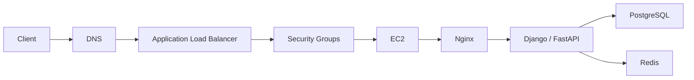
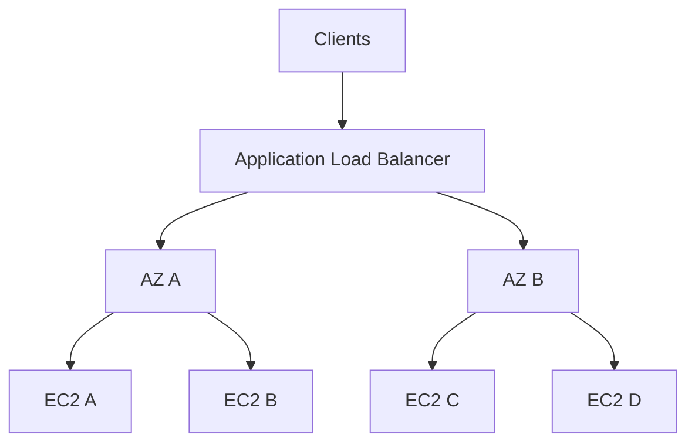

# 03- Connection Timeout

## Overview

A connection timeout occurs when a client attempts to establish a network connection but does not receive an expected response within the configured timeout period.

For an EC2-hosted backend, a timeout usually points toward a problem somewhere in the network path:

```text
Client
  |
  v
DNS
  |
  v
Destination IP
  |
  v
Route
  |
  v
Security Group
  |
  v
Network ACL
  |
  v
Host Firewall
  |
  v
Listening Service
```

Unlike `connection refused`, where the destination actively rejects the TCP connection, a timeout commonly means packets are being dropped, routed incorrectly, or never reaching a responding service.

Typical errors include:

```text
Connection timed out
```

```text
curl: (28) Failed to connect to api.example.com port 443 after 10000 ms
```

```text
TimeoutError: [Errno 110] Connection timed out
```

A disciplined investigation should answer:

- What is the source?
- What is the destination?
- Which IP address is being used?
- Which port is being accessed?
- Does DNS resolve?
- Does the route exist?
- Is traffic allowed by Security Groups and NACLs?
- Is the destination actually listening?
- Is the response path working?
- Is the timeout occurring at TCP, TLS, HTTP, or application level?

---

## Connection Timeout vs Connection Refused

These failures occur at different stages of the connection lifecycle.

### Connection Refused

```text
Client
  |
  | SYN
  v
Server
  |
  | RST
  v
Client
```

The destination responds but does not accept the connection.

Typical causes:

- No process listening
- Wrong port
- Service stopped
- Incorrect bind address
- Local firewall rejection

### Connection Timeout

```text
Client
  |
  | SYN
  v
Network
  |
  X
No response
```

Typical causes:

- Security Group blocking traffic
- NACL blocking traffic
- Missing route
- Incorrect route
- Network path failure
- Host firewall
- Incorrect destination IP
- Service unreachable
- Return traffic blocked

The distinction is important because a timeout should generally trigger network-path investigation before assuming the application process is down.

---

## Connection Lifecycle

A typical TCP connection looks like:

```text
Client                         Server

  SYN ------------------------>

      <------------------------ SYN + ACK

  ACK ------------------------>

      Connection established
```

For a timeout:

```text
Client                         Server

  SYN ------------------------>

  SYN ------------------------>

  SYN ------------------------>

  ... timeout ...
```

The exact packet behavior depends on where traffic is being dropped.

The important diagnostic point is that the client did not receive the expected response.

---

## Typical EC2 Request Path

For a public API:



A timeout can occur at any network boundary:

```text
Client -> DNS
ALB -> EC2
EC2 -> PostgreSQL
EC2 -> Redis
EC2 -> External API
```

Always identify the exact connection that timed out.

---

## Start With Source and Destination

Before changing infrastructure, record:

```text
Source host
Source IP
Destination hostname
Destination IP
Destination port
Protocol
Timestamp
Environment
```

For example:

```text
Source:
EC2 i-0123456789abcdef0

Destination:
postgres.internal.example

Resolved IP:
10.0.30.15

Port:
5432

Protocol:
TCP
```

This turns:

```text
"Database connection timeout"
```

into:

```text
10.0.20.10 -> 10.0.30.15:5432 TCP timeout
```

That is actionable.

---

## First Troubleshooting Flow

Use this order for most EC2 connectivity timeouts:

```text
Identify destination
       |
       v
Resolve DNS
       |
       v
Verify destination IP
       |
       v
Check route
       |
       v
Check Security Groups
       |
       v
Check Network ACLs
       |
       v
Check host firewall
       |
       v
Check destination listener
       |
       v
Check return path
       |
       v
Test application protocol
```

Do not immediately modify Security Groups or routing tables.

First establish which layer is failing.

---

## Verify DNS

Start with DNS:

```bash
getent hosts api.internal.example.com
```

Or:

```bash
dig api.internal.example.com
```

Verify:

- The hostname resolves.
- The returned IP is expected.
- The IP belongs to the correct VPC/environment.
- The DNS record was not recently changed.
- A stale DNS record is not pointing to an old resource.

For an external service:

```bash
dig api.example.com
```

For an internal service:

```bash
dig api.internal.example.com
```

If DNS fails completely, the issue is not yet a TCP connectivity problem.

---

## Test the Resolved IP

After obtaining the IP, bypass DNS:

```bash
nc -vz 10.0.20.15 8000
```

For HTTPS:

```bash
nc -vz 10.0.20.15 443
```

This distinguishes:

```text
DNS problem
```

from:

```text
Network/TCP problem
```

If the hostname times out but the IP succeeds, investigate DNS behavior.

---

## Test With `curl`

For HTTP:

```bash
curl -v --connect-timeout 5 http://10.0.20.15:8000/health
```

For HTTPS:

```bash
curl -v --connect-timeout 5 https://api.example.com/health
```

The verbose output helps determine whether the failure occurs during:

```text
DNS
TCP
TLS
HTTP
```

For example:

```text
* Trying 10.0.20.15:8000...
* connect to 10.0.20.15 port 8000 failed: Connection timed out
```

This indicates the failure occurred before the HTTP request was established.

---

## Determine Which Layer Times Out

A request can time out at several layers.

| Layer | Example | Investigation |
|---|---|---|
| DNS | Hostname resolution timeout | DNS/resolver |
| TCP | Port connection timeout | Routing/SG/NACL/firewall |
| TLS | TLS handshake timeout | TLS/proxy/network |
| HTTP | Server response timeout | Application/dependency |
| Database | PostgreSQL query timeout | DB/query/network |
| Redis | Redis command timeout | Redis/network/load |
| External API | HTTP client timeout | External dependency |

Do not assume every `timeout` is a network problem.

---

## Check EC2 State

Verify the destination instance:

```bash
aws ec2 describe-instances \
  --instance-ids i-0123456789abcdef0 \
  --query 'Reservations[].Instances[].{ID:InstanceId,State:State.Name,AZ:Placement.AvailabilityZone,PrivateIP:PrivateIpAddress,Type:InstanceType}' \
  --output table
```

Confirm:

- Instance is running.
- Expected private IP is being used.
- Instance is in the expected Availability Zone.
- Instance ID matches the intended resource.

In Auto Scaling environments, do not assume an old private IP still belongs to the same instance.

---

## Check EC2 Status Checks

Inspect status:

```bash
aws ec2 describe-instance-status \
  --instance-ids i-0123456789abcdef0 \
  --include-all-instances \
  --query 'InstanceStatuses[].{ID:InstanceId,State:InstanceState.Name,System:SystemStatus.Status,Instance:InstanceStatus.Status}' \
  --output table
```

If system or instance status checks are failing, investigate the EC2 instance itself before debugging application networking.

---

## Routing Is a Common Cause

Traffic requires a valid route between the source and destination.

For example:

```text
EC2 A
10.0.10.0/24
   |
   v
Route Table
   |
   v
10.0.20.0/24
   |
   v
EC2 B
10.0.20.0/24
```

If the route is missing or incorrect:

```text
EC2 A
   |
   X
No valid route
   |
   X
EC2 B
```

The connection may time out.

---

## Inspect Route Tables

Identify the subnet:

```bash
aws ec2 describe-instances \
  --instance-ids i-0123456789abcdef0 \
  --query 'Reservations[].Instances[].SubnetId'
```

Then inspect route tables associated with the subnet.

```bash
aws ec2 describe-route-tables \
  --filters Name=association.subnet-id,Values=subnet-0123456789abcdef0
```

Inspect:

- Destination CIDR
- Target
- State
- Route table association
- Main route table behavior

For VPC-internal traffic, verify that the expected destination CIDR is reachable through the VPC routing model.

---

## Public vs Private Connectivity

A common mistake is assuming that a public IP automatically makes an EC2 instance reachable.

For public connectivity, the architecture may require:

```text
Internet
   |
   v
Internet Gateway
   |
   v
Public subnet
   |
   v
EC2
```

For private connectivity:

```text
EC2 A
   |
   v
VPC routing
   |
   v
EC2 B
```

Private instances do not need public IP addresses for communication within the VPC.

---

## Internet Gateway vs NAT Gateway

These services have different roles.

```text
Public subnet
    |
    v
Internet Gateway
    |
    v
Internet
```

A private subnet commonly uses:

```text
Private EC2
    |
    v
NAT Gateway
    |
    v
Internet Gateway
    |
    v
Internet
```

A NAT Gateway provides outbound connectivity from private resources; it does not make private EC2 instances directly reachable from the internet.

If an EC2 instance in a private subnet cannot reach an external API, investigate:

```text
Route table
   |
   v
NAT Gateway
   |
   v
NAT subnet route
   |
   v
Internet Gateway
   |
   v
External service
```

---

## Security Groups

Security Groups are one of the most important checks for EC2 connection timeouts.

A Security Group acts as a stateful virtual firewall associated with resources such as EC2 instances and network interfaces.

Example:

```text
ALB
 |
 | TCP 8000
 v
EC2
```

The EC2 Security Group must allow the intended source to access port `8000`.

Inspect:

```bash
aws ec2 describe-security-groups \
  --group-ids sg-0123456789abcdef0
```

Check:

- Source CIDR
- Source Security Group
- Destination port
- Protocol
- Direction
- Recently changed rules

---

## Security Group Architecture

For a production API:

```text
Internet
    |
    | 443
    v
ALB-SG
    |
    | 8000
    v
API-SG
    |
    | 5432
    v
DB-SG
```

A secure design commonly uses Security Group references:

```text
API-SG allows DB-SG -> 5432
```

rather than:

```text
API-SG allows 0.0.0.0/0 -> 5432
```

The latter unnecessarily exposes the database.

---

## Security Group Statefulness

Security Groups are stateful.

If an allowed connection is established, the response traffic is automatically permitted as part of the established connection.

This differs from Network ACLs, which are stateless.

Therefore, when troubleshooting:

```text
Security Group
    |
    +-- Stateful
    |
    +-- Allow rules
```

versus:

```text
NACL
    |
    +-- Stateless
    |
    +-- Allow and deny rules
```

The distinction matters when diagnosing return traffic.

---

## Network ACLs

A Network ACL operates at the subnet boundary.

A restrictive NACL can cause connection timeouts even when Security Groups are correct.

For a TCP connection:

```text
Client
  |
  | SYN
  v
Destination
  |
  | SYN/ACK
  v
Client
```

Both directions must be permitted by a stateless NACL.

Inspect:

- Inbound rules
- Outbound rules
- Rule ordering
- Ephemeral port requirements
- Subnet association

---

## NACL Troubleshooting

If Security Groups look correct:

```text
Check subnet
    |
    v
Identify NACL
    |
    v
Check inbound rules
    |
    v
Check outbound rules
    |
    v
Check rule ordering
    |
    v
Check ephemeral response ports
```

A common mistake is allowing the destination port inbound but forgetting that return traffic also requires an appropriate outbound rule.

---

## Host Firewall

The EC2 operating system may have its own firewall.

Check Linux firewall configuration where applicable:

```bash
sudo nft list ruleset
```

or:

```bash
sudo iptables -L -n -v
```

A host firewall can block traffic even when AWS networking is correctly configured.

The complete security path can therefore be:

```text
Security Group
      |
      v
NACL
      |
      v
Host Firewall
      |
      v
Application
```

---

## Check the Listening Service

Once network controls appear correct, verify the destination service.

```bash
sudo ss -lntp
```

For a specific port:

```bash
sudo ss -lntp | grep ':8000'
```

A timeout does not prove that the service is down, but this check helps distinguish:

```text
Network path problem
```

from:

```text
Application listener problem
```

If the service is not listening, also test from the instance itself.

---

## Localhost Test

On the destination EC2 instance:

```bash
curl -v --connect-timeout 5 http://127.0.0.1:8000/health
```

Then test the private IP:

```bash
curl -v --connect-timeout 5 http://10.0.20.15:8000/health
```

Interpretation:

| Localhost | Private IP | Likely Investigation |
|---|---|---|
| Fails | Fails | Application/process |
| Works | Fails | Bind address/firewall |
| Works | Works | Remote network path |
| Works | Works, ALB fails | ALB/SG/NACL/target configuration |

This is one of the fastest ways to isolate a timeout.

---

## Bind Address

A service listening only on:

```text
127.0.0.1:8000
```

cannot accept remote connections through:

```text
10.0.20.15:8000
```

For FastAPI:

```bash
uvicorn app.main:app --host 0.0.0.0 --port 8000
```

Verify:

```bash
sudo ss -lntp | grep ':8000'
```

Expected:

```text
0.0.0.0:8000
```

The correct bind address depends on the deployment architecture. Do not expose a service unnecessarily.

---

## IPv4 and IPv6

A timeout can result from using the wrong address family.

Inspect:

```bash
sudo ss -lntp
```

Test explicitly:

```bash
curl -4 -v --connect-timeout 5 https://api.example.com
```

and:

```bash
curl -6 -v --connect-timeout 5 https://api.example.com
```

If IPv4 works but IPv6 times out, investigate:

- AAAA DNS record
- IPv6 route
- IPv6 Security Group rules
- IPv6 NACL rules
- Application IPv6 listener
- Internet Gateway configuration

---

## Load Balancer Troubleshooting

For ALB-backed services, determine whether the timeout occurs:

```text
Client -> ALB
```

or:

```text
ALB -> EC2
```

These are different failures.

Architecture:


If:

```text
Client -> ALB
```

times out, investigate ALB accessibility and frontend networking.

If the ALB can be reached but the target is unhealthy, investigate:

```text
ALB -> EC2
```

---

## ALB Target Health

Inspect target health:

```bash
aws elbv2 describe-target-health \
  --target-group-arn "$TARGET_GROUP_ARN"
```

Look for:

- `healthy`
- `unhealthy`
- `initial`
- `draining`

If unhealthy, inspect:

- Health-check port
- Health-check path
- Security Group
- Application listener
- Nginx
- Application logs
- Response latency

---

## ALB Security Group

For:

```text
Internet
   |
   v
ALB :443
   |
   v
EC2 :8000
```

you typically need:

```text
Internet -> ALB-SG :443
ALB-SG -> EC2-SG :8000
```

Do not open EC2 port `8000` to the entire internet just because the ALB cannot reach it.

Verify the source relationship.

---

## Nginx and Reverse Proxy

For:

```text
ALB
 |
 v
Nginx :80
 |
 v
FastAPI :8000
```

test locally:

```bash
curl -v http://127.0.0.1/
```

Then:

```bash
curl -v http://127.0.0.1:8000/health
```

If:

```text
127.0.0.1:8000 -> works
127.0.0.1:80 -> timeout
```

investigate Nginx.

If:

```text
127.0.0.1:80 -> works
remote client -> timeout
```

investigate networking.

---

## Check Nginx

```bash
sudo systemctl status nginx
```

Validate configuration:

```bash
sudo nginx -t
```

Check listening ports:

```bash
sudo ss -lntp | grep nginx
```

Inspect logs:

```bash
sudo tail -n 200 /var/log/nginx/error.log
```

If Nginx itself is reachable but its upstream is not, the client may receive an HTTP error rather than a raw TCP timeout.

---

## Docker Networking

When EC2 runs Docker:

```text
Client
  |
  v
EC2
  |
  v
Docker Port Mapping
  |
  v
Container
  |
  v
Application
```

Inspect:

```bash
docker ps
```

Inspect published ports:

```bash
docker port <container>
```

Inspect container networking:

```bash
docker inspect <container>
```

A common mistake is confusing:

```text
container port
```

with:

```text
EC2 published port
```

---

## Docker Port Mapping Example

Suppose the application listens on:

```text
Container :8000
```

and Docker publishes:

```bash
docker run -p 9000:8000 my-api
```

The network path is:

```text
EC2 :9000
    |
    v
Container :8000
```

The ALB should therefore target port `9000`, not `8000`, unless another proxy changes the path.

---

## PostgreSQL Connection Timeout

Suppose Django reports:

```text
could not connect to server:
Connection timed out
```

The investigation should be:

```text
Django EC2
    |
    v
DNS
    |
    v
PostgreSQL IP
    |
    v
Route
    |
    v
Security Group
    |
    v
NACL
    |
    v
PostgreSQL listener
```

Test:

```bash
nc -vz db.internal.example 5432
```

If it times out, inspect network controls before assuming PostgreSQL is down.

On the database host:

```bash
sudo ss -lntp | grep ':5432'
```

Then:

```bash
sudo systemctl status postgresql
```

---

## Redis Connection Timeout

For Redis:

```bash
redis-cli -h redis.internal.example ping
```

If the connection times out:

```text
DNS
 |
Route
 |
Security Group
 |
NACL
 |
Redis listener
```

Test the port:

```bash
nc -vz redis.internal.example 6379
```

Then verify Redis's bind and firewall configuration on the destination host where applicable.

---

## Kafka Connection Timeout

Kafka troubleshooting can be more complex because the initial bootstrap connection may succeed while connections to advertised brokers fail.

The flow is:

```text
Kafka Client
    |
    v
Bootstrap Broker
    |
    v
Metadata
    |
    v
Advertised Broker Address
    |
    v
Broker Connection
```

Investigate:

- Bootstrap address
- Broker listener
- `advertised.listeners`
- DNS
- Routing
- Security Groups
- NACLs
- Broker reachability

A client that can reach the bootstrap server does not necessarily have network connectivity to every broker endpoint.

---

## gRPC Connection Timeout

gRPC uses HTTP/2 over TCP.

The connection path is:

```text
Client
  |
  | TCP
  v
Server
  |
  | TLS / HTTP2
  v
gRPC
```

Test TCP first:

```bash
nc -vz grpc.internal.example 50051
```

Then investigate gRPC-specific behavior.

Do not debug protobuf or service methods before establishing that the underlying TCP connection works.

---

## External API Timeouts

An EC2 application may time out while calling an external service:

```text
EC2
 |
 v
NAT Gateway
 |
 v
Internet Gateway
 |
 v
External API
```

For private EC2 instances, investigate:

```text
Route table
NAT Gateway
NAT subnet
Internet Gateway
DNS
Security Group
NACL
External endpoint
```

Check whether the application can resolve and reach the endpoint:

```bash
dig api.external.example.com
```

```bash
curl -v --connect-timeout 5 https://api.external.example.com/health
```

---

## NAT Gateway Troubleshooting

A private EC2 instance typically requires a route such as:

```text
0.0.0.0/0 -> NAT Gateway
```

The NAT Gateway must be reachable through the appropriate subnet and routing configuration.

A common architecture is:


If the private instance cannot reach external APIs, inspect every hop.

---

## VPC Peering and Transit Gateway

For communication across VPCs:

```text
VPC A
 |
 v
VPC Peering / Transit Gateway
 |
 v
VPC B
```

A timeout may occur if:

- Route is missing in VPC A
- Route is missing in VPC B
- CIDRs overlap
- Security Group blocks traffic
- NACL blocks traffic
- Transit Gateway route table is incorrect
- Peering configuration is incorrect

Connectivity requires a valid return path as well as a forward path.

---

## Return Path

A common advanced troubleshooting mistake is checking only the outbound path.

TCP requires bidirectional communication:

```text
Client
  |
  | SYN
  v
Server
  |
  | SYN/ACK
  v
Client
```

Therefore investigate:

```text
Forward route
+
Return route
```

A request can reach the destination while the response cannot return.

This is especially important with:

- NACLs
- Custom routing
- Transit Gateway
- VPC Peering
- VPN
- Direct Connect
- Multi-network architectures

---

## Ephemeral Ports

The client usually selects a temporary source port:

```text
Client:
10.0.10.20:49152

Server:
10.0.20.15:5432
```

The return traffic is addressed to:

```text
10.0.10.20:49152
```

A restrictive stateless NACL must allow the appropriate return traffic.

This is one reason NACL configuration can cause confusing connection timeouts.

---

## VPC Flow Logs

VPC Flow Logs are valuable when the application says:

```text
Connection timed out
```

but the application cannot explain why.

They can provide evidence about network traffic involving VPC resources and interfaces.

A useful investigation flow is:

```text
Application timeout
      |
      v
Identify source/destination
      |
      v
Check VPC Flow Logs
      |
      v
Determine ACCEPT / REJECT behavior
      |
      v
Investigate SG / NACL / routing
```

Flow logs are evidence, not a complete replacement for packet-level analysis.

---

## Packet-Level Investigation

For advanced Linux troubleshooting, `tcpdump` can show whether packets reach the host.

Example:

```bash
sudo tcpdump -ni any host 10.0.20.15 and port 8000
```

Or:

```bash
sudo tcpdump -ni any tcp port 5432
```

Possible observations:

```text
SYN received
```

but no:

```text
SYN/ACK
```

This can indicate a host-side or service-side problem.

If no packet appears at all, investigate the upstream network path.

Use packet captures carefully in production because high-volume traffic can create operational overhead and may contain sensitive information.

---

## Connection Tracking

On Linux systems, connection tracking can help identify network state when relevant.

For example:

```bash
sudo conntrack -L
```

Availability depends on the operating system and installed packages.

Use this for advanced diagnosis rather than as a first-line command.

---

## Check Host Resource Saturation

A server under extreme resource pressure can behave like a network failure.

Check:

```bash
uptime
```

```bash
free -h
```

```bash
df -h
```

```bash
vmstat 1 5
```

```bash
top
```

Also inspect:

```bash
dmesg | tail -n 100
```

where appropriate.

Possible causes include:

- CPU saturation
- Memory pressure
- OOM events
- File descriptor exhaustion
- Network buffer pressure
- Process exhaustion

---

## File Descriptor Exhaustion

A service may fail to accept new connections if it reaches file descriptor limits.

Inspect:

```bash
ulimit -n
```

For a process:

```bash
cat /proc/<PID>/limits | grep -i 'open files'
```

Check open descriptors:

```bash
sudo lsof -p <PID> | wc -l
```

Possible application-level causes:

- Connection leaks
- Unclosed files
- Excessive sockets
- Too many workers
- Incorrect connection pooling

Do not simply increase limits without investigating the underlying resource consumption.

---

## Connection Pool Exhaustion

An application may report timeouts even when the network is healthy because it cannot obtain a connection from its own pool.

Example:

```text
API Requests
    |
    v
Connection Pool
    |
    +-- Connection 1
    +-- Connection 2
    +-- ...
    +-- Connection N
```

If all connections are busy:

```text
New request
    |
    v
Wait for connection
    |
    v
Pool timeout
```

This is different from a TCP connection timeout.

Distinguish:

```text
Network connection timeout
```

from:

```text
Connection pool acquisition timeout
```

The application logs usually provide this distinction.

---

## Application Timeout Configuration

Backend applications commonly have multiple timeout layers.

For example:

```text
Client timeout
    |
    v
ALB timeout
    |
    v
Nginx timeout
    |
    v
Application timeout
    |
    v
Database timeout
```

A request may appear to "timeout" even though the underlying TCP connection succeeded.

Always identify which timeout fired.

---

## Timeout Budget

For a synchronous API:

```text
Client
  |
  | 30s total
  v
ALB
  |
  | 25s
  v
Application
  |
  | 15s
  v
Database
```

Timeouts should be designed intentionally.

A downstream dependency should generally not have a timeout longer than the total request budget.

Otherwise:

```text
Client timeout = 30s
Database timeout = 60s
```

can cause unnecessary work after the client has already abandoned the request.

---

## Retry Amplification

Retries can make timeout incidents significantly worse.

Example:

```text
100 requests
    |
    v
Dependency slow
    |
    v
100 timeouts
    |
    v
Each request retries 3 times
    |
    v
300 additional requests
```

This can overload an already unhealthy dependency.

Use:

- Bounded retries
- Exponential backoff
- Jitter
- Maximum retry count
- Circuit breakers where appropriate
- Idempotency controls

Do not blindly retry every timeout.

---

## Timeout and Celery

For asynchronous systems:

```text
API
 |
 v
Queue
 |
 v
Celery Worker
 |
 v
External API
```

A worker timeout can cause:

```text
Task timeout
    |
    v
Retry
    |
    v
More outbound requests
    |
    v
External dependency overloaded
    |
    v
More timeouts
```

Configure retry policies deliberately.

For example, use bounded exponential backoff rather than immediate infinite retries.

---

## Auto Scaling and Timeouts

A traffic spike may cause:

```text
Traffic increase
      |
      v
EC2 CPU increases
      |
      v
Request latency increases
      |
      v
Requests timeout
      |
      v
ALB marks targets unhealthy
      |
      v
Available capacity decreases
      |
      v
More traffic per remaining target
```

This creates a positive feedback loop.

Monitoring should therefore track:

- Request count
- Target response time
- Target health
- CPU
- Memory
- Scaling activity
- Error rate

---

## Availability Zone Failures

If timeouts affect instances in one AZ:

```text
AZ-A
  |
  +-- Healthy

AZ-B
  |
  +-- Timeout
  +-- Timeout
  +-- Timeout

AZ-C
  |
  +-- Healthy
```

Investigate:

- Subnet routing
- NACLs
- NAT Gateway
- Load balancer target behavior
- AZ-specific AWS events
- Network dependencies
- Capacity

Multi-AZ architecture helps isolate failures and maintain service availability.

---

## Common Causes

| Cause | Typical Evidence | Investigation |
|---|---|---|
| Missing route | No network response | Route tables |
| Security Group block | Traffic dropped | Security Groups |
| NACL block | Direction-specific drop | NACL rules |
| Host firewall | Packet reaches host but is blocked | `nft`, `iptables` |
| Wrong IP | Traffic goes elsewhere | DNS / configuration |
| Private subnet without NAT | External calls fail | NAT/routes |
| Broken VPC peering | Cross-VPC timeout | Routes/peering |
| Transit Gateway route issue | Cross-VPC/network timeout | TGW routes |
| IPv6 path failure | IPv6 only fails | IPv6 routes/SG |
| Service unreachable | No application response | Listener/process |
| Resource exhaustion | Intermittent timeouts | CPU/memory/fd metrics |
| Connection pool exhaustion | Application-level wait | Application metrics/logs |
| Dependency overload | High downstream latency | Dependency metrics |
| Retry storm | Increasing traffic during failure | Retry/queue metrics |

---

## Common Troubleshooting Mistakes

### Opening Everything in the Security Group

Avoid:

```text
0.0.0.0/0 -> all ports
```

as a troubleshooting shortcut.

It destroys useful security boundaries and may expose production services.

---

### Changing NACLs Without Understanding Stateless Behavior

NACLs require explicit consideration of both directions.

Do not modify rules blindly.

---

### Checking Only the Destination

A successful destination configuration does not guarantee connectivity.

Inspect:

```text
Source
Route
Security
Destination
Return path
```

---

### Ignoring the Return Path

A forward route alone is insufficient.

TCP requires bidirectional communication.

---

### Treating Every Timeout as a TCP Timeout

A database pool timeout, HTTP response timeout, TLS timeout, and TCP connect timeout are different failures.

Identify the exact timeout.

---

### Increasing Timeout Values to Hide the Problem

Changing:

```text
5s -> 60s
```

may hide a dependency failure while increasing resource consumption.

Fix the underlying latency or connectivity problem when possible.

---

### Retrying Without Limits

Retries can turn a partial outage into a larger outage.

Use bounded retry policies and backoff.

---

### Ignoring DNS

A stale or incorrect DNS record can point traffic to the wrong destination.

Always verify the actual resolved IP.

---

## Production Troubleshooting Checklist

```text
[ ] Identify source and destination
[ ] Identify destination port and protocol
[ ] Confirm the exact timeout layer
[ ] Verify DNS resolution
[ ] Test destination IP directly
[ ] Confirm EC2 state
[ ] Check EC2 status checks
[ ] Verify route tables
[ ] Check Security Groups
[ ] Check NACLs
[ ] Check host firewall
[ ] Check return path
[ ] Verify listener/process
[ ] Check bind address
[ ] Check ALB target health
[ ] Check Nginx / reverse proxy
[ ] Check Docker/Kubernetes networking
[ ] Check NAT Gateway for external access
[ ] Check VPC Peering / Transit Gateway where applicable
[ ] Check VPC Flow Logs
[ ] Check host resource saturation
[ ] Check connection pools
[ ] Check dependency health
[ ] Check recent changes
[ ] Check retry behavior
[ ] Preserve evidence
[ ] Apply the smallest safe remediation
[ ] Validate recovery
```

---

## Practical Investigation Example

Suppose a FastAPI service reports:

```text
requests.exceptions.ConnectTimeout:
HTTPSConnectionPool(host='payments.internal', port=443):
Connection timed out
```

Start by resolving the destination:

```bash
dig payments.internal
```

Suppose it returns:

```text
10.0.40.25
```

Test TCP:

```bash
nc -vz 10.0.40.25 443
```

Result:

```text
timed out
```

Check the route:

```text
API subnet
    |
    v
Route table
    |
    v
10.0.40.0/24
```

Suppose the route is correct.

Check Security Groups:

```text
API-SG
   |
   | 443
   v
Payments-SG
```

Suppose the rule is missing.

The diagnosis becomes:

```text
Application timeout
       |
       v
TCP timeout
       |
       v
Route exists
       |
       v
Security Group blocks traffic
       |
       v
Add narrowly scoped API-SG -> Payments-SG :443 rule
```

After applying the change:

```bash
nc -vz 10.0.40.25 443
```

Then:

```bash
curl -v --connect-timeout 5 https://payments.internal/health
```

Validate both network and application recovery.

---

## Advanced Investigation With VPC Flow Logs

Suppose:

```text
EC2 A -> EC2 B :5432
```

times out.

The application cannot determine whether the traffic is being dropped by AWS networking.

VPC Flow Logs can help answer:

```text
Was traffic observed?
Was it accepted?
Was it rejected?
Which interface was involved?
What source and destination were recorded?
```

The investigation becomes:

```text
Application
    |
    v
TCP timeout
    |
    v
VPC Flow Logs
    |
    +--> REJECT
    |      |
    |      v
    |   SG/NACL investigation
    |
    +--> ACCEPT
           |
           v
      Investigate host/service
```

Use flow logs together with route and security configuration rather than treating them as definitive root-cause evidence by themselves.

---

## Observability

Monitor connectivity at multiple levels.

### Infrastructure

- EC2 status checks
- Network traffic
- VPC Flow Logs
- NAT Gateway metrics
- Load balancer target health

### Application

- Connection timeout count
- Request latency
- Dependency latency
- Error rate
- Connection pool utilization

### Dependency

- PostgreSQL connections
- Redis latency
- Kafka consumer lag
- External API latency

A useful metric hierarchy is:

```text
Request Error Rate
       |
       v
Dependency Error Rate
       |
       v
Network Connectivity
       |
       v
Infrastructure Health
```

---

## Security Considerations

When troubleshooting timeouts:

- Do not expose internal services publicly.
- Avoid broad temporary Security Group rules.
- Avoid disabling NACLs without understanding the impact.
- Do not expose PostgreSQL, Redis, or Kafka to the public internet.
- Restrict diagnostic access.
- Remove temporary rules after the incident.
- Avoid capturing sensitive application payloads in packet captures.
- Treat flow logs and packet captures as potentially sensitive operational data.

Connectivity should be restored without weakening the production security model.

---

## High Availability

Connection timeouts should not automatically become service-wide outages.

A resilient architecture should provide multiple healthy targets:



If one instance becomes unreachable:

```text
EC2 A -> timeout
    |
    v
Health check fails
    |
    v
ALB removes target
    |
    v
Traffic continues to healthy targets
```

High availability reduces the blast radius, but it does not eliminate the need to investigate the underlying failure.

---

## Cost Considerations

Network connectivity failures can increase AWS costs indirectly.

For example:

```text
Dependency timeout
      |
      v
Application retries
      |
      v
More requests
      |
      v
More compute
      |
      v
More NAT / network traffic
      |
      v
Higher cost
```

NAT Gateway usage can also become significant for high-volume outbound traffic.

Monitor both reliability and cost when diagnosing persistent external connectivity problems.

---

## Disaster Recovery Considerations

For critical systems, document connectivity dependencies across recovery environments.

Example:

```text
Primary Region
    |
    +-- VPC
    +-- Private Subnets
    +-- NAT
    +-- Databases
    +-- External Dependencies

DR Region
    |
    +-- Equivalent Network Path
    +-- Equivalent Security Controls
    +-- Recovery Dependencies
```

A DR environment that restores EC2 instances but lacks:

- Routes
- Security Groups
- DNS
- NAT
- Database connectivity
- External service access

may still be unusable.

Test network recovery as part of DR exercises.

---

## Interview Considerations

### What does a connection timeout usually indicate?

It generally indicates that the client did not receive the expected response while establishing the connection. In EC2 environments, common causes include routing, Security Groups, NACLs, host firewalls, incorrect addresses, and unavailable network paths.

### How is timeout different from connection refused?

A timeout generally means the connection attempt received no usable response. A refusal means the destination actively rejected the connection, commonly because no service is listening on the requested port.

### What would you check first for an EC2 connection timeout?

Start with:

```text
Source
Destination
IP
Port
DNS
Route
Security Group
NACL
```

Then inspect the destination host and service.

### Can a Security Group cause a connection timeout?

Yes. If the relevant traffic is not allowed, packets can be dropped and the client can wait until its connection timeout expires.

### Why are NACLs more complicated than Security Groups during troubleshooting?

NACLs are stateless and operate at the subnet boundary. Both inbound and outbound traffic must be explicitly permitted according to the rule set.

### How do you troubleshoot a private EC2 instance that cannot call an external API?

Check:

```text
DNS
   |
Route table
   |
NAT Gateway
   |
NAT subnet route
   |
Internet Gateway
   |
Security Group
   |
NACL
   |
External endpoint
```

### What if one EC2 instance times out while others work?

Compare:

```text
Subnet
AZ
Route table
Security Group
NACL
Private IP
Host firewall
Process
Instance health
```

The issue is more likely to be instance- or network-segment-specific than a service-wide dependency problem.

### Why can increasing the timeout be a bad solution?

It increases the time resources remain occupied and can amplify cascading failures. A timeout should generally represent a deliberate failure boundary rather than hide an unhealthy dependency.

### How can retries make a timeout incident worse?

Retries multiply traffic against an already slow or unreachable dependency. Use bounded retries, exponential backoff, jitter, and circuit-breaking strategies where appropriate.

## Key Takeaways

- **A connection timeout usually requires investigation of the complete network path: DNS, routing, Security Groups, NACLs, host firewall, destination, and return path.**
- **Always identify the exact timeout layer; TCP connect timeout, TLS timeout, HTTP response timeout, and database connection-pool timeout have different causes.**
- **Use targeted diagnostics such as `dig`, `nc`, `curl`, `ss`, route inspection, VPC Flow Logs, and packet captures to replace assumptions with evidence.**
- **Treat Security Groups and NACLs differently: Security Groups are stateful resource-level controls, while NACLs are stateless subnet-level controls requiring careful consideration of both directions.**
- **Design for failure with multi-AZ deployment, healthy load-balancer targets, bounded retries, appropriate timeout budgets, and observable dependency boundaries.**