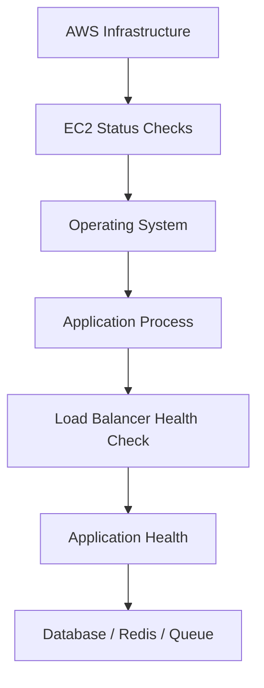
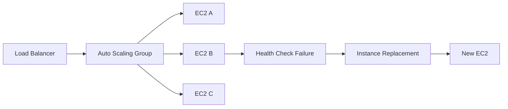
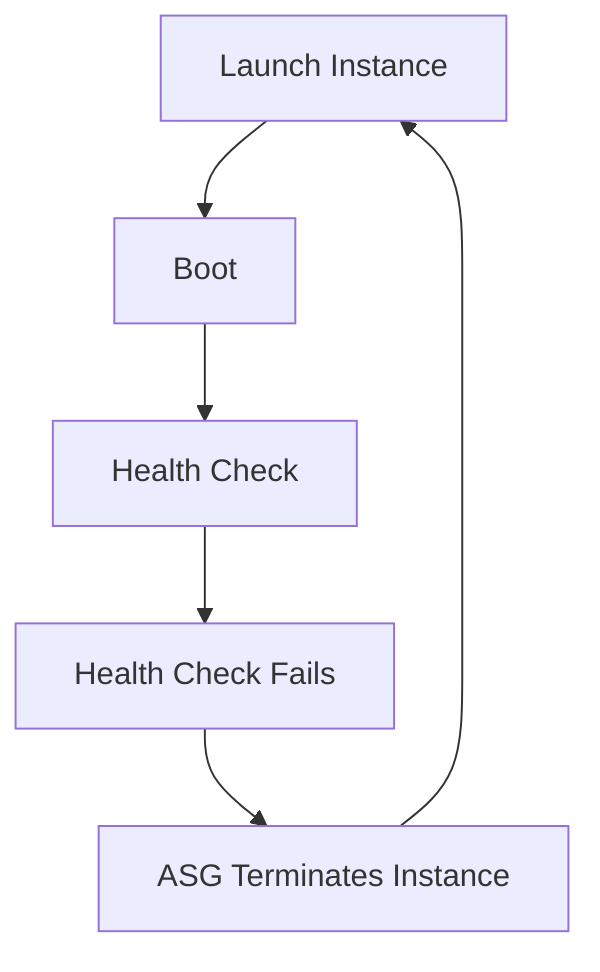

# 04- Instance Health Check Failures

## Overview

EC2 instance health checks provide an early signal that an instance or the underlying AWS infrastructure may not be functioning correctly.

When an EC2 instance fails a status check, the correct response is not immediately to reboot or replace it. First determine:

- Which status check failed?
- Is the problem at the underlying AWS infrastructure layer or inside the instance?
- Is the instance reachable?
- Is the operating system responsive?
- Is the application affected?
- Is the failure isolated to one instance, Availability Zone, or fleet?
- Can the instance recover automatically?
- Should the instance be repaired, rebooted, or replaced?

EC2 status checks are particularly important for Auto Scaling and load-balanced systems:

```text
EC2
 |
 +-- System status check
 |
 +-- Instance status check
 |
 +-- Scheduled events
 |
 +-- Application health
 |
 v
Operational decision
```

A critical distinction is:

```text
EC2 status check
    !=
Application health check
```

An instance can pass EC2 status checks while Django, FastAPI, Nginx, PostgreSQL, or another application component is completely unhealthy.

---

## EC2 Status Checks

EC2 performs automated checks to determine whether an instance and the underlying infrastructure are functioning as expected.

The primary status checks are:

| Check | Scope | Typical Failure Domain |
|---|---|---|
| System status check | AWS infrastructure | Underlying host, network, power, hardware |
| Instance status check | Instance/OS | Boot failure, networking configuration, kernel/software problems |
| Application health check | Application | Process, application, dependency, endpoint |

The first two are EC2 status checks. Application health is usually provided by systems such as:

- Application Load Balancer
- CloudWatch
- Custom monitoring
- Kubernetes probes
- Application-level health endpoints

---

## System Status Check

A system status check evaluates the underlying infrastructure supporting the EC2 instance.

Conceptually:

```text
AWS Infrastructure
        |
        v
Physical / virtualization infrastructure
        |
        v
EC2 Instance
```

A system status check failure may indicate a problem outside the guest operating system.

Potential causes include:

- Underlying hardware problems
- Power or host infrastructure issues
- Host-level networking problems
- AWS infrastructure impairment
- Problems requiring instance migration or recovery

The important point is that restarting application processes inside the instance may not resolve an underlying infrastructure problem.

---

## Instance Status Check

An instance status check focuses on the instance itself and its ability to operate normally.

Potential causes include:

- Operating system failure
- Kernel problems
- Boot failures
- Incorrect network configuration
- Resource exhaustion
- Filesystem problems
- Corrupted system state
- Problems affecting the instance's networking stack

The distinction is:

```text
System status check
    |
    v
AWS infrastructure

Instance status check
    |
    v
Guest instance / OS
```

This distinction should guide the investigation.

---

## Application Health Is Different

Suppose:

```text
EC2 status checks = passed
```

but:

```text
ALB target health = unhealthy
```

The EC2 infrastructure may be healthy while the application is not.

Example:

```text
EC2
 |
 +-- System status: passed
 +-- Instance status: passed
 |
 +-- Nginx: stopped
 +-- FastAPI: stopped
```

Therefore, EC2 status checks should be treated as infrastructure signals rather than complete application health signals.

---

## Health Check Architecture

A production service may have several independent health layers:



A mature monitoring system observes multiple layers instead of relying on one health signal.

---

## Inspect Instance Status

Using AWS CLI:

```bash
aws ec2 describe-instance-status \
  --instance-ids i-0123456789abcdef0 \
  --include-all-instances \
  --query 'InstanceStatuses[].{Instance:InstanceId,State:InstanceState.Name,System:SystemStatus.Status,InstanceStatus:InstanceStatus.Status}' \
  --output table
```

Example:

```text
-------------------------------------------------
|              DescribeInstanceStatus            |
+----------------------+--------------------------+
| Instance             | i-0123456789abcdef0      |
| State                | running                  |
| System               | passed                   |
| InstanceStatus       | failed                   |
+----------------------+--------------------------+
```

This immediately tells you that the instance itself requires investigation even though the EC2 resource is still in the `running` state.

---

## Inspect Status Check Details

Retrieve the complete status information when investigating an incident:

```bash
aws ec2 describe-instance-status \
  --instance-ids i-0123456789abcdef0 \
  --include-all-instances
```

Inspect:

- Instance state
- System status
- Instance status
- Status details
- Scheduled events
- Events requiring action

Do not rely only on the instance's `running` state.

These are separate concepts:

```text
Instance state = running
```

does not guarantee:

```text
System status = passed
Instance status = passed
Application = healthy
```

---

## Check All Unhealthy Instances

For fleet-wide investigation:

```bash
aws ec2 describe-instance-status \
  --include-all-instances \
  --filters Name=instance-status.status,Values=impaired \
  --query 'InstanceStatuses[].{Instance:InstanceId,State:InstanceState.Name,System:SystemStatus.Status,Instance:InstanceStatus.Status,AZ:AvailabilityZone}' \
  --output table
```

This is useful during incidents affecting multiple instances.

Compare:

```text
One impaired instance
```

against:

```text
Multiple impaired instances
```

because the likely failure domain is different.

---

## Determine the Failure Domain

A useful troubleshooting model is:

```text
One Instance
    |
    v
Instance-specific investigation

Multiple Instances
    |
    v
Shared infrastructure investigation

One Availability Zone
    |
    v
AZ/subnet/network investigation

Multiple Availability Zones
    |
    v
Regional/shared dependency investigation
```

The blast radius is one of the strongest clues available during an infrastructure incident.

---

## System Check Failure Workflow

When the system status check fails:

```text
System status failed
       |
       v
Check AWS events
       |
       v
Check instance status
       |
       v
Check application impact
       |
       v
Determine recovery option
       |
       +--> Wait / AWS recovery
       |
       +--> Reboot
       |
       +--> Stop / start
       |
       +--> Instance replacement
```

Do not automatically terminate the instance.

Preserve evidence and determine whether the instance contains state that must be recovered first.

---

## Instance Check Failure Workflow

When the instance status check fails:

```text
Instance status failed
       |
       v
Can instance be accessed?
       |
       +--> Yes
       |     |
       |     v
       |   Inspect OS
       |   Logs
       |   Network
       |   Disk
       |
       +--> No
             |
             v
          Check events
          Recovery options
          Replace if appropriate
```

Instance-level failures require more attention to the operating system and instance configuration.

---

## Check Scheduled Events

AWS may report scheduled events affecting an instance.

Inspect:

```bash
aws ec2 describe-instance-status \
  --instance-ids i-0123456789abcdef0 \
  --include-all-instances
```

Look for:

- Scheduled maintenance
- Reboot events
- Retirement-related events
- System impairment
- Other events requiring action

A scheduled event can explain a health check failure without there being an application defect.

---

## Instance Recovery

For supported instance configurations, EC2 recovery mechanisms can move an affected instance to healthy underlying infrastructure while preserving important instance characteristics.

The conceptual flow is:

```text
Underlying infrastructure problem
          |
          v
System status check failure
          |
          v
Recovery mechanism
          |
          v
Healthy infrastructure
          |
          v
Instance becomes available
```

Recovery behavior depends on the instance configuration and AWS-supported recovery capabilities.

Do not assume every instance or failure condition is automatically recoverable.

---

## Manual Recovery Options

Depending on the failure, possible actions include:

| Action | Typical Use | Risk |
|---|---|---|
| Wait and monitor | Transient infrastructure issue | Service remains impaired |
| Reboot | OS/kernel/process problem | Application interruption |
| Stop/start | Some instance/system problems | Instance interruption and possible host migration |
| Instance recovery | Supported infrastructure failure | Depends on supported configuration |
| Replace instance | Immutable/ASG architecture | Requires correct bootstrap/state handling |
| Restore from backup | Persistent corruption/data loss | Recovery time |

The correct action depends on the failure domain and workload architecture.

---

## Reboot vs Stop/Start

These operations are not interchangeable.

### Reboot

A reboot restarts the operating system while retaining the instance allocation context differently from a stop/start cycle.

Typical use cases:

- Kernel issue
- OS instability
- Temporary system problem
- Controlled operational recovery

Command:

```bash
aws ec2 reboot-instances \
  --instance-ids i-0123456789abcdef0
```

### Stop/Start

Stopping and starting an instance is more disruptive.

It may:

- Stop application traffic
- Change the underlying host
- Change the public IPv4 address for instances without an Elastic IP
- Require services to start correctly again

Command:

```bash
aws ec2 stop-instances \
  --instance-ids i-0123456789abcdef0
```

Then:

```bash
aws ec2 start-instances \
  --instance-ids i-0123456789abcdef0
```

Do not use stop/start as a generic first response.

---

## Auto Scaling Changes the Recovery Model

In an Auto Scaling architecture:



If an instance fails health checks, the ASG may replace it depending on the configured health-check behavior and lifecycle.

This is one of the major advantages of immutable infrastructure.

The operational question becomes:

```text
Can this instance be safely replaced?
```

rather than:

```text
How do I repair this server manually?
```

---

## EC2 Health Checks and Auto Scaling

Auto Scaling can use EC2 status checks as part of its health evaluation.

Load balancer health checks can provide an additional application-level signal.

A production architecture may therefore have:

```text
EC2 Status
    +
ALB Target Health
    +
Application Metrics
    |
    v
ASG / Operations
```

This gives better failure detection than relying on a single signal.

---

## EC2 Status vs ELB Health

Consider:

```text
EC2:
System = passed
Instance = passed

ALB:
Target = unhealthy
```

This strongly suggests the infrastructure is functioning but the application path is not healthy.

Possible causes:

- Nginx stopped
- Gunicorn stopped
- FastAPI failed
- Wrong target port
- Security Group issue
- Health endpoint failure
- Dependency failure

Now consider:

```text
EC2:
System = failed
```

The investigation should move toward the underlying infrastructure and recovery path.

---

## Investigate Application Impact

When an EC2 status check fails, determine whether users are affected.

For an ALB-backed service:

```bash
aws elbv2 describe-target-health \
  --target-group-arn "$TARGET_GROUP_ARN"
```

Determine:

```text
Failed instance
      |
      v
ALB removed target?
      |
      v
Healthy targets remain?
      |
      v
User traffic still served?
```

A single failed instance in a multi-instance fleet may have little or no user-visible impact.

---

## Check CPU and Memory

Health-check failures can be associated with severe resource exhaustion.

Check CloudWatch metrics for:

- CPU utilization
- Network activity
- EBS metrics
- Status checks

Guest memory typically requires additional OS-level monitoring.

On Linux:

```bash
free -h
```

```bash
vmstat 1 5
```

Check processes:

```bash
ps aux --sort=-%mem | head
```

A memory exhaustion event may cause:

```text
Memory pressure
     |
     v
OOM killer
     |
     v
Critical process terminated
     |
     v
Application unavailable
```

---

## Check Disk and Filesystem Health

Disk problems can affect the OS itself.

Check:

```bash
df -h
```

Check inode usage:

```bash
df -i
```

Inspect kernel messages where appropriate:

```bash
dmesg | tail -n 100
```

Look for:

- Filesystem errors
- I/O errors
- Read-only filesystem
- Full filesystem
- Inode exhaustion
- EBS-related errors

A full root filesystem can prevent services from starting correctly after a reboot.

---

## EBS Health and Instance Health

EC2 instance health and EBS health are related but distinct.

Investigate:

```text
EC2 status
   |
   v
Instance OS
   |
   v
EBS attachment
   |
   v
Filesystem
   |
   v
Application
```

A volume may be attached but still have:

- Filesystem errors
- High latency
- Capacity exhaustion
- Application-level I/O problems

Use EBS and filesystem metrics alongside EC2 status information.

---

## Network Health

An instance may fail health checks because networking inside the OS is impaired.

Check:

```bash
ip addr
```

```bash
ip route
```

```bash
ss -s
```

Check DNS:

```bash
getent hosts example.com
```

Test connectivity:

```bash
nc -vz <destination> <port>
```

For an application server, distinguish:

```text
EC2 network failure
```

from:

```text
Application listener failure
```

---

## Inspect System Logs

For systemd-based Linux systems:

```bash
sudo journalctl -b
```

To inspect recent kernel/system errors:

```bash
sudo journalctl -p err..alert --since "1 hour ago"
```

Look for:

- Kernel errors
- OOM events
- Filesystem errors
- Network failures
- Service crashes
- Boot failures
- Device errors

System logs often provide the evidence needed to distinguish an OS-level failure from an application problem.

---

## OOM Killer

A severe memory problem may cause Linux to terminate processes.

Search logs:

```bash
sudo journalctl -k | grep -i "out of memory"
```

or:

```bash
sudo dmesg | grep -i "killed process"
```

A typical chain is:

```text
Traffic increase
     |
     v
Application memory grows
     |
     v
Memory pressure
     |
     v
OOM killer
     |
     v
Application process terminated
     |
     v
ALB target unhealthy
```

Do not simply increase the instance size without determining why memory usage increased.

---

## Kernel and Boot Failures

An instance status check failure may be associated with problems during boot.

Investigate:

```bash
sudo journalctl -b -1
```

where previous-boot logs are available.

Look for:

- Kernel panic
- Failed systemd units
- Filesystem mount failures
- Network initialization failures
- Invalid configuration
- Failed dependencies

A reboot can reproduce the same failure if the underlying configuration is not corrected.

---

## Instance Status Failure After Reboot

A particularly important production pattern is:

```text
Instance healthy
      |
      v
Reboot
      |
      v
Instance status check fails
```

This can indicate that the instance was only functioning because some configuration or service state existed in memory.

Potential causes:

- Broken boot configuration
- Service not enabled
- Filesystem mount failure
- Invalid network configuration
- Application startup failure
- Dependency unavailable during boot

Always inspect boot logs before repeatedly rebooting.

---

## User Data and Startup Configuration

Auto Scaling instances frequently depend on:

- User data
- Cloud-init
- Systemd units
- AMIs
- Configuration management
- Secrets retrieval
- Package installation

A failed startup sequence can produce a healthy EC2 infrastructure state but an unhealthy application.

Check cloud-init where applicable:

```bash
sudo cloud-init status
```

Logs:

```bash
sudo journalctl -u cloud-init
```

and:

```bash
sudo journalctl -u cloud-final
```

---

## AMI-Related Failures

If newly launched instances repeatedly fail health or application checks:

```text
Instance A -> failed
Instance B -> failed
Instance C -> failed
```

investigate the common image or bootstrap path.

Potential causes:

- Broken AMI
- Invalid startup configuration
- Missing package
- Incorrect systemd service
- Bad application configuration
- Missing IAM permissions
- Incorrect filesystem setup

This is different from an isolated instance failure.

---

## Launch Template Investigation

When instances are created through a Launch Template, compare:

```text
AMI ID
Instance type
Security Groups
IAM instance profile
User data
Block device mapping
Network configuration
Metadata options
```

A bad Launch Template can systematically reproduce the same failure across every new instance.

---

## Auto Scaling Failure Loop

A dangerous pattern is:



If this happens repeatedly, the problem is probably in the common launch path.

Investigate:

- AMI
- Launch Template
- User data
- Application startup
- Security Groups
- Health-check configuration
- Dependencies

Do not repeatedly terminate instances without investigating the replacement pattern.

---

## Load Balancer Health Checks

An ALB may mark an instance unhealthy even though EC2 status checks pass.

Example:

```text
EC2 System Status = passed
EC2 Instance Status = passed
ALB Target = unhealthy
```

Check:

```text
Health-check path
Health-check port
Protocol
Timeout
Interval
Expected status code
Security Group
Application process
```

For example:

```text
ALB -> /health
       |
       v
Nginx -> FastAPI
```

If `/health` performs an expensive PostgreSQL query, database latency can make an otherwise healthy instance fail the load balancer check.

Health endpoints should be lightweight and intentionally designed.

---

## Health Check Design

Separate health signals when useful:

```text
/health/live
```

indicates:

```text
Process is alive
```

while:

```text
/health/ready
```

indicates:

```text
Instance is ready to receive traffic
```

A readiness check may validate critical dependencies.

Do not make every non-critical dependency a hard requirement for readiness.

---

## Health Check Failure and Cascading Outages

Poor health-check design can create a feedback loop:

```text
Database temporarily slow
       |
       v
Health endpoint times out
       |
       v
ALB removes healthy EC2 targets
       |
       v
Traffic shifts to fewer targets
       |
       v
Remaining targets receive more load
       |
       v
Database load increases
       |
       v
More health checks fail
```

This is why health checks should be designed around the actual availability model.

---

## Check Availability Zone Distribution

When health failures occur, inspect AZ distribution.

```bash
aws ec2 describe-instances \
  --filters Name=tag:Environment,Values=production \
  --query 'Reservations[].Instances[].{ID:InstanceId,AZ:Placement.AvailabilityZone,State:State.Name}' \
  --output table
```

Look for:

```text
AZ A -> 4 instances
AZ B -> 4 instances
AZ C -> 4 instances
```

versus:

```text
AZ A -> 0 instances
AZ B -> 12 instances
```

A poorly distributed fleet can turn an AZ-level problem into a service-wide outage.

---

## Check Scheduled Maintenance

AWS may report scheduled events for an instance.

Inspect:

```bash
aws ec2 describe-instance-status \
  --instance-ids i-0123456789abcdef0 \
  --include-all-instances
```

Investigate any reported events before taking unrelated remediation actions.

Operational events should be correlated with the incident timeline.

---

## CloudWatch Alarms

Status checks can be monitored through CloudWatch.

A typical operational pattern is:

```text
EC2 Status Check
       |
       v
CloudWatch Metric
       |
       v
Alarm
       |
       v
SNS / Incident System
       |
       v
Operator / Automation
```

Do not create alarms without deciding what action the alarm should trigger.

An alert is useful when it leads to a defined operational response.

---

## Monitoring Strategy

A production EC2 environment should monitor at least:

| Signal | Purpose |
|---|---|
| System status check | Detect underlying infrastructure issues |
| Instance status check | Detect instance/OS problems |
| ALB target health | Detect application reachability |
| CPU | Detect compute pressure |
| Memory | Detect memory pressure |
| Disk usage | Detect filesystem exhaustion |
| Disk I/O | Detect storage bottlenecks |
| Network | Detect traffic anomalies |
| Application errors | Detect software failures |
| Latency | Detect performance degradation |
| Restart count | Detect unstable processes |

No single metric provides complete health information.

---

## Operational Decision Matrix

| Observation | Likely Direction |
|---|---|
| System check failed | Investigate AWS infrastructure/recovery |
| Instance check failed | Investigate OS/instance |
| Both status checks passed, ALB unhealthy | Investigate application/network path |
| One instance fails | Instance-specific investigation |
| Many instances fail | Shared infrastructure/configuration |
| New instances fail repeatedly | AMI/Launch Template/bootstrap |
| One AZ affected | AZ/subnet/network investigation |
| Application process crashes | Application/resource investigation |
| OOM events | Memory/resource investigation |
| Filesystem errors | EBS/filesystem investigation |

---

## Safe Recovery Strategy

A production recovery should be deliberate.

### Isolated Failure

```text
One unhealthy instance
       |
       v
Remove from traffic
       |
       v
Collect evidence
       |
       v
Repair or replace
       |
       v
Health validation
       |
       v
Return to service
```

### Fleet Failure

```text
Multiple unhealthy instances
       |
       v
Stop automatic destructive changes
       |
       v
Identify common cause
       |
       v
Validate remediation
       |
       v
Recover gradually
```

The second case requires more caution because repeatedly replacing instances can amplify the incident.

---

## When to Replace an Instance

Replacement is generally attractive when:

- Instances are stateless.
- Configuration is reproducible.
- The AMI is known-good.
- Auto Scaling is configured correctly.
- State is externalized.
- Evidence has been preserved.

Example:

```text
EC2
 |
 +-- Django/FastAPI
 +-- Nginx
 +-- Celery worker
 |
 +-- No persistent local application state
```

can usually be replaced more safely than:

```text
EC2
 |
 +-- Database
 +-- Local persistent state
 +-- Unique configuration
```

The second requires much more careful recovery.

---

## Stateful Instance Considerations

Before terminating an unhealthy instance, identify:

- EBS data volumes
- Instance Store data
- Local databases
- Local queues
- Local configuration
- Logs
- Unique credentials
- Unreplicated state

Instance Store is ephemeral and should not be treated as durable storage.

Persistent application data should generally be externalized or backed up appropriately.

---

## Evidence Preservation

Before disruptive recovery, capture useful evidence where practical:

```text
EC2 status
CloudWatch metrics
Application logs
System logs
Target health
Scheduled events
Recent deployments
Security configuration
Disk state
Process state
```

A reboot can destroy volatile state that could explain the failure.

In high-severity incidents, prioritize service restoration while preserving enough evidence for subsequent root-cause analysis.

---

## Security Considerations

Health-check troubleshooting can involve privileged infrastructure operations.

Follow least privilege:

- Use read-only inspection permissions where possible.
- Restrict instance access.
- Do not expose management ports publicly.
- Do not disable security controls to make health checks pass.
- Protect logs containing sensitive information.
- Avoid exposing application credentials during investigation.

A health-check failure is not justification for bypassing production security controls.

---

## Cost Considerations

Repeated health failures can create significant infrastructure waste.

Example:

```text
Bad Launch Template
       |
       v
Instance launch
       |
       v
Health check failure
       |
       v
Instance termination
       |
       v
Replacement
       |
       v
Health check failure
```

This creates:

- Unnecessary EC2 usage
- Deployment instability
- Operational overhead
- Potentially increased data transfer and dependency costs

Fix the common failure source instead of continuously replacing instances.

---

## Disaster Recovery Considerations

Health-check failures should be incorporated into DR procedures.

A recovery strategy should define:

```text
Detection
   |
   v
Diagnosis
   |
   v
Instance recovery
   |
   v
Fleet recovery
   |
   v
Dependency validation
   |
   v
Traffic restoration
```

For critical services, document:

- RTO
- RPO
- Recovery automation
- Backup source
- AMI strategy
- EBS snapshot strategy
- Network reconstruction
- DNS failover
- Dependency recovery

Health checks are one input into the broader recovery process.

---

## Common Mistakes

### Treating `running` as Healthy

This is incorrect:

```text
Instance state = running
```

does not mean:

```text
System status = passed
Instance status = passed
Application = healthy
```

Inspect all relevant health signals.

---

### Rebooting Immediately

A reboot can temporarily restore service while destroying evidence.

Determine the failure domain first when practical.

---

### Replacing Every Failed Instance

If several new instances fail in the same way, investigate:

```text
AMI
Launch Template
User Data
Security Groups
Health Check
Application Startup
```

instead of continuing replacement.

---

### Making Health Checks Too Strict

A readiness endpoint that depends on every external dependency can remove healthy instances from service during unrelated dependency degradation.

Define health semantics carefully.

---

### Ignoring AZ Distribution

A service concentrated in one Availability Zone has a larger blast radius for AZ-specific failures.

Distribute production capacity across multiple AZs.

---

### Treating EC2 Health as Application Health

EC2 can be completely healthy while the application is unavailable.

Monitor both infrastructure and application health.

---

### Ignoring Recovery Automation

If the architecture supports automatic replacement, use it.

Manual repair of every ephemeral EC2 instance creates operational toil and configuration drift.

---

## Production Troubleshooting Checklist

```text
[ ] Confirm instance ID
[ ] Confirm instance state
[ ] Check system status
[ ] Check instance status
[ ] Inspect status details
[ ] Check scheduled events
[ ] Determine blast radius
[ ] Check Availability Zone distribution
[ ] Check ALB target health
[ ] Check application process
[ ] Check CPU and memory
[ ] Check filesystem and EBS
[ ] Check network configuration
[ ] Inspect system and kernel logs
[ ] Check OOM events
[ ] Check recent deployments
[ ] Check AMI and Launch Template
[ ] Check User Data / cloud-init
[ ] Check Auto Scaling activity
[ ] Preserve useful evidence
[ ] Determine repair vs replacement
[ ] Validate recovery
[ ] Investigate root cause
[ ] Update automation/runbooks if required
```

---

## Practical Investigation Example

Suppose an application becomes unavailable.

ALB reports:

```text
Target unhealthy
```

EC2 reports:

```text
System status: passed
Instance status: failed
```

Start by determining whether the instance is reachable.

If SSH is unavailable, inspect:

```bash
aws ec2 describe-instance-status \
  --instance-ids i-0123456789abcdef0 \
  --include-all-instances
```

Then inspect:

```text
Scheduled events
CloudWatch metrics
Instance history
```

If multiple instances show the same failure:

```text
EC2 A -> instance check failed
EC2 B -> instance check failed
EC2 C -> instance check failed
```

do not immediately replace all instances.

Investigate shared causes:

```text
Common AMI?
Common Launch Template?
Common network configuration?
Common deployment?
Common AZ?
```

If only one instance is affected:

```text
EC2 A -> failed
EC2 B -> healthy
EC2 C -> healthy
```

an instance-specific recovery or replacement may be appropriate.

---

## Example: OOM-Induced Application Failure

Consider:

```text
EC2 system check = passed
EC2 instance check = passed
ALB target = unhealthy
```

Application logs show:

```text
Worker terminated
```

System logs show:

```text
Out of memory: Killed process
```

The correct diagnosis is not an EC2 infrastructure failure.

The chain is:

```text
High memory usage
       |
       v
OS memory pressure
       |
       v
OOM killer
       |
       v
Application worker terminated
       |
       v
Health check fails
       |
       v
ALB removes target
```

Possible corrective actions include:

- Reduce worker count
- Fix memory leak
- Optimize application memory use
- Adjust workload concurrency
- Right-size the instance
- Add scaling capacity

The correct action depends on the measured cause.

---

## Example: Bad AMI

Suppose an Auto Scaling Group repeatedly replaces instances:

```text
Instance 1 -> unhealthy
Instance 2 -> unhealthy
Instance 3 -> unhealthy
```

All instances use:

```text
AMI ami-0123456789abcdef0
```

and:

```text
Launch Template version 17
```

The investigation should compare:

```text
Known-good AMI
        vs
Current AMI
```

Inspect:

- Boot configuration
- Kernel
- Systemd services
- Application packages
- User Data
- Network configuration
- Health-check endpoint

The likely engineering fix is to correct the common launch artifact rather than manually repairing every instance.

---

## Interview Considerations

### What is an EC2 system status check?

It evaluates the underlying AWS infrastructure supporting an EC2 instance.

### What is an instance status check?

It evaluates whether the instance itself is operating correctly, including conditions associated with the guest instance and operating system.

### Can EC2 status checks pass while the application is down?

Yes. EC2 status checks do not prove that Django, FastAPI, Nginx, Gunicorn, or another application process is healthy.

### What would you do if a system status check fails?

Determine the failure scope, inspect AWS events, assess application impact, preserve evidence, and use the appropriate recovery mechanism rather than immediately assuming an application defect.

### What would you do if an instance status check fails?

Investigate the guest OS, networking, filesystem, resource exhaustion, system logs, and boot configuration. If the instance is disposable and reproducible, replacement may be preferable to manual repair.

### Why are health checks important for Auto Scaling?

They allow the Auto Scaling system to identify unhealthy capacity and replace it, supporting self-healing infrastructure.

### Why can a bad health check cause an outage?

If the health check is too strict or depends on a degraded dependency, healthy instances may be removed from service, reducing capacity and potentially creating a cascading failure.

### What is the difference between EC2 status checks and ALB health checks?

EC2 status checks evaluate instance/infrastructure health. ALB health checks evaluate whether a target can successfully respond to the configured load-balancer health check.

### Why should you investigate repeated Auto Scaling replacements?

Repeated replacement usually indicates a common failure in the launch or health path, such as a bad AMI, Launch Template, User Data, application startup process, or health-check configuration.

## Key Takeaways

- **EC2 system and instance status checks identify infrastructure or instance-level problems, but they do not prove that the application itself is healthy.**
- **Always determine the failure domain and blast radius before taking recovery action; one failed instance and an entire fleet failing require very different investigations.**
- **Repeated Auto Scaling health failures should trigger investigation of common artifacts such as AMIs, Launch Templates, User Data, networking, and health-check configuration rather than repeated instance replacement.**
- **Use layered health signals—EC2 status, ALB target health, application metrics, logs, resource metrics, and dependency health—to diagnose production failures accurately.**
- **For stateless, reproducible EC2 workloads, controlled instance replacement and automated recovery are generally safer operational patterns than manually repairing individual servers.**