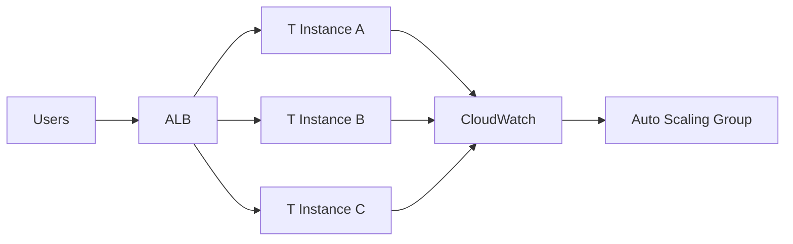
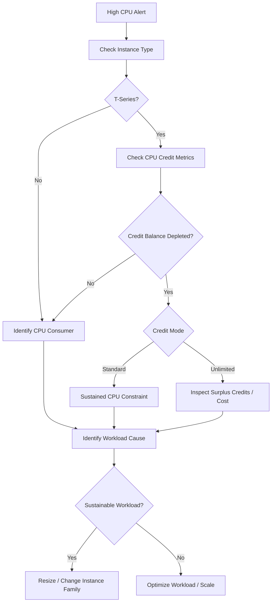

# 05- High CPU and T-Series Throttling

## Overview

High CPU utilization on EC2 does not always mean the instance is simply under-sized. For burstable T-series instances, sustained CPU usage interacts with a CPU credit system that can materially affect performance, cost, and scaling behavior.

The important distinction is:

```text
High CPU
   |
   +--> Fixed-performance instance
   |       |
   |       +--> Sustained CPU is generally expected
   |
   +--> Burstable T-series instance
           |
           +--> CPU credits available
           |       |
           |       +--> Burst above baseline
           |
           +--> Credits depleted
                   |
                   +--> Standard mode -> CPU constrained to baseline
                   |
                   +--> Unlimited mode -> continue bursting,
                                           potentially with additional charges
```

T-series instances are designed for workloads where average CPU utilization is relatively low but occasional bursts are required. They are not automatically the right choice for workloads that continuously consume high CPU.

Current AWS documentation identifies T2, T3, T3a, T4g, and newer T8i as burstable families. T3, T3a, T4g, and T8i use Unlimited mode by default in supported configurations, while T2 defaults to Standard mode. :contentReference[oaicite:0]{index=0}

A production investigation should therefore distinguish between:

- High CPU caused by legitimate workload demand
- CPU credits being consumed by bursts
- CPU credit depletion
- CPU throttling in Standard mode
- Sustained CPU usage in Unlimited mode
- Poor instance sizing
- Application-level CPU inefficiency
- Runaway processes
- Insufficient Auto Scaling capacity

---

## What T-Series Burstable Performance Means

A burstable instance has a defined CPU baseline and can temporarily use CPU above that baseline by spending CPU credits.

Conceptually:

```text
CPU Utilization
100% |             /\
     |            /  \
     |     /\    /    \
     |    /  \__/      \
     |--- Baseline ----------------
     |
     +--------------------------------> Time
```

When CPU utilization is below the baseline, the instance earns credits.

When utilization rises above the baseline, it spends credits.

```text
Below baseline
      |
      v
Earn CPU credits
      |
      v
Credit balance increases

Above baseline
      |
      v
Spend CPU credits
      |
      v
Credit balance decreases
```

This model allows a relatively inexpensive instance to handle short CPU bursts without requiring the capacity of a continuously high-CPU instance.

---

## CPU Baseline

The baseline represents the CPU utilization level at which credits are approximately earned and consumed at the same rate.

For example, AWS currently documents a `t3.large` as having:

```text
2 vCPUs
36 credits/hour
30% baseline utilization per vCPU
```

The baseline can be derived as:

```text
Credits earned per hour
----------------------- = baseline utilization
vCPUs × 60
```

For `t3.large`:

```text
36
--------
2 × 60

= 30%
```

The CloudWatch `CPUUtilization` metric is expressed as utilization across the instance's vCPUs. :contentReference[oaicite:1]{index=1}

---

## CPU Credits

One CPU credit represents:

```text
1 vCPU
running at
100% utilization
for
1 minute
```

Equivalent usage can be distributed differently.

For example:

```text
1 vCPU × 100% × 1 minute
```

is equivalent to:

```text
1 vCPU × 50% × 2 minutes
```

or:

```text
2 vCPUs × 25% × 2 minutes
```

AWS exposes CPU credit metrics through CloudWatch at five-minute intervals. :contentReference[oaicite:2]{index=2}

---

## Important CPU Credit Metrics

For burstable instances, monitor:

| Metric | Meaning |
|---|---|
| `CPUUtilization` | CPU utilization |
| `CPUCreditUsage` | Credits consumed |
| `CPUCreditBalance` | Accrued credits available for bursting |
| `CPUSurplusCreditBalance` | Surplus credits used by Unlimited instances |
| `CPUSurplusCreditsCharged` | Surplus credits that incur additional charges |

The surplus metrics apply to Unlimited configurations. :contentReference[oaicite:3]{index=3}

A useful operational relationship is:

```text
CPUUtilization
      +
CPUCreditUsage
      +
CPUCreditBalance
      +
CPUSurplusCreditBalance
      |
      v
Actual T-series behavior
```

Do not diagnose T-series performance from `CPUUtilization` alone.

---

## Standard Mode

In Standard mode, an instance can burst above its baseline while it has CPU credits.

Conceptually:

```text
CPU
 |
 |       Burst
 |      /\
 |     /  \
 |----/----\---------------- Baseline
 |
 +----------------------------> Time

Credits:
████████████
      ↓
████████
      ↓
████
      ↓
0
```

When the credit balance is depleted, sustained CPU demand above the baseline can no longer be maintained through accrued credits.

This can produce significant performance degradation for CPU-bound workloads.

Standard mode is therefore appropriate when:

- CPU bursts are short
- Average CPU usage remains near or below the baseline
- Predictable credit behavior is desired
- Sustained high CPU is not expected

---

## Unlimited Mode

Unlimited mode allows a burstable instance to continue using CPU above its baseline after its accrued credit balance reaches zero.

The model becomes:

```text
CPU demand
    |
    v
Accrued credits
    |
    | depleted
    v
Surplus credits
    |
    v
Continue bursting
```

When CPU utilization later falls below the baseline, earned credits can pay down surplus credits.

AWS describes Unlimited billing using a rolling 24-hour average or the instance lifetime if shorter. If average CPU utilization remains at or below the baseline, the instance does not incur additional CPU charges for its burst usage. Sustained utilization above the baseline can result in additional charges. :contentReference[oaicite:4]{index=4}

---

## Standard vs Unlimited

| Characteristic | Standard | Unlimited |
|---|---|---|
| Can burst above baseline | Yes | Yes |
| Uses accrued credits | Yes | Yes |
| Can continue after accrued credits reach zero | No | Yes |
| Surplus credits | No | Yes |
| Additional CPU charges possible | No | Yes |
| Suitable for short bursts | Yes | Yes |
| Suitable for sustained CPU | Usually not | Potentially, but compare instance sizing |
| Cost predictability | Higher | Requires monitoring surplus usage |

Unlimited does not mean unlimited free CPU.

It means the instance can sustain CPU bursting, with the possibility of additional charges when surplus usage is not paid down by subsequent credit accumulation. :contentReference[oaicite:5]{index=5}

---

## Current T-Series Behavior

AWS currently documents these important differences:

| Family | Default credit mode | Notes |
|---|---|---|
| T2 | Standard | Legacy generation; Standard uses launch credits |
| T3 | Unlimited | Dedicated Host configurations have restrictions |
| T3a | Unlimited | Supports Standard and Unlimited |
| T4g | Unlimited | Arm-based burstable family |
| T8i | Unlimited | Newer burstable generation |

The exact default can also be influenced by account-level credit configuration. T3, T3a, T4g, and T8i support Unlimited in normal supported configurations. :contentReference[oaicite:6]{index=6}

Always verify the current behavior for the specific instance family and tenancy rather than assuming all T-series instances behave identically.

---

## How CPU Credit Depletion Causes Performance Problems

Consider a T-series instance with:

```text
Baseline = 30%
CPU demand = 80%
```

The instance can temporarily sustain the higher utilization by consuming credits.

If this continues:

```text
80% CPU
   |
   v
Credits consumed
   |
   v
Credit balance declines
   |
   v
Credit balance reaches zero
   |
   v
Standard mode -> cannot sustain the burst
```

The resulting symptom may appear as:

- Increased API latency
- Reduced request throughput
- Celery tasks taking longer
- Nginx upstream delays
- Background jobs accumulating
- Health checks failing
- Load balancer targets becoming unhealthy

The root cause is not necessarily an application deadlock or network problem.

---

## CPU Throttling vs High CPU

These are related but different conditions.

### High CPU

```text
CPUUtilization = 95%
```

means the instance is actively using a large amount of CPU.

It does not automatically mean throttling is occurring.

### T-Series Credit Constraint

```text
CPUUtilization high
+
CPUCreditBalance depleted
+
Standard mode
```

indicates that the workload is demanding sustained CPU beyond the instance's baseline capacity.

A correct diagnosis therefore requires multiple metrics.

---

## Detecting T-Series CPU Problems

Start with:

```text
CPUUtilization
CPUCreditBalance
CPUCreditUsage
Credit mode
```

For Unlimited instances also inspect:

```text
CPUSurplusCreditBalance
CPUSurplusCreditsCharged
```

The diagnostic pattern matters more than any single metric.

Example:

```text
CPUUtilization
      |
      | 80%
      v

CPUCreditBalance
      |
      | declining
      v

CPUCreditBalance = 0
      |
      v

CPUSurplusCreditBalance increasing
```

This indicates sustained above-baseline CPU usage on an Unlimited instance.

---

## AWS CLI Inspection

Retrieve the instance type:

```bash
aws ec2 describe-instances \
  --instance-ids i-0123456789abcdef0 \
  --query 'Reservations[].Instances[].{Instance:InstanceId,Type:InstanceType,State:State.Name}' \
  --output table
```

Check the credit specification:

```bash
aws ec2 describe-instance-credit-specifications \
  --instance-ids i-0123456789abcdef0 \
  --query 'InstanceCreditSpecifications[].{Instance:InstanceId,CpuCredits:CpuCredits}' \
  --output table
```

Possible output:

```text
--------------------------------
| CpuCredits | Instance        |
+------------+-----------------+
| unlimited  | i-0123456789... |
+------------+-----------------+
```

The AWS CLI supports changing the credit specification after launch for supported burstable instances. :contentReference[oaicite:7]{index=7}

---

## Inspect CloudWatch CPU Credit Metrics

Use the AWS CLI to query metrics where appropriate:

```bash
aws cloudwatch get-metric-statistics \
  --namespace AWS/EC2 \
  --metric-name CPUCreditBalance \
  --dimensions Name=InstanceId,Value=i-0123456789abcdef0 \
  --start-time "$(date -u -d '1 hour ago' +%Y-%m-%dT%H:%M:%SZ)" \
  --end-time "$(date -u +%Y-%m-%dT%H:%M:%SZ)" \
  --period 300 \
  --statistics Average \
  --region ap-south-1
```

For `CPUCreditUsage`:

```bash
aws cloudwatch get-metric-statistics \
  --namespace AWS/EC2 \
  --metric-name CPUCreditUsage \
  --dimensions Name=InstanceId,Value=i-0123456789abcdef0 \
  --start-time "$(date -u -d '1 hour ago' +%Y-%m-%dT%H:%M:%SZ)" \
  --end-time "$(date -u +%Y-%m-%dT%H:%M:%SZ)" \
  --period 300 \
  --statistics Sum \
  --region ap-south-1
```

CPU credit metrics are published at five-minute frequency. AWS recommends using `Sum` for periods greater than five minutes when calculating credit usage. :contentReference[oaicite:8]{index=8}

---

## Linux-Level CPU Investigation

AWS metrics tell you that CPU is high.

The operating system helps explain why.

Start with:

```bash
top
```

or:

```bash
htop
```

Inspect CPU statistics:

```bash
mpstat -P ALL 1 5
```

Inspect process-level CPU:

```bash
ps -eo pid,ppid,cmd,%cpu,%mem --sort=-%cpu | head -n 15
```

Look for:

- Python workers
- Gunicorn workers
- Celery workers
- PostgreSQL clients
- Java processes
- Docker containers
- Compression/encryption workloads
- Runaway processes

---

## Python Backend CPU Investigation

For Django or FastAPI, high CPU can come from:

- CPU-heavy serialization
- Large JSON processing
- Expensive regex operations
- Image processing
- Compression
- Cryptographic work
- Inefficient Python loops
- Excessive data transformation
- Serialization of very large objects
- Accidental infinite loops

Example:

```text
HTTP request
    |
    v
FastAPI
    |
    v
CPU-heavy Python processing
    |
    v
Worker consumes CPU
    |
    v
T-series credits decline
```

If the operation is genuinely CPU-bound, adding more asynchronous I/O concurrency will not solve the underlying CPU requirement.

---

## Gunicorn and Django

Suppose a Django deployment uses:

```text
Gunicorn
  |
  +-- worker 1
  +-- worker 2
  +-- worker 3
  +-- worker 4
```

Increasing workers can increase CPU consumption.

A common mistake is assuming:

```text
More workers = more performance
```

For a small T-series instance:

```text
More workers
    |
    v
More runnable processes
    |
    v
Higher CPU
    |
    v
Faster credit depletion
```

Worker count should be based on measured CPU, memory, workload characteristics, and latency requirements.

---

## Celery and CPU Saturation

Celery workers can produce sustained CPU load.

Example:

```text
API
 |
 v
Redis / Broker
 |
 v
Celery Workers
 |
 v
CPU-intensive task
```

If the tasks are CPU-bound:

```text
High concurrency
    |
    v
CPU saturation
    |
    v
T-series credits depleted
```

For CPU-heavy workloads, consider:

- Worker concurrency
- Dedicated worker instance types
- Queue separation
- Horizontal scaling
- Workload batching
- Task optimization

Do not use a burstable instance for sustained CPU-heavy background processing simply because it is cheaper at low utilization.

---

## Docker and CPU

When applications run in Docker, identify whether the CPU is consumed by:

```text
Host
 |
 +-- Container A
 +-- Container B
 +-- Container C
```

Inspect:

```bash
docker stats
```

For a specific container:

```bash
docker stats <container>
```

This helps distinguish:

```text
EC2-wide CPU problem
```

from:

```text
One runaway container
```

CPU limits and reservations should be designed intentionally when running multiple workloads on one instance.

---

## Kubernetes on T-Series Instances

Kubernetes adds another scheduling layer:

```text
EC2
 |
 v
kubelet
 |
 v
Pods
 |
 +-- API
 +-- Worker
 +-- Sidecar
```

High node CPU can cause:

- Pod scheduling pressure
- Increased latency
- CPU throttling at container level
- Eviction pressure for other resources
- Poor application responsiveness

Distinguish:

```text
EC2 CPU saturation
```

from:

```text
Container CPU limit throttling
```

These are different problems.

---

## CPU Limits vs T-Series Credits

A Kubernetes or container CPU limit can throttle a container even when the EC2 host has available CPU.

Conversely, the EC2 host itself can become constrained by the T-series credit model.

Therefore:

```text
Container CPU limit
        |
        v
Container-level throttling

EC2 CPU credit exhaustion
        |
        v
Instance-level performance constraint
```

Inspect both layers.

---

## CPU Steal and Virtualization

When investigating CPU behavior at the operating-system level, CPU steal time can provide useful information.

For Linux:

```bash
mpstat -P ALL 1 5
```

Look at:

```text
%steal
```

High steal time means the guest is waiting for CPU resources from the virtualization environment.

Do not automatically attribute high `%steal` to T-series credit exhaustion; correlate it with EC2 CPU credit metrics and CloudWatch data.

---

## Load Average vs CPU Utilization

Linux load average is not the same as CPU utilization.

Inspect:

```bash
uptime
```

Example:

```text
load average: 8.20, 7.95, 7.80
```

On a small instance, a high load average can indicate substantial contention.

Investigate:

```text
CPU utilization
CPU steal
I/O wait
Runnable processes
CPU credit state
```

A high load average can be caused by CPU or certain forms of I/O contention.

---

## CPU vs I/O Wait

High application latency does not always mean CPU saturation.

Inspect:

```bash
vmstat 1 5
```

or:

```bash
iostat -xz 1 5
```

A workload may appear slow because it is waiting on:

- EBS
- PostgreSQL
- Redis
- Network I/O
- External APIs

Do not scale CPU blindly based only on request latency.

---

## Identify the Workload Pattern

Before changing instance types, classify the workload.

| Pattern | Typical Interpretation |
|---|---|
| Short CPU spikes | T-series may fit |
| Low average CPU, occasional bursts | T-series often appropriate |
| Continuous 60–90% CPU | Consider fixed-performance capacity |
| CPU-heavy Celery workloads | Often better on dedicated worker capacity |
| CPU-heavy batch processing | Consider compute-optimized instances |
| Memory-bound workload | CPU scaling may not help |
| I/O-bound workload | Investigate storage/network/database |
| Highly variable traffic | T-series or horizontal scaling may fit |

The correct instance type depends on workload characteristics, not simply peak CPU.

---

## When T-Series Is a Good Fit

T-series is generally appropriate when:

- CPU demand is variable.
- Average CPU utilization is relatively low.
- Bursts are temporary.
- The application is lightweight.
- Workload can tolerate occasional CPU constraints in Standard mode.
- Unlimited-mode economics are acceptable for the workload.

Typical examples include:

- Small APIs
- Development environments
- Low-volume web applications
- Lightweight services
- Administrative applications
- Small automation services

---

## When T-Series Is a Poor Fit

Consider another instance family when:

- CPU remains high for long periods.
- CPU credit balance repeatedly approaches zero.
- Surplus credits remain high.
- Additional Unlimited charges become persistent.
- CPU performance is latency-critical.
- Workload is consistently CPU-bound.
- Batch processing continuously consumes CPU.
- Scaling is required for predictable throughput.

A useful signal is:

```text
CPU consistently high
+
Credit balance consistently low
+
Sustained workload
```

This is usually a capacity-sizing problem rather than a temporary burst.

---

## T-Series and Auto Scaling

T-series instances can work well in horizontally scaled architectures.



Instead of allowing one T-series instance to sustain high CPU indefinitely:

```text
Traffic
   |
   v
Horizontal scaling
   |
   +--> Instance A
   +--> Instance B
   +--> Instance C
```

This can distribute CPU demand.

However, scaling policies should use appropriate metrics and cooldown/warm-up behavior.

---

## Scaling on CPU Alone

A common Auto Scaling policy is:

```text
Average CPU > 60%
    |
    v
Scale out
```

This may work for CPU-bound APIs but can be misleading for T-series instances.

A T-series instance can have:

```text
CPU = 80%
CPUCreditBalance = 0
```

or:

```text
CPU = 50%
CPUCreditBalance = rapidly declining
```

Therefore, CPU credit metrics can provide important additional context.

Use multiple signals where the workload requires it.

---

## High CPU Troubleshooting Flow



---

## Production Investigation Procedure

### Verify Instance Type

```bash
aws ec2 describe-instances \
  --instance-ids i-0123456789abcdef0 \
  --query 'Reservations[].Instances[].{ID:InstanceId,Type:InstanceType}' \
  --output table
```

### Check CPU

Inspect:

```text
CPUUtilization
```

over a useful time window rather than a single point.

### Check Credit Balance

Inspect:

```text
CPUCreditBalance
```

Look for:

```text
Stable
Declining
Near zero
Repeatedly zero
```

### Check Credit Usage

Inspect:

```text
CPUCreditUsage
```

Determine whether the instance is consistently spending more credits than it earns.

### Check Unlimited Metrics

For Unlimited instances:

```text
CPUSurplusCreditBalance
CPUSurplusCreditsCharged
```

### Identify CPU Consumer

Use:

```bash
top
```

```bash
ps -eo pid,cmd,%cpu --sort=-%cpu | head
```

### Determine Workload Type

Ask:

```text
Is this a temporary burst?
Is this sustained?
Is it expected?
Is it caused by a recent deployment?
Is it caused by traffic growth?
Is one process responsible?
```

### Choose Remediation

Possible actions:

```text
Optimize
Scale horizontally
Reduce worker concurrency
Resize instance
Change instance family
Move CPU-heavy workloads
```

---

## Application-Level Investigation

High CPU can originate from a code change.

A deployment timeline can be extremely useful:

```text
Deployment
    |
    v
CPU increases
    |
    v
Latency increases
    |
    v
Credit balance declines
```

Potential causes include:

- New inefficient algorithm
- N+1 processing
- Excessive serialization
- Large response payloads
- Unbounded loops
- Expensive regex
- Increased logging
- Encryption/compression workload
- New background jobs

Correlate:

```text
Deployment
+
Traffic
+
CPU
+
Latency
+
Error rate
```

before concluding that the instance is too small.

---

## Profiling Python CPU Usage

For a CPU-bound Python service, application profiling can identify the actual hotspot.

A production-safe workflow is usually:

```text
Metrics
   |
   v
Identify abnormal endpoint/process
   |
   v
Reproduce safely
   |
   v
Profile
   |
   v
Optimize
   |
   v
Load test
   |
   v
Deploy gradually
```

Useful tools include:

```bash
python -m cProfile -o profile.out app.py
```

For running production workloads, prefer controlled profiling approaches rather than indiscriminately attaching expensive profilers to every process.

---

## Database-Driven CPU Usage

An API can consume CPU because it is processing too much database data.

Example:

```text
PostgreSQL
    |
    v
Large result set
    |
    v
Django ORM
    |
    v
Python serialization
    |
    v
High CPU
```

Possible improvements:

- Reduce selected columns
- Add appropriate filtering
- Paginate
- Use database-side aggregation
- Avoid unnecessary object materialization
- Optimize serializers
- Add indexes where appropriate

The correct fix may be in PostgreSQL or application code rather than EC2.

---

## High CPU From Background Jobs

A common backend architecture is:

```text
HTTP API
 |
 v
Redis / Kafka
 |
 v
Celery
 |
 v
CPU-intensive task
```

If API and workers share the same T-series instance:

```text
Celery workload
      |
      v
CPU saturation
      |
      v
API latency increases
```

Separate workloads when their resource profiles differ significantly.

For example:

```text
API ASG
  |
  +-- General-purpose instances

Worker ASG
  |
  +-- Compute-oriented instances
```

This prevents background processing from consuming the API's CPU budget.

---

## Monitoring and Alerting

Useful alarms include:

```text
High CPUUtilization
Low CPUCreditBalance
High CPUCreditUsage
High CPUSurplusCreditBalance
Non-zero CPUSurplusCreditsCharged
High request latency
High error rate
```

Do not alarm on every short-lived CPU spike.

For T-series instances, the combination is more useful:

```text
High CPU
+
Declining CPUCreditBalance
+
Increasing latency
```

This is stronger evidence of a capacity problem than high CPU alone.

---

## Cost Considerations

Unlimited mode changes the cost model.

A T-series instance may appear inexpensive while sustained CPU consumption creates additional charges.

Monitor:

```text
CPUUtilization
CPUCreditBalance
CPUSurplusCreditBalance
CPUSurplusCreditsCharged
```

The key question is:

```text
Is Unlimited mode cheaper than using a larger
or different instance type for this workload?
```

This should be answered using measured workload data rather than assumptions.

---

## Unlimited Mode Cost Pattern

Consider:

```text
Low average CPU
+
Short bursts
+
Credits recover
```

Unlimited may operate without additional CPU charges because burst usage is effectively paid down by subsequent credit accumulation.

Compare with:

```text
High sustained CPU
+
Credits continuously depleted
+
Surplus credits continuously increase
```

This indicates a workload that may be better suited to a different capacity model.

AWS explicitly documents additional charges when surplus credits are not paid down and exceed the relevant credit allowance. :contentReference[oaicite:9]{index=9}

---

## Security Considerations

CPU incidents can also have security implications.

Unexpected CPU growth can result from:

- Compromised workloads
- Unauthorized cryptocurrency mining
- Malicious processes
- Unexpected containers
- Runaway scripts

When CPU increases unexpectedly, inspect:

```bash
ps aux --sort=-%cpu | head -n 20
```

and:

```bash
docker stats
```

where Docker is used.

Also review:

- Recent deployments
- IAM activity
- SSH access
- Systems Manager sessions
- Running processes
- Container images
- Network connections

Do not assume every unexpected CPU spike is a capacity problem.

---

## High Availability

Avoid allowing one burstable instance to become a single point of failure.

Prefer:

```text
                ALB
                 |
       +---------+---------+
       |         |         |
      EC2       EC2       EC2
       |         |         |
      AZ-A      AZ-B      AZ-C
```

With Auto Scaling:

```text
CPU pressure
     |
     v
Scale out
     |
     v
Distribute workload
```

This reduces the likelihood that one depleted instance becomes a service-wide bottleneck.

---

## Disaster Recovery

CPU credit state should not be treated as durable application state.

For T-series instances, credit behavior after stopping differs by generation. AWS currently documents that T2 accrued credits are lost when the instance stops, while T3, T3a, T4g, and T8i accrued credits can persist for seven days after stopping. :contentReference[oaicite:10]{index=10}

Do not design recovery procedures around preserving CPU credits.

Instead:

```text
Infrastructure
    |
    v
Recreate instance
    |
    v
Bootstrap from AMI / automation
    |
    v
Restore application state
    |
    v
Return to service
```

Application data should remain externalized into appropriate durable services.

---

## Common Mistakes

### Looking Only at CPUUtilization

This misses the T-series credit state.

Always correlate:

```text
CPUUtilization
CPUCreditBalance
CPUCreditUsage
Credit mode
```

---

### Assuming 80% CPU Means Immediate Failure

A T-series instance can legitimately burst above its baseline.

The important question is whether the workload is:

```text
temporary
```

or:

```text
sustained
```

---

### Treating Unlimited as Free Unlimited CPU

Unlimited allows continued bursting, but sustained above-baseline utilization can produce additional charges. :contentReference[oaicite:11]{index=11}

---

### Running CPU-Heavy Workers on the Same Small T Instance

Celery or batch workloads can consume the CPU needed by the API.

Separate resource-intensive workloads when appropriate.

---

### Increasing Worker Count Without Measuring CPU

More workers can increase concurrency and throughput for some workloads but can also saturate CPU faster.

Tune based on:

```text
CPU
Memory
Latency
Throughput
Queue depth
Workload characteristics
```

---

### Scaling Vertically Without Finding the CPU Consumer

A larger instance may hide an inefficient algorithm or runaway process.

Identify the CPU consumer first.

---

### Ignoring Recent Deployments

A sudden CPU increase immediately after deployment is a strong diagnostic signal.

Correlate deployment events with:

```text
CPU
Latency
Errors
Credit usage
```

---

### Using T-Series for Permanently CPU-Bound Workloads

If CPU is consistently high, a fixed-performance or compute-oriented instance may provide more predictable economics and performance.

---

## Production Decision Matrix

| Observation | Likely Interpretation | Action |
|---|---|---|
| High CPU, credits healthy | Temporary burst | Monitor |
| High CPU, credits declining | Sustained burst | Investigate workload |
| Credits near zero, Standard | Baseline constraint approaching | Optimize/scale |
| Credits zero, Standard | Sustained CPU exceeds baseline | Resize/scale |
| Credits zero, Unlimited | Surplus CPU usage | Monitor cost and workload |
| Surplus credits continuously increasing | Sustained above-baseline CPU | Compare instance options |
| One process consumes CPU | Application/process issue | Profile/fix |
| Celery consumes CPU | Background workload | Separate/tune workers |
| CPU spikes after deployment | Regression possible | Compare release |
| CPU high across fleet | Traffic/workload growth | Scale architecture |
| CPU high but load average low | Investigate workload characteristics | Profile |
| High load with I/O wait | Storage/I/O issue possible | Investigate I/O |

---

## Production Best Practices

### Use T-Series for the Right Workload

Use burstable instances where CPU demand is variable rather than continuously high.

### Monitor Credit State

CPU credit metrics should be part of operational dashboards for T-series fleets.

### Treat Unlimited as a Cost-Controlled Feature

Unlimited can protect performance during bursts, but sustained usage must be monitored for additional charges.

### Separate Resource Profiles

Do not automatically colocate:

```text
API
+
Celery
+
Kafka
+
Batch processing
```

on one small burstable instance.

### Scale Horizontally

For stateless Django/FastAPI services, prefer multiple instances behind an ALB rather than relying on one heavily utilized instance.

### Load Test Before Choosing the Instance Type

Measure:

```text
Requests/sec
CPU
Latency
Credit consumption
Memory
Database load
```

under realistic traffic.

### Use Infrastructure as Code

Keep instance type, credit configuration, scaling policy, and launch configuration reproducible.

### Review Cost and Performance Together

A cheaper instance with persistent Unlimited charges may not be the most economical architecture.

---

## Incident Response Checklist

```text
[ ] Identify affected instance(s)
[ ] Identify instance family and size
[ ] Check CPUUtilization
[ ] Check CPUCreditBalance
[ ] Check CPUCreditUsage
[ ] Check credit mode
[ ] Check surplus credit metrics
[ ] Identify CPU-consuming process
[ ] Check recent deployments
[ ] Check traffic increase
[ ] Check Celery/background workload
[ ] Check Docker/container usage
[ ] Check CPU steal and I/O wait
[ ] Check memory pressure
[ ] Check application latency
[ ] Check ALB target health
[ ] Determine burst vs sustained workload
[ ] Determine application vs infrastructure cause
[ ] Evaluate horizontal scaling
[ ] Evaluate vertical resizing
[ ] Evaluate instance-family change
[ ] Evaluate Unlimited-mode cost
[ ] Validate recovery
[ ] Add monitoring or capacity changes if required
```

---

## Practical Diagnosis Example

Suppose a FastAPI service runs on:

```text
t3.micro
```

Metrics show:

```text
CPUUtilization = 95%
CPUCreditBalance = 0
```

The service is configured as:

```text
Standard
```

Application latency has increased.

The diagnosis is:

```text
High CPU
    |
    v
CPU credits consumed
    |
    v
Credit balance = 0
    |
    v
Standard mode
    |
    v
Sustained workload exceeds baseline
```

Possible remediation:

```text
Short-lived traffic spike
    -> Scale out

Expected sustained workload
    -> Resize / change instance family

Application regression
    -> Profile and optimize

CPU-heavy background tasks
    -> Separate worker capacity
```

Do not simply reboot the instance. Rebooting does not fix a workload that continuously requires more CPU than the instance is designed to provide.

---

## Practical Unlimited Mode Example

Suppose a T3 instance runs:

```text
Baseline = 30%
Average CPU = 40%
```

The instance can use Unlimited mode to sustain the workload.

AWS's Unlimited model allows the instance to continue bursting and uses surplus credits when accrued credits are exhausted. If the average CPU usage remains above baseline for long enough that surplus credits cannot be paid down, additional charges can occur. :contentReference[oaicite:12]{index=12}

The engineering question is therefore not:

```text
"Can the instance run at 40%?"
```

It can.

The more important question is:

```text
"Is this workload's long-term CPU profile
economically and operationally appropriate for this instance?"
```

---

## Interview Considerations

### What are CPU credits?

CPU credits represent accumulated burst capacity for EC2 burstable performance instances. An instance earns credits below its baseline and spends them when bursting above the baseline.

### What happens when CPU credits are depleted?

In Standard mode, the instance cannot continue sustaining CPU above its baseline using accrued credits. In Unlimited mode, it can continue bursting using surplus credits, subject to the Unlimited billing model. :contentReference[oaicite:13]{index=13}

### How do you identify T-series throttling?

Correlate:

```text
High CPU
+
Declining/zero CPUCreditBalance
+
Credit mode
```

For Unlimited instances, also inspect surplus credit metrics.

### Is 100% CPU always a problem on a T-series instance?

No. T-series instances are specifically designed to burst above baseline. A short CPU spike may be completely normal if credits are available.

### When should you stop using a T-series instance?

Consider changing instance capacity when CPU remains high for sustained periods, credit balance repeatedly reaches zero, Unlimited surplus usage becomes persistent, or predictable CPU performance is required.

### Does Unlimited mean unlimited free performance?

No. Unlimited allows sustained bursting, but prolonged above-baseline usage can result in additional charges. :contentReference[oaicite:14]{index=14}

### What is the difference between CPU throttling and application CPU inefficiency?

CPU throttling is a capacity/credit constraint. Application CPU inefficiency means the workload itself is consuming excessive CPU. Both can occur simultaneously and should be investigated separately.

### How would you troubleshoot high CPU on a Django server?

Check:

```text
EC2 instance type
CPUUtilization
CPUCreditBalance
CPUCreditUsage
process-level CPU
Gunicorn workers
Celery workers
recent deployments
database workload
traffic
application latency
```

Then determine whether to optimize, scale horizontally, resize, or change the instance family.

## Key Takeaways

- **T-series instances use CPU credits to provide burst capacity above a defined CPU baseline; high CPU alone does not prove throttling.**
- **Diagnose burstable-instance problems using `CPUUtilization`, `CPUCreditUsage`, `CPUCreditBalance`, credit mode, and Unlimited surplus-credit metrics together.**
- **Standard mode constrains sustained above-baseline CPU after accrued credits are depleted, while Unlimited mode allows continued bursting but can introduce additional charges.**
- **Sustained high CPU, repeatedly depleted credits, or persistent surplus usage usually indicates a workload-sizing problem rather than a temporary CPU spike.**
- **For production APIs and workers, correlate CPU behavior with application processes, Celery workloads, traffic, latency, deployments, and scaling metrics before changing instance types.**