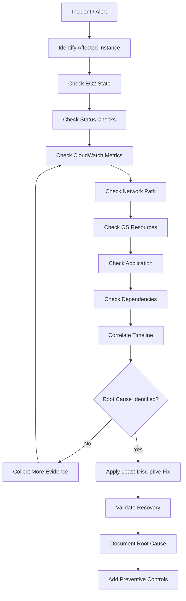
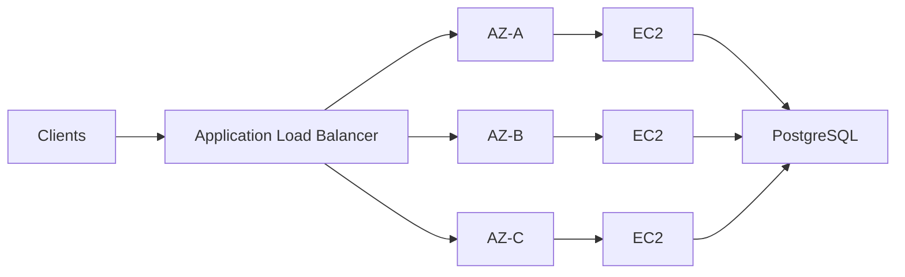

# README.md

## Overview

This folder contains production-oriented troubleshooting guidance for diagnosing and resolving common AWS EC2 failures.

The focus is on moving from **symptom identification** to **evidence-based root-cause analysis** across the EC2 instance, operating system, application, networking, storage, and AWS control-plane layers.

Typical incidents covered here include:

- Connectivity failures
- Connection timeouts and refusals
- EC2 status-check failures
- CPU saturation and T-series credit exhaustion
- Application-level availability problems
- Resource exhaustion
- Misconfiguration and deployment-related failures

The troubleshooting approach should generally follow:

```text
Symptom
   |
   v
Identify affected resource
   |
   v
Collect AWS-level evidence
   |
   v
Collect OS-level evidence
   |
   v
Collect application-level evidence
   |
   v
Correlate metrics, logs, and events
   |
   v
Identify root cause
   |
   v
Apply least-disruptive remediation
   |
   v
Validate recovery
   |
   v
Prevent recurrence
```

---

## Navigation

| # | File | Description |
|---|---|---|
| 01 | [01- Troubleshooting Methodology](./01-%20Troubleshooting%20Methodology.md) | Systematic EC2 troubleshooting approach, diagnostic layers, and evidence-based root-cause analysis |
| 02 | [02- Connection Refused](./02-%20Connection%20Refused.md) | Diagnosing and resolving EC2 connection refused errors |
| 03 | [03- Connection Timeout](./03-%20Connection%20Timeout.md) | Diagnosing and resolving EC2 connection timeout failures |
| 04 | [04- Instance Health Check Failures](./04-%20Instance%20Health%20Check%20Failures.md) | EC2 status check failures, impaired instances, and recovery procedures |
| 05 | [05- High CPU and T-Series Throttling](./05-%20High%20CPU%20and%20T-Series%20Throttling.md) | CPU saturation, T-series burst credit exhaustion, and performance recovery |

## Troubleshooting Principles

### Start With the Symptom

Do not immediately reboot, resize, or terminate an instance.

First establish:

- What is failing?
- Which instance or resource is affected?
- When did the failure begin?
- Is the failure intermittent or continuous?
- Did anything change immediately before the incident?
- Is the problem isolated to one instance or affecting the fleet?

### Separate Infrastructure From Application Failures

An EC2 instance can be healthy while its application is unavailable.

For example:

```text
EC2 system status
      |
      v
Healthy

EC2 instance status
      |
      v
Healthy

Application
      |
      v
FastAPI process crashed
```

Conversely, an application may be healthy while the underlying EC2 instance is impaired.

Always distinguish:

```text
AWS infrastructure
        |
        v
EC2 instance / OS
        |
        v
Network / Storage
        |
        v
Application
        |
        v
External dependencies
```

### Use Evidence Before Remediation

Prefer:

```text
Observe -> Diagnose -> Remediate -> Validate
```

over:

```text
Failure -> Reboot -> Failure -> Terminate
```

Repeated disruptive actions can destroy evidence and make the original failure harder to diagnose.

---

## Troubleshooting Layers

| Layer | Typical Questions | Useful Evidence |
|---|---|---|
| AWS control plane | Is the resource configured correctly? | EC2 APIs, events, metadata |
| EC2 infrastructure | Is AWS infrastructure healthy? | System status checks |
| Instance / OS | Is the operating system responsive? | Logs, processes, memory, CPU |
| Networking | Can traffic reach the service? | SGs, NACLs, routes, DNS |
| Storage | Is the instance waiting on storage? | EBS metrics, `iostat`, filesystem |
| Application | Is the service running correctly? | Logs, health endpoints, traces |
| Load balancer | Is the target considered healthy? | Target health, listener configuration |
| Dependencies | Are databases or external APIs available? | PostgreSQL, Redis, Kafka, API metrics |

---

## Troubleshooting Documents

| File | Focus |
|---|---|
| [01- Troubleshooting Methodology.md](./01-%20Troubleshooting%20Methodology.md) | Systematic EC2 troubleshooting methodology, evidence collection, hypothesis-driven diagnosis, and safe remediation |
| [02- Connection Refused.md](./02-%20Connection%20Refused.md) | Diagnosing TCP connection refusals, services that are not listening, incorrect ports, host firewalls, and application binding issues |
| [03- Connection Timeout.md](./03-%20Connection%20Timeout.md) | Diagnosing network timeouts involving routes, security groups, NACLs, firewalls, load balancers, NAT, and return paths |
| [04- Instance Health Check Failures.md](./04-%20Instance%20Health%20Check%20Failures.md) | EC2 system and instance status-check failures, scheduled events, impaired instances, recovery, and Auto Scaling behavior |
| [05- High CPU and T-Series Throttling.md](./05-%20High%20CPU%20and%20T-Series%20Throttling.md) | High CPU utilization, CPU credit depletion, T-series bursting, Unlimited mode, throttling, and capacity diagnosis |

---

## Troubleshooting Workflow

A practical production workflow is:



---

## First Response Checklist

When an EC2-backed service fails, start with:

```text
[ ] Identify affected instance(s)
[ ] Identify affected Availability Zone
[ ] Check EC2 instance state
[ ] Check system status checks
[ ] Check instance status checks
[ ] Check scheduled events
[ ] Check CloudWatch alarms
[ ] Check CPU and memory pressure
[ ] Check disk and filesystem capacity
[ ] Check network connectivity
[ ] Check Security Groups
[ ] Check NACLs and routing where relevant
[ ] Check listening ports
[ ] Check application processes
[ ] Check application logs
[ ] Check load balancer target health
[ ] Check PostgreSQL / Redis / Kafka dependencies
[ ] Check recent deployments and configuration changes
[ ] Establish incident timeline
[ ] Apply remediation
[ ] Validate recovery
```

---

## Common Diagnostic Commands

### Inspect an Instance

```bash
aws ec2 describe-instances \
  --instance-ids i-0123456789abcdef0 \
  --query 'Reservations[].Instances[].{
    InstanceId:InstanceId,
    State:State.Name,
    Type:InstanceType,
    AZ:Placement.AvailabilityZone,
    PrivateIP:PrivateIpAddress,
    PublicIP:PublicIpAddress
  }' \
  --output table
```

### Check EC2 Status

```bash
aws ec2 describe-instance-status \
  --instance-ids i-0123456789abcdef0 \
  --include-all-instances \
  --output table
```

### Check Listening Ports

```bash
ss -lntp
```

### Check Processes

```bash
ps -eo pid,ppid,cmd,%cpu,%mem --sort=-%cpu | head -n 20
```

### Check CPU

```bash
top
```

### Check Memory

```bash
free -h
```

### Check Filesystems

```bash
df -h
```

### Check Network Connectivity

```bash
nc -vz <host> <port>
```

### Check HTTP

```bash
curl -v http://127.0.0.1:8000/health
```

---

## AWS-Level vs OS-Level vs Application-Level Diagnosis

A useful troubleshooting distinction is:

| Observation | Possible Layer |
|---|---|
| Instance is stopped | EC2 lifecycle |
| System status check failed | AWS infrastructure |
| Instance status check failed | OS / instance |
| Port refuses connection | Application / OS |
| Connection times out | Network path |
| High CPU | OS / application / workload |
| High CPU with depleted T-series credits | EC2 capacity model |
| Disk full | OS / storage |
| ALB target unhealthy | Application / network / health-check configuration |
| HTTP 500 | Application |
| PostgreSQL connection timeout | Network / database / connection pool |
| Redis unavailable | Network / Redis / application |
| Celery queue growing | Worker capacity / application |
| Kafka consumer lag increasing | Consumer capacity / Kafka / downstream processing |

A single symptom can have multiple possible causes. Use layered evidence rather than assuming the first plausible explanation is correct.

---

## Production Troubleshooting Strategy

### Isolate the Failure Domain

Determine whether the issue affects:

```text
One process
    |
One instance
    |
One Availability Zone
    |
One service
    |
Entire fleet
    |
Multiple AWS services
```

The scope often provides an important clue.

### Compare Healthy and Unhealthy Instances

When an Auto Scaling Group contains both healthy and unhealthy instances, compare:

- Instance type
- AMI
- Launch Template version
- Security Groups
- Subnet
- Availability Zone
- User Data
- Application version
- Environment configuration
- CloudWatch metrics

This can reveal configuration drift or deployment problems.

### Correlate Timelines

Build a timeline around:

```text
Deployment
Configuration change
Traffic increase
Scaling event
AWS event
Metric anomaly
Application error
Incident
```

Temporal correlation is often more useful than examining individual logs in isolation.

---

## Common Backend Scenarios

### Django / FastAPI

A service may be unreachable because:

```text
EC2
 |
 v
Nginx
 |
 v
Gunicorn / Uvicorn
 |
 v
Django / FastAPI
```

Failure at any layer can produce an apparently similar user-facing symptom.

### PostgreSQL

Investigate:

```text
Application
    |
    v
Connection pool
    |
    v
Network
    |
    v
Security Group
    |
    v
PostgreSQL
```

A database timeout should not automatically be treated as an EC2 networking problem.

### Redis

For Redis-backed applications:

```text
Django / FastAPI
      |
      v
Redis
```

Check:

- DNS
- Route
- Security Group
- Port `6379`
- Redis availability
- Connection pool
- Application timeout configuration

### Celery

For asynchronous workloads:

```text
API
 |
 v
Broker
 |
 v
Celery Worker
 |
 v
Task
```

Investigate both API health and worker capacity.

### Kafka

For Kafka consumers:

```text
Kafka
 |
 v
Consumer
 |
 v
Processing
 |
 v
Database / downstream service
```

A growing consumer lag may indicate CPU, network, database, or application processing bottlenecks.

---

## Safe Remediation Principles

Prefer remediation in this order when appropriate:

```text
1. Correct configuration
2. Restart failed application component
3. Replace unhealthy stateless instance
4. Scale horizontally
5. Resize infrastructure
6. Perform disruptive instance recovery
```

The exact order depends on the incident.

For stateful systems, preserve data and evidence before destructive actions.

Avoid:

```bash
aws ec2 terminate-instances ...
```

until you have confirmed that termination is safe and expected.

---

## High Availability Considerations

EC2 troubleshooting should not be limited to restoring one machine.

Production architectures should reduce dependence on individual instances:



Useful practices include:

- Multi-AZ deployment
- Auto Scaling Groups
- Load balancers
- Stateless application instances
- Externalized session state
- Durable database storage
- Automated instance replacement
- Centralized logging
- CloudWatch alarms
- Infrastructure as Code

The goal is not merely to troubleshoot failures but to reduce their blast radius.

---

## Monitoring Requirements

A production EC2 environment should provide visibility into:

### Instance Health

- EC2 state
- System status checks
- Instance status checks
- Scheduled events

### Resource Utilization

- CPU
- CPU credit metrics for T-series
- Memory where agent-based monitoring is configured
- Network traffic
- Disk utilization
- Filesystem capacity

### Application Health

- Request rate
- Latency
- Error rate
- Health-check status
- Process availability
- Worker utilization

### Dependency Health

- Database latency
- Database connections
- Redis availability
- Kafka consumer lag
- External API failures

A useful operational model is:

```text
Metrics
   +
Logs
   +
Traces
   +
AWS Events
   +
Deployment History
        |
        v
Incident Diagnosis
```

---

## Common Troubleshooting Mistakes

### Rebooting Before Collecting Evidence

A reboot can temporarily restore service while destroying useful evidence about the original state.

### Assuming EC2 Is the Root Cause

An EC2 instance can be healthy while Django, FastAPI, PostgreSQL, Redis, or another dependency is failing.

### Checking Only Security Groups

Connectivity can also depend on:

```text
DNS
Route tables
NACLs
Host firewall
Application binding
Load balancer
NAT
Peering / Transit Gateway
```

### Looking at Only Current Metrics

A current CPU value of 40% does not explain what happened 30 minutes earlier.

Always inspect an appropriate historical window.

### Treating `running` as `healthy`

An instance can be in the `running` state while system checks, application health, or dependencies are failing.

### Making Multiple Changes at Once

Changing:

```text
Security Group
+
Instance type
+
Application configuration
+
Nginx
```

simultaneously makes root-cause analysis and rollback harder.

Prefer controlled changes whenever incident conditions permit.

---

## Interview Focus

Common EC2 troubleshooting interview questions include:

- What is the difference between a connection refused and a connection timeout?
- How do you troubleshoot an EC2 instance that is running but unreachable?
- What is the difference between system and instance status checks?
- How would you diagnose high CPU on a T-series instance?
- What happens when T-series CPU credits are depleted?
- How do Security Groups and NACLs differ during connectivity troubleshooting?
- How would you determine whether an ALB issue is caused by the load balancer or the target application?
- How would you troubleshoot a Django/FastAPI service returning intermittent 5xx errors?
- How would you investigate an EC2 instance with a full filesystem?
- When would you replace an unhealthy EC2 instance instead of repairing it?
- How would you investigate a Celery worker causing high CPU?
- How would you troubleshoot increasing PostgreSQL connection timeouts from EC2?

Strong answers should describe an **evidence-driven troubleshooting process**, not simply list commands.

---

## Key Takeaways

- **Troubleshoot EC2 failures by separating AWS infrastructure, OS, networking, storage, application, load-balancer, and dependency layers.**
- **Collect evidence before disruptive remediation; use metrics, logs, status checks, events, and timelines to establish the root cause.**
- **Treat similar user-facing symptoms differently: connection refusal, timeout, status-check failure, high CPU, and application errors have different diagnostic paths.**
- **Production EC2 troubleshooting should include high availability, monitoring, automated replacement, controlled changes, and prevention of recurring incidents.**
- **The objective is not only to restore the affected instance but to identify the failure domain, reduce blast radius, and improve the overall system's resilience.**