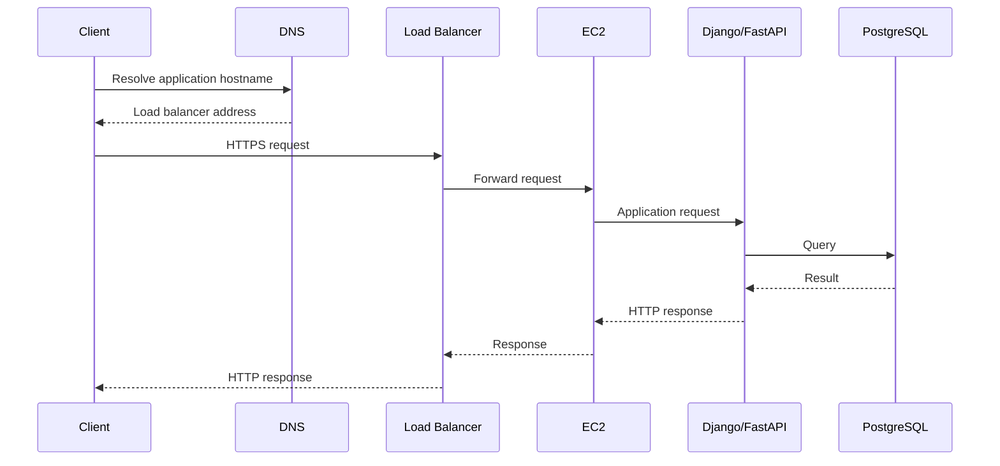
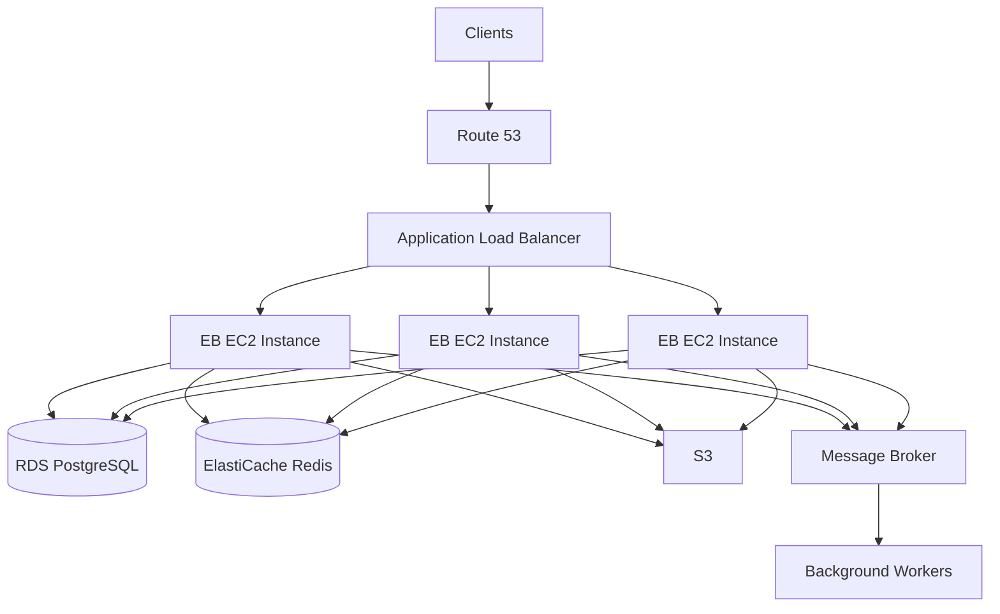

# 01- Core Interview Questions

## Overview

Amazon Elastic Beanstalk is a managed application deployment service that abstracts much of the infrastructure required to run web applications while still exposing the underlying AWS resources for operational control.

For backend interviews, Elastic Beanstalk is commonly evaluated through four areas:

- Understanding the relationship between Elastic Beanstalk and underlying AWS services.
- Deploying and operating Python, Django, and other web applications.
- Diagnosing health, deployment, networking, and configuration problems.
- Making production decisions around availability, scaling, security, and rollback.

The questions below progress from core concepts to production-oriented scenarios.

## Core Concepts

### What is Amazon Elastic Beanstalk?

**Answer:**

Amazon Elastic Beanstalk is a managed application deployment service that automates the provisioning and management of infrastructure required to run supported applications.

You provide application source code and configuration, and Elastic Beanstalk manages resources such as:

- EC2 instances
- Auto Scaling groups
- Elastic Load Balancers
- Security groups
- CloudWatch integration
- Platform runtimes
- Deployment orchestration

Elastic Beanstalk does not replace the underlying AWS infrastructure. It provides an abstraction and management layer over it.

### What problem does Elastic Beanstalk solve?

**Answer:**

Without Elastic Beanstalk, a team must manually configure infrastructure, deployment mechanisms, scaling, health monitoring, and application environments.

Elastic Beanstalk standardizes much of this lifecycle:

```text
Application Code
      |
      v
Elastic Beanstalk
      |
      +--> EC2
      +--> Auto Scaling
      +--> Load Balancer
      +--> Security Groups
      +--> CloudWatch
      +--> Platform Runtime
```

It is particularly useful when a team wants AWS-managed application deployment without managing every infrastructure component manually.

### Is Elastic Beanstalk serverless?

**Answer:**

No.

Elastic Beanstalk provisions and manages servers such as EC2 instances. You still have server-based infrastructure, although AWS automates much of its provisioning and management.

A useful distinction is:

| Service | Infrastructure model |
|---|---|
| Elastic Beanstalk | Managed platform over EC2-based infrastructure |
| Lambda | Serverless functions |
| ECS | Container orchestration |
| EKS | Managed Kubernetes |
| EC2 | Direct virtual machine management |

### Does Elastic Beanstalk create EC2 instances?

**Answer:**

Yes. In a typical web-server environment, Elastic Beanstalk provisions EC2 instances as part of the environment.

Depending on the environment configuration, it can also provision and configure:

- Auto Scaling groups
- Load balancers
- Security groups
- CloudWatch monitoring
- IAM roles
- Networking resources

### What is an Elastic Beanstalk application?

**Answer:**

An Elastic Beanstalk application is a logical container for related application versions and environments.

For example:

```text
Application
└── payment-api
    ├── Version: 1.0
    ├── Version: 1.1
    ├── Environment: payment-api-dev
    ├── Environment: payment-api-staging
    └── Environment: payment-api-prod
```

The application itself is not the running infrastructure. Environments represent deployed instances of the application.

### What is an Elastic Beanstalk environment?

**Answer:**

An environment is the actual running deployment of an Elastic Beanstalk application.

An environment contains the AWS resources required to run the selected platform and application configuration.

Typical environments include:

- Development
- Staging
- Production

Each environment can have different:

- Instance counts
- Instance types
- Environment variables
- Load balancer configuration
- Auto Scaling settings
- Deployment policies
- Networking configuration

### What is the difference between an application and an environment?

**Answer:**

An application is the logical parent; an environment is a running deployment.

| Application | Environment |
|---|---|
| Logical container | Running deployment |
| Contains versions | Runs a selected version |
| Usually long-lived | Can be created, updated, cloned, or terminated |
| Does not directly serve traffic | Serves application traffic |

### What is an Elastic Beanstalk application version?

**Answer:**

An application version is a specific, deployable version of application source code stored by Elastic Beanstalk.

A production deployment should normally reference an identifiable version rather than an ambiguous or mutable source artifact.

Versioning makes rollback easier because the previous application artifact remains identifiable.

### What is a platform in Elastic Beanstalk?

**Answer:**

A platform defines the operating system, runtime, web server, and platform components used to run an application.

Examples include platforms for:

- Python
- Node.js
- Java
- .NET
- Go
- PHP
- Docker

The platform version matters because application compatibility, security updates, runtime behavior, and supported dependencies can depend on it.

## Architecture

### What AWS resources are commonly created by Elastic Beanstalk?

**Answer:**

A typical load-balanced environment can involve:

- Elastic Load Balancing
- EC2
- Auto Scaling
- Security Groups
- IAM
- CloudWatch
- S3
- Route 53 when DNS is configured separately
- VPC networking components

The exact resources depend on environment configuration.

### Explain a typical request flow through Elastic Beanstalk.

**Answer:**

For a load-balanced web environment, the flow can look like:



Elastic Beanstalk manages the deployment and environment lifecycle, while the underlying AWS resources handle networking and request processing.

### Can Elastic Beanstalk run inside a VPC?

**Answer:**

Yes.

A production environment can be configured to use an existing VPC with appropriate:

- Public and private subnets
- Route tables
- Security groups
- Load balancer placement
- Instance placement
- NAT connectivity where required

A common architecture is:

```text
Internet
   |
   v
Load Balancer
   |
   v
Private Subnets
   |
   +--> EC2 application instances
   |
   +--> RDS PostgreSQL
```

Keeping application instances and databases private reduces direct exposure to the internet.

## Deployment

### How do you deploy an application to Elastic Beanstalk?

**Answer:**

A deployment can be performed using the Elastic Beanstalk CLI, AWS CLI, console, or CI/CD tooling.

A common EB CLI workflow is:

```bash
eb init
eb create production-env
eb deploy
```

For production systems, deployment should generally be automated through CI/CD rather than performed manually from a developer workstation.

### What happens when you run `eb deploy`?

**Answer:**

At a high level:

1. The application source is packaged.
2. The application version is created.
3. The artifact is uploaded to AWS.
4. Elastic Beanstalk deploys the version to the environment.
5. Environment instances are updated according to the deployment policy.
6. Health checks determine whether the environment remains healthy.
7. The deployment either succeeds or requires rollback/remediation.

The exact sequence depends on environment configuration and deployment strategy.

### What deployment strategies does Elastic Beanstalk support?

**Answer:**

Common deployment policies include:

| Strategy | Behavior | Typical use |
|---|---|---|
| All at once | Updates all instances together | Development |
| Rolling | Updates instances in batches | Lower-risk production deployments |
| Rolling with additional batch | Uses temporary capacity during rollout | Availability-sensitive deployments |
| Immutable | Creates new instances before replacing old ones | Safer production releases |
| Traffic splitting | Shifts traffic between versions | Controlled production rollout |

The appropriate strategy depends on availability requirements, deployment duration, cost, and rollback requirements.

### Why is immutable deployment safer?

**Answer:**

An immutable deployment creates a new set of instances with the new application version instead of modifying the existing production instances in place.

Conceptually:

```text
Current Environment
    |
    +--> Instance A - v1
    +--> Instance B - v1

New Deployment
    |
    +--> Instance C - v2
    +--> Instance D - v2

Validation
    |
    +--> Healthy -> replace old capacity
    |
    +--> Failure -> discard new capacity
```

This reduces the risk of leaving the environment partially upgraded.

The tradeoff is higher temporary resource usage and therefore higher deployment cost.

### What is a rolling deployment?

**Answer:**

A rolling deployment updates a subset of instances at a time.

For example:

```text
Before:
A=v1
B=v1
C=v1
D=v1

Batch 1:
A=v2
B=v2
C=v1
D=v1

Batch 2:
A=v2
B=v2
C=v2
D=v2
```

The application remains available during deployment if enough healthy capacity remains.

However, during the rollout the environment can temporarily contain multiple application versions.

### When would you choose immutable deployment over rolling deployment?

**Answer:**

Immutable deployment is preferable when:

- Production availability is critical.
- Application startup is predictable.
- Deployment risk is relatively high.
- Mixed application versions could create compatibility problems.
- Extra temporary infrastructure cost is acceptable.

Rolling deployment may be preferable when:

- Deployment speed is more important.
- Infrastructure capacity is constrained.
- The application is backward-compatible across versions.

## Application Configuration

### How should environment-specific configuration be managed?

**Answer:**

Environment-specific configuration should be externalized from application source code.

Typical configuration includes:

- Database URLs
- API endpoints
- Feature flags
- Runtime settings
- Environment identifiers
- Secret references

For example:

```python
import os

DATABASE_URL = os.environ["DATABASE_URL"]
DEBUG = os.getenv("DEBUG", "false").lower() == "true"
```

Production secrets should not be committed to Git.

### Should database credentials be stored in Elastic Beanstalk environment variables?

**Answer:**

Environment variables are useful for configuration, but sensitive production credentials are generally better managed through a dedicated secret-management system such as AWS Secrets Manager or AWS Systems Manager Parameter Store.

The application can retrieve the secret securely using an IAM role.

This provides better:

- Secret rotation
- Access control
- Auditing
- Centralized management

### What is `.ebextensions`?

**Answer:**

`.ebextensions` is a configuration mechanism that allows application packages to contain Elastic Beanstalk environment configuration.

Historically, it is commonly used for YAML or JSON configuration files under:

```text
.ebextensions/
```

For example:

```text
.ebextensions/
└── 01-packages.config
```

It can be used for tasks such as:

- Package installation
- Configuration changes
- Commands
- Service configuration

For newer environments, `.platform` configuration and platform hooks may be more appropriate depending on the requirement.

### What is the `.platform` directory?

**Answer:**

`.platform` provides platform-specific configuration and hooks for supported Elastic Beanstalk platforms.

A project may contain:

```text
.platform/
├── nginx/
├── hooks/
│   ├── prebuild/
│   ├── predeploy/
│   └── postdeploy/
└── confighooks/
```

It is useful when application deployment requires platform-level customization.

## Python, Django, and FastAPI

### How would you deploy a Django application to Elastic Beanstalk?

**Answer:**

A typical Django deployment requires:

- Supported Python platform
- Dependency installation from `requirements.txt`
- WSGI application configuration
- Production settings
- Static file handling
- Database configuration
- Environment variables
- Appropriate health checks

The application should run through a production WSGI server rather than Django's development server.

### Should Django's `runserver` be used in production?

**Answer:**

No.

`runserver` is intended for development.

A production Django application should use a production application server such as Gunicorn behind the Elastic Beanstalk web-server architecture.

Example:

```bash
gunicorn config.wsgi:application
```

The exact command depends on the project structure.

### How would you deploy FastAPI?

**Answer:**

FastAPI is an ASGI application and should be served using an ASGI server such as Uvicorn.

A production command can look like:

```bash
uvicorn app.main:app --host 0.0.0.0 --port 8000
```

For production deployments, worker configuration, process supervision, health checks, and reverse-proxy behavior must be aligned with the Elastic Beanstalk platform.

### What happens if the application listens only on `127.0.0.1`?

**Answer:**

The application may only accept connections from the local machine.

In a typical EC2 deployment, the application needs to listen on an address reachable by the local proxy or web-server layer.

For example:

```text
127.0.0.1:8000
```

may be intentionally used when Nginx proxies locally, while:

```text
0.0.0.0:8000
```

allows the process to bind to all available interfaces.

The correct configuration depends on the Elastic Beanstalk platform and process architecture.

## Health Monitoring

### How does Elastic Beanstalk determine environment health?

**Answer:**

Elastic Beanstalk uses health checks and monitoring signals to determine the health state of the environment.

Health can be affected by:

- HTTP response codes
- Request failures
- Latency
- Instance health
- Application process health
- Load balancer health
- Environment events

The health state is useful for detecting operational problems, but it should not replace application-level observability.

### What is the difference between infrastructure health and application health?

**Answer:**

Infrastructure health asks whether the infrastructure is functioning.

Application health asks whether the application is actually providing correct business functionality.

For example:

```text
EC2: Healthy
Load Balancer: Healthy
HTTP 200: Healthy

But:
Database queries failing
Payment operations failing
Business logic returning incorrect results
```

Therefore, production systems should combine:

- Elastic Beanstalk health
- CloudWatch metrics
- Application logs
- Distributed tracing
- Business metrics
- Synthetic checks

## Scaling

### How does Elastic Beanstalk scale an application?

**Answer:**

In a load-balanced environment, Elastic Beanstalk can use EC2 Auto Scaling to increase or decrease the number of instances.

Conceptually:

```text
Low Traffic
    |
    v
2 Instances

Traffic increases
    |
    v
4 Instances

Traffic decreases
    |
    v
2 Instances
```

Scaling policies should be based on meaningful metrics such as CPU utilization, request count, latency, or other application-specific signals.

### Does Auto Scaling automatically solve performance problems?

**Answer:**

No.

Auto Scaling adds capacity, but it cannot fix every bottleneck.

For example:

```text
Clients
   |
Load Balancer
   |
EC2 Instances
   |
   v
PostgreSQL
   |
Connection Pool Exhausted
```

Adding more EC2 instances can actually increase database connection pressure.

Senior-level analysis requires identifying the actual bottleneck before scaling.

### How can database connection exhaustion occur during scaling?

**Answer:**

Suppose:

- 4 application instances
- 20 database connections per instance

Potential database connections:

```text
4 × 20 = 80
```

If Auto Scaling increases the fleet to 20 instances:

```text
20 × 20 = 400
```

The database may not support that connection count.

Connection pools therefore need to be designed with the maximum application fleet size and database capacity in mind.

## Networking

### Does Elastic Beanstalk require a VPC?

**Answer:**

Elastic Beanstalk environments run within AWS networking infrastructure, and production environments are commonly configured explicitly with a VPC.

A well-designed architecture separates public and private resources.

For example:

```text
Internet
   |
   v
Public Subnet
   |
   +--> Load Balancer
           |
           v
Private Subnet
   |
   +--> EC2
   |
   +--> RDS
```

### Why would application instances be placed in private subnets?

**Answer:**

Private subnets reduce direct internet exposure.

Application instances can receive traffic through the load balancer while remaining inaccessible directly from the public internet.

If instances require outbound internet access, a NAT gateway or another appropriate egress architecture may be required.

### What security groups are required?

**Answer:**

A common model is:

```text
Internet
   |
   v
Load Balancer SG
   |
   v
Application SG
   |
   v
Database SG
```

The database security group should allow database traffic only from the application security group rather than from the entire internet.

## SSL and DNS

### How should HTTPS be implemented?

**Answer:**

Production applications should use HTTPS.

A common architecture terminates TLS at the load balancer:

```text
Client
  |
 HTTPS
  |
  v
Load Balancer
  |
 HTTP/HTTPS
  |
  v
Application Instances
```

The TLS certificate can be managed using AWS Certificate Manager.

The exact termination model depends on security requirements.

### How does Route 53 relate to Elastic Beanstalk?

**Answer:**

Route 53 provides DNS management, while Elastic Beanstalk manages the application environment.

A typical architecture is:

```text
api.example.com
       |
       v
Route 53
       |
       v
Elastic Beanstalk Load Balancer
       |
       v
Application
```

DNS management and application deployment are separate concerns.

## Logging and Troubleshooting

### How would you troubleshoot an unhealthy Elastic Beanstalk environment?

**Answer:**

Start with the symptom and move down the stack.

A practical sequence is:

1. Check Elastic Beanstalk environment health.
2. Inspect recent environment events.
3. Check load balancer target health.
4. Inspect application logs.
5. Inspect Nginx or proxy logs where applicable.
6. Inspect application-server logs.
7. Check CPU, memory, latency, and request metrics.
8. Verify environment variables.
9. Verify security groups and networking.
10. Verify database and downstream dependencies.
11. Compare the deployment with the last known-good version.

The objective is to identify the first failing component rather than repeatedly redeploying.

### What would you check if deployments succeed but requests return HTTP 502?

**Answer:**

A successful Elastic Beanstalk deployment does not guarantee that the application process is correctly serving requests.

Potential causes include:

- Application server failed to start.
- Wrong application-server command.
- Wrong port.
- Application process crashed.
- Nginx cannot reach the application.
- Application startup timeout.
- Missing environment variable.
- Dependency installation failure.
- Application import error.

The investigation should begin with application and proxy logs.

### What would cause HTTP 504 errors?

**Answer:**

A 504 generally indicates that a gateway or proxy did not receive a timely response from an upstream service.

Possible causes include:

- Slow database queries
- Slow downstream APIs
- Application deadlocks
- Thread or worker exhaustion
- Connection pool exhaustion
- CPU saturation
- Network connectivity problems
- Long-running synchronous operations

The correct response is to identify where the request is spending time rather than simply increasing timeout values.

## Deployment Failures

### What happens if an Elastic Beanstalk deployment fails?

**Answer:**

The environment can enter a degraded or failed state depending on the failure and deployment strategy.

The appropriate response is to:

- Inspect deployment events.
- Inspect application logs.
- Determine whether the previous version is still serving traffic.
- Identify the failed lifecycle stage.
- Roll back to a known-good version if required.
- Fix the underlying problem before retrying.

### How would you design rollback?

**Answer:**

Every production deployment should have a known rollback mechanism.

A basic approach is:

```text
v42 deployed
    |
    v
Health checks fail
    |
    v
Identify v41 as known-good
    |
    v
Redeploy v41
    |
    v
Validate health
```

A stronger deployment process maintains:

- Immutable artifacts
- Version identifiers
- Deployment metadata
- Health validation
- Automated rollback criteria
- Database migration compatibility

### Why can database migrations make rollback difficult?

**Answer:**

Application code and database schema do not necessarily roll back together.

For example:

```text
v1 application
   |
   v
Add new database column
   |
   v
v2 application
```

If the schema migration is destructive, rolling the application back to v1 may fail because v1 expects the old schema.

A safer migration strategy is often:

```text
Expand
  |
  v
Deploy backward-compatible code
  |
  v
Migrate data
  |
  v
Switch behavior
  |
  v
Contract
```

This reduces coupling between application rollback and database rollback.

## CI/CD

### Why should Elastic Beanstalk deployments be automated?

**Answer:**

Manual deployments introduce:

- Configuration drift
- Human error
- Poor auditability
- Inconsistent artifacts
- Difficult rollback
- Unclear deployment ownership

A CI/CD pipeline can standardize:

```text
Git Push
   |
   v
Tests
   |
   v
Build Artifact
   |
   v
Security Checks
   |
   v
Deploy Staging
   |
   v
Smoke Tests
   |
   v
Production
   |
   v
Health Validation
```

### What should a production Elastic Beanstalk CI/CD pipeline contain?

**Answer:**

A practical pipeline can include:

| Stage | Purpose |
|---|---|
| Checkout | Retrieve source |
| Dependency installation | Install application dependencies |
| Unit tests | Validate application behavior |
| Static analysis | Detect code-quality issues |
| Security scanning | Detect vulnerable dependencies/configuration |
| Build | Produce deployment artifact |
| Staging deployment | Validate deployment |
| Smoke tests | Verify critical endpoints |
| Production deployment | Release approved artifact |
| Health validation | Confirm environment health |
| Rollback | Recover from failed release |

### Should the artifact deployed to production be rebuilt?

**Answer:**

Preferably no.

Build once and promote the same immutable artifact through environments.

```text
Source
  |
  v
Build
  |
  v
Artifact v123
  |
  +--> Staging
  |
  +--> Production
```

This avoids the risk that different builds of the same commit behave differently.

## Security

### How should IAM be designed for Elastic Beanstalk?

**Answer:**

Use least-privilege IAM roles.

Separate responsibilities such as:

- Elastic Beanstalk service role
- EC2 instance profile
- CI/CD deployment role
- Developer access
- Operational access

Avoid giving application instances broad administrator permissions.

### Why should applications use IAM roles instead of AWS access keys?

**Answer:**

IAM roles provide temporary credentials and avoid embedding long-lived access keys in:

- Source code
- Configuration files
- Docker images
- Environment variables
- CI/CD artifacts

For example, an application running on EC2 can obtain temporary credentials through its attached instance profile.

### Should AWS credentials be committed to Git?

**Answer:**

Never.

Credentials committed to source control can be copied, cached, indexed, or exposed through repository history.

If credentials are accidentally exposed:

1. Revoke them immediately.
2. Rotate affected credentials.
3. Investigate usage.
4. Remove the secret from source control.
5. Review access logs.

Removing the string from the latest commit alone is not sufficient.

## High Availability

### How would you design a highly available Elastic Beanstalk application?

**Answer:**

A production design should avoid a single instance and preferably distribute capacity across multiple Availability Zones.

A typical architecture is:

```text
                 Internet
                    |
                    v
             Load Balancer
              /          \
             v            v
        AZ-a EC2      AZ-b EC2
             \            /
              \          /
               v        v
                  RDS
```

Additional considerations include:

- Multi-AZ application capacity
- Load balancer health checks
- Auto Scaling
- Multi-AZ database deployment
- Stateless application design
- External session storage
- Durable object storage
- Tested recovery procedures

### Why should application servers be stateless?

**Answer:**

Stateless instances make horizontal scaling and replacement easier.

Avoid storing important state only on the local filesystem or local process memory.

Instead use services such as:

- S3 for durable objects
- Redis for shared ephemeral state
- RDS for transactional data

This allows an instance to be terminated and replaced without losing application state.

## Performance

### How would you troubleshoot high latency?

**Answer:**

Break latency into components:

```text
Total Latency
    |
    +--> Network
    +--> Load Balancer
    +--> Application Server
    +--> Database
    +--> Redis
    +--> External APIs
```

Useful metrics include:

- Request latency
- CPU utilization
- Memory utilization
- Database query latency
- Connection pool usage
- External API latency
- Error rate
- Request volume

Do not assume that high CPU is always the root cause.

### What happens if an application performs long-running synchronous work?

**Answer:**

Long-running work can consume application workers and reduce request-processing capacity.

For example:

```text
HTTP Request
    |
    v
Django/FastAPI Worker
    |
    +--> 30-second report generation
```

If all workers are occupied, new requests queue or fail.

For background work, systems such as Celery with an appropriate broker can be used:

```text
API
 |
 v
Queue
 |
 v
Celery Worker
 |
 v
Long-running task
```

The application architecture must be designed so asynchronous work is not accidentally executed synchronously inside request handlers.

## Production Scenarios

### A deployment is successful, but the application immediately becomes unhealthy. What do you do?

**Answer:**

I would treat the deployment as operationally failed even if the deployment command itself reported success.

I would:

1. Check environment events.
2. Check instance health.
3. Check load balancer target health.
4. Inspect application startup logs.
5. Inspect Nginx/proxy logs.
6. Verify environment variables and secrets.
7. Verify dependency installation.
8. Compare the new version with the previous version.
9. Roll back if production impact is significant.
10. Perform root-cause analysis before redeployment.

### Production is returning 500 errors after deployment. Would you immediately roll back?

**Answer:**

Not blindly.

First determine:

- Error rate
- Affected endpoints
- Customer impact
- Whether the issue is isolated
- Whether the new deployment caused the issue
- Whether rollback is safe

If the release clearly caused a widespread production failure and rollback is safe, rollback should happen quickly.

Senior engineers optimize for **reducing customer impact first**, followed by detailed diagnosis.

### Traffic suddenly doubles. What should you inspect?

**Answer:**

Inspect both application capacity and dependencies.

```text
Traffic
  |
  +--> Load Balancer
  |
  +--> EC2 CPU / Memory
  |
  +--> Application workers
  |
  +--> Database connections
  |
  +--> Database CPU / I/O
  |
  +--> Redis
  |
  +--> External dependencies
```

Scaling the EC2 fleet without checking the database can move the bottleneck downstream.

### The application works locally but fails on Elastic Beanstalk. What are likely causes?

**Answer:**

Common differences include:

- Python/runtime version
- Missing dependencies
- Missing environment variables
- Incorrect working directory
- Incorrect WSGI/ASGI configuration
- File-system assumptions
- Linux-specific behavior
- Port configuration
- IAM permissions
- Network access
- Database connectivity
- Static-file configuration

Production environments should therefore be treated as explicitly configured deployment targets rather than assuming local behavior will transfer automatically.

## Common Mistakes

### What are common Elastic Beanstalk mistakes?

**Answer:**

| Mistake | Problem |
|---|---|
| Using development server | Poor production reliability |
| Hardcoding secrets | Security exposure |
| Running only one production instance | Single point of failure |
| Storing state locally | State lost when instances are replaced |
| Manual production deployment | Drift and human error |
| Ignoring database connection limits | Scaling can overload the database |
| Skipping health validation | Broken releases reach users |
| Using destructive migrations | Rollback becomes difficult |
| Ignoring platform upgrades | Runtime/security debt |
| Treating logs as optional | Slow incident diagnosis |
| Giving instances excessive IAM permissions | Large security blast radius |
| Scaling without identifying bottlenecks | Cost increases without fixing root cause |

## Interview Traps

### Is Elastic Beanstalk equivalent to EC2?

**Answer:**

No.

EC2 provides virtual machines directly. Elastic Beanstalk is an application platform that provisions and manages AWS resources, including EC2 instances, according to an environment configuration.

### Is Elastic Beanstalk equivalent to Kubernetes?

**Answer:**

No.

Elastic Beanstalk provides a higher-level managed application deployment model.

Kubernetes provides a general-purpose container orchestration platform with significantly greater control and complexity.

### Does Elastic Beanstalk remove the need for DevOps?

**Answer:**

No.

It reduces infrastructure-management overhead but does not eliminate responsibilities such as:

- Security
- CI/CD
- Observability
- Capacity planning
- Networking
- Database management
- Incident response
- Backup and recovery
- Cost management
- Platform upgrades

### Does Auto Scaling guarantee high availability?

**Answer:**

No.

Auto Scaling can replace or add instances, but high availability also depends on:

- Multiple Availability Zones
- Load balancer health checks
- Application statelessness
- Database availability
- Dependency availability
- Correct deployment strategy
- Recovery procedures

### Can Elastic Beanstalk automatically fix every application failure?

**Answer:**

No.

Elastic Beanstalk can detect certain infrastructure and application health problems and replace unhealthy capacity, but it cannot understand arbitrary business-logic failures.

An application can return HTTP 200 while producing incorrect business results.

## Senior-Level Design Questions

### How would you design a production Django application on Elastic Beanstalk?

**Answer:**

A reasonable architecture is:



Important production characteristics include:

- Multiple application instances
- Multi-AZ capacity
- HTTPS
- Least-privilege IAM
- Externalized secrets
- Centralized logging
- CloudWatch monitoring
- Database backups
- Stateless application design
- Automated CI/CD
- Tested rollback procedures
- Backward-compatible database migrations

### How would you migrate from Elastic Beanstalk to ECS or EKS?

**Answer:**

First separate application concerns from Elastic Beanstalk-specific infrastructure assumptions.

The migration should identify:

- Runtime configuration
- Environment variables
- Networking
- Logging
- Health checks
- Deployment process
- Persistent storage
- Background workers
- IAM permissions
- Scaling rules
- Load balancing
- CI/CD

A containerized application can then be deployed to ECS or EKS while keeping external services such as RDS, S3, and Redis where appropriate.

The key principle is to avoid coupling business logic tightly to the deployment platform.

## Rapid-Fire Interview Questions

| Question | Short Answer |
|---|---|
| What is Elastic Beanstalk? | Managed application deployment and environment-management service. |
| Is it serverless? | No. It commonly uses EC2-based infrastructure. |
| What is an environment? | A running deployment of an Elastic Beanstalk application. |
| What is an application version? | A specific deployable application artifact/version. |
| Does it support Auto Scaling? | Yes, through the underlying environment architecture. |
| Can it run Django? | Yes, using the supported Python platform and production application server. |
| Can it run FastAPI? | Yes, with appropriate ASGI configuration. |
| Can it use a VPC? | Yes. |
| Can instances be placed in private subnets? | Yes, with appropriate networking and egress configuration. |
| Should secrets be committed to Git? | Never. |
| Should production use `runserver`? | No. |
| Why use immutable deployment? | To reduce deployment risk by creating new capacity before replacing old capacity. |
| Why use multiple Availability Zones? | To reduce the impact of an Availability Zone failure. |
| Does Auto Scaling solve database bottlenecks? | No. It can increase downstream load. |
| What should production deployments have? | Automated validation, observability, and rollback. |
| What should be stored outside application instances? | Durable state such as files, sessions, and persistent data. |
| Why use CI/CD? | Repeatability, auditability, consistency, and safer deployments. |
| What is a major rollback challenge? | Database schema compatibility. |
| What should you check for 502 errors? | Application process, proxy configuration, ports, startup logs, and dependencies. |
| What should you check for 504 errors? | Upstream latency, worker exhaustion, database issues, and downstream dependencies. |

## Key Takeaways

- Elastic Beanstalk is a managed application platform, not a replacement for understanding AWS infrastructure.
- An **application** is a logical container; an **environment** is the running deployment.
- Elastic Beanstalk commonly manages EC2, Auto Scaling, load balancing, security groups, and monitoring integrations.
- Production environments should use multiple instances and Availability Zones where availability requirements justify them.
- Deployment strategy should match the application's availability and rollback requirements.
- Immutable deployments provide stronger isolation at the cost of temporary additional capacity.
- CI/CD should build immutable artifacts, validate them, and provide a reliable rollback path.
- Auto Scaling solves capacity problems, not necessarily application or database bottlenecks.
- Stateless application design is critical for reliable horizontal scaling.
- Secrets should be managed through appropriate AWS secret-management mechanisms rather than source control.
- Application health must be evaluated beyond infrastructure health.
- Database migrations should be designed for backward compatibility when zero-downtime deployment and rollback are requirements.
- Senior-level Elastic Beanstalk knowledge is primarily about **operating the application safely**, not merely knowing how to run `eb deploy`.