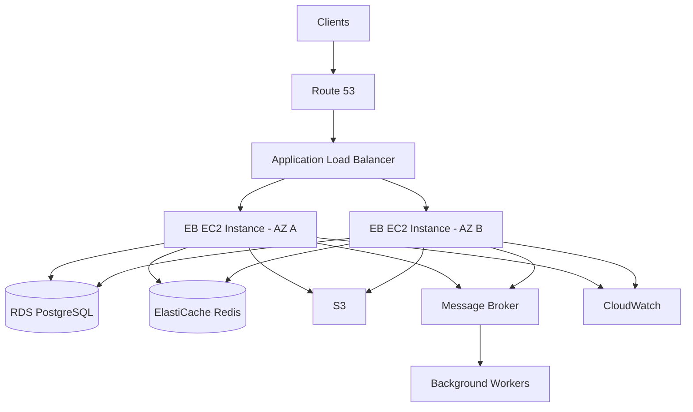

# 02- Architecture Questions

## Overview

Architecture questions for Amazon Elastic Beanstalk test whether an engineer can design, operate, and troubleshoot a production backend rather than simply deploy an application.

The key areas are:

- Application and environment architecture
- VPC and subnet design
- Load balancing and Auto Scaling
- Multi-AZ availability
- Database and cache integration
- Stateless application design
- Deployment and rollback architecture
- Security boundaries
- Observability
- Performance and scaling
- Disaster recovery
- Migration and platform trade-offs

The strongest interview answers explain **why a design was chosen**, identify its failure modes, and discuss the operational trade-offs.

## Core Architecture

### How would you architect a production Django application on Elastic Beanstalk?

**Answer:**

A typical production architecture would separate public ingress, application compute, and data services.



Important characteristics:

- Load balancer in public subnets.
- Application instances distributed across Availability Zones.
- Application instances preferably in private subnets.
- RDS used for persistent relational data.
- Redis used for shared cache or ephemeral shared state.
- S3 used for durable object storage.
- Background processing separated from request handling.
- CloudWatch and application-level observability enabled.
- IAM roles used instead of long-lived AWS credentials.

### Why should the application layer be separated from the database layer?

**Answer:**

The application and database have different scaling, availability, security, and operational requirements.

A common model is:

```text
Internet
   |
   v
Load Balancer
   |
   v
Application Tier
   |
   v
Database Tier
```

The application tier can scale horizontally while the database tier is managed independently.

This also allows the database to remain inaccessible from the public internet.

### Why should application instances usually be in private subnets?

**Answer:**

Private subnets reduce the attack surface by preventing direct inbound internet access to application instances.

Traffic can flow through the load balancer:

```text
Internet
   |
   v
Public Subnet
   |
   +--> Load Balancer
           |
           v
       Private Subnet
           |
           +--> Application Instance
```

Application instances may still require controlled outbound access through NAT or other appropriate networking mechanisms.

### What is the role of the load balancer?

**Answer:**

The load balancer provides a stable entry point for clients and distributes requests across healthy application instances.

It also enables:

- Health-based routing
- Horizontal scaling
- Multi-AZ traffic distribution
- TLS termination
- Connection management
- Reduced direct exposure of application instances

The load balancer should not be treated as a replacement for application-level resilience.

## High Availability

### How would you design Elastic Beanstalk for high availability?

**Answer:**

Use a load-balanced environment with multiple instances distributed across Availability Zones.

```text
                    Internet
                       |
                       v
                Load Balancer
                 /          \
                /            \
               v              v
          AZ A - EC2      AZ B - EC2
               \              /
                \            /
                 v          v
                   RDS
```

The design should also consider:

- Auto Scaling
- Multi-AZ database deployment
- Stateless application behavior
- External session storage
- Durable object storage
- Health checks
- Automated deployments
- Tested recovery procedures

### Why are multiple Availability Zones important?

**Answer:**

An Availability Zone failure should not take down the entire application.

If all instances are placed in one AZ:

```text
AZ A
 |
 +--> Instance 1
 +--> Instance 2
 +--> Instance 3

AZ failure
     |
     v
Application unavailable
```

With multiple AZs:

```text
AZ A                 AZ B
 |                    |
 +--> Instance 1     +--> Instance 2
 +--> Instance 3     +--> Instance 4
```

The remaining AZs can continue serving traffic.

### Does running two instances guarantee high availability?

**Answer:**

No.

Two instances in the same Availability Zone still share the same AZ failure domain.

High availability depends on the failure domains being separated.

Other dependencies must also be considered:

- Database
- Cache
- DNS
- Load balancer
- External APIs
- Message broker
- Storage
- Networking

### What happens if one Elastic Beanstalk instance becomes unhealthy?

**Answer:**

The load balancer should stop routing traffic to the unhealthy target, while the environment's Auto Scaling and health mechanisms can replace or recover unhealthy capacity depending on the failure.

The architecture should therefore assume that individual instances are disposable.

This is one reason application state should not depend on local instance storage.

## Stateless Architecture

### Why should an Elastic Beanstalk application be stateless?

**Answer:**

Elastic Beanstalk environments can add, remove, replace, and redeploy instances.

If important state is stored locally:

```text
Instance A
 |
 +--> uploaded_file.pdf
 +--> local_session
 +--> local_application_state
```

and Instance A is terminated, that state can disappear.

Instead:

| State | Preferred location |
|---|---|
| Relational data | RDS |
| Object/file data | S3 |
| Cache | ElastiCache Redis |
| Shared session data | Redis or database |
| Background jobs | Queue/broker |
| Application configuration | Environment/configuration system |
| Secrets | Secrets Manager or Parameter Store |

### How would you handle Django sessions in a multi-instance environment?

**Answer:**

Avoid relying on local filesystem sessions.

Use a shared session backend such as:

- Redis
- Database-backed sessions

For example:

```text
Client
   |
Load Balancer
   |
   +----> Instance A
   |
   +----> Instance B
             |
             v
          Redis
             |
             v
        Shared Session
```

This allows requests to reach different instances without losing session state.

### Should uploaded files be stored on EC2?

**Answer:**

No, not for durable application data.

Elastic Beanstalk instances are replaceable compute resources.

Use S3 for durable object storage:

```text
Application
    |
    v
S3
    |
    +--> Images
    +--> Documents
    +--> Reports
```

This also simplifies scaling because every application instance can access the same durable storage.

## Scaling Architecture

### How does Elastic Beanstalk scale horizontally?

**Answer:**

A load-balanced environment can use Auto Scaling to increase or decrease the number of EC2 instances.

```text
Traffic
   |
   v
Load Balancer
   |
   +--> EC2
   +--> EC2
   +--> EC2
   |
   v
Auto Scaling
```

Scaling decisions can be based on metrics such as:

- CPU utilization
- Request count
- Network utilization
- Application-specific metrics
- Latency

### What is wrong with scaling only on CPU?

**Answer:**

CPU is not always the limiting resource.

A service can experience high latency because of:

- Database contention
- Slow external APIs
- Connection pool exhaustion
- Memory pressure
- Worker exhaustion
- Lock contention
- Network latency

For example:

```text
CPU: 35%
Memory: 70%
DB Connections: 100%
Request Latency: High
```

Increasing EC2 capacity may not solve the problem because the database is the bottleneck.

### How can scaling the application overload PostgreSQL?

**Answer:**

Each application instance may maintain a connection pool.

Suppose:

```text
10 instances
×
20 database connections
=
200 potential connections
```

If Auto Scaling increases the fleet to 50 instances:

```text
50 × 20 = 1,000 potential connections
```

The database may become connection-starved.

Therefore, database capacity and application connection pools must be designed together.

### How would you protect the database during aggressive Auto Scaling?

**Answer:**

Consider:

- Appropriate connection pool sizes
- Database connection limits
- Query optimization
- Read replicas where appropriate
- Caching
- Connection pooling/proxying
- Maximum Auto Scaling limits
- Application concurrency controls
- Database monitoring

Scaling policy should consider the entire dependency chain, not only EC2 capacity.

## Database Architecture

### Would you deploy PostgreSQL inside Elastic Beanstalk?

**Answer:**

Generally, no for production systems.

A managed database such as Amazon RDS for PostgreSQL provides database-specific capabilities including:

- Managed backups
- Multi-AZ options
- Monitoring
- Maintenance
- Recovery capabilities
- Storage management

Elastic Beanstalk should normally host the application tier while RDS handles persistent relational data.

### Why should the database not be tightly coupled to the Elastic Beanstalk environment?

**Answer:**

Application environments are frequently recreated, upgraded, cloned, or terminated.

Persistent data should have an independent lifecycle.

```text
Elastic Beanstalk
    |
    +--> Disposable application instances

RDS
    |
    +--> Persistent database lifecycle
```

This separation reduces the risk of accidentally destroying production data during environment operations.

### How would you design database connectivity?

**Answer:**

Use security groups to restrict database access to the application tier.

```text
Application Security Group
          |
          | TCP 5432
          v
Database Security Group
          |
          v
RDS PostgreSQL
```

The database should not accept connections from arbitrary internet sources.

### How would you handle database migrations during deployment?

**Answer:**

Use backward-compatible migrations where possible.

A safer production sequence is:

```text
Expand schema
    |
    v
Deploy compatible application
    |
    v
Backfill / migrate data
    |
    v
Switch application behavior
    |
    v
Remove obsolete schema
```

Avoid combining a destructive schema change with an application release that may need immediate rollback.

## Cache Architecture

### Where would Redis fit into an Elastic Beanstalk architecture?

**Answer:**

Redis can be used for:

- Application caching
- Session storage
- Rate limiting
- Distributed locks
- Short-lived state

For production, a managed Redis service is preferable to running Redis directly on an application instance.

```text
Application A ----\
                    \
Application B ------> Redis
                    /
Application C ----/
```

All application instances can share the same cache.

### Should every request use Redis?

**Answer:**

No.

Caching should be introduced where it solves a measured performance or scalability problem.

Poor caching can introduce:

- Stale data
- Cache invalidation complexity
- Memory pressure
- Increased infrastructure cost
- Incorrect application behavior

The cache should have a clear consistency model and expiration strategy.

## Background Processing

### How would you handle Celery workers with Elastic Beanstalk?

**Answer:**

Separate synchronous web traffic from asynchronous background processing.

For example:

```text
Client
   |
   v
Load Balancer
   |
   v
Web Application
   |
   v
Message Broker
   |
   v
Celery Workers
   |
   +--> Database
   +--> S3
   +--> External APIs
```

This prevents long-running jobs from consuming web request workers.

The worker fleet can also scale independently from the web fleet.

### Why should long-running tasks not execute inside HTTP request handlers?

**Answer:**

Suppose a request triggers a 60-second report-generation operation.

If every worker is occupied:

```text
Worker 1 -> Report
Worker 2 -> Report
Worker 3 -> Report
Worker 4 -> Report
```

new HTTP requests cannot be processed efficiently.

A queue-based architecture separates request latency from background processing.

## Networking Architecture

### How would you design public and private subnets?

**Answer:**

A common architecture is:

```text
VPC
|
+-- Public Subnets
|    |
|    +-- Load Balancer
|
+-- Private Application Subnets
|    |
|    +-- EB EC2 Instances
|
+-- Private Database Subnets
     |
     +-- RDS
```

The exact subnet layout depends on the environment and AWS networking design.

### What is the role of a NAT gateway?

**Answer:**

A NAT gateway allows resources in private subnets to initiate outbound internet connections without accepting unsolicited inbound connections from the internet.

For example:

```text
Private EC2
    |
    v
Route Table
    |
    v
NAT Gateway
    |
    v
Internet
```

This may be required for application instances to download dependencies or reach external services, depending on the deployment architecture.

### What is a common security-group architecture?

**Answer:**

Use layered security groups.

```text
Internet
   |
   v
ALB Security Group
   |
   v
Application Security Group
   |
   v
Database Security Group
```

Example policy:

| Source | Destination | Port | Purpose |
|---|---|---:|---|
| Internet | ALB | 443 | HTTPS |
| ALB SG | Application SG | Application port | Application traffic |
| Application SG | Database SG | 5432 | PostgreSQL |
| Application SG | Redis SG | 6379 | Redis |

The database should not be exposed directly to the internet.

## Security Architecture

### How would you design IAM for an Elastic Beanstalk application?

**Answer:**

Separate identities by responsibility.

```text
CI/CD Role
   |
   +--> Deploy Elastic Beanstalk

Elastic Beanstalk Service Role
   |
   +--> Manage environment

EC2 Instance Role
   |
   +--> Application AWS APIs

Developer Role
   |
   +--> Operational access
```

Each role should have only the permissions it requires.

### Why should application credentials not be stored in the source code?

**Answer:**

Source repositories have a large blast radius.

Credentials can leak through:

- Git history
- Pull requests
- Forks
- Logs
- CI artifacts
- Developer machines

Use IAM roles for AWS access and dedicated secret-management services for application secrets.

### How would you secure an application exposed through Elastic Beanstalk?

**Answer:**

A production security baseline should include:

- HTTPS
- Managed certificates
- Private application instances
- Restrictive security groups
- Least-privilege IAM
- Managed secrets
- Dependency security scanning
- OS/platform updates
- Centralized audit logging
- Restricted administrative access
- Network segmentation

Security should be implemented as multiple layers rather than relying on a single control.

## Deployment Architecture

### Which deployment strategy would you choose for a critical production API?

**Answer:**

The choice depends on application behavior and availability requirements, but immutable deployment or controlled traffic shifting is often preferable to all-at-once deployment for critical services.

A typical approach is:

```text
Current Version
      |
      v
Production Traffic
      |
      +----------------+
                       |
New Version            |
      |                |
      v                |
New Capacity           |
      |                |
      v                |
Health Checks          |
      |                |
      +------ Healthy -+
             |
             v
       Production
```

The key is that deployment success should depend on health validation, not merely successful artifact upload.

### What is the difference between rolling and immutable deployment?

**Answer:**

| Rolling | Immutable |
|---|---|
| Updates existing capacity | Creates new capacity |
| Lower temporary cost | Higher temporary cost |
| May run mixed versions | Better version isolation |
| Faster in some environments | Safer replacement model |
| Rollback can be more complex | Failed new capacity can be discarded |

### When is all-at-once deployment acceptable?

**Answer:**

All-at-once deployment may be reasonable for:

- Development
- Disposable test environments
- Non-critical applications
- Environments where downtime is acceptable

It is generally a poor default for critical production services because all existing application capacity can be affected simultaneously.

## Blue/Green Architecture

### How would you implement a blue/green deployment strategy with Elastic Beanstalk?

**Answer:**

Maintain separate environments:

```text
                    Route 53 / DNS
                         |
                         v
                  Production Traffic
                    /           \
                   /             \
              Blue               Green
              v1                 v2
               |                 |
            Current            Candidate
```

The new version is deployed to the green environment and validated independently.

After validation, traffic is switched to green.

If problems occur, traffic can be switched back to blue.

### What are the advantages of blue/green deployment?

**Answer:**

- Strong isolation between versions
- Independent validation
- Fast traffic rollback
- Reduced deployment risk
- Easier production testing

### What are the disadvantages?

**Answer:**

- Additional infrastructure cost
- More environment management
- Database migration complexity
- Potential configuration drift
- Cache/session considerations
- DNS or traffic-switching considerations

Blue/green is not automatically safer if shared dependencies are not backward-compatible.

## Observability Architecture

### How would you design observability for Elastic Beanstalk?

**Answer:**

Use multiple observability layers.

```text
Elastic Beanstalk
      |
      +--> Environment Health
      |
      +--> CloudWatch Metrics
      |
      +--> Application Logs
      |
      +--> Load Balancer Metrics
      |
      +--> Database Metrics
      |
      +--> Distributed Tracing
      |
      +--> Business Metrics
```

Infrastructure health alone is insufficient.

### What metrics would you monitor?

**Answer:**

At minimum:

| Layer | Metrics |
|---|---|
| Load balancer | Request count, latency, 4xx, 5xx |
| EC2 | CPU, memory, network, disk |
| Application | Request latency, errors, throughput |
| Database | CPU, connections, latency, storage, I/O |
| Redis | Memory, evictions, latency, connections |
| Queue | Queue depth, processing latency, failures |
| Business | Transactions, successful operations, failures |

The objective is to connect infrastructure symptoms to user-facing impact.

### Why are application logs important if CloudWatch already provides metrics?

**Answer:**

Metrics tell you **that** something is wrong.

Logs often help explain **why**.

For example:

```text
Metric:
HTTP 500 rate increased

Logs:
psycopg2 connection timeout
```

The metric identifies the symptom while the log provides diagnostic evidence.

## Performance Architecture

### An API becomes slow as traffic increases. How would you investigate?

**Answer:**

Start by identifying where latency is introduced.

```text
Client
  |
  v
Load Balancer
  |
  v
Application
  |
  +--> CPU?
  +--> Memory?
  +--> Worker saturation?
  +--> Database?
  +--> Redis?
  +--> External API?
```

Measure before changing infrastructure.

A senior engineer should avoid immediately increasing instance size without identifying the bottleneck.

### When would you scale vertically instead of horizontally?

**Answer:**

Vertical scaling can be appropriate when:

- The application is constrained by CPU or memory.
- Horizontal scaling does not improve the bottleneck.
- The workload is difficult to distribute.
- Operational simplicity is more important than maximum elasticity.

Horizontal scaling is generally preferred for stateless web applications because it improves both capacity and instance-level fault tolerance.

## Failure Scenarios

### What happens if the load balancer fails?

**Answer:**

The AWS load-balancing service is designed for high availability, but the application architecture should still be evaluated as a complete system.

The interview should not stop at "AWS handles it."

Consider:

- DNS behavior
- Load balancer health
- Application target health
- Availability Zones
- Dependent services
- Client retry behavior

### What happens if an EC2 instance fails?

**Answer:**

The architecture should tolerate the failure.

```text
Before:
ALB
 |
 +--> Instance A
 +--> Instance B
 +--> Instance C

Instance B fails

After:
ALB
 |
 +--> Instance A
 +--> Instance C
 +--> Replacement Instance
```

The load balancer stops routing traffic to unhealthy capacity, and Auto Scaling can restore desired capacity.

### What happens if an entire Availability Zone fails?

**Answer:**

If application capacity is distributed across multiple AZs, the remaining AZs can continue serving traffic.

However, the system must have enough spare capacity to absorb the lost traffic.

This is why merely having one instance in each AZ is not always sufficient. Capacity planning must account for failure scenarios.

## Disaster Recovery

### How would you design disaster recovery for an Elastic Beanstalk application?

**Answer:**

Separate the recovery strategy into application infrastructure and persistent data.

```text
Application
   |
   +--> Rebuild from version-controlled infrastructure/configuration

Database
   |
   +--> RDS backups / snapshots
   +--> Cross-region strategy if required

Objects
   |
   +--> S3 durability / replication strategy

Secrets
   |
   +--> Managed secret store
```

A production DR strategy should explicitly define:

- RTO
- RPO
- Backup frequency
- Recovery region
- Data replication
- Application reconstruction
- DNS/traffic recovery
- Recovery testing

### What is RTO?

**Answer:**

Recovery Time Objective defines how quickly the system should be restored after a failure.

Example:

```text
RTO = 30 minutes
```

The system should be operational within approximately 30 minutes of the relevant disaster scenario.

### What is RPO?

**Answer:**

Recovery Point Objective defines the maximum acceptable amount of data loss measured in time.

Example:

```text
RPO = 5 minutes
```

The recovery strategy should aim to limit data loss to approximately five minutes or less.

### Why are backups not enough for disaster recovery?

**Answer:**

A backup is only useful if it can actually be restored.

A complete DR strategy must test:

- Backup integrity
- Restore process
- Application reconstruction
- Database connectivity
- DNS changes
- Secret availability
- Dependency configuration
- Operational procedures

Untested backups create a false sense of resilience.

## Cost and Capacity Architecture

### How would you control Elastic Beanstalk costs?

**Answer:**

Cost optimization should focus on actual workload characteristics.

Consider:

- Instance types
- Minimum and maximum Auto Scaling capacity
- Scaling policies
- Environment count
- NAT gateway usage
- Load balancer usage
- Log retention
- Data transfer
- Database capacity
- Cache capacity
- Unused environments

Do not reduce capacity below the level required for availability and performance.

### Why can a small instance fleet be more expensive operationally?

**Answer:**

Under-provisioning can create:

- Higher latency
- More failures
- Emergency scaling
- Poor user experience
- Increased operational effort

Cost optimization should optimize **total system cost**, not only EC2 spend.

## Architecture Trade-Offs

### Elastic Beanstalk vs ECS: when would you choose each?

**Answer:**

| Requirement | Elastic Beanstalk | ECS |
|---|---|---|
| Simple application deployment | Strong fit | Strong fit |
| Minimal infrastructure management | Strong fit | Moderate |
| Container-first architecture | Possible | Strong fit |
| Fine-grained container control | Limited | Strong |
| Operational simplicity | Strong | Moderate |
| Complex microservices | Less suitable | Strong |
| Custom orchestration | Limited | Strong |
| Existing container platform | Less natural | Strong |

Elastic Beanstalk is attractive when the team wants a managed application platform without adopting a full container orchestration model.

ECS becomes more attractive when container-level control and service-oriented architecture become important.

### Elastic Beanstalk vs EKS: when would you choose each?

**Answer:**

EKS provides managed Kubernetes control-plane infrastructure while retaining Kubernetes' operational complexity.

Elastic Beanstalk is generally simpler.

| Requirement | Elastic Beanstalk | EKS |
|---|---|---|
| Simple web application | Strong fit | Often excessive |
| Kubernetes expertise | Not required | Required |
| Kubernetes ecosystem | Limited | Strong |
| Operational complexity | Lower | Higher |
| Fine-grained orchestration | Limited | Very high |
| Platform standardization around Kubernetes | Weak | Strong |

The correct choice depends on organizational requirements rather than which service is technically more powerful.

## Migration Questions

### How would you migrate a Django application from EC2 to Elastic Beanstalk?

**Answer:**

First identify the existing EC2 assumptions:

- Application startup command
- Nginx configuration
- Python runtime
- Environment variables
- Secrets
- Filesystem dependencies
- Database connectivity
- Background workers
- Cron jobs
- Logging
- Deployment scripts

Then map those responsibilities to Elastic Beanstalk mechanisms.

The migration should be performed incrementally:

```text
Existing EC2
    |
    v
Identify Runtime Dependencies
    |
    v
Create EB Environment
    |
    v
Deploy Application
    |
    v
Validate Staging
    |
    v
Production Traffic Migration
```

### How would you migrate away from Elastic Beanstalk?

**Answer:**

First identify which parts of the application are platform-independent.

A good target architecture separates:

```text
Application Code
      |
      +--> Container Image
      |
      +--> External Configuration
      |
      +--> External Database
      |
      +--> External Cache
      |
      +--> External Storage
```

This makes migration to ECS, EKS, or another platform easier.

The main objective is to avoid moving Elastic Beanstalk-specific assumptions directly into application business logic.

## Scenario-Based Architecture Questions

### Design an Elastic Beanstalk architecture for 10,000 requests per second.

**Answer:**

Do not determine the architecture from request volume alone.

First identify:

- Request size
- Request complexity
- CPU usage
- Memory usage
- Database workload
- Cache hit ratio
- External dependencies
- Latency requirements
- Read/write ratio
- Availability requirements

A possible architecture is:

```text
                     Clients
                        |
                        v
                    Route 53
                        |
                        v
               Application Load Balancer
                   /            \
                  /              \
                 v                v
          EB Application      EB Application
             Fleet A             Fleet B
                 \                /
                  \              /
                   v            v
                    Redis Cache
                        |
                        v
                 PostgreSQL / RDS
                        |
                        v
                 Background Queue
                        |
                        v
                    Workers
```

The actual capacity must be determined through load testing and measurement.

### Design an Elastic Beanstalk architecture for a payment API.

**Answer:**

The design should prioritize:

- High availability
- Idempotency
- Strong database consistency
- Secure secrets
- Auditability
- Controlled deployments
- Failure recovery
- Transaction integrity

A conceptual architecture is:

```text
Client
  |
 HTTPS
  |
  v
Load Balancer
  |
  v
Stateless API Fleet
  |
  +--> PostgreSQL
  |
  +--> Redis
  |
  +--> Payment Provider
  |
  +--> Audit/Event System
```

Important application-level considerations include:

- Idempotency keys
- Transaction boundaries
- Retry safety
- Timeout configuration
- Provider failure handling
- Audit logs
- Reconciliation
- Secure credential management

Elastic Beanstalk provides the deployment infrastructure, but these business reliability properties must be implemented by the application.

### Design an architecture for an image-processing API.

**Answer:**

Do not process large images synchronously if processing is expensive.

Prefer:

```text
Client
  |
  v
API
  |
  +--> Store image in S3
  |
  +--> Publish processing job
              |
              v
         Worker Fleet
              |
              v
       Process Image
              |
              v
             S3
```

The API can immediately return a job identifier while workers process the image asynchronously.

This prevents long-running image processing from consuming web request workers.

## Interview Traps

### Is Elastic Beanstalk an architecture?

**Answer:**

No.

Elastic Beanstalk is a deployment and environment-management platform.

The architecture still needs explicit decisions around:

- Networking
- Compute
- Database
- Cache
- Storage
- Messaging
- Security
- Observability
- Availability
- Disaster recovery

### Does putting an application behind a load balancer make it highly available?

**Answer:**

No.

The load balancer only distributes traffic.

High availability requires the complete dependency chain to tolerate failures.

### Does Auto Scaling make an application infinitely scalable?

**Answer:**

No.

Every downstream dependency has limits.

```text
Application Scaling
       |
       v
Database
Redis
Message Broker
External APIs
Network
```

A scalable architecture requires capacity planning across the entire system.

### Should you use the largest EC2 instance available?

**Answer:**

No.

Instance sizing should be based on measured workload characteristics.

Use:

- Load testing
- CPU metrics
- Memory metrics
- Request latency
- Throughput
- Cost analysis

Choose the smallest capacity that reliably satisfies the required performance and availability targets.

### Is blue/green deployment always the safest option?

**Answer:**

No.

Blue/green provides strong environment isolation, but it does not automatically solve:

- Database migration compatibility
- Shared cache problems
- External side effects
- Configuration drift
- Stateful dependencies

The deployment strategy must be compatible with the entire system.

## Senior-Level Architecture Reasoning

### What makes an Elastic Beanstalk architecture production-ready?

**Answer:**

A production-ready architecture should address the complete operational lifecycle:

| Area | Production consideration |
|---|---|
| Availability | Multiple instances and AZs |
| Scaling | Auto Scaling with appropriate limits |
| Networking | Public/private subnet separation |
| Security | IAM, security groups, HTTPS, secrets |
| Data | Managed database and durable storage |
| Caching | Shared managed cache where required |
| Deployment | Automated and controlled releases |
| Rollback | Known-good artifact/version |
| Observability | Metrics, logs, traces, alerts |
| Reliability | Health checks and dependency handling |
| DR | Defined RTO/RPO and tested recovery |
| Cost | Capacity and resource optimization |
| Operations | Runbooks and incident procedures |

### What is the most important architectural principle when using Elastic Beanstalk?

**Answer:**

Treat application instances as **replaceable compute**.

The architecture should remain correct when:

- An instance is terminated.
- An instance is replaced.
- Capacity scales out.
- Capacity scales in.
- A deployment replaces instances.
- An Availability Zone becomes unavailable.

This naturally leads to:

- Stateless application servers
- Externalized persistent state
- Managed data services
- Automated deployment
- Health-based routing
- Multi-AZ capacity
- Observable dependencies

## Rapid-Fire Architecture Questions

| Question | Strong Answer |
|---|---|
| Where should application instances run? | Preferably private subnets behind a load balancer. |
| Where should PostgreSQL run? | Typically RDS rather than an application instance. |
| Where should uploaded files go? | S3 for durable object storage. |
| Where should shared cache state go? | Managed Redis where appropriate. |
| How do you handle background jobs? | Queue-based asynchronous workers. |
| How do you achieve AZ resilience? | Distribute capacity across multiple AZs. |
| How do you protect the database? | Restrictive security groups and private networking. |
| How do you scale the application? | Horizontal Auto Scaling with measured policies. |
| How do you avoid session loss? | Shared session storage. |
| How do you avoid file loss? | External durable storage such as S3. |
| How do you reduce deployment risk? | Controlled deployment strategies and health validation. |
| How do you roll back? | Redeploy a known-good immutable application version or switch traffic where appropriate. |
| What is the biggest Auto Scaling mistake? | Ignoring downstream dependency capacity. |
| What is the biggest state-management mistake? | Storing durable state on ephemeral application instances. |
| What is the biggest security mistake? | Overly broad IAM permissions and unmanaged secrets. |
| What is the biggest HA mistake? | Assuming multiple instances in one AZ provide complete HA. |
| What is the biggest DR mistake? | Having backups without tested restoration procedures. |
| What is the biggest deployment mistake? | Treating successful deployment as proof of application health. |

## Key Takeaways

- Elastic Beanstalk should be treated as the **application deployment layer**, not the complete architecture.
- Production architecture should separate ingress, application compute, and persistent data.
- Use a load balancer and distribute application capacity across multiple Availability Zones.
- Treat EC2 instances as disposable and keep persistent state outside the application fleet.
- Use managed services such as RDS, S3, and ElastiCache when they match the workload.
- Application scaling must account for database, cache, queue, and external-service capacity.
- Auto Scaling increases compute capacity but does not automatically solve downstream bottlenecks.
- Private application subnets and restrictive security groups reduce the attack surface.
- CI/CD should produce immutable artifacts and provide health validation and rollback.
- Blue/green and immutable deployment strategies can reduce release risk but do not eliminate database or dependency compatibility problems.
- Observability should cover infrastructure, application behavior, dependencies, and business-level signals.
- High availability is a property of the **whole dependency graph**, not simply the number of EC2 instances.
- Disaster recovery requires explicit RTO/RPO targets and tested restoration procedures.
- Strong architecture answers explain trade-offs rather than simply naming AWS services.
- The central Elastic Beanstalk design principle is: **make application instances replaceable, keep durable state external, and design every dependency for the required failure scenario.**