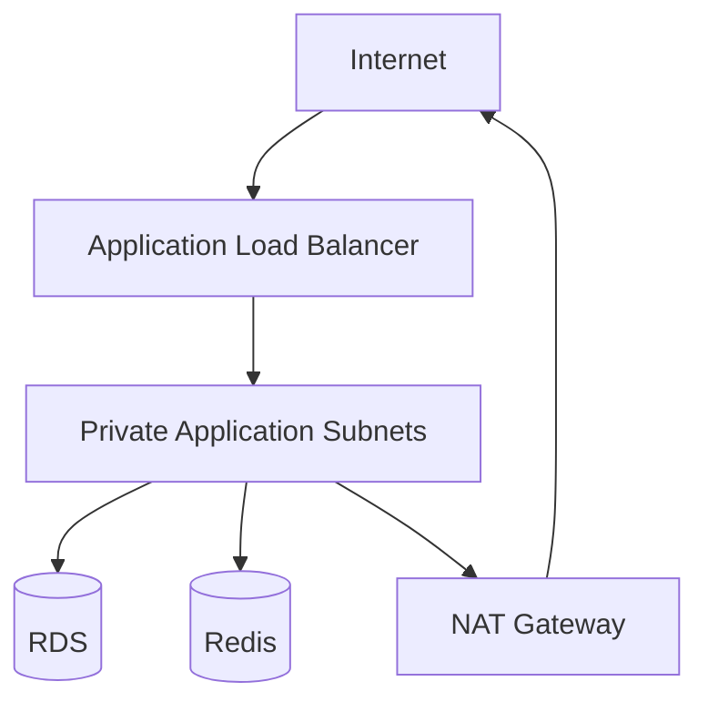
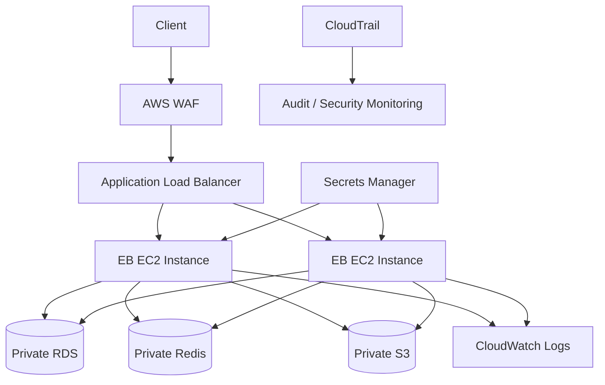

# 04- Security Questions

## Overview

Security questions for Amazon Elastic Beanstalk typically evaluate whether an engineer understands how to secure the **application, environment, network, identity, secrets, deployment pipeline, and underlying AWS resources**.

A strong production design treats Elastic Beanstalk as an orchestration layer rather than a security boundary by itself.

```text
                    Internet
                       |
                       v
                 HTTPS / TLS
                       |
                       v
              Load Balancer
                       |
              +--------+--------+
              |                 |
              v                 v
        EC2 Instance       EC2 Instance
        Beanstalk App      Beanstalk App
              |                 |
              +--------+--------+
                       |
             Private Dependencies
              |        |        |
              v        v        v
           RDS      Redis     Other AWS
```

Security should be addressed across multiple layers:

| Layer | Primary controls |
|---|---|
| Identity | IAM roles, least privilege |
| Network | VPC, subnets, security groups |
| Transport | TLS/HTTPS |
| Application | Authentication, authorization, input validation |
| Secrets | Secrets Manager, Systems Manager Parameter Store |
| Compute | Instance profiles, patching, platform updates |
| Storage | Encryption, restrictive access policies |
| Deployment | CI/CD permissions, artifact security |
| Monitoring | CloudWatch, CloudTrail, alerts |
| Data | Encryption, backups, access control |

## IAM and Identity

### How does IAM fit into Elastic Beanstalk security?

**Answer:**

Elastic Beanstalk relies heavily on IAM to control what the service, EC2 instances, deployment pipeline, and operators are allowed to do.

A typical environment involves different identities:

```text
Developer / CI Pipeline
        |
        v
Elastic Beanstalk API
        |
        v
Environment
        |
        v
EC2 Instance
        |
        v
Instance Profile / IAM Role
        |
        v
AWS Services
```

These identities should have different responsibilities.

A production application should not use an administrator-level IAM role simply because it is convenient.

### What is an EC2 instance profile?

**Answer:**

An instance profile provides an IAM role to an EC2 instance.

The application running on the instance can then obtain temporary AWS credentials through the instance metadata service and use permissions granted to that role.

For example, a Django application might need to read objects from a specific S3 bucket.

A safer policy is:

```text
EC2
 |
 v
IAM Role
 |
 +--> s3:GetObject
      specific-bucket/specific-prefix/*
```

rather than:

```text
EC2
 |
 v
AdministratorAccess
```

### Why should applications use IAM roles instead of access keys?

**Answer:**

IAM roles provide temporary credentials and eliminate the need to embed long-lived access keys in application configuration.

Avoid:

```python
AWS_ACCESS_KEY_ID = "hard-coded-key"
AWS_SECRET_ACCESS_KEY = "hard-coded-secret"
```

Prefer:

```text
Application
    |
    v
IAM Role
    |
    v
Temporary AWS Credentials
    |
    v
AWS API
```

This reduces credential leakage and rotation problems.

### What is least privilege?

**Answer:**

Least privilege means granting an identity only the permissions required to perform its intended operations.

For example, if a Django API only needs to read objects from one S3 prefix, it should not receive permission to:

- Delete arbitrary S3 objects
- Modify IAM
- Create EC2 instances
- Read unrelated buckets

A useful permission model is:

```text
Required Action
      |
      v
Required Resource
      |
      v
Required Identity
      |
      v
Minimal Permission
```

### What is the difference between the service role and instance profile?

**Answer:**

They serve different purposes.

| Identity | Purpose |
|---|---|
| Elastic Beanstalk service role | Allows Elastic Beanstalk to perform required AWS operations |
| EC2 instance profile | Gives application instances permissions to access AWS resources |

Do not assume permissions assigned to one identity automatically apply to the other.

### What is the risk of using AdministratorAccess for Elastic Beanstalk?

**Answer:**

It creates a large blast radius.

If the credentials or role are compromised, an attacker may gain the ability to modify or destroy unrelated AWS resources.

Use managed policies where appropriate, then reduce permissions further using custom policies when the workload requires tighter control.

## Network Security

### How should a production Elastic Beanstalk environment be placed inside a VPC?

**Answer:**

A common architecture is:



The exact topology depends on application requirements, but production environments commonly avoid exposing application instances directly to the public internet.

### Should Elastic Beanstalk EC2 instances be public?

**Answer:**

Not necessarily.

A stronger architecture is to expose the load balancer publicly while keeping application instances in private subnets.

```text
Internet
   |
   v
Public Load Balancer
   |
   v
Private EC2 Instances
   |
   +--> Private RDS
   +--> Private Redis
```

This reduces the number of directly reachable resources.

### What are security groups?

**Answer:**

Security groups act as stateful network firewalls attached to AWS resources such as EC2 instances and load balancers.

A typical configuration is:

```text
Internet
   |
   | HTTPS :443
   v
ALB Security Group
   |
   | Application port
   v
EC2 Security Group
   |
   | PostgreSQL :5432
   v
RDS Security Group
```

The EC2 security group should accept application traffic from the load balancer security group rather than from the entire internet.

### Why is `0.0.0.0/0` dangerous?

**Answer:**

A rule such as:

```text
TCP 5432
Source: 0.0.0.0/0
```

allows traffic from anywhere on the internet.

For a database, this is usually an unnecessary exposure.

Prefer security-group-to-security-group rules:

```text
RDS
 |
 +--> Allow TCP 5432
      Source: Application Security Group
```

### Should SSH be open to the internet?

**Answer:**

Prefer avoiding direct SSH exposure where possible.

If administrative access is required, restrict it to trusted network sources or use controlled AWS access mechanisms such as Systems Manager where supported by the environment.

Avoid:

```text
TCP 22
0.0.0.0/0
```

as a default production configuration.

## HTTPS and TLS

### How should HTTPS be configured for Elastic Beanstalk?

**Answer:**

Production traffic should normally use HTTPS.

A common architecture is:

```text
Client
  |
  | HTTPS
  v
Load Balancer
  |
  | HTTP or HTTPS
  v
Application Instances
```

TLS can terminate at the load balancer, reducing certificate-management responsibility on every application instance.

For stronger end-to-end encryption requirements:

```text
Client
  |
 HTTPS
  v
Load Balancer
  |
 HTTPS
  v
Application
```

### Where should TLS certificates be managed?

**Answer:**

Use AWS Certificate Manager for certificates used with supported AWS load-balancing infrastructure.

Avoid manually copying private keys to every EC2 instance unless there is a specific architectural requirement.

### Why is HTTPS termination at the load balancer useful?

**Answer:**

It centralizes certificate management and TLS configuration.

Instead of:

```text
Certificate
    |
    +--> EC2 A
    +--> EC2 B
    +--> EC2 C
    +--> EC2 D
```

the certificate can be managed at the load-balancing layer:

```text
Certificate
    |
    v
Load Balancer
    |
    +--> EC2 A
    +--> EC2 B
    +--> EC2 C
```

This simplifies operations and certificate rotation.

### What application settings are important when TLS terminates at a proxy?

**Answer:**

The application must correctly understand forwarded protocol information.

For Django, proxy and secure-cookie configuration must be designed carefully so that HTTPS requests are not incorrectly interpreted as HTTP.

For example:

```python
SECURE_SSL_REDIRECT = True
SESSION_COOKIE_SECURE = True
CSRF_COOKIE_SECURE = True
```

The exact configuration must account for how the load balancer forwards requests.

Incorrect proxy configuration can create redirect loops or weaken security behavior.

## Secrets Management

### Where should application secrets be stored?

**Answer:**

Do not store production secrets directly in source code or commit them to Git.

Use appropriate managed services such as:

- AWS Secrets Manager
- AWS Systems Manager Parameter Store

For example:

```text
Django / FastAPI
      |
      v
Secret Manager
      |
      v
Database Password
```

### What secrets should never be committed to Git?

**Answer:**

Examples include:

- Database passwords
- AWS access keys
- API tokens
- OAuth client secrets
- Private keys
- JWT signing secrets
- Encryption keys

Even private repositories should not be treated as secret stores.

### What should you do if a secret is accidentally committed?

**Answer:**

Do not simply delete the file and create another commit.

Assume the secret may already be compromised.

A safer response is:

1. Revoke or rotate the credential.
2. Remove the secret from the repository history where appropriate.
3. Identify systems using the credential.
4. Review access logs.
5. Replace the credential in the application.
6. Investigate whether unauthorized access occurred.

The most important step is **credential rotation**.

### Should secrets be stored as Elastic Beanstalk environment variables?

**Answer:**

Environment variables are useful for application configuration, but sensitive values should be handled carefully.

If using environment variables for secrets, consider how those values can be exposed through:

- Application diagnostics
- Process inspection
- Logs
- Configuration exports
- Deployment tooling
- Debugging

For sensitive production credentials, managed secret storage is generally preferable.

## Application Security

### Does Elastic Beanstalk secure the application automatically?

**Answer:**

No.

Elastic Beanstalk manages infrastructure and application deployment, but application-level security remains the application's responsibility.

For a Django or FastAPI API, you still need:

- Authentication
- Authorization
- Input validation
- Rate limiting where appropriate
- Secure session handling
- CSRF protection where applicable
- Secure headers
- Dependency management
- Error handling
- Logging and monitoring

### How should authentication and authorization be separated?

**Answer:**

Authentication answers:

> Who are you?

Authorization answers:

> What are you allowed to do?

For example:

```text
Request
  |
  v
Authentication
  |
  v
User Identity
  |
  v
Authorization
  |
  v
Resource Access
```

An authenticated user should not automatically receive unrestricted access.

### How should API secrets be protected?

**Answer:**

Do not expose backend credentials to clients.

For example:

```text
Browser
   |
   | User Token
   v
Backend API
   |
   | Server-side credentials
   v
AWS / Database / External API
```

Server-side credentials should remain on the backend.

## Data Encryption

### How should data at rest be protected?

**Answer:**

Use encryption mechanisms provided by AWS services.

Common examples include:

- RDS encryption
- S3 server-side encryption
- EBS encryption
- Secrets Manager encryption

The exact configuration depends on the service.

### Is encryption at rest enough?

**Answer:**

No.

Security should cover:

```text
Data at Rest
    +
Data in Transit
    +
Access Control
    +
Key Management
    +
Auditability
```

Encrypting a database does not protect it from an application role that has unrestricted access.

### What is AWS KMS used for?

**Answer:**

AWS Key Management Service provides managed cryptographic key management for supported AWS services and applications.

KMS can be used to control and audit cryptographic operations and to manage customer-managed keys where required.

A senior-level answer should distinguish:

```text
Encryption
    |
    v
Cryptographic protection

KMS
    |
    v
Key management and control
```

KMS is not itself a replacement for authorization.

## S3 Security

### How would you securely allow an Elastic Beanstalk application to access S3?

**Answer:**

Give the EC2 instance profile only the required S3 permissions.

For example:

```json
{
  "Version": "2012-10-17",
  "Statement": [
    {
      "Effect": "Allow",
      "Action": [
        "s3:GetObject"
      ],
      "Resource": "arn:aws:s3:::my-private-bucket/uploads/*"
    }
  ]
}
```

The application can then use its IAM role rather than embedding access keys.

### Should the S3 bucket be public?

**Answer:**

Usually not for private application data.

Keep the bucket private and expose objects through controlled mechanisms such as:

- Application authorization
- Pre-signed URLs
- CloudFront with appropriate origin controls

The correct choice depends on whether the content is intentionally public.

## Database Security

### How should an Elastic Beanstalk application connect to RDS securely?

**Answer:**

A common architecture is:

```text
Elastic Beanstalk EC2
       |
       | Private network
       v
RDS
```

Security groups should restrict database access to the application layer.

For PostgreSQL:

```text
RDS Security Group
    |
    +--> TCP 5432
         Source: Application Security Group
```

Avoid allowing database access from the entire internet.

### Should database credentials be hardcoded in Django settings?

**Answer:**

No.

Avoid:

```python
DATABASES = {
    "default": {
        "ENGINE": "django.db.backends.postgresql",
        "PASSWORD": "production-password"
    }
}
```

Instead, retrieve credentials from a secure configuration mechanism.

### Should RDS be placed in a public subnet?

**Answer:**

For typical backend applications, RDS should generally be deployed privately and should not require direct public internet access.

The application layer communicates with it through the VPC.

## Logging and Monitoring Security

### What AWS service records API activity?

**Answer:**

AWS CloudTrail records AWS API activity and provides an audit trail of actions performed against AWS resources.

For example, it can help answer:

```text
Who changed this IAM policy?
Who modified this environment?
Who changed this security group?
When did the change occur?
```

### What should application logs contain?

**Answer:**

Useful logs can include:

- Request identifiers
- Endpoint
- HTTP method
- Response status
- Latency
- Relevant application events
- Error information

Avoid logging secrets or sensitive user information unnecessarily.

### What should never be logged?

**Answer:**

Avoid logging:

- Passwords
- Access tokens
- API keys
- Session secrets
- Private keys
- Database credentials
- Sensitive personal information

A common mistake is logging complete request headers for debugging and accidentally exposing authorization tokens.

### How should logs be protected?

**Answer:**

Treat logs as sensitive operational data.

Controls should include:

- Restricted IAM access
- Appropriate retention
- Encryption
- Monitoring
- Sensitive-data filtering
- Controlled export

Logging something securely does not make the underlying data non-sensitive.

## CI/CD Security

### How should Elastic Beanstalk deployments from GitHub Actions be secured?

**Answer:**

Prefer short-lived AWS credentials through OIDC rather than long-lived IAM access keys.

Conceptually:

```text
GitHub Actions
      |
      | OIDC Identity Token
      v
AWS IAM
      |
      | Assume Role
      v
Temporary Credentials
      |
      v
Elastic Beanstalk
```

The deployment role should have only the permissions required by the deployment process.

### What is the risk of giving CI/CD AdministratorAccess?

**Answer:**

A compromise of the CI/CD pipeline could become a compromise of the entire AWS account.

If an attacker gains control of the pipeline:

```text
Compromised CI
     |
     v
Administrator IAM Role
     |
     +--> EC2
     +--> S3
     +--> RDS
     +--> IAM
     +--> Other AWS Resources
```

This creates a very large blast radius.

### How should deployment permissions be designed?

**Answer:**

Separate deployment responsibilities from administrative responsibilities.

For example:

```text
CI Role
 |
 +--> Elastic Beanstalk deployment operations
 +--> Required artifact access
 +--> Required infrastructure operations
```

Do not grant unrelated permissions simply because they make deployment easier.

## Platform and Host Security

### How does Elastic Beanstalk help with host management?

**Answer:**

Elastic Beanstalk manages much of the underlying environment lifecycle, including platform versions and instance provisioning.

However, teams still need to manage:

- Platform updates
- Application dependencies
- Configuration
- IAM permissions
- Network security
- Logging
- Vulnerability management

Managed infrastructure reduces operational burden; it does not remove security responsibility.

### Why are platform updates security-relevant?

**Answer:**

Platform updates can contain security patches for:

- Operating system packages
- Language runtimes
- Web servers
- System libraries
- Other platform components

Running obsolete platform versions can leave known vulnerabilities unpatched.

### Should platform updates be tested?

**Answer:**

Yes.

A production platform update can affect:

- Runtime behavior
- Dependency compatibility
- TLS behavior
- OS packages
- Native Python dependencies
- Web server configuration

Test the application against the target platform before production rollout.

## Security Headers and Web Security

### What HTTP security controls should a Django or FastAPI application consider?

**Answer:**

Depending on the application, consider:

- HTTPS enforcement
- HSTS
- Secure cookies
- HttpOnly cookies
- SameSite configuration
- Content Security Policy
- Clickjacking protection
- MIME-sniffing protection
- CORS restrictions

The exact configuration should match the application's authentication and frontend architecture.

### Is CORS a security mechanism?

**Answer:**

CORS is a browser-enforced cross-origin access control mechanism. It is not a replacement for authentication or authorization.

For example:

```text
Browser
   |
   | Cross-origin request
   v
API
   |
   v
CORS Policy
```

A restrictive CORS policy does not prevent a malicious non-browser client from directly calling the API.

Authentication and authorization must still be enforced server-side.

## DDoS and Abuse Protection

### Does Elastic Beanstalk protect an application from all DDoS attacks?

**Answer:**

No.

AWS provides infrastructure-level protections, but applications may still require additional controls depending on their exposure and risk profile.

Potential layers include:

```text
Internet
   |
   v
AWS Edge Protection
   |
   v
WAF
   |
   v
Load Balancer
   |
   v
Elastic Beanstalk
   |
   v
Application
```

AWS WAF can help with application-layer filtering and rate-based controls.

### Why is application-level rate limiting still useful?

**Answer:**

A request can be technically valid but still abusive.

For example:

```text
POST /login
POST /login
POST /login
...
```

Rate limiting can reduce:

- Brute-force attempts
- API abuse
- Resource exhaustion
- Expensive endpoint abuse

For distributed applications, rate limiting may need to use shared infrastructure such as Redis rather than process-local memory.

## Security Architecture

### How would you design a secure Elastic Beanstalk architecture?

**Answer:**

A production architecture could look like:



Important controls include:

- Public access only where required
- Private application instances
- Restricted security groups
- HTTPS
- IAM roles
- Managed secrets
- Encryption
- Centralized logging
- Audit trails
- WAF where appropriate
- Regular platform updates

## Security Incident Response

### What would you do if an Elastic Beanstalk instance was compromised?

**Answer:**

The first priority is containment.

A practical response is:

```text
Detection
   |
   v
Contain
   |
   v
Preserve Evidence
   |
   v
Rotate Credentials
   |
   v
Replace / Rebuild Instance
   |
   v
Validate Environment
   |
   v
Investigate Root Cause
```

Avoid simply rebooting the instance and assuming the problem is solved.

If the environment is designed to be reproducible, replacing compromised instances with known-good instances is generally safer than manually cleaning a compromised host.

### Why is immutable infrastructure useful during a security incident?

**Answer:**

If instances can be recreated from trusted artifacts and configuration:

```text
Compromised Instance
       |
       v
Terminate / Replace
       |
       v
Known-good Image / Platform
       |
       v
Reprovisioned Instance
```

This reduces reliance on manual cleanup.

However, replacing the host does not eliminate persistence elsewhere, so credentials, IAM policies, application artifacts, and other resources must also be investigated.

## Common Security Mistakes

| Mistake | Risk | Better approach |
|---|---|---|
| Hardcoded AWS keys | Credential compromise | IAM roles |
| AdministratorAccess for applications | Large blast radius | Least privilege |
| Public database | Direct attack surface | Private subnets |
| `0.0.0.0/0` database access | Unrestricted network access | Security-group restriction |
| Public S3 bucket | Data exposure | Private bucket + controlled access |
| Secrets in Git | Credential leakage | Managed secret storage |
| Long-lived CI credentials | Pipeline compromise | OIDC / short-lived credentials |
| HTTP-only production traffic | Data interception | HTTPS |
| Open SSH access | Host attack surface | Restricted access / Systems Manager |
| Logging authorization headers | Token leakage | Redact sensitive headers |
| Ignoring platform updates | Known vulnerabilities | Regular patching |
| Excessive IAM permissions | Large compromise radius | Least privilege |
| No CloudTrail monitoring | Poor auditability | Centralized audit monitoring |
| Treating CORS as authentication | Unauthorized API access | Server-side authorization |
| No credential rotation process | Long-lived compromise | Automated rotation where practical |
| Manual instance modification | Configuration drift | Reproducible deployments |

## Interview Traps

### Is an Elastic Beanstalk environment secure by default?

**Answer:**

No.

AWS provides security capabilities, but production security depends on how the environment is configured.

Security requires deliberate controls around:

- IAM
- VPC
- Security groups
- TLS
- Secrets
- Application code
- Dependencies
- Logging
- Platform updates

### Does putting an application in a private subnet make it secure?

**Answer:**

No.

Private networking reduces direct exposure but does not prevent:

- Application vulnerabilities
- Compromised IAM credentials
- Malicious internal traffic
- Vulnerable dependencies
- Insecure authorization
- Data exfiltration

Network isolation is one security layer, not the complete security model.

### Are security groups enough to secure a production API?

**Answer:**

No.

Security groups control network traffic, but application security still requires authentication, authorization, input validation, secure secrets, dependency management, monitoring, and other controls.

### Does encryption eliminate the need for access control?

**Answer:**

No.

Encryption protects data from certain forms of unauthorized access, but authorized identities can still misuse data if IAM and application authorization are too permissive.

### Is a private S3 bucket automatically safe?

**Answer:**

No.

Incorrect IAM policies, compromised credentials, overly broad bucket policies, or application vulnerabilities can still expose private objects.

### Should an application use an IAM user with access keys?

**Answer:**

Prefer IAM roles and temporary credentials for workloads running on AWS.

Long-lived IAM user access keys create additional credential management and rotation risk.

### Is HTTPS enough to secure an API?

**Answer:**

No.

HTTPS protects data in transit, but it does not determine whether the caller is authorized to perform an operation.

You still need:

```text
HTTPS
 +
Authentication
 +
Authorization
 +
Input Validation
 +
Secure Application Logic
```

## Scenario-Based Security Questions

### An application needs to read private S3 objects. How would you secure it?

**Answer:**

Use the Elastic Beanstalk EC2 instance profile with narrowly scoped S3 permissions.

```text
Application
    |
    v
EC2 Instance Role
    |
    +--> s3:GetObject
         specific bucket/prefix
```

Do not embed S3 access keys in the application.

### A developer asks for AdministratorAccess because the application keeps receiving AccessDenied errors. What do you do?

**Answer:**

Do not grant AdministratorAccess as the first response.

Instead:

1. Identify the failed AWS API operation.
2. Identify the resource being accessed.
3. Determine why the permission is required.
4. Add the minimum required permission.
5. Test the application.
6. Review whether the permission can be further restricted.

This follows least-privilege principles.

### Your database is accessible from the internet. What would you change?

**Answer:**

First remove unnecessary public exposure.

A typical target architecture is:

```text
Internet
   |
   v
Public Load Balancer
   |
   v
Private Application Instances
   |
   v
Private RDS
```

Then restrict RDS security-group ingress to the application security group.

Also verify:

- Database authentication
- Encryption
- Credential storage
- Logging
- Backup configuration
- Network routing

### An AWS access key appears in a Git repository. What is your first action?

**Answer:**

Treat the credential as compromised and rotate or revoke it immediately.

After containment:

- Remove the credential from source control.
- Investigate usage.
- Replace the application configuration.
- Review CloudTrail activity.
- Determine whether other credentials or resources were exposed.

Removing the text from the latest commit is not sufficient if the credential remains in repository history.

### A production application requires database passwords, API keys, and JWT secrets. How would you manage them?

**Answer:**

Use a managed secret/configuration system rather than committing them to source control.

For sensitive values, AWS Secrets Manager is a common choice.

The application receives access through its IAM role:

```text
Application
    |
    v
IAM Role
    |
    v
Secrets Manager
    |
    v
Secret Value
```

The IAM permission should restrict access to the specific secrets required by the application.

### An attacker obtains the application's IAM credentials. How do you limit the damage?

**Answer:**

Use multiple layers:

- Least-privilege IAM policies
- Temporary credentials
- Private networking
- Restricted security groups
- Resource-level permissions
- CloudTrail auditing
- Credential rotation
- Guardrails and detection
- Separation of application and administrative roles

The goal is to minimize the blast radius of a single compromised identity.

## Security Checklist

### Identity

- [ ] Application uses IAM roles instead of long-lived access keys.
- [ ] IAM policies follow least privilege.
- [ ] CI/CD uses short-lived credentials where possible.
- [ ] Deployment permissions are separated from administrative permissions.
- [ ] Human access uses controlled IAM identities.

### Network

- [ ] Application instances are not unnecessarily public.
- [ ] Databases are private.
- [ ] Security groups allow only required traffic.
- [ ] SSH access is restricted or replaced with managed access.
- [ ] Administrative endpoints are not publicly exposed.

### Transport

- [ ] Production traffic uses HTTPS.
- [ ] TLS certificates are centrally managed.
- [ ] Secure cookies are enabled where applicable.
- [ ] Proxy forwarding is configured correctly.
- [ ] HTTP-to-HTTPS behavior is tested.

### Secrets

- [ ] No credentials are committed to Git.
- [ ] Production secrets use managed secret storage.
- [ ] IAM permissions to secrets are restricted.
- [ ] Credential rotation procedures exist.
- [ ] Sensitive values are excluded from logs.

### Application

- [ ] Authentication is implemented correctly.
- [ ] Authorization is enforced server-side.
- [ ] Input validation is applied.
- [ ] Dependency vulnerabilities are monitored.
- [ ] Security headers are configured appropriately.
- [ ] Rate limiting exists where required.

### AWS Resources

- [ ] S3 buckets are private unless public access is intentional.
- [ ] RDS encryption is enabled where required.
- [ ] EBS encryption is enabled where required.
- [ ] Secrets are encrypted.
- [ ] IAM policies are regularly reviewed.
- [ ] Platform versions are maintained.

### Monitoring and Audit

- [ ] CloudTrail is enabled.
- [ ] Application logs are centralized.
- [ ] Sensitive data is redacted.
- [ ] Authentication and authorization failures are monitored.
- [ ] Security-related alerts are configured.
- [ ] Incident-response procedures are documented.

## Key Takeaways

- Elastic Beanstalk does not automatically secure the application; security remains a shared responsibility.
- Use IAM roles and temporary credentials instead of embedding long-lived AWS access keys.
- Apply least privilege to application, deployment, and administrative identities.
- Keep application instances and databases private where public access is not required.
- Restrict security-group rules to known sources and required ports.
- Use HTTPS for production traffic and manage certificates through appropriate AWS services.
- Never commit passwords, API keys, private keys, or other secrets to Git.
- Prefer managed secret storage such as AWS Secrets Manager or Systems Manager Parameter Store.
- Use instance profiles to grant applications narrowly scoped access to AWS resources such as S3.
- Encryption at rest does not replace IAM, authorization, or network controls.
- CORS is not authentication and does not replace server-side authorization.
- Keep production databases private and restrict access through security groups.
- Prefer short-lived CI/CD credentials and OIDC-based authentication where supported.
- Avoid granting AdministratorAccess to applications or deployment pipelines simply to resolve permission errors.
- CloudTrail provides important audit evidence for AWS API activity.
- Application logs should be useful for debugging without exposing credentials or sensitive data.
- Regular Elastic Beanstalk platform updates are an important part of host and runtime security.
- Private subnets reduce exposure but do not protect against application vulnerabilities or compromised identities.
- Security should be layered across identity, network, transport, application, data, deployment, and monitoring controls.
- The strongest production security posture minimizes both the probability of compromise and the blast radius when a control fails.