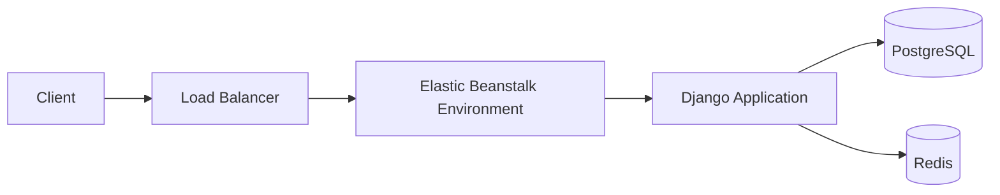
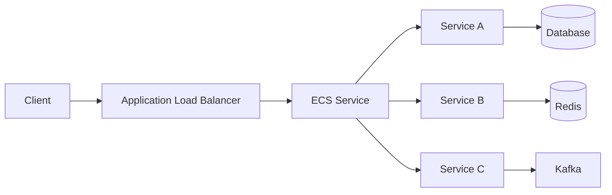

# 06- AWS Service Comparison Questions

## Overview

AWS Elastic Beanstalk is a managed application platform that provisions and operates underlying AWS infrastructure such as EC2 instances, load balancers, Auto Scaling, and platform runtimes while allowing engineers to deploy application code without managing every infrastructure component directly.

In interviews, Elastic Beanstalk is commonly compared with services such as:

- Amazon EC2
- Amazon ECS
- Amazon EKS
- AWS Lambda
- AWS App Runner
- Amazon Lightsail
- AWS Fargate

The important distinction is not simply what each service does, but **which operational responsibility belongs to AWS and which remains with the engineering team**.

A useful decision model is:

```text
Application deployment requirement
              |
              v
     How much infrastructure
        control is required?
              |
      +-------+-------+
      |               |
     Low             High
      |               |
      v               v
Managed platform    Infrastructure
      |               |
      v               v
Elastic Beanstalk   EC2 / EKS
App Runner
Lambda
```

## Elastic Beanstalk vs EC2

### What is the difference between Elastic Beanstalk and EC2?

**Answer:**

Amazon EC2 provides virtual machines. Elastic Beanstalk provides a managed application environment that uses AWS infrastructure, including EC2, while automating much of the deployment and environment management.

| Area | Elastic Beanstalk | EC2 |
|---|---|---|
| Primary abstraction | Application environment | Virtual machine |
| EC2 management | Managed by Beanstalk | Managed by engineer |
| Load balancer | Can be managed automatically | Configure separately |
| Auto Scaling | Integrated | Configure separately |
| Application deployment | Simplified | Manual or custom automation |
| OS management | Platform-managed | Engineer-managed |
| Infrastructure control | Moderate | High |
| Operational overhead | Lower | Higher |
| Customization | More constrained | Very high |
| Best fit | Conventional web applications | Custom infrastructure requirements |

### When would you choose EC2 over Elastic Beanstalk?

Choose EC2 when you need significant control over:

- Operating system configuration
- Custom system packages
- Specialized networking
- Custom agents
- Non-standard application runtimes
- Custom process management
- Specialized infrastructure architecture

Elastic Beanstalk is preferable when the application fits its supported platform model and the team wants to reduce infrastructure-management overhead.

### Is Elastic Beanstalk built on top of EC2?

**Answer:**

For environments using EC2-based platforms, yes. Elastic Beanstalk provisions and manages underlying AWS resources on behalf of the application environment.

The important distinction is the abstraction level:

```text
Elastic Beanstalk
       |
       +--> EC2
       +--> Auto Scaling
       +--> Load Balancer
       +--> Security Groups
       +--> CloudWatch
       |
       v
    Application
```

You interact primarily with the Elastic Beanstalk environment rather than manually managing every EC2 lifecycle operation.

## Elastic Beanstalk vs ECS

### What is the difference between Elastic Beanstalk and ECS?

**Answer:**

Elastic Beanstalk is an application platform. Amazon ECS is a container orchestration service.

| Area | Elastic Beanstalk | ECS |
|---|---|---|
| Primary abstraction | Application environment | Containers/tasks |
| Container support | Supported in specific deployment models | Native |
| Infrastructure control | Moderate | Higher |
| Container orchestration | Managed by Beanstalk | ECS |
| Deployment flexibility | Moderate | High |
| Service discovery | Limited compared with ECS architectures | Strong integration |
| Microservices | Possible, but less natural | Strong fit |
| Operational complexity | Lower | Higher |
| Best fit | Conventional applications | Containerized workloads |

### When should you choose ECS instead of Elastic Beanstalk?

ECS is generally a stronger choice when:

- The organization standardizes on containers.
- Multiple independently deployable services are required.
- Container-level resource control matters.
- Task-level scaling is required.
- Service discovery is important.
- You need ECS-specific deployment patterns.
- You want a container-native architecture.

For a Django or FastAPI monolith that does not require container orchestration, Elastic Beanstalk can be simpler.

## Elastic Beanstalk vs Fargate

### What is the difference between Elastic Beanstalk and Fargate?

These services operate at different abstraction levels.

AWS Fargate is a serverless compute engine for containers. It is commonly used with ECS or EKS.

```text
Elastic Beanstalk
      |
      v
Application Environment
      |
      v
Managed Infrastructure

ECS + Fargate
      |
      v
Container Task
      |
      v
AWS-managed compute capacity
```

| Area | Elastic Beanstalk | ECS + Fargate |
|---|---|---|
| Application model | Platform/application | Container |
| Server management | Abstracted | Abstracted |
| Container-native | Not primarily | Yes |
| Task-level control | Limited | Strong |
| Microservices | Possible | Strong fit |
| Container orchestration | Beanstalk model | ECS |
| Infrastructure overhead | Low | Low to moderate |
| Flexibility | Moderate | High |

### When would you choose Fargate?

Choose Fargate when you want:

- Containerized deployments
- No EC2 instance management
- ECS task-level scaling
- Microservices
- Container-specific resource definitions
- Fine-grained service deployment control

## Elastic Beanstalk vs EKS

### What is the difference between Elastic Beanstalk and EKS?

Amazon EKS is a managed Kubernetes control plane. Elastic Beanstalk is a managed application platform.

| Area | Elastic Beanstalk | EKS |
|---|---|---|
| Orchestration | Beanstalk | Kubernetes |
| Abstraction | Application | Kubernetes resources |
| Complexity | Lower | Much higher |
| Kubernetes knowledge | Not required | Required |
| Portability | Moderate | High Kubernetes portability |
| Container orchestration | Limited | Advanced |
| Custom scheduling | Limited | Extensive |
| Service mesh | Not native | Kubernetes ecosystem |
| Operational overhead | Low | High |
| Best fit | Conventional web applications | Kubernetes-based platforms |

### When is EKS justified?

EKS becomes appropriate when Kubernetes capabilities provide meaningful architectural value.

Examples include:

- Large container platforms
- Complex microservice ecosystems
- Kubernetes-standardized organizations
- Advanced scheduling
- Custom controllers/operators
- Kubernetes-native tooling
- Multi-cluster architectures
- Advanced service networking

Using Kubernetes simply because it is technically capable can introduce unnecessary operational complexity.

### Is EKS always better than Elastic Beanstalk?

**Answer:**

No.

The correct question is:

> Does the application's operational complexity justify Kubernetes?

For a small Django API:

```text
Django
  |
  v
Elastic Beanstalk
```

may be operationally preferable to:

```text
Django
  |
  v
Docker
  |
  v
Kubernetes
  |
  v
EKS
```

The second architecture introduces significantly more infrastructure and operational responsibilities.

## Elastic Beanstalk vs Lambda

### What is the difference between Elastic Beanstalk and Lambda?

**Answer:**

Elastic Beanstalk is designed primarily around continuously running application environments. AWS Lambda is event-driven serverless compute.

| Area | Elastic Beanstalk | Lambda |
|---|---|---|
| Execution model | Long-running application | Event-driven |
| Server management | Managed | Fully abstracted |
| Runtime | Platform-based | Lambda runtimes |
| Scaling | Instance/application environment | Invocation-based |
| Request duration | Application/platform dependent | Lambda limits apply |
| Background processes | Suitable | Requires event-oriented design |
| Containers | Supported in certain models | Container images supported |
| State | Externalize state | Externalize state |
| Best fit | Web applications | Functions/event processing |

### When should Lambda be preferred?

Lambda is a strong fit for:

- Event processing
- S3 events
- Scheduled jobs
- Lightweight APIs
- Queue consumers
- Stream processing
- Short-lived background operations

For a traditional Django application with persistent workers, Elastic Beanstalk is often a more natural deployment model.

### Can Lambda replace Elastic Beanstalk for a Django application?

Technically, portions of a Django application can be adapted to serverless execution, but it changes the architecture significantly.

A traditional Django deployment typically assumes:

```text
Load Balancer
     |
     v
Web Server
     |
     v
Django Workers
     |
     +--> PostgreSQL
     +--> Redis
```

A Lambda-oriented architecture changes the execution model and may require additional services for:

- API routing
- Background execution
- Persistent connections
- Static assets
- Authentication
- Asynchronous processing

The decision should be based on workload characteristics rather than the desire to eliminate servers.

## Elastic Beanstalk vs App Runner

### What is the difference between Elastic Beanstalk and AWS App Runner?

AWS App Runner is a managed service designed to deploy web applications and APIs from source code or container images with less infrastructure configuration.

| Area | Elastic Beanstalk | App Runner |
|---|---|---|
| Abstraction | Application environment | Managed web application |
| Deployment | Platform/application based | Source or container based |
| Infrastructure control | Moderate | Lower |
| Customization | Higher | Lower |
| Containers | Supported | Native |
| Scaling | Environment-based | Managed service scaling |
| Operational overhead | Low | Very low |
| Best fit | Applications needing Beanstalk controls | Simple managed web services |

### When would you choose App Runner over Elastic Beanstalk?

App Runner can be attractive when:

- You want a simpler managed deployment experience.
- Your application is already containerized.
- You do not need extensive infrastructure customization.
- You want AWS-managed deployment and scaling.
- You are deploying relatively straightforward web applications or APIs.

Elastic Beanstalk can be preferable when you need more control over the underlying environment and Beanstalk-specific configuration capabilities.

## Elastic Beanstalk vs Lightsail

### What is the difference between Elastic Beanstalk and Lightsail?

Amazon Lightsail is designed to simplify deployment of smaller applications and infrastructure with predictable bundled resources.

Elastic Beanstalk focuses more specifically on application deployment and environment management.

| Area | Elastic Beanstalk | Lightsail |
|---|---|---|
| Primary purpose | Application platform | Simplified cloud infrastructure |
| Scaling | Stronger application-oriented scaling | Simpler |
| Load balancing | Integrated environment capability | Available separately |
| Auto Scaling | Integrated | More limited |
| Production enterprise workloads | Stronger fit | Simpler workloads |
| Infrastructure abstraction | Application-focused | Simplified infrastructure |
| Best fit | Managed application deployment | Small/simple applications |

For a production backend that requires automated application scaling and environment-level deployment management, Elastic Beanstalk is generally the stronger abstraction.

## Elastic Beanstalk vs Kubernetes

### Why might a company choose Elastic Beanstalk instead of Kubernetes?

**Answer:**

The primary reason is operational simplicity.

Elastic Beanstalk reduces the amount of infrastructure engineering required to operate a conventional web application.

Kubernetes introduces additional concepts such as:

- Pods
- Deployments
- Services
- Ingress
- ConfigMaps
- Secrets
- Namespaces
- RBAC
- Operators
- Controllers
- Scheduling
- Cluster upgrades

The team should adopt those capabilities only when they provide meaningful value.

### What is the operational trade-off?

```text
More abstraction
      |
      v
Less infrastructure control
      |
      v
Lower operational complexity

Less abstraction
      |
      v
More infrastructure control
      |
      v
Higher operational complexity
```

Elastic Beanstalk sits closer to the managed-platform side of this spectrum.

## Elastic Beanstalk vs Traditional VM Deployment

### What is the difference between manually deploying to EC2 and using Elastic Beanstalk?

A manual EC2 deployment might look like:

```text
CI/CD
  |
  v
EC2
  |
  +--> OS updates
  +--> Python
  +--> Nginx
  +--> Gunicorn/Uvicorn
  +--> Application
  +--> Process management
  +--> Logs
  +--> Scaling
```

Elastic Beanstalk moves much of this environment management into the platform:

```text
CI/CD
  |
  v
Elastic Beanstalk
  |
  +--> EC2
  +--> Load Balancer
  +--> Auto Scaling
  +--> Platform Runtime
  +--> Health Management
```

This reduces operational work but also reduces some infrastructure-level control.

## Service Selection by Workload

| Workload | Strong candidate |
|---|---|
| Traditional Django monolith | Elastic Beanstalk |
| Traditional FastAPI application | Elastic Beanstalk |
| Simple managed web API | App Runner |
| Containerized microservices | ECS |
| Serverless event processing | Lambda |
| Kubernetes platform | EKS |
| Full VM control | EC2 |
| Small/simple infrastructure | Lightsail |
| Containerized workloads without server management | ECS + Fargate |

These are starting points rather than absolute rules. Networking, security, team expertise, compliance, cost, observability, and deployment requirements can change the decision.

## Architecture Comparison

### Conventional Django Application



This is a strong fit when the application is a conventional backend service and the team wants managed deployment without adopting a container orchestration platform.

### ECS-Based Microservices



ECS becomes more attractive when independent services, container-level scaling, and service-oriented deployment are important.

### Kubernetes-Based Platform


EKS provides significantly greater orchestration flexibility but requires substantially more Kubernetes expertise and operational discipline.

## Choosing Based on Operational Control

| Requirement | Elastic Beanstalk | EC2 | ECS | EKS | Lambda |
|---|---:|---:|---:|---:|---:|
| Minimal infrastructure management | High | Low | High | Medium | Very High |
| OS-level control | Low | High | Low | Low | None |
| Container-native | Medium | High | High | High | Medium |
| Kubernetes capabilities | No | No | No | High | No |
| Event-driven execution | Low | Low | Medium | Medium | High |
| Microservices | Medium | High | High | High | High |
| Operational simplicity | High | Low | Medium | Low | Very High |
| Custom infrastructure | Medium | Very High | High | Very High | Low |

## Decision-Making Questions

### What questions should you ask before choosing Elastic Beanstalk?

Consider:

- Is the application a conventional web application?
- Do we need container orchestration?
- Do we require OS-level customization?
- Does the team have Kubernetes expertise?
- Are workloads event-driven?
- Do we need task-level container scaling?
- How much infrastructure do we want to manage?
- Do we need advanced networking or scheduling?
- How complex is the deployment pipeline?
- What are the application's scaling characteristics?
- What level of platform portability is required?

### What is the most important architectural trade-off?

The fundamental trade-off is:

```text
Developer Productivity
          vs
Infrastructure Control
```

Elastic Beanstalk intentionally favors developer productivity and managed operations.

EC2, ECS, and EKS progressively expose more infrastructure and orchestration control.

Lambda pushes even more infrastructure responsibility into the AWS-managed platform but imposes a different execution model.

## Cost Considerations

### Is Elastic Beanstalk itself the main cost?

Elastic Beanstalk does not eliminate the cost of the underlying AWS resources.

An environment may incur costs from:

- EC2
- Load Balancers
- EBS
- Data transfer
- RDS
- CloudWatch
- NAT gateways
- Other attached AWS services

The architectural abstraction and the infrastructure bill are separate concerns.

### Is serverless always cheaper than Elastic Beanstalk?

**Answer:**

No.

Cost depends on:

- Request volume
- Execution duration
- Traffic pattern
- Idle capacity
- Instance utilization
- Database costs
- Network costs
- Scaling behavior

A continuously busy workload can have very different economics from a sporadic event-driven workload.

## Security Comparison

### Which service is more secure: Elastic Beanstalk, EC2, ECS, or EKS?

There is no universally correct answer.

Security depends heavily on architecture and operational practices.

| Concern | Elastic Beanstalk | EC2 | ECS | EKS |
|---|---|---|---|---|
| OS management | More managed | Engineer-managed | More managed | Worker management depends on architecture |
| IAM integration | Strong | Strong | Strong | Strong |
| Network control | Strong | Very strong | Strong | Very strong |
| Operational complexity | Lower | Higher | Medium | High |
| Configuration surface | Smaller | Large | Large | Very large |

More control also means more responsibility.

A simpler platform can reduce configuration mistakes, while a highly flexible platform can support stronger isolation and controls when operated correctly.

## Interview Traps

### Is Elastic Beanstalk serverless?

**Answer:**

No.

Elastic Beanstalk is a managed application platform, but EC2-based environments still use servers underneath.

### Does Elastic Beanstalk replace EC2?

**Answer:**

No.

Elastic Beanstalk manages application environments that can include EC2 instances and other AWS resources.

### Is Elastic Beanstalk equivalent to Kubernetes?

**Answer:**

No.

Elastic Beanstalk is a managed application deployment platform. Kubernetes is a container orchestration system.

### Is ECS the AWS equivalent of Kubernetes?

**Answer:**

Not exactly.

ECS and Kubernetes both orchestrate containers, but ECS is AWS's native container orchestration service while Kubernetes is an open-source orchestration platform. EKS provides managed Kubernetes control planes on AWS.

### Should every application be containerized and deployed through ECS?

**Answer:**

No.

Containers are valuable when their operational and deployment characteristics provide meaningful benefits. For a conventional application, Elastic Beanstalk can provide a simpler operational model.

### Why not always choose EKS if it provides the most flexibility?

**Answer:**

Flexibility creates operational responsibility.

EKS introduces additional complexity around:

- Cluster management
- Kubernetes networking
- RBAC
- Ingress
- Scheduling
- Upgrades
- Observability
- Security
- Resource management

Use the simplest platform that satisfies the actual requirements.

### Is Lambda always the best choice for APIs?

**Answer:**

No.

Lambda works well for event-driven and serverless workloads, but long-running applications, persistent workloads, specialized runtimes, and certain latency-sensitive systems may be better suited to other deployment models.

### Is EC2 always more powerful than Elastic Beanstalk?

**Answer:**

EC2 exposes more direct infrastructure control, but "more control" does not automatically mean "better architecture."

The correct platform depends on the application's requirements and the team's operational capabilities.

## Scenario-Based Questions

### You have a Django monolith and a small backend team. Which service would you consider first?

**Answer:**

Elastic Beanstalk is a reasonable candidate because it can provide:

- Managed application deployment
- Auto Scaling
- Load balancing
- Health management
- Platform runtime management

The final decision should still consider organizational standards and future architecture.

### You have 30 independently deployable containerized microservices. Which service is more appropriate?

**Answer:**

ECS or EKS would generally be more natural choices than Elastic Beanstalk.

The decision between ECS and EKS depends on whether Kubernetes capabilities are actually required.

### You have an application that receives S3 events and processes each object independently.

Which service is a natural candidate?

**Answer:**

Lambda is a strong candidate because the workload is event-driven and naturally decomposable into independent executions.

### You need complete control over the operating system and custom system software.

Which service would you choose?

**Answer:**

EC2 is generally the more appropriate abstraction because it provides direct control over the virtual machine.

### You want containers but do not want to manage EC2 capacity.

Which option is appropriate?

**Answer:**

ECS with Fargate is a strong candidate.

Fargate removes the need to manage the underlying container host capacity directly.

### Your organization already operates a large Kubernetes platform.

Would you choose Elastic Beanstalk for a new microservice?

**Answer:**

Not necessarily.

If Kubernetes is already the organizational standard and the service benefits from Kubernetes-native tooling, deploying it to EKS may provide better consistency.

The important interview point is to consider **organizational platform standards**, not just individual service capabilities.

## Senior-Level Decision Framework

A senior backend engineer should evaluate AWS services across several dimensions:

```text
                    Workload
                       |
        +--------------+--------------+
        |              |              |
   Execution       Packaging       Operations
     model            model          model
        |              |              |
   Long-running      Source       Managed
   Event-driven      Container    Self-managed
        |              |              |
        +--------------+--------------+
                       |
                       v
                 Scaling Model
                       |
                       v
              Infrastructure Control
                       |
                       v
               Team Capabilities
                       |
                       v
                  Cost / Risk
```

The decision should account for:

| Dimension | Questions |
|---|---|
| Workload | Continuous, bursty, or event-driven? |
| Packaging | Source code, VM, container, function? |
| Scaling | Instance, task, pod, or invocation-based? |
| Networking | How complex is the network topology? |
| Security | What isolation and IAM controls are required? |
| Operations | Who will maintain the platform? |
| Observability | What logging and monitoring model is required? |
| Deployment | How complex are releases and rollbacks? |
| Cost | What utilization pattern is expected? |
| Team | What platform expertise already exists? |
| Portability | Is AWS-specific architecture acceptable? |
| Reliability | What availability and recovery model is required? |

## Key Takeaways

- Elastic Beanstalk is a managed application platform, not a replacement for AWS infrastructure itself.
- Elastic Beanstalk is a strong fit for conventional web applications such as Django and FastAPI services when extensive infrastructure customization is unnecessary.
- EC2 provides the greatest direct virtual-machine control but requires significantly more operational work.
- ECS is a strong choice for containerized applications and microservice architectures.
- ECS with Fargate provides container execution without requiring direct management of the underlying EC2 capacity.
- EKS is appropriate when Kubernetes capabilities and ecosystem integration justify Kubernetes' operational complexity.
- Lambda is optimized for event-driven, short-lived serverless execution rather than being a universal replacement for traditional web applications.
- App Runner provides a highly managed deployment model for straightforward web applications and APIs, particularly when container or source-based deployment is sufficient.
- Lightsail targets simpler infrastructure and application scenarios rather than highly customized enterprise platforms.
- More infrastructure control generally means more operational responsibility.
- The simplest platform that satisfies the application's requirements is often the strongest engineering choice.
- Do not choose EKS merely because Kubernetes is more powerful.
- Do not choose Lambda merely because it is serverless.
- Do not choose ECS merely because the application can be containerized.
- Evaluate workload characteristics, scaling behavior, networking, security, team expertise, cost, operational burden, and organizational standards together.
- Elastic Beanstalk primarily optimizes for managed application deployment and reduced operational overhead.
- EC2 optimizes for infrastructure control.
- ECS optimizes for AWS-native container orchestration.
- EKS optimizes for Kubernetes-based orchestration.
- Lambda optimizes for event-driven serverless execution.
- Fargate optimizes for managed container compute without direct server management.