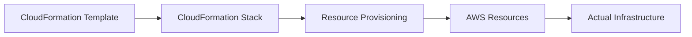
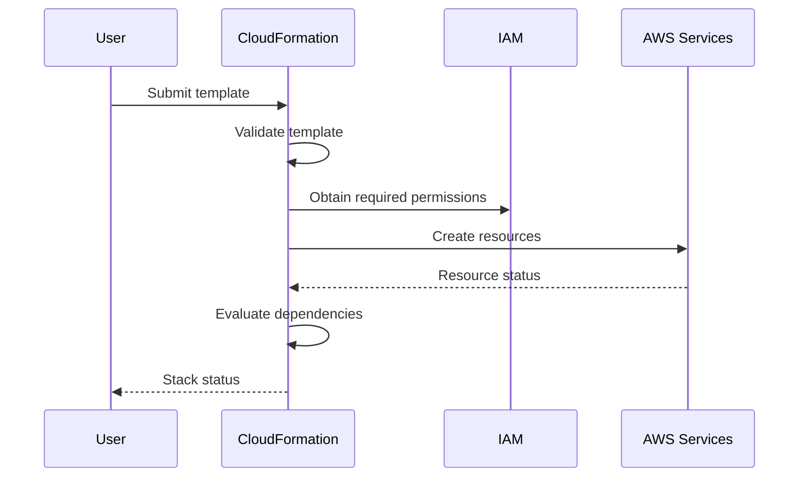
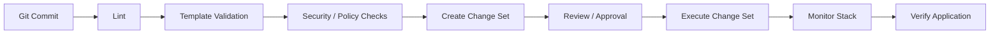

# 01- Core CloudFormation Questions

## Overview

AWS CloudFormation is an Infrastructure as Code (IaC) service used to define and manage AWS resources through declarative templates. In backend and platform engineering, CloudFormation provides a repeatable way to provision infrastructure such as VPCs, IAM roles, load balancers, databases, ECS services, Lambda functions, and supporting resources.

For interviews, CloudFormation questions usually progress from template fundamentals to stack lifecycle, resource dependencies, parameters, intrinsic functions, nested stacks, change sets, rollback behavior, drift detection, and production deployment practices.

The key distinction to understand is:

> A CloudFormation template describes the desired infrastructure state; a CloudFormation stack represents an instantiated deployment of that template.

## Core Concepts

### What is AWS CloudFormation?

CloudFormation is an AWS-native Infrastructure as Code service that allows infrastructure to be defined declaratively using templates.

A template describes resources and their configuration. CloudFormation interprets that template and creates or updates the corresponding AWS resources.

Typical resources include:

- VPCs
- Subnets
- Security groups
- IAM roles and policies
- EC2 instances
- Load balancers
- Auto Scaling groups
- S3 buckets
- RDS databases
- Lambda functions
- ECS services
- CloudWatch resources
- SNS and SQS resources

A simplified architecture is:



### Why use CloudFormation?

The primary reason is repeatability.

Instead of manually configuring infrastructure through the AWS Console, infrastructure can be version-controlled and deployed consistently.

Benefits include:

- Infrastructure version control
- Repeatable deployments
- Automated provisioning
- Environment consistency
- Dependency management
- Change tracking
- Rollback support
- CI/CD integration
- Infrastructure auditing

For example, the same template can be parameterized for development, staging, and production.

## Templates

### What is a CloudFormation template?

A CloudFormation template is a declarative document describing AWS infrastructure.

Templates can be written in:

- YAML
- JSON

YAML is generally easier to maintain for complex infrastructure.

Example:

```yaml
AWSTemplateFormatVersion: '2010-09-09'

Description: Basic production-oriented S3 bucket

Resources:
  ApplicationBucket:
    Type: AWS::S3::Bucket
    Properties:
      BucketEncryption:
        ServerSideEncryptionConfiguration:
          - ServerSideEncryptionByDefault:
              SSEAlgorithm: AES256
```

### What are the major sections of a CloudFormation template?

Common template sections include:

| Section | Purpose |
|---|---|
| `AWSTemplateFormatVersion` | Identifies the template format version |
| `Description` | Documents the template |
| `Parameters` | Accepts deployment-time values |
| `Mappings` | Stores static key-value mappings |
| `Conditions` | Controls conditional resource behavior |
| `Transform` | Applies macros or transforms |
| `Resources` | Defines AWS resources |
| `Outputs` | Exposes values from the stack |

`Resources` is the core section because it defines the infrastructure that CloudFormation manages.

### Which CloudFormation section is mandatory?

The `Resources` section is required for a valid CloudFormation template.

Other sections are optional depending on the template.

### What is the difference between Parameters and Resources?

Parameters provide input values.

Resources define infrastructure.

```yaml
Parameters:
  Environment:
    Type: String
    AllowedValues:
      - dev
      - staging
      - prod

Resources:
  ApplicationBucket:
    Type: AWS::S3::Bucket
```

A parameter can influence resource configuration:

```yaml
Properties:
  Tags:
    - Key: Environment
      Value: !Ref Environment
```

## Stacks

### What is a CloudFormation stack?

A stack is a deployed instance of a CloudFormation template.

For example:

```text
Template
   |
   +---- development-stack
   |
   +---- staging-stack
   |
   +---- production-stack
```

The same template can therefore be used to create multiple independent stacks.

### What is the difference between a template and a stack?

| Template | Stack |
|---|---|
| Infrastructure definition | Deployed infrastructure |
| Static artifact | Managed AWS deployment |
| Stored in source control | Exists in AWS |
| Describes desired state | Represents an instantiated deployment |
| Can create multiple stacks | Represents one deployment context |

### What happens when a stack is created?

At a high level:



CloudFormation determines resource dependencies and orchestrates resource creation.

## Resource Dependencies

### How does CloudFormation determine resource creation order?

CloudFormation uses resource dependencies.

Dependencies can be:

- Explicit
- Implicit

An explicit dependency can be defined using `DependsOn`.

```yaml
Resources:
  ApplicationServer:
    Type: AWS::EC2::Instance
    DependsOn:
      - ApplicationSecurityGroup
```

CloudFormation can also infer dependencies when one resource references another.

```yaml
Resources:
  ApplicationSecurityGroup:
    Type: AWS::EC2::SecurityGroup

  ApplicationInstance:
    Type: AWS::EC2::Instance
    Properties:
      SecurityGroupIds:
        - !GetAtt ApplicationSecurityGroup.GroupId
```

The reference creates an implicit dependency.

### When should `DependsOn` be used?

Use `DependsOn` when CloudFormation cannot infer an ordering requirement automatically.

Do not add `DependsOn` everywhere.

Unnecessary dependencies can:

- Increase deployment time
- Reduce parallelism
- Make templates harder to understand
- Create avoidable coupling

## Intrinsic Functions

### What are intrinsic functions?

Intrinsic functions are CloudFormation functions used to dynamically construct values.

Common functions include:

| Function | Purpose |
|---|---|
| `Ref` | References a parameter or resource |
| `Fn::GetAtt` | Retrieves a resource attribute |
| `Fn::Sub` | Performs string substitution |
| `Fn::Join` | Joins strings |
| `Fn::If` | Conditional value |
| `Fn::Select` | Selects a value from a list |
| `Fn::Split` | Splits a string |
| `Fn::FindInMap` | Retrieves mapping values |
| `Fn::ImportValue` | Imports an exported stack output |

### What does `Ref` do?

`Ref` returns an appropriate value for a parameter or resource.

For a parameter:

```yaml
Parameters:
  Environment:
    Type: String

Resources:
  ApplicationBucket:
    Type: AWS::S3::Bucket
    Properties:
      Tags:
        - Key: Environment
          Value: !Ref Environment
```

The exact value returned for a resource depends on that resource type.

### What is `Fn::GetAtt`?

`Fn::GetAtt` retrieves an attribute from a resource.

Example:

```yaml
Outputs:
  BucketArn:
    Value: !GetAtt ApplicationBucket.Arn
```

This is commonly used when another component needs an ARN, endpoint, ID, or other resource-specific attribute.

### What is `Fn::Sub`?

`Fn::Sub` performs string substitution.

```yaml
Outputs:
  BucketDescription:
    Value: !Sub "Application bucket for ${AWS::StackName}"
```

It is particularly useful for constructing:

- ARNs
- URLs
- resource names
- policy strings

## Parameters

### Why are CloudFormation parameters used?

Parameters allow the same template to be reused with different deployment values.

Example:

```yaml
Parameters:
  Environment:
    Type: String
    AllowedValues:
      - dev
      - staging
      - prod

  InstanceType:
    Type: String
    Default: t3.micro
```

This allows the template to remain stable while deployment-specific configuration changes.

### What is the difference between Parameters and environment variables?

CloudFormation parameters are inputs to infrastructure deployment.

Application environment variables are configuration consumed by the running application.

They solve different problems.

For example:

```text
CloudFormation Parameter
        |
        v
Infrastructure Configuration
        |
        v
EC2 / ECS / Lambda
        |
        v
Application Environment
```

### Should secrets be stored in CloudFormation parameters?

Sensitive values should generally not be hardcoded into templates.

For production systems, prefer managed secret mechanisms such as:

- AWS Secrets Manager
- AWS Systems Manager Parameter Store
- Dynamic references where appropriate

Do not commit database passwords, API keys, or long-lived credentials to source control.

## Mappings and Conditions

### What are Mappings?

Mappings provide static key-value lookups.

They are useful when infrastructure configuration depends on known mappings such as:

- Region
- Environment
- Architecture
- Deployment tier

Example:

```yaml
Mappings:
  EnvironmentConfig:
    dev:
      InstanceType: t3.micro
    prod:
      InstanceType: t3.large
```

### What are Conditions?

Conditions allow resources or properties to be created or configured conditionally.

Example:

```yaml
Conditions:
  IsProduction: !Equals
    - !Ref Environment
    - prod
```

A resource can then use:

```yaml
Condition: IsProduction
```

Conditions are useful when one template must support multiple deployment scenarios.

## Outputs

### What are CloudFormation Outputs?

Outputs expose values from a stack.

Example:

```yaml
Outputs:
  ApplicationLoadBalancerDNS:
    Description: Application load balancer DNS name
    Value: !GetAtt ApplicationLoadBalancer.DNSName
```

Outputs are useful for:

- Human-readable deployment information
- CI/CD pipelines
- Cross-stack references
- Application integration

### What is the difference between Outputs and Parameters?

| Parameters | Outputs |
|---|---|
| Input to stack | Output from stack |
| Supplied during deployment | Generated or exposed by stack |
| Configure infrastructure | Expose infrastructure information |
| External → CloudFormation | CloudFormation → External consumer |

## Change Sets

### What is a CloudFormation change set?

A change set is a preview of changes CloudFormation intends to make to a stack.

It allows engineers to review changes before execution.

Typical review points include:

- Resource additions
- Resource modifications
- Resource deletions
- Resource replacements

A resource replacement is especially important because it may create a new resource and remove the old one.

### Why are change sets important in production?

A template can be syntactically valid while still producing an operationally dangerous change.

For example:

```text
Template Change
      |
      v
Change Set
      |
      +---- Add resource
      +---- Modify resource
      +---- Delete resource
      +---- Replace resource
      |
      v
Human / Automated Review
      |
      v
Execute
```

Change sets provide visibility before infrastructure mutation occurs.

## Stack Updates

### How does CloudFormation update a stack?

When the template or parameters change, CloudFormation calculates the required resource changes and applies them to the existing stack.

Depending on the resource and property being changed, CloudFormation may:

- Update the existing resource
- Replace the resource
- Delete and recreate the resource
- Leave the resource unchanged

### What is resource replacement?

Some property changes cannot be applied in place.

CloudFormation may therefore create a replacement resource.

This is a critical production concern for:

- Databases
- Load balancers
- Networking components
- Stateful resources
- Persistent storage

Always inspect change sets for `Replacement` behavior before production execution.

## Rollbacks

### What happens if a stack update fails?

CloudFormation can automatically attempt to roll back the stack to its previous stable state.

Typical update states include:

```text
UPDATE_IN_PROGRESS
        |
        v
UPDATE_FAILED
        |
        v
UPDATE_ROLLBACK_IN_PROGRESS
        |
        v
UPDATE_ROLLBACK_COMPLETE
```

The exact state depends on the operation and failure.

### What is `UPDATE_ROLLBACK_FAILED`?

This state indicates that CloudFormation attempted to roll back an update but could not successfully restore the previous state.

This is an operationally significant state.

Do not repeatedly retry deployments without understanding why the rollback failed.

First inspect:

```bash
aws cloudformation describe-stack-events \
  --stack-name production-stack
```

Identify the earliest meaningful resource failure and its underlying AWS service error.

## Drift Detection

### What is CloudFormation drift?

Drift occurs when the actual configuration of a resource differs from the configuration expected by CloudFormation.

For example:

```text
CloudFormation Template
        |
        v
Expected Security Group
        |
        X
        |
Actual Security Group
        |
        +---- Manual rule added
```

The infrastructure may continue working while still being inconsistent with the declared configuration.

### Why does drift matter?

Drift creates operational uncertainty.

An engineer may believe:

```text
Git repository = Infrastructure
```

while the actual environment is:

```text
Git repository != CloudFormation state != AWS resource state
```

This becomes dangerous during:

- Incident response
- Disaster recovery
- Stack updates
- Resource replacement
- Environment recreation

## Nested Stacks

### What is a nested stack?

A nested stack is a CloudFormation stack created as a resource inside another stack.

Nested stacks allow large infrastructure definitions to be decomposed into reusable components.

Example:

```text
Root Stack
|
+-- Networking Stack
|   +-- VPC
|   +-- Subnets
|   +-- Route Tables
|
+-- Database Stack
|   +-- RDS
|
+-- Application Stack
    +-- Load Balancer
    +-- ECS
```

They are useful when infrastructure becomes too large or logically complex for a single template.

## Cross-Stack References

### What is a cross-stack reference?

Cross-stack references allow one stack to consume an exported output from another stack.

Example:

```yaml
Outputs:
  VpcId:
    Value: !Ref ApplicationVpc
    Export:
      Name: !Sub "${AWS::StackName}-VpcId"
```

Another stack can consume it:

```yaml
Parameters:
  NetworkStackName:
    Type: String

Resources:
  Application:
    Type: AWS::EC2::Instance
    Properties:
      SubnetId:
        Fn::ImportValue:
          Fn::Sub: "${NetworkStackName}-SubnetId"
```

Cross-stack references are useful for shared infrastructure such as:

- VPCs
- Subnets
- Security groups
- Shared IAM resources

However, tightly coupling stacks through exports can make independent lifecycle management harder.

## IAM and Capabilities

### What IAM permissions does CloudFormation require?

CloudFormation needs permission to create, modify, and delete the resources defined in the template.

For production deployments, the deployment identity should follow least privilege.

A common pattern is:

```text
CI/CD
   |
   v
Deployment Role
   |
   v
CloudFormation
   |
   +---- IAM
   +---- EC2
   +---- ECS
   +---- RDS
   +---- S3
```

### What is `CAPABILITY_IAM`?

When a CloudFormation template creates or modifies IAM resources, CloudFormation may require an explicit capability acknowledgment.

For example:

```bash
aws cloudformation deploy \
  --template-file template.yaml \
  --stack-name application-stack \
  --capabilities CAPABILITY_IAM
```

### What is `CAPABILITY_NAMED_IAM`?

`CAPABILITY_NAMED_IAM` is required when templates create or modify IAM resources with custom names in situations where CloudFormation requires the stronger capability acknowledgment.

The capability acknowledgment is a deliberate signal that the deployment may modify IAM resources.

Do not add capabilities blindly to every deployment.

## Stack Policies

### What is a CloudFormation stack policy?

A stack policy controls which resources can be updated during stack updates.

It can be used to protect critical resources from accidental modification.

This is particularly useful for resources such as production databases.

A stack policy should be considered one layer of protection, not a replacement for:

- IAM
- Backups
- Deletion policies
- Change review
- CI/CD controls

## Deletion Protection

### How can critical resources be protected from deletion?

Several mechanisms can provide protection depending on the failure mode.

Examples include:

| Mechanism | Primary purpose |
|---|---|
| CloudFormation termination protection | Prevents accidental stack deletion |
| `DeletionPolicy` | Controls resource behavior when removed from a stack |
| `UpdateReplacePolicy` | Controls old resource behavior during replacement |
| Stack policies | Restricts certain stack updates |
| IAM policies | Controls who can perform operations |
| Service-level backups | Enables recovery of persistent data |

For example:

```yaml
Resources:
  ProductionDatabase:
    Type: AWS::RDS::DBInstance
    DeletionPolicy: Snapshot
    UpdateReplacePolicy: Snapshot
```

This does not make the database impossible to delete. It defines what CloudFormation should do with the resource under relevant deletion or replacement operations.

## CloudFormation and CI/CD

### How should CloudFormation be integrated into CI/CD?

A production pipeline should separate validation from deployment.

A practical flow is:



A pipeline for a Django or FastAPI backend might provision:

```text
VPC
 |
 +-- Load Balancer
 |
 +-- ECS / EC2
 |
 +-- RDS PostgreSQL
 |
 +-- Redis
 |
 +-- IAM
 |
 +-- CloudWatch
```

The application deployment and infrastructure deployment should have clearly defined dependencies.

## Common Interview Comparisons

### CloudFormation vs Terraform

| CloudFormation | Terraform |
|---|---|
| AWS-native | Multi-cloud |
| AWS resource support is first-class | Broad provider ecosystem |
| Managed by AWS | Managed through Terraform tooling |
| Native CloudFormation integrations | Strong cross-provider workflow |
| Uses CloudFormation stacks | Uses Terraform state |
| Strong AWS integration | Strong multi-platform abstraction |

The appropriate choice depends on organizational requirements, cloud strategy, existing tooling, and team expertise.

### CloudFormation vs AWS CDK

| CloudFormation | AWS CDK |
|---|---|
| Declarative templates | Infrastructure defined using programming languages |
| YAML / JSON | TypeScript, Python, Java, C#, etc. |
| Direct AWS IaC representation | Higher-level abstraction |
| Lower abstraction level | Generates CloudFormation templates |
| Useful for explicit infrastructure definitions | Useful for reusable constructs and programmatic infrastructure |

AWS CDK ultimately synthesizes CloudFormation templates.

### Nested Stack vs Cross-Stack Reference

| Nested Stack | Cross-Stack Reference |
|---|---|
| Hierarchical relationship | Independent stacks with shared values |
| Parent controls nested stack | Stacks can have separate lifecycle |
| Good for decomposition | Good for shared infrastructure |
| Stronger structural coupling | Can create export/import coupling |
| Useful for reusable infrastructure modules | Useful for shared resources |

## Common Mistakes

### Treating a Valid Template as a Safe Deployment

Template validation only confirms that the template meets validation requirements.

It does not prove that:

- A resource will not be replaced
- A database will remain available
- Permissions are sufficient
- The deployment will succeed
- The application will remain healthy

Use change sets and production controls for operational validation.

### Ignoring Resource Replacement

A property change can trigger replacement rather than an in-place update.

Always inspect:

```text
Action: Modify
Replacement: True
```

for production-critical resources.

### Hardcoding Secrets

Avoid:

```yaml
Parameters:
  DatabasePassword:
    Type: String
    Default: MyProductionPassword
```

Credentials should be managed through appropriate AWS secret-management mechanisms.

### Overusing `DependsOn`

Excessive explicit dependencies reduce CloudFormation's ability to create independent resources in parallel.

Only add dependencies when there is a genuine ordering requirement.

### Manually Modifying Managed Resources

Manual changes can create drift and make future CloudFormation operations unpredictable.

If an emergency manual change is unavoidable:

1. Record the change.
2. Investigate the resulting drift.
3. Update the source of truth.
4. Reconcile the environment.

### Using One Massive Template

Large monolithic templates become difficult to:

- Review
- Test
- Deploy
- Troubleshoot
- Reuse

Use logical decomposition through nested stacks or appropriately separated stacks when the architecture requires it.

## Production Considerations

### Security

- Use least-privilege deployment roles.
- Protect IAM changes with appropriate review.
- Avoid embedding secrets in templates.
- Restrict who can execute production stacks.
- Audit infrastructure changes.
- Use policy checks in CI/CD.
- Treat IAM capability acknowledgments as security-sensitive operations.

### Reliability

- Use change sets for high-risk changes.
- Protect stateful resources.
- Maintain backups.
- Understand rollback behavior.
- Test recovery procedures.
- Avoid unnecessary resource replacement.

### Monitoring

Monitor both CloudFormation and application health.

Useful signals include:

- CloudFormation stack events
- Deployment duration
- Rollback frequency
- Resource failures
- Application error rates
- API latency
- Database health
- Load balancer health
- Queue depth
- Worker health

### Cost

CloudFormation itself is primarily an orchestration mechanism; the major operational cost comes from the AWS resources it creates and manages.

Infrastructure changes should therefore consider:

- Resource scaling
- Idle resources
- Database instance sizing
- NAT Gateway usage
- Load balancer costs
- Log retention
- Cross-region architecture
- Backup storage

## Interview Traps

### Does CloudFormation automatically detect all manual changes?

No.

Drift detection is a separate operation and only applies to supported resource types and properties.

### Does CloudFormation always replace a resource when a property changes?

No.

The behavior depends on the resource type and property. A property may support:

- No interruption
- Some interruption
- Replacement

The resource's CloudFormation documentation should be checked before making production assumptions.

### Does rollback guarantee the infrastructure returns to the exact original state?

No.

Rollback attempts to restore the previous stack configuration, but rollback itself can fail.

External side effects and resources with special lifecycle behavior can make recovery more complex.

### Can CloudFormation manage resources it did not create?

Yes, in certain workflows resources can be imported into CloudFormation, allowing existing infrastructure to become managed by a stack.

However, resource import does not automatically eliminate configuration or operational differences.

### Is CloudFormation idempotent?

CloudFormation is designed around declarative desired state and repeated stack operations generally converge toward that state.

However, idempotency should not be interpreted as "every deployment is risk-free."

Resource replacement, external changes, service-side behavior, and unsupported properties can still produce operational consequences.

## Key Takeaways

- CloudFormation templates define desired infrastructure; stacks represent deployed instances of those templates.
- `Resources` is the central required section of a CloudFormation template.
- Parameters provide deployment-time inputs, while Outputs expose stack-generated values.
- Intrinsic functions such as `Ref`, `Fn::GetAtt`, and `Fn::Sub` allow templates to dynamically construct configuration.
- CloudFormation automatically handles many resource dependencies, so `DependsOn` should be used only when necessary.
- Change sets provide visibility into infrastructure changes before execution.
- Resource replacement is one of the most important production risks to identify during stack updates.
- Rollback can recover failed deployments, but rollback itself can fail and require manual intervention.
- Drift occurs when actual AWS resource configuration differs from CloudFormation's expected configuration.
- Nested stacks help decompose large infrastructure definitions.
- Cross-stack references enable stacks to share exported values but can introduce lifecycle coupling.
- IAM capabilities acknowledge that a template may create or modify IAM resources.
- Stack policies, termination protection, deletion policies, update-replace policies, IAM, and backups provide different layers of resource protection.
- CloudFormation should be integrated into CI/CD with validation, security checks, change review, controlled execution, and post-deployment verification.
- Production CloudFormation operations should be treated as controlled infrastructure changes rather than simple template deployments.