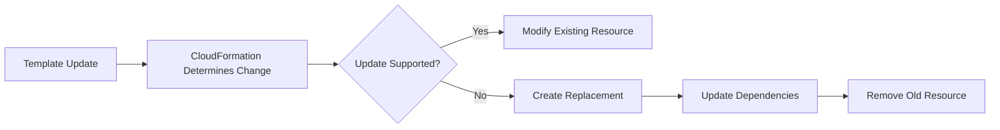

# 02- Template and Resource Questions

## Overview

CloudFormation templates are the core declarative representation of AWS infrastructure. Interview questions in this area typically test whether you understand template structure, resource definitions, logical IDs, physical IDs, properties, intrinsic functions, dependencies, parameters, outputs, and resource lifecycle behavior.

For production engineering, the important distinction is between the **template definition** and the **AWS resource created from that definition**. A CloudFormation template describes desired state; CloudFormation uses that definition to create and manage actual resources.

## Template Structure

### What is a CloudFormation template?

A CloudFormation template is a YAML or JSON document that declares AWS resources and their configuration.

A production-oriented template may contain:

```yaml
AWSTemplateFormatVersion: '2010-09-09'

Description: Production application infrastructure

Parameters:
  Environment:
    Type: String
    AllowedValues:
      - dev
      - staging
      - prod

Resources:
  ApplicationBucket:
    Type: AWS::S3::Bucket
    Properties:
      BucketEncryption:
        ServerSideEncryptionConfiguration:
          - ServerSideEncryptionByDefault:
              SSEAlgorithm: AES256

Outputs:
  BucketName:
    Description: Application bucket name
    Value: !Ref ApplicationBucket
```

The template is evaluated by CloudFormation when a stack is created or updated.

### What are the main sections of a CloudFormation template?

| Section | Purpose | Required |
|---|---|---|
| `AWSTemplateFormatVersion` | Identifies template format | No |
| `Description` | Documents the template | No |
| `Parameters` | Accepts deployment-time inputs | No |
| `Mappings` | Defines static lookup data | No |
| `Conditions` | Controls conditional resources/properties | No |
| `Transform` | Applies transforms/macros | No |
| `Resources` | Defines AWS resources | Yes |
| `Outputs` | Exposes stack values | No |

The `Resources` section is the only mandatory section.

### Can a CloudFormation template contain only Resources?

Yes.

For example:

```yaml
Resources:
  ApplicationBucket:
    Type: AWS::S3::Bucket
```

This is a valid minimal template.

## Resources

### What is a CloudFormation resource?

A resource represents an AWS infrastructure component managed by CloudFormation.

Example:

```yaml
Resources:
  ApplicationVpc:
    Type: AWS::EC2::VPC
    Properties:
      CidrBlock: 10.0.0.0/16
```

Here:

- `ApplicationVpc` is the logical ID.
- `AWS::EC2::VPC` is the resource type.
- `CidrBlock` is a resource property.

### What is a logical ID?

A logical ID is the identifier CloudFormation uses to reference a resource inside a template.

```yaml
Resources:
  ApplicationVpc:
    Type: AWS::EC2::VPC
```

`ApplicationVpc` is the logical ID.

Logical IDs are used by:

- `Ref`
- `Fn::GetAtt`
- `DependsOn`
- `Outputs`
- Other resource properties
- CloudFormation's internal resource tracking

Logical IDs should be stable and meaningful.

### What is a physical ID?

A physical ID identifies the actual AWS resource after CloudFormation creates it.

For example:

```text
Logical ID:
ApplicationVpc

Physical resource:
vpc-0abc123456789def0
```

The logical ID exists in the CloudFormation template, while the physical ID belongs to the deployed AWS resource.

### Logical ID vs physical ID

| Logical ID | Physical ID |
|---|---|
| Defined by template author | Assigned to actual resource |
| Exists in CloudFormation template | Exists in AWS |
| Used for references | Used to identify actual resource |
| Example: `ApplicationVpc` | Example: `vpc-0123456789abcdef0` |
| Stable within template design | May change after resource replacement |

This distinction becomes especially important when debugging resource replacement.

## Resource Properties

### What are resource properties?

Properties configure the behavior of a CloudFormation resource.

Example:

```yaml
Resources:
  ApplicationBucket:
    Type: AWS::S3::Bucket
    Properties:
      BucketEncryption:
        ServerSideEncryptionConfiguration:
          - ServerSideEncryptionByDefault:
              SSEAlgorithm: AES256
```

The valid properties depend on the resource type.

### Can every property be changed without replacing the resource?

No.

CloudFormation classifies property updates according to the resource type.

A property change can result in:

- No interruption
- Some interruption
- Replacement

For example, changing a property on a stateful resource may require creating a replacement resource.

Always check the resource specification and CloudFormation documentation before assuming that an update is in-place.

### What is resource replacement?

Resource replacement occurs when CloudFormation cannot modify an existing resource to satisfy the new configuration.

The high-level flow can be:



Replacement is particularly important for:

- RDS
- EC2
- Load balancers
- Networking resources
- Stateful storage
- IAM resources with naming constraints

### Why is replacement dangerous?

Replacement can cause:

- Downtime
- Loss of ephemeral state
- New resource identifiers
- Changed endpoints
- Dependency changes
- Data loss if protection policies are incorrect

For production deployments, inspect change sets before executing high-impact updates.

## Parameters

### What are CloudFormation parameters?

Parameters allow deployment-time values to be supplied without modifying the template.

Example:

```yaml
Parameters:
  Environment:
    Type: String
    AllowedValues:
      - dev
      - staging
      - prod

  InstanceType:
    Type: String
    Default: t3.micro
```

The same template can therefore support multiple environments.

### Why use parameters instead of hardcoding values?

Parameters improve template reuse and environment separation.

Without parameters:

```text
dev-template.yaml
staging-template.yaml
prod-template.yaml
```

With parameters:

```text
application.yaml
      |
      +---- dev values
      +---- staging values
      +---- prod values
```

This reduces duplicated infrastructure definitions.

### What parameter types are commonly used?

Common parameter types include:

- `String`
- `Number`
- `List<String>`
- `CommaDelimitedList`
- AWS-specific parameter types

Example:

```yaml
Parameters:
  VpcId:
    Type: AWS::EC2::VPC::Id
```

AWS-specific parameter types can provide better validation and integration with AWS resources.

### Should secrets be stored as plain parameters?

No.

Avoid:

```yaml
Parameters:
  DatabasePassword:
    Type: String
    Default: SuperSecretPassword
```

This can expose sensitive information through source control and deployment artifacts.

Prefer:

- AWS Secrets Manager
- Systems Manager Parameter Store
- Dynamic references where appropriate
- IAM-based access where possible

## Mappings

### What are mappings?

Mappings provide static key-value relationships that can be queried during template evaluation.

Example:

```yaml
Mappings:
  EnvironmentConfig:
    dev:
      InstanceType: t3.micro
    prod:
      InstanceType: t3.large
```

A mapping can be queried with `Fn::FindInMap`.

```yaml
InstanceType:
  Fn::FindInMap:
    - EnvironmentConfig
    - !Ref Environment
    - InstanceType
```

### When should mappings be used?

Mappings are useful for relatively static configuration such as:

- Region-specific values
- Environment-specific defaults
- Architecture mappings
- Fixed configuration lookups

Avoid using mappings for values that should be dynamically discovered or centrally managed.

## Conditions

### What are CloudFormation conditions?

Conditions control whether resources or properties are created or applied based on deployment values.

Example:

```yaml
Parameters:
  Environment:
    Type: String
    AllowedValues:
      - dev
      - prod

Conditions:
  IsProduction: !Equals
    - !Ref Environment
    - prod
```

A resource can then use:

```yaml
Resources:
  ProductionAlarm:
    Type: AWS::CloudWatch::Alarm
    Condition: IsProduction
    Properties:
      # Configuration omitted
```

### When are conditions useful?

Conditions are useful when the same template needs different infrastructure behavior across environments.

Typical examples include:

- Production-only monitoring
- Optional resources
- Environment-specific networking
- Different backup configurations
- Development-only debugging resources

Do not use conditions to make a template so dynamic that its behavior becomes difficult to reason about.

## Outputs

### What are Outputs?

Outputs expose values generated by a CloudFormation stack.

Example:

```yaml
Outputs:
  ApplicationBucketArn:
    Description: ARN of the application bucket
    Value: !GetAtt ApplicationBucket.Arn
```

Outputs are commonly used for:

- Resource identifiers
- Resource ARNs
- Endpoints
- CI/CD integration
- Cross-stack communication

### Can Outputs contain sensitive information?

Outputs should not be treated as a secure secret store.

Do not expose credentials, private keys, or sensitive application secrets through stack outputs.

## Intrinsic Functions

### What are intrinsic functions?

Intrinsic functions allow CloudFormation templates to calculate, reference, or construct values dynamically.

Common functions include:

| Function | Purpose |
|---|---|
| `Ref` | References a parameter or resource |
| `Fn::GetAtt` | Retrieves a resource attribute |
| `Fn::Sub` | Performs string substitution |
| `Fn::Join` | Joins strings |
| `Fn::FindInMap` | Looks up mapping values |
| `Fn::If` | Performs conditional evaluation |
| `Fn::Select` | Selects a list item |
| `Fn::Split` | Splits a string |
| `Fn::ImportValue` | Imports an exported stack value |

## `Ref`

### What does `Ref` do?

`Ref` returns an appropriate value for a parameter or resource.

For a parameter:

```yaml
Parameters:
  Environment:
    Type: String

Resources:
  ApplicationBucket:
    Type: AWS::S3::Bucket
    Properties:
      Tags:
        - Key: Environment
          Value: !Ref Environment
```

For resources, the returned value depends on the resource type.

For example, `Ref` on an S3 bucket commonly returns the bucket name, while `Ref` on an EC2 instance returns the instance ID.

Do not assume that `Ref` always returns an ARN.

## `Fn::GetAtt`

### What does `Fn::GetAtt` do?

`Fn::GetAtt` retrieves a specific attribute from a resource.

Example:

```yaml
Outputs:
  BucketArn:
    Value: !GetAtt ApplicationBucket.Arn
```

It is commonly used for values such as:

- ARNs
- DNS names
- IDs
- Endpoints
- Resource-specific attributes

### `Ref` vs `Fn::GetAtt`

| `Ref` | `Fn::GetAtt` |
|---|---|
| Returns the resource's `Ref` value | Returns a specific attribute |
| Syntax is shorter | Requires attribute name |
| Behavior depends on resource type | Explicit attribute selection |
| `!Ref ApplicationBucket` | `!GetAtt ApplicationBucket.Arn` |

## `Fn::Sub`

### Why is `Fn::Sub` useful?

`Fn::Sub` is useful for constructing strings containing dynamic CloudFormation values.

Example:

```yaml
Outputs:
  StackDescription:
    Value: !Sub "Resources managed by ${AWS::StackName}"
```

It is especially useful for constructing:

- ARNs
- resource names
- URLs
- policy documents
- configuration strings

Example:

```yaml
PolicyArn:
  !Sub "arn:${AWS::Partition}:iam::${AWS::AccountId}:role/${RoleName}"
```

Using pseudo parameters such as `AWS::Partition` makes templates more portable across AWS partitions.

## Resource References

### How does one resource reference another?

CloudFormation resources can reference each other using intrinsic functions.

Example:

```yaml
Resources:
  ApplicationSecurityGroup:
    Type: AWS::EC2::SecurityGroup
    Properties:
      GroupDescription: Application security group
      VpcId: !Ref ApplicationVpc

  ApplicationVpc:
    Type: AWS::EC2::VPC
    Properties:
      CidrBlock: 10.0.0.0/16
```

The reference creates an implicit dependency.

CloudFormation understands that the VPC must exist before it can create the security group.

## Dependencies

### What is an implicit dependency?

An implicit dependency is created when one resource references another.

Example:

```yaml
Subnet:
  Type: AWS::EC2::Subnet
  Properties:
    VpcId: !Ref ApplicationVpc
```

The subnet depends on the VPC.

### What is an explicit dependency?

An explicit dependency uses `DependsOn`.

```yaml
Application:
  Type: AWS::EC2::Instance
  DependsOn:
    - ApplicationLoadBalancer
```

### When should `DependsOn` be used?

Use `DependsOn` when a dependency exists but CloudFormation cannot infer it from resource references.

Do not add it merely to force a deployment order without a real dependency.

Excessive dependencies can reduce parallel resource creation.

## Metadata

### What is the `Metadata` section?

Metadata can provide additional information associated with a resource or template.

It can be used by tooling and services such as CloudFormation helper mechanisms.

Example:

```yaml
Metadata:
  BuildInformation:
    Owner: PlatformTeam
    Application: BackendAPI
```

Metadata is not a replacement for actual resource configuration or application state.

Sensitive information should not be stored in metadata.

## Pseudo Parameters

### What are pseudo parameters?

Pseudo parameters are predefined CloudFormation values that AWS provides automatically.

Common examples include:

| Pseudo Parameter | Meaning |
|---|---|
| `AWS::AccountId` | AWS account ID |
| `AWS::Region` | Current AWS Region |
| `AWS::StackName` | Current stack name |
| `AWS::StackId` | Current stack ID |
| `AWS::Partition` | AWS partition |
| `AWS::URLSuffix` | Region-specific DNS suffix |

Example:

```yaml
Value: !Sub "arn:${AWS::Partition}:s3:::${BucketName}"
```

Pseudo parameters reduce the need to hardcode environment-specific AWS information.

## Resource Naming

### Should CloudFormation resources always have explicit names?

No.

Allowing CloudFormation to generate physical names can simplify lifecycle management.

Explicit names are useful when:

- External systems require stable names
- Human-readable identifiers are operationally important
- A naming convention is mandatory

However, explicit physical names can complicate replacement because CloudFormation cannot create a replacement resource using the same unique name while the original still exists.

This is an important production trade-off.

### Why can explicit names cause replacement failures?

Suppose a resource has:

```yaml
BucketName: production-application-data
```

A property change requires replacement.

CloudFormation may need to create the new resource before deleting the old one. If the name must remain unique, the replacement can fail because the original resource already owns the name.

Therefore, stable explicit names should be used deliberately.

## Deletion and Update Policies

### What is `DeletionPolicy`?

`DeletionPolicy` controls what CloudFormation does with a resource when the resource is removed from the template or when the stack is deleted, depending on the operation.

Common values include:

- `Delete`
- `Retain`
- `Snapshot`

Example:

```yaml
Resources:
  ProductionDatabase:
    Type: AWS::RDS::DBInstance
    DeletionPolicy: Snapshot
```

For stateful production resources, lifecycle behavior should be explicitly considered.

### What is `UpdateReplacePolicy`?

`UpdateReplacePolicy` controls what happens to an existing physical resource when CloudFormation replaces it during an update.

Example:

```yaml
Resources:
  ProductionDatabase:
    Type: AWS::RDS::DBInstance
    DeletionPolicy: Snapshot
    UpdateReplacePolicy: Snapshot
```

Using both policies can provide stronger protection for stateful resources, but backups and recovery procedures must still be tested independently.

## Resource Attributes

### What are resource attributes?

Resource attributes modify how CloudFormation manages or processes a resource.

Common attributes include:

- `DependsOn`
- `DeletionPolicy`
- `UpdateReplacePolicy`
- `CreationPolicy`
- `UpdatePolicy`
- `UpdateReplacePolicy`
- `Condition`
- `Metadata`

Example:

```yaml
Resources:
  ApplicationDatabase:
    Type: AWS::RDS::DBInstance
    DeletionPolicy: Snapshot
    UpdateReplacePolicy: Snapshot
```

These attributes are different from resource `Properties`.

## Resource Properties vs Attributes

| Properties | Attributes |
|---|---|
| Configure the AWS resource | Control CloudFormation behavior |
| Defined by resource type | Common CloudFormation mechanisms |
| Example: `CidrBlock` | Example: `DeletionPolicy` |
| Passed as resource configuration | Interpreted by CloudFormation |

Understanding this distinction is important when debugging template errors.

## Template Validation

### How do you validate a CloudFormation template?

The AWS CLI provides template validation:

```bash
aws cloudformation validate-template \
  --template-body file://template.yaml
```

This checks whether the template is structurally valid.

However, validation does not guarantee that deployment will succeed.

A template can pass validation and still fail because of:

- IAM permissions
- Invalid resource configuration
- Service quotas
- Existing resource conflicts
- Region-specific limitations
- Missing dependencies
- Runtime service errors

### What should CI/CD validate?

A production pipeline should ideally validate multiple dimensions:

```text
Template Syntax
      |
      v
CloudFormation Validation
      |
      v
Security / Policy Checks
      |
      v
Change Set
      |
      v
Approval
      |
      v
Deployment
```

Template validation is only one stage of infrastructure quality control.

## Resource Import

### Can CloudFormation manage an existing AWS resource?

Yes.

CloudFormation supports resource import for supported resource types.

This allows existing infrastructure to become managed by a CloudFormation stack without necessarily recreating it.

The process generally requires:

1. Defining the resource in the template.
2. Providing the required identifier.
3. Performing the import operation.
4. Verifying that CloudFormation correctly recognizes the resource.

Import should be treated carefully because the template must accurately represent the existing resource configuration.

## Resource Drift

### What happens if someone changes a CloudFormation-managed resource manually?

The actual resource can diverge from the configuration represented by CloudFormation.

For example:

```text
CloudFormation Template
        |
        v
Expected Security Group Rules
        |
        X
        |
Manual AWS Console Change
        |
        v
Actual Security Group Rules
```

This is configuration drift.

Drift detection should be incorporated into operational practices for infrastructure where configuration consistency is critical.

## Nested Resource Design

### How should resources be organized in large templates?

Large templates should be structured around logical infrastructure boundaries.

For example:

```text
Infrastructure
|
+-- Network
|   +-- VPC
|   +-- Subnets
|   +-- Route Tables
|
+-- Security
|   +-- IAM
|   +-- Security Groups
|
+-- Data
|   +-- RDS
|   +-- S3
|
+-- Application
    +-- Load Balancer
    +-- ECS
    +-- Auto Scaling
```

The exact decomposition should reflect lifecycle and ownership boundaries rather than arbitrary file size.

## Production Considerations

### Security

- Do not hardcode credentials.
- Use least-privilege deployment roles.
- Review IAM resources carefully.
- Avoid exposing secrets through Outputs or Metadata.
- Restrict who can modify production templates.
- Run infrastructure security checks in CI/CD.
- Review IAM capability requirements before deployment.

### Reliability

- Use change sets before high-risk updates.
- Understand replacement behavior.
- Protect stateful resources.
- Configure appropriate deletion and replacement policies.
- Test rollback procedures.
- Avoid unnecessary dependencies.
- Monitor stack events during deployment.

### Scalability

CloudFormation is primarily an infrastructure orchestration system, so scalability concerns usually relate to the architecture being provisioned.

For example:

```text
CloudFormation
      |
      v
VPC
 |
 +-- ALB
 |
 +-- ECS Service
 |     |
 |     +-- Multiple Tasks
 |
 +-- RDS
 |
 +-- ElastiCache
```

The CloudFormation template should encode scalable infrastructure patterns rather than manually provision individual application instances.

### Operational Practices

Production templates should generally be:

- Version-controlled
- Reviewed through pull requests
- Validated automatically
- Security-scanned
- Deployed through controlled pipelines
- Parameterized appropriately
- Documented through meaningful logical IDs
- Tested before production execution

Avoid making manual console changes to resources managed by CloudFormation unless there is an intentional operational process for reconciliation.

## Common Mistakes

### Hardcoding AWS Account IDs

Avoid:

```yaml
Value: arn:aws:iam::123456789012:role/ApplicationRole
```

Prefer pseudo parameters where appropriate:

```yaml
Value: !Sub "arn:${AWS::Partition}:iam::${AWS::AccountId}:role/ApplicationRole"
```

### Assuming `Ref` Always Returns an ARN

`Ref` returns the resource's defined reference value, which varies by resource type.

Use `Fn::GetAtt` when a specific attribute such as an ARN is required.

### Confusing Logical and Physical IDs

A logical ID such as:

```text
ApplicationDatabase
```

is not the same thing as the physical RDS identifier created in AWS.

This distinction matters during replacement and troubleshooting.

### Using Explicit Names Everywhere

Explicit names can improve operational clarity but may make resource replacement harder.

Use them when stable external naming is genuinely required.

### Overusing Conditions

A single template supporting every possible environment can become difficult to understand if it contains excessive conditional logic.

Prefer clear boundaries over unnecessary template complexity.

### Adding `DependsOn` Everywhere

CloudFormation already understands many dependencies through references.

Unnecessary `DependsOn` relationships can reduce deployment parallelism and increase coupling.

### Treating Validation as Deployment Testing

Successful validation does not mean the stack will successfully deploy.

Infrastructure should also be evaluated for:

- Permissions
- Quotas
- Service behavior
- Replacement risk
- Security
- Operational impact

## Interview Traps

### Is `Resources` the only mandatory CloudFormation section?

Yes. `Resources` is required; the other major template sections are optional.

### Does every CloudFormation resource require a `Properties` section?

No.

Some resources have no required properties.

For example:

```yaml
Resources:
  ApplicationBucket:
    Type: AWS::S3::Bucket
```

is valid.

### What is the difference between a logical ID and physical ID?

The logical ID is the identifier used by the CloudFormation template. The physical ID identifies the actual AWS resource.

### Does changing any resource property cause replacement?

No.

The update behavior depends on the specific resource property.

### Does `Ref` return the same type of value for every resource?

No.

The returned value is resource-specific.

### When should `Fn::GetAtt` be used instead of `Ref`?

Use `Fn::GetAtt` when you need a specific resource attribute that is not the value returned by `Ref`.

### Why can explicit resource names make replacement difficult?

Because AWS resources often require unique names. CloudFormation may need to create the replacement before deleting the original, which can result in a name conflict.

### Can CloudFormation templates contain application code?

CloudFormation primarily defines infrastructure. Application code can be packaged and referenced by resources such as Lambda or ECS, but CloudFormation itself is not an application deployment runtime.

### Can a CloudFormation template reference resources in another stack?

Yes, using mechanisms such as exported outputs and `Fn::ImportValue`, or other cross-stack integration patterns.

### Does CloudFormation automatically manage manually created resources?

No.

An existing resource must be explicitly brought under CloudFormation management through supported mechanisms such as resource import.

## Key Takeaways

- A CloudFormation template is a declarative infrastructure definition; a stack is a deployed instance of that definition.
- `Resources` is the only mandatory top-level template section.
- Every resource has a logical ID, while the deployed AWS resource has a physical ID.
- Resource properties configure AWS resources; CloudFormation attributes control infrastructure lifecycle behavior.
- Parameters make templates reusable across environments.
- Mappings provide static lookup data, while Conditions control conditional infrastructure behavior.
- Outputs expose values from a stack but should not be used as a secret store.
- `Ref` returns a resource- or parameter-specific reference value; `Fn::GetAtt` retrieves a specific attribute.
- `Fn::Sub` is particularly useful for dynamically constructing ARNs, names, URLs, and policy strings.
- CloudFormation can infer many dependencies automatically through references; `DependsOn` should be used only when implicit dependency detection is insufficient.
- Resource property changes can result in in-place updates, interruptions, or complete resource replacement.
- Explicit physical names can improve operational clarity but may complicate resource replacement.
- `DeletionPolicy` and `UpdateReplacePolicy` are important for protecting stateful resources.
- Template validation checks structural correctness but does not guarantee successful or safe deployment.
- Existing resources can be imported into CloudFormation when the resource type and import workflow support it.
- Manual changes to managed resources can create configuration drift.
- Production templates should be version-controlled, reviewed, validated, security-checked, and deployed through controlled CI/CD workflows.