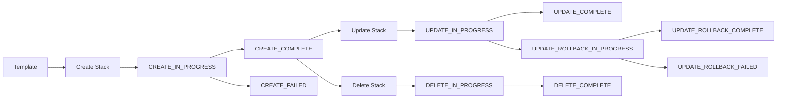
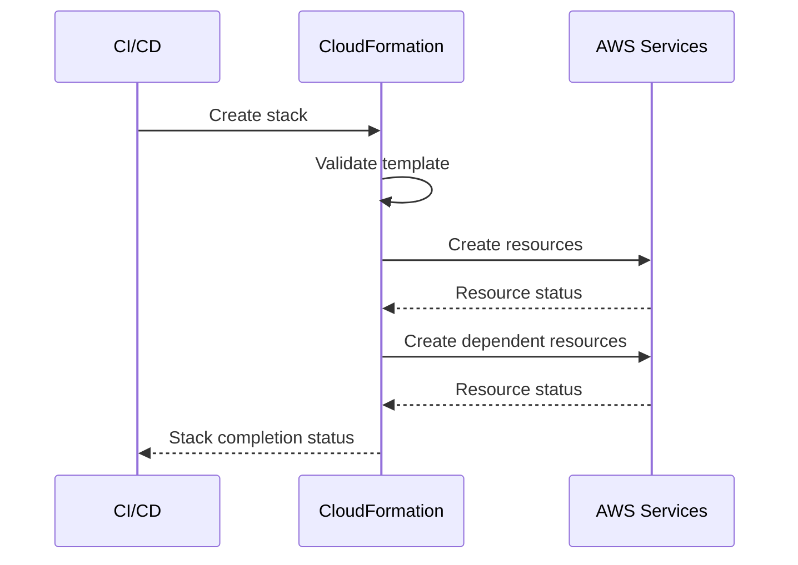
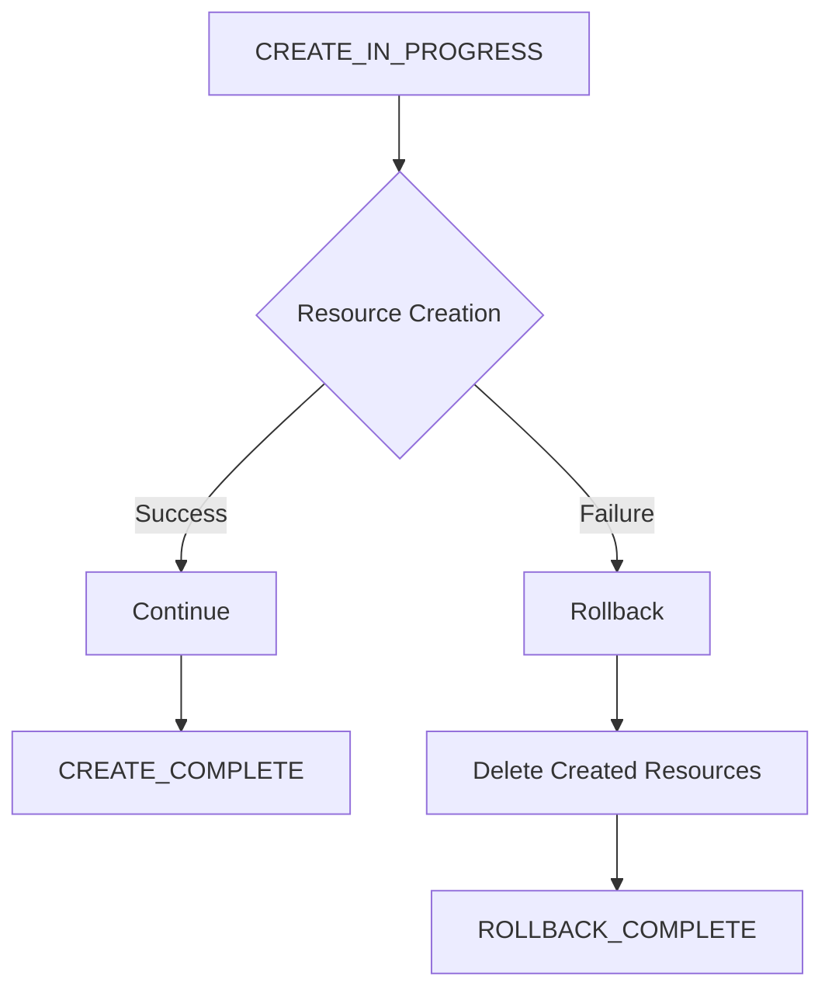
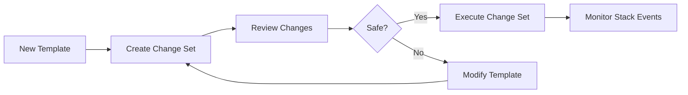
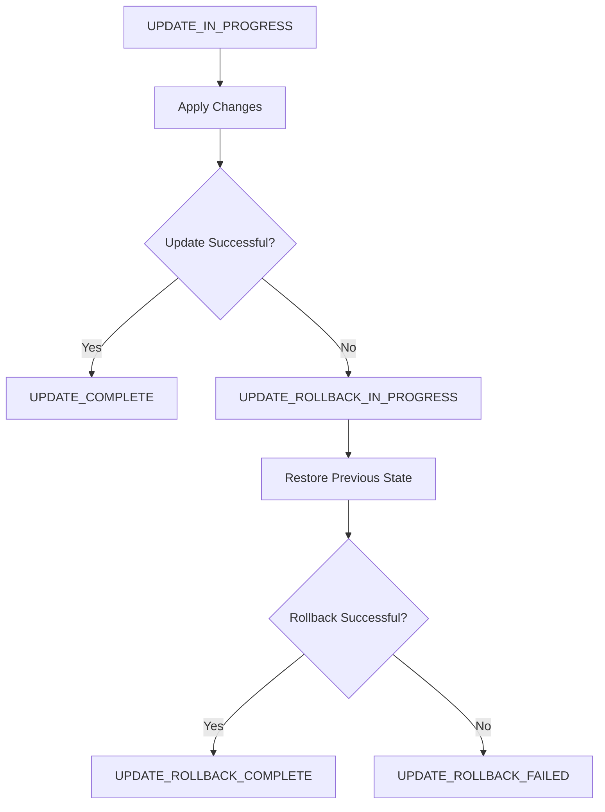
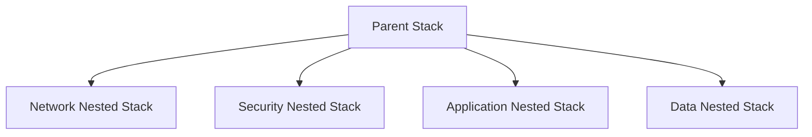
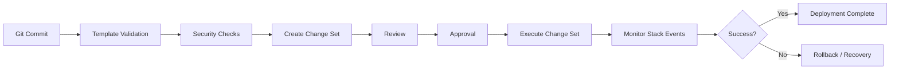

# 03- Stack Lifecycle and Operations Questions

## Overview

CloudFormation stack lifecycle questions test whether you understand how infrastructure moves from template definition to a deployed, updated, rolled-back, or deleted state.

A senior-level understanding requires more than memorizing stack statuses. You should be able to explain how CloudFormation coordinates resource operations, how stack states affect subsequent operations, how to diagnose failed deployments, and how to design production deployment workflows around change sets, rollback behavior, drift detection, and recovery.

## Stack Lifecycle

A CloudFormation stack represents a collection of AWS resources managed as a unit.

A simplified lifecycle is:



CloudFormation state is important because it determines what operations are currently possible and what recovery action is appropriate.

## Stack States

### Common stack states

| Stack State | Meaning | Typical Action |
|---|---|---|
| `CREATE_IN_PROGRESS` | Stack creation is running | Monitor events |
| `CREATE_COMPLETE` | Stack creation succeeded | Normal operations |
| `CREATE_FAILED` | Stack creation failed | Investigate events |
| `ROLLBACK_IN_PROGRESS` | Creation rollback is running | Wait and monitor |
| `ROLLBACK_COMPLETE` | Creation failed and rollback completed | Fix template/configuration and recreate |
| `ROLLBACK_FAILED` | Creation rollback itself failed | Investigate and recover |
| `UPDATE_IN_PROGRESS` | Stack update is running | Monitor events |
| `UPDATE_COMPLETE` | Stack update succeeded | Normal operations |
| `UPDATE_FAILED` | Update failed | Inspect events and rollback state |
| `UPDATE_ROLLBACK_IN_PROGRESS` | Update is being reverted | Monitor |
| `UPDATE_ROLLBACK_COMPLETE` | Update failed but rollback succeeded | Fix issue and retry |
| `UPDATE_ROLLBACK_FAILED` | Rollback could not complete | Resolve blocking resource condition |
| `DELETE_IN_PROGRESS` | Stack deletion is running | Monitor |
| `DELETE_COMPLETE` | Stack deletion completed | Stack is removed |
| `DELETE_FAILED` | Stack deletion failed | Inspect retained/blocking resources |

Some operations can also produce additional transitional states. For troubleshooting, the most important principle is to identify whether the stack is **actively operating**, **successfully completed**, **failed**, or **stuck during recovery**.

## Creation Lifecycle

A stack creation generally follows this sequence:



CloudFormation determines resource dependencies and can create independent resources concurrently.

For example:

```yaml
Resources:
  ApplicationVpc:
    Type: AWS::EC2::VPC
    Properties:
      CidrBlock: 10.0.0.0/16

  ApplicationSubnet:
    Type: AWS::EC2::Subnet
    Properties:
      VpcId: !Ref ApplicationVpc
      CidrBlock: 10.0.1.0/24
```

The subnet depends on the VPC because it references `ApplicationVpc`.

## Creation Rollback

If stack creation fails and rollback is enabled, CloudFormation attempts to undo resources that were successfully created.



Rollback is useful because a partially created infrastructure environment is usually undesirable.

However, rollback is not guaranteed to succeed.

A rollback can itself fail because:

- A resource cannot be deleted.
- A resource was modified externally.
- IAM permissions prevent deletion.
- A dependency prevents cleanup.
- A service is temporarily unavailable.
- A resource has deletion protection enabled.
- A custom resource fails during cleanup.

## `ROLLBACK_COMPLETE`

### What does `ROLLBACK_COMPLETE` mean?

`ROLLBACK_COMPLETE` generally means the stack creation failed and CloudFormation successfully rolled back the resources created during that operation.

The stack is not a successfully deployed application environment.

For a failed initial creation, the normal recovery pattern is:

1. Inspect stack events.
2. Identify the original failure.
3. Correct the template, permissions, or configuration.
4. Delete the failed stack if appropriate.
5. Recreate the stack.

Do not treat `ROLLBACK_COMPLETE` as equivalent to `CREATE_COMPLETE`.

## Update Lifecycle

A stack update compares the current stack configuration with the requested configuration and determines the resource operations required to reach the new state.

Typical flow:

```text
Current Template
      |
      v
New Template
      |
      v
Change Evaluation
      |
      v
Resource Operations
      |
      +--> Modify
      |
      +--> Create
      |
      +--> Replace
      |
      +--> Delete
      |
      v
UPDATE_COMPLETE
```

The actual operation depends on the resource type and the specific property being changed.

## Update vs Replacement

A critical interview and production concept is that changing a property does not necessarily mean modifying the existing physical resource.

CloudFormation may:

```text
Template Change
      |
      v
Property Update
      |
      +----> In-place update
      |
      +----> Update with interruption
      |
      +----> Resource replacement
```

Replacement can have major production consequences.

For example, replacing a database or network resource can affect:

- Availability
- Resource identifiers
- Endpoints
- Connections
- Stored data
- Dependent resources

Always inspect the proposed changes before executing high-impact updates.

## Change Sets

Change sets provide a preview of the proposed stack changes before execution.

Typical production flow:



Example:

```bash
aws cloudformation create-change-set \
  --stack-name production-api \
  --change-set-name production-api-update \
  --template-body file://template.yaml \
  --capabilities CAPABILITY_IAM
```

Inspect it:

```bash
aws cloudformation describe-change-set \
  --stack-name production-api \
  --change-set-name production-api-update
```

Execute it:

```bash
aws cloudformation execute-change-set \
  --stack-name production-api \
  --change-set-name production-api-update
```

Change sets do not guarantee that an update will succeed. They describe the planned resource-level changes but do not execute the deployment.

## Stack Events

Stack events are usually the first place to investigate an operational failure.

```bash
aws cloudformation describe-stack-events \
  --stack-name production-api
```

A typical event sequence may look like:

```text
AWS::CloudFormation::Stack     UPDATE_IN_PROGRESS
AWS::EC2::SecurityGroup        UPDATE_COMPLETE
AWS::ECS::Service              UPDATE_IN_PROGRESS
AWS::ECS::Service              UPDATE_FAILED
AWS::CloudFormation::Stack     UPDATE_ROLLBACK_IN_PROGRESS
```

The important failure is usually the **first meaningful resource-level failure**, not necessarily the final stack status.

## How to Troubleshoot a Failed Stack

Use a consistent process:

### Identify the stack state

```bash
aws cloudformation describe-stacks \
  --stack-name production-api \
  --query 'Stacks[0].StackStatus'
```

### Inspect recent events

```bash
aws cloudformation describe-stack-events \
  --stack-name production-api \
  --query 'StackEvents[].{LogicalId:LogicalResourceId,Status:ResourceStatus,Reason:ResourceStatusReason}' \
  --output table
```

### Identify the first resource failure

Look for:

- `CREATE_FAILED`
- `UPDATE_FAILED`
- `DELETE_FAILED`

Then inspect the `ResourceStatusReason`.

### Investigate the underlying AWS service

CloudFormation often reports the service-level error rather than the complete operational context.

For example:

```text
CloudFormation
    |
    v
ECS Service
    |
    v
IAM / Networking / Container / Capacity
```

If an ECS service fails, investigate ECS deployment events, task failures, security groups, IAM roles, subnets, load balancer configuration, and capacity rather than treating CloudFormation as the root cause.

## Update Rollback

When an update fails, CloudFormation can attempt to restore the previous known-good configuration.



This behavior is one of the major reliability benefits of declarative infrastructure, but it should not be confused with application-level transactional rollback.

CloudFormation can orchestrate infrastructure changes, but it cannot automatically undo arbitrary external side effects.

## `UPDATE_ROLLBACK_COMPLETE`

This state generally means:

- The requested update failed.
- CloudFormation attempted rollback.
- The rollback completed successfully.
- The stack returned to its previous configuration.

The next step is usually to determine why the update failed and correct the underlying problem before attempting another update.

## `UPDATE_ROLLBACK_FAILED`

### Why is this state important?

`UPDATE_ROLLBACK_FAILED` indicates that CloudFormation could not complete its rollback.

This is a higher-severity operational state because the stack may no longer be aligned cleanly with the expected previous configuration.

Common causes include:

- Manual resource changes
- Missing resources
- Insufficient permissions
- Resource deletion protection
- Dependency problems
- External changes
- Service-level failures

### What should you do?

Do not blindly retry the same deployment.

Start with:

```bash
aws cloudformation describe-stack-events \
  --stack-name production-api
```

Identify the resource preventing rollback.

If the issue can be safely resolved, correct the underlying resource condition and continue the rollback when appropriate.

For example:

```bash
aws cloudformation continue-update-rollback \
  --stack-name production-api
```

CloudFormation also supports skipping resources during rollback in specific recovery scenarios:

```bash
aws cloudformation continue-update-rollback \
  --stack-name production-api \
  --resources-to-skip LogicalResourceId
```

Skipping a resource is a recovery mechanism, not a normal deployment strategy. The skipped resource can become inconsistent with the stack template and must be reconciled deliberately afterward.

## Rollback and Stateful Resources

Rollback is more complicated for stateful infrastructure.

Consider:

```text
CloudFormation
      |
      +---- Application
      |
      +---- Load Balancer
      |
      +---- RDS
```

If an application update fails, rolling back the application may be straightforward.

If a database replacement is involved, rollback can become much more complex because the old resource may have:

- Persistent data
- Long-lived connections
- Backups
- Replication state
- External dependencies

For production databases, use appropriate:

- Backup policies
- Snapshot policies
- `DeletionPolicy`
- `UpdateReplacePolicy`
- Database-native recovery mechanisms
- Tested disaster recovery procedures

## Stack Deletion

A stack deletion transitions through:

```text
DELETE_IN_PROGRESS
        |
        v
Resource Cleanup
        |
        v
DELETE_COMPLETE
```

CloudFormation attempts to delete resources managed by the stack according to their lifecycle policies.

Example:

```bash
aws cloudformation delete-stack \
  --stack-name temporary-environment
```

Monitor deletion:

```bash
aws cloudformation wait stack-delete-complete \
  --stack-name temporary-environment
```

## `DELETE_FAILED`

Deletion can fail when CloudFormation cannot remove one or more resources.

Common causes include:

| Cause | Example |
|---|---|
| Deletion protection | RDS deletion protection |
| Dependency | Resource still referenced elsewhere |
| Permissions | Deployment role cannot delete resource |
| External modification | Resource configuration changed manually |
| Non-empty resource | Bucket contains objects |
| Service constraint | AWS service prevents deletion |
| Custom resource | Cleanup handler failed |

Always inspect stack events before attempting remediation.

## `DeletionPolicy`

`DeletionPolicy` controls what CloudFormation does with a resource when the resource is removed from the template or when its stack is deleted, subject to the resource and operation semantics.

Example:

```yaml
Resources:
  ProductionDatabase:
    Type: AWS::RDS::DBInstance
    DeletionPolicy: Snapshot
```

Common values include:

| Policy | Typical Behavior |
|---|---|
| `Delete` | Delete the resource |
| `Retain` | Keep the resource |
| `Snapshot` | Create a snapshot before deletion where supported |

For production stateful resources, lifecycle behavior should be explicitly designed.

## `UpdateReplacePolicy`

`UpdateReplacePolicy` controls what happens to the old physical resource when CloudFormation replaces it during an update.

Example:

```yaml
Resources:
  ProductionDatabase:
    Type: AWS::RDS::DBInstance
    DeletionPolicy: Snapshot
    UpdateReplacePolicy: Snapshot
```

This is particularly relevant when a resource contains important state.

`DeletionPolicy` and `UpdateReplacePolicy` address different lifecycle events and should not be treated as interchangeable.

## Stack Protection

Production infrastructure should not rely solely on operator discipline to prevent destructive actions.

Useful controls include:

- IAM permissions
- Change management
- Change sets
- Stack policies where applicable
- Resource deletion protection
- Service Control Policies
- AWS Organizations controls
- CI/CD approval gates

These mechanisms operate at different layers and should be combined according to risk.

## Stack Policy

A stack policy can help protect selected resources from unwanted update actions.

Example concept:

```json
{
  "Statement": [
    {
      "Effect": "Deny",
      "Action": "Update:*",
      "Principal": "*",
      "Resource": "LogicalResourceId/ProductionDatabase"
    }
  ]
}
```

Stack policies are intended to protect resources from stack updates. They are not a general replacement for IAM authorization or resource deletion protection.

A production database may require multiple independent safeguards.

## Nested Stack Operations

Nested stacks allow a parent stack to manage child stacks.



Nested stacks can improve organization and reuse, but they introduce additional operational boundaries.

When troubleshooting:

1. Inspect the parent stack.
2. Identify the failed nested stack resource.
3. Inspect the nested stack directly.
4. Find the underlying resource failure.
5. Fix the root cause.
6. Resume the appropriate parent operation.

## Stack Dependencies

Cross-stack dependencies can make operations more difficult.

For example:

```text
Network Stack
      |
      v
Application Stack
      |
      v
Monitoring Stack
```

If the application stack imports values from the network stack, deleting or changing the network stack may be blocked by those dependencies.

Production infrastructure should minimize unnecessary cross-stack coupling.

## Drift Detection

Drift occurs when actual AWS resource configuration differs from the configuration represented by CloudFormation.

Example:

```text
CloudFormation Template
        |
        v
Expected Configuration
        |
        X
        |
Manual Console Change
        |
        v
Actual Configuration
```

CloudFormation drift detection can help identify these differences.

The important operational principle is:

> Infrastructure managed by CloudFormation should have CloudFormation or an approved automation workflow as the source of truth.

Manual changes should be treated as exceptions that require reconciliation.

## Stack Operations in CI/CD

A production deployment pipeline commonly looks like:



This separates:

- Infrastructure definition
- Validation
- Change inspection
- Approval
- Execution
- Operational monitoring

A mature deployment process does not treat `aws cloudformation deploy` as the entire deployment strategy.

## Production Operational Checklist

Before a production stack update:

- Validate the template.
- Run security and policy checks.
- Review the change set.
- Identify resources requiring replacement.
- Check for changes to stateful resources.
- Verify IAM capabilities.
- Confirm service quotas and regional availability.
- Confirm backup and recovery protections.
- Review potential downtime.
- Ensure monitoring is available.
- Have a rollback or recovery procedure.
- Use an appropriately scoped deployment role.

After deployment:

- Verify stack status.
- Inspect stack events.
- Verify critical resources.
- Run application health checks.
- Check CloudWatch metrics and logs.
- Check for unexpected replacements.
- Detect drift where appropriate.

## Operational Mistakes

### Ignoring stack events

The final stack status often provides less information than the resource-level events.

**Better approach:** find the first meaningful resource failure and investigate the underlying AWS service.

### Re-running a failed deployment without fixing the cause

Repeatedly executing the same template does not fix:

- Missing IAM permissions
- Invalid networking
- Service quotas
- Resource naming conflicts
- Unsupported configurations

Fix the root cause first.

### Manually changing resources during an update

Manual changes can interfere with CloudFormation's expected resource state and make rollback harder.

Use controlled automation whenever possible.

### Skipping resources during rollback without reconciliation

`resources-to-skip` can help recover a blocked rollback, but the skipped resources may no longer match the template.

Treat skipped resources as an explicit reconciliation task.

### Assuming rollback means everything is identical to the previous state

CloudFormation rollback is infrastructure orchestration, not a universal transaction system.

External side effects, data changes, application behavior, and unsupported operations may not be automatically reversible.

### Ignoring resource replacement

A change set may show that a resource will be replaced.

For stateful or production-critical resources, replacement should trigger explicit risk analysis.

## Interview Questions

### What is a CloudFormation stack?

A stack is a collection of AWS resources managed together by CloudFormation according to a template.

### What is the difference between a template and a stack?

A template is the declarative infrastructure definition. A stack is the deployed CloudFormation representation of that template in an AWS environment.

### What happens when stack creation fails?

CloudFormation can attempt to roll back resources created during the failed operation. If rollback succeeds, the stack can reach `ROLLBACK_COMPLETE`.

### What does `UPDATE_ROLLBACK_COMPLETE` mean?

It means a stack update failed and CloudFormation successfully completed the rollback to the previous configuration.

### What does `UPDATE_ROLLBACK_FAILED` mean?

It means the update failed and CloudFormation was unable to complete its rollback. The resource blocking rollback must be investigated and resolved.

### How do you troubleshoot a failed CloudFormation update?

A strong answer is:

1. Check the stack status.
2. Inspect stack events.
3. Identify the first meaningful resource failure.
4. Investigate the underlying AWS service.
5. Determine whether the stack is updating or rolling back.
6. Correct the underlying problem.
7. Continue rollback or retry the deployment as appropriate.
8. Verify the final resource state.

### What is a change set?

A change set is a preview of the resource-level changes CloudFormation proposes for a stack update before those changes are executed.

### Does a change set guarantee a successful deployment?

No.

It shows the planned changes, but runtime failures can still occur because of permissions, service constraints, quotas, dependencies, or resource-specific errors.

### What is `ROLLBACK_COMPLETE`?

For an initial stack creation, it generally indicates that creation failed and CloudFormation successfully rolled back the resources created during that operation.

### What is `UPDATE_ROLLBACK_FAILED`?

It indicates that CloudFormation could not finish reverting a failed stack update.

### How can you continue a failed rollback?

After resolving the blocking condition, use:

```bash
aws cloudformation continue-update-rollback \
  --stack-name production-api
```

In specific recovery situations, resources can be skipped, but doing so can leave those resources inconsistent with the template.

### Why should `resources-to-skip` be used carefully?

Because skipped resources may remain in a state that does not match the CloudFormation template. They must be reconciled after recovery.

### What is the difference between rollback and disaster recovery?

Rollback attempts to reverse an infrastructure operation. Disaster recovery addresses restoration of service and data after a major failure.

Rollback is not a substitute for:

- Backups
- Database recovery
- Multi-AZ architecture
- Disaster recovery testing
- Cross-region recovery where required

### What happens if a resource cannot be deleted?

The stack may enter a failed deletion state such as `DELETE_FAILED`.

The correct response is to inspect stack events and determine whether the problem is caused by:

- Permissions
- Dependencies
- Deletion protection
- Resource contents
- External changes
- AWS service restrictions

### How do you troubleshoot `DELETE_FAILED`?

Start with:

```bash
aws cloudformation describe-stack-events \
  --stack-name production-api
```

Identify the resource that failed deletion and inspect the service-specific reason before taking corrective action.

### How does CloudFormation handle resource replacement?

When a property change requires replacement, CloudFormation creates a new physical resource and transitions the stack toward the new resource configuration according to the resource's update semantics.

Replacement can cause:

- New physical IDs
- Temporary coexistence of old and new resources
- Downtime
- Dependency changes
- Data-loss risk

### Why are explicit resource names sometimes dangerous?

A replacement resource may need the same unique physical name while the old resource still exists. This can cause a name conflict and make the update fail.

### What is drift?

Drift occurs when the actual configuration of a resource differs from the configuration represented by CloudFormation.

### Should manual AWS Console changes be made to CloudFormation-managed resources?

Generally, no. Manual changes can create drift and make future updates or rollbacks harder to reason about.

### What is `DeletionPolicy`?

It controls how CloudFormation handles a resource when the relevant deletion/removal lifecycle operation occurs.

### What is `UpdateReplacePolicy`?

It controls what happens to the existing physical resource when CloudFormation replaces it during an update.

### Are `DeletionPolicy` and `UpdateReplacePolicy` the same?

No.

`DeletionPolicy` applies to resource deletion/removal scenarios, while `UpdateReplacePolicy` applies when an existing resource is replaced during an update.

### How would you safely deploy a CloudFormation change to production?

A strong production workflow is:

```text
Pull Request
    |
    v
Template Validation
    |
    v
Security / Policy Checks
    |
    v
Change Set
    |
    v
Review Resource Changes
    |
    v
Approval
    |
    v
Execute
    |
    v
Monitor Stack Events
    |
    v
Application Verification
```

The important part is not merely executing the template but controlling and observing the complete infrastructure change lifecycle.

## Key Takeaways

- A CloudFormation stack progresses through well-defined lifecycle states that determine its operational status.
- `CREATE_IN_PROGRESS`, `UPDATE_IN_PROGRESS`, and `DELETE_IN_PROGRESS` indicate active operations.
- `ROLLBACK_COMPLETE` generally represents a failed initial creation whose rollback completed successfully.
- `UPDATE_ROLLBACK_COMPLETE` indicates that a failed update was successfully reverted.
- `UPDATE_ROLLBACK_FAILED` requires active investigation and recovery.
- Stack events are usually the most useful source for identifying the actual resource-level failure.
- The first meaningful resource failure is often more important than the final stack-level status.
- Change sets provide a preview of proposed resource changes but do not guarantee deployment success.
- Resource replacement must be explicitly evaluated for production-critical and stateful resources.
- `DeletionPolicy` and `UpdateReplacePolicy` should be designed deliberately for stateful infrastructure.
- Rollback is not equivalent to application or database transaction rollback.
- A failed rollback can require resolving permissions, dependencies, deletion protection, or external resource changes before recovery can continue.
- `continue-update-rollback` is a recovery operation, not a normal deployment command.
- `resources-to-skip` should be used only when necessary because skipped resources can become inconsistent with the CloudFormation template.
- Manual changes to CloudFormation-managed resources can introduce drift and complicate future operations.
- Production deployments should use validation, security checks, change sets, approvals, controlled execution, and post-deployment verification.
- CloudFormation rollback protects infrastructure operations, but production resilience still requires backups, monitoring, high availability, and tested disaster recovery procedures.