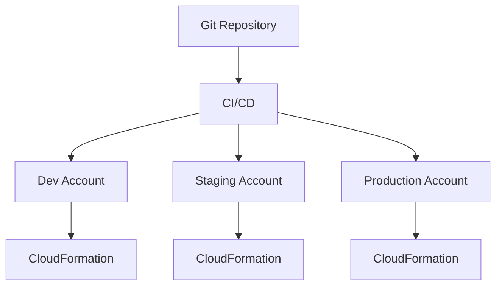
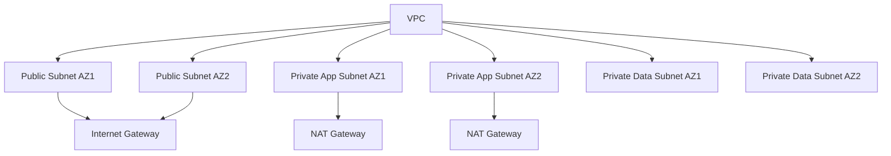
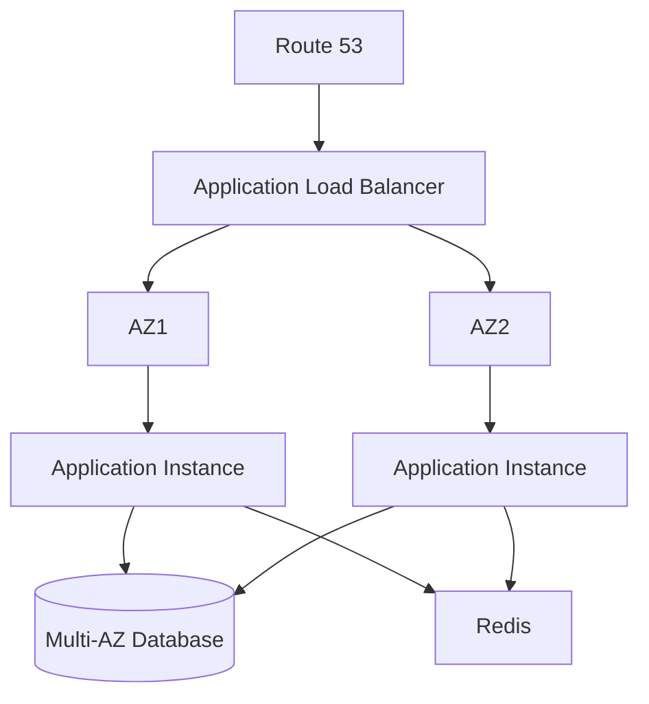

# 04- Architecture Scenario Questions

## Overview

CloudFormation architecture scenario questions test whether you can apply infrastructure-as-code concepts to real production systems rather than simply define CloudFormation resources.

A strong answer should connect CloudFormation with:

- Multi-account AWS architecture
- Multi-region deployments
- Networking and security
- Stateful services
- Nested and cross-stack dependencies
- CI/CD
- Rollbacks and recovery
- Drift management
- IAM and least privilege
- High availability
- Scalability
- Operational ownership

The key interview skill is to explain **why** a particular CloudFormation design is appropriate, what trade-offs it introduces, and how you would operate it safely in production.

## Scenario: Design a CloudFormation Architecture for a Production Backend

### Question

You need to deploy a production Django or FastAPI backend on AWS. The system requires networking, load balancing, compute, database, caching, and monitoring. How would you structure the CloudFormation templates?

### Strong Answer

Separate infrastructure into logical stacks rather than putting the entire environment into one large template.

A practical structure is:

```text
CloudFormation
├── Network Stack
│   ├── VPC
│   ├── Public Subnets
│   ├── Private Subnets
│   ├── Route Tables
│   └── NAT / Internet Gateway
│
├── Security Stack
│   ├── Security Groups
│   ├── IAM Roles
│   └── Policies
│
├── Data Stack
│   ├── RDS PostgreSQL
│   └── ElastiCache / Redis
│
├── Application Stack
│   ├── Load Balancer
│   ├── Target Group
│   ├── ECS / EC2 Resources
│   └── Auto Scaling
│
└── Observability Stack
    ├── CloudWatch Log Groups
    ├── Alarms
    └── Monitoring Resources
```

The dependency direction should generally be:

```text
Network
   |
   v
Security
   |
   +--------+
   |        |
   v        v
 Data   Application
           |
           v
     Observability
```

The goal is to establish clear ownership boundaries without creating unnecessary cross-stack dependencies.

## Scenario: Should You Use One Large Stack or Multiple Stacks?

### Question

Your team has a 2,000-line CloudFormation template containing networking, databases, application infrastructure, and monitoring. Would you keep it as one stack?

### Strong Answer

Not automatically.

A single stack provides atomic management and simple references, but very large stacks become harder to:

- Review
- Test
- Deploy
- Troubleshoot
- Reuse
- Delegate ownership
- Recover from failures

I would split the infrastructure when there are clear lifecycle or ownership boundaries.

For example:

```text
Network Stack
      |
      v
Application Stack
      |
      +----> Monitoring Stack
      |
      +----> Data Stack
```

However, excessive decomposition is also a problem. If every security group or individual resource becomes a separate stack, operational complexity increases.

The correct boundary is usually based on **lifecycle, ownership, dependency, and blast radius**, not simply template size.

## Scenario: How Would You Deploy the Same Architecture Across Environments?

### Question

You need separate development, staging, and production environments. How would you structure CloudFormation?

### Strong Answer

Use the same infrastructure definition wherever possible and parameterize environment-specific values.

For example:

```yaml
Parameters:
  Environment:
    Type: String
    AllowedValues:
      - dev
      - staging
      - prod

  InstanceType:
    Type: String
    Default: t3.micro
```

Environment-specific configuration should be controlled through:

- Parameters
- Mappings where appropriate
- SSM Parameter Store
- Secrets Manager for secrets
- CI/CD configuration
- Environment-specific configuration files

Avoid copying the entire template three times.

A common pattern is:

```text
Git
 |
 +---- template.yaml
 |
 +---- environments/
       +---- dev
       +---- staging
       +---- prod
```

The infrastructure definition remains consistent while environment-specific configuration is supplied separately.

## Scenario: How Would You Prevent Production Changes from Being Accidentally Deployed?

### Question

A developer can push to the infrastructure repository. How would you prevent an unreviewed CloudFormation change from reaching production?

### Strong Answer

Use a CI/CD workflow with multiple controls:


The production role should have restricted permissions and should ideally be assumable only by the deployment pipeline.

Important controls include:

- Pull request review
- Template validation
- Security scanning
- Change-set review
- IAM least privilege
- Production approval gates
- Deployment logging
- CloudTrail auditing

The key principle is to separate **code authorship** from **production deployment authority**.

## Scenario: A Production Update Requires Resource Replacement

### Question

A CloudFormation change set shows that an RDS resource will be replaced. What do you do?

### Strong Answer

Do not execute the change immediately.

First determine:

- Why replacement is required
- Whether the database contains production data
- Whether the replacement preserves the required data
- Whether downtime is expected
- Whether the old resource can coexist with the new resource
- Whether snapshots or backups are available
- Whether dependent applications can switch safely
- Whether the change should be implemented differently

The change set is a risk assessment input, not just a deployment preview.

For critical stateful resources, I would explicitly define lifecycle protections:

```yaml
Resources:
  Database:
    Type: AWS::RDS::DBInstance
    DeletionPolicy: Snapshot
    UpdateReplacePolicy: Snapshot
```

The exact strategy depends on the database architecture and recovery requirements.

## Scenario: An Update Fails During Production Deployment

### Question

Your CloudFormation stack enters `UPDATE_ROLLBACK_IN_PROGRESS`. What do you do?

### Strong Answer

First, do not immediately start another deployment.

I would:

1. Monitor the rollback.
2. Inspect stack events.
3. Identify the resource that caused the update failure.
4. Determine whether rollback is progressing.
5. Investigate the underlying AWS service.
6. Wait for `UPDATE_ROLLBACK_COMPLETE` if recovery succeeds.
7. If rollback fails, identify the resource blocking rollback.
8. Resolve the underlying issue.
9. Continue the rollback if required.
10. Reconcile the infrastructure before attempting another update.

Example:

```bash
aws cloudformation describe-stack-events \
  --stack-name production-api
```

If the stack reaches `UPDATE_ROLLBACK_FAILED`, recovery may require:

```bash
aws cloudformation continue-update-rollback \
  --stack-name production-api
```

The exact recovery procedure depends on the resource that prevented rollback.

## Scenario: A Resource Is Preventing Rollback

### Question

The stack is stuck in `UPDATE_ROLLBACK_FAILED`. How would you recover it?

### Strong Answer

I would identify the resource blocking rollback rather than repeatedly retrying the deployment.

For example:

```text
UPDATE_FAILED
      |
      v
UPDATE_ROLLBACK_IN_PROGRESS
      |
      v
Resource rollback fails
      |
      v
UPDATE_ROLLBACK_FAILED
```

Inspect:

```bash
aws cloudformation describe-stack-events \
  --stack-name production-api
```

After resolving the underlying issue:

```bash
aws cloudformation continue-update-rollback \
  --stack-name production-api
```

In exceptional cases, CloudFormation allows resources to be skipped during rollback.

That should be treated as a recovery mechanism, not a normal deployment strategy, because skipped resources can become inconsistent with the template.

## Scenario: CloudFormation Reports Success but the Application Is Broken

### Question

A CloudFormation deployment reaches `UPDATE_COMPLETE`, but your API is returning errors. Did CloudFormation fail?

### Strong Answer

Not necessarily.

CloudFormation primarily manages infrastructure state. A stack can reach `UPDATE_COMPLETE` while the application running on that infrastructure is unhealthy.

For example:

```text
CloudFormation
      |
      v
ECS Service Updated Successfully
      |
      v
Application Starts
      |
      v
Database Migration Fails
      |
      v
API Returns 500
```

Infrastructure deployment success and application health are different concerns.

A production pipeline should therefore include application-level verification:

- Health checks
- Smoke tests
- API validation
- Load balancer target health
- Application logs
- Metrics
- Database connectivity checks

## Scenario: How Would You Handle Database Migrations?

### Question

Your Django application requires a PostgreSQL schema migration during deployment. Would you put the migration directly into CloudFormation?

### Strong Answer

I would generally avoid treating database migrations as ordinary CloudFormation resource creation.

CloudFormation should primarily manage infrastructure.

Application migrations are better handled through an explicit deployment mechanism such as:

```text
CloudFormation
    |
    +---- Infrastructure
    |
    +---- ECS / EC2 / Application Runtime
              |
              v
        Deployment Pipeline
              |
              v
        Database Migration
              |
              v
        Application Release
```

The exact ordering depends on backward compatibility requirements.

For zero-downtime systems, migrations should generally be designed using an expand-and-contract strategy:

```text
Expand
  |
  v
Deploy compatible application
  |
  v
Backfill / migrate
  |
  v
Remove obsolete schema
```

This prevents the new application and old application versions from requiring incompatible database schemas during rolling deployments.

## Scenario: Design a Multi-Account CloudFormation Strategy

### Question

Your organization uses separate AWS accounts for development, staging, and production. How would you manage CloudFormation?

### Strong Answer

I would keep environments isolated at the AWS account level and use a centralized deployment process where appropriate.

Conceptually:



The deployment system should assume appropriately scoped roles in each target account.

Benefits include:

- Reduced blast radius
- Stronger production isolation
- Independent IAM boundaries
- Better auditability
- Environment isolation

Production credentials should not be embedded in the repository or CI/CD configuration.

## Scenario: How Would You Handle Multi-Region Deployment?

### Question

Your backend must run in two AWS regions for disaster recovery. How would you structure CloudFormation?

### Strong Answer

Use region-aware deployment rather than treating both regions as one stack.

Conceptually:

```text
                  Git
                   |
                   v
                 CI/CD
                /     \
               /       \
              v         v
        Region A       Region B
        CloudFormation CloudFormation
              |              |
              v              v
          Backend A       Backend B
```

Each region has its own CloudFormation stack state.

Region-specific concerns include:

- AMI availability
- Availability Zones
- Service availability
- VPC configuration
- Regional ARNs
- Database architecture
- Secrets
- Networking
- DNS
- Monitoring

The deployment pipeline should verify both regions independently.

## Scenario: Cross-Stack References Are Causing Deployment Problems

### Question

Your application stack imports values from a network stack. The network team wants to delete and recreate the network stack. What could go wrong?

### Strong Answer

The application stack may depend on exported values from the network stack.

For example:

```text
Network Stack
    |
    | Export
    v
VpcId
    |
    | ImportValue
    v
Application Stack
```

The network stack cannot necessarily change or remove an exported value while another stack depends on it.

This creates an operational coupling.

Before modifying the network stack, identify:

- Exported values
- `Fn::ImportValue`
- Stack dependencies
- Resources consuming those values

A senior engineer should treat cross-stack references as architectural dependencies, not merely template syntax.

## Scenario: How Would You Reduce Cross-Stack Coupling?

### Question

Your CloudFormation architecture has many `Fn::ImportValue` dependencies. How would you improve it?

### Strong Answer

First, identify whether all dependencies are actually necessary.

Alternatives can include:

- Passing values as parameters
- Using SSM Parameter Store
- Using nested stacks where lifecycle coupling is appropriate
- Using service discovery mechanisms
- Using configuration management
- Consolidating tightly coupled resources

The decision depends on lifecycle ownership.

For example:

```text
Tightly Coupled Resources
        |
        v
Nested Stack

Independent Lifecycle
        |
        v
Separate Stack + Explicit Interface
```

The objective is not to eliminate all dependencies but to make dependencies intentional and manageable.

## Scenario: How Would You Design a VPC CloudFormation Stack?

### Question

Design a production VPC for a backend API using CloudFormation.

### Strong Answer

A typical architecture is:



The application tier should generally not require direct public exposure.

Typical separation:

| Tier | Typical Resources |
|---|---|
| Public | Load balancer, NAT gateways |
| Private application | ECS, EC2, application workloads |
| Private data | RDS, database resources |

For high availability, distribute critical workloads across multiple Availability Zones.

## Scenario: How Would You Protect a Production Database?

### Question

How would you use CloudFormation to reduce accidental database deletion?

### Strong Answer

Use multiple layers of protection.

For example:

```yaml
Resources:
  ProductionDatabase:
    Type: AWS::RDS::DBInstance
    DeletionPolicy: Snapshot
    UpdateReplacePolicy: Snapshot
```

Additionally, use database-native deletion protection where supported, appropriate backup retention, IAM controls, and operational approval.

The important principle is defense in depth.

```text
IAM Controls
     +
CloudFormation Lifecycle Policies
     +
Database Protection
     +
Backups
     +
Monitoring
     +
Approval Process
```

No single CloudFormation property should be considered a complete disaster recovery strategy.

## Scenario: A Developer Modified a Resource Manually

### Question

A developer changes a production security group through the AWS Console. What problem does this create?

### Strong Answer

It can create configuration drift.

CloudFormation's expected state may differ from the actual AWS resource configuration.

```text
CloudFormation Template
        |
        v
Expected State
        |
        X
        |
Manual Change
        |
        v
Actual State
```

I would:

1. Identify the manual change.
2. Determine whether it was intentional.
3. Run drift detection where appropriate.
4. Decide whether the change belongs in the template.
5. Reconcile the actual infrastructure with the desired state.

The long-term goal should be to make the repository and deployment pipeline the authoritative source of infrastructure configuration.

## Scenario: Design a Safe CloudFormation Deployment Pipeline

### Question

What would your production CloudFormation pipeline look like?

### Strong Answer

A mature pipeline could be:


The pipeline should distinguish between:

- Template validation
- Infrastructure deployment
- Application deployment
- Application verification
- Production approval

This makes failures easier to isolate.

## Scenario: CloudFormation Deployment Is Too Slow

### Question

Your infrastructure deployment takes 40 minutes. How would you investigate it?

### Strong Answer

I would first identify which resources dominate deployment time.

Inspect stack events and deployment timing:

```bash
aws cloudformation describe-stack-events \
  --stack-name production-api
```

Then investigate:

- Resources being replaced
- Long-running resource creation
- Custom resources
- Nested stacks
- Dependencies
- Database operations
- ECS or Kubernetes stabilization
- Load balancer health checks

CloudFormation can create independent resources concurrently, so excessive sequential dependencies can unnecessarily increase deployment time.

I would avoid optimizing for speed by weakening safety controls.

## Scenario: A CloudFormation Custom Resource Is Failing

### Question

Your stack uses a Lambda-backed custom resource and deployment is stuck. How would you troubleshoot it?

### Strong Answer

The custom resource is part of the CloudFormation lifecycle, so its failure can block the stack operation.

Investigate:

- Lambda logs
- IAM permissions
- Network connectivity
- Timeout configuration
- Input properties
- Response handling
- External API availability
- Idempotency

The architecture is:

```text
CloudFormation
      |
      v
Custom Resource
      |
      v
Lambda
      |
      +---- AWS API
      |
      +---- External API
```

Custom resources should be designed to be:

- Idempotent
- Observable
- Timeout-aware
- Least-privileged
- Safe during create, update, and delete operations

## Scenario: How Would You Handle Secrets?

### Question

A FastAPI service requires a database password. Would you put the password directly into a CloudFormation parameter?

### Strong Answer

No. Sensitive credentials should not be stored directly in templates or source control.

Prefer services such as:

- AWS Secrets Manager
- AWS Systems Manager Parameter Store with appropriate protection

CloudFormation should reference the secret rather than embedding the secret value in Git.

The application should retrieve secrets using an appropriately scoped IAM role.

```text
Secrets Manager
      |
      v
Application IAM Role
      |
      v
Django / FastAPI
      |
      v
PostgreSQL
```

The principle is to separate infrastructure configuration from secret material.

## Scenario: How Would You Handle IAM Capabilities?

### Question

A CloudFormation deployment fails because the template creates IAM resources. What would you check?

### Strong Answer

I would check whether the deployment requires explicit acknowledgment of IAM capabilities.

For example:

```bash
aws cloudformation deploy \
  --template-file template.yaml \
  --stack-name production-api \
  --capabilities CAPABILITY_IAM
```

For templates involving named IAM resources, the required capability may be different.

I would also verify that the deployment role actually has permission to create or modify the requested IAM resources.

Capability acknowledgment does not grant IAM permissions. It is an explicit acknowledgment mechanism for potentially sensitive template behavior.

## Scenario: How Would You Minimize Production Blast Radius?

### Question

A company has dozens of backend services. How would you design CloudFormation to minimize the impact of a failed deployment?

### Strong Answer

I would use multiple isolation boundaries:

- Separate AWS accounts where appropriate
- Separate stacks
- Independent service deployment pipelines
- Least-privileged IAM roles
- Small, well-defined change sets
- Multi-AZ architecture
- Controlled production approvals
- Automated validation
- Strong monitoring
- Resource lifecycle protection

Conceptually:

```text
Organization
   |
   +---- Dev Account
   |
   +---- Staging Account
   |
   +---- Production Account
             |
             +---- Service A Stack
             |
             +---- Service B Stack
             |
             +---- Service C Stack
```

The objective is to prevent an infrastructure change for one service from unnecessarily affecting unrelated services.

## Scenario: Nested Stacks vs Separate Stacks

### Question

When would you use nested stacks instead of independent stacks?

### Strong Answer

Nested stacks are useful when a parent stack owns the lifecycle of the child infrastructure.

For example:

```text
Application Stack
       |
       +---- Network Nested Stack
       +---- Security Nested Stack
       +---- Compute Nested Stack
```

They are useful when:

- Components are tightly coupled
- The parent should manage the child lifecycle
- Templates need modularization
- Reusable template components are valuable

Independent stacks are often preferable when components have separate ownership or independent deployment lifecycles.

The decision should be based on lifecycle coupling rather than simply code organization.

## Scenario: How Would You Design a Reusable CloudFormation Module?

### Question

Multiple teams repeatedly create the same security group and logging configuration. How would you avoid copying the same template?

### Strong Answer

Use reusable infrastructure abstractions where appropriate, such as:

- Nested stacks
- CloudFormation modules
- Shared templates
- CI/CD templates
- Standardized infrastructure components

The goal is to establish a controlled interface.

```text
Standardized Component
        |
        +---- Inputs
        |
        +---- Defaults
        |
        +---- Security Controls
        |
        +---- Outputs
```

Avoid excessive abstraction. Infrastructure components should remain understandable to the engineers responsible for operating them.

## Scenario: Production Stack Has Drift

### Question

A production stack has significant drift. Would you immediately update the stack?

### Strong Answer

No.

First determine:

1. What drift exists.
2. Why it exists.
3. Whether the changes were intentional.
4. Whether the actual infrastructure is currently healthy.
5. Whether the template or infrastructure should become the source of truth.
6. Whether reconciliation could trigger replacement or downtime.

Blindly forcing the template onto production can itself become a production incident.

The safe approach is:

```text
Detect Drift
    |
    v
Understand Cause
    |
    v
Assess Risk
    |
    v
Update Template or Resource
    |
    v
Review Change Set
    |
    v
Controlled Deployment
```

## Scenario: How Would You Handle Disaster Recovery?

### Question

A production region is unavailable. CloudFormation templates are stored in Git. How does that help with disaster recovery?

### Strong Answer

CloudFormation provides reproducibility for infrastructure, but the templates alone do not guarantee disaster recovery.

A complete DR strategy must also address:

- Database backups
- Snapshot availability
- Cross-region data replication where required
- Secrets
- Container images
- DNS
- Networking
- External dependencies
- Configuration
- Recovery procedures
- RTO
- RPO

The infrastructure recovery process could look like:

```text
Git Repository
      |
      v
CloudFormation
      |
      +---- Network
      +---- Security
      +---- Compute
      +---- Load Balancing
      +---- Monitoring
      |
      v
Restore / Reconnect Data
      |
      v
Application Verification
      |
      v
Traffic Restoration
```

CloudFormation solves the infrastructure provisioning portion of DR, not the entire DR problem.

## Scenario: How Would You Handle a Shared Network?

### Question

Multiple backend services share a central VPC. Should every service own its networking resources?

### Strong Answer

Not necessarily.

A shared network may have its own ownership boundary:

```text
Network Stack
    |
    +---- VPC
    +---- Subnets
    +---- Route Tables
    +---- Network Controls
             |
             +---- Service A
             +---- Service B
             +---- Service C
```

Application stacks consume network resources through explicit interfaces.

This avoids allowing every application deployment to modify core networking infrastructure.

The trade-off is that application deployments become dependent on the network stack's interfaces.

## Scenario: A Change Set Contains Unexpected Deletions

### Question

A production change set unexpectedly shows resource deletions. What do you do?

### Strong Answer

Do not execute it.

Investigate:

- Template differences
- Logical ID changes
- Resource renames
- Conditional resources
- Parameter changes
- Removed resources
- Dependency changes
- Replacement behavior

A logical ID change can cause CloudFormation to interpret an existing resource as a different resource.

The correct workflow is:

```text
Unexpected Change
      |
      v
Stop Deployment
      |
      v
Inspect Change Set
      |
      v
Compare Templates
      |
      v
Identify Cause
      |
      v
Correct Template
      |
      v
Regenerate Change Set
      |
      v
Review Again
```

## Scenario: How Would You Design for High Availability?

### Question

How would CloudFormation support a highly available backend?

### Strong Answer

CloudFormation does not itself make an application highly available. It provisions the architecture required for high availability.

For example:



The infrastructure should distribute critical resources across Availability Zones and eliminate unnecessary single points of failure.

CloudFormation makes the architecture reproducible, while the underlying AWS services provide the availability mechanisms.

## Scenario: How Would You Manage Resource Ownership?

### Question

A CloudFormation stack contains resources owned by multiple teams. Would you keep that design?

### Strong Answer

I would review the ownership model.

A stack should generally have a coherent lifecycle and ownership boundary.

If:

```text
Team A owns Database
Team B owns Application
Team C owns Networking
```

then a single stack may create unnecessary coordination.

Separate stacks with explicit interfaces can reduce ownership coupling.

The important question is:

> Who is responsible for changing, operating, and recovering this resource?

CloudFormation architecture should reflect that answer.

## Scenario: How Would You Prevent Accidental Stack Deletion?

### Question

A production engineer accidentally runs a destructive operation against the wrong stack. How would you reduce this risk?

### Strong Answer

Use multiple safeguards:

- Restricted IAM permissions
- Separate production accounts
- Stack/resource protection where supported
- Deployment roles
- Approval workflows
- Explicit environment naming
- CI/CD controls
- AWS Organizations controls
- Auditing through CloudTrail
- Operational runbooks

For stateful resources, also use:

- Backup policies
- Snapshots
- Deletion protection
- Appropriate `DeletionPolicy`
- Appropriate `UpdateReplacePolicy`

Security should not depend on a developer remembering the correct command.

## Scenario: How Would You Troubleshoot a CloudFormation Incident?

### Question

A production deployment caused an outage. What is your troubleshooting sequence?

### Strong Answer

I would separate infrastructure state from application state.

```text
Incident
   |
   v
Check CloudFormation Stack Status
   |
   v
Inspect Stack Events
   |
   v
Identify Changed Resources
   |
   v
Check AWS Service Health
   |
   v
Check Application Health
   |
   v
Check Logs / Metrics
   |
   v
Determine Rollback or Forward Fix
   |
   v
Stabilize Production
   |
   v
Reconcile Infrastructure
```

During the incident, the priority is service recovery rather than immediately making the template perfect.

After stabilization, reconcile the infrastructure state and update the source-controlled definition.

## Scenario: How Would You Balance Speed and Safety?

### Question

Your development team says CloudFormation deployment controls are slowing releases. What would you change?

### Strong Answer

I would avoid removing safety controls globally.

Instead, optimize the pipeline:

- Run validation early
- Parallelize independent checks
- Use smaller stacks where appropriate
- Reuse tested infrastructure components
- Automate change-set creation
- Automatically deploy lower environments
- Require manual approval only for higher-risk environments
- Detect risky resource replacements automatically

The objective is:

```text
Fast Feedback
      +
Automated Validation
      +
Controlled Production Changes
```

not simply fewer deployment controls.

## Scenario: What Makes a CloudFormation Architecture Senior-Level?

### Question

What distinguishes a senior CloudFormation architecture from a basic one?

### Strong Answer

A basic design focuses on whether resources can be created.

A senior design considers:

| Concern | Senior-Level Consideration |
|---|---|
| Lifecycle | Clear creation, update, replacement, and deletion behavior |
| Dependencies | Minimized and explicitly designed |
| Security | Least-privileged deployment and runtime IAM |
| Reliability | Multi-AZ and failure-aware architecture |
| Deployment | Validation, change sets, approvals, monitoring |
| Recovery | Rollback and incident recovery procedures |
| State | Database and persistent resource protection |
| Drift | Controlled infrastructure ownership |
| Scalability | Reusable and parameterized infrastructure |
| Ownership | Clear stack and resource boundaries |
| Observability | Logs, metrics, events, and audit trails |
| DR | Reproducible infrastructure plus data recovery |
| Cost | Appropriate resource sizing and lifecycle management |
| Governance | Account, IAM, policy, and organizational controls |

The important shift is from **"Can CloudFormation deploy this?"** to **"Can the organization safely operate this infrastructure over years?"**

## Architecture Interview Checklist

When answering a CloudFormation architecture scenario, consider the following sequence:

```text
Requirements
    |
    v
Resource Architecture
    |
    v
Stack Boundaries
    |
    v
Dependencies
    |
    v
Security
    |
    v
High Availability
    |
    v
Deployment Strategy
    |
    v
Rollback / Recovery
    |
    v
Observability
    |
    v
DR
    |
    v
Operational Ownership
```

A strong interview answer should explain trade-offs rather than presenting one architecture as universally correct.

## Common Architecture Mistakes

### One giant stack for the entire organization

This creates a large blast radius and makes independent deployments difficult.

### Too many tiny stacks

Excessive decomposition creates dependency and operational overhead.

### Excessive cross-stack references

Tight coupling makes changes and deletions harder.

### Treating CloudFormation as application deployment

Infrastructure provisioning and application release management are related but distinct concerns.

### Ignoring stateful resources

Databases, object storage, and persistent volumes require explicit lifecycle and recovery planning.

### Assuming rollback guarantees data recovery

Infrastructure rollback does not replace database backups or disaster recovery.

### Allowing manual infrastructure changes

Manual changes introduce drift and reduce confidence in the declared configuration.

### Giving CI/CD administrator permissions

Broad deployment permissions increase the blast radius of compromised credentials or pipeline mistakes.

### Treating change sets as guarantees

A change set shows intended infrastructure changes but does not guarantee that the runtime operation will succeed.

### Designing only for deployment

A production architecture must also account for:

- Failure
- Recovery
- Monitoring
- Ownership
- Security
- Upgrades
- Drift
- Disaster recovery

## Interview Traps

### "CloudFormation is transactional."

Not completely.

CloudFormation can orchestrate resource changes and perform rollback operations, but it is not a universal distributed transaction system.

### "Rollback always restores the previous state."

Not necessarily.

Rollback can fail, external changes can interfere, and some side effects are not automatically reversible.

### "One stack is always simpler."

Initially, perhaps. At organizational scale, lifecycle and ownership coupling can make a monolithic stack harder to operate.

### "Separate stacks are always better."

Not necessarily.

Excessive stack fragmentation creates dependency and operational complexity.

### "Change sets prevent outages."

No.

They help engineers review proposed changes, but deployment failures and application-level failures can still occur.

### "CloudFormation provides high availability."

CloudFormation provisions infrastructure. High availability comes from the architecture of the underlying AWS resources.

### "CloudFormation is enough for disaster recovery."

No.

CloudFormation provides infrastructure reproducibility, but DR also requires data protection, recovery procedures, DNS strategy, secrets, dependencies, and tested RTO/RPO objectives.

## Key Takeaways

- CloudFormation architecture should be designed around lifecycle, ownership, dependency, and blast-radius boundaries.
- Separate stacks are useful when infrastructure components have independent ownership or deployment lifecycles.
- Nested stacks are appropriate when a parent should control the lifecycle of tightly coupled child infrastructure.
- Avoid both giant monolithic stacks and excessive stack fragmentation.
- Treat cross-stack references as architectural dependencies.
- Use change sets to review potentially destructive or replacement-heavy changes before execution.
- Resource replacement should receive explicit production risk analysis, especially for stateful resources.
- CloudFormation rollback is infrastructure recovery, not a universal application or database transaction.
- `UPDATE_ROLLBACK_FAILED` requires identifying and resolving the resource blocking rollback before continuing recovery.
- Production infrastructure should be deployed through controlled CI/CD pipelines with validation, security checks, approvals, and monitoring.
- CloudFormation should not be used as a substitute for application deployment strategies or database migration design.
- Multi-account and multi-region architectures should use isolated deployment boundaries and appropriately scoped IAM roles.
- Manual changes to managed resources introduce drift and should be reconciled deliberately.
- Stateful resources require explicit backup, retention, replacement, and deletion strategies.
- High availability comes from the underlying architecture; CloudFormation makes that architecture reproducible.
- Disaster recovery requires both infrastructure reproducibility and data recovery capabilities.
- A senior CloudFormation design considers not only how infrastructure is created, but how it is updated, monitored, secured, recovered, and operated over its entire lifecycle.