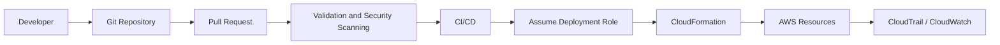

# 05- Security Questions

## Overview

CloudFormation security questions focus on whether infrastructure can be provisioned without creating excessive permissions, exposing secrets, weakening network controls, or allowing unsafe production changes.

A strong answer should connect CloudFormation with:

- IAM and least privilege
- CloudFormation service roles
- IAM capabilities
- Secrets Manager and Parameter Store
- Security groups and network boundaries
- Encryption
- Resource policies
- Stack policies
- Change sets
- CloudTrail and auditability
- Multi-account deployment
- CI/CD security
- Drift management
- Resource protection
- Incident recovery

The key distinction is that CloudFormation does not automatically make infrastructure secure. It makes infrastructure **repeatable and declarative**. The security of the resulting architecture depends on the resources, IAM policies, deployment process, and operational controls defined around it.

## Scenario: How Would You Secure CloudFormation Deployments?

### Question

How would you secure a production CloudFormation deployment pipeline?

### Strong Answer

I would separate infrastructure authoring from infrastructure deployment authority.

A typical design is:



Important controls include:

- Protected Git branches
- Mandatory code review
- Template validation
- IAM policy analysis
- Secret scanning
- Infrastructure security scanning
- Dedicated deployment roles
- Short-lived credentials
- Least-privileged IAM permissions
- Production approval gates
- CloudTrail auditing
- Change-set review
- Account-level isolation

The CI/CD identity should not receive unrestricted administrator permissions simply because it deploys infrastructure.

## Scenario: What Is the Principle of Least Privilege in CloudFormation?

### Question

How does least privilege apply to CloudFormation?

### Strong Answer

Least privilege means granting the deployment process only the permissions required to create, modify, and delete the resources it actually manages.

For example, if a stack manages:

- ECS
- IAM roles
- CloudWatch
- Application Load Balancing

the deployment identity should not automatically receive permissions for unrelated services such as:

- Organizations
- Billing
- IAM user administration
- Route 53 zones unrelated to the deployment

The permission model should also distinguish between:

```text
Developer
    |
    v
Code Repository
    |
    v
CI/CD
    |
    v
CloudFormation Deployment Role
    |
    v
AWS Resources
```

The developer does not necessarily need direct permission to modify every production resource.

## Scenario: Should CloudFormation Use AdministratorAccess?

### Question

Is it acceptable to attach `AdministratorAccess` to a CloudFormation deployment role?

### Strong Answer

It may work technically, but it is generally a poor production security design.

CloudFormation acts using the permissions available to its deployment identity or service role. If that identity has administrator permissions, a compromised pipeline or malicious template could potentially make extremely broad changes.

The better approach is to:

- Define the resources the stack owns.
- Grant only required service actions.
- Scope permissions to appropriate resources where possible.
- Separate deployment roles by environment or workload.
- Use separate accounts for stronger isolation.

The deployment role itself becomes a significant security boundary and should therefore be treated as privileged infrastructure.

## Scenario: What Is a CloudFormation Service Role?

### Question

Why would you use a CloudFormation service role?

### Strong Answer

A CloudFormation service role allows CloudFormation to perform operations using a specific IAM role rather than relying on the permissions of the person initiating the stack operation.

This provides a useful separation:

```text
Engineer
   |
   | limited permissions
   v
CloudFormation
   |
   | assumes service role
   v
AWS Resources
```

The service role can define the permissions CloudFormation is allowed to exercise.

This is useful for:

- Centralized deployment permissions
- CI/CD
- Consistent authorization
- Reduced dependency on individual user permissions
- Auditing

A service role must still follow least privilege. Using a service role does not make an overly permissive policy secure.

## Scenario: What Happens If a Developer Can Create Any CloudFormation Stack?

### Question

Why can unrestricted CloudFormation permissions be dangerous?

### Strong Answer

CloudFormation is an infrastructure orchestration mechanism. If a principal can create arbitrary stacks with broad deployment permissions, they may be able to indirectly create or modify sensitive resources.

For example:

```text
User
  |
  v
CloudFormation
  |
  +---- IAM Role
  +---- Security Group
  +---- S3 Bucket
  +---- Lambda
  +---- Database
```

The security risk is not limited to the CloudFormation API itself. The effective risk depends on what resources the principal is allowed to provision through CloudFormation.

Therefore, security controls must consider both:

- CloudFormation permissions
- Permissions available to CloudFormation during resource provisioning

## Scenario: What Are CloudFormation IAM Capabilities?

### Question

What does `CAPABILITY_IAM` mean?

### Strong Answer

CloudFormation requires explicit acknowledgment when a template contains IAM resources that can create or modify permissions.

For example:

```bash
aws cloudformation deploy \
  --template-file template.yaml \
  --stack-name production-api \
  --capabilities CAPABILITY_IAM
```

For templates involving named IAM resources, the appropriate capability acknowledgment may be different.

The important interview point is:

> A capability acknowledgment does not grant IAM permissions.

It tells CloudFormation that the caller has explicitly acknowledged that the template can affect IAM resources.

The deployment identity must still have the actual IAM permissions required to perform the operation.

## Scenario: Why Is CAPABILITY_NAMED_IAM More Sensitive?

### Question

When would `CAPABILITY_NAMED_IAM` be required, and why should it receive additional scrutiny?

### Strong Answer

`CAPABILITY_NAMED_IAM` is relevant when a template creates or modifies IAM resources with explicitly specified names.

Named IAM resources deserve additional scrutiny because names can:

- Collide with existing resources
- Create stronger coupling
- Make multi-environment deployments harder
- Affect shared-resource assumptions

A production review should verify:

- Resource names
- Trust policies
- Permissions policies
- Environment isolation
- Resource ownership
- Whether naming is actually necessary

Avoid explicitly naming IAM resources unless there is a clear operational reason.

## Scenario: How Would You Store Secrets in CloudFormation?

### Question

A FastAPI application needs a PostgreSQL password. How would you represent the secret in CloudFormation?

### Strong Answer

Do not hardcode the password in the template.

Avoid:

```yaml
Parameters:
  DatabasePassword:
    Type: String
    Default: SuperSecretPassword123
```

The secret should be managed through a dedicated secret-management mechanism such as:

- AWS Secrets Manager
- AWS Systems Manager Parameter Store

For example, the infrastructure can create or reference a Secrets Manager secret while the application retrieves the secret at runtime.

```text
Secrets Manager
      |
      v
Application IAM Role
      |
      v
Django / FastAPI
      |
      v
PostgreSQL
```

This separates:

- Infrastructure definition
- Secret storage
- Runtime secret access

## Scenario: Can You Put Secrets in CloudFormation Parameters?

### Question

Is using a `NoEcho` parameter enough to protect a password?

### Strong Answer

No.

`NoEcho` helps prevent parameter values from being displayed in certain CloudFormation outputs and interfaces, but it should not be treated as a complete secret-management solution.

Sensitive values can also create exposure risks through:

- Template storage
- Logs
- CI/CD systems
- Resource properties
- Outputs
- Application configuration
- Operational tooling

For production systems, use a dedicated secret-management service and avoid placing secret values directly in source-controlled templates.

## Scenario: Should Secrets Be Returned as CloudFormation Outputs?

### Question

Would you export a database password or API token using `Outputs`?

### Strong Answer

No.

CloudFormation outputs are intended for sharing non-sensitive infrastructure values such as:

```yaml
Outputs:
  LoadBalancerDnsName:
    Value: !GetAtt ApplicationLoadBalancer.DNSName
```

Do not expose:

- Passwords
- API tokens
- Private keys
- Credentials
- Sensitive connection strings

Outputs should be treated as infrastructure metadata, not a secure secret store.

## Scenario: How Would You Secure IAM Roles Created by CloudFormation?

### Question

Your template creates an IAM role for a Lambda function. What would you review?

### Strong Answer

I would review both the trust policy and the permissions policy.

For example:

```yaml
Resources:
  ApplicationRole:
    Type: AWS::IAM::Role
    Properties:
      AssumeRolePolicyDocument:
        Version: "2012-10-17"
        Statement:
          - Effect: Allow
            Principal:
              Service:
                - lambda.amazonaws.com
            Action:
              - sts:AssumeRole
```

Then I would review:

- Trusted principals
- Allowed actions
- Resource scope
- Conditions
- Wildcards
- Permission boundaries where applicable
- Logging permissions
- Cross-account access

A secure trust relationship answers:

> Who is allowed to assume this role?

A secure permissions policy answers:

> What can the role do after assuming it?

These are separate security questions.

## Scenario: Why Is `Resource: "*"` Dangerous?

### Question

What is wrong with this IAM policy?

```yaml
Statement:
  - Effect: Allow
    Action:
      - s3:GetObject
    Resource: "*"
```

### Strong Answer

The policy grants access to objects across all resources matching the action's authorization model instead of restricting access to the specific bucket or object paths required by the application.

Where AWS supports resource-level permissions, scope access as narrowly as practical.

For example:

```yaml
Statement:
  - Effect: Allow
    Action:
      - s3:GetObject
    Resource:
      - arn:aws:s3:::application-assets-prod/private/*
```

The exact ARN structure depends on the service and API being authorized.

Wildcards are not automatically insecure, but they should be intentional and justified.

## Scenario: How Would You Secure an S3 Bucket Created by CloudFormation?

### Question

What security controls would you apply to an S3 bucket?

### Strong Answer

I would consider:

- Block Public Access
- Bucket encryption
- Bucket policy restrictions
- IAM access controls
- Versioning where appropriate
- Access logging or CloudTrail data events where required
- Lifecycle policies
- Secure transport
- Ownership controls
- Backup and recovery requirements

For example:

```yaml
Resources:
  ApplicationBucket:
    Type: AWS::S3::Bucket
    Properties:
      BucketEncryption:
        ServerSideEncryptionConfiguration:
          - ServerSideEncryptionByDefault:
              SSEAlgorithm: AES256

      PublicAccessBlockConfiguration:
        BlockPublicAcls: true
        BlockPublicPolicy: true
        IgnorePublicAcls: true
        RestrictPublicBuckets: true
```

The exact encryption mechanism should follow organizational requirements.

## Scenario: How Would You Secure a Database Stack?

### Question

Your CloudFormation stack provisions PostgreSQL. What security controls would you include?

### Strong Answer

I would design the database so that it is not directly exposed to the public internet.

Typical controls include:

- Private subnets
- Restricted security groups
- Encryption at rest
- Encryption in transit
- Strong authentication
- Secrets Manager
- Backup retention
- Multi-AZ where required
- Monitoring
- Least-privileged application access

A typical network flow is:

```text
Internet
   |
   v
Load Balancer
   |
   v
Private Application Subnets
   |
   v
Private Database Subnets
   |
   v
PostgreSQL
```

The application security group should be allowed to connect to the database security group on the required database port, rather than allowing broad access from the internet.

## Scenario: How Would You Secure Security Groups?

### Question

What security-group mistakes commonly appear in CloudFormation templates?

### Strong Answer

Common mistakes include:

```text
0.0.0.0/0
      |
      +---- PostgreSQL 5432
      +---- Redis 6379
      +---- Internal admin ports
```

This can expose internal services unnecessarily.

Instead, define communication based on workload relationships.

For example:

```text
ALB SG
  |
  v
Application SG
  |
  v
Database SG
```

The database security group should permit access from the application security group rather than from arbitrary internet addresses.

The same principle applies to Redis and other internal services.

## Scenario: How Would You Secure a CloudFormation Template Before Deployment?

### Question

What security checks would you perform before allowing a template into production?

### Strong Answer

I would combine static validation, security analysis, and deployment review.

A pipeline could include:

```text
Template
   |
   +--> Syntax / Validation
   |
   +--> Linting
   |
   +--> IAM Policy Analysis
   |
   +--> Secret Scanning
   |
   +--> Infrastructure Security Scan
   |
   +--> Change Set
   |
   +--> Human Review
   |
   v
Production
```

The checks should identify issues such as:

- Public resources
- Excessive IAM permissions
- Unencrypted data stores
- Open security groups
- Hardcoded credentials
- Missing logging
- Unsafe resource policies
- Destructive changes

Security scanning should complement, not replace, architectural review.

## Scenario: How Would You Protect CloudFormation Stack Updates?

### Question

How can you prevent accidental modification of critical resources?

### Strong Answer

Use multiple layers:

- Change sets
- Stack policies where appropriate
- IAM permissions
- Resource-specific deletion protection
- `DeletionPolicy`
- `UpdateReplacePolicy`
- Production approvals
- Separate deployment roles
- Monitoring

For example:

```yaml
Resources:
  ProductionDatabase:
    Type: AWS::RDS::DBInstance
    DeletionPolicy: Snapshot
    UpdateReplacePolicy: Snapshot
```

These policies reduce the risk of accidental data loss, but they do not replace backups or access controls.

## Scenario: What Is a CloudFormation Stack Policy?

### Question

What problem does a stack policy solve?

### Strong Answer

A stack policy can restrict which resources are allowed to be updated during stack operations.

This is particularly useful for protecting critical resources such as production databases.

Conceptually:

```text
CloudFormation Update
        |
        v
Stack Policy
        |
   +----+----+
   |         |
Allowed    Denied
   |         |
   v         v
Update    Protected
```

A stack policy should be treated as one layer of defense.

It should not be the only control protecting a critical resource because IAM, deletion protection, backups, and deployment approvals provide additional safeguards.

## Scenario: What Is the Difference Between Stack Policy and IAM?

### Question

Are stack policies and IAM policies the same thing?

### Strong Answer

No.

| Control | Purpose |
|---|---|
| IAM policy | Controls what a principal can perform |
| CloudFormation service role | Defines permissions CloudFormation can use |
| Stack policy | Restricts updates to resources within a stack |
| Resource policy | Controls access to supported AWS resources |
| Security group | Controls network traffic |
| `DeletionPolicy` | Controls resource behavior when removed from a stack |
| `UpdateReplacePolicy` | Controls old resource handling during replacement |

These controls operate at different layers.

A secure architecture combines them rather than relying on one mechanism.

## Scenario: How Would You Secure Cross-Account CloudFormation?

### Question

Your CI/CD system deploys CloudFormation into production accounts. How would you secure the cross-account deployment?

### Strong Answer

Use role assumption rather than long-lived access keys.

Conceptually:

```text
CI/CD Account
      |
      | AssumeRole
      v
Production Account
      |
      v
CloudFormation Deployment Role
      |
      v
AWS Resources
```

The trust policy in the production account should restrict who can assume the deployment role.

I would also:

- Restrict the role permissions
- Use short-lived credentials
- Separate roles by environment
- Audit role assumptions
- Protect the CI/CD system
- Prevent developers from directly bypassing the deployment process where appropriate

The production account should not contain reusable CI/CD access keys.

## Scenario: How Would You Secure Multi-Account CloudFormation Deployments?

### Question

What security advantages do separate AWS accounts provide?

### Strong Answer

Account boundaries provide a stronger blast-radius boundary than simply using different CloudFormation stacks.

For example:

```text
AWS Organization
      |
      +---- Development Account
      |
      +---- Staging Account
      |
      +---- Production Account
```

Benefits include:

- IAM isolation
- Separate resource ownership
- Reduced accidental access
- Stronger billing boundaries
- Independent service quotas
- Better incident containment
- Organization-level controls

CloudFormation then operates within those account boundaries.

## Scenario: How Would You Secure CloudFormation StackSets?

### Question

Your organization uses StackSets to deploy infrastructure to many AWS accounts. What security concerns should you consider?

### Strong Answer

StackSets amplify both operational capability and security risk because one deployment can affect many accounts or regions.

I would consider:

- Administrative account security
- Target account trust relationships
- Execution roles
- Permission boundaries
- Deployment scope
- Organizational unit targeting
- Region selection
- Approval workflows
- CloudTrail auditing
- Failure tolerance
- Rollback strategy

The principle is:

> The larger the deployment scope, the stronger the authorization and validation controls should be.

A mistake in a single-account stack can become an organization-wide incident when deployed through StackSets.

## Scenario: How Would You Prevent Public Resource Exposure?

### Question

A CloudFormation template creates an S3 bucket, load balancer, or database. How would you prevent accidental public exposure?

### Strong Answer

Use defense in depth.

Controls can include:

- Secure template defaults
- IAM policies
- Resource policies
- AWS Organizations controls
- Service control policies where appropriate
- Security scanning
- AWS Config rules
- Security Hub controls
- Change-set review
- Automated compliance checks

For example:

```text
CloudFormation Template
        |
        v
Security Validation
        |
        v
Policy / Organization Controls
        |
        v
CloudFormation Deployment
        |
        v
AWS Config / Monitoring
```

The best design prevents insecure configurations before deployment rather than relying exclusively on post-deployment detection.

## Scenario: What Is the Security Risk of Hardcoded ARNs?

### Question

Are hardcoded ARNs always a security problem?

### Strong Answer

Not necessarily.

Hardcoded ARNs can create:

- Environment coupling
- Region coupling
- Account coupling
- Maintenance problems

They become a security concern when they unintentionally grant access to the wrong resource or environment.

Prefer dynamic references or parameters where appropriate.

For example, production configuration should not accidentally reference a development bucket:

```text
Production Lambda
      |
      X
Development S3 Bucket
```

Environment-specific resource references should be deliberate and validated.

## Scenario: How Would You Prevent a Production Lambda from Accessing Development Resources?

### Question

How would you design CloudFormation and IAM to prevent cross-environment access?

### Strong Answer

Use multiple isolation mechanisms:

```text
Production Account
    |
    +---- Production Lambda Role
              |
              +---- Production Resources
```

Development should ideally be in a separate account.

Within an account, IAM policies should scope access to production resources only.

The strongest approach is:

```text
Account Isolation
      +
IAM Isolation
      +
Resource Policy Isolation
      +
Network Isolation
```

Security should not rely only on resource naming conventions.

## Scenario: How Would You Handle CloudFormation Drift From a Security Perspective?

### Question

Someone manually modifies a production security group. Why is this a security issue?

### Strong Answer

Manual changes can bypass the security controls represented by the infrastructure repository.

For example:

```text
Approved Template
      |
      v
Secure Security Group
      |
      X
Manual Console Change
      |
      v
Unexpected Ingress Rule
```

The correct response is:

1. Detect the change.
2. Determine who made it.
3. Review CloudTrail.
4. Assess whether the change is malicious or accidental.
5. Reconcile the resource.
6. Update the template if the change was legitimate.
7. Strengthen controls if the change bypassed the deployment process.

Drift detection therefore has both reliability and security value.

## Scenario: How Would You Audit CloudFormation Changes?

### Question

How would you determine who changed a production CloudFormation resource?

### Strong Answer

Use AWS audit capabilities such as CloudTrail alongside CloudFormation stack events.

CloudFormation events can help answer:

> What happened during the stack operation?

CloudTrail can help answer:

> Which principal performed the API operation?

A production investigation might correlate:

```text
CloudFormation Stack Events
          +
CloudTrail Events
          +
CI/CD Logs
          +
AWS Resource Logs
```

This provides a much stronger audit trail than relying on CloudFormation events alone.

## Scenario: How Would You Secure CloudFormation Logs and Audit Data?

### Question

What security controls would you apply to infrastructure audit logs?

### Strong Answer

Audit data should be protected against unauthorized modification and excessive access.

Consider:

- Restricted IAM access
- Centralized logging
- Encryption
- Appropriate retention
- Log integrity requirements
- Separate security/audit accounts
- CloudTrail organization trails where appropriate
- Monitoring for suspicious activity

Security logs should not be writable by the same identities that are being audited whenever practical.

## Scenario: What Happens If the CI/CD Pipeline Is Compromised?

### Question

Assume an attacker compromises your CI/CD system. How would your CloudFormation architecture limit the damage?

### Strong Answer

I would assume the deployment pipeline is a high-value target and design multiple containment boundaries.

Controls include:

- Short-lived credentials
- Least-privileged deployment roles
- Separate roles per environment
- Production approval gates
- Protected branches
- Code signing or artifact integrity controls where applicable
- Secret isolation
- Account separation
- CloudTrail monitoring
- Organization-level guardrails
- Restricted network access
- Pipeline hardening

The architecture should make this path difficult:

```text
Compromised CI/CD
       |
       v
Limited Deployment Role
       |
       X
Unrelated AWS Accounts
       |
       X
Unrelated Services
```

The goal is to reduce the blast radius rather than assume the pipeline can never be compromised.

## Scenario: How Would You Prevent CloudFormation From Creating Privileged IAM Roles?

### Question

A developer submits a template that creates an administrator-level IAM role. How would you prevent deployment?

### Strong Answer

I would enforce controls at multiple stages:

```text
Pull Request
    |
    v
IAM Policy Analysis
    |
    v
Security Review
    |
    v
CI/CD Policy Check
    |
    v
Deployment Role Permissions
    |
    v
Organization-Level Guardrails
```

The exact implementation depends on the organization's governance model.

The important principle is that security policy should be enforced independently of developer intent.

## Scenario: What Is the Risk of `iam:PassRole`?

### Question

Why is `iam:PassRole` important when securing CloudFormation deployments?

### Strong Answer

`iam:PassRole` allows a principal to pass an IAM role to an AWS service that will use that role.

This can be highly sensitive.

For example:

```text
Developer
    |
    | PassRole
    v
AWS Service
    |
    v
Privileged IAM Role
```

If the principal can pass a highly privileged role to a service and control that service's behavior, the effective privilege may be much greater than the principal's direct permissions suggest.

Therefore, `iam:PassRole` should be tightly scoped to:

- Specific roles
- Specific services
- Specific deployment workflows

This is a common IAM interview trap.

## Scenario: How Would You Secure CloudFormation Custom Resources?

### Question

A CloudFormation custom resource invokes Lambda. What security concerns would you review?

### Strong Answer

I would review:

- Lambda execution role
- CloudFormation invocation path
- IAM permissions
- External API credentials
- Network access
- Secrets
- Logging
- Timeout behavior
- Input validation
- Idempotency
- Resource deletion behavior

The Lambda should receive only the permissions necessary to perform its custom-resource operation.

Avoid giving the custom-resource function broad administrator permissions simply because it is part of infrastructure deployment.

## Scenario: How Would You Secure KMS Usage in CloudFormation?

### Question

Your CloudFormation stack provisions encrypted S3, RDS, or application resources. What should you consider with KMS?

### Strong Answer

Encryption requires more than specifying a KMS key.

Review:

- Key ownership
- Key policy
- IAM permissions
- Which services can use the key
- Which principals can administer the key
- Cross-account access
- Key rotation requirements
- Backup and recovery implications

A common mistake is to grant broad KMS permissions because the application only needs to encrypt or decrypt data.

Separate:

```text
Key Administration
        |
        X
Application Data Access
```

where appropriate.

## Scenario: How Would You Secure Cross-Account KMS Access?

### Question

An application in Account A needs to use a KMS key in Account B. What security considerations apply?

### Strong Answer

Cross-account KMS access requires coordination between IAM permissions and the KMS key policy.

I would verify:

- The calling principal
- The IAM policy
- The KMS key policy
- Account trust
- Required actions
- Encryption context conditions where appropriate
- Resource scope

Cross-account encryption should be explicitly designed rather than enabled through broad wildcard permissions.

## Scenario: How Would You Handle Security Group Rules During Stack Updates?

### Question

A CloudFormation update modifies a security group used by production services. What would you check?

### Strong Answer

I would treat network-policy changes as production security changes.

Review:

- Added ingress rules
- Removed ingress rules
- Source CIDRs
- Referenced security groups
- Ports
- Protocols
- Public exposure
- Application dependencies
- Replacement behavior

A change set can be used to review the proposed infrastructure change before execution.

The risk is not just whether the stack update succeeds. The question is whether the resulting network policy remains secure.

## Scenario: How Would You Protect CloudFormation From Unauthorized Stack Deletion?

### Question

What controls would you use to prevent an attacker or operator from deleting a production stack?

### Strong Answer

Use layered controls:

```text
IAM
 |
 +--> Restrict cloudformation:DeleteStack
 |
 +--> Restrict production role assumption
 |
 v
CloudFormation
 |
 +--> Resource Protection
 |
 +--> DeletionPolicy
 |
 +--> Backup / Snapshot
 |
 v
Recovery
```

For critical resources, combine:

- Least-privileged IAM
- Production approval
- Account separation
- Resource deletion protection where supported
- `DeletionPolicy`
- `UpdateReplacePolicy`
- Backups
- Monitoring

The goal is to make accidental deletion difficult and recovery possible.

## Scenario: How Would You Secure a CloudFormation-Based CI/CD System?

### Question

What security controls should exist around a GitHub Actions or similar CI/CD deployment pipeline?

### Strong Answer

I would focus on identity, secrets, authorization, and supply-chain integrity.

Important controls include:

- OIDC-based short-lived AWS credentials where supported
- No long-lived AWS access keys in repository secrets
- Protected branches
- Required reviews
- Restricted workflow permissions
- Environment protection
- Separate deployment roles
- Least privilege
- Artifact integrity
- Dependency scanning
- Infrastructure scanning
- Audit logging

The desired model is:

```text
GitHub Actions
      |
      | OIDC
      v
AWS STS
      |
      | Temporary Credentials
      v
Deployment Role
      |
      v
CloudFormation
```

This avoids storing permanent AWS credentials in the CI/CD platform.

## Scenario: How Would You Secure CloudFormation in a Shared AWS Account?

### Question

Multiple teams use the same AWS account. How would you prevent one team's CloudFormation stack from affecting another team's resources?

### Strong Answer

Use explicit ownership and permission boundaries.

Controls include:

- Separate deployment roles
- Resource-scoped IAM policies
- Stack ownership conventions
- Tagging
- Stack policies
- Resource policies
- Permission boundaries
- Organizational controls where applicable

However, if strong isolation is required, separate AWS accounts are usually a better security boundary than relying exclusively on stack-level controls.

## Scenario: How Would You Detect a Security Regression in Infrastructure?

### Question

A previously private resource becomes publicly accessible after a CloudFormation deployment. How would you detect it?

### Strong Answer

Use both preventive and detective controls.

```text
Template
   |
   v
Pre-Deployment Security Scan
   |
   v
Change Set Review
   |
   v
Deployment
   |
   v
AWS Config / Security Monitoring
   |
   v
Alert
```

Potential controls include:

- Infrastructure-as-code scanning
- AWS Config
- Security Hub
- CloudTrail
- CloudWatch
- GuardDuty
- Organization-level controls

The most effective strategy is to catch high-risk changes before deployment and continuously detect configuration changes afterward.

## Scenario: How Would You Handle a Security Incident Caused by CloudFormation?

### Question

A CloudFormation deployment accidentally exposes a production resource. What is your response?

### Strong Answer

The immediate priority is containment.

I would:

1. Stop further deployments.
2. Identify the affected resource.
3. Restrict or remove the exposure.
4. Assess whether sensitive data was accessible.
5. Review CloudTrail and CloudFormation events.
6. Preserve relevant logs.
7. Rotate compromised credentials if necessary.
8. Restore the intended configuration.
9. Determine the root cause.
10. Add preventive controls to the deployment pipeline.

During an incident, I would prioritize service and security stabilization before performing broad infrastructure refactoring.

## Scenario: How Would You Prevent Drift From Becoming a Security Problem?

### Question

What would you do if production security controls were repeatedly changed manually?

### Strong Answer

I would treat repeated drift as an organizational control problem rather than simply a CloudFormation problem.

I would investigate:

- Why engineers are bypassing CloudFormation
- Whether the template is missing required capabilities
- Whether the deployment process is too slow
- Whether emergency access is required
- Whether permissions are too broad
- Whether manual changes are being documented

Then I would establish:

```text
Infrastructure Repository
        |
        v
Approved Change
        |
        v
CI/CD
        |
        v
CloudFormation
        |
        v
AWS
```

Emergency access should be controlled, audited, and reconciled back into the declared infrastructure.

## Security Comparison: Common CloudFormation Controls

| Control | Primary Security Purpose |
|---|---|
| IAM policy | Controls principal permissions |
| CloudFormation service role | Controls permissions available to CloudFormation |
| Stack policy | Restricts stack resource updates |
| `DeletionPolicy` | Controls resource behavior on stack removal |
| `UpdateReplacePolicy` | Controls old resource handling during replacement |
| Secrets Manager | Secure secret storage |
| Parameter Store | Centralized configuration and parameter storage |
| KMS | Encryption key management |
| Security groups | Network access control |
| Resource policies | Resource-level authorization |
| CloudTrail | API activity auditing |
| AWS Config | Configuration/compliance detection |
| Security Hub | Security findings aggregation |
| Change sets | Review proposed infrastructure changes |
| Account isolation | Strong blast-radius boundary |

## Common Security Mistakes

### Hardcoding passwords in templates

**Why it happens:** Developers treat CloudFormation as a configuration file.

**Why it is dangerous:** Secrets can enter source control, logs, CI/CD systems, or deployment artifacts.

**Better approach:** Use Secrets Manager or Parameter Store according to the secret's requirements.

### Giving CloudFormation administrator permissions

**Why it happens:** Administrator access makes deployments easier.

**Why it is dangerous:** A compromised template or pipeline can potentially modify unrelated infrastructure.

**Better approach:** Use a dedicated, least-privileged deployment role.

### Using `iam:PassRole` broadly

**Why it happens:** Deployment workflows require role passing.

**Why it is dangerous:** A principal may be able to indirectly obtain the permissions of a privileged role.

**Better approach:** Restrict `iam:PassRole` to specific roles and trusted service contexts.

### Allowing `0.0.0.0/0` to internal services

**Why it happens:** It makes connectivity troubleshooting easy.

**Why it is dangerous:** Databases, Redis, and internal services can become internet-accessible.

**Better approach:** Use security-group references and private networking.

### Storing credentials in outputs

**Why it happens:** Outputs are convenient for sharing values.

**Why it is dangerous:** Outputs are not intended to be a secret-management mechanism.

**Better approach:** Store and retrieve secrets through dedicated secret-management services.

### Treating `NoEcho` as secret management

**Why it happens:** `NoEcho` hides values in certain CloudFormation interfaces.

**Why it is dangerous:** It does not eliminate all exposure paths.

**Better approach:** Avoid placing sensitive values directly into templates whenever possible.

### Giving CI/CD long-lived AWS keys

**Why it happens:** Static credentials are easy to configure.

**Why it is dangerous:** A leaked key can remain valid until explicitly revoked or rotated.

**Better approach:** Use short-lived credentials and workload identity mechanisms such as OIDC where supported.

### Relying only on CloudFormation for security

**Why it happens:** The infrastructure is declarative and version-controlled.

**Why it is dangerous:** A secure template can still be deployed with excessive IAM permissions or coexist with insecure manual changes.

**Better approach:** Combine CloudFormation with IAM, organizational controls, monitoring, and continuous compliance.

## Interview Traps

### "CloudFormation is secure because it is infrastructure as code."

Not automatically.

Infrastructure as code improves repeatability and reviewability, but the declared infrastructure can still contain insecure IAM policies, public resources, or exposed secrets.

### "CAPABILITY_IAM gives CloudFormation IAM permissions."

No.

It acknowledges that the template contains IAM resources. The deployment identity still needs the required IAM permissions.

### "NoEcho encrypts a secret."

No.

`NoEcho` is not equivalent to encryption or a secret-management service.

### "A private subnet makes a resource secure."

Not by itself.

Security also depends on:

- Route tables
- Security groups
- Network ACLs
- IAM
- Resource policies
- Encryption
- Application behavior
- Monitoring

### "Stack policies prevent all destructive changes."

No.

They are one layer of protection for stack updates. IAM controls, deletion protection, backups, and deployment approvals are still important.

### "CloudFormation rollback is a security control."

Not primarily.

Rollback helps restore infrastructure after failed operations. Security incidents require containment, investigation, credential rotation where necessary, and auditing.

### "Separate stacks provide complete security isolation."

No.

Separate stacks provide logical management boundaries. AWS accounts generally provide a much stronger isolation boundary.

### "A security scanner replaces security review."

No.

Automated scanning catches known patterns. Senior-level security requires architectural reasoning about identity, data flow, trust boundaries, and operational access.

## Security Review Checklist

Before approving a production CloudFormation template, verify:

### Identity and Access

- [ ] Deployment roles follow least privilege.
- [ ] Runtime IAM roles are narrowly scoped.
- [ ] Trust policies contain only required principals.
- [ ] `iam:PassRole` is restricted.
- [ ] IAM wildcards are intentional.
- [ ] Cross-account access is explicitly designed.

### Secrets

- [ ] No passwords or API keys are hardcoded.
- [ ] Secrets are stored in an appropriate secret-management service.
- [ ] Sensitive values are not exposed through outputs.
- [ ] Secret access uses least-privileged IAM.
- [ ] Secrets are rotated according to organizational requirements.

### Network Security

- [ ] Databases are not publicly exposed unless explicitly required.
- [ ] Redis and internal services are private.
- [ ] Security groups allow only required ports.
- [ ] Internet CIDRs are minimized.
- [ ] Security-group references are preferred for internal communication.

### Data Protection

- [ ] Sensitive data is encrypted at rest where required.
- [ ] TLS is used for sensitive network communication.
- [ ] KMS permissions are appropriately scoped.
- [ ] Backup and recovery requirements are implemented.
- [ ] Stateful resources have appropriate lifecycle policies.

### Deployment Security

- [ ] Production deployments require appropriate review.
- [ ] Change sets are used for high-risk changes.
- [ ] CI/CD credentials are short-lived where possible.
- [ ] Production deployment roles are restricted.
- [ ] Protected branches prevent unauthorized infrastructure changes.
- [ ] Infrastructure security scanning runs before deployment.

### Monitoring and Audit

- [ ] CloudTrail auditing is enabled appropriately.
- [ ] CloudFormation events are monitored.
- [ ] Security findings are monitored.
- [ ] Configuration drift is detectable.
- [ ] Security-sensitive changes generate alerts where required.
- [ ] Audit logs have restricted access.

## Key Takeaways

- CloudFormation provides repeatable infrastructure deployment, but it does not automatically make infrastructure secure.
- Least privilege should apply to developers, CI/CD identities, CloudFormation service roles, and runtime roles.
- CloudFormation deployment permissions must be evaluated together with the resources that CloudFormation can create or modify.
- `CAPABILITY_IAM` and `CAPABILITY_NAMED_IAM` acknowledge IAM-related template behavior; they do not grant IAM permissions.
- `iam:PassRole` is a critical privilege boundary and should be tightly scoped.
- Never treat CloudFormation templates, parameters, outputs, or source control as general-purpose secret stores.
- Use Secrets Manager or Parameter Store for sensitive configuration according to the application's requirements.
- `NoEcho` is not a substitute for proper secret management.
- Protect databases, Redis, and internal services through private networking and restrictive security groups.
- Use IAM, stack policies, resource policies, lifecycle policies, deletion protection, and organizational controls as complementary security layers.
- Cross-account deployments should use tightly scoped role assumption and short-lived credentials.
- Multi-account architecture provides stronger isolation than separate CloudFormation stacks within one account.
- StackSets increase the security impact of deployment mistakes because one operation can affect many accounts or regions.
- CloudFormation drift can become a security issue when manual changes bypass reviewed infrastructure definitions.
- CloudTrail, CloudFormation events, CI/CD logs, and resource-level logs should be correlated during security investigations.
- Secure CI/CD should minimize long-lived credentials and use workload identity mechanisms such as OIDC where supported.
- Security scanning is valuable, but it cannot replace architectural security review.
- A senior CloudFormation security design focuses on identity, trust boundaries, data protection, network exposure, deployment authorization, auditability, and blast-radius reduction.