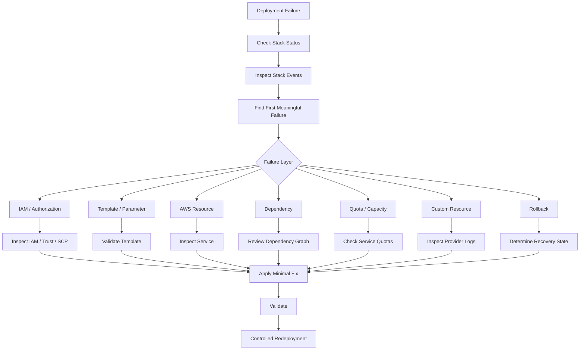

# 06- Troubleshooting Scenario Questions

## Overview

CloudFormation troubleshooting requires identifying which layer failed rather than treating every deployment failure as a template problem.

A production investigation should distinguish between:

- Template validation failures
- Parameter and dependency issues
- IAM authorization failures
- Resource provisioning failures
- Networking failures
- Service quota and capacity issues
- Update and replacement failures
- Rollback failures
- Drift
- Custom resource failures
- CI/CD authentication failures
- Cross-account or cross-region failures

A useful troubleshooting model is:

```text
Deployment Failure
       |
       v
CloudFormation Stack Events
       |
       +--> Template / Parameter Problem
       |
       +--> IAM / Authorization
       |
       +--> Resource Configuration
       |
       +--> Dependency / Ordering
       |
       +--> AWS Service Failure
       |
       +--> Quota / Capacity
       |
       +--> Custom Resource
       |
       +--> Rollback / Recovery
```

The first objective is to determine **what CloudFormation was trying to do, which resource failed, why it failed, and what state the stack is currently in**.

## Troubleshooting Methodology

### Question

A production CloudFormation deployment fails. What do you check first?

### Strong Answer

I would avoid immediately modifying the template.

First, I would inspect:

1. Stack status.
2. Stack events.
3. The first meaningful resource failure.
4. The exact AWS service error.
5. IAM authorization failures.
6. Dependencies of the failed resource.
7. Recent template or parameter changes.
8. Whether the stack entered a rollback state.
9. Whether the underlying resource changed outside CloudFormation.

The stack event timeline is usually the fastest way to identify the failing resource.

```bash
aws cloudformation describe-stack-events \
  --stack-name production-api \
  --max-items 50
```

For a production incident, I would also correlate CloudFormation events with:

- CloudTrail
- AWS service-specific events
- CI/CD logs
- Application logs
- VPC/network diagnostics
- CloudWatch metrics

## Scenario: Stack Creation Fails

### Question

A new stack fails during creation. How would you troubleshoot it?

### Strong Answer

I would identify the first resource that entered a failure state.

```bash
aws cloudformation describe-stack-events \
  --stack-name production-api
```

Typical sequence:

```text
CREATE_IN_PROGRESS
        |
        v
VPC
CREATE_COMPLETE
        |
        v
SecurityGroup
CREATE_COMPLETE
        |
        v
RDS
CREATE_FAILED
        |
        v
ROLLBACK_IN_PROGRESS
```

The important error is usually associated with the resource that first failed, not the later rollback events.

I would inspect:

- `ResourceStatus`
- `ResourceStatusReason`
- Logical resource ID
- Physical resource ID
- Resource type
- Recent dependencies

Then I would reproduce the issue outside CloudFormation when possible.

## Scenario: How Do You Find the Real Error During Rollback?

### Question

The stack shows `ROLLBACK_COMPLETE`, but the deployment failed. How do you determine the original failure?

### Strong Answer

I would inspect the stack events and locate the earliest `CREATE_FAILED` or `UPDATE_FAILED` event.

Rollback events are often secondary effects.

For example:

```text
RDS CREATE_FAILED
        |
        v
Application CREATE_FAILED
        |
        v
ROLLBACK_IN_PROGRESS
        |
        v
DELETE_COMPLETE
```

The root cause is the RDS failure, not the rollback.

A common troubleshooting mistake is to focus on the final stack status instead of the original resource failure.

## Scenario: Stack Is in `ROLLBACK_COMPLETE`

### Question

What does `ROLLBACK_COMPLETE` mean, and what would you do next?

### Strong Answer

It means the stack creation operation failed and CloudFormation successfully rolled back the resources it could roll back.

A stack in `ROLLBACK_COMPLETE` generally cannot simply be updated as though creation had succeeded.

If the failed stack is no longer required, deleting it and recreating it may be appropriate.

```bash
aws cloudformation delete-stack \
  --stack-name production-api
```

However, I would first determine whether any resources were intentionally retained or whether deletion could affect production data.

For stateful infrastructure, blindly deleting and recreating a stack can be dangerous.

## Scenario: Stack Is Stuck in `UPDATE_ROLLBACK_FAILED`

### Question

What does `UPDATE_ROLLBACK_FAILED` mean?

### Strong Answer

It means CloudFormation attempted to roll back an update but could not successfully restore one or more resources.

This is more serious than an ordinary failed update because the stack may require explicit recovery before further operations can continue.

I would inspect stack events first:

```bash
aws cloudformation describe-stack-events \
  --stack-name production-api
```

Then identify the resources preventing rollback.

Depending on the situation, CloudFormation provides recovery mechanisms such as continuing the rollback while skipping selected resources.

For example:

```bash
aws cloudformation continue-update-rollback \
  --stack-name production-api \
  --resources-to-skip LogicalResourceId
```

Skipping a resource should be treated as an exceptional recovery operation. The resulting physical resource state may no longer match the template, so drift or subsequent reconciliation must be considered.

## Scenario: When Would You Use `continue-update-rollback`?

### Question

When would you use `continue-update-rollback`?

### Strong Answer

I would use it when an update rollback is itself blocked and the stack is in `UPDATE_ROLLBACK_FAILED`.

Before using it, I would:

- Identify the failed resources.
- Understand why rollback failed.
- Determine whether the affected resource contains state.
- Verify whether skipping the resource is safe.
- Document the recovery action.
- Plan reconciliation afterward.

The goal is not simply to force CloudFormation into a usable state. The goal is to restore a consistent and understood infrastructure state.

## Scenario: Update Fails Because a Resource Cannot Be Deleted

### Question

A stack update fails because CloudFormation cannot delete an old resource. How would you investigate?

### Strong Answer

First I would determine whether the update requires resource replacement.

Some property changes cause CloudFormation to:

```text
Old Resource
     |
     v
Replacement Resource
     |
     v
Delete Old Resource
```

The replacement may succeed while deletion of the old resource fails.

Possible causes include:

- Resource dependencies
- Deletion protection
- IAM permissions
- Resource policies
- External references
- Service-specific restrictions

I would inspect the resource's CloudFormation event and then check the underlying AWS service directly.

## Scenario: Resource Replacement Causes an Outage

### Question

A CloudFormation update unexpectedly replaces a production resource. How would you troubleshoot and prevent this?

### Strong Answer

I would determine the property's update behavior and inspect the change set before future deployments.

For high-risk resources:

- Review change sets.
- Understand replacement behavior.
- Protect stateful resources.
- Use appropriate update policies where supported.
- Test changes in a lower environment.
- Separate stateful resources from frequently changing application infrastructure where appropriate.

The key distinction is:

```text
Modify in place
     vs
Replace resource
```

A replacement can have significantly different availability and data-loss implications.

## Scenario: Change Set Shows `Replace`

### Question

A change set indicates that a resource will be replaced. What do you do?

### Strong Answer

I would not automatically execute it.

I would determine:

- Why replacement is required.
- Whether the resource is stateful.
- Whether downtime is expected.
- Whether the replacement preserves data.
- Whether dependencies also change.
- Whether the replacement changes networking or security.
- Whether the resulting resource has a different physical identity.

For a production database, a replacement should receive explicit review.

## Scenario: IAM `AccessDenied` During Deployment

### Question

CloudFormation fails with an `AccessDenied` error. How do you troubleshoot it?

### Strong Answer

I would identify:

1. Which principal initiated the operation.
2. Whether CloudFormation is using a service role.
3. Which AWS API action was denied.
4. Which resource was being accessed.
5. Whether an identity policy allows the action.
6. Whether a resource policy denies it.
7. Whether an SCP or permission boundary applies.
8. Whether an explicit deny exists.

The relevant authorization chain may look like:

```text
CI/CD
  |
  v
STS AssumeRole
  |
  v
CloudFormation
  |
  v
Service Role
  |
  v
AWS Service API
```

The role that can start CloudFormation is not necessarily the role that needs permission to create every underlying resource.

## Scenario: `iam:PassRole` Failure

### Question

CloudFormation fails with an `iam:PassRole` error. What does that indicate?

### Strong Answer

It usually indicates that the deployment principal lacks permission to pass an IAM role to an AWS service.

For example:

```text
Deployment Principal
        |
        | iam:PassRole
        v
Lambda Execution Role
        |
        v
Lambda
```

I would verify:

- The deployment role's `iam:PassRole` permission.
- The exact role ARN.
- The service using the role.
- Trust policy of the target role.
- Any permission boundary or SCP.

I would avoid solving the issue with:

```json
{
  "Action": "iam:PassRole",
  "Resource": "*"
}
```

unless there is a specific, reviewed reason.

## Scenario: Stack Creation Works for an Admin but Fails in CI/CD

### Question

A template works when deployed manually by an administrator but fails in CI/CD. What does that tell you?

### Strong Answer

The template may be valid while the CI/CD identity lacks required permissions.

I would compare:

```text
Administrator
    |
    +--> Full permissions
    |
    v
CloudFormation
```

with:

```text
CI/CD Role
    |
    +--> Limited permissions
    |
    v
CloudFormation
```

I would identify the exact denied API operation rather than granting administrator access to CI/CD.

This is an important distinction between **template correctness** and **deployment authorization**.

## Scenario: Parameter Validation Failure

### Question

CloudFormation rejects a parameter value. How would you troubleshoot it?

### Strong Answer

I would inspect the parameter definition and compare it with the supplied value.

For example:

```yaml
Parameters:
  Environment:
    Type: String
    AllowedValues:
      - dev
      - staging
      - production
```

Passing:

```text
prod
```

would fail because it does not match the allowed values.

I would also inspect:

- Parameter types
- Allowed values
- Allowed patterns
- Defaults
- Environment-specific parameter files
- CI/CD variable substitution

Parameter validation errors should normally be fixed before the deployment reaches resource provisioning.

## Scenario: Dependency Ordering Problem

### Question

A resource is created before another resource it depends on. How would you troubleshoot this?

### Strong Answer

CloudFormation generally infers dependencies from references.

For example:

```yaml
ApplicationSecurityGroup:
  Type: AWS::EC2::SecurityGroup
  Properties:
    VpcId: !Ref ApplicationVpc
```

The reference creates an implicit dependency.

If CloudFormation cannot infer the dependency, `DependsOn` can be used explicitly.

```yaml
Application:
  Type: AWS::SomeResource
  DependsOn:
    - NetworkResource
```

I would use `DependsOn` only when the dependency is real but cannot be inferred.

Overusing explicit dependencies can unnecessarily serialize deployment operations.

## Scenario: Circular Dependency

### Question

CloudFormation reports a circular dependency. What does that mean?

### Strong Answer

It means resources depend on each other in a cycle that CloudFormation cannot resolve.

For example:

```text
Resource A
   |
   v
Resource B
   |
   v
Resource C
   |
   +------> Resource A
```

I would identify the dependency chain and remove unnecessary coupling.

Common causes include:

- Security groups referencing resources that also reference the security group
- Outputs/imports creating cycles
- Explicit `DependsOn`
- Resource policies
- Generated references

The solution is usually architectural rather than simply changing deployment order.

## Scenario: Security Group Causes a Circular Dependency

### Question

How can security-group configuration create CloudFormation dependency problems?

### Strong Answer

A common pattern is defining inline security-group rules inside resources that themselves reference the resources protected by those rules.

A cleaner approach can be to separate:

- Security group
- Security-group ingress rules
- Application resource

This allows the dependency graph to be more explicit and easier to reason about.

The goal is to keep the infrastructure dependency graph acyclic.

## Scenario: Stack Fails Because a Resource Already Exists

### Question

CloudFormation says a resource already exists. What would you check?

### Strong Answer

I would determine whether the template is attempting to create a resource with a globally or account-wide unique name.

Examples include:

- S3 buckets
- IAM roles with explicit names
- Some networking resources
- Named database resources

Possible causes:

- Previous stack was partially deleted.
- Resource was manually created.
- Another stack owns the resource.
- Resource name is hardcoded.
- Resource was retained using a deletion policy.

I would identify ownership before deleting anything.

## Scenario: CloudFormation Says a Resource Already Exists but It Is Not in the Stack

### Question

What would you do if an S3 bucket already exists but CloudFormation tries to create it?

### Strong Answer

I would not delete the bucket immediately.

First determine:

```text
Who owns the bucket?
      |
      +--> Existing CloudFormation stack?
      |
      +--> Another team?
      |
      +--> Legacy infrastructure?
      |
      +--> Manually created?
```

If the resource should be managed by the new stack, I would evaluate resource import or another controlled migration strategy.

The key production principle is:

> Never destroy an existing resource simply to make a CloudFormation deployment succeed without establishing ownership and data impact first.

## Scenario: Drift Detection Finds Differences

### Question

CloudFormation reports drift. What does that mean?

### Strong Answer

Drift means the actual resource configuration differs from the configuration CloudFormation expects based on the stack's template and parameters.

For example:

```text
Template
   |
   v
Security Group: Port 443 only
   |
   X
Manual change
   |
   v
Actual Resource: Ports 443 + 8080
```

I would determine:

- What changed.
- Who changed it.
- Whether the change was intentional.
- Whether it creates a security or availability risk.
- Whether the template should be updated.
- Whether the actual resource should be reconciled.

Drift is a configuration-management issue and potentially a security issue.

## Scenario: Drift Exists but Stack Update Succeeds

### Question

Why can a stack have drift even though CloudFormation can update it successfully?

### Strong Answer

CloudFormation does not continuously enforce the template against the live environment.

A manual resource change can create drift without immediately causing a stack operation to fail.

A later update may:

- Preserve the drifted property.
- Overwrite it.
- Replace the resource.
- Fail due to the current resource state.

The exact result depends on the resource and property involved.

Therefore, drift should be detected and reviewed rather than ignored.

## Scenario: Custom Resource Fails

### Question

A custom CloudFormation resource fails. How would you troubleshoot it?

### Strong Answer

I would inspect:

- CloudFormation stack events
- Custom resource response status
- Lambda logs if Lambda-backed
- IAM permissions
- Timeout configuration
- Network connectivity
- External API failures
- Request payload
- Physical resource ID
- Delete/update behavior

A custom resource has a lifecycle similar to:

```text
CloudFormation
      |
      v
Custom Resource
      |
      v
Lambda / Provider
      |
      v
External System
      |
      v
Success / Failure Response
```

The provider must correctly report the operation result to CloudFormation.

Failures can occur even when the Lambda itself appears healthy if the expected CloudFormation response is not handled correctly.

## Scenario: Custom Resource Times Out

### Question

A custom resource remains in progress and eventually times out. What would you inspect?

### Strong Answer

I would check:

- Lambda execution duration
- Provider response handling
- Network connectivity
- External API latency
- IAM permissions
- Lambda timeout
- CloudFormation operation timeout behavior
- Whether the provider returned the expected response

I would also verify idempotency.

A retry of a custom resource should not create duplicate external resources.

## Scenario: Lambda Custom Resource Cannot Reach an API

### Question

A custom resource Lambda works locally but cannot reach an external API from AWS. What might be wrong?

### Strong Answer

If the Lambda is attached to a VPC, I would inspect its outbound networking path.

For example:

```text
Lambda
  |
  v
Private Subnet
  |
  v
NAT Gateway
  |
  v
Internet
  |
  v
External API
```

Possible issues include:

- Missing NAT Gateway
- Missing route
- Incorrect route table
- Security group restrictions
- Network ACL restrictions
- DNS resolution problems
- External API restrictions

A Lambda does not automatically gain internet access simply because it is running in AWS.

## Scenario: Stack Hangs During Resource Creation

### Question

A stack remains in `CREATE_IN_PROGRESS` for a long time. How would you investigate?

### Strong Answer

I would identify which resource is still in progress.

```bash
aws cloudformation describe-stack-events \
  --stack-name production-api
```

Then investigate the underlying AWS service.

Typical causes include:

- Resource provisioning latency
- Service dependency
- Custom resource timeout
- Networking issue
- Service quota
- Waiting for stabilization
- External API dependency

I would avoid repeatedly cancelling the stack without understanding the resource state.

## Scenario: Stack Update Is Stuck

### Question

A production stack update appears stuck. What do you check?

### Strong Answer

I would check:

```text
Stack Status
    |
    v
Stack Events
    |
    v
Resource Status
    |
    v
Underlying AWS Service
```

Then determine whether the resource is:

- Provisioning
- Waiting for stabilization
- Waiting for a custom resource
- Blocked by another dependency
- Failing silently at the application/service level

I would also check CloudFormation operation events and relevant service-specific logs.

## Scenario: Stack Update Fails Due to Resource Limit

### Question

CloudFormation fails because an AWS service quota is exceeded. How do you respond?

### Strong Answer

I would verify the exact service quota and current usage.

For example:

```text
CloudFormation
      |
      v
AWS Service API
      |
      v
QuotaExceeded
```

I would determine whether to:

- Reduce resource count.
- Remove obsolete resources.
- Reuse existing infrastructure.
- Request a quota increase.
- Split workloads appropriately.

Increasing quotas should not automatically be the first response. It may indicate an architectural scaling issue.

## Scenario: Resource Creation Fails Due to Name Collision

### Question

A production deployment fails because a named resource already exists. How would you fix it safely?

### Strong Answer

I would first establish resource ownership.

Then choose between:

- Referencing the existing resource.
- Importing it into CloudFormation.
- Renaming the new resource.
- Migrating ownership.
- Removing the obsolete resource after validation.

The wrong response is:

```text
Deployment failed
      |
      v
Delete existing resource
```

This can cause data loss or service disruption.

## Scenario: Stack Deletion Fails

### Question

CloudFormation cannot delete a stack. What would you check?

### Strong Answer

I would inspect stack events to determine which resource failed deletion.

Common causes include:

- Resource deletion protection
- Dependency relationships
- IAM permissions
- Resource policies
- Non-empty storage resources
- External references
- Service-specific deletion restrictions

For stateful resources, I would verify the configured deletion behavior before retrying.

## Scenario: S3 Bucket Prevents Stack Deletion

### Question

Why might an S3 bucket prevent stack deletion?

### Strong Answer

An S3 bucket generally must be empty before CloudFormation can delete it.

If the bucket contains objects, deletion can fail.

For production buckets, I would not automatically empty the bucket just to make stack deletion succeed.

I would determine:

- Whether the data is required.
- Whether the bucket is production-owned.
- Whether the deletion policy should retain it.
- Whether data has been backed up.
- Whether the stack should actually own the bucket.

## Scenario: RDS Deletion Protection Blocks an Update

### Question

CloudFormation cannot delete or replace an RDS resource because deletion protection is enabled. What would you do?

### Strong Answer

I would treat this as an intentional safety control rather than immediately disabling it.

First determine why the update requires replacement.

```text
Template Change
      |
      v
Replacement Required
      |
      v
RDS Deletion Protection
      |
      v
Operation Blocked
```

I would evaluate:

- Whether the property change can be redesigned.
- Whether a replacement is genuinely required.
- Backup availability.
- Snapshot requirements.
- Downtime.
- Application dependencies.

Disabling deletion protection in production should be a deliberate, reviewed operation.

## Scenario: `UPDATE_COMPLETE_CLEANUP_IN_PROGRESS`

### Question

What does `UPDATE_COMPLETE_CLEANUP_IN_PROGRESS` indicate?

### Strong Answer

It indicates that the main update has completed but CloudFormation is still cleaning up resources associated with the previous configuration.

I would inspect stack events to identify which resources are being cleaned up and whether deletion is blocked.

This can happen when an update replaces resources.

The key troubleshooting question is:

> Which old resource is CloudFormation attempting to remove, and why can it not be removed?

## Scenario: CloudFormation Update Creates an Unexpected Replacement

### Question

A resource you expected to update in place is replaced. What would you investigate?

### Strong Answer

I would review the resource property's update behavior and the change set.

For example:

```text
Property Change
      |
      v
CloudFormation Update Behavior
      |
      +---- No interruption
      |
      +---- Some interruption
      |
      +---- Replacement
```

I would also verify whether:

- The resource type changed.
- An immutable property changed.
- A physical name was specified.
- A dependent resource changed.
- A nested stack or module changed.

Production deployments should explicitly identify replacement changes before execution.

## Scenario: Nested Stack Fails

### Question

A parent stack fails because a nested stack failed. How would you troubleshoot it?

### Strong Answer

I would inspect the parent stack first and then trace the nested stack failure.

```text
Parent Stack
     |
     v
Nested Stack
     |
     v
Failed Resource
```

The parent failure is often only a symptom.

I would identify:

- Nested stack logical ID
- Nested stack ARN
- Nested stack status
- Nested stack events
- First failed child resource

The same principle applies to nested stacks as ordinary stacks:

> Find the first meaningful resource failure rather than stopping at the parent-level error.

## Scenario: Cross-Region Deployment Fails

### Question

A CloudFormation deployment works in one AWS region but fails in another. What would you check?

### Strong Answer

I would compare:

- Service availability
- Resource type support
- Availability zones
- AMI IDs
- Region-specific ARNs
- Parameter values
- Quotas
- KMS keys
- VPC configuration
- IAM policies
- Region-specific naming constraints

A common mistake is hardcoding a resource identifier from one region.

For example:

```text
us-east-1 AMI
       |
       X
       |
eu-west-1
```

AMI IDs and many other resource identifiers are region-specific.

## Scenario: Cross-Account Deployment Fails

### Question

A StackSet or CI/CD deployment works in one account but fails in another. How would you troubleshoot it?

### Strong Answer

I would inspect the cross-account trust chain.

```text
Deployment System
       |
       v
AssumeRole
       |
       v
Target Account
       |
       v
CloudFormation
       |
       v
Execution Role
       |
       v
AWS Resource
```

I would verify:

- Trust policy
- Role ARN
- Account ID
- External ID where applicable
- IAM permissions
- SCPs
- Permission boundaries
- Region configuration
- Target account resource limits

The first question should be:

> At which authorization boundary did the request fail?

## Scenario: CloudFormation Deployment Works Locally but Fails in CI/CD

### Question

A developer can deploy locally but the pipeline fails. What would you check?

### Strong Answer

I would compare the environments.

| Area | Local | CI/CD |
|---|---|---|
| AWS identity | Developer role | Deployment role |
| Region | Local configuration | Pipeline configuration |
| Parameters | Local values | Pipeline variables |
| Credentials | Local/SSO | OIDC or assumed role |
| Permissions | Potentially broader | Usually restricted |
| Environment variables | Local | Pipeline secrets/config |
| Template version | Working copy | Repository revision |

I would verify the exact commit being deployed and inspect the CI/CD authentication logs.

## Scenario: Deployment Fails Only in Production

### Question

The same CloudFormation template works in staging but fails in production. What would you investigate?

### Strong Answer

I would compare infrastructure and account-level differences rather than assuming the template is wrong.

Important differences include:

- IAM permissions
- SCPs
- Existing resources
- Resource quotas
- Parameter values
- KMS policies
- VPC topology
- Security groups
- Availability zones
- Service limits
- Resource names
- Organizational controls

A production account may intentionally have stricter policies than staging.

## Scenario: CloudFormation Reports `InsufficientCapabilities`

### Question

What does `InsufficientCapabilities` mean?

### Strong Answer

It usually means the deployment request did not acknowledge capabilities required by the template, commonly when IAM resources are present.

I would inspect the template for IAM resources and ensure the deployment command specifies the appropriate capability.

For example:

```bash
aws cloudformation deploy \
  --template-file template.yaml \
  --stack-name production-api \
  --capabilities CAPABILITY_IAM
```

The capability acknowledgment is separate from IAM authorization.

## Scenario: Template Validation Fails

### Question

How would you validate a CloudFormation template before deployment?

### Strong Answer

Use CloudFormation validation before attempting a production deployment.

```bash
aws cloudformation validate-template \
  --template-body file://template.yaml
```

For production pipelines, validation should be combined with:

- Linting
- Security scanning
- Policy analysis
- Unit-style template tests where appropriate
- Change-set generation

Validation confirms that the template is structurally valid; it does not guarantee that the deployment will succeed.

## Scenario: Template Is Valid but Deployment Fails

### Question

Why can a template pass validation and still fail during deployment?

### Strong Answer

Validation checks the template structure and syntax, but resource provisioning depends on runtime conditions.

For example:

```text
Template Validation
       |
       v
Valid
       |
       v
Deployment
       |
       +--> IAM failure
       +--> Quota failure
       +--> Network failure
       +--> Resource conflict
       +--> Service failure
       +--> Invalid runtime configuration
```

A valid template can therefore still fail because the target environment does not satisfy its assumptions.

## Scenario: Change Set Cannot Be Created

### Question

A change set fails to create. What would you investigate?

### Strong Answer

I would determine whether the failure is caused by:

- Template validation
- Parameter validation
- IAM permissions
- Missing capabilities
- Invalid resource configuration
- Missing referenced resources
- Stack state
- Unsupported operations

I would inspect the stack events and the change-set status/reason.

A change set is a planning mechanism, not a guarantee that the subsequent execution will succeed.

## Scenario: Change Set Shows No Changes

### Question

Why might CloudFormation report no changes when you expected an update?

### Strong Answer

Possible causes include:

- The deployed template is already equivalent.
- The parameter values did not change.
- The changed content does not affect deployed resources.
- The wrong template or branch was deployed.
- A macro or transform produced an equivalent result.
- The intended change was not actually included in the deployment artifact.

I would verify:

```text
Git commit
   |
   v
Generated template
   |
   v
Parameters
   |
   v
CloudFormation stack
```

CI/CD pipelines should make the exact artifact and commit being deployed observable.

## Scenario: Drift Detection Does Not Report a Difference

### Question

A resource was manually changed, but drift detection reports no drift. What might explain this?

### Strong Answer

Drift detection does not mean every possible property or resource behavior is continuously observed.

I would verify:

- Whether the resource type supports drift detection.
- Whether the changed property is supported for drift detection.
- Whether the drift detection operation completed.
- Whether the actual change is represented in CloudFormation's model.
- Whether the wrong stack or resource was checked.

I would also inspect the underlying AWS resource directly.

## Scenario: Resource Is in `UPDATE_FAILED`

### Question

What is the difference between a resource failure and a stack failure?

### Strong Answer

A resource can fail while CloudFormation continues processing other resources or transitions the overall stack into a failure/rollback state.

The resource event provides the most specific failure context.

For example:

```text
Stack
 |
 +--> VPC        UPDATE_COMPLETE
 |
 +--> Lambda     UPDATE_FAILED
 |
 +--> IAM Role   UPDATE_COMPLETE
 |
 v
Stack rollback
```

I would troubleshoot the individual resource first, then determine the stack-level recovery path.

## Scenario: Stack Is in `UPDATE_ROLLBACK_COMPLETE`

### Question

What does `UPDATE_ROLLBACK_COMPLETE` mean?

### Strong Answer

It means the attempted update failed and CloudFormation successfully rolled the stack back to the previous state.

The stack is generally available for another update.

However, I would not immediately retry the same deployment.

First determine:

- Why the update failed.
- Whether rollback restored the expected state.
- Whether any resources drifted.
- Whether the template needs correction.
- Whether the next update would repeat the same failure.

## Scenario: Rollback Changes the Application Unexpectedly

### Question

Can a CloudFormation rollback cause application behavior to change?

### Strong Answer

Yes.

Infrastructure changes can affect:

- Security groups
- Load balancers
- IAM roles
- Environment variables
- Network routes
- Database configuration
- ECS/EKS resources
- Lambda versions
- DNS

A rollback restores CloudFormation-managed resource state according to its update semantics; it is not necessarily equivalent to restoring an entire application's previous runtime state.

This is why application and infrastructure rollback strategies should be designed together.

## Scenario: Stack Is in `UPDATE_COMPLETE` but Application Is Broken

### Question

CloudFormation reports success, but the backend application is unhealthy. What does that tell you?

### Strong Answer

CloudFormation success means the infrastructure operations completed according to CloudFormation's resource-level expectations.

It does not mean:

- The API returns 200.
- Database queries work.
- Redis is reachable.
- Kafka consumers are healthy.
- Business logic works.
- Background jobs succeed.

For a Django or FastAPI deployment, I would separately validate:

```text
CloudFormation
      |
      v
Infrastructure Healthy
      |
      v
Application Health
      |
      v
Dependency Health
      |
      v
Business Functionality
```

Infrastructure deployment success and application health are separate validation layers.

## Scenario: CloudFormation Update Breaks Database Connectivity

### Question

The stack update succeeds, but the application can no longer connect to PostgreSQL. How would you troubleshoot it?

### Strong Answer

I would inspect the network path:

```text
Application
   |
   v
Application Security Group
   |
   v
Database Security Group
   |
   v
PostgreSQL
```

Then verify:

- Database endpoint
- Port
- Security-group rules
- Subnet placement
- Route tables
- Network ACLs
- DNS resolution
- Application credentials
- Secrets Manager configuration
- Database availability

I would compare the pre-deployment and post-deployment infrastructure configuration.

## Scenario: CloudFormation Update Breaks Redis Connectivity

### Question

A FastAPI service can no longer connect to Redis after a stack update. What would you check?

### Strong Answer

I would verify:

- Redis endpoint
- Port
- Security groups
- Subnet routing
- DNS
- Authentication configuration
- TLS configuration
- Environment variables
- Secrets
- Network ACLs

For a private Redis deployment:

```text
FastAPI
  |
  v
Application Subnet
  |
  v
Redis Security Group
  |
  v
Redis
```

I would avoid opening Redis to the internet as a troubleshooting shortcut.

## Scenario: CloudFormation Deployment Causes a Security Regression

### Question

A deployment accidentally opens PostgreSQL to the internet. What would you do?

### Strong Answer

I would prioritize containment.

1. Restrict the security-group rule.
2. Determine whether unauthorized access occurred.
3. Review CloudTrail and relevant database logs.
4. Rotate credentials if compromise is possible.
5. Identify the template or pipeline change.
6. Correct the infrastructure definition.
7. Add preventive validation.

The incident should result in both remediation and a control that prevents recurrence.

## Scenario: CloudFormation Cannot Assume a Role

### Question

What would you check when CloudFormation cannot assume its service role?

### Strong Answer

I would inspect the role trust policy.

The trust relationship must allow the appropriate service principal to assume the role.

I would also verify:

- Correct role ARN
- Role exists
- Trust policy
- Account boundaries
- Service role configuration
- SCPs
- Permission boundaries
- Any explicit denies

A role can have a correct permissions policy but still be unusable if its trust policy is incorrect.

## Scenario: Resource Provider Reports an Unknown Failure

### Question

An AWS resource returns a generic failure message. How would you proceed?

### Strong Answer

I would correlate multiple sources rather than relying only on the CloudFormation error.

```text
CloudFormation Events
        +
CloudTrail
        +
Service-Specific Logs
        +
CloudWatch Metrics
        +
Resource Configuration
```

Then I would:

- Identify the exact API operation.
- Check the underlying resource.
- Review recent changes.
- Check quotas.
- Check regional service availability.
- Reproduce the operation using AWS CLI where safe.

The objective is to turn a generic CloudFormation error into a service-specific diagnosis.

## Scenario: How Would You Troubleshoot With the AWS CLI?

### Question

Which CLI commands are useful during CloudFormation troubleshooting?

### Strong Answer

A practical command set is:

| Purpose | Command |
|---|---|
| Validate template | `aws cloudformation validate-template` |
| Inspect stack | `aws cloudformation describe-stacks` |
| Inspect events | `aws cloudformation describe-stack-events` |
| List resources | `aws cloudformation list-stack-resources` |
| Describe resource | `aws cloudformation describe-stack-resource` |
| List change sets | `aws cloudformation list-change-sets` |
| Describe change set | `aws cloudformation describe-change-set` |
| Detect drift | `aws cloudformation detect-stack-drift` |
| Check drift status | `aws cloudformation describe-stack-drift-detection-status` |
| Continue rollback | `aws cloudformation continue-update-rollback` |
| Delete stack | `aws cloudformation delete-stack` |

For example:

```bash
aws cloudformation describe-stacks \
  --stack-name production-api
```

Then inspect events:

```bash
aws cloudformation describe-stack-events \
  --stack-name production-api \
  --max-items 100
```

## Scenario: How Would You Investigate a Failed Resource Directly?

### Question

Why should you inspect the underlying AWS service instead of only CloudFormation?

### Strong Answer

CloudFormation is an orchestration layer.

For example:

```text
CloudFormation
      |
      v
AWS::RDS::DBInstance
      |
      v
Amazon RDS
```

If RDS fails, CloudFormation may only report the service's returned failure reason.

The deeper diagnosis may require checking:

- RDS events
- CloudWatch metrics
- Parameter groups
- Network configuration
- Security groups
- Subnet groups
- IAM
- Service quotas

The same principle applies to S3, Lambda, ECS, EC2, ELB, IAM, and other services.

## Production Troubleshooting Workflow

A disciplined production workflow should look like:



The important production principle is **minimal, evidence-based remediation**.

Do not make multiple unrelated changes during an incident because that makes the root cause harder to identify and increases the blast radius.

## Troubleshooting Checklist

### Stack State

- [ ] Stack name and region are correct.
- [ ] Current stack status is known.
- [ ] First meaningful failure event is identified.
- [ ] Rollback state is understood.
- [ ] Resource logical ID is identified.

### IAM

- [ ] Deployment principal is identified.
- [ ] CloudFormation service role is identified if applicable.
- [ ] Required API permission exists.
- [ ] `iam:PassRole` is correctly scoped.
- [ ] Trust policies are valid.
- [ ] SCPs are not blocking the operation.
- [ ] Permission boundaries are not blocking the operation.
- [ ] Explicit denies have been considered.

### Template

- [ ] Correct template version is being deployed.
- [ ] Template validation succeeds.
- [ ] Parameters are correct.
- [ ] Capabilities are specified when required.
- [ ] Resource dependencies are understood.
- [ ] Replacement behavior has been reviewed.
- [ ] Change set has been inspected for high-risk updates.

### AWS Resources

- [ ] Underlying resource status is healthy.
- [ ] Resource quotas have been checked.
- [ ] Resource naming conflicts have been investigated.
- [ ] Service-specific events have been reviewed.
- [ ] Regional resource constraints have been checked.

### Networking

- [ ] VPC and subnet configuration is correct.
- [ ] Route tables are correct.
- [ ] Security groups are correct.
- [ ] Network ACLs are correct.
- [ ] DNS resolution works.
- [ ] NAT or internet connectivity exists where required.
- [ ] Private resources remain private.

### Stateful Resources

- [ ] Database deletion protection is understood.
- [ ] Backup/snapshot requirements are verified.
- [ ] `DeletionPolicy` is understood.
- [ ] `UpdateReplacePolicy` is understood.
- [ ] Resource ownership is confirmed.
- [ ] No production data will be destroyed by remediation.

### Rollback and Recovery

- [ ] Current rollback state is known.
- [ ] Failed resources are identified.
- [ ] `continue-update-rollback` is considered only when appropriate.
- [ ] Resources skipped during rollback are documented.
- [ ] Post-recovery drift is checked.
- [ ] The next deployment will not repeat the same failure.

### Security

- [ ] No emergency fix introduces public access.
- [ ] No broad IAM permissions are added unnecessarily.
- [ ] Secrets are not exposed in logs or templates.
- [ ] Security-sensitive changes are audited.
- [ ] Temporary permissions are removed after recovery.

## Common Troubleshooting Mistakes

### Looking only at the final stack status

**Problem:** `UPDATE_ROLLBACK_FAILED` tells you the stack is unhealthy, but not necessarily the original cause.

**Better approach:** Trace the event history to the first meaningful failure.

### Immediately granting AdministratorAccess

**Problem:** This hides the actual authorization problem and creates unnecessary privilege.

**Better approach:** Identify the exact denied action and resource.

### Deleting an existing resource to fix a name collision

**Problem:** The resource may contain production data or belong to another system.

**Better approach:** Establish ownership before changing or deleting it.

### Re-running the same failed template repeatedly

**Problem:** The underlying condition has not changed.

**Better approach:** Identify and correct the root cause first.

### Skipping rollback resources without understanding the consequence

**Problem:** The stack can become operational while its declared and actual resource states differ.

**Better approach:** Use rollback skipping only as a controlled recovery mechanism and reconcile afterward.

### Opening security groups during troubleshooting

**Problem:** A temporary `0.0.0.0/0` rule can become a permanent security vulnerability.

**Better approach:** Diagnose routing, DNS, security groups, and IAM systematically.

### Assuming CloudFormation success means application success

**Problem:** CloudFormation validates infrastructure operations, not complete application behavior.

**Better approach:** Run application-level health checks after infrastructure deployment.

### Ignoring region and account context

**Problem:** Engineers often troubleshoot the correct stack in the wrong account or region.

**Better approach:** Explicitly verify:

```bash
aws sts get-caller-identity

aws configure get region
```

## Interview Traps

### "If a stack is `ROLLBACK_COMPLETE`, CloudFormation is broken."

No.

The creation operation failed and CloudFormation completed its rollback. The next action depends on the cause and whether the stack should be recreated.

### "Rollback always restores the exact previous production state."

Not necessarily.

Rollback follows CloudFormation's resource update semantics and can interact with replacements, retained resources, external changes, and stateful infrastructure.

### "CloudFormation validates whether the infrastructure will actually work."

No.

Template validation does not guarantee successful runtime provisioning or application health.

### "If the deployment role can create the stack, it has all required permissions."

Not necessarily.

The identity initiating the operation and the CloudFormation service role can have different permission boundaries.

### "A failed resource is always the root cause."

Not always.

A resource failure can be a downstream effect of an earlier dependency, IAM, network, or service problem.

### "Deleting the stack is the easiest way to recover."

It can be dangerous.

For production infrastructure, deletion may destroy state or create unnecessary downtime.

### "A successful change set guarantees a successful deployment."

No.

A change set describes proposed changes. Execution can still fail because of runtime conditions, permissions, quotas, service failures, or resource state.

### "Drift is harmless if CloudFormation can still deploy."

No.

Drift can represent an undocumented security, availability, or configuration change.

## Key Takeaways

- Start troubleshooting with the current stack status and CloudFormation stack events.
- Find the **first meaningful resource failure**, not merely the final rollback error.
- Treat CloudFormation as an orchestration layer and inspect the underlying AWS service when necessary.
- Separate template validation problems from runtime provisioning problems.
- When an operation fails with `AccessDenied`, identify the exact principal, action, resource, trust relationship, and policy boundary involved.
- `iam:PassRole` is a common and important source of deployment failures.
- A template that works for an administrator may still fail for a least-privileged CI/CD role.
- Do not solve authorization failures by granting broad administrator permissions.
- Understand implicit dependencies before adding `DependsOn`.
- Circular dependencies usually indicate an infrastructure design problem rather than a simple ordering problem.
- Never delete an existing resource simply to resolve a CloudFormation naming conflict without establishing ownership and data impact.
- Drift means the actual resource configuration differs from CloudFormation's expected configuration and should be investigated.
- `UPDATE_ROLLBACK_FAILED` requires controlled recovery; `continue-update-rollback` should be used only after understanding the failed resources.
- Skipping resources during rollback can leave CloudFormation's declared state and the actual resource state inconsistent.
- Resource replacement should be treated as a high-risk production change, particularly for databases and other stateful resources.
- Custom resources require investigation of both CloudFormation and the provider implementation.
- VPC-connected Lambda functions require an appropriate outbound networking path when they need internet access.
- Production troubleshooting should preserve security boundaries rather than weakening them for convenience.
- CloudFormation success does not prove that Django, FastAPI, PostgreSQL, Redis, Kafka, or other application dependencies are healthy.
- Always verify the AWS account and region before troubleshooting.
- A strong senior-level troubleshooting approach is evidence-driven, minimizes blast radius, makes the smallest safe change, validates the result, and reconciles infrastructure state afterward.