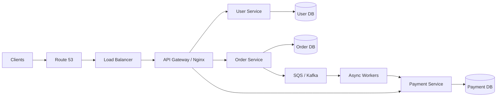
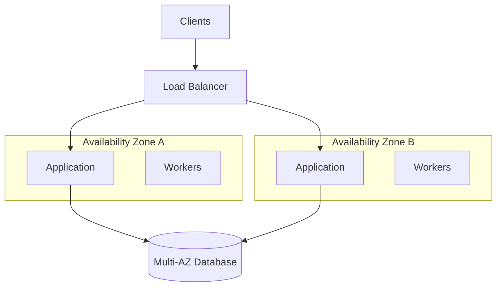
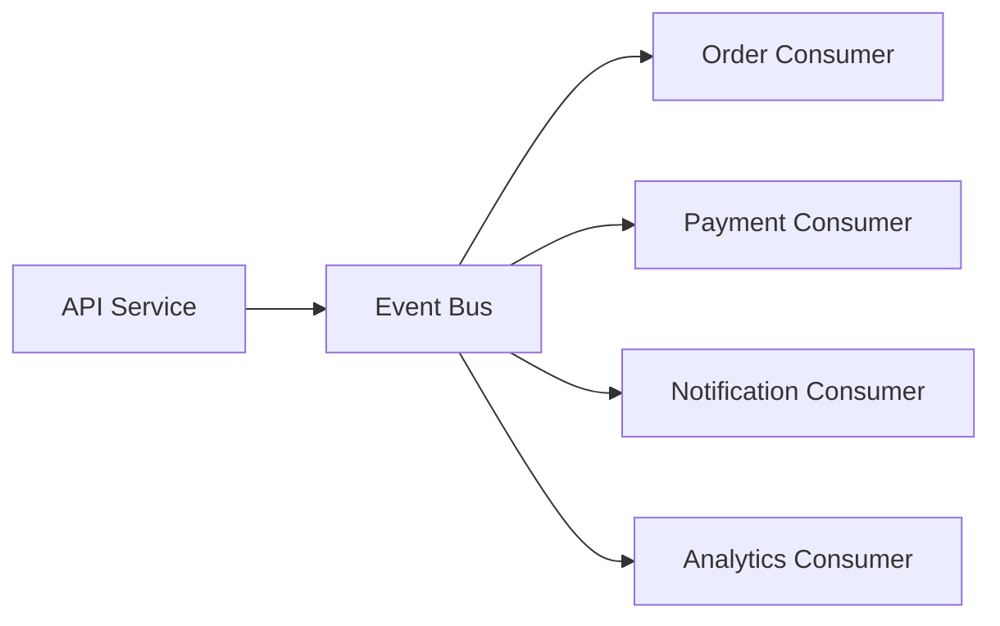

# 01- Common Architecture Interview Questions

## Overview

AWS architecture interviews evaluate whether you can reason about distributed systems, reliability, scalability, security, cost, and operational trade-offs rather than simply recall AWS service definitions.

A strong answer starts with requirements and constraints, establishes a baseline architecture, identifies bottlenecks and failure domains, and then justifies each architectural decision.

For backend engineering roles, interviewers commonly expect you to connect AWS infrastructure with application-level concerns such as Django/FastAPI services, REST or gRPC communication, PostgreSQL, Redis, Kafka, Celery, containers, Kubernetes, and CI/CD.

---

## How to Approach AWS Architecture Questions

Avoid immediately listing AWS services.

A reliable architecture interview flow is:

```text
Requirements
    ↓
Traffic and workload estimation
    ↓
API and data requirements
    ↓
High-level architecture
    ↓
Data flow
    ↓
Scalability
    ↓
Availability and resilience
    ↓
Security
    ↓
Observability
    ↓
Disaster recovery
    ↓
Cost and trade-offs
```

A useful mental model is:

> **Requirements → Constraints → Architecture → Failure modes → Trade-offs**

The interviewer is usually more interested in why you selected an architecture than in whether you can name the maximum number of AWS services.

---

## Core AWS Architecture Interview Questions

### How would you design a highly available REST API on AWS?

A typical production architecture could use:

```text
Clients
   │
   ▼
Route 53
   │
   ▼
Application Load Balancer
   │
   ├───────────────┐
   ▼               ▼
AZ-A              AZ-B
   │               │
Django/FastAPI   Django/FastAPI
   │               │
   └───────┬───────┘
           ▼
     PostgreSQL
   Multi-AZ / RDS
```

Key considerations:

- Deploy compute across multiple Availability Zones.
- Use an Application Load Balancer for HTTP/HTTPS traffic.
- Keep application instances stateless.
- Store sessions outside application instances if required.
- Use managed database high availability.
- Use health checks that verify meaningful application health.
- Scale compute horizontally.
- Monitor latency, errors, saturation, and dependency health.

The important interview point is that **multiple EC2 instances alone do not make the system highly available**. They need to be distributed across independent failure domains and connected to appropriately resilient dependencies.

---

### How would you make a Django or FastAPI application stateless?

A stateless application does not depend on local process memory or local disk to preserve user state between requests.

Instead of:

```text
Request
  ↓
Application Instance A
  ↓
Local Session / Local File
```

prefer:

```text
Request
  ↓
Load Balancer
  ↓
Any Application Instance
  ↓
Shared State
 ├── PostgreSQL
 ├── Redis
 └── Object Storage
```

Examples:

- PostgreSQL for durable business data.
- Redis for shared cache or short-lived state.
- S3 for uploaded files.
- JWT or external session storage for authentication state.

Stateless services make horizontal scaling and failover significantly easier.

---

### When would you use EC2, ECS, EKS, or Lambda?

| Service | Strong Fit | Main Trade-off |
|---|---|---|
| EC2 | Maximum infrastructure control | Higher operational responsibility |
| ECS | Managed container orchestration with lower complexity | Less Kubernetes-native flexibility |
| EKS | Kubernetes workloads and Kubernetes ecosystem | Higher operational complexity |
| Lambda | Event-driven or short-lived workloads | Runtime, execution, and architecture constraints |

A good answer should not claim that one service is universally better.

For example:

- A FastAPI microservice with Docker may fit ECS well.
- An organization standardized on Kubernetes may prefer EKS.
- A legacy workload requiring OS-level control may remain on EC2.
- An S3-triggered image processing job may fit Lambda.

The correct choice depends on workload characteristics and organizational constraints.

---

### How would you design a scalable microservices architecture?

A possible architecture is:



Important principles:

- Define service boundaries around business capabilities.
- Avoid creating services merely because a domain model has many tables.
- Prefer independent deployment where independence is actually required.
- Avoid a shared database becoming the integration mechanism for every service.
- Use synchronous communication for operations requiring immediate responses.
- Use asynchronous messaging for decoupled workflows.
- Make consumers idempotent.
- Isolate failure domains.

A common interview trap is describing microservices as simply "many APIs behind an API Gateway." The important architectural property is **independent ownership and controlled coupling**, not the number of processes.

---

## How would services communicate?

There are two broad choices.

### Synchronous Communication

Examples:

- REST
- gRPC

```text
Order Service
     │
     │ HTTP / gRPC
     ▼
Payment Service
     │
     ▼
Response
```

Advantages:

- Immediate response.
- Straightforward request/response semantics.
- Easier for operations requiring immediate confirmation.

Limitations:

- Temporal coupling.
- Latency propagation.
- Dependency failures can propagate.
- Cascading failures are possible.

### Asynchronous Communication

Examples:

- Amazon SQS
- Amazon SNS
- Kafka
- EventBridge

```text
Order Service
     │
     ▼
Queue / Event Bus
     │
     ├──► Payment Worker
     ├──► Notification Worker
     └──► Analytics Consumer
```

Advantages:

- Loose temporal coupling.
- Better workload buffering.
- Independent consumer scaling.
- Better resilience against temporary downstream outages.

Limitations:

- Eventual consistency.
- More operational complexity.
- Duplicate delivery must be handled.
- Debugging becomes more distributed.

---

## How would you handle traffic spikes?

First determine whether the workload is:

- Predictable.
- Bursty.
- Continuously increasing.
- CPU-bound.
- I/O-bound.
- Synchronous.
- Asynchronous.

For synchronous APIs:

```text
Clients
   ↓
Load Balancer
   ↓
Auto Scaling
   ↓
Application Instances
   ↓
Cache / Database
```

For asynchronous workloads:

```text
Clients
   ↓
API
   ↓
Queue
   ↓
Workers
   ↓
Database / External API
```

Queues are particularly useful when producers can temporarily generate work faster than consumers can safely process it.

Do not solve every traffic spike by blindly increasing application instances. If PostgreSQL is already saturated, adding application servers can make the outage worse by increasing database connection pressure.

---

## How would you prevent a database from becoming the bottleneck?

Consider the database as a finite-capacity resource.

Common strategies include:

- Query optimization.
- Proper indexing.
- Connection pooling.
- Read replicas where appropriate.
- Caching.
- Partitioning.
- Workload separation.
- Asynchronous processing.
- Database scaling.
- Reducing unnecessary database calls.

For a Django application:

```text
Request
  ↓
Django / FastAPI
  ↓
Redis Cache ── hit ──► Response
  │
  └── miss
       ↓
   PostgreSQL
       ↓
   Update Cache
       ↓
    Response
```

A critical interview point:

> Caching reduces database load, but it does not remove the need to understand database capacity.

Also consider cache invalidation, stale data, cache stampedes, and Redis failure behavior.

---

## How would you design caching?

A common architecture is:

```text
Client
  ↓
Application
  ↓
Redis
  │
  ├── Hit → Return
  │
  └── Miss
        ↓
    PostgreSQL
        ↓
    Redis
        ↓
     Return
```

Important considerations:

- Define TTLs.
- Establish invalidation rules.
- Avoid caching highly volatile data without a clear consistency model.
- Protect against cache stampedes.
- Bound memory usage.
- Monitor hit ratio and eviction behavior.
- Decide whether cache failure should degrade performance or cause an outage.

A cache should generally be treated as an optimization unless the architecture explicitly requires it as a durable coordination mechanism.

---

## How would you make an API resilient to downstream failures?

Use:

- Timeouts.
- Bounded retries.
- Exponential backoff.
- Jitter.
- Circuit breakers.
- Bulkheads.
- Rate limiting.
- Graceful degradation.

For example:

```text
API
 │
 ├── Timeout ──────────────► External Service
 │
 ├── Retry with Backoff
 │
 ├── Circuit Breaker
 │
 └── Fallback
```

A retry policy without a timeout is dangerous because a request can occupy resources indefinitely.

Likewise, retrying every error can create a retry storm.

Retry only failures that are plausibly transient and ensure the operation is safe to repeat.

---

## How would you design for failure of one Availability Zone?

Deploy critical compute across at least two Availability Zones.



The important question is not merely:

> "Is the application deployed in two AZs?"

Instead ask:

> "Can the remaining AZs handle the workload if one AZ disappears?"

For example, if normal traffic requires 10 instances and the architecture runs 5 in each AZ, losing one AZ leaves only 5 instances. That may be insufficient.

Production HA requires **failure-capacity planning**, not just redundancy.

---

## How would you design disaster recovery?

Start with business requirements.

Define:

- RTO.
- RPO.
- Critical workloads.
- Acceptable data loss.
- Acceptable downtime.
- Recovery dependencies.

Then choose an appropriate strategy.

| Strategy | Typical Characteristics |
|---|---|
| Backup and restore | Lowest infrastructure cost, slower recovery |
| Pilot light | Core components prepared, compute activated during recovery |
| Warm standby | Reduced production environment continuously available |
| Active-passive | Standby environment available for failover |
| Active-active | Multiple production environments serving traffic |

The architecture should also include recovery testing.

A backup that has never been restored should not be treated as proven recovery capability.

---

## How would you handle multi-region architecture?

A simplified design is:

```text
                  Route 53
                     │
             ┌───────┴───────┐
             ▼               ▼
          Region A         Region B
             │               │
        Application      Application
             │               │
          Database        Database
```

Potential strategies include:

- Active-passive.
- Active-active.
- Regional failover.
- Global traffic routing.
- Cross-region replication.

Multi-region architecture introduces additional complexity:

- Data replication.
- Conflict resolution.
- Global consistency.
- Network latency.
- Deployment coordination.
- Operational complexity.
- Higher cost.

Do not recommend multi-region merely because it sounds more resilient. The architecture should justify the additional complexity using business requirements.

---

## How would you design an event-driven architecture?

A typical architecture:



Benefits include:

- Loose coupling.
- Independent consumer scaling.
- Asynchronous processing.
- Better workload isolation.

Production concerns include:

- Duplicate events.
- Ordering.
- Consumer lag.
- Dead-letter queues.
- Schema evolution.
- Replay.
- Idempotency.
- Poison messages.

An event-driven architecture is not automatically more reliable. Poorly designed consumers can still cause failures.

---

## How would you guarantee idempotent processing?

An operation is idempotent when repeating it does not create additional unintended business effects.

For example:

```text
POST /payments
Idempotency-Key: 7b1f...
```

The service can associate the key with the operation result.

Conceptually:

```text
Request
  ↓
Check Idempotency Store
  │
  ├── Existing → Return Previous Result
  │
  └── Missing
        ↓
   Execute Operation
        ↓
   Store Result
        ↓
     Response
```

Idempotency is especially important for:

- Payments.
- Order creation.
- Message consumers.
- Job processing.
- Webhooks.
- Retryable APIs.

A common mistake is assuming that HTTP `POST` requests cannot be safely retried. Application-level idempotency can make selected POST operations safely retryable.

---

## How would you handle duplicate messages?

Assume that asynchronous delivery can produce duplicates unless the chosen system and design explicitly guarantee otherwise.

Consumers should use an idempotency mechanism such as:

```text
message_id
business_operation_id
event_id
```

Possible implementations include:

- Database uniqueness constraints.
- Idempotency tables.
- Redis keys with carefully chosen TTLs.
- Durable processing records.

For business-critical operations, a durable database-backed mechanism is generally safer than relying solely on an ephemeral cache.

---

## How would you prevent cascading failures?

Consider this dependency chain:

```text
API
 ↓
Order Service
 ↓
Payment Service
 ↓
External Payment Provider
```

If the payment provider becomes slow and each service waits indefinitely, threads or workers accumulate.

Eventually:

```text
External slowdown
      ↓
Request accumulation
      ↓
Worker exhaustion
      ↓
Connection exhaustion
      ↓
API latency increases
      ↓
Retries increase
      ↓
System-wide failure
```

Mitigation:

- Timeouts.
- Bounded concurrency.
- Circuit breakers.
- Bulkheads.
- Rate limits.
- Backpressure.
- Graceful degradation.
- Asynchronous workflows where appropriate.

---

## How would you secure an AWS backend?

Use defense in depth.

### Network

- Private subnets for internal services.
- Security groups with least privilege.
- Controlled ingress and egress.
- Avoid exposing databases directly to the internet.

### Identity

- IAM roles instead of embedded credentials.
- Least-privilege policies.
- Separate roles for workloads.
- Short-lived credentials where appropriate.

### Data

- Encryption at rest.
- TLS in transit.
- Secrets stored in an appropriate secrets-management system.
- Controlled access to backups.

### Application

- Authentication.
- Authorization.
- Input validation.
- Rate limiting.
- Secure headers.
- Dependency management.

A strong interview answer distinguishes **authentication** from **authorization** and **network security** from **application security**.

---

## How would you secure communication between microservices?

For internal services:

```text
Service A
   │
   │ TLS / authenticated request
   ▼
Service B
```

Possible mechanisms include:

- TLS.
- mTLS.
- IAM-based authorization.
- Service identity.
- Private networking.
- API Gateway or service mesh controls where appropriate.

The correct solution depends on the runtime platform and trust model.

Do not assume that placing services in a VPC automatically makes service-to-service communication secure.

---

## How would you design observability?

A production system should provide three major telemetry categories:

```text
Metrics
   │
   ├── Rate
   ├── Errors
   ├── Latency
   └── Saturation

Logs
   │
   ├── Application events
   ├── Errors
   └── Audit information

Traces
   │
   ├── Request path
   ├── Dependency latency
   └── Cross-service failures
```

For distributed systems, correlation IDs are particularly useful.

Example:

```text
X-Request-ID: 9f8e7d...
```

The same identifier can be propagated through:

```text
API
 ↓
Order Service
 ↓
Payment Service
 ↓
Kafka
 ↓
Worker
```

This makes troubleshooting distributed requests significantly easier.

---

## How would you monitor a production API?

Monitor four major dimensions:

| Dimension | Examples |
|---|---|
| Traffic | Requests/sec, throughput |
| Errors | 4xx, 5xx, failed jobs |
| Latency | p50, p95, p99 |
| Saturation | CPU, memory, connections, queue depth |

Do not monitor only CPU.

A service can have low CPU utilization while suffering from:

- Database connection exhaustion.
- High network latency.
- Queue backlog.
- Lock contention.
- External API latency.

---

## How would you deploy a backend application without downtime?

A common strategy is:

```text
CI
 ↓
Build
 ↓
Test
 ↓
Deploy New Version
 ↓
Health Checks
 ↓
Shift Traffic
 ↓
Monitor
 ↓
Rollback if Required
```

Possible deployment patterns include:

| Strategy | Main Characteristic |
|---|---|
| Rolling | Gradually replace instances |
| Blue-green | Maintain two environments |
| Canary | Send limited traffic to new version |
| Immutable | Replace infrastructure rather than mutate it |

For database migrations, backward compatibility matters.

A deployment should not create:

```text
Old Application
      ↓
New Database Schema
      ↓
Old Application Fails
```

Prefer migration sequences that allow old and new application versions to coexist during deployment.

---

## How would you handle a bad deployment?

A mature architecture should have:

- Health checks.
- Deployment monitoring.
- Automated rollback where appropriate.
- Versioned artifacts.
- Immutable infrastructure where practical.
- Database migration strategy.
- Feature flags for risky functionality.

Rollback should be considered before deployment, not after failure occurs.

---

## How would you design background processing?

For Django or FastAPI applications:

```text
Client
  ↓
API
  ↓
Persist Request
  ↓
Queue
  ↓
Celery / Worker
  ↓
External Service
```

AWS-native alternatives can use services such as SQS and managed compute.

Benefits:

- API latency is isolated from long-running work.
- Workers can scale independently.
- Temporary downstream failures can be buffered.
- Retry policies can be separated from request handling.

Important considerations:

- Visibility timeout.
- Retry limits.
- Dead-letter queues.
- Idempotency.
- Worker concurrency.
- Queue depth.
- Message age.

---

## How would you design a system handling one million requests per second?

Do not start with "use Kubernetes."

Start by decomposing the workload.

```text
1,000,000 requests/sec
        │
        ▼
Global Traffic Distribution
        │
        ▼
Regional Load Balancing
        │
        ▼
Horizontally Scaled API
        │
   ┌────┴────┐
   ▼         ▼
 Cache     Database
   │
   ▼
Async Processing
```

Questions to ask:

- Are requests read-heavy or write-heavy?
- What is the average request size?
- What is the latency requirement?
- Is the workload globally distributed?
- What percentage can be cached?
- What database operations are required?
- Can writes be asynchronous?
- What is the acceptable consistency model?
- What are the downstream limits?

The critical insight is:

> One million requests per second at the API layer does not mean one million database queries per second.

Caching, batching, asynchronous processing, partitioning, and workload-specific scaling may dramatically reduce downstream pressure.

---

## How would you design for a read-heavy workload?

A common architecture:

```text
Clients
   ↓
Load Balancer
   ↓
API
   ↓
Redis / CDN
   │
   ├── Cache Hit → Response
   │
   └── Cache Miss
          ↓
      Read Replica
          ↓
       Response
```

Potential techniques:

- CDN caching.
- Redis.
- Application-level caching.
- Read replicas.
- Query optimization.
- Denormalized read models.

The appropriate strategy depends on data freshness requirements.

---

## How would you design for a write-heavy workload?

Avoid concentrating every write through one synchronous path.

Possible techniques:

- Queue-based ingestion.
- Batching.
- Partitioning.
- Database scaling.
- Kafka.
- SQS.
- Asynchronous workers.
- Write-optimized data models.

Example:

```text
Clients
   ↓
API
   ↓
Durable Queue / Stream
   ↓
Consumers
   ↓
Partitioned Storage
```

The trade-off is usually increased complexity and eventual consistency.

---

## How would you handle a slow external API?

Use:

```text
Timeout
   ↓
Bounded Retry
   ↓
Exponential Backoff + Jitter
   ↓
Circuit Breaker
   ↓
Fallback / Async Processing
```

Also isolate external calls from unrelated application workloads.

For example, payment-provider workers should not consume the same unrestricted worker pool used for internal low-latency API tasks.

---

## How would you design tenant isolation in a multi-tenant SaaS system?

Common models include:

| Model | Isolation | Operational Complexity |
|---|---|---|
| Shared database, shared tables | Lowest | Lowest |
| Shared database, separate schemas | Medium | Medium |
| Separate database per tenant | High | High |
| Dedicated infrastructure per tenant | Highest | Highest |

The correct design depends on:

- Compliance.
- Customer isolation requirements.
- Scale.
- Cost.
- Operational capability.
- Data residency.

At minimum, application authorization must ensure that tenant boundaries cannot be bypassed.

---

## How would you design for zero-downtime database migrations?

Use an expand-and-contract approach.

```text
Current Schema
      ↓
Expand
      ↓
Support Old + New Application
      ↓
Migrate Data
      ↓
Switch Application
      ↓
Contract
      ↓
Remove Old Schema
```

Example:

```text
Phase 1:
Add nullable column.

Phase 2:
Deploy code that writes both columns.

Phase 3:
Backfill existing rows.

Phase 4:
Deploy code that reads the new column.

Phase 5:
Remove old column after all old code is gone.
```

This avoids coupling a database schema change to a single atomic deployment.

---

## How would you choose between SQL and NoSQL?

Start with access patterns rather than popularity.

| Requirement | Potential Fit |
|---|---|
| Strong relational consistency | PostgreSQL |
| Complex joins | PostgreSQL |
| Flexible document access | Document database |
| Extremely high key-value throughput | DynamoDB / Redis depending on durability requirements |
| Caching | Redis |
| Event streaming | Kafka |
| Object storage | S3 |

The interviewer is looking for reasoning such as:

> "The workload requires relational transactions and complex queries, so PostgreSQL is the default. If the access pattern is known, extremely high scale, and naturally key-value oriented, a purpose-built NoSQL design may be more appropriate."

---

## How would you design authentication and authorization?

Separate the concerns:

```text
Authentication
"Who are you?"
       ↓
Identity Token / Session
       ↓
Authorization
"What are you allowed to do?"
       ↓
Resource Access
```

Authorization can be based on:

- Roles.
- Permissions.
- Resource ownership.
- Tenant boundaries.
- Policy evaluation.

Never assume authentication alone provides authorization.

---

## How would you design rate limiting?

A rate limiter can be implemented using a shared store such as Redis.

Conceptually:

```text
Request
  ↓
Rate Limiter
  ↓
Allowed?
 ├── Yes → Application
 └── No  → 429 Too Many Requests
```

Important considerations:

- Per-IP limits.
- Per-user limits.
- Per-tenant limits.
- API-key limits.
- Burst capacity.
- Distributed consistency.
- Trusted proxy configuration.

For distributed applications, an in-memory limiter on each application instance usually does not provide a global rate limit.

---

## How would you prevent a thundering herd?

A thundering herd occurs when many requests simultaneously attempt to regenerate the same missing or expired resource.

Example:

```text
Cache expires
    ↓
10,000 requests miss cache
    ↓
10,000 database queries
    ↓
Database overload
```

Mitigations include:

- Request coalescing.
- Distributed locking.
- TTL jitter.
- Background refresh.
- Stale-while-revalidate.
- Controlled cache warming.

---

## How would you design a file upload system?

Avoid routing large files through application servers when possible.

A common design is:

```text
Client
  │
  │ Request upload authorization
  ▼
API
  │
  │ Presigned URL
  ▼
Client
  │
  │ Direct upload
  ▼
S3
  │
  │ Event
  ▼
Processing Worker
  │
  ▼
Metadata Database
```

Advantages:

- Reduces application-server bandwidth.
- Scales storage independently.
- Supports large objects efficiently.
- Enables asynchronous processing.

Security considerations include:

- Short-lived upload URLs.
- Content-type restrictions.
- Object-key validation.
- Malware scanning where required.
- Size limits.
- Private bucket policies.

---

## How would you design a notification system?

Separate notification generation from delivery.

```text
Business Event
      ↓
Event Bus / Queue
      ↓
Notification Service
      ↓
┌─────┼─────┐
▼     ▼     ▼
Email SMS Push
```

This prevents notification-provider latency from blocking the primary business transaction.

Consumers should be idempotent and independently scalable.

---

## How would you design a highly available PostgreSQL architecture?

Consider:

- Multi-AZ managed database deployment.
- Automated backups.
- Point-in-time recovery.
- Read replicas where appropriate.
- Connection pooling.
- Query optimization.
- Monitoring.
- Tested restoration procedures.

Do not assume that database replication eliminates all data-loss scenarios.

Replication and backup solve different problems.

```text
Replication
→ Availability / failover

Backup
→ Recovery from corruption, deletion, or historical state
```

---

## How would you handle a Redis outage?

First determine whether Redis is:

- A cache.
- A session store.
- A distributed lock.
- A queue.
- A critical coordination mechanism.

If Redis is only a cache:

```text
Redis Failure
     ↓
Cache Misses
     ↓
Database
```

The application should degrade gracefully if the database can handle the resulting load.

If Redis stores mandatory state, the recovery requirements are substantially different.

The architectural role of a dependency determines how its failure should be handled.

---

## How would you prevent a Redis outage from taking down the API?

If Redis is used only as a cache:

- Set connection timeouts.
- Fail fast.
- Avoid infinite retries.
- Fall back to the database.
- Protect the database from cache-miss storms.
- Monitor cache availability.

Avoid:

```text
API
 ↓
Redis
 ↓
Infinite wait
 ↓
Worker exhaustion
```

Prefer:

```text
API
 ↓
Redis
 ├── Success → Response
 └── Timeout → Controlled Fallback
```

---

## How would you design a system with strict latency requirements?

First establish the latency budget.

For example:

```text
Total p99 budget = 200 ms

API processing       40 ms
Database              60 ms
Network               30 ms
Cache                 20 ms
External dependency   30 ms
Reserve               20 ms
```

Without a latency budget, each component can independently consume excessive time.

Use:

- Caching.
- Connection reuse.
- Efficient queries.
- Reduced network hops.
- Parallel independent operations.
- gRPC where appropriate.
- Timeouts.
- Avoidance of unnecessary synchronous dependencies.

Optimize based on measured p95/p99 behavior rather than averages alone.

---

## How would you design a system that must tolerate partial failure?

Partial failure means some components work while others do not.

Example:

```text
Order Service
     │
     ├── PostgreSQL → Healthy
     │
     ├── Redis → Failed
     │
     └── Recommendation Service → Failed
```

The system should classify dependencies as:

- Critical.
- Degraded.
- Optional.

For example:

```text
Order creation → must succeed
Recommendation → optional
Analytics event → asynchronous
```

This enables graceful degradation rather than treating every dependency failure as a complete application outage.

---

## Common Architecture Interview Mistakes

| Mistake | Why It Hurts |
|---|---|
| Starting with AWS services | Requirements are not established |
| Saying "use Kubernetes" for every problem | Ignores workload characteristics |
| Ignoring database limits | Application scaling can overload the DB |
| No timeout strategy | Dependencies can consume resources indefinitely |
| Infinite retries | Can cause retry storms |
| Treating cache as a database | Cache loss becomes unexpected data loss |
| Ignoring idempotency | Retries can create duplicate operations |
| Saying "multi-AZ means no downtime" | Application and dependency failures still occur |
| Recommending multi-region automatically | Adds significant complexity and cost |
| Ignoring observability | Failures become difficult to diagnose |
| Ignoring cost | Architecture is incomplete |
| No trade-off discussion | Demonstrates service knowledge rather than engineering judgment |

---

## Interview Traps

### "Should every microservice have its own database?"

Not necessarily a separate physical database.

The important principle is **data ownership and bounded coupling**.

A service should own its data model and expose behavior through controlled interfaces rather than allowing every other service to query its tables directly.

---

### "Should you always use asynchronous communication?"

No.

Synchronous communication is appropriate when the caller needs an immediate result and the dependency is suitable for synchronous execution.

Asynchronous communication is valuable when work can be decoupled, buffered, retried, or processed independently.

---

### "Does caching always improve performance?"

No.

Caching introduces:

- Cache lookup latency.
- Memory consumption.
- Invalidation complexity.
- Staleness.
- Operational dependencies.

A poorly designed cache can make a system less reliable.

---

### "Does adding more application servers increase scalability?"

Only until another bottleneck is reached.

Typical bottlenecks include:

```text
Application
   ↓
Database connections
   ↓
Database CPU
   ↓
Storage
   ↓
External API limits
```

Scaling must be performed according to the actual bottleneck.

---

### "Is multi-region always better?"

No.

Multi-region improves resilience against regional failures but increases:

- Cost.
- Operational complexity.
- Data consistency challenges.
- Deployment complexity.
- Observability requirements.

Use it when the business requirements justify the complexity.

---

## Architecture Review Framework

When answering an open-ended architecture question, use this structure:

```text
1. Clarify requirements
2. Define scale
3. Identify critical workflows
4. Design the high-level architecture
5. Define data storage
6. Define communication patterns
7. Explain scalability
8. Explain availability
9. Explain failure handling
10. Explain security
11. Explain observability
12. Explain disaster recovery
13. Explain cost
14. State trade-offs
```

A strong answer should explicitly identify what is being optimized.

Examples:

```text
Optimize for:
- Low latency
- High availability
- Strong consistency
- Low cost
- Rapid development
- Operational simplicity
- Global availability
```

Optimizing everything simultaneously is generally impossible.

---

## Rapid-Fire Questions

Use these questions for self-testing:

| Question | Core Concept |
|---|---|
| How do you design a highly available API? | Multi-AZ, load balancing |
| How do you scale a Django application? | Stateless compute, horizontal scaling |
| How do you protect PostgreSQL? | Pooling, caching, replicas, optimization |
| When should you use SQS? | Asynchronous buffering |
| When should you use Kafka? | Event streaming and durable event processing |
| REST or gRPC? | Communication trade-offs |
| When should you use Redis? | Caching and low-latency shared state |
| How do you prevent cascading failures? | Timeouts, circuit breakers, bulkheads |
| How do you handle duplicate messages? | Idempotency |
| How do you design DR? | RTO, RPO, recovery strategy |
| How do you handle AZ failure? | Redundancy and capacity planning |
| How do you handle regional failure? | Multi-region DR |
| How do you deploy without downtime? | Rolling, blue-green, canary |
| How do you secure services? | IAM, networking, TLS, authorization |
| How do you monitor microservices? | Metrics, logs, traces |
| How do you handle traffic spikes? | Autoscaling, caching, queues |
| How do you avoid cache stampedes? | Locking, jitter, refresh |
| How do you handle slow dependencies? | Timeouts, retries, circuit breakers |
| How do you design file uploads? | Direct object storage uploads |
| How do you handle background jobs? | Queues and workers |

---

## Senior-Level Follow-Up Questions

After giving an initial architecture, expect the interviewer to challenge assumptions.

Typical follow-ups include:

- What happens if the database fails?
- What happens if Redis fails?
- What happens if one AZ fails?
- What happens if an entire region fails?
- What happens during a traffic spike?
- What happens if a downstream service becomes slow?
- How do you prevent retry storms?
- How do you guarantee idempotency?
- How do you handle duplicate events?
- How do you recover from data corruption?
- What is your RTO?
- What is your RPO?
- What is your first bottleneck?
- How would you reduce cost?
- How would you debug a p99 latency regression?
- How would you deploy a breaking schema change?
- How would you roll back a failed deployment?
- What happens if Kafka/SQS has a large backlog?
- How do you isolate tenants?
- What would you change at ten times the current scale?

The strongest answers evolve as constraints change instead of defending the initial design rigidly.

---

## Key Takeaways

- **Start with requirements and constraints, not AWS services:** architecture interviews evaluate engineering reasoning and trade-offs more than service memorization.
- **Design for failure and scale together:** identify bottlenecks, failure domains, dependency limits, timeouts, retries, and capacity requirements.
- **Make distributed operations safe:** use idempotency, bounded retries, observability, asynchronous processing, and explicit consistency models.
- **Explain trade-offs explicitly:** every major choice should address reliability, performance, security, operational complexity, and cost.
- **Expect the architecture to evolve under pressure:** senior-level interview questions usually introduce failures, traffic growth, latency constraints, or recovery requirements after the initial design.