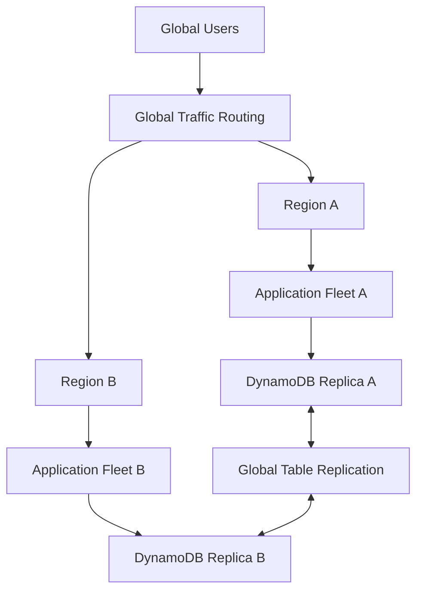
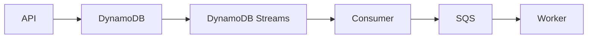
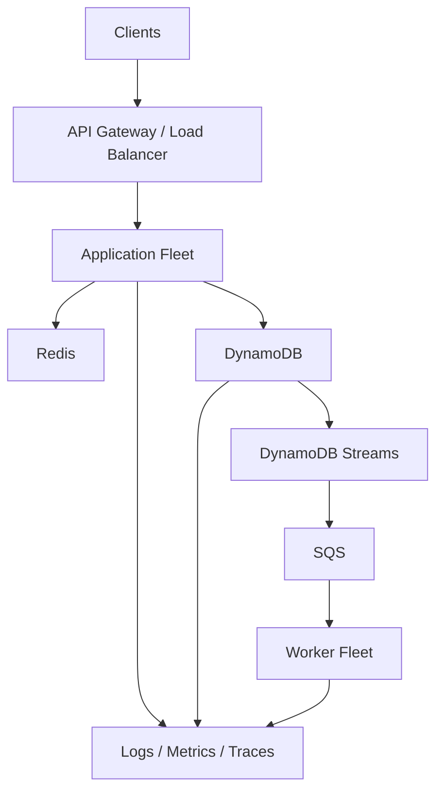

# 05- Advanced Features Questions

## Overview

This document contains advanced Amazon DynamoDB interview questions focused on distributed-system behavior, scalability, reliability, consistency, multi-Region architecture, event-driven processing, transactions, secondary indexes, operational design, and production troubleshooting.

The questions are designed to evaluate whether an engineer can reason about DynamoDB beyond basic CRUD operations and explain the architectural trade-offs behind production decisions.

---

## Advanced Architecture Questions

### Question

**How does DynamoDB achieve horizontal scalability?**

**Expected Answer**

DynamoDB distributes table data and workload across its underlying partitions. The logical partition-key design determines how effectively application traffic can be distributed.

A scalable design therefore requires:

- High-quality partition-key distribution
- Access-pattern-driven modeling
- Avoidance of hot keys
- Appropriate capacity configuration
- Efficient queries
- Careful GSI design

The important distinction is that DynamoDB manages physical partition infrastructure, while application engineers largely control logical workload distribution through data modeling.

---

### Question

**Why can a DynamoDB table experience throttling even when the table appears to have sufficient overall capacity?**

**Expected Answer**

Overall capacity does not necessarily mean that traffic is evenly distributed.

A workload can concentrate requests around a small number of partition-key values or a single highly active item.

For example:

```text
Total workload:
100,000 requests/sec

Tenant A:
90,000 requests/sec

Other tenants:
10,000 requests/sec
```

The average table-level workload may look acceptable while one logical workload becomes disproportionately hot.

Investigate:

- Partition-key distribution
- Hot keys
- Hot items
- GSI distribution
- Traffic spikes
- Retry amplification
- Item size

---

### Question

**What is a hot partition, and how would you troubleshoot one?**

**Expected Answer**

A hot partition occurs when a disproportionate amount of traffic or storage is concentrated around a subset of partition keys.

Investigate:

1. Request and throttle metrics
2. Application traffic distribution
3. Partition-key frequency
4. GSI access patterns
5. Tenant or entity skew
6. Recent workload changes
7. Retry behavior

Possible mitigations include:

- Better partition-key design
- Write sharding
- Time-based bucketing
- Workload distribution
- Caching for read-heavy hot items

Increasing capacity alone may not solve a fundamentally concentrated workload.

---

### Question

**What is write sharding in DynamoDB?**

**Expected Answer**

Write sharding distributes writes for a heavily accessed logical entity across multiple partition-key values.

Instead of:

```text
COUNTER#ORDERS
```

the application may use:

```text
COUNTER#ORDERS#00
COUNTER#ORDERS#01
COUNTER#ORDERS#02
...
COUNTER#ORDERS#09
```

Writes are distributed across shards.

The trade-off is increased read complexity because retrieving the logical aggregate may require querying multiple shards and combining the results.

---

### Question

**When should you avoid write sharding?**

**Expected Answer**

Avoid unnecessary sharding when the workload does not have a demonstrated distribution problem.

Over-sharding can introduce:

- Query fan-out
- Higher read costs
- More application complexity
- More difficult migrations
- More complicated aggregation
- Additional operational overhead

Sharding should be introduced based on measured workload characteristics rather than as a default design pattern.

---

## Advanced Data Modeling Questions

### Question

**Why is DynamoDB data modeling different from relational database modeling?**

**Expected Answer**

Relational databases generally model entities independently and use joins to retrieve related data.

DynamoDB modeling begins with access patterns.

The design process is closer to:

```text
Access Patterns
      ↓
Primary Key Design
      ↓
Indexes
      ↓
Item Structure
```

Rather than:

```text
Entities
      ↓
Normalized Tables
      ↓
Queries
```

The goal is to make required access patterns efficient without relying on expensive scans or relational joins.

---

### Question

**Why is Scan usually a poor choice for production request paths?**

**Expected Answer**

A scan examines table items rather than directly targeting a known partition-key value.

As the table grows, the amount of data examined can become very large.

A better production design is generally:

```text
Query
  ↓
Partition Key
  ↓
Required Items
```

rather than:

```text
Scan
  ↓
Entire Table
  ↓
Filter
```

Scans can still be appropriate for controlled operational workloads, migrations, analytics, or maintenance tasks when their cost and impact are understood.

---

### Question

**Why does a FilterExpression not necessarily make a DynamoDB query efficient?**

**Expected Answer**

The key condition determines which items are read from the relevant key range. A filter is applied after items are evaluated.

Conceptually:

```text
Key Condition
     ↓
Read Items
     ↓
Apply FilterExpression
     ↓
Return Matching Items
```

Therefore, filtering a large number of items down to a small result set can still consume substantial capacity.

The better solution is often to redesign the key or index so that the desired items can be targeted directly.

---

### Question

**How can a GSI become a scalability bottleneck?**

**Expected Answer**

A GSI has its own partition-key distribution and workload characteristics.

For example:

```text
GSI partition key:
STATUS#SHIPPED
```

If a large percentage of requests target the same GSI partition key, the index can develop a concentrated workload even when the base table is well distributed.

Every GSI should therefore be evaluated for:

- Key cardinality
- Traffic distribution
- Write amplification
- Query frequency
- Item projection
- Storage growth

---

### Question

**What is a sparse GSI and when is it useful?**

**Expected Answer**

A sparse GSI contains only items that have the attributes used as the index key.

For example, if only shipped orders need to be queried through a particular access pattern, only those items need to contain the GSI key attributes.

Benefits include:

- Less index storage
- Less index write workload
- Smaller query scope
- Lower operational overhead

Sparse indexes are useful when an access pattern applies only to a subset of records.

---

### Question

**How would you model a multi-tenant DynamoDB application?**

**Expected Answer**

A common approach is to incorporate tenant identity into the partition-key structure:

```text
PK = TENANT#123
SK = ORDER#456
```

or use tenant-aware composite keys depending on access patterns.

However, the key structure is not itself the complete security boundary.

The application must still verify:

```text
Authenticated Tenant
        =
Requested Tenant
```

For large tenants with disproportionate traffic, additional strategies may be required:

- Tenant-aware throttling
- Write sharding
- Workload isolation
- Dedicated capacity
- Tenant-specific partitioning

---

## Consistency Questions

### Question

**What is the difference between eventually consistent and strongly consistent reads?**

**Expected Answer**

Eventually consistent reads may return data that is not yet the latest committed state.

Strongly consistent reads provide the latest value for supported operations within the applicable consistency guarantees.

The choice should be based on business requirements.

Use stronger consistency when the application requires immediate visibility of a successful write.

Do not use strong consistency everywhere automatically because consistency requirements should be balanced against workload characteristics and cost.

---

### Question

**How would you troubleshoot an application that reports stale DynamoDB data?**

**Expected Answer**

First determine whether stale data is actually unexpected.

Check:

- Read consistency mode
- Write completion
- Read-after-write timing
- Caching layers
- Application-level caching
- Replication behavior
- Global Tables architecture
- Incorrect key construction

A common flow is:

```text
Write
  ↓
DynamoDB
  ↓
Eventually Consistent Read
  ↓
Older Value
```

If the application requires immediate visibility, verify that the selected consistency model matches the requirement.

---

### Question

**When would you use strongly consistent reads?**

**Expected Answer**

Use them when the business operation requires the latest committed value and the access pattern supports strong consistency.

Examples can include:

- Critical state checks
- Immediate post-write validation
- Certain concurrency-sensitive workflows

Do not use strong consistency simply because it sounds safer. First determine whether eventual consistency is acceptable for the business operation.

---

## Concurrency and Transactions

### Question

**How can DynamoDB support optimistic concurrency control?**

**Expected Answer**

Use conditional writes with a version attribute.

For example:

```text
Current version = 10

Update condition:
version = 10

New version:
11
```

If another writer already changed the item to version `11`, the conditional update fails.

Example:

```python
table.update_item(
    Key={
        "PK": "ORDER#123",
        "SK": "DETAILS",
    },
    UpdateExpression="SET #version = :next_version",
    ConditionExpression="#version = :current_version",
    ExpressionAttributeNames={
        "#version": "version",
    },
    ExpressionAttributeValues={
        ":current_version": 10,
        ":next_version": 11,
    },
)
```

This prevents silent overwrites.

---

### Question

**What does ConditionalCheckFailedException usually indicate?**

**Expected Answer**

It generally indicates that a condition supplied by the application was not satisfied.

Possible causes include:

- Optimistic concurrency conflict
- Duplicate request
- Idempotency protection
- Invalid state transition
- Business rule violation

It should not automatically be treated as a DynamoDB infrastructure failure.

---

### Question

**When should DynamoDB transactions be used?**

**Expected Answer**

Transactions are appropriate when multiple item operations must satisfy an atomic business requirement.

Examples include:

```text
Create order
+
Reserve inventory
+
Create payment record
```

when the business operation requires all participating writes to succeed atomically.

Transactions should not be used automatically for every operation because they introduce additional complexity and throughput considerations.

Use ordinary conditional writes when a transaction is unnecessary.

---

### Question

**What are the trade-offs of DynamoDB transactions?**

**Expected Answer**

Advantages:

- Atomic multi-item operations
- Conditional consistency across participating operations
- Useful for complex business workflows

Limitations:

- More expensive than simple writes
- Additional latency
- Transaction limits
- More contention possibilities
- More complicated failure handling

The transaction boundary should be as small as the business requirement allows.

---

### Question

**How would you implement idempotency using DynamoDB?**

**Expected Answer**

A client supplies an idempotency key.

The application stores the key and resulting state in DynamoDB using conditional operations.

Conceptually:

```text
Request
  ↓
Idempotency Key
  ↓
DynamoDB
  ↓
Already Exists?
 ┌───────────────┐
 │               │
Yes             No
 │               │
Return          Process
Existing        Request
Result             ↓
                Store Result
```

This is particularly useful for:

- Payments
- Orders
- External API operations
- Message consumers

The implementation must handle concurrent requests safely.

---

## Global Tables Questions

### Question

**What problem do DynamoDB Global Tables solve?**

**Expected Answer**

Global Tables provide multi-Region DynamoDB replication.

They can be used to improve:

- Regional availability
- Geographic latency
- Disaster recovery
- Multi-Region application architectures

The architecture becomes:

```text
Region A
DynamoDB Replica
      ↕
Global Table Replication
      ↕
Region B
DynamoDB Replica
```

Global Tables introduce additional replication, consistency, cost, and conflict considerations.

---

### Question

**What is the difference between MREC and MRSC in Global Tables?**

**Expected Answer**

MREC provides multi-Region eventual consistency with asynchronous replication.

MRSC provides stronger cross-Region consistency with additional coordination and latency implications.

The choice should be based on:

```text
Consistency requirement
+
Latency requirement
+
Failure model
+
Write architecture
+
Business semantics
```

Do not choose a multi-Region consistency model solely from its name.

---

### Question

**How do write conflicts occur in multi-Region DynamoDB?**

**Expected Answer**

With multi-Region writes, different Regions can modify the same logical item concurrently.

For example:

```text
Region A:
status = SHIPPED

Region B:
status = CANCELLED
```

The system needs a conflict strategy appropriate to the workload.

Possible architectural strategies include:

- Single-writer ownership
- Region affinity
- Versioning
- Conditional writes
- Conflict reconciliation
- Business-level conflict resolution

---

### Question

**How would you design a globally distributed DynamoDB application?**

**Expected Answer**

A production design might look like:



The design should also address:

- Traffic routing
- Regional failover
- Conflict handling
- Capacity
- Observability
- Deployment consistency
- Data residency
- Disaster recovery

---

## Event-Driven Architecture Questions

### Question

**How can DynamoDB Streams be used in an event-driven architecture?**

**Expected Answer**

DynamoDB Streams capture changes to table items and allow downstream consumers to react asynchronously.

Example:



Typical use cases include:

- Notifications
- Search indexing
- Analytics
- Audit processing
- External integrations
- Asynchronous workflows

---

### Question

**What is the difference between the DynamoDB write path and stream processing?**

**Expected Answer**

A successful DynamoDB write does not necessarily mean downstream event processing has completed.

The paths are conceptually separate:

```text
API
 ↓
DynamoDB
 ↓
Write Complete

DynamoDB
 ↓
Stream
 ↓
Consumer
 ↓
Downstream Processing
```

This separation allows asynchronous scaling but requires monitoring and failure handling.

---

### Question

**How would you troubleshoot DynamoDB Stream lag?**

**Expected Answer**

Investigate:

- Stream iterator age
- Consumer throughput
- Consumer errors
- Processing latency
- Concurrency
- Downstream dependency latency
- Queue depth
- Poison messages
- Retry behavior

For example:

```text
Incoming:
20,000 events/sec

Consumer:
10,000 events/sec

Result:
Backlog increases
```

The solution may require consumer scaling or downstream optimization rather than increasing DynamoDB capacity.

---

### Question

**How do you make DynamoDB Stream consumers idempotent?**

**Expected Answer**

Consumers should tolerate duplicate event processing.

A common approach is to maintain a processed-event record:

```text
Event ID
   ↓
DynamoDB
   ↓
Already processed?
 ┌───────────────┐
 │               │
Yes             No
 │               │
Skip           Process
                 ↓
              Record ID
```

Conditional writes can prevent multiple consumers from processing the same logical event.

Idempotency is particularly important when downstream operations are not naturally idempotent.

---

## Scalability Questions

### Question

**How would you design DynamoDB for millions of requests per second?**

**Expected Answer**

Start with access patterns rather than capacity numbers.

Evaluate:

```text
Access patterns
      ↓
Partition-key distribution
      ↓
Hot-key analysis
      ↓
GSI distribution
      ↓
Capacity mode
      ↓
Application scaling
      ↓
Caching
      ↓
Asynchronous processing
      ↓
Load testing
```

The architecture should also include:

- Horizontal application scaling
- Rate limiting
- Retry backoff
- Idempotency
- Pagination
- Backpressure
- Monitoring
- Realistic workload testing

The number of requests alone does not determine the architecture. Key distribution, item size, access patterns, and consistency requirements matter.

---

### Question

**How would you handle a single extremely hot item?**

**Expected Answer**

First determine whether the workload is read-heavy or write-heavy.

For read-heavy workloads:

```text
Application
   ↓
Redis Cache
   ↓
DynamoDB on cache miss
```

can reduce repeated reads.

For write-heavy workloads, consider:

- Write sharding
- Counter sharding
- Asynchronous aggregation
- Event-driven processing
- Workload partitioning

Caching does not solve a write-hot item.

---

### Question

**How would you design a high-volume counter in DynamoDB?**

**Expected Answer**

A single counter item can become a write hotspot.

Instead of:

```text
POST#123
likes = likes + 1
```

use sharded counters:

```text
POST#123#COUNTER#00
POST#123#COUNTER#01
...
POST#123#COUNTER#99
```

Writes distribute across shards.

Reads aggregate the shards:

```text
Shard 00 = 1,000
Shard 01 = 1,200
Shard 02 = 900
...
Total = sum(shards)
```

The trade-off is increased read complexity.

---

### Question

**What is query fan-out, and why can it be dangerous?**

**Expected Answer**

Query fan-out occurs when one logical application request must query multiple DynamoDB partitions or shards.

For example:

```text
API Request
   |
   +---- Query shard 1
   +---- Query shard 2
   +---- Query shard 3
   +---- Query shard 4
   |
   ↓
Merge Results
```

Fan-out increases:

- Read requests
- Latency
- Application CPU
- Network traffic
- Cost
- Failure surface

Use sharding only when the scalability benefit justifies the additional read complexity.

---

### Question

**How does item size affect DynamoDB scalability?**

**Expected Answer**

Larger items consume more read and write capacity and increase data transfer and storage costs.

A design that stores large blobs directly in DynamoDB can therefore become inefficient.

A common architecture is:

```text
DynamoDB
  ↓
Metadata

S3
  ↓
Large Object
```

DynamoDB stores identifiers and metadata while S3 stores large objects.

---

## Production Architecture Questions

### Question

**What does a production-grade DynamoDB architecture look like?**

**Expected Answer**

A typical architecture may contain:



Important concerns include:

- Least-privilege IAM
- Encryption
- Application authorization
- Partition-key distribution
- Capacity planning
- Retries
- Idempotency
- Rate limiting
- Monitoring
- Backups
- Disaster recovery

---

### Question

**How would you protect DynamoDB from an API traffic spike?**

**Expected Answer**

Use multiple layers:

```text
Client
  ↓
Rate Limiting
  ↓
Application Fleet
  ↓
Caching
  ↓
DynamoDB
```

Additional controls include:

- Request throttling
- Exponential backoff
- Jitter
- Bounded retries
- Caching
- Async processing
- Queue buffering
- Load shedding

The goal is to prevent uncontrolled client traffic from becoming uncontrolled DynamoDB traffic.

---

### Question

**How would you design DynamoDB for a multi-tenant SaaS system?**

**Expected Answer**

Consider:

- Tenant-aware partition keys
- Tenant isolation
- Access authorization
- Traffic skew
- Large tenants
- Rate limiting
- Write sharding where required
- Monitoring per tenant

For example:

```text
PK = TENANT#123
SK = ORDER#456
```

Large tenants may require additional workload distribution or isolation.

The security boundary must be enforced at the application authorization layer.

---

### Question

**How do you design DynamoDB for disaster recovery?**

**Expected Answer**

First define:

```text
RPO
RTO
```

Then select the appropriate mechanisms.

Potential controls include:

- Point-in-Time Recovery
- On-demand backups
- Restore testing
- Global Tables
- Multi-Region application deployment
- Regional traffic failover

The architecture should be tested under realistic failure scenarios.

---

## Security Questions

### Question

**Why is `dynamodb:*` dangerous for an application role?**

**Expected Answer**

It grants broad permissions that may include:

- Reading data
- Modifying data
- Deleting data
- Changing table configuration
- Managing indexes
- Performing administrative operations

A compromised application could therefore have a large blast radius.

Use narrowly scoped actions and resources.

---

### Question

**What is the difference between IAM authorization and application authorization?**

**Expected Answer**

IAM answers:

```text
Can this AWS principal access this DynamoDB resource?
```

Application authorization answers:

```text
Can this authenticated user access this particular business entity?
```

For example:

```text
Application Role
    ↓
Allowed to query Orders table

Authenticated User
    ↓
Allowed to access only Tenant 123
```

Both controls are required in a secure multi-tenant application.

---

### Question

**How would you secure a DynamoDB-backed API?**

**Expected Answer**

A production architecture should include:

- Authentication
- Application authorization
- Least-privilege IAM
- TLS
- Encryption at rest
- Input validation
- Tenant isolation
- Rate limiting
- Audit logging
- Sensitive-data protection
- Backup and recovery controls

Security should be implemented as defense in depth.

---

## Troubleshooting Questions

### Question

**A DynamoDB table is suddenly throttling. How do you investigate?**

**Expected Answer**

Use a structured process:

```text
Confirm throttling
      ↓
Check request volume
      ↓
Check consumed capacity
      ↓
Check recent deployments
      ↓
Check retry amplification
      ↓
Analyze partition-key distribution
      ↓
Check GSI workload
      ↓
Check item size
      ↓
Identify root cause
```

Do not immediately increase capacity without determining whether the workload itself changed.

---

### Question

**An API has 2-second latency, but DynamoDB reports low latency. What do you investigate?**

**Expected Answer**

Trace the complete request path:

```text
Client
 ↓
API Gateway / Load Balancer
 ↓
Application
 ↓
DynamoDB
 ↓
External Services
```

Break down:

```text
Total latency
=
Application processing
+
DynamoDB latency
+
Network
+
External dependencies
```

DynamoDB may not be the bottleneck.

---

### Question

**A DynamoDB query is returning too many items. What should you investigate?**

**Expected Answer**

Check:

- Partition-key design
- Sort-key condition
- Query boundaries
- Pagination
- Result size
- Filter expressions
- Access pattern
- Index design

If the application retrieves a large amount of data only to filter most of it, redesign the access pattern.

---

### Question

**How would you troubleshoot a `ResourceNotFoundException`?**

**Expected Answer**

Verify:

```text
Table name
Region
AWS account
IAM identity
Environment configuration
Table status
```

Start with:

```bash
aws sts get-caller-identity

aws dynamodb describe-table \
  --table-name Orders \
  --region ap-south-1
```

Do not recreate resources before identifying why the application referenced the wrong resource.

---

### Question

**How would you troubleshoot an `AccessDeniedException`?**

**Expected Answer**

Identify the caller:

```bash
aws sts get-caller-identity
```

Then evaluate:

```text
IAM policy
+
Resource policy
+
SCP
+
VPC endpoint policy
+
KMS permissions
```

Look for explicit denies and incorrect resource ARNs.

---

## Cost and Performance Questions

### Question

**What commonly causes unexpected DynamoDB costs?**

**Expected Answer**

Common causes include:

- Excessive request volume
- Large items
- Scans
- Inefficient queries
- GSI write amplification
- Backfills
- Batch workloads
- Retries
- Global Table replication
- Unbounded application traffic

Cost should be analyzed alongside access patterns and workload behavior.

---

### Question

**How can you reduce DynamoDB costs without simply reducing traffic?**

**Expected Answer**

Improve workload efficiency:

- Replace scans with queries
- Reduce item size
- Project only required attributes
- Eliminate unnecessary indexes
- Cache repeated reads
- Reduce retries
- Batch appropriate operations
- Use efficient pagination
- Optimize access patterns
- Choose capacity mode deliberately

The goal is to reduce unnecessary work rather than simply restrict legitimate traffic.

---

### Question

**How does Redis complement DynamoDB?**

**Expected Answer**

Redis can reduce repeated reads for highly cacheable data.

For example:

```text
Application
   ↓
Redis
   ├── Cache Hit → Return
   │
   └── Cache Miss
          ↓
      DynamoDB
          ↓
      Redis
```

Redis should not be treated as a replacement for DynamoDB.

The application must define:

- TTL
- Invalidation
- Staleness tolerance
- Cache consistency
- Failure behavior

---

## Senior-Level Design Questions

### Question

**You have a DynamoDB table with 100 million customers. One customer generates 80% of all traffic. How would you redesign the system?**

**Expected Answer**

First determine whether the workload is read-heavy, write-heavy, or mixed.

For read-heavy traffic:

- Cache hot customer data
- Use request coalescing where appropriate
- Reduce repeated reads
- Consider projections

For write-heavy traffic:

- Evaluate write sharding
- Split hot aggregates
- Use asynchronous processing
- Redesign the write model

Also investigate whether the customer's workload can be isolated or rate-limited.

The important point is to solve the actual hotspot rather than simply adding more global capacity.

---

### Question

**A team wants to use DynamoDB for an event store containing billions of events. What would you evaluate?**

**Expected Answer**

Evaluate:

- Event access patterns
- Time-based partitioning
- Partition-key distribution
- Item size
- Retention requirements
- Query patterns
- Archival requirements
- Stream processing
- Cost
- Operational tooling
- Analytics requirements

A design might use:

```text
PK = ENTITY#123#DATE#2026-08-26
SK = TIMESTAMP#EVENT-ID
```

with additional bucketing if the workload requires greater distribution.

Do not choose the key structure until the expected event volume and query patterns are known.

---

### Question

**How would you migrate a heavily used DynamoDB table without downtime?**

**Expected Answer**

A production migration can use a staged approach:

```text
Existing Table
      ↓
Dual Read / Compatibility Layer
      ↓
New Table
      ↓
Backfill
      ↓
Dual Write
      ↓
Validation
      ↓
Traffic Cutover
      ↓
Old Table Retirement
```

Important considerations include:

- Idempotent writes
- Backfill throttling
- Change capture
- Data validation
- Rollback strategy
- Monitoring
- Consistency gaps

The exact migration architecture depends on the type of schema and access-pattern change.

---

### Question

**How would you perform a large DynamoDB backfill without impacting production?**

**Expected Answer**

Use controlled concurrency and rate limiting.

A production backfill should have:

- Checkpointing
- Bounded concurrency
- Retry handling
- Idempotent writes
- Monitoring
- Pause/resume capability
- Error handling
- A kill switch

Conceptually:

```text
Production Traffic
        ↓
DynamoDB
        ↑
Controlled Backfill Workers
        ↑
Rate Limiter
```

The backfill should consume only a controlled portion of available workload capacity.

---

### Question

**How would you design a DynamoDB system that must survive a complete Regional failure?**

**Expected Answer**

A potential architecture includes:

```text
Global Traffic Routing
        |
   +----+----+
   |         |
Region A   Region B
   |         |
App Fleet  App Fleet
   |         |
DDB A  <-> DDB B
```

The design must also account for:

- Global Tables
- Regional application capacity
- Traffic failover
- Conflict handling
- RPO
- RTO
- Deployment consistency
- Secrets and configuration
- Monitoring
- Recovery testing

A common mistake is deploying a second Region without ensuring that it has enough capacity to absorb the failed Region's traffic.

---

## Interview Traps

### Trap

**"DynamoDB is serverless, so partition-key design does not matter."**

**Correct reasoning**

DynamoDB manages physical infrastructure, but logical workload distribution still depends heavily on application data modeling.

---

### Trap

**"Adding a GSI always solves a query problem."**

**Correct reasoning**

A GSI solves an access-pattern requirement but introduces additional storage, write workload, and partition-distribution considerations.

---

### Trap

**"A FilterExpression makes a query cheap."**

**Correct reasoning**

Filtering occurs after the relevant items have been evaluated. A broad read can remain expensive even if only a few items are returned.

---

### Trap

**"On-demand capacity eliminates throttling."**

**Correct reasoning**

On-demand capacity handles variable workload automatically within DynamoDB's scaling behavior, but hot keys, concentrated workloads, sudden traffic patterns, and application-level retry storms can still create problems.

---

### Trap

**"Strong consistency should always be used."**

**Correct reasoning**

Consistency should match business requirements. Strong consistency is not automatically required for every read.

---

### Trap

**"DynamoDB Streams guarantee that downstream processing is complete."**

**Correct reasoning**

Streams enable asynchronous change processing. A successful database write and completed downstream processing are separate states.

---

### Trap

**"IAM permissions are enough for multi-tenant security."**

**Correct reasoning**

IAM controls AWS resource access. Application authorization must enforce tenant and resource-level access rules.

---

### Trap

**"More shards always mean more scalability."**

**Correct reasoning**

Sharding can improve distribution but increases read fan-out, complexity, cost, and operational overhead.

---

## Advanced Scenario Comparison

| Problem | First Investigation | Potential Solution |
|---|---|---|
| Hot partition | Partition-key distribution | Better key design / sharding |
| Hot item | Read/write concentration | Cache / sharding / aggregation |
| High query cost | Key condition and result size | Better access pattern |
| High scan cost | Why scan exists | Query/index redesign |
| Stream lag | Consumer throughput | Scale consumers |
| API latency | End-to-end trace | Fix actual bottleneck |
| Access denied | IAM and policy chain | Least-privilege correction |
| Stale data | Consistency and caching | Correct consistency model |
| High cost | Request and item characteristics | Optimize workload |
| Regional failure | Capacity and routing | Multi-Region architecture |
| Backfill impact | Background workload | Rate-limited migration |
| Duplicate processing | Consumer behavior | Idempotency |

---

## Senior Design Framework

When answering an advanced DynamoDB architecture question, structure the response around:

```text
1. Requirements
        ↓
2. Access Patterns
        ↓
3. Data Model
        ↓
4. Partition Distribution
        ↓
5. Read / Write Workload
        ↓
6. Consistency
        ↓
7. Scalability
        ↓
8. Reliability
        ↓
9. Security
        ↓
10. Observability
        ↓
11. Cost
        ↓
12. Failure Scenarios
```

This demonstrates architectural reasoning rather than memorization of DynamoDB features.

---

## Key Takeaways

- Advanced DynamoDB interviews focus on access-pattern-driven design, partition distribution, consistency, concurrency, scalability, and failure handling rather than basic CRUD operations.
- Hot partitions, hot items, poorly designed GSIs, query fan-out, retry storms, and large scans are common causes of production scalability problems.
- Global Tables, Streams, transactions, write sharding, caching, and asynchronous processing solve specific architectural problems and introduce corresponding trade-offs.
- Senior-level DynamoDB design requires reasoning across the entire system: application, database, IAM, network, queues, workers, observability, cost, and disaster recovery.
- Strong interview answers explain not only what DynamoDB feature to use, but why it is appropriate, what trade-offs it introduces, and how the design behaves under failure and scale.