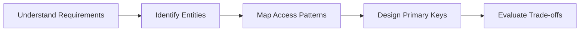

# 09- AWS DynamoDB

## Overview

This section provides curated technical questions, scenarios, and system design challenges for backend engineering interviews.

## 09- AWS DynamoDB Files

| File | Topic | Primary Focus |
|---|---|---|
| [01- DynamoDB Fundamentals](./01-%20DynamoDB%20Fundamentals.md) | DynamoDB Fundamentals | This chapter contains senior-level interview questions co... |
| [02- Data Modeling](./02-%20Data%20Modeling.md) | Data Modeling | Data modeling is arguably the most important topic in a D... |
| [03- Indexes (GSI & LSI)](./03-%20Indexes%20%28GSI%20%26%20LSI%29.md) | Indexes (GSI & LSI) | Indexes are one of the most frequently discussed topics i... |
| [04- Querying & Performance](./04-%20Querying%20%26%20Performance.md) | Querying & Performance | Query performance is one of the most common discussion to... |
| [05- Advanced Features Questions](./05-%20Advanced%20Features%20Questions.md) | Advanced Features Questions | This document contains advanced Amazon DynamoDB interview... |
| [06- Transactions & Consistency](./06-%20Transactions%20%26%20Consistency.md) | Transactions & Consistency | Transactions and consistency are among the most important... |
| [07- Streams, TTL & Advanced Features](./07-%20Streams%2C%20TTL%20%26%20Advanced%20Features.md) | Streams, TTL & Advanced Features | Amazon DynamoDB offers several advanced capabilities beyo... |
| [08- Boto3 and Coding Questions](./08-%20Boto3%20and%20Coding%20Questions.md) | Boto3 and Coding Questions | This document focuses on Python and Boto3 coding question... |
| [09- Security & IAM Questions](./09-%20Security%20%26%20IAM%20Questions.md) | Security & IAM Questions | Security is a critical topic in senior DynamoDB interview... |
| [10- Production Scenarios](./10-%20Production%20Scenarios.md) | Production Scenarios | This chapter focuses on real-world production scenarios t... |
| [11- Troubleshooting Questions](./11-%20Troubleshooting%20Questions.md) | Troubleshooting Questions | DynamoDB troubleshooting interviews evaluate whether an e... |
| [12- System Design Scenarios](./12-%20System%20Design%20Scenarios.md) | System Design Scenarios | This chapter focuses on **system design interview questio... |
| [13- Coding & Boto3 Questions](./13-%20Coding%20%26%20Boto3%20Questions.md) | Coding & Boto3 Questions | Senior backend interviews rarely stop at theoretical ques... |
| [14- Comparison Questions](./14-%20Comparison%20Questions.md) | Comparison Questions | DynamoDB comparison questions test whether an engineer un... |
| [15- Mock Senior Backend Interview](./15-%20Mock%20Senior%20Backend%20Interview.md) | Mock Senior Backend Interview | Tell me about DynamoDB |
| [16- Common Interview Traps](./16-%20Common%20Interview%20Traps.md) | Common Interview Traps | DynamoDB interview traps usually test whether an engineer... |
| [17- Senior Level Questions](./17-%20Senior%20Level%20Questions.md) | Senior Level Questions | Senior-level DynamoDB interviews focus less on API memori... |

## Progression

The documentation in this section builds conceptually according to the following flow:



## Core Concepts

### System Design Communication
Articulating trade-offs clearly when deciding between SQL and NoSQL.

### Scenario Analysis
Breaking down business requirements into concrete DynamoDB access patterns.

## Engineering Patterns

- **The STAR Method:** Structuring answers based on Situation, Task, Action, and Result.
- **Whiteboard Data Modeling:** Quickly sketching base tables and GSIs under pressure.

## Practical Considerations

Interviewers care more about *why* you chose a specific partition key than the exact syntax of a Boto3 query.

## Common Mistakes

- Immediately suggesting a Single-Table Design without clarifying access patterns.
- Failing to discuss the cost implications of GSIs in an interview.
- Claiming DynamoDB is 'always faster' than PostgreSQL.

## Recommended Reading Order

To maximize comprehension, study the files in this sequence:

1. [01- DynamoDB Fundamentals](./01-%20DynamoDB%20Fundamentals.md)
2. [02- Data Modeling](./02-%20Data%20Modeling.md)
3. [03- Indexes (GSI & LSI)](./03-%20Indexes%20%28GSI%20%26%20LSI%29.md)
4. [04- Querying & Performance](./04-%20Querying%20%26%20Performance.md)
5. [05- Advanced Features Questions](./05-%20Advanced%20Features%20Questions.md)
6. [06- Transactions & Consistency](./06-%20Transactions%20%26%20Consistency.md)
7. [07- Streams, TTL & Advanced Features](./07-%20Streams%2C%20TTL%20%26%20Advanced%20Features.md)
8. [08- Boto3 and Coding Questions](./08-%20Boto3%20and%20Coding%20Questions.md)
9. [09- Security & IAM Questions](./09-%20Security%20%26%20IAM%20Questions.md)
10. [10- Production Scenarios](./10-%20Production%20Scenarios.md)
11. [11- Troubleshooting Questions](./11-%20Troubleshooting%20Questions.md)
12. [12- System Design Scenarios](./12-%20System%20Design%20Scenarios.md)
13. [13- Coding & Boto3 Questions](./13-%20Coding%20%26%20Boto3%20Questions.md)
14. [14- Comparison Questions](./14-%20Comparison%20Questions.md)
15. [15- Mock Senior Backend Interview](./15-%20Mock%20Senior%20Backend%20Interview.md)
16. [16- Common Interview Traps](./16-%20Common%20Interview%20Traps.md)
17. [17- Senior Level Questions](./17-%20Senior%20Level%20Questions.md)

## Decision Checklist

- [ ] Can you confidently explain when NOT to use DynamoDB?
- [ ] Are you prepared to whiteboard a complex many-to-many relationship?
- [ ] Can you explain DynamoDB Streams and eventual consistency?

## Mental Model

An interview is not a test of syntax; it is a test of judgment, trade-off analysis, and architectural maturity.

## Key Takeaways

- Master the concepts before writing code.
- Understand the capacity implications of your designs.
- Continuously monitor production metrics.

## Folder Structure

```text
09- AWS DynamoDB/
    01- DynamoDB Fundamentals.md
    02- Data Modeling.md
    03- Indexes (GSI & LSI).md
    04- Querying & Performance.md
    05- Advanced Features Questions.md
    06- Transactions & Consistency.md
    07- Streams, TTL & Advanced Features.md
    08- Boto3 and Coding Questions.md
    09- Security & IAM Questions.md
    10- Production Scenarios.md
    11- Troubleshooting Questions.md
    12- System Design Scenarios.md
    13- Coding & Boto3 Questions.md
    14- Comparison Questions.md
    15- Mock Senior Backend Interview.md
    16- Common Interview Traps.md
    17- Senior Level Questions.md
    README.md
```

---

## Repository Navigation

- [AWS Concepts](../../01-%20Concepts/README.md)
- [AWS Architecture](../../02-%20Architecture/README.md)
- [AWS Operations](../../04-%20Operations/README.md)
- [AWS Security](../../05-%20Security/README.md)
- [AWS Troubleshooting](../../07-%20Troubleshooting/README.md)
- [AWS Interview Questions](../../08-%20Interview%20Questions/README.md)
- [AWS Integrations](../../09-%20Integrations/README.md)
