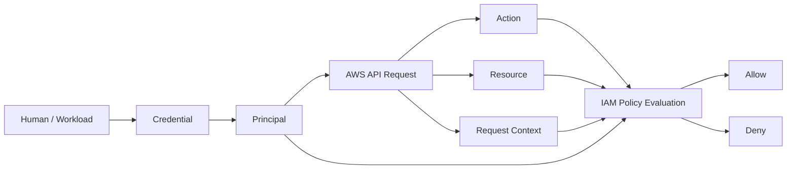
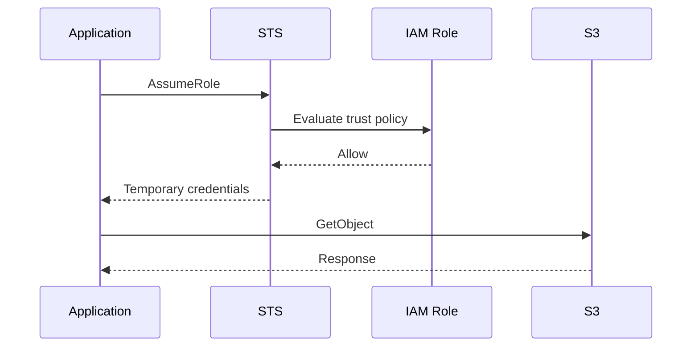
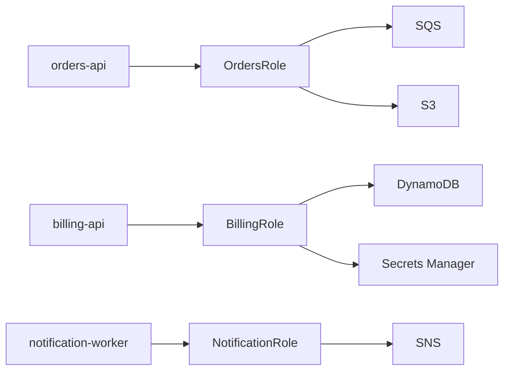
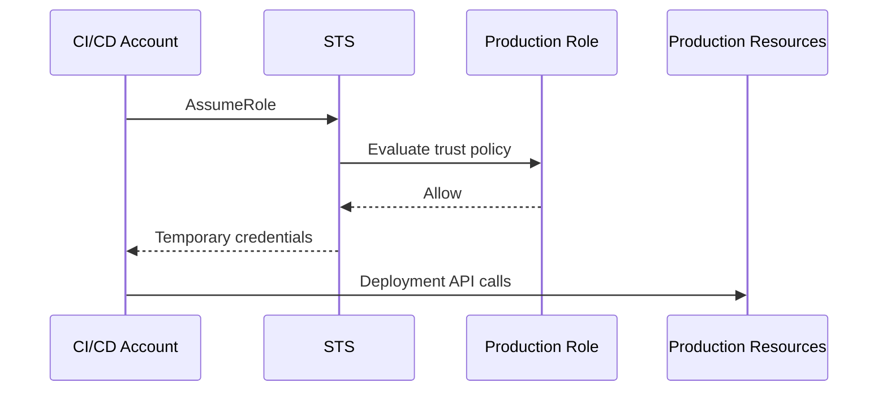

# 01- Core IAM Questions

## Overview

This document is an interview-focused reference for the core AWS Identity and Access Management concepts that backend engineers are expected to understand before moving into advanced authorization, security architecture, and IAM troubleshooting.

The emphasis is on explaining IAM the way it is used in production:

```text
Human identity
    ↓
Authentication
    ↓
Temporary credentials / IAM role
    ↓
AWS API request
    ↓
Policy evaluation
    ↓
Resource access
```

The most important interview skill is not memorizing IAM terminology. It is being able to reason through:

```text
Who is calling?
What action is being requested?
What resource is being accessed?
Which policies apply?
Is there an explicit deny?
Where did the credentials come from?
```

AWS recommends temporary credentials for human and workload access where possible, including federation/IAM Identity Center for workforce identities and IAM roles for workloads. ([AWS IAM security best practices](https://docs.aws.amazon.com/IAM/latest/UserGuide/best-practices.html))

---

## Core IAM Mental Model

Before memorizing individual answers, keep this model in mind:



A strong IAM answer usually connects:

```text
Identity
+
Credential
+
Principal
+
Action
+
Resource
+
Policy
+
Context
```

---

## IAM Fundamentals

### What is AWS IAM?

AWS Identity and Access Management is the AWS service used to control who can authenticate to AWS and what actions those identities are authorized to perform.

At a practical level, IAM manages:

```text
Identities
Policies
Roles
Credentials
Authorization
Federation
Access controls
```

IAM is primarily an **authentication and authorization control plane**. AWS services enforce the resulting authorization decisions when API requests are made.

Reference: [AWS IAM User Guide](https://docs.aws.amazon.com/IAM/latest/UserGuide/introduction.html)

---

### What is the difference between authentication and authorization?

**Authentication** answers:

```text
Who are you?
```

**Authorization** answers:

```text
What are you allowed to do?
```

Example:

```text
Developer signs in using IAM Identity Center
        ↓
Authentication
        ↓
Temporary role credentials issued
        ↓
Developer calls s3:GetObject
        ↓
Authorization evaluates IAM policies
```

A successful authentication does not imply that every AWS action is allowed.

A useful interview answer is:

> Authentication establishes the caller's identity. Authorization evaluates whether that identity can perform a specific action on a specific resource under the current request context.

---

### What are the main IAM identity types?

The core IAM identity types are:

```text
IAM users
IAM groups
IAM roles
```

IAM users are identities with long-term credentials.

IAM groups are collections used to organize IAM users and attach permissions.

IAM roles are identities intended to be assumed and normally provide temporary credentials rather than permanent passwords or access keys.

AWS recommends temporary credentials and reducing reliance on long-lived IAM users where possible. ([AWS IAM security credentials](https://docs.aws.amazon.com/IAM/latest/UserGuide/security-creds.html))

---

### What is an IAM user?

An IAM user is an AWS identity primarily representing a specific entity that requires long-term credentials.

A user can have:

```text
Console password
Access keys
MFA configuration
Attached policies
Group memberships
```

Historically, IAM users were commonly used for both humans and applications. Modern AWS guidance favors federation and temporary credentials for human users and roles for workloads. ([AWS IAM security best practices](https://docs.aws.amazon.com/IAM/latest/UserGuide/best-practices.html))

---

### What is an IAM group?

An IAM group is a collection of IAM users.

Groups help organize permissions:

```text
BackendDevelopers
    ├── Alice
    ├── Bob
    └── Carol
```

A policy can be attached to the group:

```text
BackendDevelopers
    ↓
Shared permissions
    ↓
All group members
```

Groups are useful for IAM users, but they are not principals that assume roles or make AWS API calls.

---

### What is an IAM role?

An IAM role is an identity with permissions that can be assumed by a trusted principal.

A role typically contains:

```text
Trust policy
+
Permission policies
```

When assumed, AWS STS provides temporary security credentials.

Example:

```text
EC2
  ↓
Assume role
  ↓
BackendApplicationRole
  ↓
Temporary credentials
  ↓
S3
```

AWS documents that `AssumeRole` returns temporary credentials consisting of an access key ID, secret access key, and session token. ([AWS STS AssumeRole](https://docs.aws.amazon.com/STS/latest/APIReference/API_AssumeRole.html))

---

### What is the difference between an IAM user and an IAM role?

| IAM user | IAM role |
|---|---|
| Long-term identity | Assumable identity |
| Can have long-term credentials | Normally used through temporary credentials |
| Common legacy human/workload pattern | Preferred for many workload and delegated-access scenarios |
| Password/access key possible | Temporary STS credentials |
| Identity exists directly | Identity is assumed through a session |

Typical modern architecture:

```text
Human:
Identity Provider → IAM Identity Center → Role

Workload:
EC2/ECS/Lambda/EKS → Role
```

AWS explicitly recommends temporary credentials and roles for many human and workload scenarios. ([AWS IAM security best practices](https://docs.aws.amazon.com/IAM/latest/UserGuide/best-practices.html))

---

### What is an IAM principal?

A principal is an entity that can make a request to AWS or be identified in a policy context.

Examples include:

```text
IAM user
IAM role
Federated user
AWS service principal
AWS account principal
Certain resource-specific principals
```

In a policy, the `Principal` element is especially important in resource-based and trust policies.

Do not confuse:

```text
Principal
```

with:

```text
Resource
```

A principal represents the requester.

A resource represents the AWS object being accessed.

---

### What is an AWS resource?

A resource is an object managed by an AWS service.

Examples:

```text
S3 bucket
S3 object
SQS queue
SNS topic
Lambda function
KMS key
DynamoDB table
Secrets Manager secret
```

IAM policies often identify resources using ARNs.

Example:

```text
arn:aws:s3:::company-backend-artifacts/*
```

---

### What is an action?

An action identifies an API operation or permission recognized by an AWS service.

Examples:

```text
s3:GetObject
s3:PutObject
sqs:SendMessage
secretsmanager:GetSecretValue
ec2:DescribeInstances
```

A policy combines:

```text
Effect
+
Action
+
Resource
+
optional Condition
```

---

### What is an ARN?

ARN stands for Amazon Resource Name.

It identifies AWS resources in a standardized format.

General form:

```text
arn:partition:service:region:account-id:resource
```

Examples:

```text
arn:aws:iam::123456789012:role/BackendRole
arn:aws:s3:::company-data
arn:aws:sqs:ap-south-1:123456789012/orders
```

IAM uses ARNs heavily in policy resource matching.

A common interview trap is assuming all AWS resource ARNs have the same regional/account structure. They do not. IAM itself is a global service, and services define their own ARN formats.

---

### Are IAM resources regional?

IAM is a global AWS service.

IAM entities such as users and roles are not created separately per Region.

However, the resources being accessed may be regional:

```text
IAM role
    ↓
EC2 in ap-south-1
```

or:

```text
IAM role
    ↓
Lambda in eu-west-1
```

This distinction matters when policies include conditions such as:

```text
aws:RequestedRegion
```

and when troubleshooting service endpoints.

---

## IAM Policies

### What is an IAM policy?

A policy is a JSON document that defines permissions.

A basic policy contains:

```json
{
  "Version": "2012-10-17",
  "Statement": [
    {
      "Effect": "Allow",
      "Action": "s3:GetObject",
      "Resource": "arn:aws:s3:::backend-artifacts/*"
    }
  ]
}
```

The key components are:

```text
Version
Statement
Effect
Action
Resource
Condition
Principal
```

Not every policy type uses every element.

Reference: [IAM JSON policy elements](https://docs.aws.amazon.com/IAM/latest/UserGuide/reference_policies_elements.html)

---

### What is the difference between `Allow` and `Deny`?

```text
Allow
    → Grants a permission when applicable.

Deny
    → Explicitly blocks a permission when applicable.
```

An applicable explicit deny overrides an allow.

Example:

```json
{
  "Effect": "Deny",
  "Action": "s3:DeleteObject",
  "Resource": "*"
}
```

Even if another policy contains:

```json
{
  "Effect": "Allow",
  "Action": "s3:DeleteObject",
  "Resource": "*"
}
```

the explicit deny wins.

AWS describes explicit deny as overriding an allow during policy evaluation. ([AWS policy evaluation logic](https://docs.aws.amazon.com/IAM/latest/UserGuide/reference_policies_evaluation-logic_policy-eval-basics.html))

---

### What is the difference between identity-based and resource-based policies?

**Identity-based policy:**

```text
Identity
    ↓
Policy
    ↓
Permissions
```

Example:

```text
IAM role
    ↓
Allow s3:GetObject
```

**Resource-based policy:**

```text
Resource
    ↓
Policy
    ↓
Allowed principals
```

Example:

```text
S3 bucket policy
    ↓
Allow another AWS account
```

This distinction is essential for services such as:

```text
S3
SQS
SNS
KMS
Secrets Manager
```

where resource policies can play an important role.

AWS documents identity-based and resource-based policies as two common policy types. ([AWS policy evaluation logic](https://docs.aws.amazon.com/IAM/latest/UserGuide/reference_policies_evaluation-logic_policy-eval-basics.html))

---

### What is a managed policy?

A managed policy is a standalone IAM policy that can be attached to multiple identities.

There are two main types:

```text
AWS managed policies
Customer managed policies
```

Customer-managed policies are controlled by your organization.

Example:

```text
BackendReadOnlyPolicy
    ↓
OrdersRole
BillingRole
ReportingRole
```

The advantage is centralized policy lifecycle management.

The risk is blast radius: modifying a shared policy can change permissions for multiple identities.

---

### What is an inline policy?

An inline policy is embedded directly into a single IAM user, group, or role.

Example:

```text
Role
  └── InlinePolicy
```

Inline policies are tightly coupled to their identity.

They can be appropriate for identity-specific permissions, but customer-managed policies are generally easier to reuse, inspect, version, and govern consistently.

---

### What is the difference between AWS-managed and customer-managed policies?

| AWS-managed | Customer-managed |
|---|---|
| Maintained by AWS | Maintained by your organization |
| Convenient starting point | Full policy lifecycle control |
| Can change as AWS updates policies | Changes occur under your control |
| Useful for broad baseline permissions | Better for tailored least privilege |

AWS recommends using AWS managed policies as a starting point and moving toward least-privilege policies where appropriate. ([IAM security best practices](https://docs.aws.amazon.com/IAM/latest/UserGuide/best-practices.html))

---

## Policy Evaluation

### How does IAM evaluate a request?

A useful simplified model is:

```text
Request
    ↓
Authentication
    ↓
Applicable policies
    ↓
Explicit Deny?
    ├── Yes → Deny
    └── No
          ↓
Applicable Allow?
    ├── Yes → Allow
    └── No  → Implicit Deny
```

The actual AWS model includes additional policy layers such as:

```text
Identity-based policies
Resource-based policies
Permissions boundaries
Session policies
SCPs
RCPs
Conditions
```

depending on the request and account architecture.

AWS documents explicit deny and policy evaluation as central parts of authorization behavior. ([AWS policy evaluation logic](https://docs.aws.amazon.com/IAM/latest/UserGuide/reference_policies_evaluation-logic.html))

---

### What is an implicit deny?

An implicit deny means:

```text
No applicable Allow exists.
```

For example:

```text
Role:
No s3:PutObject permission

Request:
s3:PutObject

Result:
Implicit deny
```

Adding an appropriate allow can resolve an implicit deny.

---

### What is an explicit deny?

An explicit deny is a matching policy statement containing:

```json
"Effect": "Deny"
```

Example sources include:

```text
Identity policy
Resource policy
SCP
Permissions boundary
Session policy
```

An explicit deny overrides applicable allows.

This is one of the most important IAM interview concepts.

---

### What is the difference between implicit and explicit deny?

| Implicit deny | Explicit deny |
|---|---|
| No applicable allow | Matching deny statement exists |
| Common default state | Deliberately restrictive |
| Can be fixed by an applicable allow | Cannot be overridden by another allow |
| Often indicates missing permission | Often indicates guardrail/security policy |

Interview answer:

> An implicit deny occurs when the request has no applicable allow. An explicit deny comes from a matching deny statement and overrides any allow.

---

### What is a permissions boundary?

A permissions boundary defines the maximum permissions that an identity-based policy can grant to a user or role.

Conceptually:

```text
Identity policy
       ∩
Permissions boundary
       =
Maximum effective permission set
```

Example:

```text
Role policy:
Allow s3:GetObject

Boundary:
Does not permit s3:GetObject

Result:
Denied
```

A boundary does not grant permissions by itself.

This is a common interview trap.

Reference: [Permissions boundaries](https://docs.aws.amazon.com/IAM/latest/UserGuide/access_policies_boundaries.html)

---

### What is an SCP?

A Service Control Policy is an AWS Organizations policy used as a permissions guardrail across accounts.

An SCP does not by itself grant a permission.

Conceptually:

```text
Identity permissions
        ∩
SCP permissions boundary
        =
Maximum account-level authorization
```

Example:

```text
IAM role:
Allow ec2:RunInstances

SCP:
Deny or restrict requested region

Result:
Request can still be denied
```

A common interview answer is:

> An SCP sets the maximum available permissions for principals in an account but does not grant permissions by itself.

---

### What is a session policy?

A session policy is a policy used when creating a role session, such as through STS `AssumeRole`.

It can further restrict the permissions available to the resulting session.

Conceptually:

```text
Role permissions
    ∩
Session policy
    =
Session permissions
```

AWS STS `AssumeRole` supports an inline session policy and managed session-policy ARNs. ([AWS STS AssumeRole](https://docs.aws.amazon.com/STS/latest/APIReference/API_AssumeRole.html))

---

## IAM Roles and Trust

### What is a role trust policy?

A role trust policy defines who or what is allowed to assume the role.

Example:

```json
{
  "Version": "2012-10-17",
  "Statement": [
    {
      "Effect": "Allow",
      "Principal": {
        "Service": "ecs-tasks.amazonaws.com"
      },
      "Action": "sts:AssumeRole"
    }
  ]
}
```

The question answered by the trust policy is:

```text
Who can assume this role?
```

It does not answer:

```text
What can the role access after assumption?
```

---

### What is the role permission policy?

The role permission policy defines what the assumed role can do.

For example:

```json
{
  "Version": "2012-10-17",
  "Statement": [
    {
      "Effect": "Allow",
      "Action": [
        "s3:GetObject",
        "s3:ListBucket"
      ],
      "Resource": [
        "arn:aws:s3:::backend-artifacts",
        "arn:aws:s3:::backend-artifacts/*"
      ]
    }
  ]
}
```

This answers:

```text
What can this role do?
```

Therefore:

```text
Trust policy
    → Who can assume?

Permission policy
    → What can the role do?
```

---

### What is `AssumeRole`?

`AssumeRole` is an AWS STS API operation that returns temporary security credentials for an IAM role.

Those credentials include:

```text
Access key ID
Secret access key
Session token
```

The credentials are temporary and expire after the role session ends. ([AWS STS AssumeRole](https://docs.aws.amazon.com/STS/latest/APIReference/API_AssumeRole.html))

Typical flow:



---

### What is role chaining?

Role chaining occurs when:

```text
Role A
   ↓
AssumeRole
   ↓
Role B
   ↓
AssumeRole
   ↓
Role C
```

It can be necessary in complex multi-account architectures, but excessive chaining increases complexity.

AWS limits role chaining sessions to a maximum duration of one hour. ([IAM roles](https://docs.aws.amazon.com/IAM/latest/UserGuide/id_roles_terms-and-concepts.html))

Interview answer:

> Role chaining means assuming a role using credentials that were themselves obtained from another assumed role. It is supported, but the resulting chained role session is limited to one hour.

---

### What is an External ID?

An `ExternalId` is a value commonly used in third-party cross-account role assumption.

It helps reduce the risk of the **confused deputy** problem when an external service accesses customer AWS accounts.

Typical model:

```text
Customer Account
    ↓
Trusts Vendor Role Assumption
    ↓
Requires ExternalId
```

The external service supplies the expected value when calling `AssumeRole`.

---

### What is a service-linked role?

A service-linked role is an IAM role created for a specific AWS service.

The role has a predefined trust relationship and permissions model controlled by the associated AWS service.

Examples include service-managed roles used by AWS services to perform operations in your account.

Interview distinction:

```text
Service role:
You generally configure how a service assumes and uses it.

Service-linked role:
AWS service has a tightly integrated role lifecycle.
```

---

### What is an instance profile?

An EC2 instance profile is a container for an IAM role that allows the EC2 instance to obtain temporary credentials.

Conceptually:

```text
EC2 instance
    ↓
Instance profile
    ↓
IAM role
    ↓
Temporary credentials
```

The application running on EC2 can then use the AWS SDK credential provider chain without embedding access keys.

---

## AWS STS

### What is AWS STS?

AWS Security Token Service provides temporary security credentials for AWS access.

Common STS operations include:

```text
AssumeRole
AssumeRoleWithWebIdentity
GetCallerIdentity
GetSessionToken
```

Temporary credentials are designed to reduce dependence on permanent credentials.

Reference: [AWS STS](https://docs.aws.amazon.com/IAM/latest/UserGuide/id_credentials_sts-comparison.html)

---

### What are temporary security credentials?

Temporary credentials consist of:

```text
Access key ID
Secret access key
Session token
Expiration
```

Unlike long-term IAM-user credentials, temporary credentials automatically expire.

This reduces the impact window if credentials are exposed. ([AWS security credentials](https://docs.aws.amazon.com/IAM/latest/UserGuide/security-creds.html))

---

### Why are temporary credentials preferred?

Long-lived credentials can remain valid until manually revoked.

Temporary credentials:

```text
Expire automatically
Can be refreshed
Reduce exposure window
Work well with role-based identity
Avoid embedding permanent secrets
```

AWS recommends temporary credentials for humans and workloads where possible. ([AWS IAM security best practices](https://docs.aws.amazon.com/IAM/latest/UserGuide/best-practices.html))

---

### What does `GetCallerIdentity` do?

`GetCallerIdentity` tells you which AWS identity is making the request.

Example:

```bash
aws sts get-caller-identity
```

Response:

```json
{
  "UserId": "AROAEXAMPLE:session",
  "Account": "123456789012",
  "Arn": "arn:aws:sts::123456789012:assumed-role/BackendRole/session"
}
```

It is one of the most useful IAM troubleshooting commands.

AWS documents that no permissions are required to perform this operation. ([AWS STS GetCallerIdentity](https://docs.aws.amazon.com/STS/latest/APIReference/API_GetCallerIdentity.html))

---

### Why is `GetCallerIdentity` so useful?

Suppose an engineer expects:

```text
ProductionRole
```

but the CLI actually uses:

```text
DevelopmentRole
```

The authorization investigation is already going in the wrong direction.

Run:

```bash
aws sts get-caller-identity
```

before inspecting policies.

---

### What is the difference between `AssumeRole` and `GetCallerIdentity`?

| `AssumeRole` | `GetCallerIdentity` |
|---|---|
| Obtains temporary credentials | Inspects current identity |
| Changes operating identity | Does not change identity |
| Uses trust policy | Returns caller information |
| Used for delegation | Used heavily for diagnostics |

---

## Human Identity

### How should human users access AWS?

Modern AWS guidance favors:

```text
Identity Provider
    ↓
IAM Identity Center
    ↓
Permission set / AWS account role
    ↓
Temporary credentials
```

rather than creating IAM users for every employee.

AWS recommends federation and temporary credentials for human users. ([AWS IAM security best practices](https://docs.aws.amazon.com/IAM/latest/UserGuide/best-practices.html))

---

### What is IAM Identity Center?

IAM Identity Center provides centralized workforce access across AWS accounts and applications.

A common enterprise architecture is:

```text
Corporate Identity Provider
        ↓
IAM Identity Center
        ↓
AWS Accounts
        ↓
Permission Sets
        ↓
Temporary Role Sessions
```

This is especially useful in multi-account environments.

Reference: [AWS IAM Identity Center](https://docs.aws.amazon.com/singlesignon/latest/userguide/what-is.html)

---

### Why should IAM users be minimized?

IAM users commonly have long-lived credentials:

```text
Password
Access key
```

The larger the number of permanent credentials, the larger the credential-management surface.

Modern patterns prefer:

```text
Federation
IAM Identity Center
AssumeRole
Workload roles
OIDC
```

AWS explicitly recommends reducing reliance on long-term IAM-user credentials. ([AWS IAM security best practices](https://docs.aws.amazon.com/IAM/latest/UserGuide/best-practices.html))

---

### When might an IAM user still be appropriate?

There are legacy or specialized scenarios where long-term credentials may still be required.

For example:

```text
External workload that cannot assume an IAM role
Legacy integration
Specific third-party compatibility requirement
```

Even then:

```text
Least privilege
+
MFA where applicable
+
Credential rotation
+
Monitoring
```

should be applied.

---

### Why is MFA important?

MFA adds an additional authentication factor to a credential.

Conceptually:

```text
Password
+
MFA factor
=
Stronger authentication
```

AWS recommends MFA and specifically recommends phishing-resistant MFA such as passkeys and security keys where possible. ([AWS IAM security best practices](https://docs.aws.amazon.com/IAM/latest/UserGuide/best-practices.html))

---

## Workload Identity

### How should an EC2 application authenticate to AWS?

Preferred model:

```text
EC2
    ↓
Instance Profile
    ↓
IAM Role
    ↓
Temporary Credentials
    ↓
AWS SDK
```

Avoid:

```python
AWS_ACCESS_KEY_ID = "..."
AWS_SECRET_ACCESS_KEY = "..."
```

embedded in application configuration.

AWS recommends IAM roles and temporary credentials for workloads on EC2 and other AWS compute services. ([AWS secure access keys](https://docs.aws.amazon.com/IAM/latest/UserGuide/securing_access-keys.html))

---

### How should an ECS application authenticate to AWS?

Use the ECS task role.

Distinguish:

```text
Task execution role
```

from:

```text
Task role
```

The task role provides AWS permissions to the application container.

The execution role is used by ECS itself for operations such as pulling container images and writing logs.

Interview trap:

> Giving the task execution role application permissions is not the normal way to authorize application AWS API calls.

---

### How should Lambda authenticate to AWS?

Use the Lambda execution role:

```text
Lambda
    ↓
Execution role
    ↓
Temporary credentials
    ↓
AWS SDK
```

The function should not require embedded IAM access keys.

---

### How should EKS workloads authenticate to AWS?

Use workload identity mechanisms such as:

```text
EKS Pod Identity
IAM roles for service accounts
```

rather than giving every pod broad node permissions.

The architectural goal is:

```text
Pod
    ↓
Specific IAM role
    ↓
Only required AWS permissions
```

---

### How should CI/CD authenticate to AWS?

Modern CI/CD commonly uses:

```text
GitHub Actions / GitLab / CI Provider
        ↓
OIDC
        ↓
AWS IAM role
        ↓
Temporary credentials
```

This avoids storing long-lived AWS access keys in CI secrets where role federation is available.

---

## Security Questions

### What is least privilege?

Least privilege means granting only the permissions required for a specific identity and workload.

Example:

Bad:

```json
{
  "Effect": "Allow",
  "Action": "*",
  "Resource": "*"
}
```

Better:

```json
{
  "Effect": "Allow",
  "Action": [
    "s3:GetObject",
    "s3:ListBucket"
  ],
  "Resource": [
    "arn:aws:s3:::backend-artifacts",
    "arn:aws:s3:::backend-artifacts/*"
  ]
}
```

Best-practice IAM design usually progresses from broad initial permissions toward evidence-based least privilege. AWS recommends reviewing and removing unused permissions regularly. ([AWS IAM security best practices](https://docs.aws.amazon.com/IAM/latest/UserGuide/best-practices.html))

---

### What is the principle behind avoiding wildcard permissions?

Wildcards can enlarge blast radius.

Examples:

```text
Action: "*"
Resource: "*"
```

grant extremely broad authority.

More specific permissions improve:

```text
Security
Auditability
Blast-radius control
Least privilege
Incident containment
```

However, overly fragmented policies can also become difficult to maintain.

Senior-level IAM design balances:

```text
Least privilege
+
Maintainability
+
Operational clarity
```

---

### Why should you avoid hard-coded access keys?

Hard-coded credentials can leak through:

```text
Git repositories
Docker images
Environment dumps
Logs
CI artifacts
Developer machines
Application configuration
```

Once leaked, long-lived credentials remain valid until revoked.

Temporary credentials reduce the exposure window.

AWS recommends temporary security credentials rather than long-term access keys for many workload scenarios. ([AWS secure access keys](https://docs.aws.amazon.com/IAM/latest/UserGuide/securing_access-keys.html))

---

### Why should root-user credentials be protected differently?

The root user has full access to the AWS account and is not governed like an ordinary IAM identity.

AWS recommends:

```text
Avoid routine root access
Enable strong MFA
Do not create root access keys
Protect recovery mechanisms
Use root only for tasks requiring root credentials
```

For Organizations member accounts, AWS also supports centrally managing root access. ([AWS root user best practices](https://docs.aws.amazon.com/IAM/latest/UserGuide/root-user-best-practices.html))

---

## Practical Policy Questions

### What does this policy do?

```json
{
  "Version": "2012-10-17",
  "Statement": [
    {
      "Effect": "Allow",
      "Action": "s3:GetObject",
      "Resource": "arn:aws:s3:::company-data/*"
    }
  ]
}
```

Answer:

> It allows `s3:GetObject` on objects inside the `company-data` bucket. It does not by itself grant permission to list the bucket, upload objects, delete objects, or access unrelated buckets.

This distinction between:

```text
s3:GetObject
```

and:

```text
s3:ListBucket
```

is a common interview topic.

---

### Why can an application have `s3:GetObject` but still fail?

Possible reasons include:

```text
Wrong caller identity
Wrong object ARN
Explicit deny
Permissions boundary
SCP/RCP
Bucket policy
KMS authorization
Condition mismatch
Wrong Region/context
Credential issue
```

A good answer should not immediately assume the role simply lacks permission.

---

### Why does `s3:GetObject` use an object ARN while `s3:ListBucket` uses a bucket ARN?

The permissions operate on different resource types.

```text
ListBucket
    → bucket

GetObject
    → object
```

Example:

```text
Bucket:
arn:aws:s3:::company-data

Objects:
arn:aws:s3:::company-data/*
```

Resource types are service-specific, so always verify the AWS service authorization reference.

---

### What is a condition in an IAM policy?

A `Condition` restricts when a statement applies.

Example:

```json
{
  "Effect": "Allow",
  "Action": "s3:GetObject",
  "Resource": "arn:aws:s3:::company-data/*",
  "Condition": {
    "StringEquals": {
      "aws:PrincipalOrgID": "o-example"
    }
  }
}
```

Conditions can restrict access based on context such as:

```text
Source IP
Requested Region
Principal
Organization
MFA
Time
Source account
Source ARN
Tags
```

Conditions are a major mechanism for implementing context-aware authorization.

---

## Comparison Questions

### IAM role vs access key

| IAM role | IAM access key |
|---|---|
| Identity is assumed | Credential directly identifies IAM user/root in common long-term usage |
| Usually temporary credentials | Often long-lived |
| Good for workloads and delegated access | Legacy or specialized programmatic access |
| Automatic expiration | Manual revocation/rotation |
| Supports federation and workload identity | Credential must be distributed securely |

---

### Trust policy vs permission policy

| Trust policy | Permission policy |
|---|---|
| Defines who can assume the role | Defines what the role can do |
| Uses `Principal` | Uses `Action` and `Resource` |
| Frequently uses `sts:AssumeRole` | Uses service API actions |
| Attached to role | Attached to identity / role |
| Authentication/delegation boundary | Authorization boundary |

---

### Permissions boundary vs SCP

| Permissions boundary | SCP |
|---|---|
| IAM-level guardrail | Organization/account-level guardrail |
| Attached to user or role | Applied through AWS Organizations |
| Limits identity's maximum permissions | Limits permissions available in account |
| Does not grant permissions | Does not grant permissions |
| Useful for delegated IAM administration | Useful for organization-wide governance |

---

### IAM user vs IAM Identity Center user

| IAM user | IAM Identity Center |
|---|---|
| IAM-managed account identity | Workforce identity management |
| Often long-term credentials | Temporary/federated access |
| Account-specific | Centralized multi-account access |
| More credential lifecycle management | Centralized identity lifecycle |
| Useful for specific legacy/specialized cases | Preferred for many workforce scenarios |

AWS recommends IAM Identity Center for centralized workforce access across AWS accounts. ([AWS IAM security best practices](https://docs.aws.amazon.com/IAM/latest/UserGuide/best-practices.html))

---

## Scenario Questions

### Scenario: A developer receives `AccessDenied`. What do you check first?

Start with identity:

```bash
aws sts get-caller-identity
```

Then determine:

```text
Action
Resource
Account
Region
Credential source
```

Then inspect:

```text
Identity policies
Resource policies
Boundary
SCP/RCP
Session policy
Conditions
```

Finally use:

```text
Policy Simulator
CloudTrail
Authorization-message decoding when available
```

A strong interview answer demonstrates a diagnostic sequence rather than immediately adding permissions.

---

### Scenario: The role policy allows `s3:GetObject`, but access still fails. What could be wrong?

Possible causes:

```text
Wrong object ARN
Explicit deny
SCP
Permissions boundary
Bucket policy
KMS key permissions
Condition mismatch
Wrong role
Expired credentials
VPC endpoint policy
```

Senior answer:

> I would first verify the caller with `GetCallerIdentity`, then verify the requested resource ARN and inspect all applicable authorization layers before changing the role policy.

---

### Scenario: Two IAM policies exist. One allows and one denies. What happens?

Explicit deny wins.

```text
Allow
+
Deny
=
Deny
```

This is one of the fundamental IAM rules.

---

### Scenario: A policy has no `Deny`, but the request is still denied. Why?

Possible explanation:

```text
No applicable Allow
```

which is an implicit deny.

Other restrictions can also limit access:

```text
Boundary
SCP/RCP
Session policy
Resource policy
Conditions
```

---

### Scenario: A user can assume Role A but cannot access S3 after assuming it. Why?

The two steps are different:

```text
Step 1:
Can the user assume Role A?

Step 2:
Can Role A access S3?
```

The first depends on:

```text
Trust policy
sts:AssumeRole permission
```

The second depends on:

```text
Role permission policies
+
Other applicable authorization controls
```

A successful role assumption does not mean the role has broad permissions.

---

### Scenario: An EC2 application contains an access key in its environment. What would you recommend?

Move the application to:

```text
EC2 instance profile
+
IAM role
+
Temporary credentials
```

Then remove the long-lived access key after verifying the migration.

This reduces secret-distribution and rotation overhead.

---

### Scenario: The application works locally but fails in ECS.

Check:

```text
Local credential provider
        vs
ECS task-role credential provider
```

Then run:

```bash
aws sts get-caller-identity
```

inside the relevant runtime context where appropriate.

Also inspect:

```text
Task role
Task execution role
Role permissions
Trust policy
Credential provider configuration
```

A common root cause is confusing the task execution role with the task role.

---

### Scenario: CI/CD has broad administrator permissions. What would you change?

Move toward:

```text
OIDC
    ↓
Dedicated deployment role
    ↓
Minimal permissions
```

Separate roles where appropriate:

```text
Infrastructure deployment role
Application deployment role
Read-only audit role
Database migration role
```

Do not reuse one all-powerful CI identity for every pipeline.

---

## CLI Interview Questions

### How do you find the current AWS identity?

```bash
aws sts get-caller-identity
```

### How do you inspect the active CLI configuration?

```bash
aws configure list
```

### How do you list CLI profiles?

```bash
aws configure list-profiles
```

### How do you inspect a role?

```bash
aws iam get-role \
    --role-name BackendRole
```

### How do you inspect attached managed policies?

```bash
aws iam list-attached-role-policies \
    --role-name BackendRole
```

### How do you inspect inline policies?

```bash
aws iam list-role-policies \
    --role-name BackendRole
```

### How do you assume a role manually?

```bash
aws sts assume-role \
    --role-arn arn:aws:iam::123456789012:role/BackendRole \
    --role-session-name diagnostic-session
```

The command returns temporary credentials that can be exported or consumed by tooling.

---

## Backend Engineering Questions

### How would Django access S3 without hard-coded credentials?

Use the AWS SDK credential chain with an AWS workload role.

Example architecture:

```text
Django
   ↓
boto3
   ↓
ECS Task Role / EC2 Role / EKS Workload Identity
   ↓
Temporary Credentials
   ↓
S3
```

The application should not require:

```python
AWS_ACCESS_KEY_ID = "..."
AWS_SECRET_ACCESS_KEY = "..."
```

inside source code.

---

### How would a FastAPI service access Secrets Manager securely?

Use:

```text
FastAPI
    ↓
boto3
    ↓
Workload IAM role
    ↓
secretsmanager:GetSecretValue
```

If the secret uses a customer-managed KMS key, the workload may additionally require appropriate KMS authorization.

The application still receives permissions through its AWS identity rather than through an application-specific static secret.

---

### How would microservices authenticate to AWS?

Do not create an IAM user for every microservice.

Prefer:

```text
Microservice
    ↓
Dedicated workload role
    ↓
Temporary credentials
    ↓
AWS services
```

For example:

```text
orders-api
    → OrdersTaskRole

billing-worker
    → BillingTaskRole

notification-service
    → NotificationTaskRole
```

This gives each service an independent authorization boundary.

---

### How should a Celery worker authenticate to AWS?

The Celery worker should use the same workload-identity principles as any other backend service.

For example:

```text
Celery worker
    ↓
ECS task role / EC2 role / EKS workload identity
    ↓
Temporary credentials
    ↓
SQS / S3 / Secrets Manager
```

Do not embed permanent AWS keys into worker configuration simply because it runs asynchronously.

---

## Security and Production Traps

### Trap: "The role has AdministratorAccess, so AssumeRole must work."

False.

AssumeRole requires:

```text
Source identity authorization
+
Target trust policy
```

The role's own permission policy does not determine who can assume it.

---

### Trap: "Permissions boundary grants permissions."

False.

A permissions boundary sets a maximum permission boundary; it does not grant permissions by itself.

---

### Trap: "An SCP grants permissions."

False.

An SCP acts as an organization-level guardrail. An identity still requires the necessary permission from the applicable permission policies.

---

### Trap: "Temporary credentials are only for EC2."

False.

Temporary credentials are used broadly through:

```text
IAM roles
IAM Identity Center
Federation
STS
ECS
Lambda
EKS
CI/CD OIDC
Cross-account access
```

---

### Trap: "IAM users and roles are basically the same."

False.

The key operational distinction is credential lifecycle:

```text
IAM user
    → long-lived credentials possible

IAM role
    → temporary credentials through assumption
```

---

### Trap: "An explicit Deny can be overridden by a more specific Allow."

False.

Applicable explicit deny overrides allow.

---

### Trap: "If an identity is authenticated, it can use AWS."

False.

Authentication only establishes identity.

Authorization still evaluates:

```text
Action
Resource
Policies
Conditions
```

---

### Trap: "A role policy is enough to understand the final authorization result."

Not necessarily.

Additional policy layers can affect the request:

```text
Resource policy
Permissions boundary
SCP/RCP
Session policy
Condition
Service-specific policy
```

---

### Trap: "Using `*` in Action is always wrong."

Not universally.

Some AWS services require broad permissions for specific administrative roles or APIs.

The correct principle is:

```text
Use the smallest practical permission scope
```

while keeping policies maintainable and operationally correct.

---

## Common Interview Questions

### What is IAM?

AWS's identity and authorization service for controlling access to AWS resources.

### What is a role?

An assumable AWS identity that normally provides temporary security credentials.

### What is a policy?

A JSON document describing permissions or trust relationships depending on policy type.

### What is a principal?

The entity making or receiving an authorization relationship, such as a user, role, AWS service, or account.

### What is an ARN?

A globally structured resource identifier used by AWS services and policies.

### What is an IAM user?

An AWS identity that can have long-term credentials such as passwords and access keys.

### What is an IAM group?

A collection of IAM users used to manage shared permissions.

### What is STS?

AWS Security Token Service, used to obtain temporary security credentials and related identity operations.

### What is AssumeRole?

An STS operation that returns temporary credentials for a role.

### What is GetCallerIdentity?

An STS operation that identifies the current caller.

### What is a trust policy?

A role policy defining which principals can assume the role.

### What is a permission policy?

A policy defining what actions an identity can perform on resources.

### What is least privilege?

Grant only the access required for the intended workload or user.

### What is an SCP?

An AWS Organizations guardrail that limits the maximum available permissions in an account or organizational scope.

### What is a permissions boundary?

A maximum-permission boundary for an IAM user or role.

### What is an explicit deny?

A matching `Deny` statement that overrides an allow.

### What is an implicit deny?

The default denial that occurs when no applicable allow exists.

---

## Rapid-Fire Interview Round

| Question | Strong answer |
|---|---|
| Authentication vs authorization? | Authentication identifies the caller; authorization determines allowed actions. |
| IAM user vs role? | User can have long-lived credentials; role is normally assumed for temporary credentials. |
| Group vs role? | Group organizes users; role is an assumable identity. |
| Trust policy vs permission policy? | Trust controls who assumes; permission controls what the role does. |
| STS purpose? | Issues temporary security credentials and supports identity/session operations. |
| `GetCallerIdentity`? | Shows the AWS identity making the request. |
| Explicit deny? | Overrides applicable allow. |
| Implicit deny? | No applicable allow exists. |
| Boundary? | Maximum permissions an identity policy can grant. |
| SCP? | Organization-level permissions guardrail. |
| Session policy? | Further restricts permissions of a session. |
| Long-lived keys or roles? | Prefer roles and temporary credentials where possible. |
| Human AWS access? | Prefer federation/IAM Identity Center and temporary credentials. |
| EC2 authentication? | Instance profile/IAM role. |
| ECS application authentication? | Task role. |
| Lambda authentication? | Execution role. |
| CI/CD authentication? | Prefer OIDC and temporary role sessions. |
| AccessDenied first check? | Verify caller identity and request context. |
| Cross-account role assumption? | Source permission plus target trust policy. |
| Least privilege? | Minimum required access with controlled blast radius. |

---

## Senior-Level Reasoning Questions

### Explain an IAM authorization decision step by step.

A strong answer:

```text
1. Authenticate the request.
2. Identify the principal.
3. Identify the requested action.
4. Identify the resource.
5. Determine request context.
6. Collect applicable policies.
7. Check for explicit deny.
8. Determine applicable allows.
9. Apply boundaries / organization controls / session restrictions.
10. Return allow or deny.
```

Then add:

> If troubleshooting a real incident, I would verify the identity first with `GetCallerIdentity`, inspect the relevant policy layers, and use CloudTrail or policy simulation to validate the runtime behavior.

---

### Design IAM for a production microservices platform.

A strong answer should include:

```text
Human users:
IAM Identity Center / federation

Services:
Dedicated IAM roles

ECS:
Task roles

Lambda:
Execution roles

EKS:
Pod/workload identity

CI/CD:
OIDC + deployment roles

Cross-account:
AssumeRole

Secrets:
Secrets Manager + role-based access

Policies:
Least privilege

Governance:
SCPs / boundaries where appropriate

Audit:
CloudTrail + Access Analyzer

Credential model:
Temporary credentials
```

The architecture should avoid a centralized:

```text
One IAM user
One access key
One AdministratorAccess policy
```

for the entire platform.

---

## Production Scenario: One Role Per Microservice

Consider:

```text
orders-api
billing-api
notification-worker
```

A poor design is:

```text
All services
    ↓
SharedApplicationRole
    ↓
s3:*
sqs:*
sns:*
secretsmanager:*
dynamodb:*
```

A stronger design is:



Benefits include:

```text
Smaller blast radius
Independent permission lifecycle
Clear ownership
Easier auditing
Easier incident containment
```

---

## Production Scenario: Cross-Account Access

Suppose:

```text
Account A:
CI/CD

Account B:
Production
```

The CI/CD system needs to deploy into production.

A common pattern is:



The production role should have:

```text
Specific trust relationship
+
Minimum deployment permissions
```

rather than:

```text
Trust entire external account
+
AdministratorAccess
```

---

## Production Scenario: AccessDenied

Suppose a FastAPI service returns:

```text
AccessDeniedException:
User is not authorized to perform:
secretsmanager:GetSecretValue
```

A strong interview response is:

```text
1. Verify the caller identity.
2. Verify the workload role.
3. Confirm the secret ARN.
4. Inspect role policies.
5. Check KMS if a customer-managed key is involved.
6. Check SCP/boundary/session restrictions.
7. Check secret resource policy if applicable.
8. Inspect CloudTrail.
9. Test the authorization path.
10. Make the smallest corrective policy change.
```

This demonstrates engineering reasoning rather than permission memorization.

---

## Practical IAM Commands

### Verify caller

```bash
aws sts get-caller-identity
```

### Verify a named profile

```bash
aws sts get-caller-identity \
    --profile production-readonly
```

### Inspect CLI credential source

```bash
aws configure list
```

### List profiles

```bash
aws configure list-profiles
```

### Inspect a role

```bash
aws iam get-role \
    --role-name BackendRole
```

### List managed policies attached to a role

```bash
aws iam list-attached-role-policies \
    --role-name BackendRole
```

### List inline policies

```bash
aws iam list-role-policies \
    --role-name BackendRole
```

### Simulate a permission

```bash
aws iam simulate-principal-policy \
    --policy-source-arn arn:aws:iam::123456789012:role/BackendRole \
    --action-names s3:GetObject \
    --resource-arns arn:aws:s3:::backend-artifacts/config.json
```

These commands cover a large portion of the first-response workflow for IAM interviews and real production incidents.

---

## Common Mistakes to Avoid in Interviews

### Giving only definitions

Weak:

> A role is an AWS identity.

Stronger:

> A role is an assumable identity whose sessions normally use temporary credentials. The role has a trust policy controlling who can assume it and permission policies controlling what the resulting session can do.

### Ignoring policy evaluation

Weak:

> Add `s3:GetObject`.

Stronger:

> First verify the caller, resource ARN, applicable policies, explicit denies, boundaries, SCPs, conditions, and any service-specific authorization.

### Confusing trust and permissions

Weak:

> The role does not have access because its trust policy is wrong.

Stronger:

> The trust policy controls role assumption; the permission policies control what the role can access after it is assumed.

### Recommending access keys by default

Weak:

> Create an access key for the application.

Stronger:

> Prefer a workload role and temporary credentials. Use long-lived access keys only when a specific constraint requires them.

### Treating AdministratorAccess as the default solution

Weak:

> Give the service AdministratorAccess.

Stronger:

> Identify the exact required actions and resources, grant the minimum viable permissions, and verify runtime behavior.

---

## Recommended Interview Answer Structure

For most IAM scenario questions, use this pattern:

```text
Definition
    ↓
Why it exists
    ↓
How it works
    ↓
Example
    ↓
Production concern
    ↓
Common failure / trade-off
```

Example:

> **What is an IAM role?**
>
> An IAM role is an assumable identity. It exists so users, AWS services, and workloads can obtain permissions without permanently embedding credentials. A role has a trust policy that controls who can assume it and permission policies that control what the role can do. In production, roles are commonly used with temporary credentials for EC2, ECS, Lambda, EKS, cross-account access, and CI/CD. The main operational consideration is to keep both the trust and permission scopes narrow.

This format demonstrates understanding rather than memorization.

---

## AWS Reference Links

- [AWS IAM User Guide](https://docs.aws.amazon.com/IAM/latest/UserGuide/introduction.html)
- [IAM Security Best Practices](https://docs.aws.amazon.com/IAM/latest/UserGuide/best-practices.html)
- [AWS IAM Security Credentials](https://docs.aws.amazon.com/IAM/latest/UserGuide/security-creds.html)
- [IAM Users](https://docs.aws.amazon.com/IAM/latest/UserGuide/id_users.html)
- [IAM Groups](https://docs.aws.amazon.com/IAM/latest/UserGuide/id_groups.html)
- [IAM Roles](https://docs.aws.amazon.com/IAM/latest/UserGuide/id_roles.html)
- [IAM JSON Policy Elements](https://docs.aws.amazon.com/IAM/latest/UserGuide/reference_policies_elements.html)
- [IAM Policy Evaluation Logic](https://docs.aws.amazon.com/IAM/latest/UserGuide/reference_policies_evaluation-logic.html)
- [IAM Policy Evaluation Within a Single Account](https://docs.aws.amazon.com/IAM/latest/UserGuide/reference_policies_evaluation-logic_policy-eval-basics.html)
- [Permissions Boundaries](https://docs.aws.amazon.com/IAM/latest/UserGuide/access_policies_boundaries.html)
- [AWS STS](https://docs.aws.amazon.com/IAM/latest/UserGuide/id_credentials_sts.html)
- [STS `AssumeRole`](https://docs.aws.amazon.com/STS/latest/APIReference/API_AssumeRole.html)
- [STS `GetCallerIdentity`](https://docs.aws.amazon.com/STS/latest/APIReference/API_GetCallerIdentity.html)
- [IAM Identity Center](https://docs.aws.amazon.com/singlesignon/latest/userguide/what-is.html)
- [Secure Access Keys](https://docs.aws.amazon.com/IAM/latest/UserGuide/securing_access-keys.html)
- [Root User Best Practices](https://docs.aws.amazon.com/IAM/latest/UserGuide/root-user-best-practices.html)
- [IAM Access Analyzer](https://docs.aws.amazon.com/IAM/latest/UserGuide/what-is-access-analyzer.html)

## Key Takeaways

- **Think in authorization dimensions:** identify the principal, action, resource, request context, and all applicable policy layers before deciding why a request is allowed or denied.
- **Know the role model deeply:** a role has a trust policy controlling who can assume it and permission policies controlling what the resulting role session can do.
- **Prefer temporary credentials:** use IAM Identity Center/federation for humans and workload roles, OIDC, and STS-based temporary credentials for applications and automation where possible. ([AWS IAM security best practices](https://docs.aws.amazon.com/IAM/latest/UserGuide/best-practices.html))
- **Explicit deny wins:** implicit deny means no applicable allow exists, while an applicable explicit deny overrides an allow.
- **Answer IAM questions with production reasoning:** verify identity first, distinguish authentication from authorization, minimize long-lived credentials, apply least privilege, and troubleshoot by examining the complete authorization path.