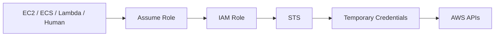
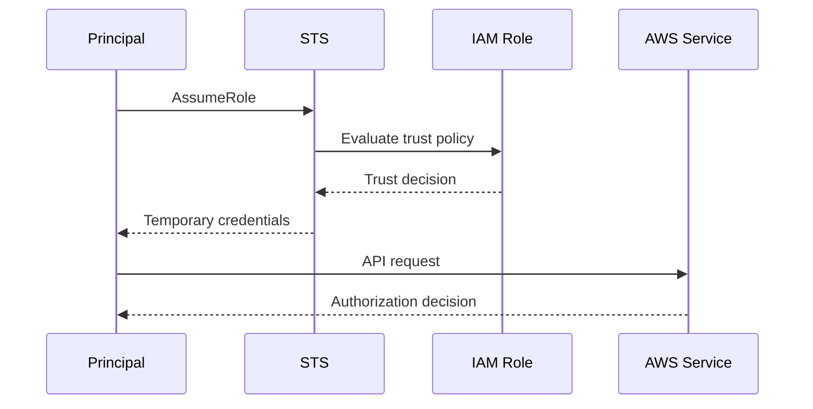
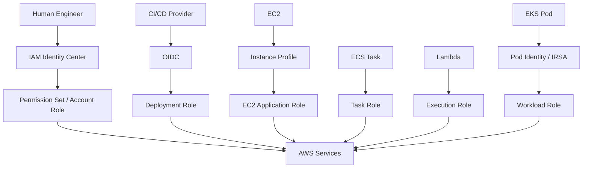

# 02- Identity and Role Questions

## Overview

IAM identity and role questions are central to AWS backend and cloud interviews because they test whether you understand the difference between:

```text
Who a caller is
        ↓
How the caller obtains credentials
        ↓
Which role the caller uses
        ↓
What the role trusts
        ↓
What the role can do
        ↓
Which authorization controls constrain it
```

AWS distinguishes human identities, workloads, federated principals, and assumed roles. IAM users can have long-term credentials, while roles, IAM Identity Center users, and federated principals commonly use temporary credentials. AWS recommends temporary credentials for human users and workloads wherever practical. ([AWS: Compare IAM identities and credentials](https://docs.aws.amazon.com/IAM/latest/UserGuide/introduction_identity-management.html), [AWS: Security best practices in IAM](https://docs.aws.amazon.com/IAM/latest/UserGuide/best-practices.html))

The strongest interview answers connect identity design to real production systems:

```text
Developer
    → IAM Identity Center
    → Role
    → Temporary credentials

EC2
    → Instance profile
    → Role
    → Temporary credentials

ECS
    → Task role
    → Temporary credentials

Lambda
    → Execution role
    → Temporary credentials

EKS
    → Pod identity
    → Role
    → Temporary credentials

CI/CD
    → OIDC
    → Deployment role
    → Temporary credentials
```

---

## Identity Model

### What is an AWS identity?

An AWS identity is an entity that can be used to authenticate and authorize requests to AWS resources.

Common identity categories include:

```text
IAM users
IAM roles
Federated identities
Workload identities
Assumed-role sessions
```

AWS describes IAM roles as identities that are intended to be assumed rather than uniquely associated with one person. ([AWS: Compare IAM identities and credentials](https://docs.aws.amazon.com/IAM/latest/UserGuide/introduction_identity-management.html))

A practical distinction is:

```text
Identity
    ↓
Credential
    ↓
Principal
    ↓
AWS request
```

---

### What is the difference between an identity and a credential?

An **identity** represents who or what is accessing AWS.

A **credential** is what proves or enables that identity to authenticate API requests.

Examples:

```text
IAM user
    → access key / secret key
    → long-term credential

IAM role
    → STS temporary credentials
    → short-term credential

IAM Identity Center user
    → temporary role credentials
    → short-term credential

EKS workload
    → role-based temporary credentials
    → short-term credential
```

This distinction matters because rotating or replacing credentials does not necessarily mean changing the underlying IAM identity.

---

### What is a principal?

A principal is an entity that participates in an AWS authorization decision.

Examples include:

```text
IAM user
IAM role
AWS account
AWS service principal
Federated principal
Assumed-role session
```

The exact principal representation depends on the policy and AWS service involved.

In an interview, avoid saying:

> Every identity is always represented by an IAM user.

That is incorrect for modern AWS architectures.

---

## IAM User Questions

### What is an IAM user?

An IAM user is an AWS identity that can have credentials directly associated with it.

Possible credentials include:

```text
Console password
Access keys
MFA configuration
```

IAM users are still supported, but AWS recommends minimizing long-lived credentials and using federation, IAM Identity Center, and roles where practical. ([AWS: Programmatic access with AWS security credentials](https://docs.aws.amazon.com/IAM/latest/UserGuide/security-creds.html))

---

### Why are IAM users being minimized?

A traditional IAM user can have long-lived credentials:

```text
Access key
Secret access key
Password
```

These credentials require:

```text
Distribution
Storage
Rotation
Revocation
Monitoring
Incident response
```

A modern architecture instead uses:

```text
Federation
+
IAM Identity Center
+
Roles
+
Temporary credentials
```

AWS specifically recommends not creating long-term access keys for human users who need access to AWS applications or services. ([AWS: Programmatic access with AWS security credentials](https://docs.aws.amazon.com/IAM/latest/UserGuide/security-creds-programmatic-access.html))

---

### Can IAM users still be useful?

Yes.

IAM users may remain necessary for specific legacy or compatibility requirements.

The correct production answer is not:

```text
"IAM users are obsolete."
```

It is:

```text
"Prefer federation and temporary credentials, and retain IAM users only where a specific requirement justifies them."
```

---

### What is an IAM group?

An IAM group is a collection of IAM users.

Example:

```text
BackendDevelopers
    ├── User A
    ├── User B
    └── User C
```

Permissions can be attached to the group and inherited by its users.

Groups help with:

```text
Permission organization
Role-based access administration
User lifecycle management
```

A group does not itself assume roles or make AWS API requests.

---

### Can a group contain roles?

No.

IAM groups are collections of IAM users.

If several workloads need shared permissions, use roles and policies rather than trying to model workloads as IAM users inside groups.

---

## IAM Role Questions

### What is an IAM role?

An IAM role is an IAM identity with a permission set that can be assumed by a trusted principal.

A role generally has:

```text
Trust policy
+
Permission policies
```

When assumed, AWS STS provides temporary security credentials.

AWS describes roles as identities that are intended to be assumable by users, workloads, or other principals. ([AWS: Compare IAM identities and credentials](https://docs.aws.amazon.com/IAM/latest/UserGuide/introduction_identity-management.html))

---

### Why do IAM roles exist?

Roles solve several problems:

```text
Avoiding long-lived credentials
Cross-account access
Workload identity
Federated access
Service delegation
Temporary privilege
```

Example:



This is a fundamental AWS security pattern.

---

### What are the two most important parts of a role?

```text
Trust policy
Permission policy
```

They answer different questions.

```text
Trust policy
    → Who can assume the role?

Permission policy
    → What can the role do?
```

Confusing these two is one of the most common IAM interview mistakes.

---

### Explain a role trust policy.

A trust policy is the resource-based policy attached to a role that defines which principals are allowed to assume it.

Example:

```json
{
  "Version": "2012-10-17",
  "Statement": [
    {
      "Effect": "Allow",
      "Principal": {
        "AWS": "arn:aws:iam::111111111111:role/CICDRole"
      },
      "Action": "sts:AssumeRole"
    }
  ]
}
```

The trust policy is evaluated when a principal attempts to assume the role.

The key question is:

```text
"Who trusts whom?"
```

---

### Explain a role permission policy.

A permission policy determines what actions the role session can perform after the role is assumed.

Example:

```json
{
  "Version": "2012-10-17",
  "Statement": [
    {
      "Effect": "Allow",
      "Action": [
        "s3:GetObject",
        "s3:PutObject"
      ],
      "Resource": "arn:aws:s3:::orders-data/*"
    }
  ]
}
```

This does not determine who can assume the role.

It determines:

```text
"What can the role do?"
```

---

### What happens when a role is assumed?

Conceptually:



The flow has two distinct authorization stages:

```text
Role assumption
    ↓
Access using the resulting role session
```

A principal can succeed at the first and still fail at the second.

---

### Are role permissions cumulative with the caller's permissions?

No.

When you assume a role, the resulting session operates with the role's permissions, subject to applicable restrictions.

AWS explicitly states that IAM user permissions and assumed-role permissions are not cumulative; when switching roles, the role's permissions are active for that role session. ([AWS: Switch to an IAM role](https://docs.aws.amazon.com/IAM/latest/UserGuide/id_roles_use_switch-role-cli.html))

Interview trap:

```text
User:
AdministratorAccess

Assume:
ReadOnlyRole

Result:
The role session is not automatically AdministratorAccess.
```

---

### What is an assumed-role session?

An assumed-role session is the temporary security context created when a principal assumes an IAM role.

Example ARN:

```text
arn:aws:sts::123456789012:assumed-role/OrdersRole/orders-api
```

The session is associated with:

```text
Role
Session name
Temporary credentials
Expiration
Optional session tags
```

This session is the identity that actually makes subsequent API requests.

---

### What is a role session name?

A role session name identifies the session created when a role is assumed.

Example:

```bash
aws sts assume-role \
    --role-arn arn:aws:iam::123456789012:role/OrdersRole \
    --role-session-name orders-deployment
```

The resulting assumed-role ARN includes the session name.

Meaningful session names improve:

```text
CloudTrail attribution
Incident response
Operational debugging
Auditability
```

---

## IAM Role Duration Questions

### How long can an IAM role session last?

For `AssumeRole`, the default session duration is one hour.

The caller can request `DurationSeconds` between 900 seconds and the role's configured maximum, which can be up to 12 hours for supported role sessions. Role chaining is limited to one hour. ([AWS CLI `assume-role`](https://docs.aws.amazon.com/cli/latest/reference/sts/assume-role.html))

Example:

```bash
aws sts assume-role \
    --role-arn arn:aws:iam::123456789012:role/OrdersRole \
    --role-session-name diagnostic \
    --duration-seconds 3600
```

---

### What is role chaining?

Role chaining means:

```text
Role A
    ↓
AssumeRole
    ↓
Role B
```

where the credentials used to assume Role B were themselves obtained from an assumed role.

Example:

```text
Identity Center
    ↓
Role A in Security Account
    ↓
AssumeRole
    ↓
Role B in Production Account
```

Role chaining is useful for delegated multi-account access but adds:

```text
Trust complexity
Session complexity
Auditing complexity
Duration constraints
```

AWS limits role chaining sessions to a maximum of one hour. ([AWS CLI `assume-role`](https://docs.aws.amazon.com/cli/latest/reference/sts/assume-role.html))

---

### Why is role chaining limited to one hour?

The practical reason is security and delegation control: chained sessions should remain relatively short-lived.

For architecture, avoid unnecessary chains such as:

```text
Human
 → Role A
 → Role B
 → Role C
 → Role D
```

Prefer:

```text
Human
 → Appropriate target role
```

when the trust architecture permits it.

---

## Instance Profile Questions

### What is an EC2 instance profile?

An instance profile is a container that associates an IAM role with an EC2 instance.

The practical flow is:

```text
EC2
    ↓
Instance Profile
    ↓
IAM Role
    ↓
Temporary Credentials
    ↓
AWS SDK / CLI
```

AWS documents instance profiles as the mechanism used to pass an IAM role to an EC2 instance. ([AWS: Use instance profiles](https://docs.aws.amazon.com/IAM/latest/UserGuide/id_roles_use_switch-role-ec2_instance-profiles.html))

---

### What is the difference between an IAM role and an instance profile?

| IAM role | Instance profile |
|---|---|
| IAM identity | EC2 container for a role |
| Defines trust and permissions | Associates a role with EC2 |
| Can be assumed in multiple ways | Specifically used with EC2 |
| Provides identity | Makes the role available to EC2 |

In the AWS console, the instance-profile detail can be largely transparent.

When using the CLI/API, role and instance profile are distinct IAM resources and may need to be managed separately. ([AWS: Use instance profiles](https://docs.aws.amazon.com/IAM/latest/UserGuide/id_roles_use_switch-role-ec2_instance_profiles.html))

---

### Can an EC2 instance have multiple IAM roles?

An EC2 instance can have only one IAM role associated through its instance profile at a time. Applications on that instance therefore share that instance-level role unless another credential mechanism is explicitly used. ([AWS: IAM role for EC2](https://docs.aws.amazon.com/IAM/latest/UserGuide/id_roles_use_switch-role-ec2.html))

This is an important architecture consideration:

```text
One EC2 instance
    ↓
One instance role
    ↓
Multiple applications
    ↓
Same base permissions
```

For stronger workload isolation, consider separate instances or containers/workload identity mechanisms.

---

## Workload Identity Questions

### How should an application on EC2 authenticate to AWS?

Use:

```text
EC2 instance profile
    ↓
IAM role
    ↓
Temporary credentials
```

The AWS CLI and SDKs can retrieve role credentials automatically through the EC2 Instance Metadata Service.

AWS recommends roles instead of distributing long-lived access keys to EC2 applications. ([AWS: Use an IAM role for applications running on EC2](https://docs.aws.amazon.com/IAM/latest/UserGuide/id_roles_use_switch-role-ec2.html))

---

### How does the application obtain the credentials?

Conceptually:

```text
Application
    ↓
AWS SDK credential provider chain
    ↓
EC2 instance metadata
    ↓
Role credentials
```

The SDK can handle credential refresh so application code does not need to manually manage static credentials. ([AWS: Use an IAM role for applications running on EC2](https://docs.aws.amazon.com/IAM/latest/UserGuide/id_roles_use_switch-role-ec2.html))

---

### Why are roles safer than environment-stored access keys?

With static access keys:

```text
Application
    ↓
Environment variable
    ↓
Long-lived secret
```

With workload roles:

```text
Application
    ↓
Credential provider
    ↓
Temporary credentials
```

The second model reduces:

```text
Secret distribution
Rotation burden
Credential lifetime
Exposure window
```

AWS explicitly recommends temporary credentials instead of long-term access keys for AWS workloads. ([AWS: Secure access keys](https://docs.aws.amazon.com/IAM/latest/UserGuide/securing_access-keys.html))

---

## ECS Role Questions

### What is the ECS task role?

The ECS task role grants AWS permissions to the application containers in an ECS task.

Example:

```text
FastAPI container
    ↓
ECS task role
    ↓
S3 / SQS / Secrets Manager
```

AWS recommends assigning task roles so each task can have granular permissions independent of the EC2 instance role. ([AWS: Best practices for IAM roles in Amazon ECS](https://docs.aws.amazon.com/AmazonECS/latest/developerguide/security-iam-roles.html))

---

### What is the ECS task execution role?

The ECS task execution role allows ECS to perform AWS operations on behalf of the ECS platform itself.

Common examples include:

```text
Pulling container images from ECR
Sending logs to CloudWatch Logs
Other ECS-managed operations
```

The task execution role and task role serve different purposes. AWS recommends keeping them separate. ([AWS: Best practices for IAM roles in Amazon ECS](https://docs.aws.amazon.com/AmazonECS/latest/developerguide/security-iam-roles.html))

---

### Task role vs task execution role

| Task role | Task execution role |
|---|---|
| Used by application containers | Used by ECS |
| Application AWS API permissions | ECS infrastructure/platform permissions |
| S3/SQS/Secrets Manager examples | ECR/CloudWatch examples |
| Security boundary for workload | Security boundary for ECS operations |

Interview trap:

> Do not add `s3:GetObject` to the task execution role because the container needs S3 access. Put the application permission on the task role.

---

### Why should ECS tasks use separate roles?

Suppose:

```text
orders-api
billing-api
```

If both use:

```text
SharedTaskExecutionRole
```

their application permissions can become coupled.

Prefer:

```text
orders-api
    → OrdersTaskRole

billing-api
    → BillingTaskRole
```

This supports:

```text
Least privilege
Service isolation
Independent lifecycle
Smaller blast radius
```

AWS recommends separate roles rather than sharing roles for unrelated ECS responsibilities. ([AWS: Best practices for IAM roles in Amazon ECS](https://docs.aws.amazon.com/AmazonECS/latest/developerguide/security-iam-roles.html))

---

## Lambda Role Questions

### What is a Lambda execution role?

A Lambda execution role is the IAM role that Lambda assumes to execute the function and interact with AWS services on behalf of the function.

Example:

```text
Lambda
    ↓
OrdersLambdaRole
    ↓
DynamoDB
SQS
Secrets Manager
```

The function should use the execution role rather than embedding access keys in the deployment package or environment.

---

### What is the trust policy for a Lambda execution role?

A typical trust relationship allows the Lambda service principal:

```json
{
  "Version": "2012-10-17",
  "Statement": [
    {
      "Effect": "Allow",
      "Principal": {
        "Service": "lambda.amazonaws.com"
      },
      "Action": "sts:AssumeRole"
    }
  ]
}
```

The role's permission policies then determine what the Lambda function can access.

---

## EKS Identity Questions

### How should an EKS workload access AWS services?

Modern EKS supports:

```text
EKS Pod Identity
```

and:

```text
IAM roles for service accounts (IRSA)
```

Both provide fine-grained IAM permissions to Kubernetes workloads. ([AWS EKS identity management](https://docs.aws.amazon.com/eks/latest/best-practices/identity-and-access-management.html))

The architectural objective is:

```text
Kubernetes service account
    ↓
IAM role
    ↓
Temporary AWS credentials
    ↓
AWS service
```

---

### What is IRSA?

IRSA stands for **IAM Roles for Service Accounts**.

It maps a Kubernetes service account to an IAM role using an IAM OIDC provider and web identity federation.

The application uses:

```text
Service account token
    ↓
AssumeRoleWithWebIdentity
    ↓
Temporary AWS role credentials
```

AWS documents IRSA as a mechanism for giving Kubernetes workloads fine-grained IAM permissions without relying on the EC2 node role. ([AWS: IAM roles for service accounts](https://docs.aws.amazon.com/eks/latest/userguide/iam-roles-for-service-accounts.html))

---

### What is EKS Pod Identity?

EKS Pod Identity is an EKS-native mechanism for associating IAM roles with Kubernetes service accounts.

The current AWS documentation describes it as an alternative to IRSA that does not require configuring an OIDC identity provider for each cluster. ([AWS: EKS Pod Identity](https://docs.aws.amazon.com/eks/latest/userguide/pod-identities.html))

Conceptually:

```text
Kubernetes service account
    ↓
EKS Pod Identity association
    ↓
IAM role
    ↓
EKS Pod Identity Agent
    ↓
Temporary credentials
```

The application can typically continue using the standard AWS SDK credential provider chain.

---

### IRSA vs EKS Pod Identity

| IRSA | EKS Pod Identity |
|---|---|
| Uses OIDC federation | EKS-native association |
| Uses `AssumeRoleWithWebIdentity` | Uses EKS Pod Identity mechanisms |
| Requires IAM OIDC provider configuration | No per-cluster OIDC provider requirement |
| Cluster-specific trust configuration is common | Role trust can use `pods.eks.amazonaws.com` |
| Mature, widely used pattern | Newer EKS-native approach |
| Fine-grained workload identity | Fine-grained workload identity |

AWS's current EKS documentation supports both patterns. ([AWS: EKS identity management](https://docs.aws.amazon.com/eks/latest/best-practices/identity-and-access-management.html), [AWS: EKS Pod Identity](https://docs.aws.amazon.com/eks/latest/userguide/pod-identities.html))

---

## Human Identity Questions

### How should enterprise employees access AWS?

A common modern pattern is:


IAM Identity Center can integrate with external identity providers and assign permission sets to users/groups across AWS accounts.

AWS recommends IAM Identity Center and federation for workforce identity management. ([AWS IAM security best practices](https://docs.aws.amazon.com/IAM/latest/UserGuide/best-practices.html))

---

### What is the relationship between IAM Identity Center and IAM roles?

A permission set results in IAM roles in the target AWS accounts that users can access.

Conceptually:

```text
Human identity
    ↓
IAM Identity Center
    ↓
Permission set
    ↓
Account role
    ↓
Temporary credentials
```

The user does not need an IAM user with a permanent access key in every account.

---

### Does IAM Identity Center eliminate IAM roles?

No.

It often **uses roles as the account-level authorization mechanism**.

The architecture becomes:

```text
Central workforce identity
    ↓
Account-specific IAM role
    ↓
Permissions
```

This separation is useful because identity lifecycle and AWS authorization can be managed independently.

---

## Federation Questions

### What is federation?

Federation means allowing an external identity system to authenticate users and establish access to AWS without creating a long-lived IAM user for each person.

Examples:

```text
Microsoft Entra ID
Okta
Active Directory
Other supported identity providers
```

The external user can ultimately receive temporary AWS role credentials.

AWS describes federated users as identities managed by an external identity provider. ([AWS: Compare IAM identities and credentials](https://docs.aws.amazon.com/IAM/latest/UserGuide/introduction_identity-management.html))

---

### What is `AssumeRoleWithWebIdentity`?

`AssumeRoleWithWebIdentity` exchanges a web identity token for temporary AWS credentials for an IAM role.

Common use cases include:

```text
OIDC
Kubernetes workload identity
Federated applications
GitHub Actions / CI systems
```

The general flow is:

```text
External identity provider
    ↓
OIDC token
    ↓
STS AssumeRoleWithWebIdentity
    ↓
IAM role
    ↓
Temporary credentials
```

---

## Cross-Account Role Questions

### How does cross-account role assumption work?

Suppose:

```text
Account A:
Caller

Account B:
TargetRole
```

The caller needs permission to call:

```text
sts:AssumeRole
```

on the target role, and the target role's trust policy must allow the caller.

Conceptually:

```text
Account A
    ↓
Caller
    ↓
sts:AssumeRole
    ↓
Account B
    ↓
Trust policy
    ↓
Target role
```

AWS recommends roles for cross-account access rather than distributing long-term credentials. ([AWS: Secure access keys](https://docs.aws.amazon.com/IAM/latest/UserGuide/securing_access-keys.html))

---

### What are the two permission checks in cross-account role assumption?

Think in terms of:

```text
Source-side permission
+
Target-side trust
```

Source:

```text
Can caller perform sts:AssumeRole?
```

Target:

```text
Does role trust the caller?
```

Both must succeed.

---

### Why is the target role's permission policy not enough?

Because the target permission policy only answers:

```text
What can the role do?
```

It does not answer:

```text
Who is allowed to assume it?
```

That is the trust policy's job.

---

### What is `ExternalId`?

`ExternalId` is commonly used when a third-party service assumes a role in your AWS account.

Typical pattern:

```text
Customer account
    ↓
Vendor role assumption
    ↓
ExternalId required
```

The trust policy validates the expected external ID.

The purpose is to reduce confused-deputy risk in third-party access scenarios.

---

## Role Security Questions

### Why should trust policies be narrow?

A trust policy determines who can obtain the role's temporary permissions.

This means an overly broad trust relationship can effectively expose all permissions in the target role to unintended principals.

Bad pattern:

```json
{
  "Effect": "Allow",
  "Principal": "*",
  "Action": "sts:AssumeRole"
}
```

Better:

```json
{
  "Effect": "Allow",
  "Principal": {
    "AWS": "arn:aws:iam::111111111111:role/CICDRole"
  },
  "Action": "sts:AssumeRole"
}
```

Then add conditions where appropriate.

---

### What security controls can be added to trust policies?

Depending on the access model:

```text
ExternalId
MFA
Source identity
Principal tags
Organization conditions
Source account
OIDC claims
Session tags
Principal ARN
```

Trust policies should follow least privilege just like permission policies.

---

### Why is `Principal` important in a trust policy?

Because it specifies who is trusted to assume the role.

For example:

```json
"Principal": {
  "Service": "ecs-tasks.amazonaws.com"
}
```

means:

```text
ECS tasks
```

are the trusted principal.

By contrast:

```json
"Principal": {
  "AWS": "arn:aws:iam::111111111111:role/CICDRole"
}
```

trusts a specific role principal.

---

## `iam:PassRole` Questions

### What is `iam:PassRole`?

`iam:PassRole` allows a principal to pass an IAM role to an AWS service that will use the role.

This is different from:

```text
sts:AssumeRole
```

The distinction matters.

```text
sts:AssumeRole
    → Principal directly obtains role session credentials

iam:PassRole
    → Principal delegates a role to an AWS service
```

For example:

```text
Developer
    ↓
Create Lambda
    ↓
Pass Lambda execution role
    ↓
Lambda service assumes execution role
```

This is a common privilege-escalation boundary.

---

### Why is `iam:PassRole` dangerous?

Suppose a user can:

```text
Create Lambda function
+
Pass AdminRole
```

The user may be able to create a Lambda function that runs with the powerful role.

Therefore:

```text
Create resource
+
iam:PassRole
```

can be more powerful than the individual permissions appear.

Interview answer:

> `iam:PassRole` authorizes passing a role to an AWS service. It should be tightly scoped to specific roles and, where supported, resources.

---

## Permission Boundaries and Roles

### Can a permissions boundary restrict a role?

Yes.

Example:

```text
Role policy:
s3:*
ec2:*
secretsmanager:*

Boundary:
s3:GetObject
```

The role cannot simply use the role policy's full set of permissions.

The effective permission is constrained by the boundary.

---

### Can a boundary grant role permissions?

No.

This is an interview trap.

A boundary defines the maximum permissions that the attached identity policy can grant.

You still need an applicable `Allow`.

---

## Session Policy Questions

### Can a session policy add permissions to a role?

No.

A session policy can restrict permissions further, but it cannot grant more permissions than the role's identity-based permissions allow.

AWS explicitly documents this behavior for role sessions. ([AWS: Switch to an IAM role](https://docs.aws.amazon.com/IAM/latest/UserGuide/id_roles_use_switch-role-api.html))

Conceptually:

```text
Role permissions
        ∩
Session policy
        =
Effective session permissions
```

---

## Role Tagging and ABAC

### Why would you tag IAM roles?

Tags can support:

```text
Ownership
Environment
Application
Cost allocation context
ABAC
Automation
Governance
```

Example:

```text
Environment = production
Application = billing
Owner = payments-team
```

These attributes can participate in authorization conditions when the relevant service supports them.

---

### What is ABAC in IAM?

ABAC stands for Attribute-Based Access Control.

Instead of defining every resource explicitly, permissions can use tags or other contextual attributes.

Example conceptual model:

```text
Principal tag:
Environment=production

Resource tag:
Environment=production

Condition:
Tags must match
```

This can scale better than maintaining enormous lists of individual resources when the organization's tagging model is reliable.

---

## Service Role Questions

### What is a service role?

A service role is an IAM role that an AWS service assumes to perform actions on your behalf.

Examples include roles used by:

```text
Lambda
CloudFormation
ECS
Step Functions
Other AWS services
```

The exact trust policy and permissions depend on the service.

---

### What is the difference between a service role and a service-linked role?

| Service role | Service-linked role |
|---|---|
| You configure the role for the service | AWS service owns more of the lifecycle |
| Trust policy depends on service | Predefined service integration |
| Permissions are administered within supported controls | Permissions are tied to service-defined behavior |
| General service delegation | Specialized AWS-service integration |

AWS documents service-linked roles as special service roles that are linked directly to an AWS service. ([AWS: AWS services that work with IAM](https://docs.aws.amazon.com/IAM/latest/UserGuide/reference_aws-services-that-work-with-iam.html))

---

## Workload Identity by Platform

| Platform | Preferred identity mechanism |
|---|---|
| EC2 | Instance profile + IAM role |
| ECS | Task role |
| Lambda | Execution role |
| EKS | EKS Pod Identity or IRSA |
| CI/CD | OIDC + IAM role |
| Cross-account workload | AssumeRole |
| Human workforce | IAM Identity Center / federation |

AWS recommends IAM roles and temporary credentials for workloads. ([AWS: Security best practices in IAM](https://docs.aws.amazon.com/IAM/latest/UserGuide/best-practices.html))

---

## Python and Backend Engineering Questions

### How would a Python application obtain AWS credentials?

Prefer the SDK default credential provider chain.

Example:

```python
import boto3

s3 = boto3.client("s3")

response = s3.get_object(
    Bucket="orders-data",
    Key="config.json",
)

print(response["ContentLength"])
```

The application does not need to manually read:

```text
AWS_ACCESS_KEY_ID
AWS_SECRET_ACCESS_KEY
```

when a supported workload credential provider is available.

The provider chain depends on the runtime environment, such as:

```text
Local profile
IAM Identity Center
Environment
Web identity
ECS credentials
EC2 instance metadata
```

The AWS CLI and SDK credential provider systems support multiple credential sources. ([AWS CLI authentication](https://docs.aws.amazon.com/cli/latest/userguide/cli-chap-authentication.html))

---

### How would you diagnose which identity a FastAPI service uses?

Use STS:

```python
import boto3

sts = boto3.client("sts")

identity = sts.get_caller_identity()

print(identity["Account"])
print(identity["Arn"])
print(identity["UserId"])
```

This is useful in:

```text
Docker
ECS
Lambda
EC2
EKS
CI/CD
```

because the same code can run under different identities in different environments.

---

### How would you structure IAM roles for microservices?

Prefer:

```text
orders-api
    → OrdersRole

billing-api
    → BillingRole

notification-worker
    → NotificationRole
```

rather than:

```text
All applications
    → SharedApplicationRole
```

Benefits:

```text
Smaller blast radius
Clear ownership
Independent policy changes
Better auditing
Easier incident response
```

AWS recommends separating ECS task roles and using application-specific roles to support least privilege. ([AWS: Best practices for IAM roles in Amazon ECS](https://docs.aws.amazon.com/AmazonECS/latest/developerguide/security-iam-roles.html))

---

## Scenario Questions

### A developer can assume a production role but receives `AccessDenied` when accessing S3. What do you check?

Use:

```text
1. Verify caller identity.
2. Confirm target role.
3. Confirm S3 action.
4. Confirm bucket/object ARN.
5. Inspect role permission policies.
6. Check permissions boundary.
7. Check SCP/RCP.
8. Check bucket policy.
9. Check KMS if encryption requires it.
10. Check policy conditions.
11. Inspect CloudTrail.
```

The important interview insight is:

```text
Successful AssumeRole
    ≠
Permission to access every resource.
```

---

### An EC2 application has administrator permissions through its instance role. What is wrong architecturally?

The role is probably too broad for the workload.

A better design is:

```text
Application
    ↓
Dedicated instance role
    ↓
Only required AWS permissions
```

If multiple applications run on the same instance and need different permissions, the instance-level role may be an overly coarse isolation boundary.

In that case, consider:

```text
Separate instances
Containers
ECS
EKS workload identity
Other workload-isolation mechanisms
```

---

### A container has AWS access keys baked into its Docker image. What would you do?

Immediately treat the credentials as exposed.

Then:

```text
1. Revoke / deactivate the compromised credentials.
2. Review CloudTrail for misuse.
3. Remove credentials from the image and source history.
4. Deploy workload identity.
5. Use task role / pod identity / instance role as appropriate.
6. Verify the new credential path.
7. Rotate dependent secrets.
```

AWS explicitly recommends not embedding long-term access keys in compute workloads. ([AWS: Secure access keys](https://docs.aws.amazon.com/IAM/latest/UserGuide/securing_access-keys.html))

---

### An ECS container cannot access Secrets Manager. The task execution role has the permission. Why might it still fail?

The application normally needs the permission on the:

```text
Task role
```

not the:

```text
Task execution role
```

The execution role is primarily for ECS-managed actions. ([AWS: Best practices for IAM roles in Amazon ECS](https://docs.aws.amazon.com/AmazonECS/latest/developerguide/security-iam-roles.html))

---

### A GitHub Actions workflow deploys to AWS using a static access key. What would you recommend?

Use:

```text
GitHub Actions OIDC
    ↓
AWS IAM role
    ↓
Temporary credentials
```

Then restrict the role trust policy using appropriate OIDC claims and limit the permission policy to deployment requirements.

This avoids storing a long-lived AWS secret in the CI system.

---

### An EKS pod can access an S3 bucket even though the node role should not have that permission. How can that happen?

Possible explanation:

```text
Pod-specific workload identity
```

For example:

```text
EKS Pod Identity
```

or:

```text
IRSA
```

can provide the pod with a different IAM role from the node role. ([AWS: EKS Pod Identity](https://docs.aws.amazon.com/eks/latest/userguide/pod-identities.html), [AWS: IRSA](https://docs.aws.amazon.com/eks/latest/userguide/iam-roles-for-service-accounts.html))

The first diagnostic step should be:

```bash
aws sts get-caller-identity
```

from the workload context.

---

## Advanced Identity Questions

### Can one role be assumed by multiple principals?

Yes.

A trust policy can allow multiple principals, for example:

```text
Several AWS accounts
AWS service principals
Federated identities
Specific roles
```

However, broad trust increases blast radius.

Prefer:

```text
Specific principals
+
Restrictive conditions
```

where the architecture permits.

---

### Can a role assume itself?

Self-assumption requires a suitable trust relationship, and unnecessary self-assumption generally indicates an architectural smell.

A role already has its own identity and permissions.

Avoid introducing self-assumption merely to "refresh" permissions.

---

### Can an IAM user assume multiple roles?

Yes.

A user can have permission to call:

```text
sts:AssumeRole
```

for multiple target roles whose trust policies also allow the user.

Example:

```text
DeveloperUser
    ├── AssumeRole → StagingRole
    ├── AssumeRole → ProductionReadOnlyRole
    └── AssumeRole → SecurityReadOnlyRole
```

This is a common delegated-access pattern.

---

### Can a role assume another role in the same account?

Yes.

Cross-account access is not required for `AssumeRole`.

Role assumption can occur:

```text
Same account
Cross account
```

The trust and source authorization rules still need to be satisfied.

---

### Can the AWS root user assume a role?

The IAM documentation states that a role cannot be assumed when signed in as the AWS account root user. ([AWS: Switch to an IAM role](https://docs.aws.amazon.com/IAM/latest/UserGuide/id_roles_use_switch-role-cli.html))

Root access should generally be avoided for routine operational work.

---

## Temporary Credential Questions

### Can temporary credentials be refreshed?

Temporary credentials cannot be extended beyond their original expiration interval.

The identity or credential provider must obtain a new set of credentials. ([AWS: Temporary security credentials](https://docs.aws.amazon.com/IAM/latest/UserGuide/id_credentials_temp.html))

In practice, modern SDKs and workload credential providers can automatically refresh credentials before expiration where supported.

---

### Can temporary credentials be revoked immediately?

Temporary credentials are designed to expire automatically.

AWS also provides mechanisms to revoke permissions associated with role sessions. Changing the policies that apply to a role can cause requests made with existing role credentials to fail after the relevant policy changes propagate, and AWS provides role-session revocation capabilities for supported scenarios. ([AWS: Permissions for temporary security credentials](https://docs.aws.amazon.com/IAM/latest/UserGuide/id_credentials_temp_control-access.html))

Interview-safe answer:

> Temporary credentials have a fixed expiration, and AWS provides mechanisms to revoke or invalidate role-session access. They are operationally safer than long-lived credentials because their lifetime is bounded.

---

### What happens when temporary credentials expire?

AWS rejects requests made with the expired credentials.

The application must obtain a new valid credential set.

This is why production SDK clients should use supported credential providers rather than manually caching one temporary credential set indefinitely.

---

## Identity and Policy Interaction

### Does a role automatically have permissions because it exists?

No.

A role can exist with:

```text
Trust policy
```

but still have no useful service permissions.

Example:

```text
Role
    ↓
Can be assumed
    ↓
But no S3 permission
```

A successful `AssumeRole` only establishes the role session.

---

### Does an IAM user permission automatically apply after assuming a role?

No.

When the user assumes a role, the role session uses the role's effective permissions rather than combining the user's and role's permissions. ([AWS: Switch to an IAM role](https://docs.aws.amazon.com/IAM/latest/UserGuide/id_roles_use_switch-role-cli.html))

---

### Does an SCP grant access?

No.

An SCP controls the maximum available permissions in an organizational scope.

A principal still needs a corresponding permission from the applicable identity/resource policy.

---

### Does a permissions boundary grant access?

No.

It limits what an identity policy can grant.

A boundary is a guardrail, not a source of permissions.

---

## Common Interview Traps

| Trap | Correct reasoning |
|---|---|
| Trust policy grants S3 access | Trust controls assumption; permission policies control resource actions |
| Role permissions and user permissions are cumulative | Assumed-role sessions operate with role permissions, subject to applicable restrictions |
| Task execution role is the application role | Application uses the task role |
| EC2 role is enough without an instance profile | EC2 associates the role through an instance profile |
| IAM user is the default identity for workloads | Prefer workload roles and temporary credentials |
| `iam:PassRole` is the same as `sts:AssumeRole` | They serve different delegation mechanisms |
| SCP grants permissions | SCP limits maximum permissions; it does not grant them |
| Boundary grants permissions | Boundary only limits maximum permissions |
| EKS pods always use node role | Pod identity mechanisms can provide separate IAM roles |
| Temporary credentials never expire | They always have an expiration |
| One role per account is simpler and therefore better | Shared roles can create excessive blast radius |
| More trust principals are easier to manage | Broad trust increases exposure |
| Successful AssumeRole means application access is guaranteed | Resource authorization still occurs afterward |

---

## Production Architecture Example

A mature backend platform might use:



The design principles are:

```text
Centralize human identity
Use dedicated workload roles
Use temporary credentials
Separate deployment identities
Scope permissions narrowly
Keep trust relationships narrow
Avoid long-lived application keys
```

---

## Senior-Level Identity Design Questions

### How would you design IAM for a multi-account enterprise?

A strong answer should include:

```text
AWS Organizations
+
Centralized workforce identity
+
IAM Identity Center
+
Permission sets
+
Cross-account roles
+
Dedicated workload roles
+
SCP guardrails
+
OIDC for CI/CD
+
CloudTrail
+
IAM Access Analyzer
```

Separate:

```text
Human identity lifecycle
```

from:

```text
AWS authorization
```

and from:

```text
Workload identity
```

This reduces operational coupling.

---

### How would you design IAM for microservices?

Prefer:

```text
One application
    ↓
One dedicated IAM role
    ↓
Minimum required permissions
```

unless a deliberate ABAC/shared-role architecture is justified.

For ECS:

```text
Task role per application
```

For EKS:

```text
Pod identity per application
```

For Lambda:

```text
Execution role per function or function family
```

The objective is independent security boundaries.

---

### How would you design a production CI/CD identity?

Use:

```text
OIDC
    ↓
Dedicated deployment role
    ↓
Narrow trust policy
    ↓
Narrow permissions
```

Separate permissions where needed:

```text
Infrastructure deployment
Application deployment
Container publishing
Database migration
Read-only inspection
```

Do not make the CI system a permanent account administrator simply because it simplifies the first deployment.

---

## Identity Troubleshooting Commands

Verify current identity:

```bash
aws sts get-caller-identity
```

Inspect role:

```bash
aws iam get-role \
    --role-name BackendRole
```

View attached policies:

```bash
aws iam list-attached-role-policies \
    --role-name BackendRole
```

View inline policies:

```bash
aws iam list-role-policies \
    --role-name BackendRole
```

Assume a role:

```bash
aws sts assume-role \
    --role-arn arn:aws:iam::123456789012:role/BackendRole \
    --role-session-name diagnostics
```

Inspect the assumed identity:

```bash
aws sts get-caller-identity
```

The important operational pattern is:

```text
Assume
    ↓
GetCallerIdentity
    ↓
Confirm expected principal
```

---

## Recommended Answer Framework

For identity and role interview questions, use:

```text
1. Define the identity or role.
2. Explain why it exists.
3. Describe how credentials are obtained.
4. Explain the trust relationship.
5. Explain the permission model.
6. Give one production example.
7. Mention the main security trade-off.
8. Mention a common interview trap.
```

Example:

> **What is an IAM role?**
>
> An IAM role is an assumable identity that normally provides temporary AWS credentials. It exists to delegate permissions without distributing permanent credentials. A role has a trust policy that controls who or what can assume it and permission policies that control what the role can do. In production, roles are used for EC2, ECS, Lambda, EKS, CI/CD, federation, and cross-account access. The main security consideration is to minimize both trust scope and permissions scope.

---

## Rapid-Fire Questions

| Question | Strong answer |
|---|---|
| What is an IAM role? | An assumable IAM identity that normally provides temporary credentials. |
| What is the trust policy? | The policy that controls who can assume the role. |
| What is the permission policy? | The policy that controls what the role can do. |
| What is an assumed-role session? | A temporary security context created when a role is assumed. |
| What is STS? | AWS Security Token Service for temporary credentials and related identity operations. |
| What is `GetCallerIdentity`? | It identifies the AWS principal making the current request. |
| What is role chaining? | Assuming a role using credentials obtained from another assumed role. |
| Chained role session maximum? | One hour. |
| Can a user and role's permissions combine? | No; the assumed-role session operates under the role's effective permissions. |
| What is an instance profile? | An EC2 mechanism that associates an IAM role with an instance. |
| Task role vs execution role? | Task role is for application containers; execution role is for ECS-managed operations. |
| What is IRSA? | EKS IAM roles for service accounts using OIDC federation. |
| What is EKS Pod Identity? | EKS-native workload-to-role association for pod AWS access. |
| What is `iam:PassRole`? | Permission to pass an IAM role to an AWS service. |
| Why avoid access keys in workloads? | They are long-lived and increase secret-distribution and rotation risk. |
| Best identity for CI/CD? | OIDC plus a dedicated IAM role where supported. |
| Best identity for EC2 workloads? | Instance profile and IAM role. |
| Best identity for ECS applications? | ECS task role. |
| Best identity for Lambda? | Lambda execution role. |
| Best workforce pattern? | IAM Identity Center / federation with temporary role credentials. |

---

## Key Takeaways

- **Separate identity from credentials:** IAM identities represent users, roles, workloads, and federated principals; credentials are the mechanisms used to authenticate API requests.
- **Understand the two halves of a role:** the trust policy answers *who can assume the role*, while permission policies answer *what the role can do*.
- **Prefer temporary credentials:** use IAM Identity Center for workforce access and roles for EC2, ECS, Lambda, EKS, CI/CD, and cross-account access rather than distributing long-lived keys. ([AWS: Security best practices in IAM](https://docs.aws.amazon.com/IAM/latest/UserGuide/best-practices.html))
- **Treat workload roles as security boundaries:** separate task roles, execution roles, pod roles, Lambda roles, and deployment roles to reduce blast radius and improve ownership.
- **For senior-level reasoning, trace the entire identity flow:** principal → credential provider → role/trust → assumed session → permissions → resource authorization, while checking `iam:PassRole`, boundaries, organization controls, and service-specific policies where applicable.