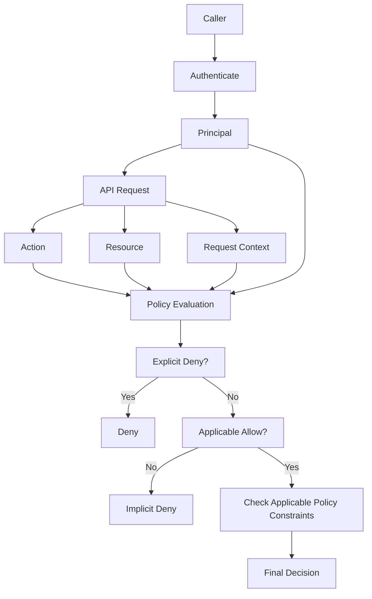
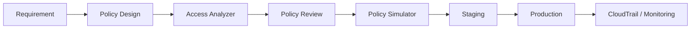
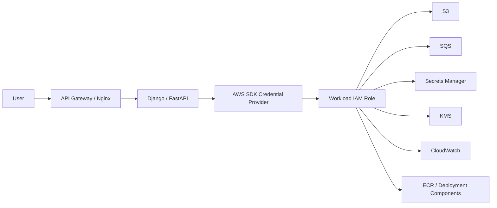

# 03- Policy and Authorization Questions

## Overview

AWS IAM policy and authorization questions test whether you understand how AWS converts:

```text
Caller identity
    +
Action
    +
Resource
    +
Request context
    +
Applicable policies
    ↓
Allow / Deny
```

The interview focus is usually not the JSON syntax itself. Strong candidates are expected to explain:

```text
What policy applies?
Who is the principal?
What resource is being targeted?
Is there an explicit deny?
Is an allow present?
Are permissions boundaries, SCPs, RCPs, or session policies involved?
Is the request same-account or cross-account?
Are resource-based policies involved?
Do request-context conditions match?
```

AWS evaluates policies that apply to the request context, with implicit deny as the default and explicit deny overriding an applicable allow. The exact interaction among identity-based policies, resource-based policies, permissions boundaries, session policies, SCPs, and RCPs depends on the request and principal type. ([AWS: Policy evaluation logic](https://docs.aws.amazon.com/IAM/latest/UserGuide/reference_policies_evaluation-logic.html), [AWS: Enforcement logic](https://docs.aws.amazon.com/IAM/latest/UserGuide/reference_policies_evaluation-logic_policy-eval-denyallow.html))

The senior-level objective is to reason from the **authorization request outward**, rather than memorizing isolated policy rules.

---

## Core Authorization Model

A useful mental model is:



The most useful interview sequence is:

```text
Who?
What action?
Which resource?
Which context?
Which policies?
Any explicit deny?
Any required allow?
Any policy constraints?
Same account or cross-account?
```

---

## IAM Policy Fundamentals

### What is an IAM policy?

An IAM policy is a JSON document that defines permissions or, depending on policy type, a trust relationship.

A common identity-based policy is:

```json
{
  "Version": "2012-10-17",
  "Statement": [
    {
      "Effect": "Allow",
      "Action": "s3:GetObject",
      "Resource": "arn:aws:s3:::backend-artifacts/*"
    }
  ]
}
```

The main policy elements include:

```text
Version
Statement
Effect
Action
Resource
Condition
Principal
```

`Principal` is required for resource-based policies, but is not used in identity-based permissions policies because the principal is implied by the identity to which the policy is attached. ([AWS: Policies and permissions](https://docs.aws.amazon.com/IAM/latest/UserGuide/access_policies.html), [AWS: Principal element](https://docs.aws.amazon.com/IAM/latest/UserGuide/reference_policies_elements_principal.html))

---

### What is the `Effect` element?

`Effect` determines whether the statement:

```text
Allow
```

or:

```text
Deny
```

the specified access.

Example:

```json
{
  "Effect": "Allow",
  "Action": "s3:GetObject",
  "Resource": "arn:aws:s3:::backend-artifacts/*"
}
```

or:

```json
{
  "Effect": "Deny",
  "Action": "s3:DeleteObject",
  "Resource": "arn:aws:s3:::backend-artifacts/*"
}
```

An applicable explicit `Deny` overrides an applicable `Allow`. ([AWS: Enforcement logic](https://docs.aws.amazon.com/IAM/latest/UserGuide/reference_policies_evaluation-logic_policy-eval-denyallow.html))

---

### What is `Action`?

`Action` identifies the AWS API operation or permission being controlled.

Examples:

```text
s3:GetObject
s3:PutObject
sqs:SendMessage
sns:Publish
secretsmanager:GetSecretValue
ec2:DescribeInstances
```

Multiple actions can be listed:

```json
{
  "Effect": "Allow",
  "Action": [
    "s3:GetObject",
    "s3:PutObject"
  ],
  "Resource": "arn:aws:s3:::backend-artifacts/*"
}
```

Wildcards are possible:

```json
"Action": "s3:Get*"
```

but should be used deliberately because they can broaden permissions beyond the actual application requirement.

---

### What is `Resource`?

`Resource` identifies the AWS resource to which the statement applies.

Example:

```json
{
  "Effect": "Allow",
  "Action": "sqs:SendMessage",
  "Resource": "arn:aws:sqs:ap-south-1:123456789012:orders"
}
```

The resource format is service-specific.

Some actions require resource-level ARNs, while others require:

```json
"Resource": "*"
```

because the service action does not support resource-level permissions in the applicable context.

AWS documents `Resource` as the object or objects to which the policy statement applies. ([AWS: Resource element](https://docs.aws.amazon.com/IAM/latest/UserGuide/reference_policies_elements_resource.html))

---

### What is `Principal`?

`Principal` identifies who a resource-based policy allows or denies.

Example:

```json
{
  "Effect": "Allow",
  "Principal": {
    "AWS": "arn:aws:iam::111111111111:role/BackendRole"
  },
  "Action": "s3:GetObject",
  "Resource": "arn:aws:s3:::shared-data/*"
}
```

`Principal` can identify:

```text
AWS account
IAM user
IAM role
Role session
Federated principal
AWS service
Other supported principal types
```

You cannot use a group as a policy principal because groups are an authorization-management construct rather than authenticated principals. ([AWS: Principal element](https://docs.aws.amazon.com/IAM/latest/UserGuide/reference_policies_elements_principal.html))

---

### What is `Condition`?

`Condition` restricts when a statement applies.

Example:

```json
{
  "Effect": "Allow",
  "Action": "s3:GetObject",
  "Resource": "arn:aws:s3:::backend-artifacts/*",
  "Condition": {
    "StringEquals": {
      "aws:RequestedRegion": "ap-south-1"
    }
  }
}
```

Conditions can evaluate context such as:

```text
Region
Source IP
Principal
Principal tags
Resource tags
Organization
MFA
Time
Source account
Source ARN
```

The policy only matches when the condition evaluates as required. AWS evaluates policy conditions using values from the request context. ([AWS: Request context](https://docs.aws.amazon.com/IAM/latest/UserGuide/reference_policies_evaluation-logic_policy-eval-reqcontext.html))

---

## Policy Types

### What are identity-based policies?

Identity-based policies attach to:

```text
IAM users
IAM groups
IAM roles
```

They define what those identities can do.

Example:

```text
OrdersRole
    ↓
OrdersPolicy
    ↓
sqs:SendMessage
```

Identity-based policies can be:

```text
AWS managed
Customer managed
Inline
```

Reference: [Identity-based policies](https://docs.aws.amazon.com/IAM/latest/UserGuide/access_policies_identity-based.html)

---

### What are resource-based policies?

Resource-based policies attach directly to supported AWS resources.

Examples:

```text
S3 bucket policy
SQS queue policy
SNS topic policy
KMS key policy
IAM role trust policy
```

They specify the principal that receives or is denied access.

Example:

```json
{
  "Effect": "Allow",
  "Principal": {
    "AWS": "arn:aws:iam::111111111111:root"
  },
  "Action": "sqs:SendMessage",
  "Resource": "arn:aws:sqs:ap-south-1:222222222222:orders"
}
```

Reference: [Resource-based policies](https://docs.aws.amazon.com/IAM/latest/UserGuide/access_policies_identity-vs-resource.html)

---

### What is the difference between identity-based and resource-based policies?

| Identity-based | Resource-based |
|---|---|
| Attached to identity | Attached to resource |
| Principal is implicit | Principal is explicit |
| Common for user/group/role permissions | Common for resource sharing |
| Uses `Action` and `Resource` | Uses `Principal`, `Action`, `Resource` as supported |
| Good for workload permission definitions | Good for direct resource delegation |

A strong interview answer should mention that the final evaluation behavior is not always identical. AWS has special semantics for some same-account resource-based policy cases, particularly depending on whether the principal is a user, role, or role session. ([AWS: Enforcement logic](https://docs.aws.amazon.com/IAM/latest/UserGuide/reference_policies_evaluation-logic_policy-eval-denyallow.html))

---

## Policy Evaluation

### What happens by default when a request reaches AWS?

The default is:

```text
Implicit deny
```

AWS then evaluates applicable policies.

A simplified model is:

```text
Default deny
    ↓
Check explicit deny
    ↓
Check applicable allow
    ↓
Apply policy constraints
    ↓
Allow or Deny
```

AWS explicitly states that an explicit deny overrides an allow. ([AWS: Enforcement logic](https://docs.aws.amazon.com/IAM/latest/UserGuide/reference_policies_evaluation-logic_policy-eval-denyallow.html))

---

### What is an implicit deny?

An implicit deny occurs when the request does not receive the required applicable `Allow`.

Example:

```text
Request:
s3:PutObject

Policy:
Only s3:GetObject

Result:
Implicit deny
```

This is the default state for permissions that were never allowed.

---

### What is an explicit deny?

An explicit deny comes from a matching policy statement:

```json
{
  "Effect": "Deny",
  "Action": "s3:DeleteObject",
  "Resource": "*"
}
```

If the statement applies to the request:

```text
Allow + Deny = Deny
```

Explicit denies can appear in:

```text
Identity-based policies
Resource-based policies
Permissions boundaries
SCPs
RCPs
Session policies
```

depending on the authorization context.

---

### What is the difference between implicit and explicit deny?

| Implicit deny | Explicit deny |
|---|---|
| No applicable allow | Applicable deny statement exists |
| Default state | Deliberate restriction |
| An allow can potentially change result | Another allow cannot override it |
| Often indicates missing permission | Often indicates guardrail/security policy |

Interview answer:

> Implicit deny is the default when there is no applicable allow. Explicit deny comes from a matching deny statement and overrides an allow.

---

## Effective Permissions

### What are effective permissions?

Effective permissions are the permissions an identity can actually exercise after considering all applicable policy layers and request context.

For a simple role:

```text
Identity policy
    +
No restricting policy
    ↓
Effective access
```

For a constrained production role:

```text
Identity policy
        ∩
Permissions boundary
        ∩
SCP
        ∩
Session policy
        +
Applicable resource-policy behavior
        ↓
Effective access
```

The exact semantics depend on principal and policy type. AWS describes the applicable policy types and their evaluation interactions in its policy-evaluation documentation. ([AWS: Enforcement logic](https://docs.aws.amazon.com/IAM/latest/UserGuide/reference_policies_evaluation-logic_policy-eval-denyallow.html))

---

### Does attaching multiple `Allow` policies add permissions?

Generally, yes, when the statements are applicable and no other policy layer denies the request.

Example:

```text
Policy A:
Allow s3:GetObject

Policy B:
Allow s3:PutObject
```

The identity may have both permissions.

Think:

```text
Identity-based Allows
    → union of applicable grants

Restricting policy layers
    → may narrow the final result
```

This becomes more complex when resource-based policies and special principal semantics are involved.

---

### Is effective permission simply the intersection of all policies?

Not universally.

This is an important senior-level interview point.

For identity-based policy combined with a permissions boundary:

```text
Effective permissions
=
Identity policy ∩ Boundary
```

For an SCP:

```text
Identity permissions
must be permitted by the SCP constraints
```

But resource-based policies can have different evaluation semantics, particularly within the same account, and the result depends on whether the resource policy grants a user, role, role session, or another principal form. ([AWS: Permissions boundaries](https://docs.aws.amazon.com/IAM/latest/UserGuide/access_policies_boundaries.html), [AWS: Enforcement logic](https://docs.aws.amazon.com/IAM/latest/UserGuide/reference_policies_evaluation-logic_policy-eval-denyallow.html))

A strong interview answer avoids saying:

> "IAM always intersects every policy."

That is an oversimplification.

---

## Permissions Boundaries

### What is a permissions boundary?

A permissions boundary defines the maximum permissions an IAM user or role can have through its identity-based policies.

Conceptually:

```text
Identity-based permissions
        ∩
Permissions boundary
        =
Constrained identity permissions
```

The boundary itself does not grant permissions.

Reference: [Permissions boundaries](https://docs.aws.amazon.com/IAM/latest/UserGuide/access_policies_boundaries.html)

---

### Does a permissions boundary grant permissions?

No.

Suppose:

```text
Boundary:
Allow s3:GetObject

Role policy:
No s3 permissions
```

The role cannot access S3 merely because the boundary contains `s3:GetObject`.

A boundary is a ceiling, not a source of permission.

---

### Why are permissions boundaries useful?

They are particularly useful for delegated IAM administration.

Example:

```text
Platform engineer can create roles
        ↓
Boundary is mandatory
        ↓
Created roles cannot exceed approved permission envelope
```

This helps control privilege escalation without requiring the central security team to author every role individually.

---

### Permissions boundary interview scenario

Suppose:

```text
Role policy:
Allow s3:GetObject

Boundary:
Allow only s3:ListBucket
```

Question:

```text
Can the role GetObject?
```

Answer:

```text
No.
```

Reason:

```text
Role policy allows GetObject
Boundary does not
→ effective permission is denied
```

AWS describes identity-policy and boundary permissions as an intersection, with explicit deny overriding allows. ([AWS: Permissions boundaries](https://docs.aws.amazon.com/IAM/latest/UserGuide/access_policies_boundaries.html))

---

## Service Control Policies

### What is an SCP?

A Service Control Policy is an AWS Organizations policy that defines the maximum available permissions for principals in affected accounts.

It does not grant permissions by itself.

Example:

```text
Role:
Allow ec2:RunInstances

SCP:
Allows only selected Regions

Request:
Launch in unsupported Region

Result:
Denied
```

SCPs are organization-level guardrails. ([AWS: SCPs](https://docs.aws.amazon.com/organizations/latest/userguide/orgs_manage_policies_scps.html))

---

### Does an SCP grant access?

No.

This is one of the most common interview traps.

The model is:

```text
Identity/resource permissions
        +
SCP constraints
        ↓
Final authorization
```

A role with no `s3:GetObject` allow cannot gain that permission because an SCP permits S3.

---

### Permissions boundary vs SCP

| Permissions boundary | SCP |
|---|---|
| Applies to IAM user/role | Applies through AWS Organizations |
| Identity-level guardrail | Account/OU organization guardrail |
| Controls maximum identity-policy permissions | Controls maximum permissions available in account |
| Useful for delegated role creation | Useful for enterprise governance |
| Does not grant permission | Does not grant permission |

---

## Resource Control Policies

### What is an RCP?

AWS Organizations resource control policies provide a permissions guardrail for resources in member accounts.

Conceptually:

```text
Resource
    ↓
RCP
    ↓
Maximum resource-side authorization
```

RCPs should not be confused with:

```text
SCPs
```

because SCPs apply to principals in accounts, while RCPs constrain resource-side access within organizational scope.

AWS includes RCPs in the current IAM policy evaluation model. ([AWS: Enforcement logic](https://docs.aws.amazon.com/IAM/latest/UserGuide/reference_policies_evaluation-logic_policy-eval-reqcontext.html))

---

## Session Policies

### What is a session policy?

A session policy is an optional policy that can further restrict a temporary session created for a role or federated user.

Conceptually:

```text
Role permissions
        ∩
Session policy
        ↓
Session permissions
```

Session policies do not add permissions beyond what the underlying identity can use.

Reference: [Session policies](https://docs.aws.amazon.com/IAM/latest/UserGuide/access_policies.html)

---

### Why would you use a session policy?

Suppose a deployment system has a broad role:

```text
DeploymentRole
    → many approved actions
```

One particular session should be restricted to:

```text
Only S3 access
```

A session policy can restrict that session without changing the permanent role policy.

This is useful for:

```text
Delegated access
Cross-account workflows
Temporary operations
Dynamic privilege narrowing
```

---

## Resource-Based Policy Questions

### Why use a resource-based policy?

Resource-based policies are useful when the resource itself should define who can access it.

Examples:

```text
S3 bucket policy
SQS queue policy
SNS topic policy
KMS key policy
```

They are especially useful for:

```text
Cross-account access
Service integration
Centralized resource ownership
Resource-specific delegation
```

---

### Can a resource-based policy grant cross-account access?

For supported AWS services, yes.

For example:

```text
Account A
    ↓
IAM role
    ↓
SQS queue policy
    ↓
Account B
```

Cross-account authorization generally requires appropriate permissions in both the trusted/requesting and trusting/resource-owning accounts, depending on the specific resource-access mechanism. ([AWS: Cross-account access](https://docs.aws.amazon.com/IAM/latest/UserGuide/access_policies_cross-account.html), [AWS: Cross-account policy evaluation](https://docs.aws.amazon.com/IAM/latest/UserGuide/reference_policies_evaluation-logic-cross-account.html))

---

### Why are resource-based policies important for S3?

S3 supports bucket policies.

Example:

```json
{
  "Version": "2012-10-17",
  "Statement": [
    {
      "Effect": "Allow",
      "Principal": {
        "AWS": "arn:aws:iam::111111111111:role/AnalyticsRole"
      },
      "Action": "s3:GetObject",
      "Resource": "arn:aws:s3:::analytics-bucket/*"
    }
  ]
}
```

The bucket owner can define resource-side access without modifying the caller's identity policy directly.

---

### Can a resource policy alone always grant access?

No.

Service semantics matter.

For cross-account access, AWS documents that identity and resource policies participate in the authorization decision, and the exact rules differ based on the mechanism and service. ([AWS: Cross-account policy evaluation](https://docs.aws.amazon.com/IAM/latest/UserGuide/reference_policies_evaluation-logic-cross-account.html))

For same-account resource-based policies, certain direct grants to users or sessions can have special behavior relative to identity-policy implicit denies, boundaries, or session policies. ([AWS: Enforcement logic](https://docs.aws.amazon.com/IAM/latest/UserGuide/reference_policies_evaluation-logic_policy-eval-denyallow.html))

Senior interview answer:

> Resource-based policies participate directly in authorization, but their exact effect depends on the service, account relationship, and principal type.

---

## Policy Conditions

### Why are conditions important?

Conditions allow policies to depend on request context rather than only on:

```text
Principal
Action
Resource
```

For example:

```text
Allow S3 access
only from approved organization
```

or:

```text
Allow sensitive action
only when MFA is present
```

This turns IAM into context-aware authorization.

---

### What is `aws:PrincipalArn`?

`aws:PrincipalArn` is a global condition key that can identify the ARN of the principal making a request.

It is especially useful when designing resource policies where you want to condition access based on the principal ARN rather than hard-coding multiple principals in the `Principal` element.

AWS documents specific evaluation behavior for `aws:PrincipalArn`, including special behavior for role sessions and permissions boundaries. ([AWS: `aws:PrincipalArn`](https://docs.aws.amazon.com/IAM/latest/UserGuide/reference_policies_condition-keys.html#condition-keys-principalarn))

---

### What is `aws:SourceArn`?

`aws:SourceArn` identifies the ARN of the resource making an AWS service-to-service request when the service supplies this context.

It is commonly used with service integrations to reduce confused-deputy risk.

Examples include trust/resource policies for services such as:

```text
SNS
S3
EventBridge
Lambda
CloudWatch
```

The exact availability and semantics depend on the calling service.

---

### What is `aws:SourceAccount`?

`aws:SourceAccount` identifies the AWS account associated with the source of certain service-to-service requests.

It is frequently paired with:

```text
aws:SourceArn
```

to constrain who can cause a service to invoke or access a resource.

For service integrations, AWS recommends using source-account and source-ARN conditions where supported to help prevent confused-deputy scenarios. ([AWS: Global condition keys](https://docs.aws.amazon.com/IAM/latest/UserGuide/reference_policies_condition-keys.html))

---

### What is `aws:PrincipalTag`?

Principal tags allow ABAC-style policies to use attributes on the principal.

Conceptually:

```text
Principal:
Environment=production

Resource:
Environment=production

Policy:
Allow when attributes match
```

Example:

```json
{
  "Effect": "Allow",
  "Action": "s3:GetObject",
  "Resource": "arn:aws:s3:::company-data/${aws:PrincipalTag/Environment}/*"
}
```

Policy variables can be used in supported policy locations, including resource ARNs and string comparisons in conditions. ([AWS: Variables and tags](https://docs.aws.amazon.com/IAM/latest/UserGuide/reference_policies_variables.html))

---

## Policy Variables

### What are policy variables?

Policy variables dynamically substitute values from the request or principal context.

Example:

```json
{
  "Effect": "Allow",
  "Action": "dynamodb:*",
  "Resource": "arn:aws:dynamodb:ap-south-1:123456789012:table/${aws:username}"
}
```

AWS documents policy variables for use in the `Resource` element and in string comparisons within `Condition`. ([AWS: Variables and tags](https://docs.aws.amazon.com/IAM/latest/UserGuide/reference_policies_variables.html))

---

### Why are policy variables useful?

They can reduce policy duplication.

Instead of:

```text
Policy for team-a
Policy for team-b
Policy for team-c
```

you may use:

```text
One policy
+
Principal-specific variable
```

This can improve scalability, but variables should not make policy intent so dynamic that it becomes difficult to audit.

---

## Wildcards

### Why are wildcards dangerous?

Consider:

```json
{
  "Effect": "Allow",
  "Action": "*",
  "Resource": "*"
}
```

This is effectively administrative access for the identity unless other controls constrain it.

More specific:

```json
{
  "Effect": "Allow",
  "Action": [
    "sqs:SendMessage"
  ],
  "Resource": "arn:aws:sqs:ap-south-1:123456789012:orders"
}
```

Prefer:

```text
Specific action
+
Specific resource
+
Specific condition
```

when practical.

---

### Is `Resource: "*"` always insecure?

No.

Some AWS APIs cannot be scoped to a resource ARN, or the service action semantics require `*`.

For example, certain list/describe actions may require:

```json
"Resource": "*"
```

The correct question is:

```text
Does this action support resource-level permissions?
```

The AWS service authorization reference should be consulted.

A senior answer should avoid claiming:

> "`Resource: *` is always wrong."

---

## Cross-Account Authorization

### How is cross-account access different?

Same-account access generally involves authorization within one AWS account.

Cross-account access involves:

```text
Trusted account
+
Trusting account
```

AWS describes the trusted account as the account containing the principal and the trusting account as the account containing the resource. Both sides participate in the authorization decision for common cross-account resource access models. ([AWS: Cross-account policy evaluation](https://docs.aws.amazon.com/IAM/latest/UserGuide/reference_policies_evaluation-logic-cross-account.html))

---

### What are the common cross-account patterns?

Two major patterns are:

```text
Cross-account role assumption
```

and:

```text
Cross-account resource-based policy
```

Role pattern:

```text
Account A
    ↓
AssumeRole
    ↓
Role in Account B
    ↓
Temporary credentials
    ↓
Resources in Account B
```

Resource-policy pattern:

```text
Account A principal
    ↓
Resource policy in Account B
    ↓
Resource access
```

Use the pattern supported by the target service and required architecture. ([AWS: Cross-account resource access](https://docs.aws.amazon.com/IAM/latest/UserGuide/access_policies-cross-account-resource-access.html))

---

### Why might a cross-account request fail even when the target resource policy allows it?

Possible causes include:

```text
Source identity lacks required permission
Target resource policy does not match principal
SCP restriction
RCP restriction
Permissions boundary
Condition mismatch
Wrong principal ARN
Wrong resource ARN
Service-specific rule
```

Cross-account debugging must inspect both accounts and all applicable policy layers.

---

## Policy Evaluation Scenarios

### Scenario: Allow and explicit deny

```text
Role policy:
Allow s3:GetObject

Bucket policy:
Deny s3:GetObject
```

Question:

```text
Can the role read?
```

Answer:

```text
No.
```

Reason:

```text
Explicit deny overrides allow.
```

---

### Scenario: Identity policy missing

```text
Role policy:
No s3:GetObject

Bucket policy:
Allows the role

Same account
```

The answer is nuanced.

A resource-based policy can directly grant access in certain same-account situations, and the exact result depends on the principal type and how the resource policy specifies the principal. ([AWS: Enforcement logic](https://docs.aws.amazon.com/IAM/latest/UserGuide/reference_policies_evaluation-logic_policy-eval-denyallow.html))

This is a better interview answer than:

> "The identity policy is always required."

For cross-account resource access, AWS generally requires the source identity to have appropriate permission and the resource-side policy to permit access. ([AWS: Cross-account policy evaluation](https://docs.aws.amazon.com/IAM/latest/UserGuide/reference_policies_evaluation-logic-cross-account.html))

---

### Scenario: Role policy allows access, boundary blocks it

```text
Role policy:
Allow secretsmanager:GetSecretValue

Permissions boundary:
Does not allow it
```

Result:

```text
Denied
```

Reason:

```text
The effective permissions are constrained by the boundary.
```

---

### Scenario: Role policy allows access, SCP blocks it

```text
Role policy:
Allow ec2:RunInstances

SCP:
Denies ec2:RunInstances
```

Result:

```text
Denied
```

Reason:

```text
Applicable explicit deny
```

If the SCP simply does not permit the requested capability in a restrictive organizational design, the request can also be constrained by the SCP's effective permissions model.

---

### Scenario: Role policy allows access, session policy removes it

```text
Role:
Allow s3:GetObject

Session policy:
Does not allow s3:GetObject
```

Result:

```text
Denied
```

The role session is narrowed by the session policy.

---

### Scenario: Permission exists but condition fails

```json
{
  "Effect": "Allow",
  "Action": "s3:GetObject",
  "Resource": "arn:aws:s3:::company-data/*",
  "Condition": {
    "StringEquals": {
      "aws:PrincipalOrgID": "o-example"
    }
  }
}
```

If the request context does not satisfy the condition:

```text
Statement does not apply
    ↓
No applicable Allow
    ↓
Implicit deny
```

This is one of the most common causes of confusing IAM failures.

---

## `NotAction` and `NotResource`

### What is `NotAction`?

`NotAction` defines all actions except those listed.

Example:

```json
{
  "Effect": "Deny",
  "NotAction": [
    "iam:GetUser"
  ],
  "Resource": "*"
}
```

This can be powerful but is difficult to reason about because newly introduced AWS actions can fall within the set automatically.

Use with great care.

---

### What is `NotResource`?

`NotResource` defines all resources except the ones listed.

Like `NotAction`, it can create broad policies that become difficult to audit.

Senior-level recommendation:

```text
Use explicit positive scope whenever possible.
Use NotAction / NotResource only when their set-based semantics are clearly intentional.
```

---

## Managed Policy Questions

### What is a customer-managed policy?

A standalone policy created and maintained by your organization.

Advantages:

```text
Reusable
Centralized
Versioned
Controlled lifecycle
```

Potential drawback:

```text
One policy change can affect many identities.
```

Use change management and testing for shared production policies.

---

### What is an inline policy?

An inline policy is directly embedded into a single identity.

Use cases include:

```text
Identity-specific permission
Tightly coupled role behavior
Temporary migration policy
```

The trade-off is maintainability.

---

### What is an AWS-managed policy?

An AWS-managed policy is maintained by AWS.

Advantages:

```text
Easy to attach
AWS maintained
Convenient baseline
```

Limitations:

```text
May be broader than least privilege
You do not control its policy evolution
```

For sensitive production roles, customer-managed least-privilege policies are often easier to govern.

---

## Policy Version Questions

### What is a policy version?

Managed policies can have multiple versions.

One version is the default version used for policy evaluation.

Inspect:

```bash
aws iam list-policy-versions \
    --policy-arn arn:aws:iam::123456789012:policy/BackendAccess
```

Then:

```bash
aws iam get-policy-version \
    --policy-arn arn:aws:iam::123456789012:policy/BackendAccess \
    --version-id v3
```

A common troubleshooting mistake is inspecting an outdated version rather than the default policy version.

---

## JSON Policy Structure

### What does `Version` mean?

The policy `Version` identifies the policy language version.

The commonly used value is:

```json
"Version": "2012-10-17"
```

It does not mean:

```text
"Policy version 2012"
```

in the same sense as a customer-managed policy's version ID such as:

```text
v3
```

Interview distinction:

```text
JSON policy Version
    ≠
Managed policy version ID
```

---

### Can one policy contain multiple statements?

Yes.

Example:

```json
{
  "Version": "2012-10-17",
  "Statement": [
    {
      "Effect": "Allow",
      "Action": "s3:GetObject",
      "Resource": "arn:aws:s3:::backend-data/*"
    },
    {
      "Effect": "Deny",
      "Action": "s3:DeleteObject",
      "Resource": "arn:aws:s3:::backend-data/*"
    }
  ]
}
```

AWS evaluates all applicable statements.

---

## Policy Simulator

### What is the IAM policy simulator?

It tests how a set of IAM policies would evaluate for requested actions and resources without performing the actual API operation.

Example:

```bash
aws iam simulate-principal-policy \
    --policy-source-arn arn:aws:iam::123456789012:role/BackendRole \
    --action-names s3:GetObject \
    --resource-arns arn:aws:s3:::backend-data/config.json
```

AWS's API supports simulation against users, groups, and roles and can return decision details for multiple policy types in supported cross-account scenarios. ([AWS: `SimulatePrincipalPolicy`](https://docs.aws.amazon.com/IAM/latest/APIReference/API_SimulatePrincipalPolicy.html))

---

### Does the policy simulator reproduce production perfectly?

No.

AWS explicitly warns that simulator results can differ from live AWS behavior for some advanced configurations, including certain VPC endpoint policy, role-chaining, and multiple resource-policy scenarios. ([AWS: Testing IAM policies](https://docs.aws.amazon.com/IAM/latest/UserGuide/access_policies_testing-policies.html))

Use:

```text
Simulation
+
Live-environment verification
+
CloudTrail
```

for production confidence.

---

### How do you simulate policy conditions?

First identify required context keys:

```bash
aws iam get-context-keys-for-principal-policy \
    --policy-source-arn arn:aws:iam::123456789012:role/BackendRole
```

Then supply context to the simulation.

Example:

```bash
aws iam simulate-principal-policy \
    --policy-source-arn arn:aws:iam::123456789012:role/BackendRole \
    --action-names s3:GetObject \
    --resource-arns arn:aws:s3:::backend-data/config.json \
    --context-entries \
        ContextKeyName=aws:SourceIp,ContextKeyValues=203.0.113.10,ContextKeyType=ip
```

AWS documents `GetContextKeysForPrincipalPolicy` specifically for discovering context keys needed for simulations. ([AWS: GetContextKeysForPrincipalPolicy](https://docs.aws.amazon.com/IAM/latest/APIReference/API_GetContextKeysForPrincipalPolicy.html))

---

## IAM Access Analyzer

### What is IAM Access Analyzer?

IAM Access Analyzer provides policy analysis capabilities such as:

```text
Policy validation
External access analysis
Unused access analysis
Custom policy checks
Policy generation
```

For policy authoring:

```bash
aws accessanalyzer validate-policy \
    --policy-document file://policy.json \
    --policy-type IDENTITY_POLICY
```

AWS policy validation can return:

```text
Errors
Security warnings
General warnings
Suggestions
```

([AWS: Validate policies with IAM Access Analyzer](https://docs.aws.amazon.com/IAM/latest/UserGuide/access-analyzer-policy-validation.html))

---

### How is Access Analyzer different from the Policy Simulator?

| Policy Simulator | Access Analyzer |
|---|---|
| Tests authorization decisions | Analyzes policy/access patterns |
| Action/resource simulation | Validation, unused/external access, custom checks |
| Useful for "Would this request be allowed?" | Useful for "Is this policy/access model safe or unused?" |
| Context can be simulated | Policy grammar/security findings |
| Not a live authorization engine | Not a substitute for runtime verification |

Use both when appropriate.

---

## Policy Troubleshooting Questions

### An IAM user receives `AccessDenied`. What is your first step?

Verify the caller:

```bash
aws sts get-caller-identity
```

Then identify:

```text
Action
Resource
Account
Region
Request context
```

Then inspect:

```text
Identity policies
Group policies
Resource policies
Permissions boundary
SCP/RCP
Session policy
Conditions
```

Do not begin by adding `AdministratorAccess`.

---

### A role policy clearly allows an operation, but access is denied. What should you check?

Use this sequence:

```text
1. Correct role?
2. Correct account?
3. Correct resource ARN?
4. Explicit deny?
5. Permissions boundary?
6. SCP/RCP?
7. Session policy?
8. Resource policy?
9. Condition?
10. Service-specific authorization?
11. CloudTrail evidence?
```

This is a strong senior-level troubleshooting answer.

---

### How do you identify the policy statement causing a denial?

Use:

```text
Policy Simulator
```

and inspect:

```text
EvaluationResults
Decision
MatchedStatements
EvalDecisionDetails
```

Also use CloudTrail to inspect the actual request.

AWS's simulator can provide policy-type decision details in supported scenarios, but live behavior should still be verified. ([AWS: `SimulatePrincipalPolicy`](https://docs.aws.amazon.com/IAM/latest/APIReference/API_SimulatePrincipalPolicy.html))

---

## Production Authorization Examples

### S3

```text
FastAPI
    ↓
ECS Task Role
    ↓
s3:GetObject
    ↓
S3 bucket policy
    ↓
KMS key policy if applicable
```

Possible failure points:

```text
Wrong role
Wrong object ARN
Bucket policy
SCP
Boundary
KMS permissions
KMS key policy
Condition
```

---

### SQS

```text
Celery worker
    ↓
ECS Task Role
    ↓
sqs:ReceiveMessage
    ↓
SQS Queue
```

The queue may have a resource policy that affects access.

For cross-account access, inspect both source permissions and queue policy.

---

### Secrets Manager

```text
Django / FastAPI
    ↓
Workload Role
    ↓
secretsmanager:GetSecretValue
    ↓
Secret
    ↓
KMS if customer-managed encryption applies
```

A role can have:

```text
secretsmanager:GetSecretValue
```

and still fail if KMS authorization is required and missing.

---

### CI/CD

```text
GitHub Actions
    ↓
OIDC
    ↓
DeploymentRole
    ↓
ECR / ECS / CloudFormation
```

A deployment role should not automatically receive:

```text
iam:*
```

unless the deployment architecture genuinely requires it.

`iam:PassRole` deserves separate review because it can enable a principal to delegate powerful roles to AWS services.

---

## Privilege Escalation Questions

### Why is `iam:PassRole` security-sensitive?

Because a principal with:

```text
Create or modify AWS resource
+
iam:PassRole
```

may be able to cause an AWS service to run using a more privileged role.

Example:

```text
Developer
    ↓
Create Lambda
    +
PassRole(AdminRole)
    ↓
Lambda runs with AdminRole
```

This can convert apparently limited permissions into privilege escalation.

The interview answer should mention:

```text
Role scope
Resource scope
Trust policy
Service that receives the role
```

---

### What other IAM permission patterns deserve privilege-escalation review?

Common high-risk areas include permissions that allow:

```text
Creating/updating roles
Attaching policies
Passing privileged roles
Creating compute resources with privileged roles
Updating trust policies
Creating access keys
Changing identity policies
Modifying resource policies
```

The exact escalation path depends on the AWS service and policy combination.

Use IAM Access Analyzer, AWS IAM documentation, and security review rather than assuming every potentially sensitive action is exploitable in the same way.

---

## ABAC and Authorization Questions

### What is ABAC?

Attribute-Based Access Control uses attributes or tags to make authorization decisions.

Example:

```text
Principal:
Environment=production

Resource:
Environment=production

Condition:
Attributes match
```

This can reduce the need to enumerate every resource in large environments.

---

### When is ABAC useful?

ABAC is useful when:

```text
Many resources share a predictable tagging scheme
Identities have stable attributes
Teams operate at large scale
Resource ownership is tag-driven
```

It can become difficult when:

```text
Tags are inconsistent
Tag governance is weak
Resource tagging is optional
Policies become too dynamic
```

A mature ABAC design therefore requires:

```text
Tag governance
Mandatory tagging
Policy validation
Ownership rules
Monitoring
```

---

## Same-Account vs Cross-Account Questions

### What is the fundamental difference?

Same-account authorization:

```text
One account
    ↓
Applicable policies
    ↓
Authorization
```

Cross-account authorization:

```text
Trusted account
+
Trusting account
    ↓
Authorization
```

AWS states that cross-account requests require authorization in both the trusted/requesting account and the trusting/resource-owning account for the applicable cross-account access model. ([AWS: Cross-account policy evaluation](https://docs.aws.amazon.com/IAM/latest/UserGuide/reference_policies_evaluation-logic-cross-account.html))

---

### Why is an account principal in a resource policy not the same as a root-only grant?

This is an important interview trap.

In a resource policy:

```json
"Principal": {
  "AWS": "arn:aws:iam::123456789012:root"
}
```

the account principal delegates access to that AWS account; it does not mean only the root user can use the resource. The trusted account's administrators can then delegate access to identities in that account, subject to the applicable policy model. ([AWS: Principal element](https://docs.aws.amazon.com/IAM/latest/UserGuide/reference_policies_elements_principal.html))

---

## Condition-Based Scenario Questions

### Policy allows access only when MFA is present. Why can the request still fail?

Example:

```json
{
  "Effect": "Allow",
  "Action": "iam:DeleteUser",
  "Resource": "*",
  "Condition": {
    "Bool": {
      "aws:MultiFactorAuthPresent": "true"
    }
  }
}
```

If the request context does not satisfy:

```text
aws:MultiFactorAuthPresent = true
```

the statement does not match.

The result may become:

```text
No applicable allow
    ↓
Implicit deny
```

---

### Why can a policy work from one location but not another?

Potential condition:

```text
aws:SourceIp
```

Example:

```json
{
  "Effect": "Allow",
  "Action": "s3:GetObject",
  "Resource": "arn:aws:s3:::internal-data/*",
  "Condition": {
    "IpAddress": {
      "aws:SourceIp": "203.0.113.0/24"
    }
  }
}
```

A request from another source IP may no longer match the allow.

---

### Why can a policy work in one Region but fail in another?

Possible condition:

```text
aws:RequestedRegion
```

Example:

```json
{
  "Effect": "Deny",
  "Action": "*",
  "Resource": "*",
  "Condition": {
    "StringNotEquals": {
      "aws:RequestedRegion": [
        "ap-south-1"
      ]
    }
  }
}
```

The request context changes with the target operation and Region.

This is why IAM troubleshooting should always record:

```text
Account
Region
Action
Resource
Caller
```

---

## Resource ARN Interview Questions

### Why does an ARN matter to authorization?

Because the resource portion of an IAM statement must match the resource being accessed.

Example:

```text
Bucket:
arn:aws:s3:::orders

Object:
arn:aws:s3:::orders/orders/2026.json
```

Granting:

```text
s3:GetObject
```

against the wrong ARN can still result in an implicit deny.

---

### Why can an S3 policy fail even though the bucket name is correct?

Because object and bucket permissions use different resource types.

Example:

```text
s3:ListBucket
    → arn:aws:s3:::orders

s3:GetObject
    → arn:aws:s3:::orders/*
```

A backend engineer should validate both:

```text
Action
+
Resource ARN
```

before changing the policy.

---

## Policy Design Questions

### How would you design a least-privilege policy for a FastAPI service?

Start from actual operations.

Suppose the service needs:

```text
Read S3 configuration
Receive SQS messages
Read a secret
```

Policy:

```json
{
  "Version": "2012-10-17",
  "Statement": [
    {
      "Sid": "ReadConfiguration",
      "Effect": "Allow",
      "Action": "s3:GetObject",
      "Resource": "arn:aws:s3:::backend-config/*"
    },
    {
      "Sid": "ConsumeOrders",
      "Effect": "Allow",
      "Action": [
        "sqs:ReceiveMessage",
        "sqs:DeleteMessage",
        "sqs:GetQueueAttributes"
      ],
      "Resource": "arn:aws:sqs:ap-south-1:123456789012:orders"
    },
    {
      "Sid": "ReadDatabaseSecret",
      "Effect": "Allow",
      "Action": "secretsmanager:GetSecretValue",
      "Resource": "arn:aws:secretsmanager:ap-south-1:123456789012:secret:orders-db-*"
    }
  ]
}
```

Then validate:

```text
Policy syntax
+
Access Analyzer
+
Policy Simulator
+
Staging execution
+
Runtime monitoring
```

---

### Should every statement have one action?

No.

Group actions when they share:

```text
Purpose
Resource
Conditions
Lifecycle
```

Example:

```json
{
  "Effect": "Allow",
  "Action": [
    "sqs:ReceiveMessage",
    "sqs:DeleteMessage",
    "sqs:GetQueueAttributes"
  ],
  "Resource": "arn:aws:sqs:ap-south-1:123456789012:orders"
}
```

This is usually easier to read than completely splitting every action.

---

### Should every service have its own policy?

Not necessarily.

A useful production boundary is:

```text
Policy by responsibility
```

rather than:

```text
One policy per API call
```

For example:

```text
OrdersQueueConsumerPolicy
SecretsReadPolicy
ArtifactReadPolicy
```

This can be clearer and more maintainable.

---

## Policy Review Questions

### How would you review an IAM policy in a pull request?

Check:

```text
1. Why is this permission needed?
2. Is Action specific?
3. Is Resource specific?
4. Are wildcards justified?
5. Are conditions useful?
6. Is there unnecessary administrative access?
7. Could an existing managed policy be reused?
8. Does the policy create privilege-escalation paths?
9. Are cross-account principals narrow?
10. Does the policy introduce public resource access?
11. Is the policy validated by Access Analyzer?
12. Is runtime validation possible?
```

For infrastructure repositories:

```text
Terraform
CloudFormation
CDK
Pulumi
GitHub Actions
```

policy review should be part of normal code review.

---

## Production Authorization Workflow

A production authorization change should ideally follow:



This is preferable to:

```text
AccessDenied
    ↓
Add AdministratorAccess
```

---

## Common Authorization Mistakes

| Mistake | Why it fails | Better approach |
|---|---|---|
| Add `AdministratorAccess` to fix AccessDenied | Hides root cause | Identify exact missing/denied action |
| Treat explicit deny like missing allow | Different evaluation behavior | Search for matching `Deny` |
| Ignore resource policy | Resource services may use it | Inspect identity and resource policies |
| Ignore boundary | Role policy alone may not be sufficient | Inspect boundary |
| Ignore SCP/RCP | Organization/resource controls can constrain access | Inspect Organizations policies |
| Treat `Resource: "*"` as universally wrong | Some actions require it | Check service authorization support |
| Hard-code all resource ARNs | Becomes difficult to maintain | Use scoped patterns/variables where appropriate |
| Overuse wildcards | Enlarges blast radius | Narrow action/resource/condition scope |
| Put `Principal` in identity policy | Identity policies imply the principal | Use `Principal` only where supported |
| Assume one policy explains everything | Multiple policy types can apply | Evaluate the complete request context |
| Trust policy seen as permission policy | Confuses role assumption with authorization | Separate assume and use phases |
| Treat simulator as production truth | Advanced runtime behavior can differ | Verify in live environment |
| Ignore `iam:PassRole` | Can create privilege escalation | Review role-passing permissions explicitly |

---

## Interview Traps

### "An Allow exists, so AWS allows the request."

Not necessarily.

Check:

```text
Explicit deny
Boundary
SCP/RCP
Session policy
Conditions
Resource policy
Cross-account requirements
Service-specific authorization
```

---

### "IAM is deny-by-default."

Mostly correct, but interview carefully.

AWS requests are implicitly denied by default, with important exceptions such as the AWS account root user having full access by default. Explicit deny overrides allow. ([AWS: Enforcement logic](https://docs.aws.amazon.com/IAM/latest/UserGuide/reference_policies_evaluation-logic_policy-eval-denyallow.html))

The interview answer should demonstrate that you understand the actual evaluation model rather than repeating "deny by default" as the entire rule.

---

### "SCP permissions are additive."

False.

SCPs constrain the maximum available permissions; they do not grant access by themselves.

---

### "A permissions boundary is another permission policy."

It is a policy, but its role is different.

It acts as a maximum-permission boundary for the identity.

---

### "A resource policy always overrides an identity policy."

False.

Resource-based and identity-based policies participate in evaluation according to the applicable policy model. Explicit denies still matter, and same-account role/session behavior has important nuances. ([AWS: Enforcement logic](https://docs.aws.amazon.com/IAM/latest/UserGuide/reference_policies_evaluation-logic_policy-eval-denyallow.html))

---

### "Cross-account access only needs the target bucket policy."

Usually false.

For standard cross-account authorization, both the trusted/requesting account and trusting/resource-owning account participate in the authorization decision. ([AWS: Cross-account policy evaluation](https://docs.aws.amazon.com/IAM/latest/UserGuide/reference_policies_evaluation-logic-cross-account.html))

---

### "If Policy Simulator says Allow, production must work."

False.

AWS explicitly warns that simulation can differ from live behavior for some advanced configurations. ([AWS: Testing IAM policies](https://docs.aws.amazon.com/IAM/latest/UserGuide/access_policies_testing-policies.html))

---

## Senior-Level Policy Reasoning

### How do you explain an authorization decision?

Use:

```text
Principal
    ↓
Credential/session
    ↓
Action
    ↓
Resource
    ↓
Context
    ↓
Applicable policies
    ↓
Explicit deny check
    ↓
Allow evaluation
    ↓
Boundaries / SCP / RCP / session constraints
    ↓
Service-specific behavior
    ↓
Final decision
```

This is the core reasoning framework for senior IAM interviews.

---

### How would you debug a complex `AccessDenied` in production?

Start with:

```bash
aws sts get-caller-identity
```

Then capture:

```text
Principal ARN
Account
Region
Action
Resource ARN
Timestamp
Request ID
```

Inspect:

```text
Identity policy
Resource policy
Boundary
SCP/RCP
Session policy
Conditions
Trust policy if role assumption is involved
```

Then use:

```bash
aws iam simulate-principal-policy ...
```

and inspect CloudTrail.

If an encoded authorization message is returned by the failing API, decode it:

```bash
aws sts decode-authorization-message \
    --encoded-message '<MESSAGE>'
```

The goal is to locate the exact policy layer causing the decision rather than broadening permissions blindly.

---

## Policy Simulator Example

Suppose:

```text
BackendRole
    ↓
s3:GetObject
    ↓
backend-data/config.json
```

Run:

```bash
aws iam simulate-principal-policy \
    --policy-source-arn arn:aws:iam::123456789012:role/BackendRole \
    --action-names s3:GetObject \
    --resource-arns arn:aws:s3:::backend-data/config.json
```

Useful output fields include:

```text
EvalDecision
MatchedStatements
MissingContextValues
EvalDecisionDetails
```

The simulator can help answer:

```text
Allowed?
Explicitly denied?
Implicitly denied?
Which policy statement matched?
Which context key is missing?
```

AWS recommends validating simulator conclusions against the live environment. ([AWS: `simulate-principal-policy`](https://docs.aws.amazon.com/cli/latest/reference/iam/simulate-principal-policy.html))

---

## CloudTrail for Authorization

When a real production request fails, CloudTrail can provide runtime evidence.

Search:

```bash
aws cloudtrail lookup-events \
    --lookup-attributes \
        AttributeKey=EventName,AttributeValue=PutObject
```

Inspect:

```text
eventName
eventSource
userIdentity
requestParameters
errorCode
errorMessage
resources
```

Use:

```text
Policy simulator
```

for controlled policy reasoning and:

```text
CloudTrail
```

for actual request evidence.

---

## Backend Authorization Architecture

A production backend may look like:



The authorization boundary should be explicit:

```text
Application role
    ↓
Only the services and resources required by the application
```

Not:

```text
Application
    ↓
Account Administrator
```

---

## IAM Policy Questions for Django and FastAPI

### How would you authorize a Django service to read one S3 prefix?

Use a role with:

```json
{
  "Effect": "Allow",
  "Action": "s3:GetObject",
  "Resource": "arn:aws:s3:::company-data/orders/*"
}
```

If listing is required:

```json
{
  "Effect": "Allow",
  "Action": "s3:ListBucket",
  "Resource": "arn:aws:s3:::company-data",
  "Condition": {
    "StringLike": {
      "s3:prefix": "orders/*"
    }
  }
}
```

The important distinction is:

```text
Object actions
    → object ARN

Bucket/list actions
    → bucket ARN
```

---

### How would a Celery worker publish to SNS?

Use its workload IAM role:

```json
{
  "Effect": "Allow",
  "Action": "sns:Publish",
  "Resource": "arn:aws:sns:ap-south-1:123456789012:order-events"
}
```

Do not grant:

```text
sns:*
```

unless the worker genuinely requires administrative SNS access.

---

### How would a gRPC microservice access a secrets store?

For example:

```text
billing-service
    ↓
ECS Task Role
    ↓
secretsmanager:GetSecretValue
    ↓
Billing DB secret
```

If the secret is encrypted with a customer-managed KMS key, also validate the necessary KMS authorization.

The application should not carry a second AWS credential just for Secrets Manager.

---

## Policy Governance

### How should IAM policies be reviewed in a large engineering organization?

Use:

```text
Infrastructure as code
+
Pull requests
+
Access Analyzer validation
+
Policy simulation
+
Automated security checks
+
Owner approval
+
CloudTrail monitoring
```

A policy should have:

```text
Owner
Purpose
Scope
Resources
Environment
Lifecycle
```

Naming example:

```text
OrdersService-S3Read
BillingWorker-SecretsRead
PlatformDeploy-ECS
SecurityAudit-ReadOnly
```

Good naming reduces operational ambiguity.

---

## Policy Versioning and Deployment

Treat policy changes like application releases.

```text
Policy change
    ↓
Git commit
    ↓
Code review
    ↓
Validation
    ↓
Simulation
    ↓
Deployment
    ↓
Monitoring
    ↓
Rollback if required
```

Avoid editing critical production policies manually without auditability.

---

## Policy Security Checklist

Before approving a production policy, ask:

```text
[ ] Is the Action scope minimal?
[ ] Is Resource scope minimal?
[ ] Are wildcards justified?
[ ] Are conditions needed?
[ ] Is Principal scope minimal?
[ ] Are cross-account principals expected?
[ ] Are trust relationships narrow?
[ ] Are resource policies secure?
[ ] Are SCP/boundary interactions understood?
[ ] Could iam:PassRole create privilege escalation?
[ ] Has Access Analyzer validated it?
[ ] Has the policy been tested?
[ ] Is the owner documented?
```

---

## Rapid-Fire Policy Questions

| Question | Strong answer |
|---|---|
| Default IAM decision? | Implicit deny unless an applicable allow exists; explicit deny overrides allow. |
| Explicit deny? | Matching `Deny` statement that overrides an allow. |
| Implicit deny? | No applicable allow. |
| Identity policy? | Policy attached to a user, group, or role. |
| Resource policy? | Policy attached to a supported resource and specifying principals. |
| `Principal` in identity policy? | Not used; principal is implicit. |
| Boundary? | Maximum permissions for a user or role. |
| SCP? | Organizations guardrail that limits available permissions. |
| RCP? | Organizations resource-side guardrail. |
| Session policy? | Additional restriction on temporary session permissions. |
| `Condition`? | Restricts when a policy statement applies based on request context. |
| `Resource`? | Identifies the target resource(s). |
| `Action`? | Identifies the AWS API operation(s). |
| Policy variable? | Dynamic value substituted from supported request/principal context. |
| Policy simulator? | Tests policy decisions without executing the real operation. |
| Access Analyzer? | Validates and analyzes policies/access, including unused/external access capabilities. |
| Cross-account access? | Requires authorization across both sides of the applicable cross-account model. |
| `iam:PassRole`? | Permission to pass a role to an AWS service. |
| `Resource: "*"`? | Sometimes required; depends on service action support. |
| `Action: "*"`? | Broad administrative access unless constrained elsewhere. |

---

## Senior Interview Scenario Matrix

| Scenario | Reasoning path |
|---|---|
| `AccessDenied` | Caller → action → resource → policies → deny/allow → constraints |
| Role can be assumed but API fails | Separate trust from permission evaluation |
| Role policy allows but request fails | Boundary, SCP/RCP, resource policy, conditions, service policy |
| Cross-account S3 access fails | Check both accounts and both sides of authorization |
| Resource policy works unexpectedly | Check principal type and same-account resource-policy semantics |
| CI pipeline suddenly gains too much access | Review role trust, permissions, `iam:PassRole`, OIDC conditions |
| Policy simulator says Allow but production fails | Compare simulation context with live request |
| S3 permission fails | Validate bucket/object ARN distinction |
| Secret access fails | Check Secrets Manager and KMS authorization |
| EKS pod has unexpected permissions | Inspect Pod Identity/IRSA rather than assuming node role |
| Application uses wrong AWS account | Verify `GetCallerIdentity` |
| Permission works only from one network | Inspect `Condition` and source context |

---

## Recommended Interview Answer Pattern

For policy questions, answer in this order:

```text
1. Define the policy or authorization mechanism.
2. Explain what question it answers.
3. Explain where it participates in evaluation.
4. Give a small policy example.
5. Explain one production use case.
6. Mention an important limitation or exception.
7. Mention the most common interview trap.
```

Example:

> **What is a permissions boundary?**
>
> A permissions boundary is an IAM policy that defines the maximum permissions an IAM user or role can receive through its identity-based policies. It is useful for delegated IAM administration and controlling the privilege ceiling of application roles. The boundary does not grant permissions itself; the identity still needs an applicable allow. A common interview trap is treating the boundary as another additive permission policy.

---

## AWS Documentation Links

- [Policies and permissions in IAM](https://docs.aws.amazon.com/IAM/latest/UserGuide/access_policies.html)
- [IAM JSON policy elements](https://docs.aws.amazon.com/IAM/latest/UserGuide/reference_policies_elements.html)
- [Principal element](https://docs.aws.amazon.com/IAM/latest/UserGuide/reference_policies_elements_principal.html)
- [Resource element](https://docs.aws.amazon.com/IAM/latest/UserGuide/reference_policies_elements_resource.html)
- [Variables and tags](https://docs.aws.amazon.com/IAM/latest/UserGuide/reference_policies_variables.html)
- [Policy evaluation logic](https://docs.aws.amazon.com/IAM/latest/UserGuide/reference_policies_evaluation-logic.html)
- [AWS enforcement logic](https://docs.aws.amazon.com/IAM/latest/UserGuide/reference_policies_evaluation-logic_policy-eval-denyallow.html)
- [Request context](https://docs.aws.amazon.com/IAM/latest/UserGuide/reference_policies_evaluation-logic_policy-eval-reqcontext.html)
- [Permissions boundaries](https://docs.aws.amazon.com/IAM/latest/UserGuide/access_policies_boundaries.html)
- [AWS Organizations SCPs](https://docs.aws.amazon.com/organizations/latest/userguide/orgs_manage_policies_scps.html)
- [Cross-account resource access](https://docs.aws.amazon.com/IAM/latest/UserGuide/access_policies-cross-account-resource-access.html)
- [Cross-account policy evaluation](https://docs.aws.amazon.com/IAM/latest/UserGuide/reference_policies_evaluation-logic-cross-account.html)
- [IAM Policy Simulator](https://docs.aws.amazon.com/IAM/latest/UserGuide/access_policies_testing-policies.html)
- [AWS CLI `simulate-principal-policy`](https://docs.aws.amazon.com/cli/latest/reference/iam/simulate-principal-policy.html)
- [AWS `SimulatePrincipalPolicy` API](https://docs.aws.amazon.com/IAM/latest/APIReference/API_SimulatePrincipalPolicy.html)
- [AWS CLI `get-context-keys-for-principal-policy`](https://docs.aws.amazon.com/cli/latest/reference/iam/get-context-keys-for-principal-policy.html)
- [IAM Access Analyzer policy validation](https://docs.aws.amazon.com/IAM/latest/UserGuide/access-analyzer-policy-validation.html)
- [IAM global condition keys](https://docs.aws.amazon.com/IAM/latest/UserGuide/reference_policies_condition-keys.html)
- [IAM `aws:PrincipalArn`](https://docs.aws.amazon.com/IAM/latest/UserGuide/reference_policies_condition-keys.html#condition-keys-principalarn)
- [IAM role principals](https://docs.aws.amazon.com/IAM/latest/UserGuide/reference_policies_elements_principal.html)

## Key Takeaways

- **Authorization is contextual:** always reason from principal, action, resource, request context, and all applicable policy types rather than inspecting a single IAM policy in isolation.
- **Explicit deny wins, but policy semantics are nuanced:** permissions boundaries, SCPs, RCPs, session policies, and resource-based policies do not all participate identically; principal type and account relationship matter. ([AWS: Enforcement logic](https://docs.aws.amazon.com/IAM/latest/UserGuide/reference_policies_evaluation-logic_policy-eval-denyallow.html))
- **Cross-account authorization requires special care:** inspect both the trusted/requesting account and the trusting/resource-owning account for the applicable permissions and policy relationships. ([AWS: Cross-account policy evaluation](https://docs.aws.amazon.com/IAM/latest/UserGuide/reference_policies_evaluation-logic-cross-account.html))
- **Use conditions and least privilege deliberately:** narrow actions, resources, principals, and request context, while validating dynamic designs such as ABAC and policy variables.
- **For production troubleshooting, combine tools:** use policy inspection, Policy Simulator, Access Analyzer, `GetCallerIdentity`, and CloudTrail together, and never assume a simulator result is a perfect replica of live AWS authorization. ([AWS: IAM Policy Simulator](https://docs.aws.amazon.com/IAM/latest/UserGuide/access_policies_testing-policies.html))